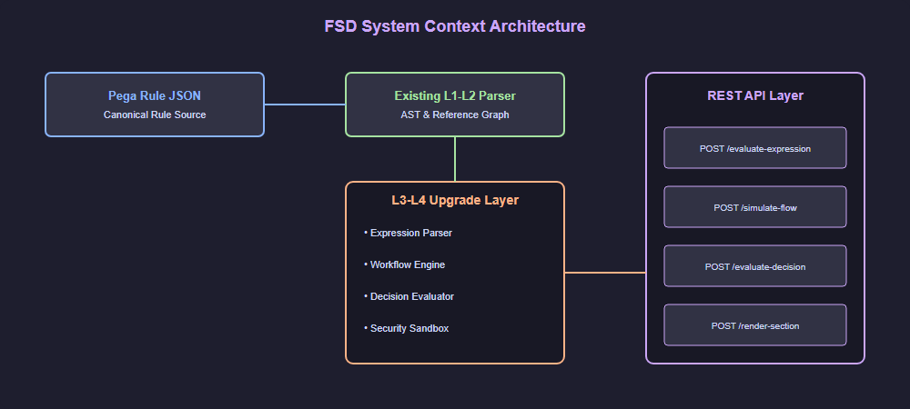
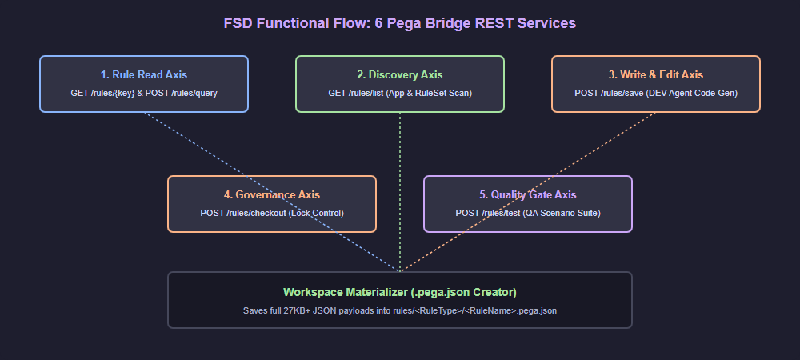
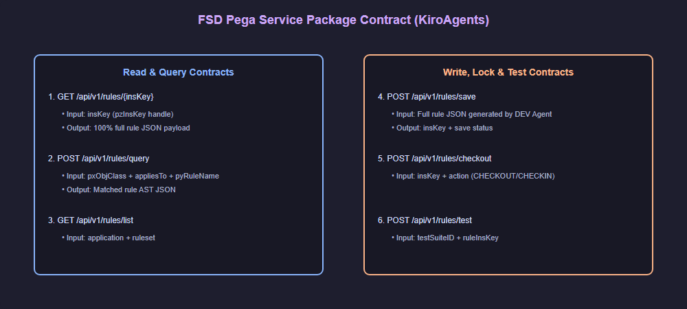
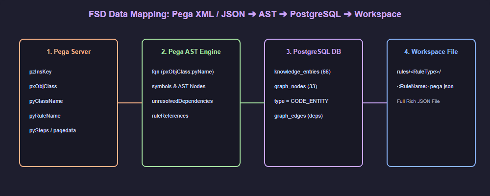

# Functional Specification Document (FSD)

## SDLC Agents 4 Enterprise — SA4E-57: Pega Parser L3-L4 Semantic Understanding & Execution Engine

---

## Document Information

| Field | Value |
|-------|-------|
| Jira Epic | SA4E-57 |
| Title | Pega Parser L3-L4: Semantic Understanding & Execution Engine |
| Author | BA Agent |
| Version | 1.0 |
| Date | 2026-07-27 |
| Status | Draft |
| Related BRD | BRD.md |

---

## Revision History

| Version | Date | Author | Changes |
|---------|------|--------|---------|
| 1.0 | 2026-07-27 | BA Agent | Initiate document — auto-generated from BRD and upgrade plan |

---

## 1. Introduction

### 1.1 Purpose

This FSD specifies the functional requirements for upgrading the Pega parser module from knowledge-level (L1-L2) to semantic understanding and execution (L3-L4). It defines 7 work packages as features, their use cases, API contracts, and data model additions.

### 1.2 Scope

Epic-level specification covering expression parsing/evaluation, workflow simulation, decision table/tree evaluation, UI section rendering, security sandboxing, testing, and deployment. Detailed implementation specifics are in `documents/SA4E-56/pega-parser-upgrade-plan.md`.

### 1.3 Definitions & Acronyms

| Term | Definition |
|------|------------|
| L3 (Semantic) | Understand meaning of expressions, flow shapes, decision conditions |
| L4 (Execution) | Evaluate expressions, simulate workflows, execute decisions |
| Expression AST | Abstract Syntax Tree representing a parsed Pega clipboard expression |
| Flow Graph | Directed graph of workflow shapes connected by edges with conditions |
| Clipboard | Pega's runtime data structure — tree of pages with typed properties |
| Worker Sandbox | Isolated worker_thread for safe expression evaluation |

### 1.4 References

| Document | Location |
|----------|----------|
| BRD | documents/SA4E-57/BRD.md |
| Detailed Upgrade Plan | documents/SA4E-56/pega-parser-upgrade-plan.md |

---

## 2. System Overview

### 2.1 System Context

  

### 2.2 High-Level Architecture

The L3-L4 upgrade adds 5 new modules under `backend/src/modules/pega/` — `expression/`, `workflow/`, `decision/`, `ui/`, `security/`, `deploy/` — extending the existing L1-L2 codebase. All evaluation is in-memory; no new database tables are required.

### 2.3 Visual Diagrams & Architecture Index

| Diagram ID | Title | Description | File Path |
| :--- | :--- | :--- | :--- |
| `fsd-flow` | FSD Functional Flow | High level functional flow across Read, Discovery, Write, Lock, and Quality Gate axes. | [fsd_functional_flow.drawio](./diagrams/fsd_functional_flow.drawio) |
| `fsd-contract` | FSD Pega Service Package Contract | Detailed REST API contracts for all 6 Pega Bridge endpoints. | [fsd_pega_contract.drawio](./diagrams/fsd_pega_contract.drawio) |
| `fsd-mapping` | FSD Data Mapping Pipeline | Data transformation pipeline from Pega Server ➔ AST ➔ PostgreSQL ➔ Workspace `.pega.json`. | [fsd_data_mapping.drawio](./diagrams/fsd_data_mapping.drawio) |

#### 2.3.1 Functional Flow Diagram

  

#### 2.3.2 Pega Service Package REST Contract

  

#### 2.3.3 Data Transformation & Materialization Pipeline

  

---

## 3. Functional Requirements

### 3.1 Feature: Expression Language Parser

**Source:** BRD Story 1

#### 3.1.1 Description

Parse Pega clipboard expression grammar (`.Property`, `@function(args)`, `.AND.`, etc.) into typed ExpressionAST nodes. Walk AST against a clipboard context to produce evaluated values. Support Property-Set, Property-Get, When conditions, constraint rules, and decision table conditions.

#### 3.1.2 Use Case

**Use Case ID:** UC-EXP-01
**Actor:** Developer / System
**Preconditions:** Pega rule JSON with expression strings is available
**Postconditions:** Expression is parsed into AST and evaluated against clipboard context

**Main Flow:**

| Step | Actor | System | Description |
|------|-------|--------|-------------|
| 1 | Developer sends expression string via API | | POST /api/pega/evaluate-expression with expression + clipboard context |
| 2 | | Lexer tokenizes expression | Produces token stream (DOT, IDENTIFIER, STRING, NUMBER, OPERATOR, etc.) |
| 3 | | Parser builds ExpressionAST | Recursive descent parser produces typed AST |
| 4 | | Evaluator walks AST against clipboard | Resolves property refs, calls whitelisted functions |
| 5 | | Returns evaluated value | Typed result (string, number, boolean, null) or error |

**Alternative Flows:**

| ID | Condition | Steps |
|----|-----------|-------|
| AF-EXP-01 | Expression contains unsupported syntax | Parser returns ParseError with line/column and description |
| AF-EXP-02 | Property reference not found in clipboard | Evaluator returns PropertyNotFound error |
| AF-EXP-03 | Expression exceeds max depth (100) | Validator rejects before evaluation |

#### 3.1.3 Business Rules

| Rule ID | Rule | Source |
|---------|------|--------|
| BR-EXP-1 | Expression functions restricted to whitelist: @round, @upper, @lower, @CurrentDate, @If, @NULL, @IsNull | BRD Story 5 AC-2 |
| BR-EXP-2 | Maximum evaluation depth: 100 nested calls | BRD Story 5 AC-3 |
| BR-EXP-3 | Property references support both `.` prefixed (relative) and fully-qualified | BRD Story 1 AC-4 |
| BR-EXP-4 | No `eval()` or `new Function()` — all evaluation is AST-walk | BRD Story 5 AC-6 |

#### 3.1.4 Data Specifications

**Input Data:**

| Field | Type | Required | Validation | Description |
|-------|------|----------|------------|-------------|
| expression | string | Y | Must be valid Pega expression grammar | Clipboard expression to evaluate |
| clipboard | object | Y | Must conform to ClipboardContext schema | Clipboard context with typed pages/properties |
| timeout | number | N | 100-30000ms, default 5000 | Evaluation timeout in ms |

**Output Data:**

| Field | Type | Description |
|-------|------|-------------|
| result | any | Evaluated value (string, number, boolean, null) |
| type | string | Result type: String, Decimal, Integer, Boolean, DateTime, Null |
| ast | object | Parsed expression AST (for debugging) |

#### 3.1.5 API Contract

**Endpoint:** `POST /api/pega/evaluate-expression`
**Purpose:** Evaluate a Pega clipboard expression against a provided clipboard context

**Input Parameters:**

| Parameter | Type | Required | Business Rule | Description |
|-----------|------|----------|---------------|-------------|
| expression | string | Y | BR-EXP-1, BR-EXP-2 | Clipboard expression string |
| clipboard | ClipboardContext | Y | BR-EXP-3 | Clipboard page tree with typed properties |
| timeout | number | N | BRD NFR (5s default) | Evaluation timeout |

**Output Data:**

| Field | Type | Description |
|-------|------|-------------|
| value | any | Evaluated result value |
| valueType | string | Type of the evaluated result |
| trace | ExpressionTrace | Optional evaluation trace for debugging |

**Business Error Scenarios:**

| Scenario | User Message | Trigger Condition |
|----------|-------------|-------------------|
| Parse error | "Parse error at line X, col Y: expected ..." | Invalid expression syntax |
| Property not found | "Property .X.Y not found in clipboard context" | Reference to non-existent property |
| Evaluation timeout | "Evaluation timed out after 5s" | Expression exceeds timeout |
| Function not whitelisted | "Function @xyz is not in the allowed whitelist" | Unknown function call |
| Max depth exceeded | "Expression exceeds max evaluation depth of 100" | Deeply nested expression |

---

### 3.2 Feature: Workflow Interpreter Engine

**Source:** BRD Story 2

#### 3.2.1 Description

Build a directed graph from flow shapes and their connectors. Simulate work item progression through the graph, evaluating routing conditions, handling assignments, approvals, SLAs, and subprocesses.

#### 3.2.2 Use Case

**Use Case ID:** UC-WF-01
**Actor:** Business Analyst / System
**Preconditions:** Flow rule JSON with shapes and connectors is available
**Postconditions:** Workflow simulation completes with work item state track

**Main Flow:**

| Step | Actor | System | Description |
|------|-------|--------|-------------|
| 1 | BA sends flow JSON via API | | POST /api/pega/simulate-flow with flow definition + initial clipboard |
| 2 | | FlowGraphBuilder parses shapes + connectors | Builds directed graph with edge conditions |
| 3 | | WorkflowEngine initializes WorkItem | WorkItem at Start shape with empty history |
| 4 | | Engine advances through graph | Evaluates routing conditions using expression engine |
| 5 | | Shape handlers process each shape | Assign → work party, Route → condition eval, Approval → stage logic |
| 6 | | Returns simulation result | WorkItem state with history, current node, assignments, SLA data |

**Alternative Flows:**

| ID | Condition | Steps |
|----|-----------|-------|
| AF-WF-01 | Connector condition evaluates false — no path matches | Engine returns "no matching path" error at that node |
| AF-WF-02 | Approval rejected | Engine records rejection, follows rejection path if defined |
| AF-WF-03 | SLA deadline exceeded | SLA engine triggers escalation logic |

#### 3.2.3 Business Rules

| Rule ID | Rule | Source |
|---------|------|--------|
| BR-WF-1 | Flow shapes supported: Assign, Route, Approval, Utility, Subprocess, Wait, Notification, SLA | BRD Story 2 AC-2 |
| BR-WF-2 | Work item states: Idle, InProgress, Resolved, Failed, TimedOut | BRD Story 2 AC-5 |
| BR-WF-3 | SLA engine calculates goal/deadline/urgency from flow configuration | BRD Story 2 AC-4 |
| BR-WF-4 | Routing conditions evaluated via Expression Language Parser | BRD Story 2 AC-3 |

#### 3.2.4 API Contract

**Endpoint:** `POST /api/pega/simulate-flow`
**Purpose:** Simulate workflow execution through a Pega flow graph

**Input Parameters:**

| Parameter | Type | Required | Business Rule | Description |
|-----------|------|----------|---------------|-------------|
| flowJson | object | Y | BR-WF-1 | Full flow rule JSON with shapes and connectors |
| initialClipboard | ClipboardContext | N | | Starting clipboard state |
| startShapeId | string | N | | Shape ID to start from (default: flow Start shape) |

**Output Data:**

| Field | Type | Description |
|-------|------|-------------|
| workItem | WorkItem | Final work item state (history, current node, SLA) |
| trace | array | Ordered list of shape visits with timestamps |
| completed | boolean | Whether the flow reached an End shape |

**Business Error Scenarios:**

| Scenario | User Message | Trigger Condition |
|----------|-------------|-------------------|
| Unsupported shape | "Shape type XYZ is not supported" | Unknown shape type in flow |
| No route found | "No matching path from shape X — all conditions evaluated false" | All connector conditions false |
| Subprocess not found | "Referenced subprocess Y not found" | Subprocess shape references missing flow |

---

### 3.3 Feature: Decision Table/Tree Evaluator

**Source:** BRD Story 3

#### 3.3.1 Description

Evaluate Pega decision tables (priority-ordered rows with conditions) and decision trees (conditional branching) against input values. Support exact match, range, set membership, null check operators. Return matched row ID, output value, and trace path.

#### 3.3.2 Use Case

**Use Case ID:** UC-DT-01
**Actor:** Rules Analyst / System
**Preconditions:** Decision table/tree rule JSON is available
**Postconditions:** Decision evaluation completes with matched result and trace

**Main Flow:**

| Step | Actor | System | Description |
|------|-------|--------|-------------|
| 1 | Analyst sends decision JSON via API | | POST /api/pega/evaluate-decision with decision definition + input values |
| 2 | | DecisionTableEvaluator iterates rows | Evaluates rows in priority order (first match wins) |
| 3 | | Condition operators match against inputs | Supports =, <>, >, <, >=, <=, IN, NOT IN, IS NULL, IS BLANK |
| 4 | | Returns evaluation result | Matched row ID, output values, trace path |
| 5 | | DecisionTreeEvaluator traverses nodes | Recursive evaluation with depth limit (50) |

**Alternative Flows:**

| ID | Condition | Steps |
|----|-----------|-------|
| AF-DT-01 | No row matches all conditions | Return default result or error |
| AF-DT-02 | Strategy component reference found | Resolve lazily via PegaStrategyComponentResolver |
| AF-DT-03 | Decision tree depth exceeds limit | Return error with max depth message |

#### 3.3.3 Business Rules

| Rule ID | Rule | Source |
|---------|------|--------|
| BR-DT-1 | Decision table rows evaluated in priority order (first match wins) | BRD Story 3 AC-1 |
| BR-DT-2 | Condition operators: =, <>, >, <, >=, <=, IN, NOT IN, IS NULL, IS BLANK | BRD Story 3 AC-2 |
| BR-DT-3 | Decision tree max depth: 50 levels | TDD decision design |
| BR-DT-4 | Max decision table rows: 10,000; Max eval time: 5s | BRD Story 5 AC-4 |

#### 3.3.4 API Contract

**Endpoint:** `POST /api/pega/evaluate-decision`
**Purpose:** Evaluate a decision table or tree against input values

**Input Parameters:**

| Parameter | Type | Required | Business Rule | Description |
|-----------|------|----------|---------------|-------------|
| decisionJson | object | Y | BR-DT-1, BR-DT-2 | Decision table/tree JSON |
| inputValues | Record<string, any> | Y | | Input values keyed by property name |
| type | string | Y | | "table" or "tree" |

**Output Data:**

| Field | Type | Description |
|-------|------|-------------|
| matched | boolean | Whether a matching row/branch was found |
| result | any | Output value(s) from matched row/leaf |
| matchedRowId | string | ID of matched row or leaf node |
| trace | array | Evaluation path through rows or tree nodes |
| defaultUsed | boolean | Whether default result was used (no match) |

**Business Error Scenarios:**

| Scenario | User Message | Trigger Condition |
|----------|-------------|-------------------|
| Table too large | "Decision table exceeds maxRows limit of 10,000" | Row count exceeds limit |
| Evaluation timeout | "Decision evaluation timed out after 5s" | Exceeds maxEvalTime |
| Condition parse error | "Unable to parse condition at row X" | Invalid condition syntax |

---

### 3.4 Feature: Section/Harness UI Preview

**Source:** BRD Story 4

#### 3.4.1 Description

Render Pega UI sections and harnesses as static HTML previews. Map layout types (Dynamic, Tab, Repeating, Column) to CSS structures. Resolve field references, apply visibility conditions, assemble harnesses.

#### 3.4.2 Use Case

**Use Case ID:** UC-UI-01
**Actor:** UI Designer / System
**Preconditions:** Section/harness rule JSON with layout definitions is available
**Postconditions:** Static HTML preview is generated

**Main Flow:**

| Step | Actor | System | Description |
|------|-------|--------|-------------|
| 1 | UI designer sends section JSON | | POST /api/pega/render-section |
| 2 | | SectionRenderer parses layout tree | Identifies layout types and field references |
| 3 | | LayoutRenderers map to HTML | Dynamic → CSS Grid, Tab → tabs, Repeating → table |
| 4 | | FieldRenderer resolves property metadata | Shows property name + type |
| 5 | | Returns static HTML with inline CSS | No JavaScript dependency |

#### 3.4.3 Business Rules

| Rule ID | Rule | Source |
|---------|------|--------|
| BR-UI-1 | Layout types supported: Dynamic, Tab, Repeating, Column, Table | BRD Story 4 AC-1 |
| BR-UI-2 | All user-facing values HTML-escaped (XSS prevention) | BRD Story 4 AC-6 |
| BR-UI-3 | Visibility conditions evaluated via Expression Parser | BRD Story 4 AC-3 |
| BR-UI-4 | Output is static HTML with inline CSS only | BRD Story 4 AC-5 |

---

### 3.5 Feature: Security Hardening

**Source:** BRD Story 5

#### 3.5.1 Description

Sandbox expression evaluation in isolated worker_threads with configurable timeout. Enforce function whitelist, depth limits, row limits, and HTML sanitization. Prevent code execution, DoS, and XSS attacks.

#### 3.5.2 Business Rules

| Rule ID | Rule | Source |
|---------|------|--------|
| BR-SEC-1 | Expression evaluator runs in sandboxed worker_thread | BRD Story 5 AC-1 |
| BR-SEC-2 | Sandbox timeout: 5s (configurable) | BRD Story 5 AC-1 |
| BR-SEC-3 | Function callables restricted to whitelist | BRD Story 5 AC-2 |
| BR-SEC-4 | Max evaluation depth: 100 nested calls | BRD Story 5 AC-3 |
| BR-SEC-5 | Decision table max rows: 10,000; max eval time: 5s | BRD Story 5 AC-4 |
| BR-SEC-6 | No `eval()` or `new Function()` | BRD Story 5 AC-6 |
| BR-SEC-7 | Rate limiter limits concurrent evaluations | BRD Story 5 AC-7 |

---

### 3.6 Feature: Test Strategy

**Source:** BRD WP6

#### 3.6.1 Description

Comprehensive test strategy across 6 levels: Unit, Integration, System (SIT), User Acceptance (UAT), Security, and Performance testing. Property-based testing with fast-check for expression evaluator. Snapshot testing for UI renderer.

---

### 3.7 Feature: Deployment & Performance

**Source:** BRD WP7

#### 3.7.1 Description

Worker pool management for CPU-bound evaluation. LRU evaluation cache (1000 entries). Configurable deployment mode (in-process vs worker-pool). Performance benchmarks for all evaluation operations.

---

## 4. Data Model

### 4.1 Logical Entities

#### Entity: ExpressionAST

| Attribute | Type | Required | Business Rule | Description |
|-----------|------|----------|---------------|-------------|
| nodeType | enum | Y | | PropertyRef, FunctionCall, StringLiteral, NumberLiteral, BinaryOp, UnaryOp, NullLiteral |
| children | ExpressionAST[] | N | | Child AST nodes |
| value | any | N | BR-EXP-1 | Evaluated value (populated after evaluation) |

#### Entity: ClipboardContext

| Attribute | Type | Required | Business Rule | Description |
|-----------|------|----------|---------------|-------------|
| pages | Map<string, Page> | Y | BR-EXP-3 | Nested page tree with parent references |
| currentPage | string | Y | | Reference to current page context |

#### Entity: FlowGraph

| Attribute | Type | Required | Business Rule | Description |
|-----------|------|----------|---------------|-------------|
| nodes | ShapeNode[] | Y | BR-WF-1 | Flow shapes with type and properties |
| edges | Connector[] | Y | BR-WF-4 | Directed connections with conditions |

#### Entity: WorkItem

| Attribute | Type | Required | Business Rule | Description |
|-----------|------|----------|---------------|-------------|
| state | enum | Y | BR-WF-2 | Idle, InProgress, Resolved, Failed, TimedOut |
| history | array | Y | | Ordered list of visited shape IDs |
| assignments | array | N | | Current/past assignments |
| slaData | object | N | BR-WF-3 | Goal/deadline timers |

#### Entity: DecisionResult

| Attribute | Type | Required | Business Rule | Description |
|-----------|------|----------|---------------|-------------|
| matched | boolean | Y | BR-DT-1 | Whether a match was found |
| result | any | Y | | Output from matched row/leaf |
| trace | array | Y | | Evaluation trace path |
| matchedRowId | string | N | | ID of matched row/node |

---

## 5. Integration Specifications

### 5.1 Internal: Pega Expression Parser (WP1) → Workflow Engine (WP2)

| Attribute | Value |
|-----------|-------|
| Purpose | Route conditions, assignment routing expressions evaluated by Expression Parser |
| Direction | WP2 calls WP1 Evaluator |
| Data Format | ExpressionAST + ClipboardContext |
| Frequency | Real-time per routing decision |

### 5.2 Internal: Expression Parser (WP1) → Decision Evaluator (WP3)

| Attribute | Value |
|-----------|-------|
| Purpose | Decision condition predicates parsed as expressions |
| Direction | WP3 calls WP1 Parser for condition strings |
| Data Format | ExpressionAST |
| Frequency | Real-time per row/node evaluation |

### 5.3 Internal: Expression Parser (WP1) → UI Renderer (WP4)

| Attribute | Value |
|-----------|-------|
| Purpose | Visibility conditions evaluated via Expression Evaluator |
| Direction | WP4 calls WP1 Evaluator |
| Data Format | ExpressionAST + ClipboardContext |
| Frequency | Real-time per field/section |

---

## 6. Processing Logic

### 6.1 Expression Evaluation Pipeline

**Trigger:** API call to POST /api/pega/evaluate-expression
**Input:** Expression string + ClipboardContext
**Output:** Evaluated value or error

**Processing Steps:**

| Step | Description | Error Handling |
|------|-------------|----------------|
| 1 | Input validation: check expression is non-empty, within length limit | Return 400 with validation error |
| 2 | Lexer tokenizes expression string | Return ParseError with line/col if invalid |
| 3 | Parser builds ExpressionAST | Return ParseError with details if invalid |
| 4 | ExpressionValidator checks depth, function whitelist | Return ValidationError if checks fail |
| 5 | Sandbox dispatches to worker_thread | Return TimeoutError if exceeded |
| 6 | Evaluator walks AST against clipboard | Return EvaluationError with details |
| 7 | Return typed result | |

### 6.2 Workflow Simulation Pipeline

**Trigger:** API call to POST /api/pega/simulate-flow
**Input:** Flow JSON + optional clipboard
**Output:** WorkItem state with history

**Processing Steps:**

| Step | Description | Error Handling |
|------|-------------|----------------|
| 1 | FlowGraphBuilder parses shapes + connectors into graph | Return error if graph malformed |
| 2 | WorkflowEngine initializes WorkItem at Start shape | |
| 3 | Engine enters main loop: get current node, find handler | |
| 4 | Shape handler processes node (Assign, Route, etc.) | Return UnsupportedShape error |
| 5 | For Route: evaluate connector conditions using expression engine | Return NoRouteFound if all false |
| 6 | Advance to next shape(s), update WorkItem state | |
| 7 | Repeat until End shape or error | |
| 8 | Return final WorkItem state | |

### 6.3 Decision Evaluation Pipeline

**Trigger:** API call to POST /api/pega/evaluate-decision
**Input:** Decision JSON + input values
**Output:** DecisionResult with matched row/trace

**Processing Steps:**

| Step | Description | Error Handling |
|------|-------------|----------------|
| 1 | Validate decision type (table or tree) and structure | Return 400 if invalid |
| 2 | If table: iterate rows in priority order; If tree: recursive traversal | |
| 3 | For each row/node: parse condition(s) via ConditionParser | Return ConditionParseError |
| 4 | Match condition operators against input values | |
| 5 | If match: return result + trace | |
| 6 | If no match: check for default result | Return NoMatchError if no default |

---

## 7. Security Requirements

### 7.1 Authentication & Authorization

| Role | Permissions | Features |
|------|-------------|----------|
| Developer | All | Expression eval, workflow sim, decision eval, UI preview |
| BA | Read/Execute | Workflow sim, decision eval |
| QA | Read/Execute | All test endpoints |
| System (internal) | All | Inter-module calls via internal API |

### 7.2 Data Sensitivity Classification

| Data Type | Classification | Requirement |
|-----------|---------------|-------------|
| Expression strings | Internal | May contain business logic — not user-facing |
| Clipboard context | Internal | Simulated data only — no PII expected |
| HTML preview output | Public | All values HTML-escaped |

### 7.3 Audit Trail

| Event | Logged Fields | Retention |
|-------|--------------|-----------|
| Expression evaluation | expression hash, result type, duration | 30 days |
| Workflow simulation | flow ID, shapes visited, state transitions | 30 days |
| Decision evaluation | decision type, matched row count | 30 days |
| Sandbox timeout | expression hash, duration, worker ID | 90 days |

---

## 8. Non-Functional Requirements

| Category | Business Requirement | Acceptance Criteria |
|----------|---------------------|---------------------|
| Performance | Simple expression evaluation | < 1ms |
| Performance | Decision table (100 rows, 5 conditions) | < 200ms |
| Performance | Workflow simulation (50 shapes) | < 500ms |
| Performance | UI section render (100 fields) | < 200ms |
| Security | Expression sandbox timeout | 5s (configurable) |
| Security | Max expression depth | 100 |
| Security | Max decision table rows | 10,000 |
| Concurrency | Worker pool size | max(1, os.cpus().length - 1) |

---

## 9. Error Handling (User-Facing)

### 9.1 Error Scenarios

| Scenario | Severity | User Message | Expected Behavior |
|----------|----------|-------------|-------------------|
| Expression parse error | Warning | "Parse error at line X, col Y: {detail}" | User corrects expression |
| Expression timeout | Warning | "Evaluation timed out after {N}s" | User simplifies expression or increases timeout |
| Unsupported shape | Warning | "Shape type {type} is not supported" | User checks flow for unsupported shapes |
| Decision table too large | Warning | "Table exceeds 10,000 rows — evaluation rejected" | User reduces row count |
| Security violation | Critical | "Expression rejected by security validator" | Log and alert security team |

---

## 10. Testing Considerations

### 10.1 Test Scenarios

| ID | Scenario | Input | Expected Output | Priority |
|----|----------|-------|-----------------|----------|
| TC-EXP-01 | Simple property reference | `.Customer.Name` + clipboard | "John Doe" | High |
| TC-EXP-02 | Function call | `@upper(.Name)` | "JOHN" | High |
| TC-WF-01 | Basic flow Assign→Route→End | Flow with 3 shapes | WorkItem with history [Start,Assign,Route,End] | High |
| TC-DT-01 | Decision table exact match | 3 rows, 2 conditions | First matching row output | High |
| TC-SEC-01 | Expression injection attempt | Expression with `process.exit()` | ValidationError | Critical |

---

## 11. Appendix

### 11.1 Reference to Detailed Plan

For implementation details, component specifications, file structure, and effort estimates, see:
`documents/SA4E-56/pega-parser-upgrade-plan.md`

### 11.2 Change Log from BRD

No deviations from BRD. The BRD's 7 work packages map directly to the 7 features in this FSD.
