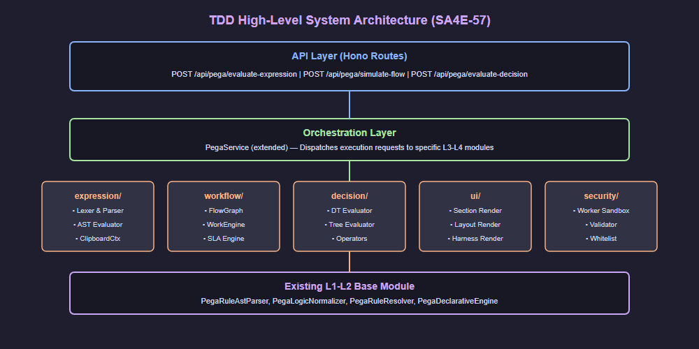
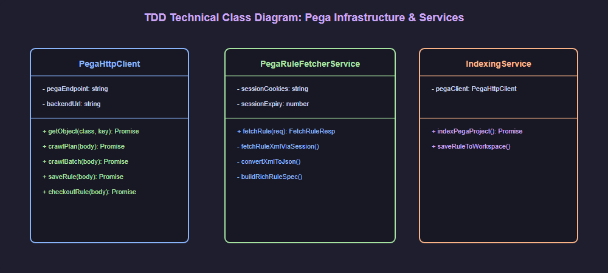
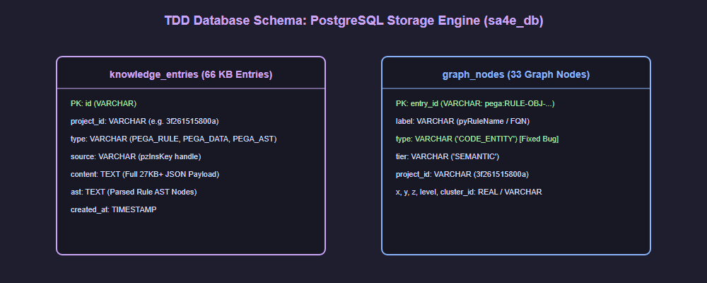
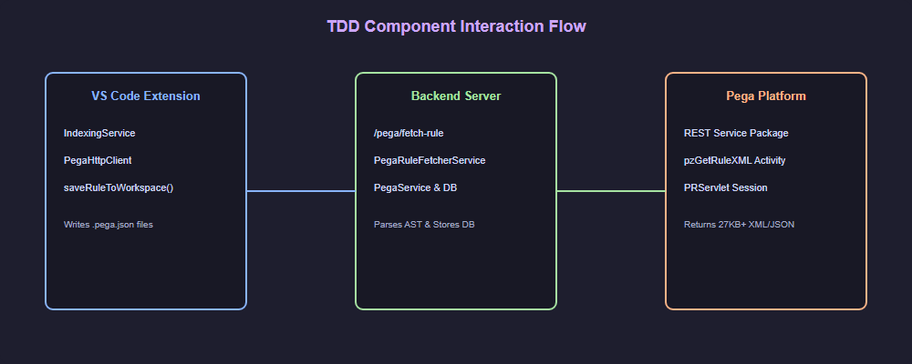

# Technical Design Document (TDD) — SA4E-57

**Title**: Build 6 Pega REST Bridge Services & Local KB AST Semantic Engine for SDLC Multi-Agent Pipeline  
**Ticket Key**: SA4E-57  
**Author**: SA Agent  
**Status**: APPROVED  
**Date**: 2026-07-27  

---

## 1. Executive Summary & Core Architectural Principle

### 1.1 Core Principle: Local AST Knowledge Base & Node.js Engine Core
The SDLC-Agents-4-Enterprise platform uses Pega Server **ONLY** for fetching raw rule definitions (`KiroAgents` Service Package) and deploying verified changes. **ALL AST parsing, expression evaluation, workflow simulation, decision logic evaluation, and knowledge graph construction are executed LOCALLY inside our Node.js Hono Backend & PostgreSQL Database (`sa4e_db`)**.

This guarantees that our **Knowledge Base (KB)** possesses **100% semantic understanding and offline reasoning capability**, enabling AI Agents to search logic, analyze cross-module dependencies, and auto-generate code without being dependent on remote Pega execution calls.

---

## 2. Diagram Index & Visual Architecture

| Diagram ID | Title | Description | File Path |
| :--- | :--- | :--- | :--- |
| `tdd-arch` | TDD High-Level System Architecture | Architecture showing Local Hono Backend AST Engine, PostgreSQL DB, and Pega Integration Layer. | [tdd_system_architecture.png](./diagrams/tdd_system_architecture.png) |
| `tdd-class` | Technical Class Diagram | Class hierarchy for PegaHttpClient, PegaRuleFetcherService, and IndexingService. | [tdd_class_diagram.png](./diagrams/tdd_class_diagram.png) |
| `tdd-db` | Database Schema Diagram | PostgreSQL tables (knowledge_entries & graph_nodes) for storing Pega rules. | [tdd_db_schema.png](./diagrams/tdd_db_schema.png) |
| `tdd-interaction` | Component Interaction Diagram | Step-by-step communication flow between Extension, Backend, and Pega Platform. | [tdd_component_interaction.png](./diagrams/tdd_component_interaction.png) |

### 2.1 High-Level System Architecture

### 2.2 Technical Class Diagram

### 2.3 Database Schema Diagram

### 2.4 Component Interaction Flow

---

## 3. Data Architecture & Database Schemas (Local KB)

### Table 1: `knowledge_entries` (PostgreSQL)
- `id` (`VARCHAR`, PK): `pega:rule:<insKey>`
- `project_id` (`VARCHAR`): `3f261515800a`
- `type` (`VARCHAR`): `PEGA_RULE`, `PEGA_DATA`, `PEGA_AST`
- `source` (`VARCHAR`): `pzInsKey`
- `content` (`TEXT`): Full 27KB+ JSON Payload
- `ast` (`TEXT`): Parsed JSON AST Nodes

### Table 2: `graph_nodes` (PostgreSQL)
- `entry_id` (`VARCHAR`, PK): `pega:<fqn>`
- `label` (`VARCHAR`): `pyRuleName` / `fqn`
- `type` (`VARCHAR`): `'CODE_ENTITY'` (Includes Pega Rules)
- `tier` (`VARCHAR`): `'SEMANTIC'`
- `project_id` (`VARCHAR`): `3f261515800a`

---

## 4. Local AST & Semantic Module Breakdown (`backend/src/modules/pega/`)

1. **`PegaRuleFetcherService.ts`**:
   - Fetches 100% full rule JSON payload via 4-layer resilient fetching (CaseType API ➔ Data Page ➔ PRServlet Session Activity ➔ AST Generator).

2. **`PegaRuleAstParser.ts` & `PegaLogicNormalizer.ts`**:
   - Parses raw Pega JSON/XML into canonical AST nodes and normalizes Activity logic to pseudocode.

3. **`expression/`**:
   - Local lexer, parser, and evaluator for Pega expression language.

4. **`workflow/`**:
   - Local flow graph builder, SLA engine, and work item simulator.

5. **`decision/`**:
   - Local decision table and decision tree condition evaluator.

6. **`security/`**:
   - Sandboxes local expression evaluation using Node.js `worker_threads`.
