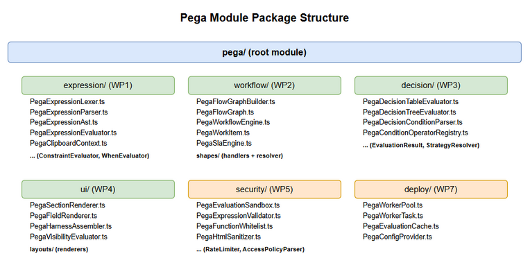
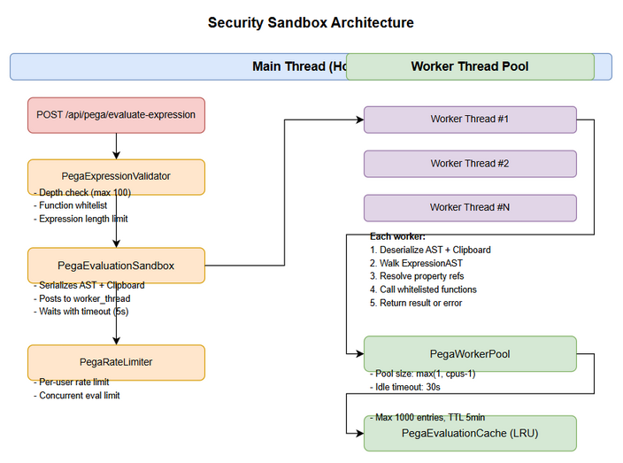

# Technical Design Document (TDD)

## SDLC Agents 4 Enterprise — SA4E-57: Pega Parser L3-L4 Semantic Understanding & Execution Engine

---

## Document Information

| Field | Value |
|-------|-------|
| Jira Ticket | SA4E-57 |
| Title | Pega Parser L3-L4: Semantic Understanding & Execution Engine |
| Author | SA Agent |
| Version | 1.0 |
| Date | 2026-07-27 |
| Status | Draft |
| Related BRD | BRD.md |
| Related FSD | FSD.md |

---

## Revision History

| Version | Date | Author | Changes |
|---------|------|--------|---------|
| 1.0 | 2026-07-27 | SA Agent | Initiate document — auto-generated from BRD, FSD, and upgrade plan |

---

## 1. Introduction

### 1.1 Purpose

This TDD specifies the technical architecture, module structure, key interfaces, and design patterns for upgrading the Pega parser module from L1-L2 to L3-L4 capabilities. It covers all 7 work packages: expression parser, workflow engine, decision evaluator, UI renderer, security sandbox, test strategy, and deployment.

### 1.2 Scope

Technical scope covers 5 new module directories (`expression/`, `workflow/`, `decision/`, `ui/`, `security/`, `deploy/`) under `backend/src/modules/pega/`, extending existing L1-L2 classes. All evaluation is in-memory — no new database tables.

### 1.3 Technology Stack

| Layer | Technology | Version |
|-------|-----------|---------|
| Language | TypeScript | 5.x |
| Runtime | Node.js | 18+ |
| Framework | Hono | 4.x |
| Database | Better-SQLite3 / PostgreSQL | Existing |
| Test Runner | vitest | Latest |
| Property Testing | fast-check | Already in devDeps |
| Worker Threads | built-in | Node 18+ |

### 1.4 Design Principles

- SOLID — Single Responsibility for each module (lexer, parser, evaluator separate)
- Strategy Pattern — Shape handlers, layout renderers, condition operators
- Visitor Pattern — Expression AST nodes implement `evaluate(context): Value`
- Registry Pattern — Condition operators, layout renderers, shape handlers registered dynamically
- No `eval()` or `new Function()` — all evaluation is AST-walk

### 1.5 Constraints

- No connection to real Pega Platform runtime
- No pixel-perfect UI rendering — structural HTML preview only
- No ML/AI decisioning (adaptive models, scorecards)
- No real-time SLA timer evaluation (simulated only)
- All evaluation is CPU-bound, must not block main HTTP thread

### 1.6 References

| Document | Location |
|----------|----------|
| BRD | documents/SA4E-57/BRD.md |
| FSD | documents/SA4E-57/FSD.md |
| Detailed Upgrade Plan | documents/SA4E-56/pega-parser-upgrade-plan.md |

---

## 2. System Architecture

### 2.1 Architecture Overview

The L3-L4 upgrade extends the existing pega module with 5 new submodules. The architecture follows a layered design:


<p align="center">
  
</p>

### 2.2 Component Diagram

| Component | Responsibility | Technology |
|-----------|---------------|------------|
| PegaExpressionLexer | Tokenizes clipboard expression strings | TypeScript class |
| PegaExpressionParser | Recursive descent parser → ExpressionAST | TypeScript class |
| PegaExpressionEvaluator | Walks AST against ClipboardContext → Value | TypeScript class |
| PegaClipboardContext | Tree of pages with typed properties and parent refs | TypeScript class |
| PegaFlowGraphBuilder | Parses flow shapes + connectors → directed graph | TypeScript class |
| PegaWorkflowEngine | Orchestrates work item progression through flow graph | TypeScript class |
| PegaShapeHandler | Abstract base + per-type implementations | Strategy pattern |
| PegaSlaEngine | Calculates goal/deadline from SLA config | TypeScript class |
| PegaDecisionTableEvaluator | Iterates rows, matches conditions, returns result | TypeScript class |
| PegaDecisionTreeEvaluator | Recursive tree traversal to leaf result | TypeScript class |
| PegaDecisionConditionParser | Parses condition strings into operator + operands | TypeScript class |
| PegaConditionOperatorRegistry | Registry of condition operator handlers | Registry pattern |
| PegaSectionRenderer | Main orchestrator for UI → HTML rendering | TypeScript class |
| PegaLayoutRenderer | Abstract base + per-type layout renderers | Strategy pattern |
| PegaFieldRenderer | Renders field → label + value HTML | TypeScript class |
| PegaHarnessAssembler | Assembles header + content + footer sections | TypeScript class |
| PegaEvaluationSandbox | Wraps evaluator in worker_thread with timeout | Node.js worker_threads |
| PegaExpressionValidator | Pre-evaluation checks (depth, whitelist) | TypeScript class |
| PegaFunctionWhitelist | Registry of allowed function names | TypeScript class |
| PegaHtmlSanitizer | Escapes HTML in UI renderer output | TypeScript class |
| PegaRateLimiter | Limits concurrent evaluations | TypeScript class |
| PegaWorkerPool | Manages worker_thread pool | Node.js worker_threads |
| PegaEvaluationCache | LRU cache for evaluation results | TypeScript class |
| PegaConfigProvider | Reads deployment mode from config | TypeScript class |

### 2.3 Communication Patterns

| From | To | Protocol | Pattern | Description |
|------|----|----------|---------|-------------|
| Hono Routes | PegaService (extended) | In-process call | Sync | API handlers call service layer |
| PegaService | Expression/Workflow/Decision modules | In-process call | Sync | Dispatch based on request type |
| PegaEvaluationSandbox | Worker thread | IPC (postMessage) | Async + Timeout | Serialized AST + clipboard context |
| Worker Pool | Individual workers | IPC | Async | Task dispatch with timeout callback |
| WP2/WP3/WP4 | WP1 Expression Evaluator | In-process call | Sync | Route conditions, decision predicates, visibility conditions |

---

## 3. API Design

### 3.1 API Overview

| # | Endpoint | Method | Description | Source |
|---|----------|--------|-------------|--------|
| 1 | /api/pega/evaluate-expression | POST | Evaluate a clipboard expression | UC-EXP-01 |
| 2 | /api/pega/simulate-flow | POST | Simulate workflow execution | UC-WF-01 |
| 3 | /api/pega/evaluate-decision | POST | Evaluate decision table/tree | UC-DT-01 |

### 3.2 API: Evaluate Expression

**Implements:** UC-EXP-01, BR-EXP-1 through BR-EXP-4

| Attribute | Value |
|-----------|-------|
| Method | POST |
| Path | /api/pega/evaluate-expression |
| Auth | Bearer Token |
| Rate Limit | 100 requests/minute per user |

**Request Headers:**

| Header | Required | Description |
|--------|----------|-------------|
| Authorization | Yes | Bearer {token} |
| Content-Type | Yes | application/json |

**Request Body:**
```json
{
  "expression": "@upper(.Customer.Name)",
  "clipboard": {
    "pages": {
      "pyWorkPage": {
        "Customer": {
          "Name": { "type": "Text", "value": "John Doe" }
        }
      }
    },
    "currentPage": "pyWorkPage"
  },
  "timeout": 5000
}
```

**Response — 200 OK:**
```json
{
  "value": "JOHN DOE",
  "valueType": "Text",
  "trace": {
    "ast": { "nodeType": "FunctionCall", "name": "@upper", "args": [...] },
    "steps": ["resolve .Customer.Name → 'John Doe'", "@upper('John Doe') → 'JOHN DOE'"]
  }
}
```

**Error Responses:**

| Status | Code | Message | Description |
|--------|------|---------|-------------|
| 400 | PARSE_ERROR | Parse error at line 1, col 8: expected IDENTIFIER | Invalid expression syntax |
| 400 | PROPERTY_NOT_FOUND | Property .Customer.Age not found in clipboard | Missing property in context |
| 400 | FUNCTION_NOT_ALLOWED | Function @dangerous is not whitelisted | Unknown function call |
| 408 | TIMEOUT | Evaluation timed out after 5000ms | Expression exceeded timeout |
| 422 | VALIDATION_ERROR | Expression exceeds max depth of 100 | Deeply nested expression |

### 3.3 API: Simulate Flow

**Implements:** UC-WF-01, BR-WF-1 through BR-WF-4

| Attribute | Value |
|-----------|-------|
| Method | POST |
| Path | /api/pega/simulate-flow |
| Auth | Bearer Token |
| Rate Limit | 20 requests/minute per user |

**Request Body:**
```json
{
  "flowJson": {
    "pyShapes": [...],
    "pyConnectors": [...],
    "pyClassName": "TGB-HRApps-Work-Candidate"
  },
  "initialClipboard": {},
  "startShapeId": "start123"
}
```

**Response — 200 OK:**
```json
{
  "workItem": {
    "state": "Resolved",
    "currentShapeId": null,
    "history": [
      { "shapeId": "start123", "type": "Start", "timestamp": "2026-07-27T12:00:00Z" },
      { "shapeId": "assign456", "type": "Assign", "timestamp": "2026-07-27T12:00:01Z" },
      { "shapeId": "route789", "type": "Route", "timestamp": "2026-07-27T12:00:02Z" },
      { "shapeId": "end012", "type": "End", "timestamp": "2026-07-27T12:00:03Z" }
    ],
    "assignments": [
      { "actor": "Operator:ManagerRole", "deadline": "2026-07-28T12:00:00Z" }
    ],
    "slaData": { "goalTime": "4h", "deadline": "8h", "urgency": 10 }
  },
  "completed": true,
  "trace": [
    { "shapeId": "start123", "action": "enter", "result": "ok" },
    { "shapeId": "assign456", "action": "assign", "result": "assigned to ManagerRole" },
    { "shapeId": "route789", "action": "route", "result": "condition .Status = 'Approved' → true" },
    { "shapeId": "end012", "action": "complete", "result": "flow resolved" }
  ]
}
```

### 3.4 API: Evaluate Decision

**Implements:** UC-DT-01, BR-DT-1 through BR-DT-4

| Attribute | Value |
|-----------|-------|
| Method | POST |
| Path | /api/pega/evaluate-decision |
| Auth | Bearer Token |
| Rate Limit | 50 requests/minute per user |

**Request Body:**
```json
{
  "decisionJson": {
    "pyDecisionTableRows": [
      { "pyRowNumber": 1, "pyConditions": [...], "pyResults": [...] },
      { "pyRowNumber": 2, "pyConditions": [...], "pyResults": [...] }
    ]
  },
  "inputValues": {
    ".Customer.Status": "Gold",
    ".Order.Amount": 1500
  },
  "type": "table"
}
```

**Response — 200 OK:**
```json
{
  "matched": true,
  "result": { "Discount": 15, "Priority": "High" },
  "matchedRowId": "row2",
  "trace": [
    { "row": 1, "result": "no-match", "reason": "condition .Customer.Status = 'Gold' failed" },
    { "row": 2, "result": "match", "matchedConditions": [".Customer.Status = 'Gold'", ".Order.Amount > 1000"] }
  ],
  "defaultUsed": false
}
```

---

## 4. Database Design

### 4.1 Schema Overview

No new database tables are required. All L3-L4 evaluation is in-memory. The existing database (Better-SQLite3/PostgreSQL) is used only for the original L1-L2 indexing pipeline.

### 4.2 In-Memory Data Structures

All evaluation data is transient:

| Structure | Purpose | Lifespan |
|-----------|---------|----------|
| ExpressionAST | Parsed expression tree | Request lifetime |
| ClipboardContext | Page tree with typed properties | Request lifetime |
| FlowGraph | Directed graph of flow shapes | Request lifetime |
| WorkItem | Workflow simulation state | Request lifetime |
| DecisionResult | Evaluation result with trace | Request lifetime |
| EvaluationCache (LRU) | Cached expression results | Application lifetime (1000 entries) |

---

## 5. Class / Module Design

### 5.1 Package Structure

```
backend/src/modules/pega/
├── (existing L1-L2 files)
│   ├── PegaRuleAstParser.ts
│   ├── PegaLogicNormalizer.ts
│   ├── PegaRuleResolver.ts
│   ├── PegaDeclarativeEngine.ts
│   ├── PegaCrawler.ts
│   ├── PegaParser.ts
│   ├── PegaService.ts
│   ├── models.ts
│   └── domain/
│
├── expression/                        # NEW — WP1: Expression Language Parser
│   ├── PegaExpressionLexer.ts
│   ├── PegaExpressionParser.ts
│   ├── PegaExpressionAst.ts
│   ├── PegaExpressionEvaluator.ts
│   ├── PegaClipboardContext.ts
│   ├── PegaConstraintEvaluator.ts
│   └── PegaWhenEvaluator.ts
│
├── workflow/                          # NEW — WP2: Workflow Interpreter
│   ├── PegaFlowGraphBuilder.ts
│   ├── PegaFlowGraph.ts
│   ├── PegaWorkflowEngine.ts
│   ├── PegaWorkItem.ts
│   ├── PegaSlaEngine.ts
│   ├── PegaWorkPartyResolver.ts
│   └── shapes/
│       ├── PegaShapeHandler.ts         (abstract base)
│       ├── PegaAssignHandler.ts
│       ├── PegaRouteHandler.ts
│       ├── PegaApprovalHandler.ts
│       └── ... (Utility, Subprocess, Wait, Notification)
│
├── decision/                          # NEW — WP3: Decision Table/Tree Evaluator
│   ├── PegaDecisionTableEvaluator.ts
│   ├── PegaDecisionTreeEvaluator.ts
│   ├── PegaDecisionConditionParser.ts
│   ├── PegaConditionOperatorRegistry.ts
│   ├── PegaEvaluationResult.ts
│   └── PegaStrategyComponentResolver.ts
│
├── ui/                                # NEW — WP4: Section/Harness UI Preview
│   ├── PegaSectionRenderer.ts
│   ├── PegaFieldRenderer.ts
│   ├── PegaHarnessAssembler.ts
│   ├── PegaVisibilityEvaluator.ts
│   └── layouts/
│       ├── PegaLayoutRenderer.ts       (abstract base)
│       ├── PegaDynamicLayoutRenderer.ts
│       ├── PegaTabLayoutRenderer.ts
│       └── PegaRepeatingLayoutRenderer.ts
│
├── security/                          # NEW — WP5: Security Hardening
│   ├── PegaEvaluationSandbox.ts
│   ├── PegaExpressionValidator.ts
│   ├── PegaFunctionWhitelist.ts
│   ├── PegaHtmlSanitizer.ts
│   ├── PegaRateLimiter.ts
│   └── PegaAccessPolicyParser.ts
│
├── deploy/                            # NEW — WP7: Deployment & Performance
│   ├── PegaWorkerPool.ts
│   ├── PegaWorkerTask.ts
│   ├── PegaEvaluationCache.ts
│   └── PegaConfigProvider.ts
│
└── __tests__/                         # EXTENDED — WP6: Test Strategy
    ├── expression/
    ├── workflow/
    ├── decision/
    ├── ui/
    ├── security/
    └── fixtures/
```



### 5.2 Key Interfaces

```typescript
// Expression AST node — visitor pattern
interface ExpressionAst {
  nodeType: 'PropertyRef' | 'FunctionCall' | 'StringLiteral'
    | 'NumberLiteral' | 'BinaryOp' | 'UnaryOp' | 'NullLiteral';
  evaluate(context: ClipboardContext): Value;
}

// Clipboard context — page tree with parent references
interface ClipboardContext {
  getProperty(path: string): Value | undefined;
  setProperty(path: string, value: Value): void;
  createPage(path: string): void;
}

// Shape handler — strategy pattern
interface IShapeHandler {
  canHandle(shapeType: string): boolean;
  handle(shape: ShapeNode, workItem: WorkItem, context: ClipboardContext): HandlerResult;
}

// Layout renderer — strategy pattern
interface ILayoutRenderer {
  canRender(layoutType: string): boolean;
  render(layout: LayoutNode, metadata: PropertyMetadata): string;
}

// Condition operator — registry pattern
interface IConditionOperator {
  operatorType: string;
  evaluate(operand: Operand, actualValue: any): boolean;
}

// Evaluation sandbox
interface IEvaluationSandbox {
  evaluate(ast: ExpressionAst, context: ClipboardContext, timeout?: number): Promise<EvaluationResult>;
}

// Worker pool
interface IWorkerPool {
  dispatch<T>(task: WorkerTask): Promise<T>;
  getStats(): PoolStats;
}
```

### 5.3 Design Patterns

| Pattern | Where Used | Rationale |
|---------|-----------|-----------|
| Visitor | Expression AST nodes — `evaluate(context)` | Each node knows how to evaluate itself; adding new node types doesn't require modifying evaluator |
| Strategy | Shape handlers, layout renderers, condition operators | New shape/layout/operator types can be added without modifying existing code |
| Registry | Condition operator registry, layout renderer registry | Dynamic lookup by type string — extensible |
| Factory | Shape handler creation based on `pyShapeType` | Maps Pega shape strings to handler instances |
| Command | Worker pool task dispatch | Encapsulates evaluation as serializable command for worker IPC |
| Observer | Rate limiter events | Monitoring and alerting on rate limit threshold breaches |

### 5.4 Key Class Relationships

**Expression Pipeline:**
```
PegaExpressionLexer → tokenizes string → Token[]
PegaExpressionParser ← consumes Token[] → ExpressionAst
PegaExpressionEvaluator ← walks ExpressionAst with ClipboardContext → Value
PegaConstraintEvaluator ← uses ExpressionAst → ConstraintResult
PegaWhenEvaluator ← uses ExpressionAst → boolean
```

**Workflow Engine:**
```
PegaFlowGraphBuilder ← parses shapes+connectors → PegaFlowGraph
PegaWorkflowEngine ← uses PegaFlowGraph → orchestrates
  ├── PegaShapeHandler (abstract) ← per-type handlers
  │   ├── PegaAssignHandler → work party resolution
  │   ├── PegaRouteHandler → condition evaluation
  │   └── PegaApprovalHandler → approval chain
  ├── PegaSlaEngine → goal/deadline calculation
  └── PegaWorkItem → state tracking
```

**Decision Evaluator:**
```
PegaDecisionConditionParser ← parses condition string → Condition
PegaConditionOperatorRegistry ← resolves operator → IConditionOperator
PegaDecisionTableEvaluator ← iterates rows → DecisionResult
PegaDecisionTreeEvaluator ← traverses nodes → DecisionResult
PegaStrategyComponentResolver ← lazy resolution → strategy result
```

### 5.5 Error Handling

| Exception | HTTP Status | Error Code | When Thrown |
|-----------|-------------|------------|-------------|
| ParseError | 400 | PARSE_ERROR | Lexer/parser encounters invalid expression syntax |
| PropertyNotFound | 400 | PROPERTY_NOT_FOUND | Expression references property not in clipboard |
| FunctionNotAllowed | 400 | FUNCTION_NOT_ALLOWED | Expression uses function not in whitelist |
| EvaluationTimeout | 408 | TIMEOUT | Evaluation exceeds configured timeout |
| ValidationError | 422 | VALIDATION_ERROR | Expression fails pre-evaluation checks |
| UnsupportedShape | 400 | UNSUPPORTED_SHAPE | Flow contains unrecognized shape type |
| NoRouteFound | 400 | NO_ROUTE_FOUND | All connector conditions evaluate false |
| TableTooLarge | 400 | TABLE_TOO_LARGE | Decision table exceeds maxRows |
| ConditionParseError | 400 | CONDITION_PARSE_ERROR | Decision condition string is invalid |
| NoMatchFound | 404 | NO_MATCH_FOUND | Decision table/tree has no matching row |

---

## 6. Integration Design

### 6.1 Expression → Workflow Integration

The workflow engine depends on the expression evaluator for:
- **Routing conditions**: Evaluate `pyWhenCondition` on connectors to determine path
- **Assignment routing**: Resolve work party references using expressions
- **When guards**: Evaluate When rule conditions that gate shape execution

### 6.2 Expression → Decision Integration

The decision evaluator depends on the expression parser for:
- **Condition parsing**: Parse row/node condition strings into operator+operands
- **Custom predicates**: Evaluate arbitrary expression text in condition fields

### 6.3 Expression → UI Integration

The UI renderer depends on the expression evaluator for:
- **Visibility conditions**: Evaluate `pyWhen` / `pxVisible` conditions on fields and sections
- **Field value display**: Resolve property references to display names

### 6.4 Security → All Modules

The security sandbox wraps ALL evaluators:
- Expression evaluator runs inside worker_thread via PegaEvaluationSandbox
- Decision evaluator validates row count and eval time before executing
- UI renderer applies HTML sanitizer to all output
- Rate limiter guards all API endpoints

---

## 7. Security Design

### 7.1 Authentication

Existing Bearer token validation via `requireAuth()` middleware reused for all new endpoints.

### 7.2 Authorization

| Role | Endpoints | Permissions |
|------|-----------|-------------|
| Admin | All /api/pega/* | Full access |
| Developer | All /api/pega/* | Full access |
| Viewer | POST /api/pega/evaluate-expression | Read-only evaluation |

### 7.3 Data Protection

| Data Type | At Rest | In Transit | In Logs |
|-----------|---------|------------|---------|
| Expression strings | N/A (in-memory) | TLS 1.2+ | Hashed |
| Clipboard context | N/A (in-memory) | TLS 1.2+ | Excluded |
| Evaluation results | N/A (in-memory) | TLS 1.2+ | Type only, not values |

### 7.4 Input Validation

| Field | Validation | Sanitization |
|-------|-----------|--------------|
| expression | Non-empty, <= 100KB, allowed characters only | AST-walk only — no eval() |
| clipboard | Valid JSON, max depth 20, max pages 100 | N/A (in-memory only) |
| flowJson | Must contain shapes + connectors arrays | Shape type validated against supported list |
| decisionJson | Row count <= 10000, condition format valid | Operator whitelist enforced |

### 7.5 Sandbox Architecture

```
┌────────────────────────────────────────────────────────┐
│                   Main Thread                           │
│  POST /api/pega/evaluate-expression                    │
│  ┌─────────────────────────────────────────────────┐   │
│  │ PegaEvaluationSandbox                            │   │
│  │  - Validates AST (depth, function whitelist)    │   │
│  │  - Creates worker payload                        │   │
│  │  - Dispatches to worker_thread                   │   │
│  │  - Waits with timeout (5s default)               │   │
│  │  - On timeout: terminate worker, return error    │   │
│  │  - On success: return result                     │   │
│  └─────────────────────────────────────────────────┘   │
└──────────────────────────┬─────────────────────────────┘
                           │ IPC (postMessage)
┌──────────────────────────▼─────────────────────────────┐
│                Worker Thread Pool                       │
│  ┌─────────────────────────────────────────────────┐   │
│  │ PegaExpressionEvaluator (sandboxed)             │   │
│  │  - Deserializes AST + clipboard                  │   │
│  │  - Walks ExpressionAST                          │   │
│  │  - Resolves property references                  │   │
│  │  - Calls whitelisted functions                   │   │
│  │  - Reports result or error via postMessage       │   │
│  └─────────────────────────────────────────────────┘   │
└─────────────────────────────────────────────────────────┘
```



---

## 8. Performance & Scalability

### 8.1 Caching Strategy

| Cache | What | TTL | Eviction | Technology |
|-------|------|-----|----------|------------|
| Evaluation Cache | Expression AST + result | 5 minutes | LRU (1000 entries) | In-memory Map |
| Worker Pool | Worker threads | Pool lifetime | Idle timeout 30s | worker_threads |

### 8.2 Worker Pool Configuration

| Resource | Min | Max | Timeout | Idle Timeout |
|----------|-----|-----|---------|-------------|
| Worker threads | 1 | max(1, os.cpus().length - 1) | 5000ms per task | 30000ms |

### 8.3 Performance Targets

| Operation | Target | Measurement |
|-----------|--------|-------------|
| POST /api/pega/evaluate-expression (simple) | < 50ms p95 | Server-side timing |
| POST /api/pega/evaluate-expression (complex) | < 200ms p95 | Server-side timing |
| POST /api/pega/simulate-flow (50 shapes) | < 1s p95 | Server-side timing |
| POST /api/pega/evaluate-decision (100 rows) | < 500ms p95 | Server-side timing |

---

## 9. Monitoring & Observability

### 9.1 Logging

| Log Event | Level | Fields | Destination |
|-----------|-------|--------|-------------|
| Expression evaluation | INFO | expressionHash, duration, resultType | Application log |
| Expression evaluation failed | ERROR | expressionHash, errorCode, duration | Application log |
| Sandbox timeout | WARN | expressionHash, duration, workerId | Application log |
| Workflow simulation start | INFO | flowId, shapeCount | Application log |
| Decision evaluation | INFO | decisionType, rowCount, duration | Application log |
| Rate limit hit | WARN | endpoint, userId, limit | Application log |

### 9.2 Metrics

| Metric | Type | Description | Alert Threshold |
|--------|------|-------------|-----------------|
| pega_evaluation_count | Counter | Total expression evaluations | N/A |
| pega_evaluation_duration | Histogram | Evaluation time in ms | p95 > 200ms |
| pega_evaluation_errors | Counter | Evaluation error count | > 5% error rate |
| pega_sandbox_timeouts | Counter | Sandbox timeout count | > 0 (investigate) |
| pega_worker_pool_utilization | Gauge | Current active workers / pool size | > 80% |
| pega_decision_eval_count | Counter | Total decision evaluations | N/A |

### 9.3 Health Checks

| Endpoint | Checks | Expected Response |
|----------|--------|-------------------|
| GET /api/pega/health | Worker pool status, config health | 200 OK |

---

## 10. Deployment Considerations

### 10.1 Environment Configuration

| Property | DEV | SIT | UAT | PROD |
|----------|-----|-----|-----|------|
| PEGA_WORKER_POOL_SIZE | 2 | 4 | 4 | max(1, cpus-1) |
| PEGA_SANDBOX_TIMEOUT_MS | 10000 | 5000 | 5000 | 5000 |
| PEGA_MAX_DECISION_ROWS | 500 | 5000 | 10000 | 10000 |
| PEGA_DEPLOYMENT_MODE | in-process | worker-pool | worker-pool | worker-pool |
| PEGA_CACHE_TTL_MS | 300000 | 300000 | 300000 | 300000 |
| PEGA_CACHE_MAX_ENTRIES | 100 | 500 | 1000 | 1000 |

### 10.2 Feature Flags

| Flag | Default | Description |
|------|---------|-------------|
| pega.expressionEvaluation | true | Enable expression evaluation API |
| pega.workflowSimulation | true | Enable workflow simulation API |
| pega.decisionEvaluation | true | Enable decision evaluation API |
| pega.uiPreview | false (Phase C) | Enable UI section preview API |
| pega.sandboxEnabled | true | Enable worker_thread sandbox |

### 10.3 Rollback Strategy

If L3-L4 features cause issues, disable the feature flags above. The L1-L2 indexing pipeline is unaffected. Rollback to previous version if needed — no database migration involved.

---

## 11. Appendix

### Diagrams

| Diagram | File |
|---------|------|
| Architecture Overview | diagrams/architecture-overview.drawio + .png |
| Expression Pipeline | diagrams/expression-pipeline.drawio + .png |
| Workflow Engine | diagrams/workflow-engine.drawio + .png |
| Decision Evaluator | diagrams/decision-evaluator.drawio + .png |
| Security Sandbox | diagrams/security-sandbox.drawio + .png |
| Module Structure | diagrams/module-structure.drawio + .png |

### Glossary

| Term | Definition |
|------|------------|
| L1-L2 | Knowledge level — parse structure, extract references, no semantic understanding |
| L3 (Semantic) | Understand meaning of expressions, flow shapes, decision conditions |
| L4 (Execution) | Evaluate expressions, simulate workflows, execute decisions |
| ExpressionAST | Typed AST for Pega clipboard expressions |
| ClipboardContext | In-memory tree of typed pages/properties mimicking Pega clipboard |
| FlowGraph | Directed graph of shapes with conditional edges |
| Worker Sandbox | Isolated worker_thread for safe evaluator execution |
| Shape Handler | Strategy implementation per Pega flow shape type |
| Layout Renderer | Strategy implementation per Pega layout type |
| Condition Operator | Pluggable operator handler for decision conditions |

### Open Questions

| # | Question | Status | Answer |
|---|----------|--------|--------|
| 1 | Should workflow simulation support parallel paths (split-join)? | Open | Initially sequential only; parallel support in post-MVP |
| 2 | Should worker pool use a fixed size or auto-scale? | Open | Fixed size with config; auto-scale post-MVP |
