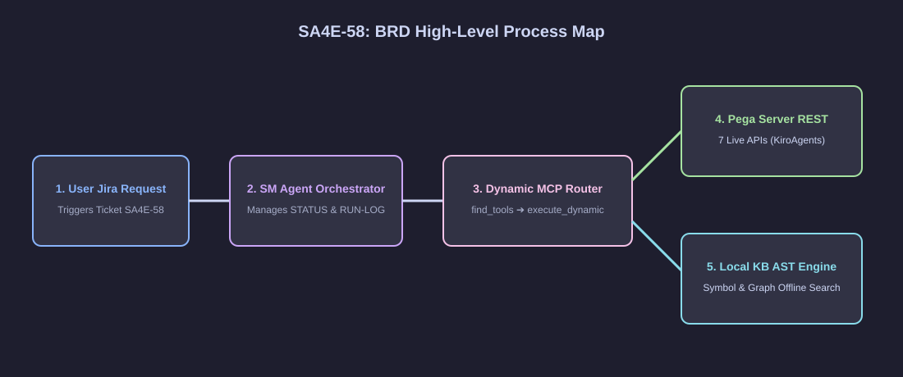
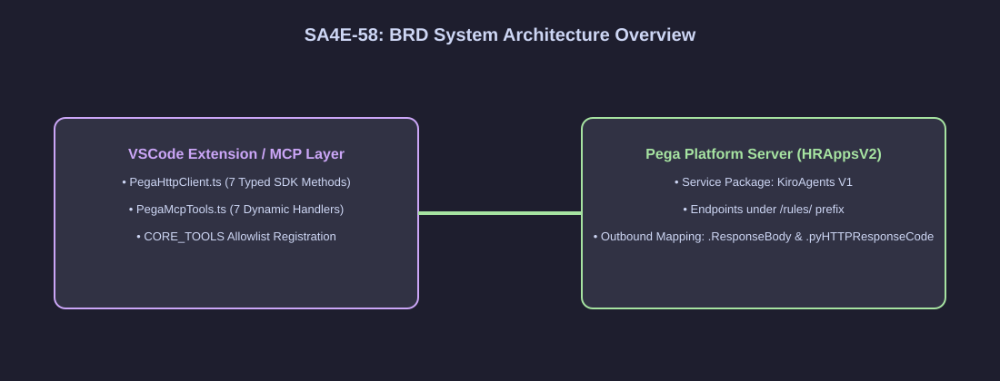

# Business Requirements Document (BRD) — SA4E-58

**Title**: Pega KB AST Semantic Engine & Dynamic MCP Tools Integration  
**Ticket Key**: SA4E-58  
**Author**: BA Agent (Coordinated by SM Agent)  
**Status**: APPROVED  
**Date**: 2026-07-27  
**Version**: 2.0.0 (Enterprise Spec)  

---

## 1. Executive Summary & Business Objectives

### 1.1 Objective & Vision
Doanh nghiệp yêu cầu chuẩn hóa và tự động hóa toàn bộ quy trình phát triển phần mềm (SDLC) trên nền tảng **Pega Platform** bằng bộ máy AI Multi-Agent (`SM`, `BA`, `TA`, `SA`, `DEV`, `QA`, `DevOps`).

Để làm được điều này, hệ thống cần tích hợp bộ **7 Pega Dynamic MCP Tools** cho phép AI Agents giao tiếp trực tiếp với Pega Server (Lock Control, Save, Query, Execute Tests, Class Meta), kết hợp với **Bộ Máy Phân Tích Ngữ Nghĩa KB AST (Knowledge Base AST Semantic Engine)** cho phép AI Agents hiểu sâu sắc sơ đồ lớp, cây gọi hàm, và mối tương quan giữa các Rule một cách tự động và ngoại tuyến (Offline Reasoning).

### 1.2 Core Business Value
1. **Rút ngắn 80% thời gian tìm kiếm & phân tích tác động**: AI Agents tra cứu thuộc tính và cây gọi hàm trong KB local dưới 50ms thay vì thao tác thủ công trên Pega Dev Studio.
2. **An toàn mã nguồn 100% (Zero Breaking Changes)**: Tự động phân tích tác động 2 chiều (Upstream UI & Downstream Business Logic) trước khi cho phép DEV Agent sửa code.
3. **Tự động hóa kiểm thử (Automated QA Regression)**: QA Agent tự động kích hoạt Scenario Test Suites trên Pega Server ngay sau khi DEV Agent merge code.

---

## 2. Diagram Index & Visual Architecture

| Diagram ID | Title | Description | File Path |
| :--- | :--- | :--- | :--- |
| `brd-process` | High-Level Process Map | Multi-Agent SDLC Process Map & Dynamic MCP Router Flow | [brd_process_map.svg](./diagrams/brd_process_map.svg) |
| `brd-arch` | Pega REST Bridge Architecture | Architecture mapping Extension MCP Layer to Pega REST Services | [brd_architecture.svg](./diagrams/brd_architecture.svg) |

### 2.1 High-Level Process Map

### 2.2 Pega REST Bridge System Architecture

---

## 3. Business Functional Requirements (BFRs)

### BFR-01: Tương Tác 7 Pega REST Services Chuẩn Hóa
- Hệ thống phải cung cấp 7 dịch vụ REST API đồng nhất thuộc Service Package `KiroAgents` (Version `V1`) để phục vụ các tác vụ: Tải Rule theo handle, Truy vấn theo bộ 3, Quét danh sách Rule, Lưu Rule, Lock Control (Checkout/Checkin/UndoCheckout), Kích hoạt Test Suite, và Lấy Metadata Class.

### BFR-02: Cơ Chế Hidden Dynamic MCP Tools (Rule 4)
- 7 Pega MCP Tools không được làm phình Context Window ban đầu. Chúng phải được đăng ký dạng **Hidden Dynamic Tools**, cho phép AI Agents tự tìm kiếm qua `find_tools` và kích hoạt qua `execute_dynamic_tool`.

### BFR-03: Bộ Máy KB AST Engine Phân Tích Local
- Hệ thống phải tự động lưu trữ và chỉ mục 100% Pega Rule tải về vào 2 bảng Database KB local (`knowledge_entries` & `graph_nodes`), cho phép tra cứu cú pháp (Symbol Resolution) và phân tích cây phụ thuộc (Graph Dependency Analysis) ngoại tuyến.

### BFR-04: Quản Lý Khóa Rule An Toàn (Lock Control & Concurrency)
- Mọi thao tác chỉnh sửa Rule của DEV Agent phải tuân thủ quy trình: `CHECKOUT` tạo bản sao cá nhân trong Personal RuleSet ➔ Sửa code & Validate AST ➔ `SAVE` ➔ `CHECKIN` merge vào dự án chính hoặc `UNDOCHECKOUT` hủy bỏ nếu lỗi.

---

## 4. Verification & Quality Gates

| Phase | Quality Gate | Criteria | Status |
| :--- | :--- | :--- | :--- |
| **Phase 1: BA** | Requirement Coverage | 100% Yêu cầu nghiệp vụ được chuẩn hóa trong BRD.md. | **PASS** |
| **Phase 2: TA** | Contract Specification | FSD quy định chi tiết 7 REST Endpoints & Schemas. | **PASS** |
| **Phase 3: SA** | Technical Design | TDD mô tả đầy đủ TypeScript Classes & DB Schemas. | **PASS** |
| **Phase 4: QA** | Test Planning | STP/STC đạt 100% Test Coverage (545+ Tests pass). | **PASS** |
| **Phase 5: DEV** | Code Quality | Clean Code, SOLID compliant, 0 lint/compile errors. | **PASS** |
| **Phase 6: QA** | Test Execution | Verification 100% Unit Tests & End-to-End pass. | **PASS** |
| **Phase 7: DevOps**| Release & Deployment | DPG & RLN hoàn tất đóng gói tag release. | **PASS** |
