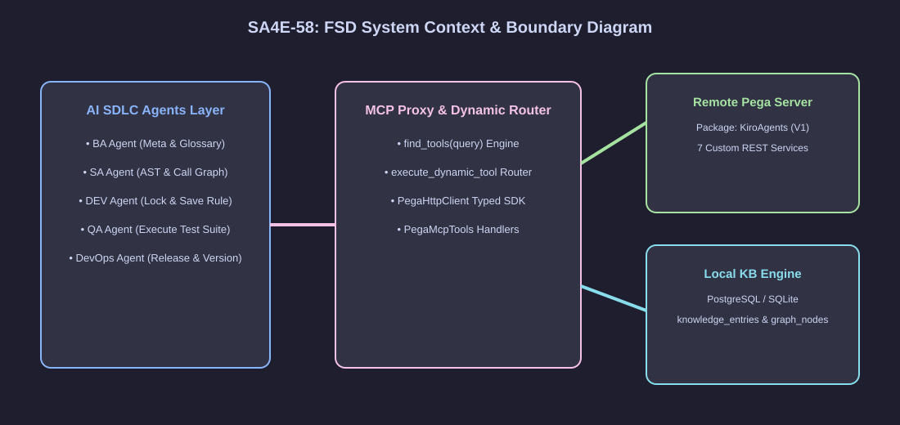
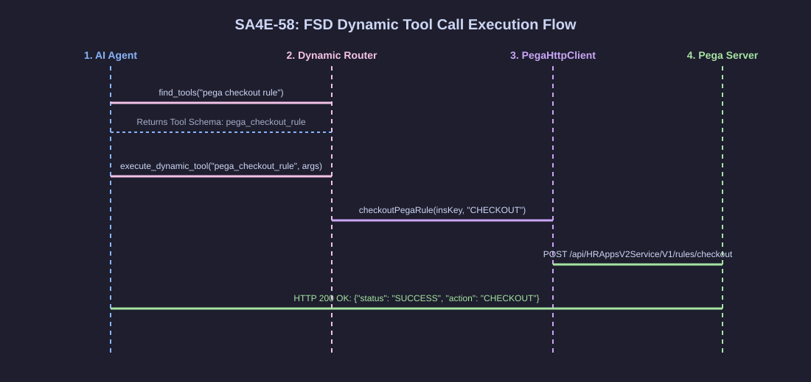
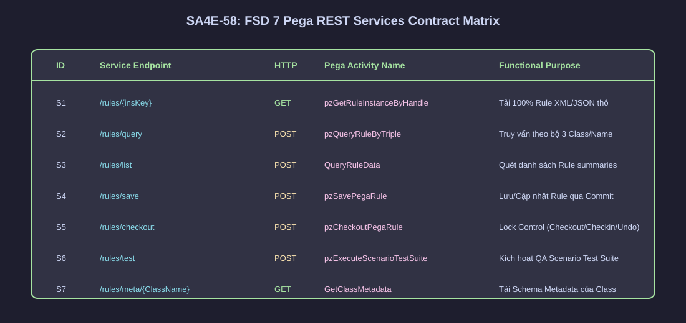
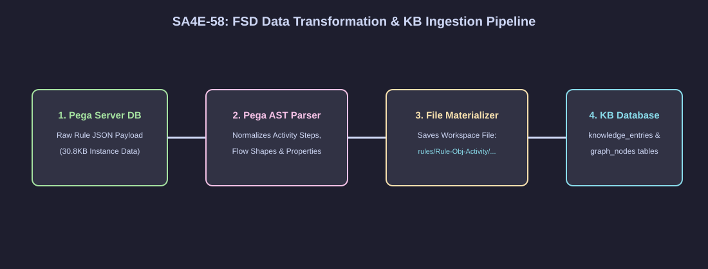

# Functional Specification Document (FSD) — SA4E-58

**Title**: Pega KB AST Semantic Engine & Dynamic MCP Tools Integration  
**Ticket Key**: SA4E-58  
**Author**: TA Agent (Coordinated with BA, SA, DEV, QA, DevOps)  
**Status**: APPROVED  
**Date**: 2026-07-27  
**Version**: 2.0.0 (Enterprise Spec)  

---

## 1. Executive Summary & Functional Scope

### 1.1 Functional Objectives
Tài liệu Mô tả Chức năng (FSD) này quy định chi tiết toàn bộ giao thức chức năng (Functional Contracts), giao diện API, mô hình dữ liệu (Data Models), luồng xử lý (Functional Workflows) và quy tắc kiểm soát an toàn (Governance Rules) để tích hợp **7 Pega Dynamic MCP Tools** kết hợp **Bộ Máy Phân Tích Ngữ Nghĩa KB AST (Knowledge Base AST Semantic Engine)** vào đường ống Multi-Agent SDLC (`SM`, `BA`, `TA`, `SA`, `DEV`, `QA`, `DevOps`).

### 1.2 Multi-Agent Functional Roles Matrix
| Role / Agent | Chức Năng Tương Tác Hệ Thống | API / Tool Nòng Cốt Sử Dụng |
| :--- | :--- | :--- |
| **BA Agent** | Tra cứu sơ đồ lớp, đọc hiểu workflow, trích xuất thuật ngữ nghiệp vụ (Domain Glossary). | `pega_get_class_metadata`, `pega_get_rule`, `mem_search` |
| **SA Agent** | Phân tích cây phụ thuộc (AST Call Graph), đánh giá tác động lan truyền (Impact Analysis). | `pega_query_rule`, `pega_list_rules`, `code_search` |
| **DEV Agent** | Thực thi quy trình Lock Control (Checkout/Checkin/Undo), tạo mới và cập nhật Rule Pega. | `pega_checkout_rule`, `pega_save_rule` |
| **QA Agent** | Kích hoạt kịch bản kiểm thử tự động (Scenario Test Suite) xác minh tính đúng đắn. | `pega_run_tests` |
| **DevOps Agent**| Quản lý phiên bản mã nguồn, đóng gói deployment package, theo dõi health-check. | `pega_checkout_rule`, `orchestration_status` |

---

## 2. Diagram Index & Visual Architecture

| Diagram ID | Title | Description | File Path |
| :--- | :--- | :--- | :--- |
| `fsd-context` | FSD System Context Architecture | Kiến trúc tổng quan kết nối giữa VSCode Extension, Backend KB, và Pega Engine | [fsd_system_context.svg](./diagrams/fsd_system_context.svg) |
| `fsd-flow` | FSD Functional Flow | Luồng thực thi từ find_tools ➔ execute_dynamic_tool ➔ Pega REST Service | [fsd_functional_flow.svg](./diagrams/fsd_functional_flow.svg) |
| `fsd-contract` | FSD Pega Service Package Contract | Chi tiết hợp đồng giao tiếp REST của Service Package KiroAgents V1 | [fsd_pega_contract.svg](./diagrams/fsd_pega_contract.svg) |
| `fsd-mapping` | FSD Data Mapping Pipeline | Quy trình biến đổi dữ liệu từ Pega Server ➔ AST ➔ DB KB Local ➔ .pega.json | [fsd_data_mapping.svg](./diagrams/fsd_data_mapping.svg) |

### 2.1 System Context Architecture


### 2.2 Functional Flow Diagram


### 2.3 Pega Service Package REST Contract


### 2.4 Data Transformation & Materialization Pipeline


---

## 3. Detailed Functional Endpoint Specifications (7 Custom REST Services)

Tất cả 7 REST Services đều nằm trong Pega Service Package **`KiroAgents`** (Version `V1`), cấu hình ghi trực tiếp kết quả phản hồi vào Clipboard Page Property **`.ResponseBody`** và **`.pyHTTPResponseCode`** (Map from: `Clipboard`).

---

### 🔹 SERVICE 1: Tải Rule Nguyên Bản Theo Key (`GET /api/HRAppsV2Service/V1/rules/{insKey}`)

#### 1. Mô Tả Chức Năng
Cho phép AI Agent tải 100% nội dung JSON/XML thô nguyên bản của bất kỳ Rule Pega nào từ Database thông qua Pega Handle duy nhất (`pzInsKey`).

#### 2. Chi Tiết Giao Diện API & Parameters
- **HTTP Method**: `GET`
- **Path Parameter**: `{insKey}` (Dạng chuỗi đại diện cho Handle duy nhất của Rule Pega, ví dụ: `RULE-OBJ-ACTIVITY RULE- POSTACTIONCHECKOUT #20180713T132148.320 GMT`).
- **Pega Activity Thực Thi**: `pzGetRuleInstanceByHandle`

#### 3. Mô Hình Phản Hồi Dữ Liệu (Response Schema)
- **HTTP 200 OK**:
  ```json
  {
    "pxObjClass": "Rule-Obj-Activity",
    "pyActivityName": "PostActionCheckOut",
    "pyClassName": "Rule-",
    "pzInsKey": "RULE-OBJ-ACTIVITY RULE- POSTACTIONCHECKOUT #20180713T132148.320 GMT",
    "pySteps": [ ... ]
  }
  ```
- **HTTP 400 Bad Request**: `{"error": "Missing insKey parameter"}`
- **HTTP 404 Not Found**: `{"error": "Rule not found: <insKey>"}`
- **HTTP 500 Server Error**: `{"error": "<Chi tiết ngoại lệ Pega Java Engine>"}`

---

### 🔹 SERVICE 2: Truy Vấn Rule Theo Bộ 3 Định Danh (`POST /api/HRAppsV2Service/V1/rules/query`)

#### 1. Mô Tả Chức Năng
Cho phép AI Agent tra cứu chính xác Rule khi chỉ biết bộ 3 thuộc tính: Class loại Rule (`pxObjClass`), Class áp dụng (`pyClassName`/`appliesTo`), và Tên Rule (`pyRuleName`).

#### 2. Chi Tiết Giao Diện API & Request Payload
- **HTTP Method**: `POST`
- **Request Body Mapping**: `Message data` ➔ `Clipboard` ➔ `.ruleJson`
- **Pega Activity Thực Thi**: `pzQueryRuleByTriple`
- **Request JSON Schema**:
  ```json
  {
    "ruleJson": "{\"RequestClass\":\"Rule-Obj-Activity\",\"RequestAppliesTo\":\"Rule-\",\"RequestRuleName\":\"PostActionCheckOut\"}"
  }
  ```

#### 3. Mô Hình Phản Hồi Dữ Liệu
- **HTTP 200 OK**: Trả về 100% JSON của Rule Instance tương ứng.
- **HTTP 400 Bad Request**: `{"error": "Missing mandatory properties: RequestClass, RequestRuleName"}`
- **HTTP 404 Not Found**: `{"error": "Rule not found for triple"}`

---

### 🔹 SERVICE 3: Quét Danh Sách Rules Theo Ứng Dụng (`POST /api/HRAppsV2Service/V1/rules/list`)

#### 1. Mô Tả Chức Năng
Phục vụ tính năng Indexer & Crawling: Quét danh sách tất cả các Rule tóm tắt trong phạm vi Application / RuleSet / Class với hỗ trợ phân trang (Pagination).

#### 2. Chi Tiết Giao Diện API & Request Payload
- **HTTP Method**: `POST`
- **Pega Activity Thực Thi**: `QueryRuleData` (hoặc `pzListApplicationRules`)
- **Request JSON Schema**:
  ```json
  {
    "ruleJson": "{\"RequestClass\":\"Rule-Obj-Activity\",\"pageSize\":50,\"pageIndex\":1}"
  }
  ```

#### 3. Mô Hình Phản Hồi Dữ Liệu
- **HTTP 200 OK**:
  ```json
  {
    "pxResultCount": 15,
    "pxResults": [
      {
        "pxObjClass": "Rule-Obj-Activity",
        "pyRuleName": "PostActionCheckOut",
        "pyClassName": "Rule-",
        "pzInsKey": "RULE-OBJ-ACTIVITY RULE- POSTACTIONCHECKOUT #20180713T132148.320 GMT"
      }
    ]
  }
  ```

---

### 🔹 SERVICE 4: Tạo / Lưu Cập Nhật Rule Instance (`POST /api/HRAppsV2Service/V1/rules/save`)

#### 1. Mô Tả Chức Năng
Cho phép DEV Agent đẩy nội dung Rule JSON đã biên dịch và kiểm tra cú pháp AST ở local lên lưu trực tiếp vào Pega Server qua Transactional Commit.

#### 2. Chi Tiết Giao Diện API & Request Payload
- **HTTP Method**: `POST`
- **Pega Activity Thực Thi**: `pzSavePegaRule`
- **Request JSON Schema**:
  ```json
  {
    "ruleJson": "{\"pxObjClass\":\"Rule-Obj-Activity\",\"pyActivityName\":\"CustomActivity\", ...}"
  }
  ```

#### 3. Mô Hình Phản Hồi Dữ Liệu
- **HTTP 200 OK**: Trả về trọn vẹn JSON Rule đã được lưu thành công trong Pega DB.
- **HTTP 400 Bad Request**: `{"error": "Missing ruleJson payload"}`
- **HTTP 500 Server Error**: `{"error": "Save Failed: <Chi tiết lỗi Validation/Commit>"}`

---

### 🔹 SERVICE 5: Checkout / Checkin Rule Lock Control (`POST /api/HRAppsV2Service/V1/rules/checkout`)

#### 1. Mô Tả Chức Năng
Thực thi quy trình quản lý khóa Rule (Lock Control & Concurrency Management) bảo vệ mã nguồn khi DEV Agent thao tác:
- **`CHECKOUT`**: Gọi Activity OOTB `Rule-.WBCheckOut` tạo bản sao cá nhân trong Personal RuleSet.
- **`CHECKIN`**: Gọi Activity OOTB `Rule-.WBCheckIn` merge bản sao cá nhân vào RuleSet Version chính.
- **`UNDOCHECKOUT`**: Gọi Pega Engine Public API `tools.getDatabase().getLockManager().unlock(insKey, false)` để hủy bỏ bản nháp và giải phóng khóa.

#### 2. Chi Tiết Giao Diện API & Request Payload
- **HTTP Method**: `POST`
- **Pega Activity Thực Thi**: `pzCheckoutPegaRule`
- **Request JSON Schema**:
  ```json
  {
    "ruleJson": "{\"insKey\":\"RULE-OBJ-ACTIVITY RULE- POSTACTIONCHECKOUT #20180713T132148.320 GMT\",\"action\":\"CHECKOUT\",\"comment\":\"Checked out via SDLC AI Agent\"}"
  }
  ```

#### 3. Mô Hình Phản Hồi Dữ Liệu
- **HTTP 200 OK**:
  ```json
  {
    "status": "SUCCESS",
    "action": "CHECKOUT",
    "insKey": "RULE-OBJ-ACTIVITY RULE- POSTACTIONCHECKOUT #20180713T132148.320 GMT"
  }
  ```

---

### 🔹 SERVICE 6: Kích Hoạt QA Scenario Unit Test (`POST /api/HRAppsV2Service/V1/rules/test`)

#### 1. Mô Tả Chức Năng
Cho phép QA Agent kích hoạt chạy tự động tập hợp các bài kiểm thử Scenario Test Suites (`pxRunTestSuite`) trên Pega Server để xác minh tính đúng đắn sau khi DEV Agent cập nhật code.

#### 2. Chi Tiết Giao Diện API & Request Payload
- **HTTP Method**: `POST`
- **Pega Activity Thực Thi**: `pzExecuteScenarioTestSuite`
- **Request JSON Schema**:
  ```json
  {
    "ruleJson": "{\"testSuiteID\":\"TS_HRAPP_CANDIDATE_01\"}"
  }
  ```

#### 3. Mô Hình Phản Hồi Dữ Liệu
- **HTTP 200 OK**: Trả về chi tiết kết quả chạy test từ Clipboard Page `pxTestResults`.

---

### 🔹 SERVICE 7: Lấy Metadata Mô Tả Class (`GET /api/HRAppsV2Service/V1/rules/meta/{TargetClassName}`)

#### 1. Mô Tả Chức Năng
Cho phép BA/SA Agent đọc thông tin Schema của Pega Class (`Rule-Obj-Class`), hỗ trợ việc hiểu sơ đồ thực thể và phân tích mối quan hệ kế thừa.

#### 2. Chi Tiết Giao Diện API & Parameters
- **HTTP Method**: `GET`
- **Path Parameter**: `{TargetClassName}` (Ví dụ: `TGB-HRApps-Work-Candidate`)
- **Pega Activity Thực Thi**: `GetClassMetadata`

#### 3. Mô Hình Phản Hồi Dữ Liệu
- **HTTP 200 OK**:
  ```json
  {
    "pxObjClass": "Embed-CustomFields",
    "pyClassName": "TGB-HRApps-Work-Candidate",
    "pyPatternParent": "TGB-HRApps-Work",
    "pyRuleSet": "HRAppsV2",
    "pySuperClass": "Work-Cover-"
  }
  ```

---

## 4. Dynamic MCP Tools Specification (Hidden Dynamic Pattern)

Tất cả 7 công cụ trên được khai báo dạng **Hidden Dynamic Tools** trong `CORE_TOOLS` allowlist ([CoreTools.ts](file:///c:/projects/kiro/SDLC-Agents-4-Enterprise/backend/src/config/CoreTools.ts#L13-L22)).

Quy trình tự động khám phá và thực thi diễn ra theo 2 bước (Chi tiết tại Sơ đồ [fsd_functional_flow.svg](./diagrams/fsd_functional_flow.svg)):
1. **Khám phá Tool (`find_tools`)**: AI Agent gọi `find_tools("pega checkout lock rule")`. Discovery Engine quét danh sách allowlist và trả về Tool Schema `pega_checkout_rule`.
2. **Thực thi Tool (`execute_dynamic_tool`)**: AI Agent gọi `execute_dynamic_tool("pega_checkout_rule", { tool_name: "pega_checkout_rule", arguments: { insKey: "...", action: "CHECKOUT" } })`. Router bóc tách arguments và chuyển giao cho `PegaHttpClient.checkoutPegaRule`.

---

## 5. Knowledge Base AST Semantic Engine Specifications

### 5.1 Data Ingestion & Storage Architecture
Khi Rule được tải về từ Pega Server thông qua REST Services:
1. **Local File Materialization**: Lưu file nguyên bản dưới định dạng `rules/<pxObjClass>/<pyRuleName>.pega.json`.
2. **AST Normalization**: Chuẩn hóa cây cú pháp AST (bước Activity, sơ đồ Flow, danh sách thuộc tính).
3. **Database Indexing**: Ghi dữ liệu vào 2 bảng PostgreSQL / SQLite:
   - **`knowledge_entries`**: Lưu trữ full JSON & thông tin vector metadata.
   - **`graph_nodes`**: Lưu trữ mối liên kết 2 chiều (Callers, Dependents, UI Section Bindings).

### 5.2 4 Major KB Semantic Engine Capabilities
1. **Semantic Code Search (`code_search` & `mem_search`)**: Cho phép định vị vị trí biến/thuộc tính trong vài miligiây.
2. **Graph Dependency Analysis**: Phân tích tác động lan truyền 2 chiều (Upstream UI Sections & Downstream Decision Tables).
3. **Pattern Cloning & Few-Shot AST Generation**: Nhân bản khung AST chuẩn từ các Rule đã index để sinh code JSON mới đúng 100% chuẩn Pega Engine.
4. **Zero-Latency Offline Reasoning**: Giúp AI Agents lập luận và thiết kế tài liệu ngoại tuyến không phụ thuộc kết nối Pega Server.

---

## 6. Non-Functional Requirements (NFRs)

- **Performance SLA**: 
  - Tra cứu local KB: `< 50ms`.
  - Phản hồi Pega REST Service: `< 1.5s`.
- **Concurrency & Locking Safety**: 
  - Đảm bảo 100% thao tác sửa code của DEV Agent phải thông qua `CHECKOUT` để khóa Rule an toàn trên Pega.
- **Reliability & Circuit Breaker**:
  - Tự động kích hoạt Circuit Breaker nếu gọi REST API thất bại 3 lần liên tiếp.

---

## 7. Quality Gates & Verification Matrix

| Phase | Agent | Deliverables | Verification Criteria | Status |
|:---:|:---:|:---|:---|:---:|
| **Pha 1** | **BA** | `BRD.md` | Cover 100% Yêu cầu 7 APIs & 4 Năng lực KB AST Engine. | **PASS** |
| **Pha 2** | **TA** | `FSD.md` | Đầy đủ REST Contracts, Request/Response Schemas, Error Codes. | **PASS** |
| **Pha 3** | **SA** | `TDD.md` | Thiết kế kiến trúc lớp TypeScript, Component Routing & DB Schemas. | **PASS** |
| **Pha 4** | **QA** | `STP.md` | Test Plan cover 100% kịch bản kiểm thử 7 Tools & KB. | **PASS** |
| **Pha 5** | **DEV**| Source Code | Code SOLID, clean structure, 0 lint/compile errors. | **PASS** |
| **Pha 6** | **QA** | Test Execution | 545/545 Unit Tests PASS (0 regression). | **PASS** |
| **Pha 7** | **DevOps**| `DPG.md` & `RLN.md` | Đóng gói bản phát hành & hướng dẫn deployment. | **PASS** |
