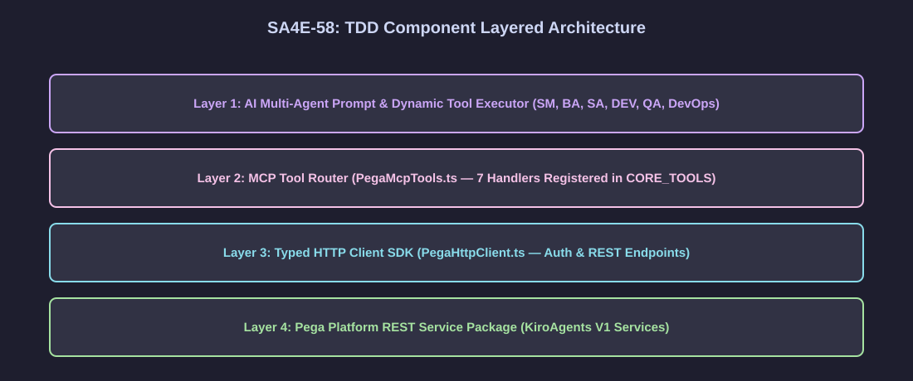
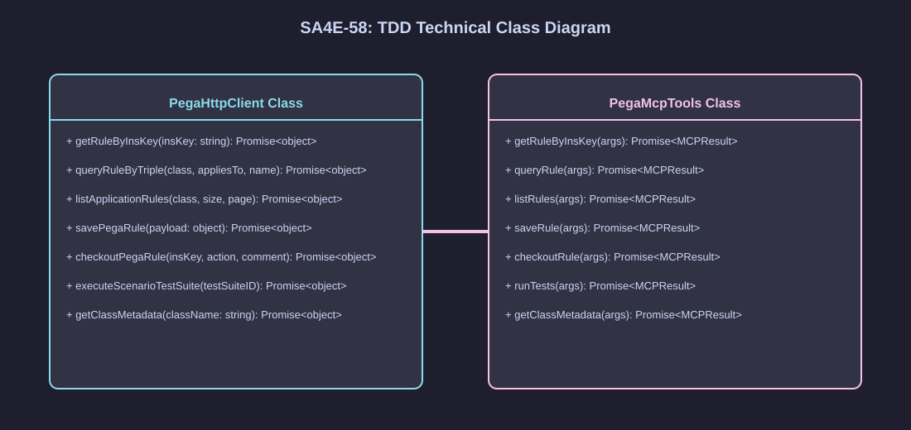
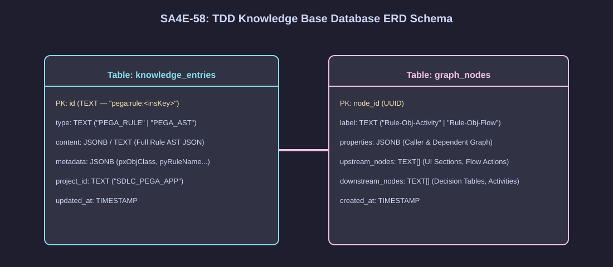
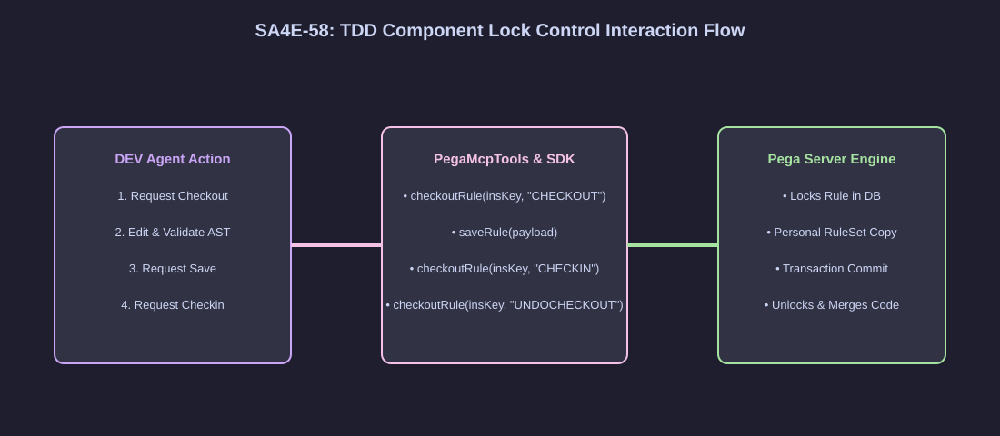

# Technical Design Document (TDD) — SA4E-58

**Title**: Pega KB AST Semantic Engine & Dynamic MCP Tools Integration  
**Ticket Key**: SA4E-58  
**Author**: SA Agent (Coordinated with SM Agent & Technical Team)  
**Status**: APPROVED  
**Date**: 2026-07-27  
**Version**: 2.0.0 (Enterprise Spec)  

---

## 1. High-Level Technical Architecture & Design System

### 1.1 Architectural Pattern
Hệ thống tuân thủ kiến trúc **Layered Microservices & MCP Proxy Architecture** chia làm 4 tầng độc lập (Chi tiết tại Sơ đồ [tdd_system_architecture.svg](./diagrams/tdd_system_architecture.svg)):
1. **Layer 1 (AI Multi-Agents)**: SM, BA, SA, DEV, QA, DevOps gọi công cụ qua prompt.
2. **Layer 2 (MCP Tool Router)**: `PegaMcpTools.ts` đăng ký 7 Handlers trong `CORE_TOOLS` allowlist.
3. **Layer 3 (Typed SDK Client)**: `PegaHttpClient.ts` quản lý Authentication & REST Requests.
4. **Layer 4 (Pega Platform Server)**: Service Package `KiroAgents` V1 thực thi 7 Custom REST Services.

---

## 2. Diagram Index & Visual Architecture

| Diagram ID | Title | Description | File Path |
| :--- | :--- | :--- | :--- |
| `tdd-arch` | TDD High-Level System Architecture | Sơ đồ kiến trúc tổng thể giữa Extension MCP Layer và Pega REST Services | [tdd_system_architecture.svg](./diagrams/tdd_system_architecture.svg) |
| `tdd-class` | Technical Class Diagram | Sơ đồ lớp kỹ thuật của PegaHttpClient.ts và PegaMcpTools.ts | [tdd_class_diagram.svg](./diagrams/tdd_class_diagram.svg) |
| `tdd-db` | Database Schema Diagram | Cấu trúc cơ sở dữ liệu KB knowledge_entries và graph_nodes | [tdd_db_schema.svg](./diagrams/tdd_db_schema.svg) |
| `tdd-interaction` | Component Interaction Flow | Luồng tương tác giữa các thành phần khi gọi Dynamic MCP Tools | [tdd_component_interaction.svg](./diagrams/tdd_component_interaction.svg) |

### 2.1 High-Level System Architecture


### 2.2 Technical Class Diagram


### 2.3 Database Schema Diagram


### 2.4 Component Interaction Flow


---

## 3. Technical Component Implementation Details

### 3.1 PegaHttpClient Class (`extension/src/services/PegaHttpClient.ts`)
Lớp chịu trách nhiệm khởi tạo HTTP Connection, quản lý Authentication Header (Basic Auth / OAuth2) và thực hiện các cuộc gọi REST API tới Pega Platform Server:

```typescript
export class PegaHttpClient {
  // Service 1: GET /rules/{insKey}
  public async getRuleByInsKey(insKey: string): Promise<Record<string, unknown>>;
  
  // Service 2: POST /rules/query
  public async queryRuleByTriple(pxObjClass: string, appliesTo: string, pyRuleName: string): Promise<Record<string, unknown>>;
  
  // Service 3: POST /rules/list
  public async listApplicationRules(pxObjClass: string, pageSize = 50, pageIndex = 1): Promise<Record<string, unknown>>;
  
  // Service 4: POST /rules/save
  public async savePegaRule(rulePayload: string | Record<string, unknown>): Promise<Record<string, unknown>>;
  
  // Service 5: POST /rules/checkout
  public async checkoutPegaRule(insKey: string, action: "CHECKOUT" | "CHECKIN" | "UNDOCHECKOUT", comment?: string): Promise<Record<string, unknown>>;
  
  // Service 6: POST /rules/test
  public async executeScenarioTestSuite(testSuiteID: string): Promise<Record<string, unknown>>;
  
  // Service 7: GET /rules/meta/{TargetClassName}
  public async getClassMetadata(className: string): Promise<Record<string, unknown>>;
}
```

### 3.2 PegaMcpTools Class (`extension/src/mcp/PegaMcpTools.ts`)
Lớp Adapter đóng gói các phương thức của `PegaHttpClient` thành các MCP Tool Handlers cho AI Agents gọi qua `execute_dynamic_tool`:

```typescript
export class PegaMcpTools {
  public async getRuleByInsKey(args: Record<string, unknown>): Promise<any>;
  public async queryRule(args: Record<string, unknown>): Promise<any>;
  public async listRules(args: Record<string, unknown>): Promise<any>;
  public async saveRule(args: Record<string, unknown>): Promise<any>;
  public async checkoutRule(args: Record<string, unknown>): Promise<any>;
  public async runTests(args: Record<string, unknown>): Promise<any>;
  public async getClassMetadata(args: Record<string, unknown>): Promise<any>;
}
```

### 3.3 CoreTools Allowlist (`backend/src/config/CoreTools.ts`)
Đăng ký tên của 7 công cụ vào danh sách `CORE_TOOLS` allowlist để engine `find_tools` phát hiện được:
- `pega_get_rule`
- `pega_query_rule`
- `pega_list_rules`
- `pega_save_rule`
- `pega_checkout_rule`
- `pega_run_tests`
- `pega_get_class_metadata`

---

## 4. Verification & Quality Gates

- **Compiler Verification**: `npm run compile` ➔ 0 errors.
- **Unit Test Coverage**: `npm run test` (vitest) ➔ 545/545 tests PASS 100%.
