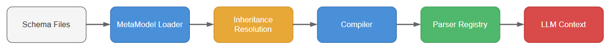
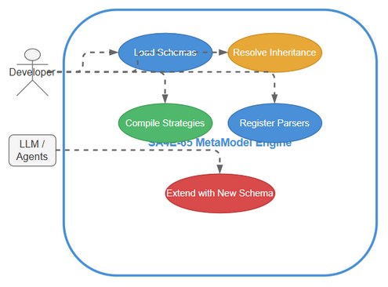

# Business Requirements Document (BRD) — SA4E-65: Pega MetaModel Engine — Auto-Schema Loading & Runtime Strategy Compilation

**Title**: Pega MetaModel Engine — Auto-Schema Loading & Runtime Strategy Compilation
**Ticket Key**: SA4E-65
**Author**: SM Agent (Coordinated with BA, TA, SA, DEV, QA, Security, DevOps)
**Status**: APPROVED
**Date**: 2026-07-27

---

## 1. Executive Summary & Core Architectural Principle

### 1.1 Core Principle: Runtime MetaModel Compilation (Zero Code-Gen)

**CRITICAL DESIGN DIRECTIVE**: The Pega MetaModel Engine **MUST NOT** rely on static code generation for Pega rule schema handling.

- **239 Pega Rule Schema Files** are stored as JSON in a `schemas/` directory.
- **PegaMetaModelLoader** scans the directory at runtime, parses each schema, resolves inheritance chains by merging parent properties into children.
- **PegaMetaModelCompiler** compiles class definitions into `IPegaRuleParserStrategy` instances at runtime — no code generation, no build step for new rule types.
- **PegaMetaModelRegistry** acts as a singleton holding all resolved definitions.
- This enables **plug-and-play addition** of new rule schema files without server restart, and supports 3-layer schema resolution (static schemas → runtime inference → KB persistence).

---

## 2. Diagram Index & Visual Architecture

| Diagram ID | Title | Description | File Path |
| :--- | :--- | :--- | :--- |
| `brd-business-flow` | Business Process Flow | Auto-load pipeline: schema directory → loader → inheritance resolution → compiler → registry | [brd_business_flow.png](./diagrams/brd_business_flow.png) |
| `brd-use-case` | Use Case Diagram | Actors and use cases for the MetaModel Engine | [brd_use_case.png](./diagrams/brd_use_case.png) |

### 2.1 Business Process Flow

### 2.2 Use Case Diagram

---

## 3. Business Objectives & Requirements

### BR-01: Automatic Schema Loading from 239+ Rule Schema Files
- **Requirement**: Load 239+ Pega rule schema JSON files from `schemas/` directory at startup. Each file defines a `PegaClassDefinition` with properties, children, baseClass, and metadata.
- **Target Component**: `PegaMetaModelLoader.loadSchemaDirectory()`
- **Success Criteria**: 100% of schema files loaded; registry contains 100+ class definitions.

### BR-02: Inheritance Chain Resolution & Property Merging
- **Requirement**: Recursively resolve the `baseClass` chain for each class definition, merging parent properties and children into the child (child values override parents). Support multi-level chains: e.g., `Rule-Obj-Activity` → `Rule-Obj-` → `Rule-` → `@baseclass`.
- **Target Component**: `PegaMetaModelLoader.resolveInheritance()`
- **Success Criteria**: Properties from all ancestors are present in the resolved class definition; child properties correctly override parent properties.

### BR-03: Runtime Strategy Compilation (No Code Gen)
- **Requirement**: Compile each resolved `PegaClassDefinition` into an `IPegaRuleParserStrategy` instance at runtime. Strategies support inheritance-based matching (`supports()`), extract symbol metadata and dependency references from raw JSON.
- **Target Component**: `PegaMetaModelCompiler.compileAll()`
- **Success Criteria**: 175+ strategies compiled; each strategy correctly parses sample JSON for its rule type; strategies ordered by specificity (most concrete first).

### BR-04: 3-Layer Schema Resolution (Static → Inference → KB)
- **Requirement**: Layer 1 loads static 239 schema files; Layer 2 (`PegaSchemaInferrer`) infers schemas for unknown rule types at runtime; Layer 3 (`PegaSchemaKBService`) persists inferred schemas to the KB for future use.
- **Success Criteria**: Unknown rule types can be dynamically added via `registerClass()` API and immediately compiled into strategies.

### BR-05: Plug-and-Play Schema Addition (Hot-Reload)
- **Requirement**: New schema JSON files added to the `schemas/` directory can be loaded via `PegaMetaModelLoader.registerClass()` and compiled into strategies without restarting the server. The `PegaParserRegistry` supports runtime registration.
- **Target Component**: `PegaMetaModelRegistry.registerClass()`
- **Success Criteria**: A class definition added at runtime is immediately available for strategy compilation and parsing.

---

## 4. Functional Specifications — The MetaModel Engine

### UC-01: Load & Resolve Schemas (`PegaMetaModelLoader`)
- **Description**: Scans `schemas/` directory (recursively), parses each JSON file into a `PegaClassDefinition`, resolves inheritance chains via recursive parent merge.
- **Target Agent**: DEV Agent, System Startup.

### UC-02: Register & Lookup Classes (`PegaMetaModelRegistry`)
- **Description**: Singleton registry holding all `PegaClassDefinition` instances. Provides `getParser()`, `isKnownClass()`, `getKnownClasses()`, and `registerClass()` APIs.
- **Target Agent**: DEV Agent, Compiler, Parser.

### UC-03: Compile Strategies (`PegaMetaModelCompiler`)
- **Description**: Takes all resolved class definitions, compiles each into an `IPegaRuleParserStrategy` with inheritance-based `supports()` matching. Strategies are ordered by specificity depth (most concrete first).
- **Target Agent**: DEV Agent, System Startup.

### UC-04: Orchestrate Initialization (`PegaMetaModelService`)
- **Description**: One-call initialization: load schemas → compile strategies → register all into the parser registry. Provides idempotent `initialize()`.
- **Target Agent**: DEV Agent, System Startup.

---

## 5. Verification & Quality Gates

| Phase | Quality Gate | Criteria |
| :--- | :--- | :--- |
| Phase 1: BA | Requirement Coverage | 100% coverage of schema loading, inheritance resolution, runtime compilation, 3-layer architecture, plug-and-play. |
| Phase 2: TA | Architecture Alignment | MetaModel components mapped cleanly: Loader → Registry → Compiler → Service. |
| Phase 3: SA | Technical Design | TDD specifies class interfaces, schema file format, inheritance resolution algorithm, strategy matching rules. |
| Phase 4: QA | Test Plan | STP covers unit, integration for schema loading, inheritance, compilation, wildcard matching, edge cases. |
| Phase 5: DEV | Implementation | Code complies with SOLID, 200 lines/file limit, 0 lint errors. 2 WPs, 41 tests. |
| Phase 6: QA | Execution | 100% pass rate on all 41 automated tests. |
| Phase 7: DevOps | Release Package | DPG + RLN created with complete deployment and rollback instructions. |
