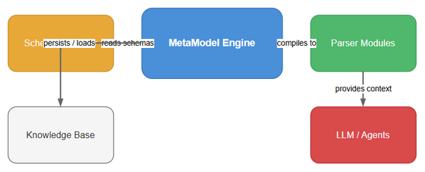
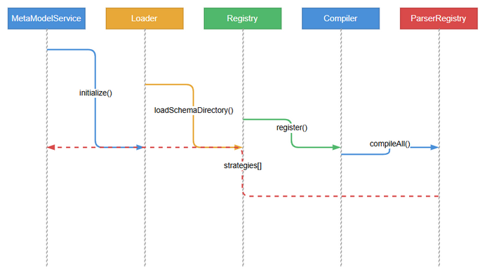
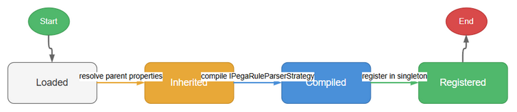

# Functional Specification Document (FSD) — SA4E-65: Pega MetaModel Engine

**Title**: Pega MetaModel Engine — Auto-Schema Loading & Runtime Strategy Compilation
**Ticket Key**: SA4E-65
**Author**: BA + TA Agent
**Status**: APPROVED
**Date**: 2026-07-27

---

## 1. Executive Summary & Core Architectural Principle

### 1.1 Core Principle: Dynamic MetaModel with No Code Generation

The Pega MetaModel Engine **MUST NOT** use static code generation. It loads 239+ Pega rule schema JSON files from a directory at runtime, resolves inheritance chains by merging parent properties into children, and compiles the resolved definitions into `IPegaRuleParserStrategy` instances. This enables dynamic addition of new rule types without a build step.

- **Schema Directory**: 239+ JSON files organized in `backend/src/modules/pega/schemas/`.
- **PegaMetaModelLoader**: Scans directory, parses JSON, resolves inheritance recursively.
- **PegaMetaModelRegistry**: Singleton holding resolved class definitions.
- **PegaMetaModelCompiler**: Compiles definitions into strategies with specificity ordering.
- **PegaMetaModelService**: Orchestrates load → compile → register in one call.

---

## 2. Diagram Index & Visual Architecture

| Diagram ID | Title | Description | File Path |
| :--- | :--- | :--- | :--- |
| `fsd-context` | System Context Architecture | Data flow: schema files → Loader → Registry → Compiler → Service → ParserRegistry | [fsd_system_context.png](./diagrams/fsd_system_context.png) |
| `fsd-sequence` | Sequence Diagram | Schema loading, inheritance resolution, compilation, registration phases | [fsd_sequence.png](./diagrams/fsd_sequence.png) |
| `fsd-state` | State Diagram | Component states during initialization and runtime | [fsd_state.png](./diagrams/fsd_state.png) |

### 2.1 System Context Architecture


### 2.2 Sequence Diagram


### 2.3 State Diagram


---

## 3. Component Specifications

### 3.1 PegaClassDefinition — Type Model

**Purpose**: Defines the structure of a single Pega rule schema class.

**Properties**:

| Field | Type | Description |
|-------|------|-------------|
| `pxObjClass` | `string` | Fully qualified class name (e.g., `Rule-Obj-Activity`) |
| `baseClass` | `string` (optional) | Parent class name for inheritance (e.g., `Rule-Obj-`) |
| `properties` | `PegaPropertyDef[]` | List of property definitions |
| `children` | `PegaChildDef[]` | List of child/embedded array definitions |
| `description` | `string` (optional) | Human-readable description |
| `label` | `string` (optional) | Human-readable label |

**PegaPropertyDef**:

| Field | Type | Description |
|-------|------|-------------|
| `name` | `string` | Property name |
| `type` | `'string'\|'number'\|'boolean'\|'ref'\|'json'` | Inferred data type |
| `required` | `boolean` | Whether field is mandatory |
| `isSystem` | `boolean` | System-managed field (pxCreate*, pxUpdate*, pz*) |
| `isReference` | `boolean` | Cross-rule reference field (e.g., pyClassName, pyRuleName) |

**PegaChildDef**:

| Field | Type | Description |
|-------|------|-------------|
| `name` | `string` | Array field name |
| `childType` | `string` | pxObjClass of embedded items |
| `arrayType` | `'array'\|'single'` | Cardinality |

---

### 3.2 PegaMetaModelLoader — Schema Loader

**Purpose**: Scans directory, loads JSON files, resolves inheritance chains.

**Input**:
- `schemaDir` (optional `string`): Path to schema directory. Defaults to `../schemas` relative to loader location.

**Output**:
- `Map<string, PegaClassDefinition>` registry with all resolved class definitions.

**Key Functions**:

| Function | Input | Output | Description |
|----------|-------|--------|-------------|
| `loadSchemaDirectory(dir?)` | string path | `Promise<Map<string, PegaClassDefinition>>` | Scan directory recursively, parse all `.json` files, resolve inheritance |
| `loadSchemaFile(filePath)` | string path | `PegaClassDefinition \| null` | Parse single JSON file into class definition |
| `resolveInheritance()` | none | `void` | Recursively merge parent properties/children using `baseClass` chain |
| `registerClass(def)` | `PegaClassDefinition` | `void` | Add or override a class definition at runtime |
| `getClass(pxObjClass)` | string | `PegaClassDefinition \| undefined` | Lookup class by name |
| `getAllClasses()` | none | `PegaClassDefinition[]` | List all registered classes |

**Inheritance Resolution Algorithm**:
1. For each class with a `baseClass`, recursively resolve the parent.
2. Merge parent properties into child: child properties take precedence, parent properties fill gaps.
3. Merge parent children into child: child children take precedence, parent children fill gaps.
4. Use a `resolved` Set to prevent infinite recursion on circular dependencies (max depth 20 via compiler cache).

---

### 3.3 PegaMetaModelRegistry — Singleton Registry

**Purpose**: Singleton access point for all class definitions. Wraps `PegaMetaModelLoader`.

**Key Functions**:

| Function | Input | Output | Description |
|----------|-------|--------|-------------|
| `getInstance()` | none | `PegaMetaModelRegistry` | Return singleton instance |
| `initialize(schemaDir?)` | string path | `Promise<void>` | Lazy init with idempotency guard |
| `registerClass(def)` | `PegaClassDefinition` | `void` | Register a new class at runtime |
| `getParser(pxObjClass)` | string | `PegaClassDefinition \| undefined` | Lookup resolved class definition |
| `isKnownClass(pxObjClass)` | string | `boolean` | Check if class is registered |
| `getKnownClasses()` | none | `string[]` | List all registered class names |

---

### 3.4 PegaMetaModelCompiler — Strategy Generator

**Purpose**: Compiles `PegaClassDefinition` instances into `IPegaRuleParserStrategy` implementations at runtime.

**Matching Rules** (in `supports(pxObjClass)`):
1. **Exact match**: `pxObjClass === this.classDef.pxObjClass`
2. **@baseclass wildcard**: `@baseclass` matches everything
3. **Prefix category**: Classes ending with `-` (e.g., `Rule-Obj-`) match any class starting with that prefix
4. **Inheritance chain**: Full recursive check via `isDerivedFrom()` using the registry

**Key Functions**:

| Function | Input | Output | Description |
|----------|-------|--------|-------------|
| `compileStrategy(classDef)` | `PegaClassDefinition` | `IPegaRuleParserStrategy` | Compile single class into strategy |
| `compileAll()` | none | `IPegaRuleParserStrategy[]` | Compile ALL classes, sorted by specificity depth |
| `getStrategy(pxObjClass)` | string | `IPegaRuleParserStrategy \| undefined` | Get cached compiled strategy |
| `registerAll(parserRegistry)` | `PegaParserRegistry` | `void` | Register all strategies into a parser registry |
| `isDerivedFrom(cls, base)` | string, string | `boolean` | Check inheritance relationship |

**Strategy Output** (`ParseResult`):

| Field | Type | Description |
|-------|------|-------------|
| `symbol.fqn` | `string` | Fully qualified name: `{pxObjClass}:{className}:{name}` |
| `symbol.name` | `string` | Extracted rule name |
| `symbol.className` | `string` | Applies-to class name |
| `symbol.ruleType` | `string` | pxObjClass |
| `symbol.isRule` | `boolean` | Whether it starts with `Rule-` |
| `symbol.ruleset` | `string` | pyRuleset value (optional) |
| `symbol.version` | `string` | pyRulesetVersion value (optional) |
| `symbol.logicSummary` | `string` | Human-readable summary |
| `dependencies[]` | `UnresolvedDependency[]` | Detected reference dependencies |

---

### 3.5 PegaMetaModelService — Initialization Orchestrator

**Purpose**: One-call orchestrator that loads schemas, compiles strategies, and registers all into the parser registry.

**Key Functions**:

| Function | Input | Output | Description |
|----------|-------|--------|-------------|
| `initialize(schemaDir?)` | string path | `Promise<void>` | Load → Compile → Register in one call |
| `isInitialized()` | none | `boolean` | Check initialization status |
| `getCompiler()` | none | `PegaMetaModelCompiler` | Access the compiler |
| `getRegistry()` | none | `PegaParserRegistry` | Access the parser registry with all strategies |
| `getLoader()` | none | `PegaMetaModelLoader` | Access the loader |

**Initialization Sequence**:
1. Initialize the singleton `PegaMetaModelRegistry` with schemas.
2. Call `PegaMetaModelCompiler.compileAll()` to generate strategies.
3. Call `PegaMetaModelCompiler.registerAll(parserRegistry)` to register strategies ordered by specificity (most specific first).

---

## 4. Data Schema — Schema File Format

Each schema JSON file contains a Pega class definition with `pxObjClass` = `Rule-Obj-Class` and metadata fields:

```json
{
  "pxObjClass": "Rule-Obj-Class",
  "pyClassName": "Rule-Obj-Activity",
  "pyDerivesFrom": "Rule-Obj-",
  "pyLabel": "Activity",
  "pyDescription": "Pega Activity rule type",
  "pyRuleset": "@base",
  "pyRuleName": "Rule-Obj-Activity",
  "pyKeyDefList": [ ... ],
  "pxRuleReferences": [ ... ]
}
```

The `@baseclass.json` file represents the root of the inheritance tree. Classes ending with `-` (e.g., `Rule-Obj-`, `Rule-`, `Rule-Connect-`) are base categories that use prefix matching.

---

## 5. 3-Layer Schema Resolution Architecture

| Layer | Component | Description |
|-------|-----------|-------------|
| Layer 1 (Static) | `PegaMetaModelLoader` | Loads 239+ schema JSON files from directory. Handles inheritance resolution. |
| Layer 2 (Inference) | `PegaSchemaInferrer` | Runtime schema inference for unknown rule types. Creates class definitions on-the-fly from raw JSON structure. |
| Layer 3 (Persistence) | `PegaSchemaKBService` | Persists inferred schemas to KB for future use. Supports hot-reload and cross-session schema learning. |
