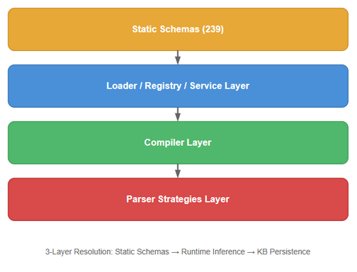
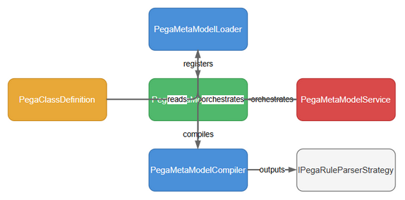
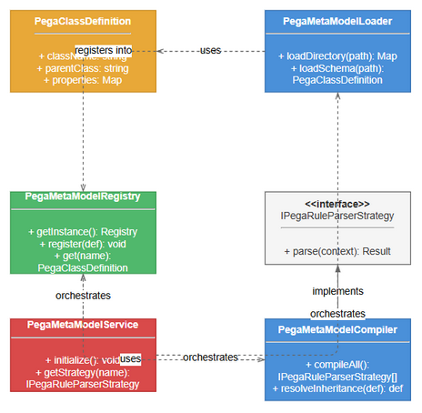

# Technical Design Document (TDD) — SA4E-65: Pega MetaModel Engine

**Title**: Pega MetaModel Engine — Auto-Schema Loading & Runtime Strategy Compilation
**Ticket Key**: SA4E-65
**Author**: SA Agent
**Status**: APPROVED
**Date**: 2026-07-27

---

## 1. Executive Summary & Core Architectural Principle

### 1.1 Core Principle: Runtime MetaModel Compilation Without Code Generation

The Pega MetaModel Engine is a runtime schema management system. It loads Pega rule class definitions from 239+ JSON schema files, resolves inheritance chains by merging parent properties into children, and dynamically compiles `IPegaRuleParserStrategy` instances. All operations happen at runtime — there is zero code generation.

This enables SDLC AI Agents to parse any Pega rule type without pre-compiled static parsers, and supports plug-and-play addition of new rule schema files without server restart or build steps.

---

## 2. Diagram Index & Visual Architecture

| Diagram ID | Title | Description | File Path |
| :--- | :--- | :--- | :--- |
| `tdd-arch` | System Architecture | Components, data flow, and 3-layer resolution | [tdd_architecture.png](./diagrams/tdd_architecture.png) |
| `tdd-component` | Component Diagram | PegaClassDefinition → PegaMetaModelLoader → PegaMetaModelRegistry → PegaMetaModelCompiler → PegaMetaModelService | [tdd_component.png](./diagrams/tdd_component.png) |
| `tdd-class` | Class Hierarchy Diagram | Class inheritance hierarchy and relationships | [tdd_class.png](./diagrams/tdd_class.png) |

### 2.1 System Architecture


### 2.2 Component Diagram


### 2.3 Class Hierarchy Diagram


---

## 3. Data Architecture — Schema File Format

### 3.1 Schema Directory Structure

```
backend/src/modules/pega/schemas/
├── rules/@baseclass.json        # Root of inheritance hierarchy
├── Rule-.json                   # Base category for all Rule-* types
├── Rule-Obj-.json               # Base category for Rule-Obj-* types
├── Rule-Connect-.json           # Base category for Rule-Connect-* types
├── Rule-Declare-.json           # Base category for Rule-Declare-* types
├── rules/                       # Concrete rule type schemas
│   ├── Rule-Obj-Activity.json
│   ├── Rule-Obj-Flow.json
│   ├── Rule-Obj-Model.json
│   ├── Rule-Obj-FlowAction.json
│   ├── Rule-Connect-REST.json
│   ├── Rule-Connect-SOAP.json
│   ├── Rule-Declare-DecisionTable.json
│   └── ... (239+ files)
├── data/                        # Data type schemas
│   ├── ...
└── embedded/                    # Embedded/child type schemas
    └── ...
```

### 3.2 Schema JSON Structure

```json
{
  "pxObjClass": "Rule-Obj-Class",
  "pyClassName": "Rule-Obj-Activity",
  "pyDerivesFrom": "Rule-Obj-",
  "pyLabel": "Activity",
  "pyDescription": "Pega Activity rule type definition",
  "pyRuleset": "@base",
  "pyRuleName": "Rule-Obj-Activity",
  "pyKeyDefList": [
    { "pxObjClass": "Embed-ClassKeys", "pyKeyName": "pyClassName", "pyKeyType": "Text" }
  ],
  "pxRuleReferences": [
    { "pxObjClass": "Embed-Reference-Rule", "pyRefObjectName": "Rule-Obj-Activity" }
  ]
}
```

### 3.3 PegaClassDefinition Interface

```typescript
interface PegaClassDefinition {
  pxObjClass: string;
  baseClass?: string;
  properties: PegaPropertyDef[];
  children: PegaChildDef[];
  description?: string;
  label?: string;
}

interface PegaPropertyDef {
  name: string;
  type: 'string' | 'number' | 'boolean' | 'ref' | 'json';
  required: boolean;
  isSystem: boolean;
  isReference: boolean;
  description?: string;
}

interface PegaChildDef {
  name: string;
  childType: string;
  arrayType: 'array' | 'single';
  description?: string;
}
```

### 3.4 Inheritance Chain Example

```
@baseclass
  └── Rule-              (baseClass: @baseclass)
       └── Rule-Obj-      (baseClass: Rule-)
            └── Rule-Obj-Activity  (baseClass: Rule-Obj-)
            └── Rule-Obj-Flow      (baseClass: Rule-Obj-)
            └── Rule-Obj-Model     (baseClass: Rule-Obj-)
       └── Rule-Connect-  (baseClass: Rule-)
            └── Rule-Connect-REST  (baseClass: Rule-Connect-)
            └── Rule-Connect-SOAP  (baseClass: Rule-Connect-)
       └── Rule-Declare-  (baseClass: Rule-)
            └── Rule-Declare-DecisionTable (baseClass: Rule-Declare-)
```

After inheritance resolution, `Rule-Obj-Activity` contains properties merged from: `@baseclass` + `Rule-` + `Rule-Obj-` + its own.

---

## 4. Component Breakdown

### 4.1 PegaMetaModelLoader (`backend/src/modules/pega/metamodel/PegaMetaModelLoader.ts`)

**Class**: `PegaMetaModelLoader`

**Responsibilities**:
- Recursively scan schema directory for `.json` files
- Parse each file into a `PegaClassDefinition`
- Resolve inheritance chains via recursive parent property/child merging
- Provide runtime `registerClass()` for dynamic additions

**Key Algorithm — `resolveInheritance()`**:
```
for each className in registry:
  resolve(className)

resolve(className):
  if already resolved, return cached
  def = registry[className]
  if def.baseClass exists:
    parentDef = resolve(def.baseClass)
    if parentDef:
      def.properties = merge(parentDef.properties, def.properties)  // child wins
      def.children = merge(parentDef.children, def.children)        // child wins
  mark resolved
  return def
```

**System Field Detection**: Fields starting with `pxCreate`, `pxUpdate`, `pxInstance`, `pxHost`, `pxMove`, `pxSibling`, `pxLimitedAccess`, `pzChecksum`, `pzIndex`, `pzReindex`, `pzOriginal`, `pxAllChangeList`, `pxWarnings`, `pxNamedPageReferences`, `pxAPIMethodReferences` are marked as system fields.

**Reference Field Detection**: Fields in `pyClassName`, `pySuperClass`, `pyPatternParent`, `pyDerivesFrom`, `pyRuleName`, `pyModelName`, `pyActivityName`, `pyTransformName`, `pyWhenCondition`, `pyOnChangeTrigger`, `pyFlowActionName`, `pyFlowName`, `pyBlockName`, `pyPropertyName`, `pyMethodParameters` are marked as reference fields.

### 4.2 PegaMetaModelRegistry (`backend/src/modules/pega/metamodel/PegaMetaModelRegistry.ts`)

**Class**: `PegaMetaModelRegistry` (Singleton)

**Responsibilities**:
- Maintain a single shared instance across the application
- Lazy initialization with idempotency guard (promise-based)
- Delegate to `PegaMetaModelLoader` for class storage and lookup
- Provide `registerClass()` for runtime schema additions

**Singleton Pattern**:
```typescript
private static instance: PegaMetaModelRegistry;
public static getInstance(): PegaMetaModelRegistry
```

### 4.3 PegaMetaModelCompiler (`backend/src/modules/pega/metamodel/PegaMetaModelCompiler.ts`)

**Class**: `PegaMetaModelCompiler`, `CompiledPegaRuleParserStrategy`

**Responsibilities**:
- Wrap each `PegaClassDefinition` in an `IPegaRuleParserStrategy`
- Implement `supports()` with 4 matching rules
- Extract symbol metadata and dependency references from raw JSON
- Order compiled strategies by inheritance depth for specificity

**Matching Algorithm (`supports`)**:
```
supports(pxObjClass):
  1. if exact match → true
  2. if this is @baseclass → true (matches everything)
  3. if classDef ends with '-' and pxObjClass starts with prefix → true
  4. if pxObjClass derives from this.classDef via inheritance chain → true
  else → false
```

**Strategy Ordering (`compileAll`)**:
```
1. Compute inheritance depth for each class via computeDepth()
2. Sort classes by depth descending (most concrete first)
3. Compile each into a strategy
4. When registering, sort by depth ascending (generic first) so unshift puts concrete first
```

**Dependency Detection** (`extractDependencies`):
- Enumerate all properties marked `isReference` in the class definition
- Scan JSON for fields ending in reference suffixes (`Name`, `Class`, `Profile`, `Transform`, `Condition`, `From`, `Evaluated`, `Trigger`, `Action`, `Target`, `Source`, `Expression`)
- De-duplicate by `fieldName:value` key
- Infer rule type from field name patterns (e.g., `pyWhenCondition` → `Rule-Obj-When`)

### 4.4 PegaMetaModelService (`backend/src/modules/pega/metamodel/PegaMetaModelService.ts`)

**Class**: `PegaMetaModelService`

**Responsibilities**:
- Orchestrate the full pipeline: load → compile → register
- Provide idempotent initialization
- Expose access to compiler, loader, and parser registry

**Initialization Sequence**:
```
initialize(schemaDir):
  1. metaRegistry.initialize(schemaDir)     // Load + resolve schemas
  2. compiler.compileAll()                   // Generate strategies
  3. compiler.registerAll(parserRegistry)   // Register with specificity ordering
  4. initialized = true
```

---

## 5. Interface Contracts

### IPegaRuleParserStrategy

```typescript
interface IPegaRuleParserStrategy {
  supports(pxObjClass: string): boolean;
  parse(json: Record<string, unknown>): ParseResult;
}
```

### ParseResult

```typescript
interface ParseResult {
  symbol: {
    fqn: string;            // "{pxObjClass}:{className}:{name}"
    name: string;           // Extracted rule name
    className: string;      // Applies-to class
    ruleType: string;       // pxObjClass
    isRule: boolean;        // pxObjClass.startsWith('Rule-')
    ruleset?: string;       // pyRuleset
    version?: string;       // pyRulesetVersion
    logicSummary?: string;  // Human-readable summary
  };
  dependencies: UnresolvedDependency[];
}
```

---

## 6. File Manifest

| File | Lines | WP | Description |
|------|-------|----|-------------|
| `backend/src/modules/pega/metamodel/PegaClassDefinition.ts` | 24 | WP1 | Type definitions |
| `backend/src/modules/pega/metamodel/PegaMetaModelLoader.ts` | 241 | WP1 | Schema loading + inheritance resolution |
| `backend/src/modules/pega/metamodel/PegaMetaModelRegistry.ts` | 49 | WP1 | Singleton registry |
| `backend/src/modules/pega/metamodel/PegaMetaModelCompiler.ts` | 337 | WP2 | Strategy compilation |
| `backend/src/modules/pega/metamodel/PegaMetaModelService.ts` | 64 | WP2 | Initialization orchestrator |
| `backend/src/modules/pega/__tests__/metamodel/PegaMetaModel.test.ts` | 227 | WP1 | 23 tests for loader/registry |
| `backend/src/modules/pega/__tests__/metamodel/PegaMetaModelCompiler.test.ts` | 543 | WP2 | 18 tests for compiler/service |
