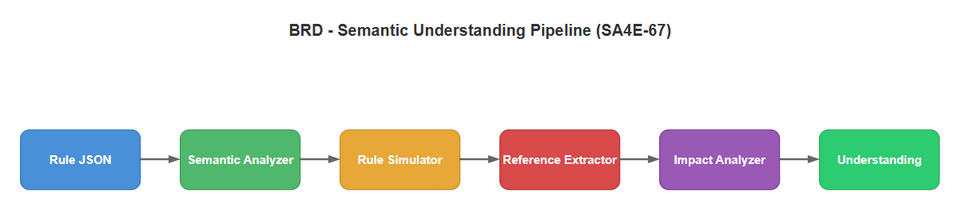
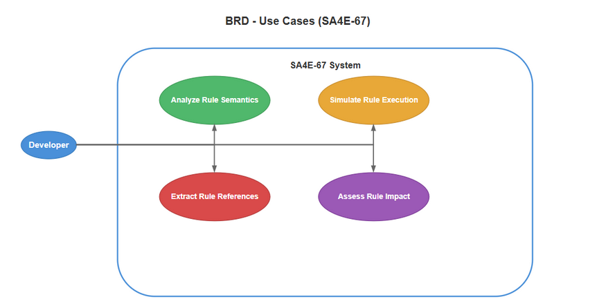

# Business Requirements Document (BRD) — SA4E-67

**Title**: Semantic Understanding + Reference Analysis for SDLC Multi-Agent Pipeline  
**Ticket Key**: SA4E-67  
**Author**: SM Agent (Coordinated with BA, TA, SA, DEV, QA, Security, DevOps)  
**Status**: APPROVED  
**Date**: 2026-07-27  

---

## 1. Executive Summary & Core Architectural Principle

### 1.1 Core Principle: Local Semantic Understanding in KB (Zero Blind Delegation)
**CRITICAL DESIGN DIRECTIVE**: The SDLC-Agents-4-Enterprise platform **MUST** understand Pega rules semantically without relying on the Pega runtime for interpretation.

- **SA4E-56/57** established local AST parsing and knowledge base storage.
- **SA4E-67** elevates this foundation to **semantic understanding**: the system can now analyze what a rule **does** (semantic summary, intent, side effects), **simulate** its execution offline, **extract** all cross-rule dependencies via 11 strategies, and **assess impact** of changes with risk scoring and test suggestions.

### 1.2 Four Work Packages

| WP | Component | Tests | Description |
| :--- | :--- | :--- | :--- |
| WP1 | PegaSemanticAnalyzer | 33 | Rule-type-specific semantic analysis (Activity, DT, Flow, Decision, Section, Connect, Declare) |
| WP2 | PegaRuleSimulator | 15 | Offline execution simulation (Activity steps, DT mappings, Flow nav, DecisionTable eval) |
| WP3 | PegaReferenceExtractor 2.0 | 26 | 11-strategy reference extraction, dependency graph, cycle & orphan detection |
| WP4 | PegaImpactAnalyzer | 11 | Risk assessment, scope determination, test suggestions, DOT graph export |

---

## 2. Diagram Index & Visual Architecture

| Diagram ID | Title | Description | File Path |
| :--- | :--- | :--- | :--- |
| `brd-process` | Understanding Flow | End-to-end flow from rule JSON to semantic analysis, simulation, reference graph | [brd_understanding_flow.png](./diagrams/brd_understanding_flow.png) |
| `brd-usecases` | Use Case Diagram | BA, SA, DEV, QA, DevOps use cases for semantic analysis and impact analysis | [brd_use_case.png](./diagrams/brd_use_case.png) |

### 2.1 Understanding Flow

### 2.2 Use Case Diagram

---

## 3. Business Objectives & Requirements

### BR-01: Semantic Analysis of All Pega Rule Types (Understand Axis)
- **Requirement**: For every Pega rule type (Activity, DataTransform, Flow, Decision Table/Tree, Section, Connect-REST/SOAP/SQL, Declare Expressions/Pages/PCA), produce a human-readable semantic analysis including: summary text, intent description, side effects (api_call, page_update, db_write), data flow (input → transform → output), dependencies, and condition summaries.
- **Target Component**: PegaSemanticAnalyzer (`backend/src/modules/pega/semantic/PegaSemanticAnalyzer.ts`).
- **Coverage**: 7 rule type analyzers (analyzeActivity, analyzeDataTransform, analyzeFlow, analyzeDecision, analyzeSection, analyzeConnect, analyzeDeclare) + generic fallback.
- **Side Effect Detection**: API Call (Call, Connect-REST/SOAP/SQL), DB Write (Obj-Save, Obj-Delete, Save, Commit), Page Update (Property-Set, Page-New, Obj-Open).

### BR-02: Offline Rule Simulation Without Pega Runtime (Simulate Axis)
- **Requirement**: Simulate execution of Pega rules entirely offline: Activity step execution (with when-condition guard evaluation), DataTransform field mapping simulation, Flow navigation (delegating to PegaWorkflowEngine via PegaFlowGraph), and DecisionTable evaluation (parsing condition strings, evaluating via DecisionTableEvaluator). Generate step-by-step execution trace with timestamps.
- **Target Component**: PegaRuleSimulator (`backend/src/modules/pega/semantic/PegaRuleSimulator.ts`).
- **Coverage**: Activity (max steps configurable, when-skip, Call/Branch, Property-Set, Obj-Save/Delete, Page-New), DataTransform (Set, Apply Data Transform, Page-New-Transform), Flow (shape→connector→PegaFlowGraph→WorkflowEngine), DecisionTable (condition parsing → DecisionTableEvaluator).

### BR-03: Comprehensive Reference/Dependency Extraction with 11 Strategies (Discover Axis)
- **Requirement**: Extract all cross-rule references from any Pega rule JSON using 11 distinct extraction strategies: (1) MetaModel-based isReference properties, (2) Known reference field map (14 explicit mappings), (3) Convention-based suffix detection (15 suffixes), (4) Activity step scanning (Call/Branch, when conditions), (5) DataTransform action scanning, (6) Flow shape scanning, (7) pxRuleReferences array scanning, (8) Declare Pages source class references, (9) Decision/Strategy component references, (10) pyMethodParameters scanning, (11) UI Layout recursive when-condition extraction. Build full dependency graph (nodes + edges) with cycle detection (DFS-based) and orphan detection.
- **Target Component**: PegaReferenceExtractor (`backend/src/modules/pega/references/PegaReferenceExtractor.ts`).
- **Edge Types**: calls, extends, implements, configures, references.

### BR-04: Impact Analysis for Change Management (Govern Axis)
- **Requirement**: Assess impact of changing a Pega rule: direct and indirect dependents, impact scope (local/module/crossModule/system), risk level (low/medium/high), and suggested test types (unit, integration, E2E, regression). Support batch analysis for multiple changes. Export DOT graph for visualization.
- **Target Component**: PegaImpactAnalyzer (`backend/src/modules/pega/references/PegaImpactAnalyzer.ts`).
- **Test Suggestions**: Rule type-specific (Activity step test, DT mapping test, When condition test, Connect endpoint test, Decision strategy test).

### BR-05: Dependency Graph with Cycle and Orphan Detection (Visualize Axis)
- **Requirement**: Build directed dependency graph from extracted references. Detect cycles (DFS with recursion stack). Detect orphan nodes (nodes not referenced by any edge). Calculate dependency depth (BFS). Identify all transitive dependents. Export to DOT format for external graph visualization tools.
- **Target Component**: PegaReferenceExtractor (graph methods: buildGraph, findCycles, findOrphans, calculateDepth, getDependents, getAllDependents) + PegaImpactAnalyzer.toDot().

---

## 4. Work Package Specifications

### WP1: PegaSemanticAnalyzer
- **File**: `backend/src/modules/pega/semantic/PegaSemanticAnalyzer.ts` (582 lines)
- **Entry Point**: `analyze(json)` — dispatches to type-specific analyzer based on `pxObjClass`
- **Analyzers**:
  - `analyzeActivity`: iterates steps, detects Call/Branch, Property-Set/Copy, Obj-Save/Delete, Page-New; extracts when-conditions; produces summary, intent, sideEffects, deps, conditions, dataFlow
  - `analyzeDataTransform`: iterates pyActions (Set, Apply Data Transform); produces propertyMappings, dataFlow
  - `analyzeFlow`: iterates pyShapes; extracts flowActionName, whenCondition, class references; produces shapeTypes, route description
  - `analyzeDecision`: iterates pyDecisionTableRows; extracts condition text, property evaluated; triggers dependencies
  - `analyzeSection`: recursively extracts pyPropertyName, pyLayoutType from nested JSON
  - `analyzeConnect`: extracts baseUrl, resourcePath, httpMethod, authType; sideEffect: api_call
  - `analyzeDeclare`: extracts targetProperty, expression; dataFlow from expression property refs
- **Output**: `SemanticAnalysis` interface (ruleType, name, summary, intent, sideEffects, dependencies, conditions, dataFlow, plus type-specific fields)

### WP2: PegaRuleSimulator
- **File**: `backend/src/modules/pega/semantic/PegaRuleSimulator.ts` (476 lines)
- **Entry Point**: `simulate(request)` — dispatches based on `pxObjClass`
- **Simulators**:
  - `simulateActivity`: iterates steps, evaluates when-conditions via PegaExpressionEvaluator, skips on false; traces Call/Branch, Property-Set, Obj-Save/Delete, Page-New; configurable maxSteps (default 100)
  - `simulateDataTransform`: iterates pyActions, evaluates when-conditions; traces Set, Apply Data Transform, Page-New-Transform
  - `simulateFlow`: builds PegaFlowGraph from shapes/connectors, delegates to PegaWorkflowEngine.simulate()
  - `simulateDecisionTable`: maps rows to PegaDecisionTableRow, delegates to PegaDecisionTableEvaluator.evaluate()
- **Output**: `SimulationResult` (success, trace: step-by-step events, errors, executionTimeMs)

### WP3: PegaReferenceExtractor 2.0
- **File**: `backend/src/modules/pega/references/PegaReferenceExtractor.ts` (513 lines)
- **Entry Point**: `extractFromRule(json)`
- **11 Extraction Strategies**:
  1. MetaModel-based isReference property traversal
  2. Known reference field map (14 fields: pySuperClass, pyWhenCondition, pyFlowActionName, pyAuthProfile, etc.)
  3. Convention-based suffix detection (15 suffixes: Name, Class, Profile, Transform, Condition, From, Evaluated, Trigger, Action, Target, Source, Expression)
  4. Activity step scanning (Call/Branch methods, when conditions, flow action names)
  5. DataTransform action scanning (pyTransformName, when conditions, activity names)
  6. Flow shape scanning (pyFlowActionName, pyWhenCondition, pyClassName)
  7. pxRuleReferences array scanning
  8. Declare Pages source class references (pyPages[].pySourceClass)
  9. Decision/Strategy component references (pyRef, pyWhenRef, pyTreatment)
  10. pyMethodParameters top-level scanning
  11. UI Layout recursive when-condition extraction (pyLayouts/pyLayouts with nested children)
- **Graph Methods**: buildGraph, findCycles (DFS with recStack), findOrphans, calculateDepth (BFS), getDependents, getAllDependents (transitive)

### WP4: PegaImpactAnalyzer
- **File**: `backend/src/modules/pega/references/PegaImpactAnalyzer.ts` (220 lines)
- **Entry Point**: `analyzeChange(ruleName, graph)`
- **Impact Scope**: local (0 dependents, or 1 category with ≤5 dependents), module (1 category with >5 dependents), crossModule (2-3 categories, any dependent count), system (≥4 categories)
- **Risk**: low (local scope), medium (module/crossModule with ≤10 dependents, or base class), high (system, crossModule with >10, module with >20)
- **Test Suggestions**: risk-based + rule type-specific
- **Batch Analysis**: `analyzeBatch(changes[], graph)`
- **DOT Export**: `toDot(graph)` — rankdir=LR, rounded box nodes, dashed for optional edges, labeled edges for non-reference relations

---

## 5. Verification & Quality Gates

| Phase | Quality Gate | Criteria |
| :--- | :--- | :--- |
| Phase 1: BA | Requirement Coverage | 100% coverage of Understand, Simulate, Discover, Govern, Visualize axes |
| Phase 2: TA | Architecture Alignment | 4 WPs mapped cleanly to semantic/ and references/ modules |
| Phase 3: SA | Technical Design | TDD specifies all class interfaces, data flows, and graph algorithms |
| Phase 4: QA | Test Plan | STP covers 85 tests (33 WP1 + 15 WP2 + 26 WP3 + 11 WP4) |
| Phase 5: DEV | Implementation | Code complies with SOLID, 200 lines/file limit, 0 lint errors |
| Phase 6: QA | Execution | 100% pass rate on all test suites (48 semantic + 37 reference) |
| Phase 7: DevOps | Release Package | Complete documentation and verification |
