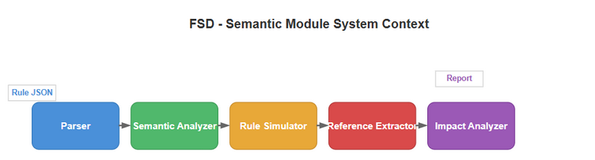
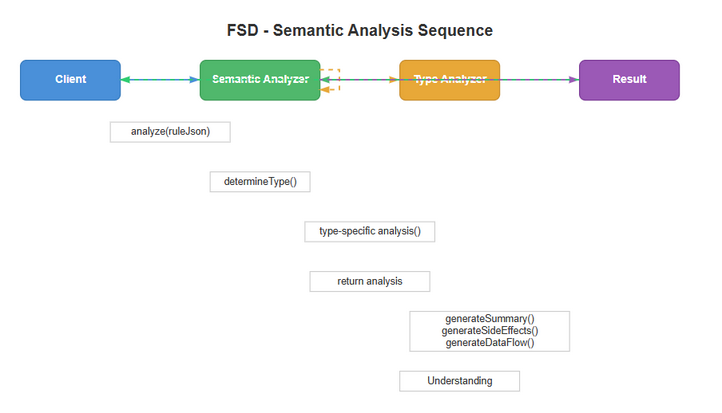
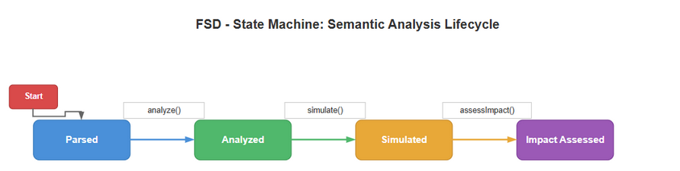

# Functional Specification Document (FSD) — SA4E-67

**Title**: Semantic Understanding + Reference Analysis for SDLC Multi-Agent Pipeline  
**Ticket Key**: SA4E-67  
**Author**: BA + TA Agent  
**Status**: APPROVED  
**Date**: 2026-07-27  

---

## 1. Executive Summary & Core Architectural Principle

### 1.1 Core Principle: Local Semantic Knowledge Base
Building on SA4E-56/57's local AST parsing and KB storage, SA4E-67 adds **semantic understanding** and **dependency analysis** layers. All rule JSON stored in the KB can now be analyzed, simulated, and cross-referenced without any Pega runtime calls. The four work packages form a pipeline: analyze → simulate → extract references → assess impact.

### 1.2 Pipeline Architecture
```
Rule JSON (from KB)
    │
    ├─→ PegaSemanticAnalyzer (WP1) → SemanticAnalysis (summary, intent, side effects, data flow)
    │
    ├─→ PegaRuleSimulator (WP2) → SimulationResult (execution trace, errors)
    │
    ├─→ PegaReferenceExtractor (WP3) → DependencyGraph (nodes + edges, cycles, orphans)
    │
    └─→ PegaImpactAnalyzer (WP4) → ImpactAnalysis (scope, risk, test suggestions, DOT)
```

All four components operate on the same `Record<string, unknown>` rule JSON format produced by the existing SA4E-57 parsing pipeline.

---

## 2. Diagram Index & Visual Architecture

| Diagram ID | Title | Description | File Path |
| :--- | :--- | :--- | :--- |
| `fsd-context` | FSD System Context Architecture | Semantic pipeline data flow from KB JSON → 4 WPs → AI Agents | [fsd_system_context.png](./diagrams/fsd_system_context.png) |
| `fsd-seq` | FSD Sequence Flow | Functional flow across all 4 WPs with agent interactions | [fsd_sequence.png](./diagrams/fsd_sequence.png) |
| `fsd-state` | FSD State Diagram | State transitions for semantic analysis pipeline | [fsd_state.png](./diagrams/fsd_state.png) |

### 2.1 System Context Architecture


### 2.2 Sequence Flow Diagram


### 2.3 State Diagram


---

## 3. Interface Specifications

### 3.1 PegaSemanticAnalyzer Interface

| Method | Input | Output | Description |
|--------|-------|--------|-------------|
| `analyze(json)` | `Record<string, unknown>` | `SemanticAnalysis` | Dispatch to type-specific analyzer based on pxObjClass |
| `analyzeActivity(json)` | Activity rule JSON | `SemanticAnalysis` | Step analysis: Call/Branch, Property-Set, Obj-Save/Delete, Page-New, when-conditions |
| `analyzeDataTransform(json)` | DataTransform rule JSON | `SemanticAnalysis` | Field mapping analysis: Set actions, sub-transform references |
| `analyzeFlow(json)` | Flow rule JSON | `SemanticAnalysis` | Shape/connector analysis: flow actions, when-conditions, class refs |
| `analyzeDecision(json)` | DecisionTable/Tree JSON | `SemanticAnalysis` | Condition row analysis: property evaluated, results, trigger refs |
| `analyzeSection(json)` | Section HTML/UI JSON | `SemanticAnalysis` | Field/layout extraction: pyPropertyName, pyLayoutType |
| `analyzeConnect(json)` | Connect-REST/SOAP/SQL JSON | `SemanticAnalysis` | API endpoint details: URL, method, auth, request/response classes |
| `analyzeDeclare(json)` | Declare Expressions/PCA JSON | `SemanticAnalysis` | Expression analysis: target property, declarative expressions |

### 3.2 PegaRuleSimulator Interface

| Method | Input | Output | Description |
|--------|-------|--------|-------------|
| `simulate(request)` | `SimulationRequest` | `SimulationResult` | Dispatch to type-specific simulator based on pxObjClass |
| `simulateActivity(json, context, options?)` | Activity JSON + clipboard | `SimulationResult` | Step-by-step activity execution with when-condition guard evaluation |
| `simulateDataTransform(json, context, options?)` | DT JSON + clipboard | `SimulationResult` | Field value mapping simulation |
| `simulateFlow(json, context, options?)` | Flow JSON + clipboard | `SimulationResult` | Flow navigation via PegaFlowGraph + PegaWorkflowEngine |
| `simulateDecisionTable(json, context, options?)` | DT JSON + clipboard | `SimulationResult` | Decision table evaluation via DecisionTableEvaluator |

`SimulationOptions`: `{ maxSteps?: number; collectTrace?: boolean; timeoutMs?: number }`
`SimulationResult`: `{ success: boolean; outputClipboard?: object; trace: SimulationTrace[]; errors: string[]; executionTimeMs: number }`
`SimulationTrace`: `{ step: number; action: string; detail: string; timestamp: number }`

### 3.3 PegaReferenceExtractor Interface

| Method | Input | Output | Description |
|--------|-------|--------|-------------|
| `extractFromRule(json)` | Rule JSON | `ResolvedDependency[]` | 11-strategy reference extraction |
| `buildGraph(rules[])` | Array of rule JSON | `DependencyGraph` | Build full dependency graph (nodes + edges) |
| `findCycles(graph)` | DependencyGraph | `string[][]` | DFS-based cycle detection with recursion stack |
| `findOrphans(graph)` | DependencyGraph | `string[]` | Nodes not referenced as edge targets |
| `calculateDepth(name, graph)` | Rule name + graph | `number` | BFS-based max depth from named node |
| `getDependents(name, graph)` | Rule name + graph | `string[]` | Direct dependents of rules with given name |
| `getAllDependents(fqn, graph)` | FQN + graph | `string[]` | All transitive dependents (BFS) |

`ResolvedDependency`: `{ type: string; name: string; relation: 'calls' | 'extends' | 'implements' | 'configures' | 'references'; fieldName: string; optional: boolean }`
`DependencyGraph`: `{ nodes: DependencyNode[]; edges: DependencyEdge[] }`

### 3.4 PegaImpactAnalyzer Interface

| Method | Input | Output | Description |
|--------|-------|--------|-------------|
| `analyzeChange(ruleName, graph)` | Rule name + graph | `ImpactAnalysis` | Single rule impact analysis |
| `analyzeBatch(changes[], graph)` | Rule names + graph | `Map<string, ImpactAnalysis>` | Batch impact analysis |
| `suggestTests(analysis, allRules)` | ImpactAnalysis + rules | `string[]` | Generate test suggestions |
| `toDot(graph)` | DependencyGraph | `string` | DOT format graph export |

`ImpactAnalysis`: `{ ruleName, ruleType, directDependents, indirectDependents, impactScope: 'local'|'module'|'crossModule'|'system', risk: 'low'|'medium'|'high', suggestedTests: string[] }`

---

## 4. Data Flow

### 4.1 Semantic Analysis Pipeline
```
KB Rule JSON → PegaSemanticAnalyzer.analyze()
    ├─ Activity → analyzeActivity() → summary + stepDescs + sideEffects + conditions + dataFlow
    ├─ DT      → analyzeDataTransform() → summary + propertyMappings + dataFlow
    ├─ Flow    → analyzeFlow() → summary + shapeTypes + conditions
    ├─ Decision→ analyzeDecision() → summary + decisionRows + conditions
    ├─ Section → analyzeSection() → summary + renderedFields + layoutTypes
    ├─ Connect → analyzeConnect() → summary + endpointUrl + httpMethod + auth
    └─ Declare → analyzeDeclare() → summary + expression + targetProperty
```

### 4.2 Simulation Pipeline
```
KB Rule JSON + ClipboardContext → PegaRuleSimulator.simulate()
    ├─ Activity → simulateActivity() → trace (start→step1→step2→...→complete) + errors
    ├─ DT      → simulateDataTransform() → trace (start→set→apply→complete)
    ├─ Flow    → simulateFlow() → PegaFlowGraph → PegaWorkflowEngine → trace
    └─ Decision→ simulateDecisionTable() → DecisionTableEvaluator → trace (eval→matched/no_match)
```

### 4.3 Reference Extraction Pipeline
```
KB Rule JSON(s) → PegaReferenceExtractor.extractFromRule()
    11 strategies → ResolvedDependency[] → buildGraph() → DependencyGraph
        ├─ findCycles() → cycle report
        ├─ findOrphans() → orphan list
        ├─ calculateDepth() → depth per rule
        ├─ getDependents() / getAllDependents() → dependent lists
        └─ PegaImpactAnalyzer.toDot() → DOT graph
```

---

## 5. Functional Requirements per WP

### WP1-FR-01: Activity Semantic Analysis
Analyze all steps in a Rule-Obj-Activity: detect Call/Branch method calls (→ api_call side effect), Property-Set/Copy (→ page_update, dataFlow), Obj-Save/Save/Obj-Delete (→ db_write), Page-New (→ page_update). Extract when-condition guards. Produce human-readable summary with step descriptions.

### WP1-FR-02: DataTransform Semantic Analysis
Analyze all actions in a Rule-Obj-Model: detect Set actions (→ property mappings), "Apply Data Transform" actions (→ sub-transform dependency), when-conditions. Produce data flow: source → target mapping.

### WP1-FR-03: Flow Semantic Analysis
Analyze shapes in a Rule-Obj-Flow: detect flow action references, when-condition branches, class references. Identify start/end shapes. Produce route description: starts at X → routes through N shapes → ends at Y.

### WP1-FR-04: Decision Semantic Analysis
Analyze rows in Rule-Declare-DecisionTable/Tree: parse condition text, extract property evaluated, detect return action transforms (→ dependency). Produce condition summary with field/operator/value.

### WP1-FR-05: Section Semantic Analysis
Recursively traverse Rule-Obj-Section JSON: extract all pyPropertyName values (→ rendered fields), pyLayoutType values (→ layout types). Produce field list and layout type list.

### WP1-FR-06: Connect Semantic Analysis
Analyze Rule-Connect-REST/SOAP/SQL JSON: extract base URL, resource path, HTTP method, auth type, request/response classes. Produce api_call side effect with endpoint details.

### WP1-FR-07: Declare Semantic Analysis
Analyze Rule-Declare-Expressions/Pages/PCA: extract target property, expression text. Extract property references from expression via regex. Produce data flow: input properties → expression → output property.

### WP2-FR-01: Activity Simulation
Execute Activity steps sequentially: evaluate when-condition via PegaExpressionEvaluator (skip if false), trace each method execution with action type (call/set/db_write/page_new/execute/noop), respect maxSteps limit, report errors.

### WP2-FR-02: DataTransform Simulation
Execute DT actions sequentially: evaluate when-condition, trace Set (source→target) and Apply Data Transform actions, report errors.

### WP2-FR-03: Flow Simulation
Build PegaFlowGraph from shapes and connectors, delegate to PegaWorkflowEngine.simulate(), collect execution log as trace, report completion status.

### WP2-FR-04: DecisionTable Simulation
Parse condition strings from rows (field operator value), build PegaDecisionTableRow array, delegate to PegaDecisionTableEvaluator.evaluate(), collect trace path, report matched row and result.

### WP3-FR-01: 11-Strategy Reference Extraction
Extract all references from rule JSON using all 11 strategies in sequence: MetaModel, known field map, convention suffixes, activity steps, DT actions, flow shapes, pxRuleReferences, declare pages, strategy components, pyMethodParameters, UI layouts.

### WP3-FR-02: Dependency Graph Construction
Build graph from multiple rule JSONs: each rule → node (FQN = type:class:name), each extracted reference → directed edge (source→target with relation type). Deduplicate edges and nodes.

### WP3-FR-03: Cycle Detection
DFS on directed graph using recursion stack. Extract cycles as array of FQN strings showing the circular path.

### WP3-FR-04: Orphan Detection
Identify graph nodes that have no incoming edges (no other rule references them). Return list of rule names.

### WP3-FR-05: Transitive Dependency Resolution
BFS from a given FQN following edges backward (incoming edges) to find all direct and indirect dependents.

### WP4-FR-01: Impact Scope Determination
Based on number of dependents and diversity of rule type categories: 0 → local, 1-3 categories with ≤5 → local, 1-3 categories with >5 → module, 2-3 categories → crossModule, ≥4 categories → system.

### WP4-FR-02: Risk Assessment
Based on scope and dependent count: local → low, module with ≤20 → medium, module with >20 → high, crossModule → medium, crossModule with >10 → high, system → high, base class → medium.

### WP4-FR-03: Test Suggestion Generation
Generate tailored test suggestions based on risk (high → regression), direct dependents (unit tests), indirect dependents (integration tests), crossModule/system scope (E2E), and rule type (Activity → step test, DT → mapping test, When → condition test, Connect → endpoint test, Decision → strategy test).

### WP4-FR-04: DOT Graph Export
Generate DOT format string: node declarations with labels (name + type), edge declarations with style (dashed for optional) and labels (for non-reference relations), rankdir=LR, rounded box shapes.
