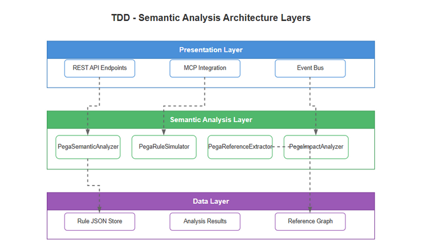
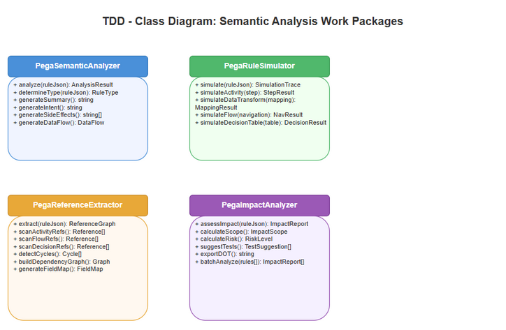
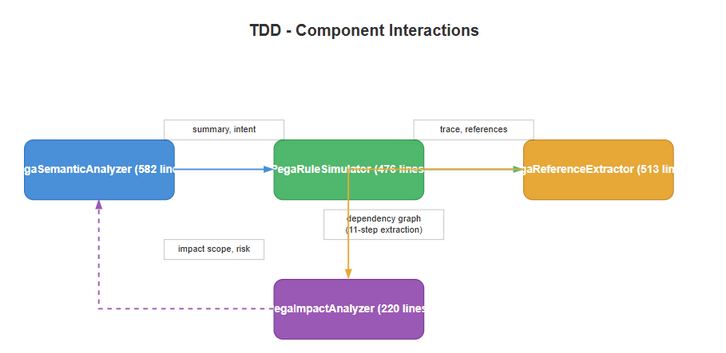

# Technical Design Document (TDD) — SA4E-67

**Title**: Semantic Understanding + Reference Analysis for SDLC Multi-Agent Pipeline  
**Ticket Key**: SA4E-67  
**Author**: SA Agent  
**Status**: APPROVED  
**Date**: 2026-07-27  

---

## 1. Executive Summary & Core Architectural Principle

### 1.1 Core Principle: Local Semantic Intelligence
SA4E-67 extends the local AST knowledge base with four new layers of intelligence: semantic analysis (understanding what rules do), offline simulation (predicting execution behavior), reference extraction (mapping all cross-rule dependencies), and impact analysis (assessing change risk). All four operate entirely in-memory on the same JSON rule representations produced by SA4E-57's parsing pipeline. No new database tables or external services are required.

---

## 2. Diagram Index & Visual Architecture

| Diagram ID | Title | Description | File Path |
| :--- | :--- | :--- | :--- |
| `tdd-arch` | TDD Architecture | 4-module architecture with data flow and inter-module dependencies | [tdd_architecture.png](./diagrams/tdd_architecture.png) |
| `tdd-class` | Technical Class Diagram | Class hierarchy for all 4 WP components with public methods | [tdd_class.png](./diagrams/tdd_class.png) |
| `tdd-interaction` | Component Interaction Diagram | How WP1-4 interact with existing Pega parser and KB modules | [tdd_component.png](./diagrams/tdd_component.png) |

### 2.1 Architecture Diagram


### 2.2 Technical Class Diagram


### 2.3 Component Interaction Flow


---

## 3. Data Architecture & Type Definitions

### 3.1 Semantic Analysis Types (`types.ts`)

```
SemanticAnalysis
├── ruleType: string           — pxObjClass discriminator
├── name: string               — extracted rule name
├── className?: string         — Applies To class
├── summary: string            — human-readable summary
├── intent: string             — single-line intent description
├── sideEffects: SideEffect[]  — detected side effect list
│   └── SideEffect { type: 'api_call'|'db_write'|'page_update', target, detail }
├── dependencies: SemanticDep[] — detected dependency list
│   └── SemanticDep { type, target, targetClass, context }
├── conditions: ConditionSummary[] — when/if condition list
│   └── ConditionSummary { field, operator, value, description }
├── dataFlow: DataFlowEntry[]  — data transformation entries
│   └── DataFlowEntry { input, transform, output }
├── steps?: number             — activity step count
├── calledActivities?: string[]
├── setProperties?: string[]
├── propertyMappings?: PropertyMapping[]
├── shapeTypes?: string[]
├── decisionRows?: number
├── propertyEvaluated?: string
├── renderedFields?: string[]
├── layoutTypes?: string[]
├── endpointUrl?: string
├── httpMethod?: string
├── authType?: string
├── targetProperty?: string
└── expression?: string
```

### 3.2 Simulation Types

```
SimulationRequest
├── pxObjClass: string
├── json: Record<string, unknown>
├── inputClipboard?: Record<string, Record<string, unknown>>
└── options?: SimulationOptions { maxSteps?, collectTrace?, timeoutMs? }

SimulationResult
├── success: boolean
├── outputClipboard?: Record<string, Record<string, unknown>>
├── trace: SimulationTrace[]
│   └── SimulationTrace { step: number, action: string, detail: string, timestamp: number }
├── errors: string[]
└── executionTimeMs: number
```

### 3.3 Reference Types

```
ResolvedDependency
├── type: string               — target rule type (Rule-Obj-Activity, etc.)
├── name: string               — target rule name
├── relation: 'calls'|'extends'|'implements'|'configures'|'references'
├── fieldName: string          — source JSON field that contained the reference
└── optional: boolean          — whether the reference is optional

DependencyNode
├── fqn: string                — fully qualified name (type:class:name)
├── name: string
├── type: string
└── className: string

DependencyEdge
├── source: string             — source FQN
├── target: string             — target FQN
├── relation: ResolvedDependency['relation']
├── fieldName: string
└── optional: boolean

DependencyGraph
├── nodes: DependencyNode[]
└── edges: DependencyEdge[]
```

### 3.4 Impact Types

```
ImpactAnalysis
├── ruleName: string
├── ruleType: string
├── directDependents: string[]
├── indirectDependents: string[]
├── impactScope: 'local'|'module'|'crossModule'|'system'
├── risk: 'low'|'medium'|'high'
└── suggestedTests: string[]
```

---

## 4. Module Breakdown

### 4.1 `PegaSemanticAnalyzer` (`semantic/PegaSemanticAnalyzer.ts`)

| Method | Access | Complexity | Description |
|--------|--------|-----------|-------------|
| `analyze(json)` | public | O(n steps/actions/shapes) | Main dispatch — routes by pxObjClass |
| `analyzeActivity(json)` | public | O(steps) | Step-by-step activity analysis |
| `analyzeDataTransform(json)` | public | O(actions) | Field mapping analysis |
| `analyzeFlow(json)` | public | O(shapes) | Flow shape/connector analysis |
| `analyzeDecision(json)` | public | O(rows) | Decision table row analysis |
| `analyzeSection(json)` | public | O(fields) | Recursive field extraction |
| `analyzeConnect(json)` | public | O(1) | Connector endpoint analysis |
| `analyzeDeclare(json)` | public | O(expr) | Declarative expression analysis |
| `analyzeGeneric(json, classDef)` | public | O(props) | Generic fallback via MetaModel |
| `extractName(json)` | private | O(1) | Extract rule name from candidate fields |
| `extractPropertyRefs(expr)` | private | O(n chars) | Regex-based property reference extraction |

**Side Effect Detection Logic**:
- `SIDE_EFFECT_API_CALL` Set: `Call`, `Connect-REST`, `Connect-SOAP`, `Connect-SQL`, `Connect-File`, `Rule-Connect-REST`, `Rule-Connect-SOAP`, `Rule-Connect-SQL`
- `SIDE_EFFECT_DB_WRITE` Set: `Property-Set`, `Obj-Save`, `Obj-Delete`, `Commit`, `Save`, `Obj-Open-And-Update`
- `SIDE_EFFECT_PAGE_UPDATE` Set: `Property-Set`, `Property-Copy`, `Page-New`, `Page-Copy`, `Obj-Open`, `Obj-Open-By-Handle`

### 4.2 `PegaRuleSimulator` (`semantic/PegaRuleSimulator.ts`)

| Method | Access | Complexity | Description |
|--------|--------|-----------|-------------|
| `simulate(request)` | public | O(steps/actions/shapes/rows) | Main dispatch |
| `simulateActivity(json, context, options?)` | public | O(steps) | Activity execution simulation |
| `simulateDataTransform(json, context, options?)` | public | O(actions) | DT field mapping simulation |
| `simulateFlow(json, context, options?)` | public | O(shapes + WF engine) | Flow navigation simulation |
| `simulateDecisionTable(json, context, options?)` | public | O(rows) | Decision table condition eval |
| `evaluateExpression(expr, context)` | public | O(expr) | Evaluate single expression |

**Dependencies**: `PegaExpressionEvaluator`, `PegaClipboardContext`, `PegaWorkflowEngine`, `PegaFlowGraph`, `PegaDecisionTableEvaluator`, `parseDecisionCondition`

### 4.3 `PegaReferenceExtractor` (`references/PegaReferenceExtractor.ts`)

| Method | Access | Complexity | Description |
|--------|--------|-----------|-------------|
| `extractFromRule(json)` | public | O(props + steps + actions + shapes) | 11-strategy extraction |
| `buildGraph(rules[])` | public | O(rules × deps) | Build full dependency graph |
| `findCycles(graph)` | public | O(V + E) | DFS cycle detection |
| `findOrphans(graph)` | public | O(E) | Nodes with no incoming edges |
| `calculateDepth(name, graph)` | public | O(V + E) | BFS depth calculation |
| `getDependents(name, graph)` | public | O(E) | Direct dependents |
| `getAllDependents(fqn, graph)` | public | O(V + E) | Transitive dependents (BFS) |

**Reference Field Map** (14 explicit mappings):
pySuperClass → Rule-Obj-Class (extends), pyPatternParent → Rule-Obj-Class (extends), pyDerivesFrom → Rule-Obj-Class (extends), pyWhenCondition → Rule-Obj-When (references), pyOnChangeTrigger → Rule-Obj-When (configures), pyFlowActionName → Rule-Obj-FlowAction (references), pyPropertyName → Rule-Obj-Property (references), pyPropertyEvaluated → Rule-Obj-Property (references), pyAuthProfile → Rule-Connect-AuthProfile (configures), pyRequestDataTransform → Rule-Obj-Model (configures), pyResponseDataTransform → Rule-Obj-Model (configures), pyAccessGroup → Data-Admin-AccessGroup (references), pyAccessRole → Rule-Access-Role-Name (references), pyPrivilegeName → Rule-Access-Privilege (references), pyBlockName → Rule-Obj-When (references), pyStartProcess → Rule-Obj-Activity (calls), pyMapRuleSet → Rule-Obj-MapValue (references), pyTargetProperty → Rule-Obj-FieldValue (references), pyDatasource → Rule-Obj-Report- (references), pyPortal → Rule-Portal (references), pySkin → Rule-Portal-Skin (references)

**Convention Suffixes** (15): Name, Class, Profile, Transform, Condition, From, Evaluated, Trigger, Action, Target, Source, Expression

### 4.4 `PegaImpactAnalyzer` (`references/PegaImpactAnalyzer.ts`)

| Method | Access | Complexity | Description |
|--------|--------|-----------|-------------|
| `analyzeChange(ruleName, graph)` | public | O(V + E) | Single rule impact analysis |
| `analyzeBatch(changes[], graph)` | public | O(changes × (V+E)) | Batch impact analysis |
| `suggestTests(analysis, allRules)` | public | O(1) | Generate test suggestions |
| `toDot(graph)` | public | O(V + E) | DOT graph export |
| `determineScope(...)` | private | O(V + E) | Scope classification |
| `determineRisk(...)` | private | O(V) | Risk classification |

**Scope Logic**:
- `local`: 0 dependents, OR 1 category with ≤5 dependents
- `module`: 1 category with >5 dependents
- `crossModule`: 2-3 categories (any dependent count)
- `system`: ≥4 categories (any dependent count)

Implementation order (PegaImpactAnalyzer.ts:165-195):
```
if (allDependents.length === 0) return 'local';
if (categories.size >= 4) return 'system';
if (categories.size >= 2) return 'crossModule';
if (allDependents.length > 5) return 'module';
return 'local';
```

**Risk Logic**:
- `low`: local scope
- `medium`: module scope (≤20 dependents), crossModule scope (≤10), or base class reference
- `high`: system scope, crossModule with >10 dependents, module with >20 dependents

---

## 5. Integration Points

### 5.1 With SA4E-57 Pega Module
- Input: `Record<string, unknown>` rule JSON (from KB or direct fetch) — same format produced by Pega parser
- Expression Evaluator: `PegaRuleSimulator` reuses `PegaExpressionEvaluator` and `PegaClipboardContext` from `expression/`
- Workflow Engine: `PegaRuleSimulator.simulateFlow()` reuses `PegaWorkflowEngine` and `PegaFlowGraph` from `workflow/`
- Decision Evaluator: `PegaRuleSimulator.simulateDecisionTable()` reuses `PegaDecisionTableEvaluator` and `parseDecisionCondition` from `decision/`

### 5.2 Module Dependencies
```
PegaSemanticAnalyzer ──── depends on: types.ts, PegaRuleAst, PegaClassDefinition
PegaRuleSimulator ─────── depends on: expression/*, workflow/*, decision/*
PegaReferenceExtractor ── depends on: metamodel/PegaClassDefinition
PegaImpactAnalyzer ────── depends on: PegaReferenceExtractor (graph types)
```

### 5.3 File Layout
```
backend/src/modules/pega/
├── semantic/
│   ├── PegaSemanticAnalyzer.ts   (582 lines)
│   ├── PegaRuleSimulator.ts      (476 lines)
│   └── types.ts                  (57 lines)
└── references/
    ├── PegaReferenceExtractor.ts (513 lines)
    └── PegaImpactAnalyzer.ts     (220 lines)
```
