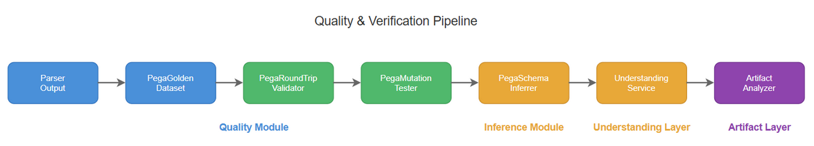
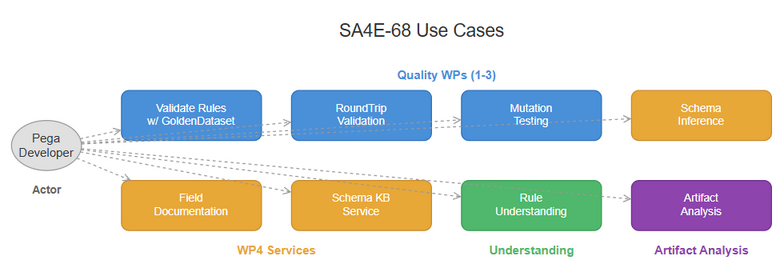

# Business Requirements Document (BRD) — SA4E-68

**Title**: Build Quality & Verification Tools for Pega Parser: Golden Dataset, Round-Trip Validator, Mutation Tester, Schema Inference, Understanding Service & Artifact Analyzer  
**Ticket Key**: SA4E-68  
**Author**: SM Agent (Coordinated with BA, TA, SA, DEV, QA, Security, DevOps)  
**Status**: APPROVED  
**Date**: 2026-07-27  

---

## 1. Executive Summary & Core Architectural Principle

### 1.1 Core Principle: Quality-Driven Parsing with Self-Learning Schema Inference
The SDLC-Agents-4-Enterprise platform must guarantee **parser correctness, robustness, and self-learning capability** through a comprehensive quality toolkit. Three quality layers ensure the Pega parser produces reliable ASTs:

- **Golden Dataset (WP1)**: 15 realistic Pega rule samples across 15 rule types serve as ground truth. Each sample carries expected references, child counts, and field values. The `verify()` method compares parsed AST output against these expectations, catching regressions instantly.
- **Round-Trip Validator (WP2)**: Parse → serialize → compare field-by-field. Detects lost fields, added fields, and value changes. Excludes system fields (px*, pz*) from comparison to focus on semantic correctness.
- **Mutation Tester (WP3)**: 6 mutation strategies (field value change, field removal, type change, random field addition, child removal) with 9 predefined mutations per sample. Uses AST fingerprinting to verify that mutations produce detectably different ASTs.

Three additional layers enable self-learning and LLM-ready understanding:
- **Schema Inference (WP4)**: Runtime schema inference for unknown rule types via 3-layer resolution (known → base class inference → fallback). Persists learned schemas to KB for cross-session reuse.
- **Understanding Service**: Orchestrates inferrer, documentor, semantic analyzer, simulator, reference extractor, registry, and compiler into a single `understand()` call returning LLM-ready prompt context.
- **Artifact Analyzer**: `analyze_artifact` MCP tool with 4 analyzers (PegaRule, GenericCode, Structure, Fallback) and priority-based content detection.

---

## 2. Diagram Index & Visual Architecture

| Diagram ID | Title | Description | File Path |
| :--- | :--- | :--- | :--- |
| `brd-process` | Quality Verification Pipeline | Golden Dataset → Round-Trip → Mutation Testing workflow | [brd_quality_flow.png](./diagrams/brd_quality_flow.png) |
| `brd-usecases` | Quality Tools Use Cases | Use cases for Golden Dataset, Round-Trip, Mutation, Schema Inference, Understanding, Artifact Analyzer | [brd_use_case.png](./diagrams/brd_use_case.png) |

### 2.1 Quality Verification Pipeline

### 2.2 Quality Tools Use Cases

---

## 3. Business Objectives & Requirements

### BR-01: Golden Dataset of 15 Realistic Pega Rule Samples
- **Requirement**: Provide 15 realistic, representative Pega rule samples covering 15 rule types: Activity, DataTransform, Flow, DecisionTable, DecisionTree, When, Section, ConnectREST, ConnectSOAP, DeclareExpression, DeclarePages, FlowAction, Class, Utility, AccessRole.
- **Each sample includes**: `name`, `pxObjClass`, full JSON payload, `expectedReferences` array, `expectedChildren` count.
- **Target**: `PegaGoldenDataset.verify()` compares parsed AST against expected values and returns structured `VerificationResult`.

### BR-02: Round-Trip Validation (Parse → Serialize → Compare)
- **Requirement**: For any Pega rule JSON, parse it into AST → serialize the AST back to JSON → compare field-by-field.
- **Output**: Reports `lostFields`, `addedFields`, `preservedFields`, and `differences`.
- **System field exclusion**: All `px*` and `pz*` fields are excluded from diff to focus on semantic correctness.
- **Type-specific name mapping**: 15 rule types mapped to their primary name fields (e.g., `pyActivityName` for Activity, `pyModelName` for DataTransform).

### BR-03: Mutation Testing for Parser Robustness
- **Requirement**: Verify the parser detects changes by applying 6 mutation strategies and checking AST fingerprints differ.
- **Strategies**: `mutateFieldValue`, `removeField`, `changeType`, `addRandomField`, `removeChild`.
- **Predefined suite**: `runMutationSuite()` runs 9 mutations covering field change, removal, type change, random addition, child removal, empty string, null value, and malformed array.

### BR-04: Runtime Schema Inference for Unknown Rule Types
- **Requirement**: Infer schemas from raw JSON at runtime for rule types not in the metamodel registry.
- **3-layer resolution**: (1) Known schema in registry, (2) Base class inference from `pxObjClass` name segments, (3) Full inference via `ensureSchema()`.
- **Property inference**: Type detection (string, number, boolean, ref), system field detection (px*, pz* prefixes), reference field detection (suffix matching).
- **Child inference**: Array fields with non-primitive items detected as child collections.

### BR-05: Field-Level Documentation for LLM Consumption
- **Requirement**: Generate human-readable field documentation for any Pega rule JSON, consumable by LLM agents.
- **Coverage**: 78 field descriptions covering standard Pega fields (pyActivityName, pyClassName, pyLabel, pyRuleset, etc.).
- **Output**: `generatePromptContext()` produces structured text with rule type, fields, types, required status, sample values, and descriptions.

### BR-06: KB Persistence of Learned Schemas (Cross-Session Learning)
- **Requirement**: Save inferred schemas to the Knowledge Base (`knowledge_entries` table with type `PEGA_SCHEMA`) so they persist across sessions.
- **Duplicate prevention**: Existing schemas are not re-saved (checked by source key `pega-schema:{pxObjClass}`).
- **Load on startup**: `loadSchemasFromKB()` loads all persisted schemas and registers them with the metamodel registry.

### BR-07: Unified PegaRuleUnderstandingService (One-Call LLM-Ready Context)
- **Requirement**: Orchestrate 7 services (inferrer, documentor, semantic analyzer, simulator, reference extractor, metamodel registry, metamodel compiler) into a single `understand()` call.
- **Output**: `PegaRuleUnderstanding` object with schema, field docs, semantic analysis, dependencies, dependency graph, simulation, and formatted `promptContext` string.
- **Optional simulation**: Callers can opt-in to rule simulation by passing `simulate: true`.

### BR-08: Generic Artifact Analyzer (analyze_artifact MCP Tool)
- **Requirement**: Expose an MCP tool `analyze_artifact` that accepts arbitrary content, auto-detects its type, and routes to the appropriate analyzer.
- **Detection priority**: `pega_rule` (most specific, pxObjClass present) → `structured_data` (JSON/XML/YAML) → `code` (25+ language keyword patterns) → `unknown` (fallback).
- **Analyzers**: PegaRuleAnalyzer (full understanding via UnderstandingService), GenericCodeAnalyzer (language detection, function/class counting), StructureAnalyzer (JSON schema tree, XML tags, YAML keys), FallbackAnalyzer (basic metadata, content hash, binary detection).

---

## 4. Functional Specifications — The 8 Quality & Verification Services

### UC-01: Golden Dataset Verification
- **Description**: Load each golden sample → parse via `PegaRuleAstParser` → compare AST against expected `ruleType`, `name`, `children.length`, and `references`.
- **Target Agent**: QA Agent, DEV Agent.

### UC-02: Round-Trip Validation
- **Description**: Submit any Pega rule JSON → validate parse-serialize-compare → review diff report.
- **Target Agent**: QA Agent, DEV Agent.

### UC-03: Mutation Test Suite
- **Description**: Run 9 predefined mutations against a sample → verify each mutation produces a detectably different AST fingerprint.
- **Target Agent**: QA Agent, DEV Agent.

### UC-04: Schema Inference
- **Description**: Submit unknown rule type JSON → infer properties, children, and base class → register in metamodel registry.
- **Target Agent**: SA Agent, DEV Agent.

### UC-05: Field Documentation
- **Description**: Submit rule JSON → receive structured field-level documentation with descriptions, types, sample values.
- **Target Agent**: BA Agent, SA Agent, DEV Agent.

### UC-06: Schema KB Persistence
- **Description**: Save inferred schemas to KB → load on next startup → cross-session learning.
- **Target Agent**: DevOps Agent.

### UC-07: Rule Understanding
- **Description**: Submit rule JSON → receive complete understanding (schema, docs, semantics, dependencies, simulation).
- **Target Agent**: BA Agent, SA Agent, DEV Agent.

### UC-08: Artifact Analysis
- **Description**: Submit any content → auto-detect type → route to analyzer → return structured analysis.
- **Target Agent**: All Agents, MCP callers.

---

## 5. Verification & Quality Gates

| Phase | Quality Gate | Criteria |
| :--- | :--- | :--- |
| Phase 1: BA | Requirement Coverage | 100% coverage of Golden Dataset, Round-Trip, Mutation, Schema Inference, Field Docs, KB Service, Understanding Service, Artifact Analyzer. |
| Phase 2: TA | Architecture Alignment | Quality, inference, understanding, and artifact analyzer modules mapped cleanly with clear interfaces. |
| Phase 3: SA | Technical Design | TDD specifies all classes, interfaces, data flows, and service orchestrations. |
| Phase 4: QA | Test Plan | STP covers 54 quality tests + 145 inference/understanding/artifact tests = 199 total. |
| Phase 5: DEV | Implementation | Code complies with SOLID, 200 lines/file limit, and 0 lint errors. |
| Phase 6: QA | Execution | 100% pass rate on all 199 automated tests. |
| Phase 7: DevOps | Release Package | Complete documentation with deployment guide, release notes, and checksums. |
