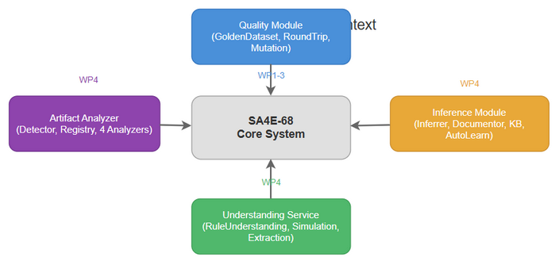
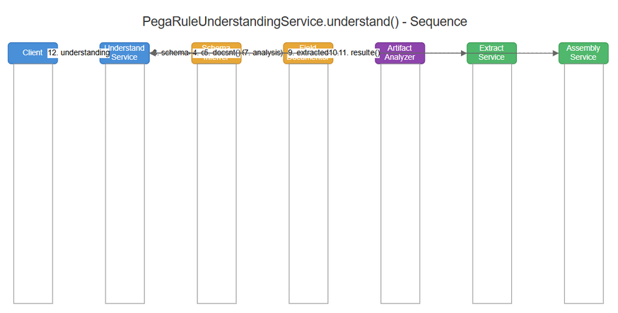
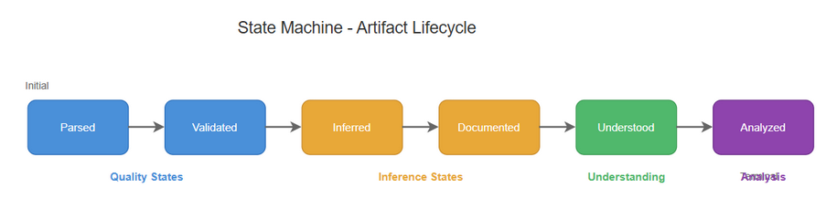

# Functional Specification Document (FSD) — SA4E-68

**Title**: Build Quality & Verification Tools for Pega Parser: Golden Dataset, Round-Trip Validator, Mutation Tester, Schema Inference, Understanding Service & Artifact Analyzer  
**Ticket Key**: SA4E-68  
**Author**: BA + TA Agent  
**Status**: APPROVED  
**Date**: 2026-07-27  

---

## 1. Executive Summary & Core Architectural Principle

### 1.1 Core Principle: Layered Quality Verification with Self-Learning Inference
The SDLC-Agents-4-Enterprise platform enforces parser quality through three verification layers: **Golden Dataset** (baseline correctness), **Round-Trip Validation** (parse-serialize fidelity), and **Mutation Testing** (change detection). These are complemented by **Self-Learning Schema Inference** which enables the parser to understand unknown rule types at runtime, persist learned schemas across sessions, and produce LLM-ready understanding context.

- **Quality Layer (WP1-WP3)**: Deterministic verification using ground-truth samples, field-by-field round-trip comparison, and AST fingerprint-based mutation detection.
- **Inference Layer (WP4)**: Runtime schema inference, field documentation, KB persistence, and auto-learning.
- **Understanding Layer**: Unified orchestration of 7 services for one-call rule understanding.
- **Analyzer Layer**: Generic artifact analysis MCP tool with type detection and 4 specialized analyzers.

---

## 2. Diagram Index & Visual Architecture

| Diagram ID | Title | Description | File Path |
| :--- | :--- | :--- | :--- |
| `fsd-context` | Quality System Context | Data flow from Pega Rule JSON → Quality Tools → AST Verification → Reports | [fsd_system_context.png](./diagrams/fsd_system_context.png) |
| `fsd-seq` | Quality Verification Sequence | End-to-end sequence across Golden Dataset, Round-Trip, Mutation, Inference, Understanding, Artifact Analysis | [fsd_sequence.png](./diagrams/fsd_sequence.png) |
| `fsd-state` | Quality & Inference State Flow | State transitions across quality tools, inference pipeline, and artifact analyzer | [fsd_state.png](./diagrams/fsd_state.png) |

### 2.1 Quality System Context


### 2.2 Quality Verification Sequence


### 2.3 Quality & Inference State Flow


---

## 3. Interface Specifications

### 3.1 Quality Module Interfaces

#### GoldenTestSample
```typescript
interface GoldenTestSample {
  name: string;
  pxObjClass: string;
  json: Record<string, unknown>;
  expectedReferences: string[];
  expectedSummary?: string;
  expectedChildren: number;
}
```

#### VerificationResult
```typescript
interface VerificationResult {
  sampleName: string;
  passed: boolean;
  issues: string[];
  ast: PegaRuleAst;
}
```

#### RoundTripResult
```typescript
interface RoundTripResult {
  ruleName: string;
  ruleType: string;
  success: boolean;
  originalFields: string[];
  preservedFields: string[];
  lostFields: string[];
  addedFields: string[];
  differences: string[];
}
```

#### Mutation & MutationTestResult
```typescript
interface Mutation {
  name: string;
  description: string;
  apply(original: Record<string, unknown>): Record<string, unknown>;
}

interface MutationTestResult {
  mutationName: string;
  originalValid: boolean;
  mutatedValid: boolean;
  detectedDifference: boolean;
  parserErrorMessage?: string;
}
```

### 3.2 Inference Module Interfaces

#### PegaClassDefinition
```typescript
interface PegaClassDefinition {
  pxObjClass: string;
  properties: PegaPropertyDef[];
  children: PegaChildDef[];
  baseClass?: string;
  label?: string;
  description?: string;
}

interface PegaPropertyDef {
  name: string;
  type: 'string' | 'number' | 'boolean' | 'ref';
  required: boolean;
  isSystem: boolean;
  isReference: boolean;
}

interface PegaChildDef {
  name: string;
  childType: string;
  arrayType: 'array';
}
```

#### FieldDocumentation
```typescript
interface FieldDocumentation {
  fieldName: string;
  type: string;
  description: string;
  sampleValues: string[];
  isReference: boolean;
  isRequired: boolean;
}
```

### 3.3 Understanding Service Interface

#### PegaRuleUnderstanding
```typescript
interface PegaRuleUnderstanding {
  pxObjClass: string;
  name: string;
  className: string;
  fqn: string;
  schema: {
    classDefinition: PegaClassDefinition;
    fieldDocs: string;
    inferred: boolean;
  };
  semantics: {
    summary: string;
    intent: string;
    sideEffects: SideEffect[];
    dataFlow: DataFlowEntry[];
    conditions: ConditionSummary[];
  };
  dependencies: ResolvedDependency[];
  dependencyGraph: string;
  simulation: SimulationResult | null;
  promptContext: string;
}
```

### 3.4 Artifact Analyzer Interfaces

#### ArtifactAnalysis
```typescript
interface ArtifactAnalysis {
  type: 'pega_rule' | 'code' | 'structured_data' | 'unknown';
  summary: string;
  promptContext: string;
  details: Record<string, unknown>;
  detectedBy: string;
}

interface ArtifactAnalyzer {
  type: ArtifactType;
  canAnalyze(content: string, options?: Record<string, unknown>): boolean;
  analyze(content: string, options?: Record<string, unknown>): Promise<ArtifactAnalysis> | ArtifactAnalysis;
}
```

---

## 4. Quality Tools Specifications

### 4.1 PegaGoldenDataset (`backend/src/modules/pega/quality/PegaGoldenDataset.ts`)
- **396 lines, 15 golden samples**
- 15 rule types: Activity, DataTransform, Flow, DecisionTable, DecisionTree, When, Section, ConnectREST, ConnectSOAP, DeclareExpression, DeclarePages, FlowAction, Class, Utility, AccessRole
- `getAllSamples()` returns all 15 samples
- `verify(sample, ast)` compares AST vs expected ruleType, name, children count, and references

### 4.2 PegaRoundTripValidator (`backend/src/modules/pega/quality/PegaRoundTripValidator.ts`)
- **247 lines, 9 tests**
- Steps: `parse(json)` → `serializeAst(ast)` → field-by-field comparison
- System field exclusion: px*, pz* fields silently excluded
- Type-specific name field mapping: 15 entries in `RULE_TYPE_NAME_FIELDS`
- `validateBatch()` for bulk validation
- `assertPropertiesPreserved()` checks semantic field survivability

### 4.3 PegaMutationTester (`backend/src/modules/pega/quality/PegaMutationTester.ts`)
- **175 lines, 16 tests**
- 6 mutation strategies: `mutateFieldValue`, `removeField`, `changeType`, `addRandomField`, `removeChild`
- `runMutationSuite()`: 9 predefined mutations
- `fingerprint()`: deterministic AST fingerprint for comparison
- `testMutation()`: compares original vs mutated fingerprint

### 4.4 PegaSchemaInferrer (`backend/src/modules/pega/inference/PegaSchemaInferrer.ts`)
- **138 lines**
- `inferFromRule(pxObjClass, json)`: Infers properties and children
- `inferProperties(json)`: Type detection (string, number, boolean, ref), system field filtering, reference detection
- `inferChildren(json)`: Array field detection for child collections
- `inferBaseClass(pxObjClass, registry)`: 3-layer resolution (known → segment match → @baseclass)
- `ensureSchema()` / `ensureSchemaAsync()`: Auto-register missing schemas

### 4.5 PegaFieldDocumentor (`backend/src/modules/pega/inference/PegaFieldDocumentor.ts`)
- **123 lines, 78 field descriptions**
- `documentField(key, value)`: Single field documentation
- `documentClass(pxObjClass, json)`: Full class documentation
- `generatePromptContext()`: LLM-ready structured context
- Field descriptions for 78 commonly used Pega fields

### 4.6 PegaSchemaKBService (`backend/src/modules/pega/inference/PegaSchemaKBService.ts`)
- **161 lines**
- `saveSchemaToKB(def)`: Persists schema to knowledge_entries with type PEGA_SCHEMA
- `loadSchemasFromKB()`: Loads all persisted schemas on startup
- `learnSchema()`: Learn + persist in one call
- `toKbSchema()` / `fromKbSchema()`: Bidirectional conversion

### 4.7 PegaSchemaAutoLearner (`backend/src/modules/pega/inference/PegaSchemaAutoLearner.ts`)
- **23 lines**
- `learn()`: KB learn → compile strategy
- `initialize()`: Load schemas → compile all

### 4.8 PegaRuleUnderstandingService (`backend/src/modules/pega/understanding/PegaRuleUnderstandingService.ts`)
- **235 lines**
- Orchestrates 7 services: inferrer, documentor, analyzer, simulator, extractor, registry, compiler
- `understand(json, options)`: One-call rule understanding
- `toPromptContext()`: Formatted LLM context with schema, semantics, dependencies, simulation
- Optional simulation via `simulate: true`

### 4.9 Artifact Analyzer Module (`backend/src/engine/tools/artifact-analyzer/`)
- **Types**: ArtifactType, ArtifactAnalysis, ArtifactAnalyzer interface
- **ArtifactDetector**: Priority-based type detection (pega_rule → JSON → XML → code → YAML → unknown)
- **ArtifactAnalyzerRegistry**: Plugin registry with default analyzers, `analyze()` routing
- **PegaRuleAnalyzer**: Full understanding via UnderstandingService
- **GenericCodeAnalyzer**: Language detection (25 languages), function/class counting, import extraction
- **StructureAnalyzer**: JSON schema tree, XML tag analysis, YAML key analysis
- **FallbackAnalyzer**: Basic metadata, content hash (MD5), binary detection
