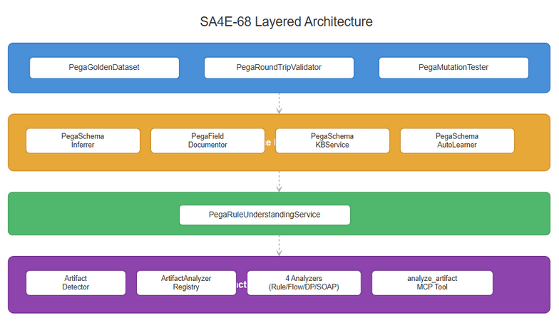
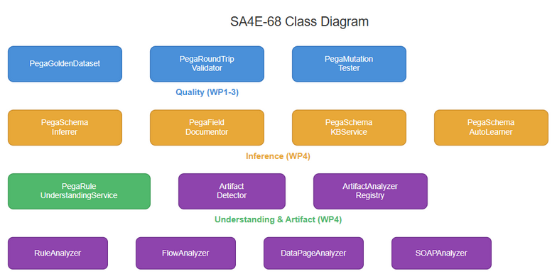
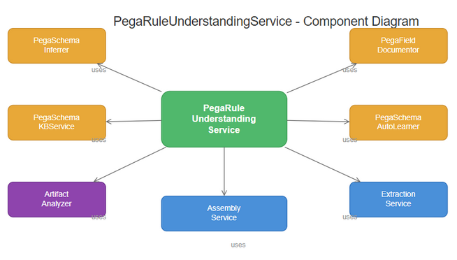

# Technical Design Document (TDD) — SA4E-68

**Title**: Build Quality & Verification Tools for Pega Parser: Golden Dataset, Round-Trip Validator, Mutation Tester, Schema Inference, Understanding Service & Artifact Analyzer  
**Ticket Key**: SA4E-68  
**Author**: SA Agent  
**Status**: APPROVED  
**Date**: 2026-07-27  

---

## 1. Executive Summary & Core Architectural Principle

### 1.1 Core Principle: Layered Quality with Self-Learning Inference Pipeline
The SA4E-68 epic delivers 8 components organized across 4 layers:

1. **Quality Layer**: Deterministic AST verification via golden samples, round-trip validation, and mutation testing
2. **Inference Layer**: Runtime schema inference, field documentation, KB persistence, and auto-learning
3. **Understanding Layer**: Unified orchestration service producing LLM-ready context
4. **Analyzer Layer**: Generic artifact analysis MCP tool with pluggable analyzers

All components reside in the existing Node.js Hono Backend. No database migrations required — schemas persist to existing `knowledge_entries` table with type `PEGA_SCHEMA`.

---

## 2. Diagram Index & Visual Architecture

| Diagram ID | Title | Description | File Path |
| :--- | :--- | :--- | :--- |
| Diagram ID | Title | Description | File Path |
| :--- | :--- | :--- | :--- |
| `tdd-arch` | Quality & Inference System Architecture | Architecture showing quality, inference, understanding, and artifact analyzer modules | [tdd_architecture.png](./diagrams/tdd_architecture.png) |
| `tdd-class` | Quality & Inference Class Diagram | Class hierarchy for GoldenDataset, RoundTripValidator, MutationTester, SchemaInferrer, FieldDocumentor, KBService, UnderstandingService, ArtifactAnalyzer | [tdd_class.png](./diagrams/tdd_class.png) |
| `tdd-component` | Component Interaction Diagram | Step-by-step communication between quality tools, inference pipeline, understanding service, and artifact analyzer | [tdd_component.png](./diagrams/tdd_component.png) |

### 2.1 Quality & Inference System Architecture


### 2.2 Class Diagram


### 2.3 Component Interaction Flow


---

## 3. Module Architecture

### 3.1 Quality Module (`backend/src/modules/pega/quality/`)

#### PegaGoldenDataset
```
PegaGoldenDataset
  ├── getActivitySample(): GoldenTestSample
  ├── getDataTransformSample(): GoldenTestSample
  ├── getFlowSample(): GoldenTestSample
  ├── getDecisionTableSample(): GoldenTestSample
  ├── getDecisionTreeSample(): GoldenTestSample
  ├── getWhenSample(): GoldenTestSample
  ├── getSectionSample(): GoldenTestSample
  ├── getConnectRestSample(): GoldenTestSample
  ├── getConnectSOAPSample(): GoldenTestSample
  ├── getDeclareExpressionSample(): GoldenTestSample
  ├── getDeclarePagesSample(): GoldenTestSample
  ├── getFlowActionSample(): GoldenTestSample
  ├── getClassSample(): GoldenTestSample
  ├── getUtilitySample(): GoldenTestSample
  ├── getAccessRoleSample(): GoldenTestSample
  ├── getAllSamples(): GoldenTestSample[]
  └── verify(sample, ast): VerificationResult
```

Dependencies: `PegaRuleAstParser` for parsing, `PegaRuleAst` for AST type.

#### PegaRoundTripValidator
```
PegaRoundTripValidator
  ├── constructor(parser: PegaRuleAstParser)
  ├── validate(json: Record<string, unknown>): RoundTripResult
  ├── validateBatch(samples[]): RoundTripResult[]
  └── assertPropertiesPreserved(original, result): boolean
```

Internal helpers: `serializeAst(ast)`, `getFieldPaths(obj)`, `getValueAtPath(obj, path)`, `deepEqual(a, b)`.
Constant: `RULE_TYPE_NAME_FIELDS` — maps 15 rule types to their primary name-carrying fields.

#### PegaMutationTester
```
PegaMutationTester
  ├── constructor(parser?)
  ├── mutateFieldValue(original, field, newValue)
  ├── removeField(original, field)
  ├── changeType(original, newType)
  ├── addRandomField(original)
  ├── removeChild(original, childArray, index)
  ├── testMutation(original, mutation): MutationTestResult
  ├── runMutationSuite(sample): MutationTestResult[]
  └── fingerprint(json): string
```

Internal helpers: `setNestedField()`, `deleteNestedField()`, `parseSafely()`.

### 3.2 Inference Module (`backend/src/modules/pega/inference/`)

#### PegaSchemaInferrer
```
PegaSchemaInferrer
  ├── inferFromRule(pxObjClass, json): PegaClassDefinition
  ├── inferProperties(json): PegaPropertyDef[]
  ├── inferChildren(json): PegaChildDef[]
  ├── inferBaseClass(pxObjClass, registry): string
  ├── hasKnownSchema(pxObjClass, registry): boolean
  ├── ensureSchema(pxObjClass, json, registry): PegaClassDefinition
  ├── ensureSchemaAsync(pxObjClass, json, registry): Promise<PegaClassDefinition>
  └── isReferenceField(key): boolean
```

System field prefixes: `['pxCreate', 'pxUpdate', 'pxInstance', 'pxHost', 'pxMove', 'pxSibling', 'pxLimitedAccess', 'pzChecksum', 'pzIndex', 'pzReindex', 'pzOriginal', 'pxAllChangeList', 'pxWarnings', 'pxNamedPageReferences', 'pxAPIMethodReferences']`

Reference field suffixes: `['Name', 'Class', 'Profile', 'Transform', 'Condition', 'From', 'Evaluated', 'Trigger', 'Action', 'Target', 'Source', 'Expression']`

#### PegaFieldDocumentor
```
PegaFieldDocumentor
  ├── constructor(inferrer)
  ├── documentField(key, value, allValues): FieldDocumentation
  ├── documentClass(pxObjClass, json, registry): FieldDocumentation[]
  └── generatePromptContext(pxObjClass, json, registry): string
```

FIELD_DESCRIPTIONS: 78 entries covering standard Pega fields.

#### PegaSchemaKBService
```
PegaSchemaKBService
  ├── constructor(adapter, registry, inferrer, logger?)
  ├── saveSchemaToKB(def, projectId?): Promise<void>
  ├── loadSchemasFromKB(): Promise<number>
  ├── learnSchema(pxObjClass, json, projectId?): Promise<PegaClassDefinition>
  ├── toKbSchema(def): PegaRuleKbSchema
  └── fromKbSchema(kb): PegaClassDefinition
```

#### PegaSchemaAutoLearner
```
PegaSchemaAutoLearner
  ├── constructor(kbService, compiler)
  ├── learn(pxObjClass, json, projectId?): Promise<IPegaRuleParserStrategy>
  └── initialize(): Promise<void>
```

### 3.3 Understanding Module (`backend/src/modules/pega/understanding/`)

#### PegaRuleUnderstandingService
```
PegaRuleUnderstandingService
  ├── constructor(inferrer, documentor, analyzer, simulator, extractor, registry, compiler)
  ├── understand(json, options?): Promise<PegaRuleUnderstanding>
  ├── toPromptContext(understanding): string
  └── extractRuleName(json): string (private)
      buildDependencyGraphText(deps): string (private)
```

Orchestrates 7 services in `understand()`:
1. `PegaSchemaInferrer.ensureSchema()` — schema resolution
2. `PegaFieldDocumentor.generatePromptContext()` — field documentation
3. `PegaSemanticAnalyzer.analyze()` — semantic analysis
4. `PegaReferenceExtractor.extractFromRule()` — dependency extraction
5. `PegaRuleSimulator.simulate()` — optional simulation
6. `PegaMetaModelRegistry` — schema registry
7. `PegaMetaModelCompiler` — strategy compilation

### 3.4 Artifact Analyzer Module (`backend/src/engine/tools/artifact-analyzer/`)

#### Types
```
ArtifactType = 'pega_rule' | 'code' | 'structured_data' | 'unknown'

interface ArtifactAnalysis {
  type: ArtifactType;
  summary: string;
  promptContext: string;
  details: Record<string, unknown>;
  detectedBy: string;
}

interface ArtifactAnalyzer {
  type: ArtifactType;
  canAnalyze(content, options?): boolean;
  analyze(content, options?): ArtifactAnalysis | Promise<ArtifactAnalysis>;
}
```

#### ArtifactDetector
Detection priority:
1. `pega_rule` — content contains `"pxObjClass"` or `'pxObjClass'`
2. `structured_data` (JSON) — starts with `{` or `[`, valid JSON
3. `structured_data` (XML) — matches XML pattern
4. `code` — matches 20+ code pattern regexes
5. `structured_data` (YAML) — matches YAML key:value pattern
6. `unknown` — fallback

#### ArtifactAnalyzerRegistry
```
ArtifactAnalyzerRegistry
  ├── constructor() => registerDefaults()
  ├── register(analyzer)
  ├── analyze(content, options?): Promise<ArtifactAnalysis>
  └── getSupportedTypes(): ArtifactType[]
```

Default registration order (most specific first):
1. PegaRuleAnalyzer
2. GenericCodeAnalyzer
3. StructureAnalyzer
4. FallbackAnalyzer

#### Analyzers
| Analyzer | Type | canAnalyze | analyze Output |
|----------|------|-----------|----------------|
| PegaRuleAnalyzer | pega_rule | Content has pxObjClass | Full UnderstandingService analysis |
| GenericCodeAnalyzer | code | Matches code patterns | Language detection (25 langs), function/class/importer counts |
| StructureAnalyzer | structured_data | JSON/XML/YAML pattern match | Schema tree, unique tags, key extraction |
| FallbackAnalyzer | unknown | Always true (last resort) | Basic metadata, MD5 hash, binary detection |

### 3.5 MCP Tool Registration

`backend/src/engine/tools/register-tools.ts` registers the `analyze_artifact` tool:
- **Name**: `analyze_artifact`
- **Handler**: `handleAnalyzeArtifact()`
- **Input**: `{ content: string, options?: Record<string, unknown> }`
- **Output**: `ArtifactAnalysis`

---

## 4. Data Flow

### 4.1 Quality Verification Flow
```
GoldenTestSample JSON
  → PegaRuleAstParser.parse()
  → PegaRuleAst
  → PegaGoldenDataset.verify()
  → VerificationResult (passed / issues[])
```

### 4.2 Round-Trip Flow
```
Original JSON
  → PegaRuleAstParser.parse()
  → PegaRuleAst
  → serializeAst()
  → Serialized JSON
  → getFieldPaths() on both
  → Diff: lostFields / addedFields / preservedFields / differences
```

### 4.3 Mutation Testing Flow
```
Original JSON
  → fingerprint() → originalFingerprint
  → Mutation.apply()
  → Mutated JSON
  → fingerprint() → mutatedFingerprint
  → Compare: detectedDifference = (original !== mutated)
```

### 4.4 Schema Inference + KB Flow
```
Unknown Rule JSON
  → PegaSchemaInferrer.ensureSchema()
  → PegaClassDefinition
  → PegaSchemaKBService.saveSchemaToKB()
  → knowledge_entries (type: PEGA_SCHEMA)
  → Next startup: loadSchemasFromKB() → registry.registerClass()
```

### 4.5 Understanding Flow
```
Rule JSON
  → PegaRuleUnderstandingService.understand()
    → inferrer.ensureSchema()
    → documentor.generatePromptContext()
    → analyzer.analyze()
    → extractor.extractFromRule()
    → simulator.simulate() (optional)
  → PegaRuleUnderstanding
  → toPromptContext() → LLM-ready string
```

### 4.6 Artifact Analysis Flow
```
Content
  → ArtifactDetector.detect() → type
  → ArtifactAnalyzerRegistry.analyze()
    → analyzer.canAnalyze() → true
    → analyzer.analyze()
  → ArtifactAnalysis
```

---

## 5. Database Schema (Knowledge Base)

### knowledge_entries table additions
No schema migration needed. The existing `knowledge_entries` table stores PEGA_SCHEMA entries:

| Column | Example Value |
|--------|--------------|
| type | `PEGA_SCHEMA` |
| source | `pega-schema:Rule-Obj-Activity` |
| content | JSON string of `PegaRuleKbSchema` |
| summary | `Pega Rule Schema: Rule-Obj-Activity` |
| tier | `SEMANTIC` |
| scope | `SHARED` |
| tags | `pega,schema` |

### PegaRuleKbSchema shape
```json
{
  "targetClass": "Rule-Obj-Activity",
  "displayName": null,
  "description": null,
  "nameProperty": "pyActivityName",
  "keyFields": ["pyClassName", "pyLabel", ...],
  "contextFields": ["steps"],
  "dependencyPaths": ["pxRuleReferences", ...],
  "semantics": {
    "baseClass": "Rule-Obj-",
    "properties": [...],
    "children": [...]
  }
}
```
