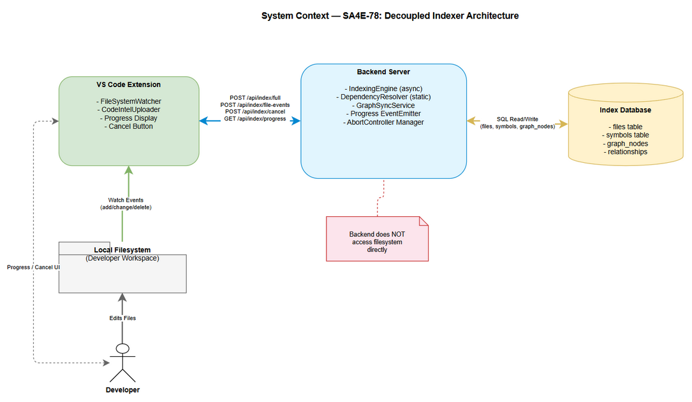
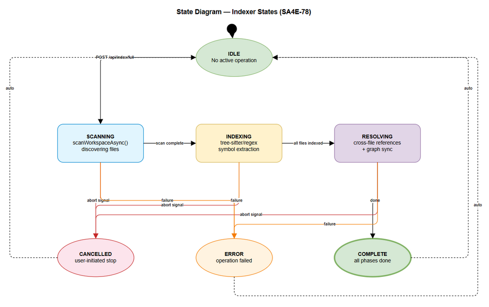
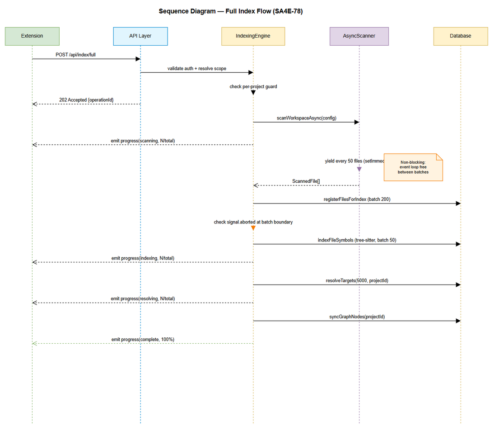
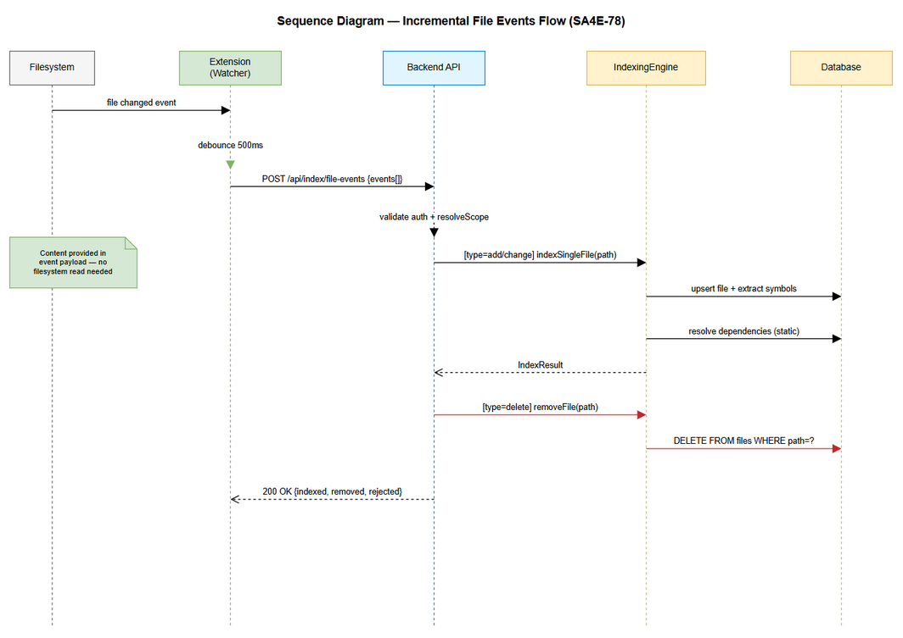
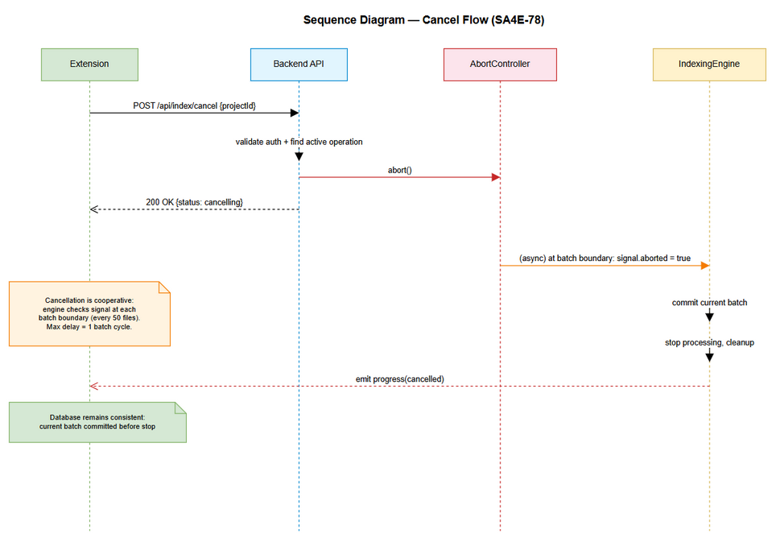

# Functional Specification Document (FSD)

## Code Intelligence System — SA4E-78: Decouple Code Intelligence Indexer from Local Filesystem

---

## Document Information

| Field | Value |
|-------|-------|
| Jira Ticket | SA4E-78 |
| Title | Decouple Code Intelligence indexer from local filesystem - architectural refactor |
| Author | BA Agent |
| Version | 1.0 |
| Date | 2026-07-30 |
| Status | Draft |
| Related BRD | documents/SA4E-78/BRD.md |

---

## Revision History

| Version | Date | Author | Changes |
|---------|------|--------|---------|
| 1.0 | 2026-07-30 | BA Agent | Initiate document — FSD created from BRD |

---

## 1. Introduction

### 1.1 Purpose

This FSD specifies the functional behavior of the decoupled Code Intelligence indexer.

### 1.2 Scope

Decoupling the indexer from direct filesystem access via async scanning, Extension-driven file events, static dependency resolution, progress reporting, and cancellation support.

### 1.3 Definitions & Acronyms

| Term | Definition |
|------|------------|
| IndexingEngine | Backend service orchestrating full/incremental code indexing |
| AbortSignal | Web standard for cooperative async cancellation |
| SSE | Server-Sent Events — unidirectional server-to-client streaming |
| FileEvent | A notification of file add/change/delete from Extension |
| Progress Event | Status update emitted during indexing phases |

### 1.4 References

| Document | Location |
|----------|----------|
| BRD | documents/SA4E-78/BRD.md |
| IndexingEngine | backend/src/engine/indexer/indexing-engine.ts |
| AsyncFileScanner | backend/src/engine/indexer/async-file-scanner.ts |
| DependencyResolver | backend/src/engine/parsers/dependency-resolver.ts |
| API Index Routes | backend/src/server/routes/api-index.ts |


---

## 2. System Overview

### 2.1 System Context Diagram



The system consists of three primary components:
- **VS Code Extension** — watches filesystem, pushes file events, triggers full index, displays progress
- **Backend Server** — receives events via HTTP API, runs async indexing engine, emits progress
- **Index Database** — SQLite/PostgreSQL storage for files, symbols, relationships, graph nodes

### 2.2 System Architecture

The decoupled architecture removes all direct filesystem access from the Backend indexer. The Extension becomes the sole filesystem observer, pushing change notifications and file content via the existing HTTP/MCP API layer.

---

## 3. Functional Requirements

### 3.1 Feature: Full Async Index Trigger

**Source:** BRD Story 2

#### 3.1.1 Use Case UC-01: Trigger Full Async Index

**Use Case ID:** UC-01
**Actor:** Extension (CodeIntelUploader)
**Preconditions:** Backend running, Extension authenticated
**Postconditions:** Full index operation initiated; progress events emitted

**Main Flow:**

| Step | Actor | System | Description |
|------|-------|--------|-------------|
| 1 | Extension | | POST /api/index/full with projectId and workspace headers |
| 2 | | Backend | Validates session token |
| 3 | | Backend | Resolves scope (projectId, workspace) |
| 4 | | Backend | Checks if index already running for projectId |
| 5 | | Backend | Returns 202 Accepted with operationId |
| 6 | | IndexingEngine | Begins scanWorkspaceAsync() |
| 7 | | IndexingEngine | Emits progress (phase: scanning) |
| 8 | | IndexingEngine | Indexes files in batches with yields |
| 9 | | IndexingEngine | Emits progress (phase: indexing) |
| 10 | | IndexingEngine | Resolves cross-file references |
| 11 | | IndexingEngine | Emits progress (phase: resolving) |
| 12 | | IndexingEngine | Syncs graph nodes, marks complete |

**Alternative Flows:**

| ID | Condition | Steps |
|----|-----------|-------|
| AF-01 | Index already running for projectId | Return 409 Conflict with running operationId |
| AF-02 | Workspace has 0 indexable files | Complete immediately, emit 100% |

**Exception Flows:**

| ID | Condition | Steps |
|----|-----------|-------|
| EF-01 | Missing/invalid Authorization | Return 401 Unauthorized |
| EF-02 | Missing X-Project-Id header | Return 400 "X-Project-Id required" |
| EF-03 | scanWorkspaceAsync fails | Emit error event, mark operation failed |

---

### 3.2 Feature: Extension-Driven File Events

**Source:** BRD Story 1

#### 3.2.1 Use Case UC-02: Push File Change Events

**Use Case ID:** UC-02
**Actor:** Extension (FileSystemWatcher)
**Preconditions:** Backend running, Extension authenticated, workspace opened
**Postconditions:** Backend incrementally indexes changed files

**Main Flow:**

| Step | Actor | System | Description |
|------|-------|--------|-------------|
| 1 | Extension | | Detects file change via VS Code FileSystemWatcher |
| 2 | Extension | | Debounces events (500ms window) |
| 3 | Extension | | Batches events, POST /api/index/file-events |
| 4 | | Backend | Validates session, resolves scope |
| 5 | | Backend | For each add/change event: indexSingleFile() |
| 6 | | Backend | For each delete event: removeFile() |
| 7 | | Backend | Returns summary (indexed, removed, rejected) |

**Alternative Flows:**

| ID | Condition | Steps |
|----|-----------|-------|
| AF-03 | Event batch > 100 files | Process first 100, return partial with more flag |
| AF-04 | File content included in event | Skip filesystem read, use provided content |
| AF-05 | File content not included | Read from workspace (fallback for co-located) |

**Exception Flows:**

| ID | Condition | Steps |
|----|-----------|-------|
| EF-04 | Path traversal attempt | Reject event, return in rejected array |
| EF-05 | File exceeds maxFileSize | Skip, return in skipped array |

---

### 3.3 Feature: Cancellation Support

**Source:** BRD Story 5

#### 3.3.1 Use Case UC-03: Cancel Running Index

**Use Case ID:** UC-03
**Actor:** Extension / Developer
**Preconditions:** An index operation is in progress for the given projectId
**Postconditions:** Index operation stops cooperatively within 1 batch cycle

**Main Flow:**

| Step | Actor | System | Description |
|------|-------|--------|-------------|
| 1 | Extension | | POST /api/index/cancel with projectId |
| 2 | | Backend | Validates session, resolves scope |
| 3 | | Backend | Looks up active AbortController for projectId |
| 4 | | Backend | Calls abortController.abort() |
| 5 | | IndexingEngine | At next batch boundary, checks signal.aborted |
| 6 | | IndexingEngine | Commits current batch, stops processing |
| 7 | | IndexingEngine | Emits progress event (phase: cancelled) |
| 8 | | Backend | Returns 200 with cancellation confirmation |

**Alternative Flows:**

| ID | Condition | Steps |
|----|-----------|-------|
| AF-06 | No active index for projectId | Return 404 "No active index operation" |

**Exception Flows:**

| ID | Condition | Steps |
|----|-----------|-------|
| EF-06 | AbortController already aborted | Return 200 (idempotent) |

---

### 3.4 Feature: Progress Reporting

**Source:** BRD Story 4

#### 3.4.1 Use Case UC-04: Poll Index Progress

**Use Case ID:** UC-04
**Actor:** Extension
**Preconditions:** Backend running, Extension authenticated
**Postconditions:** Extension receives current indexing status

**Main Flow (Polling):**

| Step | Actor | System | Description |
|------|-------|--------|-------------|
| 1 | Extension | | GET /api/index/progress?projectId={id} |
| 2 | | Backend | Validates session |
| 3 | | Backend | Looks up current progress state for projectId |
| 4 | | Backend | Returns progress JSON (phase, current, total, %) |

**Alternative Flow (SSE Stream):**

| ID | Condition | Steps |
|----|-----------|-------|
| AF-07 | Accept: text/event-stream header | Open SSE connection, stream events until complete |
| AF-08 | No active operation | Return idle state (phase: idle, 0%) |

---

### 3.5 Feature: Static-Only Dependency Resolution

**Source:** BRD Story 3

#### 3.5.1 Use Case UC-05: Resolve Dependencies Without Filesystem

**Use Case ID:** UC-05
**Actor:** IndexingEngine (internal)
**Preconditions:** Source file content available (from upload or local read)
**Postconditions:** Dependencies resolved via import parsing only (no readFileSync)

**Main Flow:**

| Step | Actor | System | Description |
|------|-------|--------|-------------|
| 1 | | DependencyResolver | Receives source content and file path |
| 2 | | DependencyResolver | Parses import/require statements via regex |
| 3 | | DependencyResolver | For relative imports: computes candidate paths |
| 4 | | DependencyResolver | Returns FileDependency[] with empty expectedHash |
| 5 | | DependencyResolver | sourceType = local for relative, remote for package |

**Alternative Flows:**

| ID | Condition | Steps |
|----|-----------|-------|
| AF-09 | Pega file (.pega) | Parse JSON AST references, return paths without reading targets |
| AF-10 | Unknown file extension | Return empty dependencies array |

**Exception Flows:**

| ID | Condition | Steps |
|----|-----------|-------|
| EF-07 | Malformed source (parse fails) | Return empty array, log warning |

---

## 4. Business Rules

| Rule ID | Rule | Source | Applies To |
|---------|------|--------|------------|
| BR-01 | Backend MUST NOT access filesystem directly for file watching | Story 1 | IndexingEngine, FileWatcher |
| BR-02 | Extension MUST debounce file events within 500ms window | Story 1 | Extension FileWatcher |
| BR-03 | Event batch maximum size is 100 files per request | Story 1 | POST /api/index/file-events |
| BR-04 | Full index MUST use scanWorkspaceAsync (non-blocking) | Story 2 | IndexingEngine.runFullIndex |
| BR-05 | Event loop latency MUST remain < 100ms p99 during indexing | Story 2 | IndexingEngine |
| BR-06 | Async scanning yields every 50 files (CHUNK_SIZE) | Story 2 | scanWorkspaceAsync |
| BR-07 | DependencyResolver MUST contain zero readFileSync calls | Story 3 | DependencyResolver |
| BR-08 | DependencyResolver MUST contain zero fs module imports | Story 3 | DependencyResolver |
| BR-09 | Dependency expectedHash is empty string for static resolution | Story 3 | DependencyResolver |
| BR-10 | Progress events MUST update at least every 2 seconds | Story 4 | IndexingEngine |
| BR-11 | Progress events MUST include phase, current, total, percentage | Story 4 | ProgressEvent model |
| BR-12 | Cancellation MUST stop within 1 batch cycle (< 100 files) | Story 5 | IndexingEngine |
| BR-13 | Database MUST remain consistent after cancellation | Story 5 | IndexingEngine |
| BR-14 | Cancelled index MUST be resumable (hash-based skip) | Story 5 | IndexingEngine |
| BR-15 | Only one full index per projectId at a time (per-project guard) | Story 2 | IndexingEngine |
| BR-16 | GraphSyncService MUST be instantiated once and reused | Story 6 | IndexingEngine |
| BR-17 | All write operations are tenant-scoped via X-Project-Id | SA4E-41 | All API endpoints |
| BR-18 | Path safety validation required for all file paths | SA4E-41 | resolveWithinWorkspace |
| BR-19 | Full index of 1000 files MUST complete in < 30 seconds | NFR | IndexingEngine |
| BR-20 | Workspaces up to 10,000 files MUST be supported | NFR | scanWorkspaceAsync |

---

## 5. API Specifications

### 5.1 POST /api/index/full

**Purpose:** Trigger a full asynchronous index operation for a project workspace.

**Request:**

| Header | Required | Description |
|--------|----------|-------------|
| Authorization | Yes | Bearer {session_token} |
| X-Project-Id | Yes | Tenant project identifier |
| X-Workspace-Root | No | Workspace root path (defaults to server config) |

```json
// Request body (optional)
{
  "force": false  // If true, re-index even unchanged files
}
```

**Response 202 Accepted:**

```json
{
  "operationId": "idx-a1b2c3d4",
  "projectId": "my-project",
  "status": "started",
  "message": "Full index started"
}
```

**Response 409 Conflict:**

```json
{
  "error": "Index already running",
  "operationId": "idx-existing-id",
  "projectId": "my-project"
}
```

**Error Responses:**

| Status | Condition |
|--------|-----------|
| 400 | Missing X-Project-Id |
| 401 | Invalid/missing Authorization |
| 409 | Index already running for this projectId |
| 500 | Internal server error |

---

### 5.2 POST /api/index/file-events

**Purpose:** Push file change events from Extension to Backend for incremental indexing.

**Request:**

| Header | Required | Description |
|--------|----------|-------------|
| Authorization | Yes | Bearer {session_token} |
| X-Project-Id | Yes | Tenant project identifier |
| X-Workspace-Root | No | Workspace root path |

```json
{
  "events": [
    {
      "type": "add",
      "path": "src/utils/helper.ts",
      "content": "export function helper() { ... }",
      "contentHash": "a1b2c3d4e5f6"
    },
    {
      "type": "change",
      "path": "src/index.ts",
      "content": "import { helper } from './utils/helper';"
    },
    {
      "type": "delete",
      "path": "src/old-file.ts"
    }
  ]
}
```

**Response 200 OK:**

```json
{
  "indexed": 1,
  "updated": 1,
  "removed": 1,
  "skipped": 0,
  "rejected": [],
  "projectId": "my-project"
}
```

**Error Responses:**

| Status | Condition |
|--------|-----------|
| 400 | Missing events array or invalid format |
| 400 | Missing X-Project-Id |
| 401 | Invalid Authorization |
| 413 | Batch exceeds 100 events |
| 500 | Internal error |

---

### 5.3 POST /api/index/cancel

**Purpose:** Cancel a running index operation for a project.

**Request:**

| Header | Required | Description |
|--------|----------|-------------|
| Authorization | Yes | Bearer {session_token} |
| X-Project-Id | Yes | Tenant project identifier |

```json
// No request body required
```

**Response 200 OK:**

```json
{
  "operationId": "idx-a1b2c3d4",
  "status": "cancelling",
  "message": "Cancellation signal sent"
}
```

**Response 404 Not Found:**

```json
{
  "error": "No active index operation",
  "projectId": "my-project"
}
```

**Error Responses:**

| Status | Condition |
|--------|-----------|
| 401 | Invalid Authorization |
| 400 | Missing X-Project-Id |
| 404 | No active operation for projectId |

---

### 5.4 GET /api/index/progress

**Purpose:** Poll current indexing progress or establish SSE stream.

**Request:**

| Header | Required | Description |
|--------|----------|-------------|
| Authorization | Yes | Bearer {session_token} |
| Accept | No | text/event-stream for SSE, else JSON polling |

| Query Param | Required | Description |
|-------------|----------|-------------|
| projectId | Yes | Tenant project identifier |

**Response 200 OK (JSON polling):**

```json
{
  "operationId": "idx-a1b2c3d4",
  "phase": "indexing",
  "current": 150,
  "total": 500,
  "percentage": 30,
  "message": "Indexing TypeScript files...",
  "startedAt": "2026-07-30T10:00:00Z",
  "elapsedMs": 5000
}
```

**Response 200 OK (SSE stream):**

```
event: progress
data: {"phase":"scanning","current":50,"total":0,"percentage":0,"message":"Scanning workspace..."}

event: progress
data: {"phase":"indexing","current":150,"total":500,"percentage":30,"message":"Indexing TypeScript files..."}

event: complete
data: {"phase":"complete","current":500,"total":500,"percentage":100,"message":"Index complete"}
```

**Idle State (no active operation):**

```json
{
  "operationId": null,
  "phase": "idle",
  "current": 0,
  "total": 0,
  "percentage": 0,
  "message": "No active index operation"
}
```

---

## 6. Data Model

### 6.1 Progress Event

| Field | Type | Required | Description | Example |
|-------|------|----------|-------------|---------|
| operationId | string | Yes | Unique operation identifier | `idx-a1b2c3d4` |
| phase | ProgressPhase | Yes | Current indexing phase | `indexing` |
| current | number | Yes | Items processed in current phase | `150` |
| total | number | Yes | Total items (0 if unknown) | `500` |
| percentage | number | Yes | Completion percentage (0-100) | `30` |
| message | string | No | Human-readable status | `Indexing TypeScript files...` |
| startedAt | string (ISO) | Yes | Operation start timestamp | `2026-07-30T10:00:00Z` |
| elapsedMs | number | Yes | Elapsed milliseconds | `5000` |

**ProgressPhase enum:** `idle` | `scanning` | `indexing` | `resolving` | `complete` | `cancelled` | `error`

### 6.2 File Event

| Field | Type | Required | Description | Example |
|-------|------|----------|-------------|---------|
| type | FileEventType | Yes | Event type | `add` |
| path | string | Yes | Relative file path | `src/index.ts` |
| content | string | No | File content (for add/change) | `export...` |
| contentHash | string | No | SHA-256 hash prefix (16 chars) | `a1b2c3d4e5f67890` |

**FileEventType enum:** `add` | `change` | `delete`

### 6.3 Index Operation State

| Field | Type | Required | Description |
|-------|------|----------|-------------|
| operationId | string | Yes | Unique UUID for this operation |
| projectId | string | Yes | Tenant project identifier |
| status | OperationStatus | Yes | Current status |
| phase | ProgressPhase | Yes | Current phase |
| current | number | Yes | Processed count |
| total | number | Yes | Total count |
| startedAt | Date | Yes | Start timestamp |
| abortController | AbortController | Yes | For cancellation |
| error | string | No | Error message if failed |

**OperationStatus enum:** `running` | `completed` | `cancelled` | `failed`

### 6.4 FileDependency (Updated)

| Field | Type | Required | Description | Example |
|-------|------|----------|-------------|---------|
| path | string | Yes | Relative dependency path | `../utils/helper.ts` |
| expectedHash | string | No | Always empty for static resolution | `""` |
| sourceType | `local` or `remote` | Yes | Relative = local, package = remote | `local` |

---

## 7. State Diagram

### 7.1 Indexer State Machine



**States:**

| State | Description | Transitions |
|-------|-------------|-------------|
| idle | No index operation active | -> scanning (on full index trigger) |
| scanning | Discovering files via scanWorkspaceAsync | -> indexing (scan complete) / -> cancelled (abort) / -> error (failure) |
| indexing | Extracting symbols via tree-sitter/regex | -> resolving (all files indexed) / -> cancelled (abort) / -> error (failure) |
| resolving | Cross-file reference resolution + graph sync | -> complete (done) / -> cancelled (abort) / -> error (failure) |
| complete | Operation finished successfully | -> idle (auto-transition) |
| cancelled | Operation stopped by user | -> idle (auto-transition) |
| error | Operation failed | -> idle (auto-transition) |

**Transition Rules:**
- Cancellation checked at every batch boundary (every CHUNK_SIZE=50 files)
- On cancel: commit current batch, transition to `cancelled`
- On error: log error, emit error event, transition to `error`
- `complete`, `cancelled`, `error` auto-transition to `idle` after emitting final event

---

## 8. Sequence Diagrams

### 8.1 Full Index Flow



### 8.2 Incremental File Events Flow



### 8.3 Cancel Flow



---

## 9. Error Handling

### 9.1 Error Scenarios

| Scenario | Severity | HTTP Status | User Message | Recovery |
|----------|----------|-------------|--------------|----------|
| Unauthorized request | Warning | 401 | "Authentication required" | Re-authenticate |
| Missing project ID | Warning | 400 | "X-Project-Id required for indexing" | Add header |
| Index already running | Info | 409 | "Index already running" | Wait or cancel |
| No active operation to cancel | Info | 404 | "No active index operation" | No action needed |
| Path traversal attempt | Critical | 400 | "Invalid path" | Fix event path |
| File too large | Info | N/A | Skipped in response | Adjust maxFileSize config |
| scanWorkspaceAsync permission error | Critical | N/A | Error event emitted | Fix filesystem permissions |
| Database write failure | Critical | 500 | "Internal error" | Retry operation |
| AbortSignal already aborted | Info | 200 | Idempotent success | No action needed |
| Batch limit exceeded | Warning | 413 | "Batch exceeds 100 events" | Split into smaller batches |

### 9.2 Error Event Format

```json
{
  "operationId": "idx-a1b2c3d4",
  "phase": "error",
  "current": 150,
  "total": 500,
  "percentage": 30,
  "message": "Index failed: EACCES permission denied",
  "error": {
    "code": "INDEX_PERMISSION_ERROR",
    "detail": "Cannot read directory: /workspace/node_modules"
  }
}
```

### 9.3 Error Codes

| Code | Description | Severity |
|------|-------------|----------|
| INDEX_ALREADY_RUNNING | Duplicate index trigger | Info |
| INDEX_PERMISSION_ERROR | Filesystem permission issue | Critical |
| INDEX_CANCELLED | User-initiated cancellation | Info |
| INDEX_DB_ERROR | Database write failure | Critical |
| INDEX_SCAN_ERROR | File scanning failure | High |
| INDEX_PARSE_ERROR | Tree-sitter/regex parse failure (per-file, non-fatal) | Low |
| EVENT_PATH_INVALID | Path traversal or unsafe path | High |
| EVENT_BATCH_OVERFLOW | Too many events in single request | Warning |

---

## 10. Processing Logic

### 10.1 Full Index Process

**Trigger:** POST /api/index/full
**Input:** projectId, workspace, optional force flag
**Output:** Progress events stream, final completion/error event

**Processing Steps:**

| Step | Description | Error Handling |
|------|-------------|----------------|
| 1 | Generate operationId (UUID), create AbortController | N/A |
| 2 | Register operation in active operations map | Reject if already exists (409) |
| 3 | Call scanWorkspaceAsync(config) | Emit error event on failure |
| 4 | Emit scanning progress every CHUNK_SIZE files | Check abort signal |
| 5 | Register files in DB (batches of 200) | Transaction rollback on error |
| 6 | Index symbols via tree-sitter (batches of 50) | Skip failed files, continue |
| 7 | Emit indexing progress every batch | Check abort signal |
| 8 | Run updateModules() | Non-fatal, log errors |
| 9 | Run detectAndStorePatterns() | Non-fatal, log errors |
| 10 | Resolve cross-file targets (graphRepo.resolveTargets) | Non-fatal, log errors |
| 11 | Sync graph nodes | Non-fatal, log errors |
| 12 | Emit complete event, remove from active operations | Always executes (finally) |

### 10.2 Incremental Event Processing

**Trigger:** POST /api/index/file-events
**Input:** Array of FileEvent objects
**Output:** Summary response (indexed/removed/rejected counts)

**Processing Steps:**

| Step | Description | Error Handling |
|------|-------------|----------------|
| 1 | Validate each event path via resolveWithinWorkspace | Reject unsafe paths |
| 2 | For add/change: write content to workspace if provided | Skip on write error |
| 3 | For add/change: call indexSingleFile(path, projectId) | Log error, continue |
| 4 | For delete: call removeFile(path) | Log error, continue |
| 5 | Collect results per event | N/A |
| 6 | Return summary response | N/A |

---

## 11. Security Requirements

### 11.1 Authentication & Authorization

| Endpoint | Auth Method | Required Role |
|----------|-------------|---------------|
| POST /api/index/full | Bearer JWT | Authenticated user |
| POST /api/index/file-events | Bearer JWT | Authenticated user |
| POST /api/index/cancel | Bearer JWT | Authenticated user |
| GET /api/index/progress | Bearer JWT | Authenticated user |

### 11.2 Data Isolation

All operations are tenant-scoped via X-Project-Id header. The `requireProjectId()` function (from code-intel-isolation.js) enforces this. No cross-tenant data access is possible.

### 11.3 Path Safety

All file paths are validated via `resolveWithinWorkspace()` to prevent path traversal attacks. Paths containing `..` segments that escape the workspace root are rejected.

---

## 12. Non-Functional Requirements

| Category | Requirement | Acceptance Criteria |
|----------|-------------|---------------------|
| Performance | Full index 1000 files | < 30 seconds |
| Performance | Event loop latency during index | < 100ms p99 |
| Performance | Cancel response time | < 500ms |
| Scalability | Workspace file limit | Up to 10,000 files |
| Reliability | No data loss on cancellation | Transactional batch commits |
| Reliability | Resumable after cancel | Hash-based skip on re-run |
| Observability | Progress updates | At least every 2 seconds |
| Compatibility | Existing API unchanged | POST /api/index/source still works |
| Memory | GraphSyncService reuse | Single instance per engine |

---

## 13. Appendix

### Diagram Index

| # | Diagram | Image | Source (editable) |
|---|---------|-------|-------------------|
| 1 | System Context | [system-context.png](diagrams/system-context.png) | [system-context.drawio](diagrams/system-context.drawio) |
| 2 | Sequence - Full Index | [sequence-full-index.png](diagrams/sequence-full-index.png) | [sequence-full-index.drawio](diagrams/sequence-full-index.drawio) |
| 3 | Sequence - Incremental | [sequence-incremental.png](diagrams/sequence-incremental.png) | [sequence-incremental.drawio](diagrams/sequence-incremental.drawio) |
| 4 | Sequence - Cancel | [sequence-cancel.png](diagrams/sequence-cancel.png) | [sequence-cancel.drawio](diagrams/sequence-cancel.drawio) |
| 5 | State - Indexer | [state-indexer.png](diagrams/state-indexer.png) | [state-indexer.drawio](diagrams/state-indexer.drawio) |

### Change Log from BRD

- Story 6 (GraphSyncService reuse) documented as BR-16, implementation detail deferred to TDD
- POST /api/index/source endpoint unchanged (backward compatible)
- SSE support added as alternative to polling for progress (Accept header switch)
