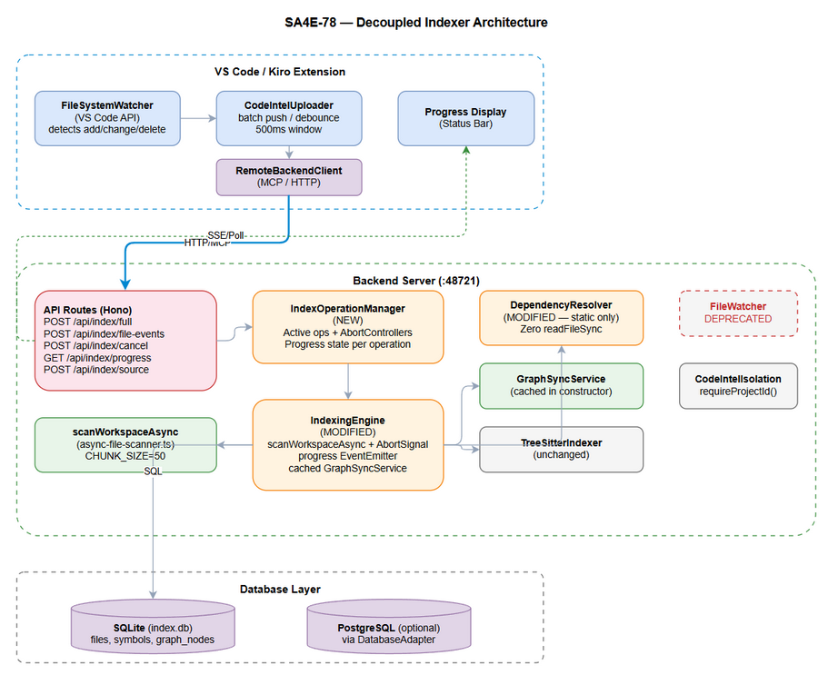
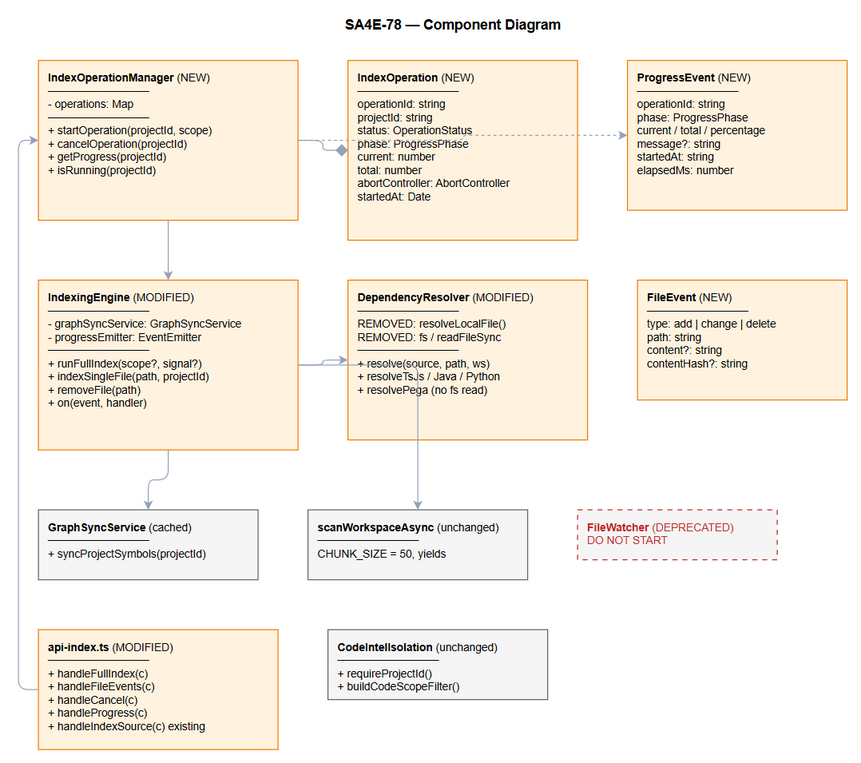

# Technical Design Document (TDD)

## Code Intelligence System — SA4E-78: Decouple Code Intelligence Indexer from Local Filesystem

---

## Document Information

| Field | Value |
|-------|-------|
| Jira Ticket | SA4E-78 |
| Title | Decouple Code Intelligence indexer from local filesystem - architectural refactor |
| Author | SA Agent |
| Version | 1.0 |
| Date | 2026-07-30 |
| Status | Draft |
| Related BRD | BRD-v1-SA4E-78.docx |
| Related FSD | FSD-v1-SA4E-78.docx |

---

## Author Tracking

| Role | Name - Position | Responsibility |
|------|-----------------|----------------|
| Author | SA Agent – Solution Architect | Create document |
| Peer Reviewer | BA Agent – Business Analyst | Review completeness |

---

## Revision History

| Version | Date | Author | Changes |
|---------|------|--------|---------|
| 1.0 | 2026-07-30 | SA Agent | Initiate document — TDD for decoupled indexer |

---

## Sign-Off

| Name | Signature and date |
|------|--------------------|
| | ☐ I agree and confirm the technical design in this TDD |
| | ☐ I agree and confirm the technical design in this TDD |

---

## 1. Introduction

> **Scope Boundary:** This TDD specifies HOW to implement the decoupled indexer. It does NOT repeat functional requirements from FSD — refer to FSD-v1-SA4E-78.docx for use cases, business rules, and data flows. This document focuses on: architecture decisions, class modifications, new interfaces, and implementation guidance.

### 1.1 Purpose

Refactor the Backend Code Intelligence indexer (`IndexingEngine`) to eliminate tight coupling with the local filesystem. The indexer currently uses synchronous `scanWorkspace()`, watches files via chokidar (`FileWatcher`), and resolves dependencies by reading target files with `readFileSync`. This architecture prevents remote/cloud deployment.

### 1.2 Scope

- **IndexingEngine** — add AbortSignal support, switch to `scanWorkspaceAsync`, add progress EventEmitter, cache GraphSyncService
- **DependencyResolver** — remove all `readFileSync`, make purely static import parsing
- **FileWatcher** — deprecate/remove from backend, document Extension-side alternative
- **IndexOperationManager** — new class to track active operations + AbortControllers
- **API Routes** — 4 new endpoint handlers in `api-index.ts`
- **Backward Compatibility** — existing `POST /api/index/source` unchanged

### 1.3 Technology Stack

| Layer | Technology | Version |
|-------|-----------|---------|
| Language | TypeScript | 5.x |
| Runtime | Node.js | >=18.14 |
| HTTP Framework | Hono | existing |
| Database | SQLite / PostgreSQL | via DatabaseAdapter |
| Event System | Node.js EventEmitter | built-in |
| Cancellation | AbortController / AbortSignal | built-in (Node 16+) |
| Test | Vitest | existing |
| Logger | pino | existing |

### 1.4 Design Principles

- **Minimal Change Surface** — modify existing classes, don't replace them
- **Cooperative Cancellation** — AbortSignal checked at batch boundaries only
- **Fail-Closed Isolation** — SA4E-41 tenant scoping preserved in all new paths
- **Non-Blocking** — async scanning yields every CHUNK_SIZE=50 files
- **Observer Pattern** — progress emitted via EventEmitter, consumed by API layer

### 1.5 Constraints

- Must not break existing `POST /api/index/source` endpoint
- Must preserve SA4E-41 multi-tenant isolation (`requireProjectId`, `buildCodeScopeFilter`)
- Must work with both SQLite and PostgreSQL via `DatabaseAdapter` interface
- `scanWorkspaceAsync` (SA4E-44) is already implemented and tested
- One full index per projectId at a time (existing `indexing` Set guard preserved)

### 1.6 References

| Document | Location |
|----------|----------|
| BRD | documents/SA4E-78/BRD.md |
| FSD | documents/SA4E-78/FSD.md |
| IndexingEngine | backend/src/engine/indexer/indexing-engine.ts |
| AsyncFileScanner | backend/src/engine/indexer/async-file-scanner.ts |
| DependencyResolver | backend/src/engine/parsers/dependency-resolver.ts |
| FileWatcher | backend/src/engine/indexer/file-watcher.ts |
| API Routes | backend/src/server/routes/api-index.ts |
| GraphSyncService | backend/src/engine/graph/graph-sync-service.ts |
| CodeIntelIsolation | backend/src/engine/query/code-intel-isolation.ts |
| SA4E Architecture | .code-intel/SA4E-ARCHITECTURE.md |

---

## 2. Architecture Overview

### 2.1 System Architecture

The decoupled architecture removes all direct filesystem watching from the Backend. The Extension becomes the sole filesystem observer, pushing change notifications via HTTP API. The indexer switches from synchronous scanning to the existing async scanner.



**Key Architectural Decisions:**

| # | Decision | Rationale |
|---|----------|-----------|
| AD-1 | Extension-driven file watching | Backend deployment no longer requires co-location with workspace |
| AD-2 | scanWorkspaceAsync replaces scanWorkspace | Non-blocking — event loop stays responsive during full index |
| AD-3 | AbortSignal for cooperative cancellation | Standard Web API, checked at batch boundaries for clean stop |
| AD-4 | IndexOperationManager as separate class | SRP — IndexingEngine does indexing, Manager tracks operations |
| AD-5 | Progress via EventEmitter (not DB) | In-memory, low overhead, consumed by polling endpoint |
| AD-6 | GraphSyncService cached in constructor | Avoid repeated instantiation during large index operations |
| AD-7 | DependencyResolver made purely static | Eliminates filesystem coupling; hash verification deferred |

### 2.2 Component Diagram



### 2.3 Communication Patterns

| From | To | Protocol | Pattern | Description |
|------|----|----------|---------|-------------|
| Extension FileWatcher | Backend API | HTTP POST | Fire-and-forget (debounced) | File change events |
| Extension | Backend /api/index/full | HTTP POST | Request / 202 Accepted | Trigger full index |
| Extension | Backend /api/index/progress | HTTP GET / SSE | Polling or stream | Progress updates |
| Extension | Backend /api/index/cancel | HTTP POST | Request / 200 OK | Cancel signal |
| API Routes | IndexOperationManager | In-process | Method call | Operation lifecycle |
| IndexOperationManager | IndexingEngine | In-process | Method call + EventEmitter | Run index + listen progress |
| IndexingEngine | DatabaseAdapter | SQL | Async queries | File/symbol persistence |

### 2.4 How It Fits Into the Existing Module System

The indexer is accessed through `CodeIntelModule.getIndexer()` (existing pattern). The new `IndexOperationManager` is instantiated alongside the `IndexingEngine` within `CodeIntelModule` and exposed to routes via the `ModuleRegistry`. No new module is created — this is an enhancement to the existing `codeIntel` module.

```
ModuleRegistry
  +-- CodeIntelModule
        +-- IndexingEngine (modified)
        +-- IndexOperationManager (new — wraps engine)
        +-- TreeSitterIndexer (unchanged)
```

---

## 3. API Design

> **Prerequisite:** Full functional API contracts (use cases, business rules, error scenarios) are in FSD Section 5. This section specifies technical implementation details for the DEV agent.

### 3.1 Endpoint Overview

| # | Method | Path | Handler | Implements |
|---|--------|------|---------|------------|
| 1 | POST | /api/index/full | handleFullIndex | UC-01 |
| 2 | POST | /api/index/file-events | handleFileEvents | UC-02 |
| 3 | POST | /api/index/cancel | handleCancel | UC-03 |
| 4 | GET | /api/index/progress | handleProgress | UC-04 |
| 5 | POST | /api/index/source | handleIndexSource (existing) | Unchanged |

All endpoints require `Authorization: Bearer {token}` and `X-Project-Id` header.

### 3.2 POST /api/index/full

**Purpose:** Trigger async full index. Returns immediately with operationId.

**Request Headers:**
- `Authorization: Bearer {session_token}` (required)
- `X-Project-Id: {projectId}` (required)
- `X-Workspace-Root: {path}` (optional, defaults to boot config)

**Request Body (optional):**
```json
{ "force": false }
```

**Response 202:**
```json
{
  "operationId": "idx-a1b2c3d4",
  "projectId": "my-project",
  "status": "started",
  "message": "Full index started"
}
```

**Response 409 (already running):**
```json
{
  "error": "Index already running",
  "operationId": "idx-existing",
  "projectId": "my-project"
}
```

**Implementation Notes:**
- Call `IndexOperationManager.startOperation(projectId, scope)`
- Manager creates AbortController, stores in operations map
- Calls `indexingEngine.runFullIndex(scope, signal)` in background (no await at route level)
- Returns 202 immediately

### 3.3 POST /api/index/file-events

**Purpose:** Push file change events from Extension for incremental indexing.

**Request Body:**
```json
{
  "events": [
    { "type": "add", "path": "src/utils/helper.ts", "content": "...", "contentHash": "a1b2c3d4" },
    { "type": "change", "path": "src/index.ts", "content": "..." },
    { "type": "delete", "path": "src/old-file.ts" }
  ]
}
```

**Response 200:**
```json
{
  "indexed": 1,
  "updated": 1,
  "removed": 1,
  "skipped": 0,
  "rejected": [],
  "projectId": "my-project"
}
```

**Implementation Notes:**
- Validate each path via `resolveWithinWorkspace()` — reject path traversal
- For add/change: if `content` provided, write to workspace then `indexSingleFile()`
- For add/change: if no content, call `indexSingleFile()` directly (co-located fallback)
- For delete: call `removeFile(path)`
- Max 100 events per request (return 413 if exceeded)
- Process sequentially to avoid DB contention

### 3.4 POST /api/index/cancel

**Purpose:** Cancel a running index operation.

**Response 200:**
```json
{
  "operationId": "idx-a1b2c3d4",
  "status": "cancelling",
  "message": "Cancellation signal sent"
}
```

**Response 404:**
```json
{ "error": "No active index operation", "projectId": "my-project" }
```

**Implementation Notes:**
- Call `IndexOperationManager.cancelOperation(projectId)`
- Manager calls `abortController.abort()`
- Engine checks `signal.aborted` at next batch boundary

### 3.5 GET /api/index/progress

**Purpose:** Poll current indexing progress.

**Query Parameters:** `projectId` (required)

**Response 200 (active operation):**
```json
{
  "operationId": "idx-a1b2c3d4",
  "phase": "indexing",
  "current": 150,
  "total": 500,
  "percentage": 30,
  "message": "Indexing TypeScript files...",
  "startedAt": "2026-07-30T10:00:00Z",
  "elapsedMs": 5000
}
```

**Response 200 (idle):**
```json
{
  "operationId": null,
  "phase": "idle",
  "current": 0,
  "total": 0,
  "percentage": 0,
  "message": "No active index operation"
}
```

**SSE Stream (Accept: text/event-stream):**
```
event: progress
data: {"phase":"indexing","current":150,"total":500,"percentage":30}

event: complete
data: {"phase":"complete","current":500,"total":500,"percentage":100}
```

**Implementation Notes:**
- Call `IndexOperationManager.getProgress(projectId)`
- For SSE: subscribe to engine's EventEmitter, pipe events as SSE frames
- Close SSE connection on `complete`, `cancelled`, or `error` events

### 3.6 Backward Compatibility

The existing `POST /api/index/source` endpoint remains unchanged. It continues to:
1. Write files to workspace via `resolveWithinWorkspace()`
2. Call `indexSingleFile()` per file
3. Trigger background `runFullIndex()` (existing behavior)
4. Return written/skipped/rejected counts

No breaking changes to this endpoint's request/response contract.

---

## 4. Class / Module Design

### 4.1 New Class: IndexOperationManager

**File:** `backend/src/engine/indexer/index-operation-manager.ts`

```typescript
/** SA4E-78 — Tracks active index operations with AbortControllers and progress state. */
import { EventEmitter } from 'events';
import { randomUUID } from 'crypto';
import type { IndexingEngine } from './indexing-engine.js';
import type { IndexScope } from './index-scope.js';

export type ProgressPhase = 'idle' | 'scanning' | 'indexing' | 'resolving' | 'complete' | 'cancelled' | 'error';
export type OperationStatus = 'running' | 'completed' | 'cancelled' | 'failed';

export interface IndexOperation {
  operationId: string;
  projectId: string;
  status: OperationStatus;
  phase: ProgressPhase;
  current: number;
  total: number;
  startedAt: Date;
  abortController: AbortController;
  error?: string;
}

export interface ProgressEvent {
  operationId: string;
  phase: ProgressPhase;
  current: number;
  total: number;
  percentage: number;
  message?: string;
  startedAt: string;
  elapsedMs: number;
}

export class IndexOperationManager {
  private operations = new Map<string, IndexOperation>();
  
  constructor(private engine: IndexingEngine) {}

  startOperation(projectId: string, scope: IndexScope): IndexOperation | null {
    if (this.operations.has(projectId)) return null; // 409
    const op: IndexOperation = {
      operationId: `idx-${randomUUID().slice(0, 8)}`,
      projectId, status: 'running', phase: 'scanning',
      current: 0, total: 0,
      startedAt: new Date(),
      abortController: new AbortController(),
    };
    this.operations.set(projectId, op);
    // Fire-and-forget — run in background
    this.engine.runFullIndex(scope, op.abortController.signal)
      .then(() => { op.status = 'completed'; op.phase = 'complete'; })
      .catch(err => { op.status = 'failed'; op.phase = 'error'; op.error = String(err); })
      .finally(() => { setTimeout(() => this.operations.delete(projectId), 60_000); });
    return op;
  }

  cancelOperation(projectId: string): IndexOperation | null {
    const op = this.operations.get(projectId);
    if (!op || op.status !== 'running') return null;
    op.abortController.abort();
    op.status = 'cancelled'; op.phase = 'cancelled';
    return op;
  }

  getProgress(projectId: string): ProgressEvent {
    const op = this.operations.get(projectId);
    if (!op) return { operationId: '', phase: 'idle', current: 0, total: 0, percentage: 0, startedAt: '', elapsedMs: 0 };
    const elapsed = Date.now() - op.startedAt.getTime();
    const pct = op.total > 0 ? Math.round((op.current / op.total) * 100) : 0;
    return {
      operationId: op.operationId, phase: op.phase,
      current: op.current, total: op.total, percentage: pct,
      startedAt: op.startedAt.toISOString(), elapsedMs: elapsed,
    };
  }

  isRunning(projectId: string): boolean {
    const op = this.operations.get(projectId);
    return op?.status === 'running';
  }

  /** Called by IndexingEngine to update progress state. */
  updateProgress(projectId: string, phase: ProgressPhase, current: number, total: number): void {
    const op = this.operations.get(projectId);
    if (op) { op.phase = phase; op.current = current; op.total = total; }
  }
}
```

### 4.2 Modified Class: IndexingEngine

**File:** `backend/src/engine/indexer/indexing-engine.ts`

**Changes:**

| # | Change | Detail |
|---|--------|--------|
| 1 | Add `graphSyncService` field | Cached in constructor, reused in `syncGraphNodes()` |
| 2 | Add `progressEmitter` field | `EventEmitter` for progress notifications |
| 3 | Change `runFullIndex` signature | Add optional `signal?: AbortSignal` parameter |
| 4 | Replace `scanWorkspace()` with `scanWorkspaceAsync()` | Import from `async-file-scanner.ts` |
| 5 | Add abort check in batch loops | `if (signal?.aborted) break` at each batch boundary |
| 6 | Emit progress events | `this.progressEmitter.emit('progress', { phase, current, total })` |
| 7 | Remove `startWatcher()` call | FileWatcher no longer started |
| 8 | Add `on(event, handler)` method | Expose EventEmitter subscription |

**Modified Constructor:**
```typescript
constructor(adapter: DatabaseAdapter, config: AppConfig) {
  this.adapter = adapter;
  this.dialect = new DialectHelper(adapter.getEngine());
  this.config = config;
  this.progressEmitter = new EventEmitter();
  this.initTreeSitter();
  // AD-6: Cache GraphSyncService instance
  this.graphSyncService = new GraphSyncService(this.adapter, this.adapter, logger);
}
```

**Modified `runFullIndex` signature:**
```typescript
async runFullIndex(scope?: Partial<IndexScope>, signal?: AbortSignal): Promise<void> {
  const { projectId, workspace } = resolveScope(scope, { ... });
  if (this.indexing.has(projectId)) return;
  this.indexing.add(projectId);
  try {
    // Phase: scanning
    this.emitProgress(projectId, 'scanning', 0, 0);
    const files = await scanWorkspaceAsync({ ...this.config, workspace });
    if (signal?.aborted) return;
    
    // Phase: indexing
    this.emitProgress(projectId, 'indexing', 0, files.length);
    await this.indexFiles(files, projectId, signal);
    if (signal?.aborted) { this.emitProgress(projectId, 'cancelled', 0, 0); return; }
    
    // Phase: resolving
    this.emitProgress(projectId, 'resolving', 0, 0);
    await updateModules(this.adapter, projectId);
    await detectAndStorePatterns(this.adapter, new Map(), logger, projectId);
    if (this.graphRepo) await this.graphRepo.resolveTargets(5000, projectId);
    await this.syncGraphNodes(projectId);
    
    this.emitProgress(projectId, 'complete', files.length, files.length);
  } finally {
    this.indexing.delete(projectId);
  }
}
```

**Abort check in batch loops (inside `indexFiles`):**
```typescript
for (let i = 0; i < files.length; i += BATCH) {
  if (signal?.aborted) break; // Cooperative cancellation
  const batch = files.slice(i, i + BATCH);
  // ... process batch ...
  this.emitProgress(projectId, 'indexing', Math.min(i + BATCH, files.length), files.length);
  await new Promise<void>(resolve => setImmediate(resolve));
}
```

### 4.3 Modified Class: DependencyResolver

**File:** `backend/src/engine/parsers/dependency-resolver.ts`

**Changes:**

| # | Change | Detail |
|---|--------|--------|
| 1 | Remove `resolveLocalFile()` method | Was reading files with `readFileSync` |
| 2 | Remove `require('fs')` usage | Zero filesystem imports |
| 3 | Simplify `resolveTsJs()` | Return candidate paths without file existence check |
| 4 | Simplify `resolvePega()` | Return references without reading target file content |
| 5 | Set `expectedHash = ''` everywhere | Hash deferred to when content is available |

**Modified `resolveTsJs`:**
```typescript
private resolveTsJs(source: string, filePath: string, workspace: string): FileDependency[] {
  const deps: FileDependency[] = [];
  const dir = path.posix.dirname(filePath);
  const importRe = /from\s+['"]([^'"]+)['"]|require\s*\(\s*['"]([^'"]+)['"]\s*\)/g;
  const seen = new Set<string>();
  let match: RegExpExecArray | null;
  while ((match = importRe.exec(source)) !== null) {
    const modulePath = match[1] || match[2];
    if (!modulePath || seen.has(modulePath)) continue;
    seen.add(modulePath);
    if (modulePath.startsWith('.')) {
      // Static resolution: compute candidate path, no file read
      const candidate = path.posix.resolve(dir, modulePath);
      deps.push({ path: candidate, expectedHash: '', sourceType: 'local' });
    }
  }
  return deps;
}
```

**Modified `resolvePega`:**
```typescript
private resolvePega(source: string, filePath: string, workspace: string): FileDependency[] {
  const deps: FileDependency[] = [];
  try {
    const json = JSON.parse(source);
    const ast = AST_PARSER.parse(json);
    for (const ref of ast.references) {
      const targetFile = this.pegaRefToFilePath(ref);
      // Static only: no readFileSync, hash = empty
      deps.push({ path: targetFile, expectedHash: '', sourceType: 'local' });
    }
  } catch { /* JSON parse failed */ }
  return deps;
}
```

### 4.4 Deprecated: FileWatcher

**File:** `backend/src/engine/indexer/file-watcher.ts`

**Action:** Do NOT delete the file. Mark as deprecated with JSDoc annotation. Remove all calls to `startWatcher()` in IndexingEngine.

```typescript
/**
 * @deprecated SA4E-78: File watching moved to Extension side (VS Code FileSystemWatcher).
 * This class is retained for backward compatibility with co-located deployments.
 * For decoupled deployments, use POST /api/index/file-events instead.
 */
export class FileWatcher { ... }
```

**In IndexingEngine:** Remove `this.startWatcher()` call from any method. The `watcher` field and `startWatcher()` method remain but are never invoked.

### 4.5 Modified: api-index.ts

**File:** `backend/src/server/routes/api-index.ts`

**Changes:** Add 4 new route registrations in `registerIndexRoutes()`:

```typescript
export function registerIndexRoutes(app: Hono, registry: ModuleRegistry, logger: Logger): void {
  // Existing routes
  app.post('/api/index/source', async (c) => { ... });
  app.post('/api/index/document', async (c) => { ... });
  app.post('/api/index/documents', async (c) => { ... });

  // NEW: SA4E-78 decoupled indexer endpoints
  app.post('/api/index/full', async (c) => {
    const session = await requireAuth(c);
    if (!session) return c.json({ error: 'Unauthorized' }, 401);
    return handleFullIndex(c, registry, logger);
  });
  app.post('/api/index/file-events', async (c) => {
    const session = await requireAuth(c);
    if (!session) return c.json({ error: 'Unauthorized' }, 401);
    return handleFileEvents(c, registry, logger);
  });
  app.post('/api/index/cancel', async (c) => {
    const session = await requireAuth(c);
    if (!session) return c.json({ error: 'Unauthorized' }, 401);
    return handleCancel(c, registry, logger);
  });
  app.get('/api/index/progress', async (c) => {
    const session = await requireAuth(c);
    if (!session) return c.json({ error: 'Unauthorized' }, 401);
    return handleProgress(c, registry, logger);
  });
}
```

### 4.6 New Interfaces

**File:** `backend/src/engine/indexer/types.ts` (new file or extend existing)

```typescript
/** SA4E-78: File event from Extension-driven file watching. */
export interface FileEvent {
  type: 'add' | 'change' | 'delete';
  path: string;        // Relative path within workspace
  content?: string;    // File content for add/change (optional)
  contentHash?: string; // SHA-256 prefix if content provided
}

/** SA4E-78: Result summary for file-events endpoint. */
export interface FileEventsResult {
  indexed: number;
  updated: number;
  removed: number;
  skipped: number;
  rejected: string[];
  projectId: string;
}
```

### 4.7 Package Structure (New/Modified Files)

```
backend/src/engine/indexer/
  +-- indexing-engine.ts           # MODIFIED: async scan, AbortSignal, progress, cached GraphSync
  +-- index-operation-manager.ts   # NEW: operation tracking + AbortController management
  +-- file-watcher.ts              # DEPRECATED: annotated, never started
  +-- async-file-scanner.ts        # UNCHANGED: already implements scanWorkspaceAsync
  +-- index-scope.ts               # UNCHANGED
  +-- index-helper.ts              # UNCHANGED
  +-- types.ts                     # NEW/EXTENDED: FileEvent, ProgressEvent interfaces

backend/src/engine/parsers/
  +-- dependency-resolver.ts       # MODIFIED: remove readFileSync, static-only

backend/src/server/routes/
  +-- api-index.ts                 # MODIFIED: add 4 new route handlers
```

---

## 5. Implementation Checklist

### 5.1 Phase 1: Core Infrastructure (No API changes)

| # | Task | File | Estimated Lines |
|---|------|------|-----------------|
| 1 | Create `IndexOperation` and `ProgressEvent` interfaces | engine/indexer/types.ts | ~40 |
| 2 | Create `IndexOperationManager` class | engine/indexer/index-operation-manager.ts | ~80 |
| 3 | Add `progressEmitter: EventEmitter` to IndexingEngine | engine/indexer/indexing-engine.ts | ~5 |
| 4 | Cache `GraphSyncService` in IndexingEngine constructor | engine/indexer/indexing-engine.ts | ~5 |
| 5 | Add `on(event, handler)` method to IndexingEngine | engine/indexer/indexing-engine.ts | ~3 |

### 5.2 Phase 2: Async Scan + Cancellation

| # | Task | File | Estimated Lines |
|---|------|------|-----------------|
| 6 | Replace `scanWorkspace()` import with `scanWorkspaceAsync()` | engine/indexer/indexing-engine.ts | ~2 |
| 7 | Add `signal?: AbortSignal` parameter to `runFullIndex()` | engine/indexer/indexing-engine.ts | ~1 |
| 8 | Add `if (signal?.aborted) break` in batch loops | engine/indexer/indexing-engine.ts | ~6 |
| 9 | Emit progress events at phase transitions and batch boundaries | engine/indexer/indexing-engine.ts | ~15 |
| 10 | Remove `startWatcher()` call (comment out, not delete) | engine/indexer/indexing-engine.ts | ~2 |

### 5.3 Phase 3: DependencyResolver Cleanup

| # | Task | File | Estimated Lines |
|---|------|------|-----------------|
| 11 | Remove `resolveLocalFile()` private method | engine/parsers/dependency-resolver.ts | -25 |
| 12 | Remove `require('fs')` from resolvePega | engine/parsers/dependency-resolver.ts | -5 |
| 13 | Remove `import * as fs from 'fs'` (if unused elsewhere) | engine/parsers/dependency-resolver.ts | -1 |
| 14 | Simplify `resolveTsJs()` — return candidate path directly | engine/parsers/dependency-resolver.ts | ~10 (rewrite) |
| 15 | Simplify `resolvePega()` — no file read for hash | engine/parsers/dependency-resolver.ts | ~5 (rewrite) |
| 16 | Set `expectedHash: ''` for all returned dependencies | engine/parsers/dependency-resolver.ts | ~3 |

### 5.4 Phase 4: API Endpoints

| # | Task | File | Estimated Lines |
|---|------|------|-----------------|
| 17 | Add `handleFullIndex()` handler | server/routes/api-index.ts | ~25 |
| 18 | Add `handleFileEvents()` handler | server/routes/api-index.ts | ~40 |
| 19 | Add `handleCancel()` handler | server/routes/api-index.ts | ~15 |
| 20 | Add `handleProgress()` handler (JSON polling) | server/routes/api-index.ts | ~20 |
| 21 | Register 4 new routes in `registerIndexRoutes()` | server/routes/api-index.ts | ~20 |
| 22 | Add SSE stream support in handleProgress (Accept header check) | server/routes/api-index.ts | ~30 |

### 5.5 Phase 5: FileWatcher Deprecation

| # | Task | File | Estimated Lines |
|---|------|------|-----------------|
| 23 | Add @deprecated JSDoc to FileWatcher class | engine/indexer/file-watcher.ts | ~5 |
| 24 | Remove/comment `this.startWatcher()` in IndexingEngine | engine/indexer/indexing-engine.ts | ~2 |
| 25 | Document Extension-side alternative in code comment | engine/indexer/file-watcher.ts | ~5 |

### 5.6 Phase 6: Tests

| # | Task | File | Estimated Lines |
|---|------|------|-----------------|
| 26 | Unit test: IndexOperationManager | __tests__/index-operation-manager.test.ts | ~100 |
| 27 | Unit test: DependencyResolver (no fs) | __tests__/dependency-resolver.test.ts | ~50 (update) |
| 28 | Integration test: /api/index/full endpoint | __tests__/api-index-full.test.ts | ~60 |
| 29 | Integration test: /api/index/file-events | __tests__/api-index-events.test.ts | ~60 |
| 30 | Integration test: /api/index/cancel | __tests__/api-index-cancel.test.ts | ~40 |
| 31 | Integration test: abort signal stops processing | __tests__/indexing-engine-abort.test.ts | ~50 |

---

## 6. Backward Compatibility

### 6.1 Unchanged Behaviors

| Component | Behavior | Verification |
|-----------|----------|--------------|
| POST /api/index/source | Same request/response contract | Existing tests pass |
| POST /api/index/document | Same request/response contract | Existing tests pass |
| POST /api/index/documents | Same request/response contract | Existing tests pass |
| DatabaseAdapter interface | No schema changes | No migration needed |
| TreeSitterIndexer | Same input/output | Existing tests pass |
| CodeIntelIsolation | Same tenant scoping | Same requireProjectId calls |
| IndexScope interface | Unchanged | Same resolveScope logic |

### 6.2 Changed Behaviors (Non-Breaking)

| Change | Impact | Migration |
|--------|--------|-----------|
| `runFullIndex()` uses async scan | Slightly different scan order (BFS vs previous) | None — hash-based skip handles it |
| `runFullIndex()` accepts optional `signal` | Existing callers pass no signal (backward compatible) | None |
| DependencyResolver returns `expectedHash: ''` | Downstream consumers already handle empty hash | None |
| FileWatcher never started | No chokidar process spawned | Extension must push events |
| GraphSyncService cached | Same behavior, lower GC pressure | None |
| New endpoints added | Additive — no existing endpoint removed | None |

### 6.3 Breaking Changes

**None.** All changes are additive or internal refactoring. No existing API contract is modified.

---

## 7. Error Handling

### 7.1 Error Strategy

| Layer | Strategy | Detail |
|-------|----------|--------|
| API Routes | Return structured JSON errors | `{ error: "message", code: "ERROR_CODE" }` |
| IndexOperationManager | Catch + store error in operation state | Error visible via progress endpoint |
| IndexingEngine | Per-file error tolerance | Failed files logged, batch continues |
| DependencyResolver | Return empty array on parse failure | Non-fatal, no exception propagation |
| GraphSyncService | Non-fatal wrapper | Errors logged, never fail index run |

### 7.2 Error Codes

| Code | HTTP | When | Recovery |
|------|------|------|----------|
| INDEX_ALREADY_RUNNING | 409 | Duplicate full index trigger | Wait or cancel |
| INDEX_NOT_FOUND | 404 | Cancel/progress with no active op | No action |
| EVENT_BATCH_OVERFLOW | 413 | >100 events in single request | Split batches |
| EVENT_PATH_INVALID | 400 (in rejected[]) | Path traversal attempt | Fix client |
| PROJECT_REQUIRED | 400 | Missing X-Project-Id | Add header |
| INDEX_SCAN_ERROR | via progress event | scanWorkspaceAsync fails | Check permissions |
| INDEX_CANCELLED | via progress event | User-initiated cancel | Resume later |

### 7.3 Cancellation Error Handling

When `signal.aborted` is detected:
1. Current batch commits are completed (no partial records)
2. Remaining batches are skipped
3. Operation status set to `cancelled`
4. Progress event emitted with `phase: 'cancelled'`
5. `indexing` Set entry is cleaned up (allows re-run)
6. Database remains consistent — only complete batches are committed

### 7.4 Progress Event Error Reporting

```json
{
  "operationId": "idx-a1b2c3d4",
  "phase": "error",
  "current": 150,
  "total": 500,
  "percentage": 30,
  "message": "Index failed: EACCES permission denied",
  "startedAt": "2026-07-30T10:00:00Z",
  "elapsedMs": 5000
}
```

---

## 8. Security Considerations

### 8.1 SA4E-41 Tenant Isolation (Preserved)

| Mechanism | How It Applies |
|-----------|---------------|
| `requireProjectId()` | Called in ALL new endpoint handlers — fail-closed |
| `buildCodeScopeFilter()` | All DB queries remain tenant-scoped |
| `resolveWithinWorkspace()` | All file paths validated in file-events handler |
| Per-project index guard | `indexing` Set prevents cross-tenant interference |
| X-Project-Id header | Required on all new endpoints |

### 8.2 Path Safety

All paths received via `POST /api/index/file-events` are validated:
```typescript
const targetPath = resolveWithinWorkspace(workspace, event.path);
if (!targetPath) { rejected.push(event.path); continue; }
```

Paths containing `..` segments that escape workspace root are rejected. This prevents:
- Directory traversal attacks
- Writing to sensitive system directories
- Cross-tenant file access

### 8.3 Authentication

All new endpoints use the existing `requireAuth()` pattern:
- Validate `Authorization: Bearer {token}` header
- Call `validateSession(token)` against session store
- Return 401 if invalid/missing

### 8.4 Rate Limiting

- File events batch limited to 100 per request (413 if exceeded)
- Only one full index per projectId at a time (409 if duplicate)
- Progress polling has no rate limit (lightweight read operation)

### 8.5 AbortSignal Security

- AbortController is stored per-projectId in IndexOperationManager
- Only the authenticated user with matching projectId can cancel
- AbortSignal is cooperative — engine checks at batch boundaries only
- No force-kill mechanism — prevents data corruption

### 8.6 Content Handling

When Extension provides file content via file-events:
- Content is written to workspace via `resolveWithinWorkspace()` (path-safe)
- Content size is implicitly limited by HTTP body size (Hono default or nginx proxy)
- No executable content is run — only written to disk and indexed

---

## 9. Key Design Decisions (Detailed)

### 9.1 IndexingEngine: AbortSignal Support

**Current state:** `runFullIndex()` runs to completion with no cancellation mechanism.

**Design:**
- Add optional `signal?: AbortSignal` as second parameter
- Check `signal.aborted` at each batch boundary (every 50 files in scanning, every 200 files in registration, every 50 files in tree-sitter indexing)
- On abort: commit current batch (transactional integrity), break loop, emit cancelled event
- Existing callers (e.g., `/api/index/source` trigger) pass no signal — backward compatible

**Why batch-boundary check (not per-file):**
- Per-file check adds overhead to tight loops
- Batch commit ensures no partial file records (file row without symbols)
- Latency from cancel to stop is bounded: max 50 files processed after signal

### 9.2 IndexingEngine: Switch to scanWorkspaceAsync

**Current state:** `runFullIndex()` calls `scanWorkspace()` (synchronous) which blocks event loop.

**Design:**
- Replace `import { scanWorkspace } from '../scanner/file-scanner.js'` with `import { scanWorkspaceAsync } from './async-file-scanner.js'`
- `scanWorkspaceAsync` already yields every CHUNK_SIZE=50 entries via `setImmediate`
- Result is the same `ScannedFile[]` array — drop-in replacement
- `startBackgroundIndexing()` method body can be un-disabled (was waiting for async scan)

**Risk:** Different traversal order (BFS queue vs previous). Mitigated by hash-based skip — unchanged files won't be re-indexed regardless of discovery order.

### 9.3 IndexingEngine: Progress EventEmitter

**Current state:** No progress visibility. `runFullIndex()` logs to pino but nothing exposed to API.

**Design:**
- Add `private progressEmitter = new EventEmitter()` field
- Expose `on(event: string, handler: Function)` public method
- Emit at: scan start, each batch completion, phase transitions, completion/error/cancel
- `IndexOperationManager` subscribes to update its in-memory state
- API layer reads from Manager (not directly from EventEmitter)

**Event format:**
```typescript
this.progressEmitter.emit('progress', {
  projectId, phase: 'indexing', current: processedCount, total: totalFiles
});
```

**Throttling:** Emit at batch boundaries only (every 50 files). With 1000 files, that is 20 events — well within 2-second update requirement.

### 9.4 DependencyResolver: Remove All readFileSync

**Current state:** `resolveLocalFile()` reads candidate files to compute content hash. `resolvePega()` reads target Pega rule files.

**Design:**
- Delete `resolveLocalFile()` method entirely
- In `resolveTsJs()`: compute candidate path from relative import, return immediately with `expectedHash: ''`
- In `resolvePega()`: parse JSON AST references, return paths without reading targets
- Remove `import * as crypto from 'crypto'` (no longer needed for dep resolution)
- Keep `import * as path from 'path'` (still needed for posix path resolution)

**Trade-off:** Loss of hash verification at index time. Mitigated:
- Hash can be computed later when file content arrives via `/api/index/source` or `/api/index/file-events`
- Java and Python resolvers were already static — no behavioral change for them
- Extension can provide `contentHash` in file events for future verification

### 9.5 FileWatcher: Deprecate from Backend

**Current state:** `FileWatcher` uses chokidar to watch workspace. `startWatcher()` is called in IndexingEngine. Currently already disabled on Windows (`startBackgroundIndexing` returns immediately).

**Design:**
- Add `@deprecated` JSDoc annotation to FileWatcher class
- Remove `this.startWatcher()` call in IndexingEngine (was inside disabled `startBackgroundIndexing`)
- Do NOT delete the class — some co-located deployments may still use it
- Document Extension-side replacement in class comment
- chokidar remains as devDependency (not removed from package.json)

**Extension-side replacement:**
```typescript
// In Extension: use VS Code FileSystemWatcher API
const watcher = vscode.workspace.createFileSystemWatcher('**/*');
watcher.onDidCreate(uri => pushEvent('add', uri));
watcher.onDidChange(uri => pushEvent('change', uri));
watcher.onDidDelete(uri => pushEvent('delete', uri));
// Debounce 500ms then POST /api/index/file-events
```

### 9.6 GraphSyncService: Cache Instance in Constructor

**Current state:** `syncGraphNodes()` creates `new GraphSyncService(this.adapter, this.adapter, logger)` on every call.

**Design:**
- Add `private graphSyncService: GraphSyncService` field
- Initialize in constructor: `this.graphSyncService = new GraphSyncService(this.adapter, this.adapter, logger)`
- Replace inline instantiation in `syncGraphNodes()` with `this.graphSyncService.syncProjectSymbols(projectId)`

**Impact:** Reduces object allocation and GC pressure during large index operations. Single GraphSyncService instance is stateless (all state is in DB) — safe to reuse.

### 9.7 IndexOperationManager: New Class

**Current state:** No operation tracking. The `indexing` Set only tracks whether a project is being indexed (boolean).

**Design:**
- Separate class (SRP) — IndexingEngine does indexing, Manager tracks lifecycle
- `Map<string, IndexOperation>` keyed by projectId
- Each operation has its own AbortController
- Progress state updated via EventEmitter subscription
- Operations auto-cleaned 60s after completion (allows final progress poll)
- Located alongside IndexingEngine in `engine/indexer/`

**Why not inside IndexingEngine:**
- IndexingEngine is already 180+ lines (near 200-line limit)
- Operation tracking is a different responsibility than file indexing
- Manager can be tested independently
- Clean dependency direction: Manager -> Engine (not circular)

---

## 10. Non-Functional Requirements Compliance

| NFR | Target | How Achieved |
|-----|--------|--------------|
| Full index 1000 files < 30s | Same as current (async doesn't add overhead) | scanWorkspaceAsync yields but doesn't slow total time |
| Event loop latency < 100ms p99 | setImmediate every 50 files | Verified by SA4E-44 async scanner tests |
| Cancel response < 500ms | AbortController.abort() is synchronous | API returns immediately after abort() |
| Support 10,000 files | Chunked scanning + batched DB writes | Already handled by CHUNK_SIZE + BATCH patterns |
| Progress updates every 2s | Batch of 50 files typically < 2s | For slow indexing, time-based fallback can be added |
| No data loss on cancel | Transactional batch commits | Only complete batches are committed |
| Memory: GraphSyncService reuse | Single instance cached | ~1KB saved per index run (object header + closures) |

---

## 11. Appendix

### Diagram Index

| # | Diagram | Image | Source (editable) |
|---|---------|-------|-------------------|
| 1 | Architecture | [architecture.png](diagrams/architecture.png) | [architecture.drawio](diagrams/architecture.drawio) |
| 2 | Component | [component.png](diagrams/component.png) | [component.drawio](diagrams/component.drawio) |

### Glossary

| Term | Definition |
|------|------------|
| IndexingEngine | Backend service orchestrating full/incremental code indexing |
| IndexOperationManager | New class tracking active index operations with AbortControllers |
| AbortSignal | Web standard for cooperative cancellation of async operations |
| FileEvent | Notification of file add/change/delete from Extension |
| ProgressEvent | Status update emitted during indexing phases |
| scanWorkspaceAsync | Non-blocking async file scanner (SA4E-44) |
| GraphSyncService | Projects indexed symbols into graph_nodes for visualization |
| CodeIntelIsolation | Tenant-scoping policy (fail-closed, SA4E-41) |
| CHUNK_SIZE | Number of files processed between event loop yields (50) |
| BATCH | Number of files per DB transaction batch (200 for registration, 50 for symbols) |

### Open Design Questions

| # | Question | Proposed Answer | Status |
|---|----------|----------------|--------|
| 1 | Should SSE be implemented in v1 or deferred? | Implement polling first, SSE as enhancement | Decided: polling in v1 |
| 2 | Should FileWatcher be deleted or deprecated? | Deprecated with annotation (co-located fallback) | Decided: deprecate |
| 3 | Should progress emit per-file or per-batch? | Per-batch (every 50 files) for efficiency | Decided: per-batch |
| 4 | Where to store IndexOperationManager? | In CodeIntelModule alongside IndexingEngine | Decided |

---
