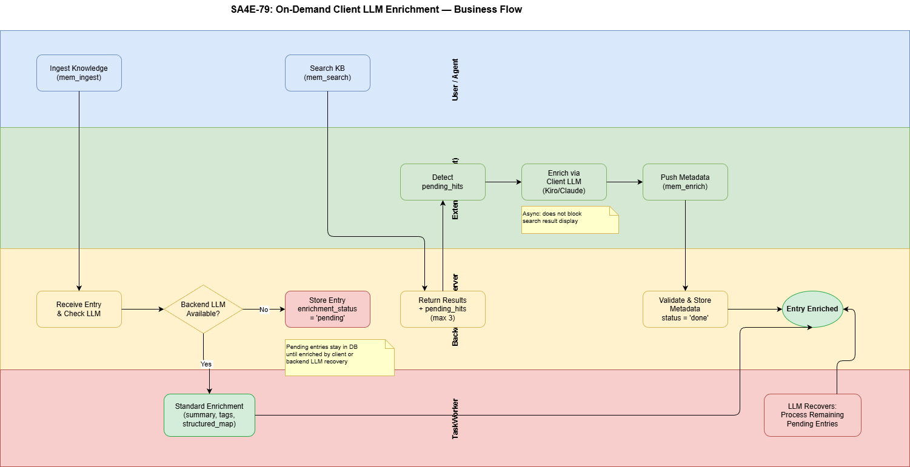
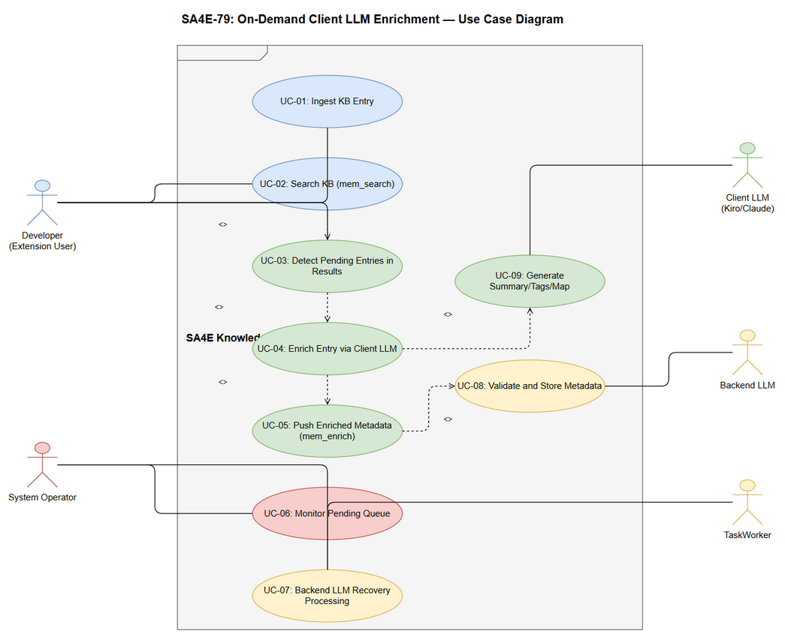

# Business Requirements Document (BRD)

## SA4E — SA4E-79: On-Demand Client LLM Enrichment for KB Entries

---

## Document Information

| Field | Value |
|-------|-------|
| Jira Ticket | SA4E-79 |
| Title | On-Demand Client LLM Enrichment for KB Entries |
| Author | BA Agent |
| Version | 1.0 |
| Date | 2025-07-20 |
| Status | Draft |
| Architecture Pattern | Plugin (Extension + Backend) |

---

## Author Tracking

| Role | Name - Position | Responsibility |
|------|-----------------|----------------|
| Author | BA Agent – Business Analyst | Create document |
| Peer Reviewer | TA Agent – Technical Architect | Review document |

---

## Revision History

| Version | Date | Author | Changes |
|---------|------|--------|---------|
| 1.0 | 2025-07-20 | BA Agent | Initiate document — auto-generated from Jira ticket SA4E-79 |

---

## Sign-Off

| Name | Signature and date |
|------|--------------------|
| | ☐ I agree and confirm all criteria on this BRD as expected requirements |
| | ☐ I agree and confirm all criteria on this BRD as expected requirements |

---

## 1. Introduction

### 1.1 Scope

This document captures the business requirements for implementing on-demand client-side LLM enrichment of Knowledge Base (KB) entries. When the backend LLM service is disabled or unavailable, KB entries are stored in a raw state without summary, tags, or structured metadata. This feature enables the client (VS Code extension) to detect these pending entries during search operations and enrich them using the currently available client-side LLM (Kiro/Claude), then push the enriched metadata back to the backend.

### 1.2 Out of Scope

- Modifying the backend LLM enrichment pipeline (TaskWorker) itself
- Adding new LLM providers to the backend
- Changing the existing KB search ranking algorithm
- Client-side KB storage or caching
- Bulk re-enrichment of historical entries

### 1.3 Preliminary Requirement

- Backend MCP server must be running and accessible via StreamableHTTP
- Extension must have active LLM connection (Kiro/Claude session)
- KB module with `mem_search` tool must be operational
- SQLite database schema must support `enrichment_status` field

---

## 2. Business Requirements

### 2.1 High Level Process Map

The system addresses a gap in the KB enrichment pipeline when the backend LLM is unavailable. Currently, entries ingested without LLM enrichment lose valuable metadata (summary, tags, structured_map) permanently until the backend LLM recovers. This feature creates a fallback enrichment path through the client-side LLM, ensuring KB quality remains high regardless of backend LLM availability.

### 2.2 List of User Stories / Use Cases

| # | Story / Use Case | Priority | Source Ticket |
|---|------------------|----------|---------------|
| 1 | As a developer, I want KB entries to retain enrichment_status so that I know which entries need enrichment | MUST HAVE | SA4E-79 |
| 2 | As a developer, I want search results to include pending entries so that I can trigger client-side enrichment | MUST HAVE | SA4E-79 |
| 3 | As a developer, I want the extension to automatically enrich pending entries using my current LLM so that KB quality is maintained | MUST HAVE | SA4E-79 |
| 4 | As a developer, I want to push enriched metadata back to the backend so that all clients benefit from the enrichment | MUST HAVE | SA4E-79 |
| 5 | As a system operator, I want the TaskWorker to skip already-enriched entries so that no duplicate processing occurs | MUST HAVE | SA4E-79 |
| 6 | As a system operator, I want the backend LLM recovery to process remaining pending entries so that the system self-heals | SHOULD HAVE | SA4E-79 |

---

### 2.3 Details of User Stories

---

#### Business Flow

**Step 1:** User or agent ingests knowledge into the KB via `mem_ingest`.

**Step 2:** Backend checks if LLM service is available.
- If available → standard enrichment pipeline (summary, tags, structured_map generated).
- If unavailable → entry stored with `enrichment_status = 'pending'` and raw content only.

**Step 3:** Client (extension) performs `mem_search` query for knowledge retrieval.

**Step 4:** Backend returns search results including up to 3 matching pending entries in a separate `pending_hits` field.

**Step 5:** Extension detects `pending_hits` in the response and triggers on-demand enrichment using the active client LLM (Kiro/Claude).

**Step 6:** Extension generates summary, tags, and structured_map for each pending entry.

**Step 7:** Extension calls `mem_enrich` endpoint to push metadata back to the backend.

**Step 8:** Backend validates and stores the enriched metadata, updates `enrichment_status` to `'done'`.

**Step 9:** When backend LLM recovers, TaskWorker resumes processing remaining entries with `enrichment_status = 'pending'`.

> **Note:** The client-side enrichment is opportunistic — it only processes entries that match the current search query, not all pending entries at once. This limits LLM token usage on the client side.

---

#### STORY 1: Pending Status Tracking for KB Entries

> As a developer, I want KB entries to retain enrichment_status so that I know which entries need enrichment.

**Requirement Details:**

1. When backend LLM is unavailable during `mem_ingest`, the entry MUST be stored with `enrichment_status = 'pending'`
2. When backend LLM is available and enrichment succeeds, entry MUST have `enrichment_status = 'done'`
3. The `enrichment_status` field must be added to the KB entries SQLite schema
4. Existing entries without the field should default to `'done'` (assume already enriched)

**Data Fields:**

| Field | Type | Required | Description | Example |
|-------|------|----------|-------------|---------|
| enrichment_status | TEXT | Yes | Status of LLM enrichment | 'pending', 'done' |
| enriched_by | TEXT | No | Source of enrichment (backend/client) | 'backend_llm', 'client_llm' |
| enriched_at | TEXT | No | ISO timestamp when enrichment completed | '2025-07-20T10:30:00Z' |

**Acceptance Criteria:**

1. When backend LLM is OFF, new entries stored with `enrichment_status = 'pending'`
2. When backend LLM is ON, new entries processed normally with `enrichment_status = 'done'`
3. Schema migration does not break existing entries (default to 'done')
4. `enriched_by` tracks whether enrichment was done by backend or client

---

#### STORY 2: Search Response with Pending Hits

> As a developer, I want search results to include pending entries so that I can trigger client-side enrichment.

**Requirement Details:**

1. `mem_search` response MUST include a `pending_hits` array alongside the normal search results
2. `pending_hits` contains entries matching the search query that have `enrichment_status = 'pending'`
3. Maximum 3 pending entries returned per search to limit client LLM token usage
4. Pending hits are ranked by relevance to the search query (same hybrid scoring)
5. Normal search results (`hits`) continue to work as before — pending entries may appear in both if they match

**Data Fields:**

| Field | Type | Required | Description | Example |
|-------|------|----------|-------------|---------|
| pending_hits | Array | Yes | Matching entries needing enrichment | [{id, content, source, ...}] |
| pending_hits[].id | string | Yes | Entry identifier | 'kb_entry_12345' |
| pending_hits[].content | string | Yes | Raw entry content for LLM enrichment | 'Full text content...' |
| pending_hits[].source | string | No | Origin source of the entry | 'agent-output/SA4E-79' |
| pending_hits[].tags | string | No | Existing tags (if any) | 'memory, context' |

**Acceptance Criteria:**

1. `mem_search` response includes `pending_hits` field (may be empty array)
2. Maximum 3 pending entries per response
3. Pending entries matched using same hybrid search algorithm (BM25 + vector + graph)
4. Normal search results are not affected by this addition
5. If no pending entries match, `pending_hits` is an empty array `[]`

---

#### STORY 3: Client-Side On-Demand Enrichment

> As a developer, I want the extension to automatically enrich pending entries using my current LLM so that KB quality is maintained.

**Requirement Details:**

1. Extension detects `pending_hits` in `mem_search` response
2. For each pending entry, extension invokes the active LLM to generate:
   - `summary`: concise description of the entry content
   - `tags`: comma-separated relevant keywords
   - `structured_map`: JSON structure extracting key entities and relationships
3. Enrichment happens asynchronously — does not block the user's search result display
4. Extension rate-limits enrichment to avoid overwhelming the LLM (max 3 entries per search call)
5. If LLM enrichment fails for an entry, it is silently skipped (will be retried next search)

**Acceptance Criteria:**

1. Extension detects pending_hits and triggers enrichment without user intervention
2. Enrichment uses the currently active client LLM (Kiro/Claude)
3. Generated metadata matches the same schema as backend-enriched entries
4. Enrichment does not block or slow down the user's search experience
5. Failed enrichment attempts are logged but do not surface errors to the user
6. Max 3 entries enriched per search invocation

---

#### STORY 4: Push Enriched Metadata to Backend

> As a developer, I want to push enriched metadata back to the backend so that all clients benefit from the enrichment.

**Requirement Details:**

1. Extension calls `mem_enrich` endpoint with the generated metadata
2. Backend validates the payload (entry exists, status is 'pending', metadata schema valid)
3. Backend stores the metadata fields (summary, tags, structured_map)
4. Backend updates `enrichment_status` from 'pending' to 'done'
5. Backend records `enriched_by = 'client_llm'` for audit trail
6. Entry is removed from the pending queue

**Data Fields:**

| Field | Type | Required | Description | Example |
|-------|------|----------|-------------|---------|
| entry_id | string | Yes | KB entry identifier | 'kb_entry_12345' |
| summary | string | Yes | LLM-generated summary | 'Service configuration for...' |
| tags | string | Yes | Comma-separated tags | 'config, service, memory' |
| structured_map | object | No | Structured extraction | {entities: [...], relations: [...]} |

**Acceptance Criteria:**

1. `mem_enrich` endpoint accepts and validates client-generated metadata
2. Entry `enrichment_status` updated to 'done' after successful enrichment
3. `enriched_by` field set to 'client_llm'
4. Invalid requests (non-existent entry, already done, bad schema) return appropriate errors
5. Enrichment is idempotent — calling twice with same data does not cause errors

**Error Handling:**

- Entry not found → HTTP 404, message: "Entry not found"
- Entry already enriched (status='done') → HTTP 409, message: "Entry already enriched"
- Invalid metadata schema → HTTP 400, message: "Invalid metadata format"
- Server error → HTTP 500, message: "Internal server error"

---

#### STORY 5: TaskWorker Skips Enriched Entries

> As a system operator, I want the TaskWorker to skip already-enriched entries so that no duplicate processing occurs.

**Requirement Details:**

1. TaskWorker checks `enrichment_status` before processing each entry
2. Entries with `enrichment_status = 'done'` are skipped entirely
3. Only entries with `enrichment_status = 'pending'` are processed
4. When backend LLM recovers, TaskWorker resumes processing remaining pending entries

**Acceptance Criteria:**

1. TaskWorker queries only entries with `enrichment_status = 'pending'`
2. Entries enriched by client are never re-processed by TaskWorker
3. TaskWorker updates `enrichment_status` to 'done' and `enriched_by` to 'backend_llm' on success
4. No race condition between client enrichment and TaskWorker (first to complete wins)

---

#### STORY 6: Backend LLM Recovery Handling

> As a system operator, I want the backend LLM recovery to process remaining pending entries so that the system self-heals.

**Requirement Details:**

1. When backend LLM becomes available again, TaskWorker automatically resumes processing
2. TaskWorker picks up remaining `enrichment_status = 'pending'` entries
3. Processing order: oldest entries first (FIFO)
4. Batch processing with configurable batch size to avoid overwhelming the LLM

**Acceptance Criteria:**

1. Backend LLM recovery triggers automatic processing of pending queue
2. Only remaining pending entries are processed (client-enriched entries skipped)
3. Processing is ordered by creation time (oldest first)
4. System handles concurrent client enrichment gracefully (no conflicts)

---

## 3. Dependencies

| Dependency | Type | Related Ticket | Description |
|------------|------|----------------|-------------|
| Backend MCP Server | System | N/A | Hono-based server must be running for mem_search and mem_enrich endpoints |
| SQLite KB Database | Infrastructure | N/A | Schema must support enrichment_status column |
| Client LLM (Kiro/Claude) | External | N/A | Extension requires active LLM session for enrichment |
| Memory Module | System | N/A | mem_search tool must include pending_hits in response |
| ONNX Embeddings | System | N/A | Vector embeddings for hybrid search on pending entries |
| TaskWorker | System | N/A | Background worker for backend LLM enrichment |

---

## 4. Stakeholders

| Role | Name / Team | Responsibility | Source |
|------|-------------|----------------|--------|
| Developer | SA4E Dev Team | Implementation of backend + extension changes | Ticket assignee |
| Product Owner | Project Lead | Acceptance of feature behavior | Ticket reporter |
| QA | QA Team | Verification of all acceptance criteria | Standard |
| SA | Solution Architect | Technical design review | Standard |

---

## 5. Risks and Assumptions

### 5.1 Risks

| Risk | Impact | Likelihood | Mitigation |
|------|--------|------------|------------|
| Client LLM generates lower-quality metadata than backend LLM | Medium | Medium | Backend LLM recovery will process remaining entries; quality threshold validation on mem_enrich |
| Race condition between client and TaskWorker enriching same entry | Low | Low | First-to-complete wins pattern; idempotent enrichment |
| Client-side LLM token costs increase for users | Medium | High | Limit to max 3 entries per search; async processing only |
| Extension performance impact from async enrichment | Low | Low | Non-blocking async execution; background processing |
| Schema migration breaks existing KB entries | High | Low | Default existing entries to 'done'; backward-compatible migration |

### 5.2 Assumptions

- Backend LLM unavailability is temporary (hours/days, not permanent)
- Client-side LLM (Kiro/Claude) produces compatible metadata format
- Extension always has an active LLM session when performing searches
- Network connectivity between extension and backend is stable
- Pending entries volume is manageable (not millions of entries)

---

## 6. Non-Functional Requirements

| Category | Requirement | Details |
|----------|-------------|---------|
| Performance | Search latency unchanged | Adding pending_hits to mem_search must not increase response time by >50ms |
| Performance | Client enrichment async | Enrichment must not block search result display |
| Reliability | Idempotent enrichment | Calling mem_enrich multiple times with same data is safe |
| Scalability | Pending queue management | System handles up to 10,000 pending entries without degradation |
| Security | Metadata validation | Backend validates all client-submitted metadata before storage |
| Availability | Graceful degradation | If client enrichment fails, system continues normally |
| Data Integrity | No data loss | Pending entries are never deleted; only status transitions occur |

---

## 7. Related Tickets

| Ticket Key | Summary | Status | Type | Relationship |
|------------|---------|--------|------|--------------|
| SA4E-79 | On-Demand Client LLM Enrichment for KB Entries | To Do | Story | Main ticket |

---

## 8. Appendix

### Use Case Diagram

### Glossary

| Term | Definition |
|------|------------|
| KB Entry | A knowledge record stored in the SQLite database with content, embeddings, and optional metadata |
| Enrichment | The process of generating summary, tags, and structured_map for a KB entry using an LLM |
| Pending Entry | A KB entry that was stored without LLM enrichment (enrichment_status='pending') |
| TaskWorker | Background process in the backend that processes pending entries when backend LLM is available |
| mem_search | MCP tool for hybrid search (BM25 + vector + graph) across KB entries |
| mem_enrich | New MCP tool/endpoint for accepting client-generated enrichment metadata |
| Structured Map | JSON object extracting key entities and relationships from entry content |
| Client LLM | The LLM available in the extension context (Kiro/Claude) |
| Backend LLM | The LLM configured on the backend server for automated enrichment |

### Reference Documents

| Document | Link / Location |
|----------|-----------------|
| SA4E Architecture | .code-intel/SA4E-ARCHITECTURE.md |
| Memory Module Source | backend/src/modules/memory/ |
| Extension Source | extension/src/ |

### Diagram Index

| # | Diagram | Image | Source (editable) |
|---|---------|-------|-------------------|
| 1 | Business Flow | [business-flow.png](diagrams/business-flow.png) | [business-flow.drawio](diagrams/business-flow.drawio) |
| 2 | Use Case | [use-case.png](diagrams/use-case.png) | [use-case.drawio](diagrams/use-case.drawio) |
