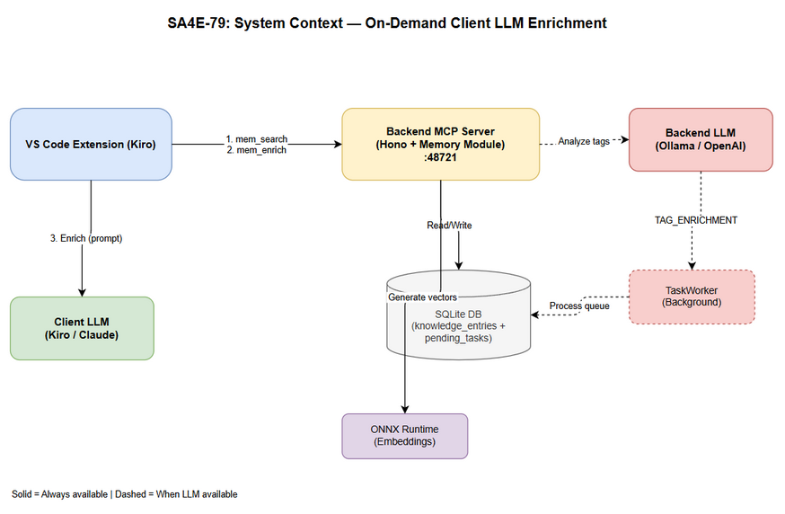
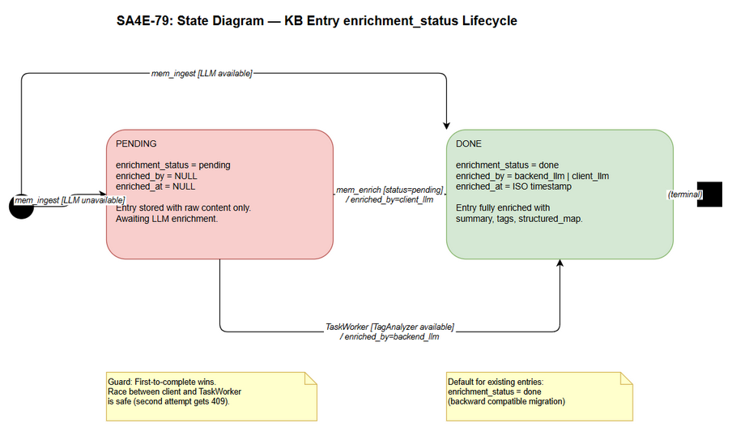
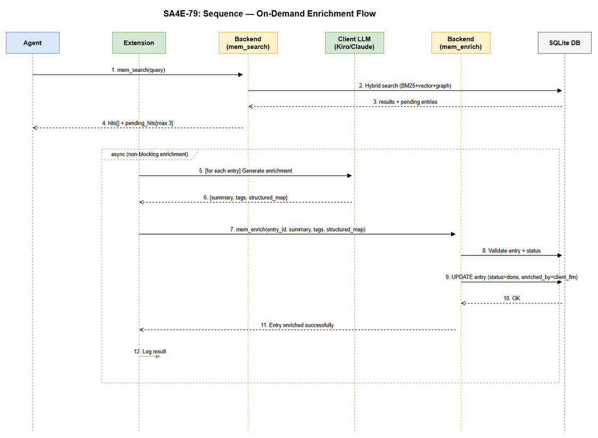

# Functional Specification Document (FSD)

## SA4E — SA4E-79: On-Demand Client LLM Enrichment for KB Entries

---

## Document Information

| Field | Value |
|-------|-------|
| Jira Ticket | SA4E-79 |
| Title | On-Demand Client LLM Enrichment for KB Entries |
| Author | BA Agent |
| Version | 1.0 |
| Date | 2025-07-20 |
| Status | Draft |
| Related BRD | documents/SA4E-79/BRD.md |
| Architecture Pattern | Plugin (Extension + Backend) |

---

## Author Tracking

| Role | Name - Position | Responsibility |
|------|-----------------|----------------|
| Author | BA Agent – Business Analyst | Create document |
| Peer Reviewer | TA Agent – Technical Architect | Review & enrich document |

---

## Revision History

| Version | Date | Author | Changes |
|---------|------|--------|---------|
| 1.0 | 2025-07-20 | BA Agent | Initiate document — FSD draft from BRD |
| 1.1 | 2025-07-20 | TA Agent | TA Review & Enrichment — API contracts, pseudocode, integration specs, NFR targets, open issues, security review |

---

## 1. Introduction

### 1.1 Purpose

This FSD translates the business requirements from BRD SA4E-79 into detailed functional specifications for implementing on-demand client-side LLM enrichment of Knowledge Base entries. It defines use cases, business rules, API contracts, data models, and processing logic that the Solution Architect will use to produce the Technical Design Document.

### 1.2 Scope

The system enables a fallback enrichment path when the backend LLM is unavailable:
- Backend stores entries with `enrichment_status='pending'` when LLM is OFF
- `mem_search` returns matching pending entries alongside normal results
- VS Code extension enriches pending entries using the client-side LLM (Kiro/Claude)
- Extension pushes enriched metadata back via `mem_enrich` MCP tool
- TaskWorker skips entries already enriched by client
- Backend LLM recovery processes remaining pending entries

**Out of Scope:** Bulk re-enrichment, backend LLM provider changes, search ranking algorithm modifications, client-side KB caching.

### 1.3 Definitions & Acronyms

| Term | Definition |
|------|------------|
| KB Entry | A knowledge record in SQLite with content, embeddings, tags, and structured metadata |
| Enrichment | Process of generating summary, tags, and structured_map via LLM |
| Pending Entry | KB entry stored without LLM enrichment (enrichment_status='pending') |
| TaskWorker | Background polling worker that processes pending tasks using backend LLM |
| mem_search | MCP tool for hybrid search (BM25 + vector + graph) |
| mem_enrich | New MCP tool for accepting client-generated enrichment metadata |
| Client LLM | LLM available in extension context (Kiro/Claude) |
| Backend LLM | LLM configured on backend server (Ollama/OpenAI adapter) |

### 1.4 References

| Document | Location |
|----------|----------|
| BRD | documents/SA4E-79/BRD.md |
| SA4E Architecture | .code-intel/SA4E-ARCHITECTURE.md |
| Memory Module | backend/src/modules/memory/ |
| TaskWorker | backend/src/modules/memory/task-queue/TaskWorker.ts |

---

## 2. System Overview

### 2.1 System Context Diagram



The system involves three primary actors:
1. **VS Code Extension** — Thin client that detects pending entries and orchestrates client-side enrichment
2. **Backend MCP Server** — Hono HTTP server hosting the Memory module with SQLite KB storage
3. **LLM Services** — Both backend LLM (Ollama/OpenAI) and client LLM (Kiro/Claude)

### 2.2 System Architecture

The feature spans two deployment units:
- **Backend (Memory Module):** Adds `enrichment_status` tracking, modifies `mem_search` response to include `pending_hits`, exposes new `mem_enrich` tool, and modifies TaskWorker to respect enrichment status.
- **Extension (LangGraph Engine):** Adds enrichment detection node that intercepts `mem_search` responses, invokes client LLM for enrichment, and calls `mem_enrich` to push results back.

Communication uses StreamableHTTP MCP protocol over localhost:48721.

---

## 3. Functional Requirements

### 3.1 Use Case: Store Entry with Pending Status

**Use Case ID:** UC-01
**Actor:** Agent (via mem_ingest tool)
**Source:** BRD Story 1
**Preconditions:** Backend MCP server is running; mem_ingest is called with valid content
**Postconditions:** Entry stored in knowledge_entries with appropriate enrichment_status

**Main Flow:**

| Step | Actor | System | Description |
|------|-------|--------|-------------|
| 1 | Agent | | Calls mem_ingest with content, type, tags, source |
| 2 | | Backend | Validates input parameters |
| 3 | | Backend | Checks LLM service availability (LLMService.isAvailable()) |
| 4 | | Backend | LLM unavailable: stores entry with enrichment_status='pending', enriched_by=NULL |
| 5 | | Backend | Creates pending_tasks for TAG_ENRICHMENT (deferred) |
| 6 | | Backend | Generates vector embedding (ONNX, always available) |
| 7 | | Backend | Returns success with entry ID |

**Alternative Flows:**

| ID | Condition | Steps |
|----|-----------|-------|
| AF-01 | LLM is available | Step 4: stores entry with enrichment_status='done', enriched_by='backend_llm'; Step 5: Creates TAG_ENRICHMENT task that processes immediately |

**Exception Flows:**

| ID | Condition | Steps |
|----|-----------|-------|
| EF-01 | Invalid input (missing content) | Return error: "content is required" |
| EF-02 | Database write failure | Return error: "Failed to store entry"; log error |

---

### 3.2 Use Case: Search with Pending Hits

**Use Case ID:** UC-02
**Actor:** Agent/Extension (via mem_search tool)
**Source:** BRD Story 2
**Preconditions:** KB has entries (some with enrichment_status='pending')
**Postconditions:** Search results returned with separate pending_hits array

**Main Flow:**

| Step | Actor | System | Description |
|------|-------|--------|-------------|
| 1 | Agent | | Calls mem_search with query, limit, scope |
| 2 | | Backend | Executes hybrid search (BM25 + vector + graph) on all entries |
| 3 | | Backend | Separates results: enriched entries -> hits, pending entries -> pending_hits |
| 4 | | Backend | Caps pending_hits at maximum 3 entries |
| 5 | | Backend | Returns response with hits[] and pending_hits[] |

**Alternative Flows:**

| ID | Condition | Steps |
|----|-----------|-------|
| AF-01 | No pending entries match query | pending_hits returned as empty array [] |
| AF-02 | All matching entries are pending | hits may be empty; pending_hits has up to 3 |
| AF-03 | scope='all' requested | Pending entries from all accessible scopes included |

**Exception Flows:**

| ID | Condition | Steps |
|----|-----------|-------|
| EF-01 | Empty query | Return error: "query required" |
| EF-02 | Database connection error | Return error; log at ERROR level |

---

### 3.3 Use Case: Client-Side On-Demand Enrichment

**Use Case ID:** UC-03
**Actor:** VS Code Extension (automated)
**Source:** BRD Story 3
**Preconditions:** Extension has active LLM session; mem_search returned pending_hits with >= 1 entry
**Postconditions:** Pending entries enriched with summary, tags, structured_map

**Main Flow:**

| Step | Actor | System | Description |
|------|-------|--------|-------------|
| 1 | | Extension | Detects pending_hits in mem_search response |
| 2 | | Extension | Filters entries: skip if already being processed (in-flight dedup) |
| 3 | | Extension | For each pending entry (max 3), invokes client LLM |
| 4 | | Client LLM | Generates summary from entry content |
| 5 | | Client LLM | Generates relevant tags (comma-separated) |
| 6 | | Client LLM | Generates structured_map JSON (entities, relations, business_rules) |
| 7 | | Extension | Validates generated metadata against schema |
| 8 | | Extension | Calls mem_enrich for each successfully enriched entry |

**Alternative Flows:**

| ID | Condition | Steps |
|----|-----------|-------|
| AF-01 | Client LLM unavailable | Skip enrichment silently; entries remain pending for next search |
| AF-02 | Partial enrichment (some fields fail) | Submit partial metadata; backend fills missing with defaults |
| AF-03 | Entry already enriched by another client | mem_enrich returns 409; extension discards result |

**Exception Flows:**

| ID | Condition | Steps |
|----|-----------|-------|
| EF-01 | LLM timeout (>30s per entry) | Log timeout; skip entry; continue with next |
| EF-02 | LLM returns malformed response | Log parse error; skip entry; do not call mem_enrich |
| EF-03 | Network error to backend | Log error; retry once after 5s; if still fails, skip |

---

### 3.4 Use Case: Push Enriched Metadata to Backend

**Use Case ID:** UC-04
**Actor:** VS Code Extension
**Source:** BRD Story 4
**Preconditions:** Extension has valid enrichment data for a pending entry
**Postconditions:** Entry updated with metadata; enrichment_status='done'

**Main Flow:**

| Step | Actor | System | Description |
|------|-------|--------|-------------|
| 1 | Extension | | Calls mem_enrich with entry_id, summary, tags, structured_map |
| 2 | | Backend | Validates entry_id exists in knowledge_entries |
| 3 | | Backend | Validates enrichment_status is 'pending' |
| 4 | | Backend | Validates metadata schema (summary non-empty, tags format) |
| 5 | | Backend | Updates entry: summary, tags, structured_map |
| 6 | | Backend | Sets enrichment_status='done', enriched_by='client_llm' |
| 7 | | Backend | Sets enriched_at=current ISO timestamp |
| 8 | | Backend | Updates FTS index (summary, tags changed) |
| 9 | | Backend | Marks related pending_task as COMPLETED (if exists) |
| 10 | | Backend | Returns success response |

**Alternative Flows:**

| ID | Condition | Steps |
|----|-----------|-------|
| AF-01 | structured_map is null/empty | Store without structured_map; still mark as 'done' |
| AF-02 | Entry has no pending_task | Skip task completion step; still update entry |

**Exception Flows:**

| ID | Condition | Steps |
|----|-----------|-------|
| EF-01 | Entry not found | Return error 404: "Entry not found" |
| EF-02 | Entry already enriched (status='done') | Return error 409: "Entry already enriched" |
| EF-03 | Invalid metadata (empty summary) | Return error 400: "Invalid metadata: summary required" |
| EF-04 | Tags exceed 500 chars | Return error 400: "Invalid metadata: tags too long" |
| EF-05 | structured_map exceeds 100KB | Return error 400: "Invalid metadata: structured_map too large" |

---

### 3.5 Use Case: TaskWorker Skips Enriched Entries

**Use Case ID:** UC-05
**Actor:** TaskWorker (background process)
**Source:** BRD Story 5
**Preconditions:** TaskWorker is running; pending_tasks queue has TAG_ENRICHMENT tasks
**Postconditions:** Only entries with enrichment_status='pending' are processed

**Main Flow:**

| Step | Actor | System | Description |
|------|-------|--------|-------------|
| 1 | | TaskWorker | Claims batch of pending tasks from queue |
| 2 | | TaskWorker | For each task: loads knowledge_entry by entry_id |
| 3 | | TaskWorker | Checks enrichment_status of loaded entry |
| 4 | | TaskWorker | Status='done': marks task as COMPLETED (skipped) |
| 5 | | TaskWorker | Status='pending': proceeds with normal TAG_ENRICHMENT |
| 6 | | TaskWorker | On success: sets enrichment_status='done', enriched_by='backend_llm' |

**Alternative Flows:**

| ID | Condition | Steps |
|----|-----------|-------|
| AF-01 | Entry deleted since task created | Mark task FAILED with 'entry_not_found' |
| AF-02 | TagAnalyzer not initialized | Reset task for retry (will pick up later) |

**Exception Flows:**

| ID | Condition | Steps |
|----|-----------|-------|
| EF-01 | Race condition: client enriches between claim and process | TaskWorker detects status='done' at Step 3; marks task COMPLETED |

---

### 3.6 Use Case: Backend LLM Recovery

**Use Case ID:** UC-06
**Actor:** TaskWorker (background process)
**Source:** BRD Story 6
**Preconditions:** Backend LLM has recovered (TagAnalyzer available); pending_tasks exist
**Postconditions:** Remaining pending entries processed by backend LLM

**Main Flow:**

| Step | Actor | System | Description |
|------|-------|--------|-------------|
| 1 | | TaskWorker | TagAnalyzer becomes available (LLMInitializer completes) |
| 2 | | TaskWorker | Polls pending_tasks queue (exponential backoff resets on new tasks) |
| 3 | | TaskWorker | Claims batch respecting concurrency config |
| 4 | | TaskWorker | For each task: checks enrichment_status (skip if 'done') |
| 5 | | TaskWorker | Processes remaining pending entries (FIFO by created_at) |
| 6 | | TaskWorker | Updates enrichment_status='done', enriched_by='backend_llm' |

**Alternative Flows:**

| ID | Condition | Steps |
|----|-----------|-------|
| AF-01 | All pending entries already client-enriched | All tasks marked COMPLETED; queue drains |
| AF-02 | LLM becomes unavailable again mid-batch | Current batch completes; next poll finds tagAnalyzer null; resets for retry |

**Exception Flows:**

| ID | Condition | Steps |
|----|-----------|-------|
| EF-01 | Repeated failures (retry_count >= max_retries) | Task marked FAILED; admin can retry via API |

---

## 4. Business Rules

| Rule ID | Rule | Source | Enforcement |
|---------|------|--------|-------------|
| BR-01 | When backend LLM is unavailable, new entries MUST be stored with enrichment_status='pending' | Story 1, AC-1 | Backend ingest handler |
| BR-02 | When backend LLM is available, new entries MUST be stored with enrichment_status='done' | Story 1, AC-2 | Backend ingest handler |
| BR-03 | Existing entries without enrichment_status default to 'done' (backward compat) | Story 1, AC-3 | Migration script |
| BR-04 | mem_search MUST return pending_hits[] alongside normal hits[] | Story 2, AC-1 | Search dispatcher |
| BR-05 | Maximum 3 pending entries per search response | Story 2, AC-2 | Search dispatcher |
| BR-06 | Pending entries use same hybrid scoring (BM25+vector+graph) as normal entries | Story 2, AC-3 | Search engine |
| BR-07 | Client enrichment MUST NOT block user's search result display | Story 3, AC-4 | Extension async execution |
| BR-08 | Maximum 3 entries enriched per search invocation | Story 3, AC-6 | Extension rate limiter |
| BR-09 | Failed client enrichment MUST be logged but NOT surfaced to user | Story 3, AC-5 | Extension error handler |
| BR-10 | mem_enrich MUST validate entry exists AND status is 'pending' | Story 4, AC-4 | Backend validation |
| BR-11 | mem_enrich is idempotent — calling twice with same data does not error (second call returns 409) | Story 4, AC-5 | Backend handler |
| BR-12 | TaskWorker MUST only process entries with enrichment_status='pending' | Story 5, AC-1 | TaskWorker process loop |
| BR-13 | First-to-complete wins: no race condition between client and TaskWorker | Story 5, AC-4 | Atomic status check |
| BR-14 | Backend LLM recovery processes pending entries in FIFO order (oldest first) | Story 6, AC-3 | TaskWorker query ORDER BY created_at ASC |
| BR-15 | enriched_by tracks source: 'backend_llm' or 'client_llm' | Story 1, AC-4 | Both enrichment paths |

---

## 5. API Specifications

### 5.1 mem_enrich — MCP Tool (New)

**Tool Name:** `mem_enrich`
**Purpose:** Accept client-generated enrichment metadata for a pending KB entry
**Transport:** MCP over StreamableHTTP (tools/call)

#### Input Schema

```json
{
  "type": "object",
  "properties": {
    "entry_id": {
      "type": "number",
      "description": "KB entry identifier (knowledge_entries.id)"
    },
    "summary": {
      "type": "string",
      "description": "LLM-generated summary of entry content (max 500 chars)",
      "maxLength": 500
    },
    "tags": {
      "type": "string",
      "description": "Comma-separated tags (max 500 chars total)",
      "maxLength": 500
    },
    "structured_map": {
      "type": "object",
      "description": "Structured extraction with entities, relations, business_rules",
      "properties": {
        "summary": { "type": "string" },
        "business_entities": {
          "type": "array",
          "items": { "type": "string" }
        },
        "actors": {
          "type": "array",
          "items": { "type": "string" }
        },
        "business_rules": {
          "type": "array",
          "items": { "type": "string" }
        },
        "tags": {
          "type": "array",
          "items": { "type": "string" }
        }
      }
    }
  },
  "required": ["entry_id", "summary", "tags"]
}
```

#### Output Schema

**Success Response:**
```json
{
  "content": [
    {
      "type": "text",
      "text": "Entry #<id> enriched successfully. Status: done. Enriched by: client_llm."
    }
  ]
}
```

**Error Responses:**

| Error | MCP Error | Message |
|-------|-----------|---------|
| Entry not found | isError: true | "Error: Entry #<id> not found" |
| Already enriched | isError: true | "Error: Entry #<id> already enriched (status=done)" |
| Invalid metadata | isError: true | "Error: Invalid metadata — <detail>" |
| Server error | isError: true | "Error: Internal server error" |

---

### 5.2 mem_search — Modified Response (Existing Tool)

**Tool Name:** `mem_search`
**Change:** Add `pending_hits` section to response output

#### Modified Output Format

```
Found <N> results:

[TYPE] Summary
  ID: <id> | Tier: <tier> | Scope: <scope> | Score: <score>
  Content: <truncated content if detail=true>

--- Pending Entries (need enrichment) ---

[PENDING #1] ID: <id> | Source: <source>
  Content: <first 300 chars of raw content>

[PENDING #2] ID: <id> | Source: <source>
  Content: <first 300 chars of raw content>
```

The response text format includes a clearly delimited section for pending entries that the extension can parse.

---

## 6. Data Model

### 6.1 Schema Changes — knowledge_entries Table

New columns added to existing `knowledge_entries` table:

| Column | Type | Default | Nullable | Description |
|--------|------|---------|----------|-------------|
| enrichment_status | TEXT | 'done' | NOT NULL | Status: 'pending' or 'done' |
| enriched_by | TEXT | NULL | YES | Source: 'backend_llm', 'client_llm', or NULL |
| enriched_at | TEXT | NULL | YES | ISO timestamp when enrichment completed |

**Migration Strategy:**
- ALTER TABLE ADD COLUMN (non-destructive, backward compatible)
- Default 'done' ensures existing entries are treated as already enriched (BR-03)
- No data migration required — existing entries get default values automatically

### 6.2 Enrichment Status State Machine



**States:**
- `pending` — Entry stored without LLM enrichment; awaiting processing
- `done` — Entry has been enriched (by either backend or client LLM)

**Transitions:**
| From | To | Trigger | Guard |
|------|----|---------|-------|
| (new) | pending | mem_ingest when LLM unavailable | LLMService.isAvailable() === false |
| (new) | done | mem_ingest when LLM available | LLMService.isAvailable() === true |
| pending | done | mem_enrich from extension | Entry exists AND status='pending' |
| pending | done | TaskWorker processes entry | TagAnalyzer available AND status='pending' |

### 6.3 Logical Entity: Enrichment Metadata

| Attribute | Type | Required | Business Rule | Description |
|-----------|------|----------|---------------|-------------|
| entry_id | INTEGER | Yes | BR-10 | FK to knowledge_entries.id |
| summary | TEXT | Yes | — | LLM-generated summary (max 500 chars) |
| tags | TEXT | Yes | — | Comma-separated keywords (max 500 chars) |
| structured_map | JSON (TEXT) | No | — | Entities, relations, business_rules extraction |
| enrichment_status | TEXT | Yes | BR-01, BR-02 | 'pending' or 'done' |
| enriched_by | TEXT | No | BR-15 | 'backend_llm' or 'client_llm' |
| enriched_at | TEXT | No | — | ISO 8601 timestamp of enrichment |

### 6.4 pending_tasks Integration

Existing `pending_tasks` table (migration 003) stores deferred work. The enrichment feature interacts with it:

| Scenario | pending_tasks behavior |
|----------|-----------------------|
| LLM OFF, new entry ingested | TAG_ENRICHMENT task created (status=PENDING) |
| Client enriches via mem_enrich | Related TAG_ENRICHMENT task marked COMPLETED |
| TaskWorker processes task | Checks enrichment_status first; skips if 'done' |
| TaskWorker completes enrichment | TAG_ENRICHMENT task marked COMPLETED |

---

## 7. Integration Specifications

### 7.1 Extension to Backend Communication

| Attribute | Value |
|-----------|-------|
| Purpose | Client LLM enrichment results pushed to backend KB |
| Direction | Extension → Backend (outbound) |
| Protocol | MCP over StreamableHTTP |
| Endpoint | http://localhost:48721/mcp |
| Data Format | JSON-RPC 2.0 (MCP tools/call) |
| Frequency | On-demand (triggered by mem_search pending_hits) |

**Data Exchange:**

| Extension Data | Backend Data | Direction | Business Rule |
|----------------|-------------|-----------|---------------|
| entry_id | knowledge_entries.id | Send | BR-10 |
| summary | knowledge_entries.summary | Send | — |
| tags | knowledge_entries.tags | Send | — |
| structured_map | knowledge_entries.structured_map | Send | — |
| enrichment result | enrichment_status, enriched_by, enriched_at | Stored | BR-15 |

### 7.2 Extension to Client LLM

| Attribute | Value |
|-----------|-------|
| Purpose | Generate enrichment metadata for pending KB entries |
| Direction | Extension → Client LLM (outbound) |
| Protocol | LLM API (Anthropic SDK / Kiro internal) |
| Data Format | Structured prompt + JSON response |
| Frequency | Max 3 per mem_search call (BR-08) |

---

## 8. Processing Logic

### 8.1 Client-Side Enrichment Process

**Trigger:** mem_search response contains pending_hits with >= 1 entry
**Schedule:** On-demand (each mem_search call)
**Input:** Array of pending entry objects (id, content, source)
**Output:** Enriched metadata (summary, tags, structured_map) per entry

**Processing Steps:**

| Step | Description | Error Handling |
|------|-------------|----------------|
| 1 | Parse pending_hits from mem_search response text | If parse fails, log and skip |
| 2 | Filter: skip entries already in-flight (dedup set) | — |
| 3 | Add entries to in-flight set | — |
| 4 | For each entry (async, non-blocking): | — |
| 4a | Build enrichment prompt with entry content | — |
| 4b | Call client LLM with structured output prompt | Timeout 30s; on fail, skip entry |
| 4c | Parse LLM response into {summary, tags, structured_map} | On parse error, skip entry |
| 4d | Validate: summary non-empty, tags < 500 chars | On validation fail, skip entry |
| 4e | Call mem_enrich with validated metadata | On 409 (already done), ignore |
| 5 | Remove entries from in-flight set | — |
| 6 | Log enrichment results (success/skip/fail counts) | — |

### 8.2 Enrichment Sequence Diagram



### 8.3 TaskWorker Modified Process

**Modification:** Add enrichment_status check before processing TAG_ENRICHMENT tasks.

| Step | Description | Error Handling |
|------|-------------|----------------|
| 1 | Claim batch of PENDING tasks | — |
| 2 | For each task: load knowledge_entry by entry_id | entry_not_found: mark FAILED |
| 3 | Check entry.enrichment_status | — |
| 4 | If 'done': mark task COMPLETED, skip processing | Log: "Skipped (client-enriched)" |
| 5 | If 'pending': proceed with TagAnalyzer enrichment | On failure: retry or FAILED |
| 6 | On success: update entry fields + enrichment_status='done' + enriched_by='backend_llm' | — |

---

## 9. Security Requirements

### 9.1 Authentication & Authorization

| Role | Permissions | Features |
|------|-------------|----------|
| Authenticated User | Read/Write | mem_search, mem_ingest, mem_enrich |
| Anonymous | None | All endpoints require authentication |

mem_enrich follows existing MCP authentication pattern (ScopeContext with userId, projectId).

### 9.2 Data Sensitivity

| Data Type | Classification | Business Requirement |
|-----------|---------------|---------------------|
| Entry content | Internal | Raw knowledge — may contain code, decisions |
| enriched_by | Internal | Audit trail for enrichment source |
| LLM-generated metadata | Internal | Summary/tags derived from content |

### 9.3 Input Validation

| Field | Validation | Rationale |
|-------|-----------|-----------|
| entry_id | Must be positive integer, must exist in DB | Prevent invalid lookups |
| summary | Non-empty, max 500 chars | Prevent empty/oversized data |
| tags | Max 500 chars, printable ASCII + unicode | Prevent injection |
| structured_map | Max 100KB JSON, valid JSON structure | Prevent oversized payloads |

---

## 10. Non-Functional Requirements

| Category | Business Requirement | Acceptance Criteria |
|----------|---------------------|---------------------|
| Performance | Adding pending_hits to mem_search must not degrade search | Response time increase < 50ms |
| Performance | Client enrichment must not block search display | Enrichment runs async (non-blocking) |
| Reliability | Enrichment is idempotent | Calling mem_enrich twice returns 409, no corruption |
| Scalability | Handle up to 10,000 pending entries | Search pending query uses indexed column |
| Data Integrity | No data loss during enrichment | Only status transitions; content never deleted |
| Availability | Feature degrades gracefully | If client LLM unavailable, entries stay pending |

---

## 11. Error Handling (User-Facing)

### 11.1 Error Scenarios

| Scenario | Severity | User Message | Expected Behavior |
|----------|----------|-------------|-------------------|
| mem_enrich: entry not found | Warning | "Error: Entry #<id> not found" | Extension logs warning; continues |
| mem_enrich: already enriched | Info | "Error: Entry #<id> already enriched" | Extension ignores (expected race) |
| mem_enrich: invalid metadata | Warning | "Error: Invalid metadata — <detail>" | Extension logs; fixes prompt |
| Client LLM timeout | Info | (none — silent) | Entry stays pending for next search |
| Client LLM parse error | Info | (none — silent) | Entry stays pending for next search |
| Backend unreachable | Warning | (none — silent) | Extension retries once; then skips |

### 11.2 Notification Requirements

| Event | Who is Notified | Channel | Timing |
|-------|----------------|---------|--------|
| Enrichment success | Developer (if debug logging ON) | Extension output channel | Immediate |
| Enrichment failure (repeated) | Developer | Extension output channel | After 3 consecutive failures |
| TaskWorker processes backlog | Admin | Backend logs | Real-time |

---

## 12. Testing Considerations

### 12.1 Key Test Scenarios

| ID | Scenario | Input | Expected Output | Priority |
|----|----------|-------|-----------------|----------|
| TC-01 | Ingest with LLM OFF | mem_ingest content | Entry saved, enrichment_status='pending' | High |
| TC-02 | Ingest with LLM ON | mem_ingest content | Entry saved, enrichment_status='done' | High |
| TC-03 | Search returns pending_hits | mem_search query matching pending entry | Response includes pending_hits array | High |
| TC-04 | Search caps pending_hits at 3 | 5 pending entries match | Only 3 in pending_hits | High |
| TC-05 | mem_enrich success | Valid entry_id + metadata | Entry updated, status='done' | High |
| TC-06 | mem_enrich entry not found | Invalid entry_id | Error returned | Medium |
| TC-07 | mem_enrich already enriched | entry_id with status='done' | 409 error returned | Medium |
| TC-08 | mem_enrich invalid metadata | Empty summary | 400 error returned | Medium |
| TC-09 | TaskWorker skips client-enriched | Task for entry with status='done' | Task marked COMPLETED, no processing | High |
| TC-10 | Race condition: client vs TaskWorker | Both attempt same entry | First-to-complete wins, no error | High |
| TC-11 | Backend LLM recovery | LLM comes back, pending entries exist | TaskWorker processes remaining | Medium |
| TC-12 | Extension enrichment async | mem_search with pending_hits | Search result displayed immediately; enrichment in background | High |
| TC-13 | Migration backward compat | Existing entries without new columns | Default to enrichment_status='done' | High |

---

## 13. Appendix

### Diagram Index

| # | Diagram | Image | Source (editable) |
|---|---------|-------|-------------------|
| 1 | System Context | [system-context.png](diagrams/system-context.png) | [system-context.drawio](diagrams/system-context.drawio) |
| 2 | Enrichment Sequence | [sequence-enrichment.png](diagrams/sequence-enrichment.png) | [sequence-enrichment.drawio](diagrams/sequence-enrichment.drawio) |
| 3 | Entry State Machine | [state-entry.png](diagrams/state-entry.png) | [state-entry.drawio](diagrams/state-entry.drawio) |

### Change Log from BRD

- UC-04 adds detailed validation rules for mem_enrich not explicit in BRD (max lengths, JSON size limits)
- UC-05 specifies the atomic check mechanism for race condition handling (BR-13)
- Processing Logic (Section 8) details the in-flight dedup mechanism not in BRD
- Error handling specifies 409 Conflict as MCP isError response (not HTTP status, since transport is MCP)

---

## 14. Technical Appendix — TA Enrichment

> **Author:** TA Agent — Technical Architect
> **Date:** 2025-07-20
> **Version:** 1.1 (TA Review & Enrichment)

### 14.1 Use Case Review — Additional Flows

#### UC-01 Additional Exception Flows

| ID | Condition | Steps |
|----|-----------|-------|
| EF-03 | ONNX embedding service unavailable | Store entry without vector; create VECTOR_EMBEDDING task; log warning |
| EF-04 | Entry content exceeds 100KB | Truncate to 100KB for embedding/enrichment; store full content |

#### UC-02 Additional Alternative Flows

| ID | Condition | Steps |
|----|-----------|-------|
| AF-04 | Client passes `include_pending=false` | Skip pending_hits query entirely; return only hits[] |
| AF-05 | Pending entries match but have 0 content length | Exclude from pending_hits (cannot be enriched) |

#### UC-03 Additional Exception Flows

| ID | Condition | Steps |
|----|-----------|-------|
| EF-04 | Extension is in rate-limited state (3 enrichments already in-flight) | Skip new pending entries; clear after current batch completes |
| EF-05 | structured_map generation fails but summary/tags succeed | Submit partial enrichment (summary + tags only); structured_map = null |

---

### 14.2 Detailed API Contracts

#### 14.2.1 mem_enrich — Full MCP Request/Response

**MCP JSON-RPC Request (Extension → Backend):**

```json
{
  "jsonrpc": "2.0",
  "id": 1,
  "method": "tools/call",
  "params": {
    "name": "mem_enrich",
    "arguments": {
      "entry_id": 42,
      "summary": "Configuration for memory module connection pooling with SQLite WAL mode",
      "tags": "config, memory, sqlite, wal, connection-pool",
      "structured_map": {
        "summary": "Memory module SQLite configuration with WAL mode and connection pooling",
        "business_entities": ["MemoryEngine", "DatabaseAdapter", "ConnectionPool"],
        "actors": ["Backend Server", "TaskWorker"],
        "business_rules": ["Max 5 concurrent connections", "WAL checkpoint at 1000 pages"],
        "tags": ["config", "memory", "sqlite", "wal"]
      }
    }
  }
}
```

**HTTP Transport (actual wire format via HttpClient):**

```
POST http://localhost:48721/mcp/tools/call
Content-Type: application/json

{
  "tool_name": "mem_enrich",
  "arguments": {
    "entry_id": 42,
    "summary": "...",
    "tags": "...",
    "structured_map": { ... }
  }
}
```

**Success Response (HTTP 200):**

```json
{
  "content": [
    {
      "type": "text",
      "text": "Entry #42 enriched successfully. Status: done. Enriched by: client_llm."
    }
  ]
}
```

**Error Response (HTTP 200, isError flag):**

```json
{
  "content": [
    {
      "type": "text",
      "text": "Error: Entry #42 already enriched (status=done)"
    }
  ],
  "isError": true
}
```

#### 14.2.2 mem_search — Parsing Rules for pending_hits

**Response text format (exact delimiters for client parsing):**

```
Found 5 results:

[CONTEXT] Memory module configuration guide
  ID: 10 | Tier: SHARED | Scope: PROJECT | Score: 0.892
  Content: The memory module uses SQLite with WAL mode...

[DECISION] Switch to WAL mode for concurrent reads
  ID: 15 | Tier: CORE | Scope: PROJECT | Score: 0.756

--- Pending Entries (need enrichment) ---

[PENDING #1] ID: 42 | Source: agent-output/SA4E-79
  Content: Raw content of the pending entry truncated to first 300 characters for display purposes...

[PENDING #2] ID: 43 | Source: agent-output/SA4E-79
  Content: Another pending entry content here...
```

**Client-side parsing rules (regex patterns):**

```typescript
// Delimiter detection
const PENDING_DELIMITER = '--- Pending Entries (need enrichment) ---';

// Entry extraction regex
const PENDING_ENTRY_REGEX = /\[PENDING #\d+\] ID: (\d+) \| Source: (.+)\n\s+Content: (.+)/g;

// Parse result structure
interface PendingHit {
  id: number;        // knowledge_entries.id (INTEGER, not string)
  source: string;    // nullable, may be "null" string
  content: string;   // first 300 chars of entry.content
}
```

**⚠️ IMPORTANT — entry_id is INTEGER:**
The BRD mentions `entry_id` as string in some places. Per actual codebase (`models.ts` line 12: `id: number`), the ID is always a JavaScript `number` / SQLite `INTEGER`. The mem_enrich schema correctly uses `type: "number"`.

---

### 14.3 Integration Requirements — Technical Detail

#### 14.3.1 Extension-to-Backend Protocol (StreamableHTTP MCP)

**Existing Pattern (from `extension/src/proxy/HttpClient.ts`):**

The extension communicates with the backend via a REST wrapper around MCP:

```
┌─────────────────┐     HTTP POST     ┌──────────────────┐
│  VS Code Ext    │ ───────────────── │  Backend (Hono)  │
│  HttpClient.ts  │  /mcp/tools/call  │  MCP dispatcher  │
│                 │  timeout: 300s    │                  │
└─────────────────┘                   └──────────────────┘
```

- **Base URL:** `http://localhost:48721` (configurable via workspace settings)
- **Endpoint:** `POST /mcp/tools/call`
- **Request body:** `{ "tool_name": string, "arguments": object }`
- **Response body:** `{ "content": [{ "type": "text", "text": string }], "isError"?: boolean }`
- **Timeout:** 300,000ms (5 minutes) — from HttpClient.callTool

**For mem_enrich, recommended timeout override: 30,000ms** (enrichment is a lightweight DB operation).

#### 14.3.2 Client LLM Prompt Template for Enrichment

```typescript
const ENRICHMENT_SYSTEM_PROMPT = `You are a knowledge base enrichment assistant. 
Given raw content from a KB entry, extract structured metadata.
Respond ONLY with valid JSON matching the schema below.

Output JSON Schema:
{
  "summary": "string (max 500 chars, concise description)",
  "tags": "string (comma-separated keywords, max 500 chars total)",
  "structured_map": {
    "summary": "string (1-2 sentence overview)",
    "business_entities": ["string array of key entities/classes/systems"],
    "actors": ["string array of actors/users/services involved"],
    "business_rules": ["string array of rules/constraints mentioned"],
    "tags": ["string array of categorization tags"]
  }
}`;

const ENRICHMENT_USER_PROMPT = (content: string) => 
  `Analyze this KB entry content and extract metadata:\n\n---\n${content.slice(0, 4000)}\n---`;
```

**LLM Call Parameters:**
- Model: whatever client LLM is active (Kiro/Claude)
- Temperature: 0.3 (low creativity, high precision)
- Max tokens: 1000 (sufficient for metadata)
- Timeout: 30s per entry (EF-01 in UC-03)
- Response format: JSON (parse with try/catch, skip on failure)

#### 14.3.3 In-Flight Dedup Mechanism — Technical Spec

```typescript
/**
 * In-flight dedup prevents the same entry from being enriched
 * simultaneously by multiple search calls within the same extension session.
 * 
 * Implementation: Set<number> stored in extension memory (not persisted).
 * Lifecycle: entries added at enrichment start, removed on completion/failure.
 * Scope: per-extension-instance (no cross-instance coordination needed).
 */
class EnrichmentDedup {
  private inFlight: Set<number> = new Set();
  
  canProcess(entryId: number): boolean {
    return !this.inFlight.has(entryId);
  }
  
  markInFlight(entryId: number): void {
    this.inFlight.add(entryId);
  }
  
  release(entryId: number): void {
    this.inFlight.delete(entryId);
  }
  
  /** Safety: clear all after 60s to prevent memory leaks from failed enrichments */
  getInflightCount(): number {
    return this.inFlight.size;
  }
}
```

**Dedup guarantees:**
- Same entry NOT enriched twice within one extension session
- Does NOT prevent cross-session or cross-client duplicates (server handles via 409)
- Set is cleared on extension deactivation
- Safety timeout: if entry stays in-flight > 60s, auto-release (covers LLM timeout edge case)

---

### 14.4 Pseudocode — Complex Business Logic

#### 14.4.1 Client-Side Enrichment Orchestration (Extension Node)

```typescript
/**
 * EnrichmentNode — LangGraph node for client-side KB enrichment.
 * Extends BaseNode. Triggered after mem_search returns pending_hits.
 * Non-blocking: fires enrichment in background, does not block pipeline state.
 */
class EnrichmentNode extends BaseNode {
  private dedup = new EnrichmentDedup();
  private consecutiveFailures = 0;
  private static MAX_CONSECUTIVE_FAILURES = 3;

  async execute(state: PipelineState): Promise<Partial<PipelineState>> {
    // Step 1: Extract pending_hits from last mem_search response
    const lastSearchResult = state.lastToolResult;
    const pendingHits = this.parsePendingHits(lastSearchResult);
    
    if (pendingHits.length === 0) return {}; // Nothing to enrich
    
    // Step 2: Check if client LLM is available
    const llmAvailable = await this.isLlmAvailable();
    if (!llmAvailable) {
      this.logger.debug('Client LLM unavailable, skipping enrichment');
      return {};
    }
    
    // Step 3: Filter with dedup (max 3 entries per BR-08)
    const toProcess = pendingHits
      .filter(hit => this.dedup.canProcess(hit.id))
      .slice(0, 3);
    
    if (toProcess.length === 0) return {};
    
    // Step 4: Fire-and-forget async enrichment (BR-07: non-blocking)
    this.enrichInBackground(toProcess);
    
    return {}; // Return immediately — enrichment continues in background
  }

  private async enrichInBackground(entries: PendingHit[]): Promise<void> {
    for (const entry of entries) {
      this.dedup.markInFlight(entry.id);
    }
    
    let successCount = 0, failCount = 0;
    
    try {
      const results = await Promise.allSettled(
        entries.map(entry => this.enrichSingleEntry(entry))
      );
      
      for (const result of results) {
        if (result.status === 'fulfilled' && result.value) successCount++;
        else failCount++;
      }
      
      // Track consecutive failures for notification (11.2)
      if (failCount > 0 && successCount === 0) {
        this.consecutiveFailures += failCount;
      } else {
        this.consecutiveFailures = 0;
      }
      
      if (this.consecutiveFailures >= EnrichmentNode.MAX_CONSECUTIVE_FAILURES) {
        this.logger.warn(`Enrichment: ${this.consecutiveFailures} consecutive failures`);
      }
    } finally {
      for (const entry of entries) {
        this.dedup.release(entry.id);
      }
      this.logger.debug(`Enrichment batch: ${successCount} success, ${failCount} failed`);
    }
  }

  private async enrichSingleEntry(entry: PendingHit): Promise<boolean> {
    try {
      // Step 4b: Call client LLM
      const llmResponse = await this.callLlmWithTimeout(
        ENRICHMENT_SYSTEM_PROMPT,
        ENRICHMENT_USER_PROMPT(entry.content),
        30_000 // 30s timeout per entry
      );
      
      // Step 4c: Parse response
      const metadata = JSON.parse(llmResponse);
      
      // Step 4d: Validate
      if (!metadata.summary || metadata.summary.length === 0) return false;
      if (metadata.tags && metadata.tags.length > 500) {
        metadata.tags = metadata.tags.slice(0, 500);
      }
      if (metadata.summary.length > 500) {
        metadata.summary = metadata.summary.slice(0, 500);
      }
      
      // Step 4e: Push to backend
      const result = await this.callMcp('mem_enrich', {
        entry_id: entry.id,
        summary: metadata.summary,
        tags: metadata.tags || '',
        structured_map: metadata.structured_map || null,
      });
      
      // Handle 409 (already enriched) — not an error
      if (result.includes('already enriched')) return true;
      
      return !result.includes('Error:');
    } catch (err) {
      // Silent failure per BR-09
      this.logger.debug(`Enrichment failed for entry #${entry.id}: ${err.message}`);
      return false;
    }
  }

  private parsePendingHits(responseText: string): PendingHit[] {
    const delimiterIdx = responseText.indexOf('--- Pending Entries');
    if (delimiterIdx === -1) return [];
    
    const pendingSection = responseText.slice(delimiterIdx);
    const matches = [...pendingSection.matchAll(
      /\[PENDING #\d+\] ID: (\d+) \| Source: (.+)\n\s+Content: (.+)/g
    )];
    
    return matches.map(m => ({
      id: parseInt(m[1], 10),
      source: m[2].trim(),
      content: m[3].trim(),
    }));
  }
}
```

#### 14.4.2 Race Condition Handling — Atomic Status Check (Backend)

```typescript
/**
 * handleEnrich — Backend dispatcher for mem_enrich tool.
 * Uses atomic UPDATE ... WHERE to prevent race conditions (BR-13).
 * Only one caller (client or TaskWorker) can transition pending → done.
 */
async function handleEnrich(
  engine: MemoryEngine,
  scopeCtx: ScopeContext | undefined,
  a: Args,
  dbAdapter: DatabaseAdapter,
): Promise<string> {
  const entryId = a.entry_id as number;
  const summary = a.summary as string;
  const tags = a.tags as string;
  const structuredMap = a.structured_map as object | undefined;

  // Validation
  if (!entryId || entryId <= 0) return 'Error: Invalid entry_id';
  if (!summary || summary.trim().length === 0) return 'Error: Invalid metadata — summary required';
  if (summary.length > 500) return 'Error: Invalid metadata — summary too long (max 500)';
  if (tags && tags.length > 500) return 'Error: Invalid metadata — tags too long (max 500)';
  if (structuredMap) {
    const mapJson = JSON.stringify(structuredMap);
    if (mapJson.length > 102400) return 'Error: Invalid metadata — structured_map too large (max 100KB)';
  }

  // Check entry exists
  const entry = await engine.findById(entryId);
  if (!entry) return `Error: Entry #${entryId} not found`;

  // ATOMIC status transition: UPDATE only if status is still 'pending'
  // This single SQL statement is the race condition guard (BR-13)
  const result = await dbAdapter.runAsync(
    `UPDATE knowledge_entries 
     SET summary = ?, tags = ?, structured_map = ?,
         enrichment_status = 'done', enriched_by = 'client_llm',
         enriched_at = ?, updated_at = ?
     WHERE id = ? AND enrichment_status = 'pending'`,
    [
      summary,
      tags,
      structuredMap ? JSON.stringify(structuredMap) : entry.structured_map,
      new Date().toISOString(),
      new Date().toISOString(),
      entryId,
    ]
  );

  // Check if UPDATE actually modified a row
  if (result.changes === 0) {
    // Entry exists but status wasn't 'pending' — already enriched
    return `Error: Entry #${entryId} already enriched (status=done)`;
  }

  // Mark related TAG_ENRICHMENT task as COMPLETED (if exists)
  try {
    await dbAdapter.runAsync(
      `UPDATE pending_tasks SET status = 'COMPLETED', completed_at = ?
       WHERE entry_id = ? AND task_type = 'TAG_ENRICHMENT' AND status IN ('PENDING', 'PROCESSING')`,
      [new Date().toISOString(), entryId]
    );
  } catch (err) {
    // Non-fatal: task may not exist or already completed
    logger.warn({ entryId, err }, '[mem_enrich] Task completion failed (non-fatal)');
  }

  // Update FTS index (if applicable)
  await engine.updateSearchIndex(entryId, summary, tags);

  return `Entry #${entryId} enriched successfully. Status: done. Enriched by: client_llm.`;
}
```

#### 14.4.3 TaskWorker Modified processTagEnrichment

```typescript
/**
 * MODIFIED processTagEnrichment — adds enrichment_status check.
 * Changes from current implementation:
 * 1. Check entry.enrichment_status BEFORE calling tagAnalyzer
 * 2. If 'done': skip processing, mark task COMPLETED
 * 3. On success: set enrichment_status='done', enriched_by='backend_llm'
 */
private async processTagEnrichment(task: PendingTask, payload: any): Promise<void> {
  if (!this.tagAnalyzer) { this.repo.resetForRetry(task.id); return; }

  // NEW: Check if entry was already enriched by client (BR-12, BR-13)
  const entry = await this.engine.findById(task.entry_id);
  if (!entry) { await this.repo.markFailed(task.id, 'entry_not_found'); return; }
  
  if (entry.enrichment_status === 'done') {
    // Client already enriched this entry — skip processing
    this.logger.info({ entry_id: task.entry_id, enriched_by: entry.enriched_by },
      'Skipping TAG_ENRICHMENT — already enriched by client');
    await this.repo.markCompleted(task.id);
    return;
  }

  // Existing context chain logic (unchanged)
  const context = this.config.enableContextChain
    ? await this.loadPreviousContext(task.entry_id, payload.source)
    : null;

  const result = await this.tagAnalyzer.analyzeTags(payload.content, payload.options, context);

  if (result.appliedTags.length > 0) {
    const existing = payload.existing_tags
      ? payload.existing_tags.split(',').map((t: string) => t.trim()).filter(Boolean)
      : [];
    const merged = [...new Set([...existing, ...result.appliedTags])];
    await this.engine.updateTags(task.entry_id, merged.join(','));
  }

  await this.updateEntryStructuredMap(task.entry_id, result, context);

  // NEW: Set enrichment_status='done' and enriched_by='backend_llm'
  // Uses atomic UPDATE WHERE to handle race with concurrent client enrichment
  const updateResult = await this.engine.getAdapter().runAsync(
    `UPDATE knowledge_entries 
     SET enrichment_status = 'done', enriched_by = 'backend_llm', enriched_at = ?
     WHERE id = ? AND enrichment_status = 'pending'`,
    [new Date().toISOString(), task.entry_id]
  );
  
  if (updateResult.changes === 0) {
    // Race condition: client enriched between our check and update — still mark task done
    this.logger.info({ entry_id: task.entry_id }, 'Race condition: client enriched during processing');
  }

  await this.repo.markCompleted(task.id);
}
```

#### 14.4.4 Modified handleIngest — Setting enrichment_status

```typescript
/**
 * MODIFIED handleIngest — sets enrichment_status based on tagAnalyzer availability.
 * Key change: When tagAnalyzer is null (LLM OFF), set enrichment_status='pending'.
 * When tagAnalyzer is available AND task processes, set enrichment_status='done'.
 */
// Inside the dbAdapter transaction block:
await dbAdapter.transactionAsync(async () => {
  id = await engine.insert({
    content, summary, type,
    tier: tierForType(type), scope, user_id: userId,
    project_id: scopeCtx?.projectId ?? null,
    source, tags, agent_name: agentName,
    owner: inferOwner(source),
    // NEW: Set initial enrichment_status based on LLM availability
    enrichment_status: tagAnalyzer ? 'done' : 'pending',
    enriched_by: tagAnalyzer ? null : null,  // Set by TaskWorker on completion
  });
  
  const taskRepo = new PendingTaskRepository(dbAdapter);
  // Always create TAG_ENRICHMENT task when LLM available OR unavailable
  // When available: TaskWorker processes immediately and sets enriched_by='backend_llm'
  // When unavailable: task stays PENDING until LLM recovers OR client enriches
  await taskRepo.create({
    task_type: TaskType.TAG_ENRICHMENT,
    entry_id: id,
    payload: { entry_id: id, content, existing_tags: tags, options: { threshold: 0.6, autoApply: true } }
  });
  
  if (embeddingAvailable) {
    await taskRepo.create({
      task_type: TaskType.VECTOR_EMBEDDING,
      entry_id: id,
      payload: { entry_id: id, text: `${summary} ${content}`.slice(0, 4000) }
    });
  }
});
```

---

### 14.5 Data Model — Codebase Alignment

#### 14.5.1 KnowledgeEntry Interface Update (models.ts)

Current `KnowledgeEntry` interface must be extended:

```typescript
export interface KnowledgeEntry {
  // ... existing fields ...
  id: number;              // INTEGER PRIMARY KEY — NOT string
  content: string;
  summary: string;
  // ... other fields ...
  structured_map: string;  // JSON stored as TEXT
  
  // NEW fields (SA4E-79)
  enrichment_status: 'pending' | 'done';  // DEFAULT 'done'
  enriched_by: string | null;              // 'backend_llm' | 'client_llm' | null
  enriched_at: string | null;             // ISO 8601 timestamp
}
```

#### 14.5.2 Migration SQL

```sql
-- Migration: SA4E-79 — Add enrichment tracking columns
-- Non-destructive: DEFAULT ensures backward compat (BR-03)

ALTER TABLE knowledge_entries ADD COLUMN enrichment_status TEXT NOT NULL DEFAULT 'done';
ALTER TABLE knowledge_entries ADD COLUMN enriched_by TEXT DEFAULT NULL;
ALTER TABLE knowledge_entries ADD COLUMN enriched_at TEXT DEFAULT NULL;

-- Index for efficient pending_hits query in mem_search
CREATE INDEX idx_knowledge_entries_enrichment_status 
  ON knowledge_entries(enrichment_status) 
  WHERE enrichment_status = 'pending';
```

**Note:** SQLite supports partial indexes (WHERE clause) for optimal query performance on the pending_hits query.

#### 14.5.3 MemoryEngine Methods Required

New methods on `MemoryEngine` (or via DatabaseAdapter):

| Method | Signature | Purpose |
|--------|-----------|---------|
| `findPendingByQuery` | `(query: string, limit: number, scopeCtx?) → PendingHit[]` | Search pending entries for pending_hits |
| `updateSearchIndex` | `(entryId: number, summary: string, tags: string) → void` | Refresh FTS after enrichment |

**Note:** `findPendingByQuery` should reuse existing hybrid search logic but filter on `enrichment_status = 'pending'` and cap at 3 results.

---

### 14.6 Non-Functional Requirements — Quantified Targets

| Category | Metric | Target | Measurement |
|----------|--------|--------|-------------|
| Performance | mem_search latency (with pending_hits) | p95 < 150ms (current p95 + 50ms) | Load test with 10K entries, 500 pending |
| Performance | mem_enrich handler latency | p95 < 50ms | Single UPDATE + task mark |
| Performance | Client LLM enrichment per entry | < 30s (timeout) | LLM response time |
| Throughput | Concurrent enrichment from N clients | Support 3 clients enriching same entries | Atomic UPDATE handles contention |
| Memory | Extension in-flight dedup set | < 100 entries (3 per search × history) | Set.size monitoring |
| Storage | enrichment_status index size | < 1MB for 10K entries | Partial index on 'pending' only |
| Availability | Enrichment success rate | > 90% when client LLM available | Log metric: success/(success+fail) |
| Recovery | Backend LLM recovery drain time | < 5 min for 100 pending entries | TaskWorker batch processing speed |

---

### 14.7 Open Issues & Technical Decisions

| ID | Issue | Options | Recommendation | Status |
|----|-------|---------|----------------|--------|
| OI-01 | Should pending entries appear in normal `hits[]` as well as `pending_hits[]`? | A) Only in pending_hits B) In both | **B) In both** — pending entries have content and can match queries. Removing from hits[] degrades search until enrichment. | PROPOSED |
| OI-02 | How to handle `enrichment_status` for entries ingested via `mem_ingest_file` (bulk)? | A) All pending B) All done C) Check per-section | **A) All pending when LLM OFF** — file ingest creates multiple sections, all should track enrichment status consistently. | PROPOSED |
| OI-03 | Should client enrichment update the `summary` that was already set by `mem_ingest`? | A) Always overwrite B) Only if current summary is auto-generated (content[:120]) C) Never overwrite | **B) Only if auto-generated** — User-provided summaries in mem_ingest should be preserved. Detect: if `summary === content.slice(0, 120)` then it's auto-generated. | PROPOSED |
| OI-04 | TaskWorker currently sets `enrichment_status='done'` even when tagAnalyzer was available at ingest time. Should existing entries that already have `enrichment_status='done'` get re-enriched if their structured_map is empty? | A) No re-enrichment B) Re-enrich if structured_map is empty | **A) No re-enrichment** — Out of scope per BRD. Track as tech debt for future. | PROPOSED |
| OI-05 | What happens if client sends a `structured_map` that conflicts with the context_chain format used by TaskWorker? | A) Client format overrides B) Merge fields C) Store client version in separate field | **A) Client format overrides** — Client enrichment is the final state. If TaskWorker later re-processes (shouldn't happen per BR-12), it would be a bug. | PROPOSED |
| OI-06 | Extension `EnrichmentNode` placement in LangGraph pipeline | A) Separate node after every search B) Post-processing hook in ToolProxy C) Observer pattern on kbSearch result | **C) Observer pattern** — BaseNode.kbSearch already wraps callMcp. Add observer that fires enrichment on response containing pending delimiter. Least invasive to pipeline structure. | PROPOSED |

---

### 14.8 Security Review — TA Assessment

| Area | Risk | Severity | Mitigation |
|------|------|----------|------------|
| Input validation | Client LLM could generate malicious content in summary/tags | Medium | Backend validates max lengths; SQLite parameterized queries prevent injection |
| Prompt injection | Entry content could contain instructions that hijack enrichment prompt | Low | Enrichment prompt uses clear delimiters; output is validated against schema |
| Denial of service | Client could flood mem_enrich with invalid entry_ids | Low | Existing MCP auth (ScopeContext) limits access; entry_id must exist in DB |
| Data integrity | Concurrent clients enriching same entry | Low | Atomic UPDATE WHERE handles race; 409 response prevents data corruption |
| Information disclosure | pending_hits exposes raw content to extension | Low | Extension already has read access to all KB entries via mem_search |
| Scope violation | Client enriches entry from another user's scope | Medium | ScopeContext validation: verify entry.project_id matches scopeCtx.projectId |

**Recommendation:** Add scope check in `handleEnrich` — verify the entry belongs to the caller's project scope before allowing enrichment:

```typescript
if (scopeCtx && entry.project_id && entry.project_id !== scopeCtx.projectId) {
  return `Error: Entry #${entryId} not accessible in current scope`;
}
```

---

### 14.9 Revision History (TA)

| Version | Date | Author | Changes |
|---------|------|--------|---------|
| 1.1 | 2025-07-20 | TA Agent | Added: Technical Appendix (Sections 14.1–14.8), detailed API contracts, pseudocode, NFR quantified targets, open issues, security review |
