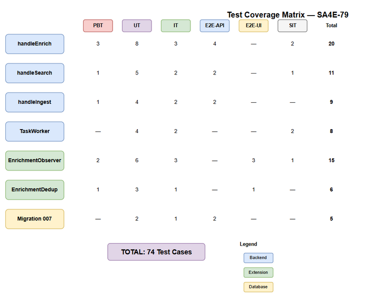
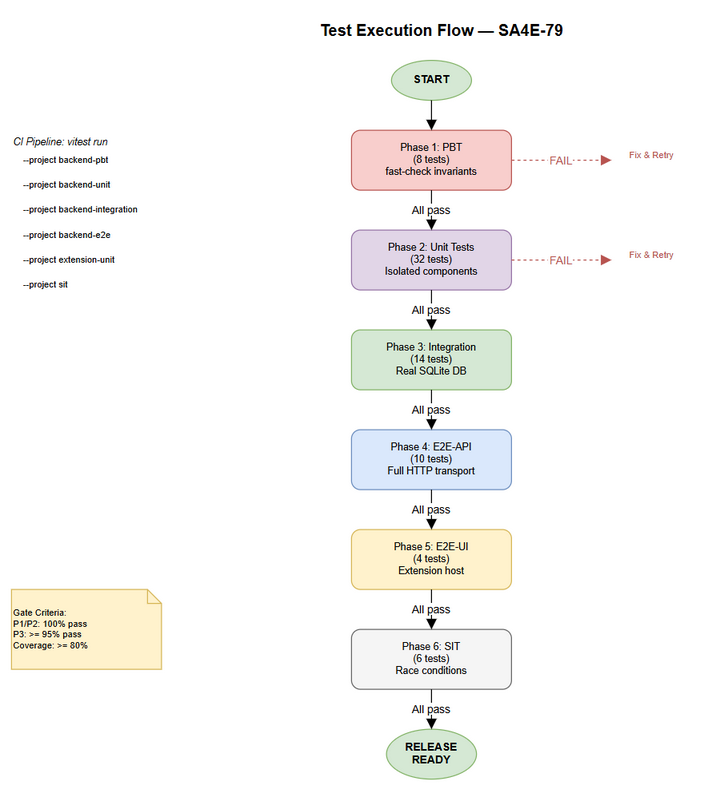

# System Test Plan (STP)

## SA4E — SA4E-79: On-Demand Client LLM Enrichment for KB Entries

---

## Document Information

| Field | Value |
|-------|-------|
| Jira Ticket | SA4E-79 |
| Title | On-Demand Client LLM Enrichment for KB Entries |
| Author | QA Agent |
| Version | 1.0 |
| Date | 2025-07-20 |
| Status | Draft |
| Related BRD | BRD-v1-SA4E-79.docx |
| Related FSD | FSD-v1-SA4E-79.docx |
| Related TDD | TDD-v1-SA4E-79.docx |
| Architecture Pattern | Plugin (Extension + Backend) |
| Test Framework | Vitest (unit + integration) |

---

## Author Tracking

| Role | Name - Position | Responsibility |
|------|-----------------|----------------|
| Author | QA Agent – Quality Assurance Engineer | Create document |
| Peer Reviewer | SM Agent – Scrum Master | Review document |

---

## Revision History

| Version | Date | Author | Changes |
|---------|------|--------|---------|
| 1.0 | 2025-07-20 | QA Agent | Initial STP — full test plan |

---

## 1. Introduction

### 1.1 Purpose

This System Test Plan defines the testing strategy, test levels, test approach, and traceability for SA4E-79 (On-Demand Client LLM Enrichment for KB Entries). It covers all testing activities required to verify the feature from unit level through system integration.

### 1.2 Scope

**In Scope:**
- Backend `mem_enrich` MCP tool — validation, atomic update, race condition, scope check
- Backend `mem_search` modification — pending_hits included, capped at 3
- Backend `handleIngest` modification — enrichment_status set based on LLM availability
- Backend TaskWorker modification — skip if status='done'
- Extension `EnrichmentObserver` — parse pending_hits, async enrichment, dedup
- Extension `EnrichmentDedup` — in-flight tracking, stale timeout
- Database migration 007 — backward compatibility
- Security findings (F-01, F-02, F-03) validation
- Integration flow — end-to-end enrichment lifecycle

**Out of Scope:**
- Backend LLM provider internal testing
- VS Code extension marketplace publishing
- Client LLM model quality testing
- Bulk re-enrichment scenarios

### 1.3 Test Environment

| Component | Environment |
|-----------|------------|
| Backend Runtime | Node.js 20+, Hono framework |
| Database | SQLite (in-memory for UT, file-based for IT) |
| Extension Runtime | VS Code Extension Host (mock for UT) |
| Test Framework | Vitest 1.x |
| Mocking | vitest mock, vi.fn(), vi.spyOn() |
| Integration DB | SQLite with WAL mode |
| CI Runner | GitHub Actions |

---

## 2. Test Strategy

### 2.1 Test Approach

The testing strategy follows the **Test Pyramid** model adapted for the Plugin architecture pattern:

1. **Property-Based Testing (PBT)** — Verify invariants using random input generation (fast-check)
2. **Unit Testing (UT)** — Isolate each component with mocked dependencies
3. **Integration Testing (IT)** — Test component interactions with real SQLite DB
4. **E2E-API Testing** — Full MCP tool lifecycle via HTTP transport
5. **E2E-UI Testing** — Extension behavior in VS Code Extension Host (limited — no real UI)
6. **System Integration Testing (SIT)** — Full flow: Extension ↔ Backend ↔ DB with race conditions

### 2.2 Test Levels Summary

| Level | Count | Framework | Scope | Automation |
|-------|-------|-----------|-------|------------|
| PBT | 8 | Vitest + fast-check | Input validation invariants | 100% automated |
| UT | 32 | Vitest | Individual functions/classes | 100% automated |
| IT | 14 | Vitest + real SQLite | Multi-component with DB | 100% automated |
| E2E-API | 10 | Vitest + supertest/fetch | Full MCP tool calls | 100% automated |
| E2E-UI | 4 | VS Code Extension Test | Extension enrichment flow | 100% automated |
| SIT | 6 | Vitest + concurrency | Cross-system race conditions | 100% automated |

**Total: 74 test cases**

### 2.3 Test Priorities

| Priority | Description | Coverage Target |
|----------|-------------|-----------------|
| P1 (Critical) | Core enrichment flow, race conditions, data integrity | 100% pass |
| P2 (High) | Validation, error handling, TaskWorker skip | 100% pass |
| P3 (Medium) | Edge cases, performance bounds, security hardening | 95% pass |
| P4 (Low) | Notification, logging, audit trail | 90% pass |

### 2.4 Entry/Exit Criteria

**Entry Criteria:**
- All source code committed to feature branch `SA4E-79`
- Migration 007 script exists and runs without errors
- Vitest configuration set up for both backend and extension
- Test data fixtures prepared (CSV)

**Exit Criteria:**
- All P1 tests PASS (zero failures)
- All P2 tests PASS (zero failures)
- P3 tests: >= 95% pass rate
- Code coverage >= 80% for new code (lines + branches)
- No unresolved Critical/High security findings

---

## 3. Test Coverage Matrix



### 3.1 Coverage by Component

| Component | PBT | UT | IT | E2E-API | E2E-UI | SIT | Total |
|-----------|-----|----|----|---------|--------|-----|-------|
| handleEnrich | 3 | 8 | 3 | 4 | — | 2 | 20 |
| handleSearch (pending) | 1 | 5 | 2 | 2 | — | 1 | 11 |
| handleIngest (status) | 1 | 4 | 2 | 2 | — | — | 9 |
| TaskWorker (skip) | — | 4 | 2 | — | — | 2 | 8 |
| EnrichmentObserver | 2 | 6 | 3 | — | 3 | 1 | 15 |
| EnrichmentDedup | 1 | 3 | 1 | — | 1 | — | 6 |
| Migration 007 | — | 2 | 1 | 2 | — | — | 5 |
| **Total** | **8** | **32** | **14** | **10** | **4** | **6** | **74** |

---

## 4. Test Levels Detail

### 4.1 Property-Based Testing (PBT)

**Purpose:** Verify invariants hold for ALL valid inputs, not just hand-picked examples.
**Library:** `fast-check` with Vitest
**Focus Areas:**

| ID | Property | Generator | Invariant |
|----|----------|-----------|-----------|
| PBT-01 | mem_enrich summary validation | `fc.string(1, 600)` | summary > 500 chars always rejected |
| PBT-02 | mem_enrich tags validation | `fc.string(0, 600)` | tags > 500 chars always rejected |
| PBT-03 | mem_enrich structured_map size | `fc.json(0, 200KB)` | JSON > 100KB always rejected |
| PBT-04 | mem_enrich entry_id | `fc.integer()` | entry_id <= 0 always rejected |
| PBT-05 | pending_hits cap | `fc.array(pendingEntry, 1, 20)` | result always <= 3 items |
| PBT-06 | EnrichmentObserver parse | `fc.string()` | No crash on arbitrary input |
| PBT-07 | EnrichmentDedup stale cleanup | `fc.nat()` timestamps | Entries > 60s always cleaned |
| PBT-08 | enrichment_status transition | `fc.oneof('pending','done')` | 'done' to 'done' transition always rejected |

### 4.2 Unit Testing (UT)

**Purpose:** Verify individual functions in isolation with mocked dependencies.
**Isolation Strategy:** Mock `DatabaseAdapter`, `MemoryEngine`, `McpBridge`, `LlmProvider`

#### Backend Unit Tests

| Group | Test Count | Focus |
|-------|-----------|-------|
| handleEnrich validation | 8 | All error paths (invalid id, empty summary, too long, scope violation, already enriched) |
| handleSearch pending | 5 | Query construction, cap at 3, empty case, scope filter, format output |
| handleIngest status | 4 | LLM available then done, LLM unavailable then pending, null tagAnalyzer |
| TaskWorker skip | 4 | status=done then skip, status=pending then process, entry not found, race condition |

#### Extension Unit Tests

| Group | Test Count | Focus |
|-------|-----------|-------|
| EnrichmentObserver.parsePendingHits | 3 | Valid format, no delimiter, malformed entries |
| EnrichmentObserver.enrichInBackground | 3 | LLM unavailable skip, dedup filter, batch cap |
| EnrichmentDedup | 3 | canProcess/markInFlight/release, stale cleanup, concurrent access |
| Migration 007 | 2 | Column existence check, default value verification |

### 4.3 Integration Testing (IT)

**Purpose:** Test component interactions with real SQLite database.
**DB Strategy:** In-memory SQLite with full migration chain applied.

| ID | Scenario | Components |
|----|----------|-----------|
| IT-01 | Ingest with LLM OFF then entry has status='pending' | crud + DB |
| IT-02 | Ingest with LLM ON then entry has status='done' | crud + DB |
| IT-03 | Search returns pending_hits from real DB | search + DB |
| IT-04 | Search respects scope filter for pending entries | search + DB + scope |
| IT-05 | mem_enrich updates entry atomically | enrich + DB |
| IT-06 | mem_enrich returns 409 on second call | enrich + DB |
| IT-07 | TaskWorker skips done entries | TaskWorker + DB |
| IT-08 | TaskWorker processes pending entries | TaskWorker + DB + mock LLM |
| IT-09 | Race: concurrent mem_enrich on same entry | enrich + DB |
| IT-10 | Race: mem_enrich + TaskWorker on same entry | enrich + TaskWorker + DB |
| IT-11 | Migration: existing entries default to 'done' | migration + DB |
| IT-12 | FTS index updated after enrichment | enrich + FTS + DB |
| IT-13 | EnrichmentObserver full flow with mock LLM | Observer + mock MCP + mock LLM |
| IT-14 | pending_task marked COMPLETED after enrich | enrich + pending_tasks + DB |

### 4.4 E2E-API Testing

**Purpose:** Full MCP tool call lifecycle via HTTP transport.
**Setup:** Hono test server with real database and full middleware chain.

| ID | Scenario | Tool | Expected |
|----|----------|------|----------|
| E2E-API-01 | mem_enrich success flow | mem_enrich | 200 + success text |
| E2E-API-02 | mem_enrich validation errors | mem_enrich | 200 + isError + error text |
| E2E-API-03 | mem_enrich scope violation | mem_enrich | 200 + scope error |
| E2E-API-04 | mem_enrich idempotent (409) | mem_enrich | 200 + already enriched |
| E2E-API-05 | mem_search with pending_hits | mem_search | Response contains delimiter + entries |
| E2E-API-06 | mem_search no pending entries | mem_search | No pending section |
| E2E-API-07 | mem_ingest LLM OFF then pending status | mem_ingest | Entry stored with pending |
| E2E-API-08 | mem_ingest LLM ON then done status | mem_ingest | Entry stored with done |
| E2E-API-09 | Migration backward compat via API | mem_search | Old entries show as done |
| E2E-API-10 | Full lifecycle: ingest then search then enrich then search | All | Complete enrichment cycle |

### 4.5 E2E-UI Testing

**Purpose:** Extension behavior in VS Code Extension Host environment.
**Framework:** `@vscode/test-electron` or Vitest with VS Code API mocks.

| ID | Scenario | Expected |
|----|----------|----------|
| E2E-UI-01 | EnrichmentObserver detects pending_hits and triggers enrichment | LLM called, mem_enrich called |
| E2E-UI-02 | EnrichmentObserver non-blocking (search returns immediately) | Search result available before enrichment completes |
| E2E-UI-03 | EnrichmentObserver respects batch cap (max 3) | Only 3 entries processed |
| E2E-UI-04 | EnrichmentDedup prevents duplicate processing | Same entry not enriched twice |

### 4.6 System Integration Testing (SIT)

**Purpose:** Validate cross-system scenarios with real concurrency.
**Focus:** Race conditions, concurrent access, system recovery.

| ID | Scenario | Setup | Validation |
|----|----------|-------|-----------|
| SIT-01 | Two extensions enrich same entry concurrently | 2 concurrent mem_enrich calls | Exactly one succeeds, one gets 409 |
| SIT-02 | Extension enriches while TaskWorker processes | Concurrent mem_enrich + processTagEnrichment | First-to-complete wins (BR-13) |
| SIT-03 | Backend LLM recovery processes remaining pending | 5 pending entries, enrich 2 via client, recover backend | TaskWorker processes remaining 3 |
| SIT-04 | High concurrency: 10 searches trigger enrichment | 10 concurrent mem_search calls | No duplicate enrichments, dedup works |
| SIT-05 | Extension restart mid-enrichment | Kill extension after marking in-flight | Stale timeout clears dedup, next search retries |
| SIT-06 | Migration + immediate search | Run migration, insert pending, search immediately | pending_hits returned correctly |

---

## 5. Security Test Coverage

Based on SECURITY-REVIEW.md findings:

| Finding | Test ID | Verification |
|---------|---------|-------------|
| F-01 (XSS via tags/summary) | UT-SEC-01 | Verify HTML chars in tags/summary are handled safely |
| F-02 (structured_map schema) | UT-SEC-02 | Verify unknown keys in structured_map are rejected |
| F-03 (Scope check bypass) | UT-SEC-03 | Verify undefined projectId results in error (fail-closed) |
| F-04 (Rate limit) | SIT-04 | Verify batch cap prevents excessive calls |
| F-05 (Prompt injection) | UT-SEC-04 | Verify adversarial content does not break LLM output parsing |

---

## 6. Test Execution Flow



### 6.1 Execution Order

```
Phase 1: PBT (8 tests) — fast, validates invariants
    |
    v All pass?
Phase 2: UT (32 tests) — isolated component testing
    |
    v All pass?
Phase 3: IT (14 tests) — real database integration
    |
    v All pass?
Phase 4: E2E-API (10 tests) — full HTTP transport
    |
    v All pass?
Phase 5: E2E-UI (4 tests) — extension host
    |
    v All pass?
Phase 6: SIT (6 tests) — concurrency + race conditions
    |
    v All pass?
RELEASE READY
```

### 6.2 CI Pipeline Integration

```yaml
# .github/workflows/ci-sa4e-79.yml
jobs:
  test:
    steps:
      - run: vitest run --project backend-pbt
      - run: vitest run --project backend-unit
      - run: vitest run --project backend-integration
      - run: vitest run --project backend-e2e
      - run: vitest run --project extension-unit
      - run: vitest run --project extension-e2e
      - run: vitest run --project sit
```

---

## 7. Requirements Traceability Matrix (RTM)

### 7.1 Business Rules to Test Cases

| BR | Description | PBT | UT | IT | E2E-API | E2E-UI | SIT |
|----|-------------|-----|----|----|---------|--------|-----|
| BR-01 | LLM OFF then status='pending' | — | UT-ING-01 | IT-01 | E2E-API-07 | — | — |
| BR-02 | LLM ON then status='done' | — | UT-ING-02 | IT-02 | E2E-API-08 | — | — |
| BR-03 | Existing entries default 'done' | — | UT-MIG-01 | IT-11 | E2E-API-09 | — | SIT-06 |
| BR-04 | mem_search includes pending_hits | — | UT-SRC-01 | IT-03 | E2E-API-05 | — | — |
| BR-05 | Max 3 pending per search | PBT-05 | UT-SRC-02 | IT-03 | E2E-API-05 | — | — |
| BR-06 | Pending entries same hybrid scoring | — | UT-SRC-01 | IT-03 | E2E-API-05 | — | — |
| BR-07 | Client enrichment non-blocking | — | UT-OBS-02 | IT-13 | — | E2E-UI-02 | — |
| BR-08 | Max 3 entries per batch | — | UT-OBS-03 | IT-13 | — | E2E-UI-03 | SIT-04 |
| BR-09 | Failed enrichment silent | — | UT-OBS-04 | — | — | — | — |
| BR-10 | Validate entry exists AND status='pending' | PBT-04 | UT-ENR-01,02 | IT-05 | E2E-API-01,02 | — | — |
| BR-11 | Idempotent (409) | PBT-08 | UT-ENR-05 | IT-06 | E2E-API-04 | — | SIT-01 |
| BR-12 | TaskWorker only processes pending | — | UT-TW-01 | IT-07 | — | — | SIT-02 |
| BR-13 | First-to-complete wins (atomic) | — | UT-ENR-06 | IT-09,10 | — | — | SIT-01,02 |
| BR-14 | FIFO order for TaskWorker | — | UT-TW-03 | IT-08 | — | — | SIT-03 |
| BR-15 | enriched_by tracks source | — | UT-ENR-07,UT-TW-04 | IT-05,08 | E2E-API-01 | — | SIT-03 |

### 7.2 User Stories to Test Cases

| Story | Description | Key Test Cases |
|-------|-------------|---------------|
| Story 1 | Pending status tracking | UT-ING-01..04, IT-01,02,11, E2E-API-07,08,09 |
| Story 2 | Search with pending hits | UT-SRC-01..05, PBT-05, IT-03,04, E2E-API-05,06 |
| Story 3 | Extension auto-enrich | UT-OBS-01..06, IT-13, E2E-UI-01..04, SIT-04 |
| Story 4 | Push enriched metadata | UT-ENR-01..08, PBT-01..04, IT-05,06,12,14, E2E-API-01..04 |
| Story 5 | TaskWorker skip enriched | UT-TW-01..04, IT-07,08, SIT-02,03 |
| Story 6 | Backend LLM recovery | IT-08, SIT-03 |

### 7.3 Security Findings to Test Cases

| Finding | Severity | Test Case | Verification Method |
|---------|----------|-----------|---------------------|
| F-01 | Medium | UT-SEC-01 | Input `<script>alert(1)</script>` in tags and verify stored safely |
| F-02 | Medium | UT-SEC-02 | Input unknown keys in structured_map and verify rejection |
| F-03 | Medium | UT-SEC-03 | Call mem_enrich with undefined scopeCtx.projectId and verify fail-closed |
| F-04 | Low | SIT-04 | 10 concurrent enrichments and verify batch cap enforced |
| F-05 | Low | UT-SEC-04 | Adversarial content in entry and verify JSON parse handles gracefully |

---

## 8. Test Data Management

### 8.1 Test Data Files

| File | Purpose | Format |
|------|---------|--------|
| `test-data/enrichment-entries.csv` | KB entries for testing | CSV |
| `test-data/enrichment-metadata.csv` | Valid/invalid metadata payloads | CSV |
| `test-data/pending-search-fixtures.csv` | Search scenarios with pending entries | CSV |

### 8.2 Test Data Strategy

- **Static fixtures:** Pre-defined entries with known IDs for deterministic testing
- **Generated data:** fast-check generators for PBT
- **Isolation:** Each test creates its own data in transaction, rolled back after

---

## 9. Risk Assessment

| Risk | Probability | Impact | Mitigation |
|------|------------|--------|-----------|
| Race condition not caught in tests | Low | High | SIT tests with real concurrency + atomic DB operations |
| SQLite WAL mode differences in test vs prod | Low | Medium | Use same SQLite config in IT |
| Client LLM mock does not reflect real behavior | Medium | Low | Focus on output parsing, not LLM quality |
| Extension host test flakiness | Medium | Medium | Retry mechanism in CI, separate from core tests |

---

## 10. Appendix

### Diagram Index

| # | Diagram | Image | Source (editable) |
|---|---------|-------|-------------------|
| 1 | Test Coverage Matrix | [test-coverage.png](diagrams/test-coverage.png) | [test-coverage.drawio](diagrams/test-coverage.drawio) |
| 2 | Test Execution Flow | [test-execution-flow.png](diagrams/test-execution-flow.png) | [test-execution-flow.drawio](diagrams/test-execution-flow.drawio) |
