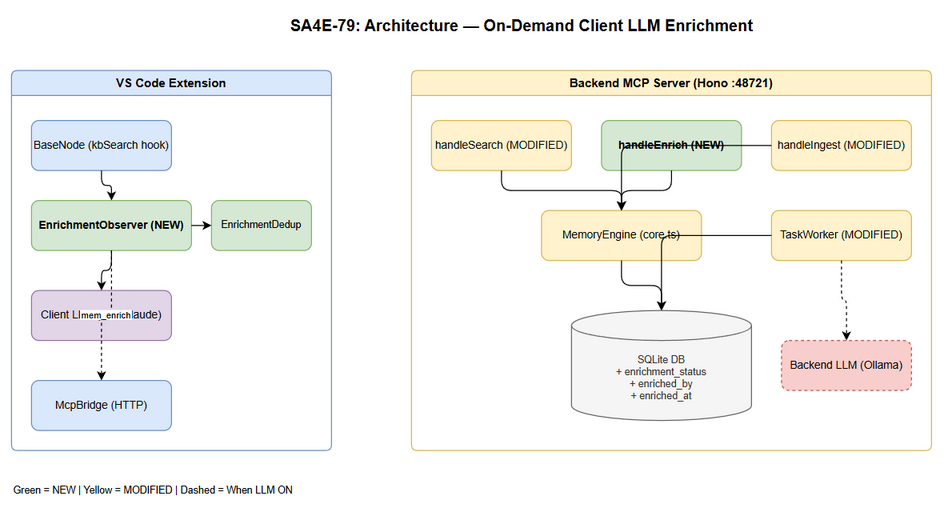

# Technical Design Document (TDD)

## SA4E — SA4E-79: On-Demand Client LLM Enrichment for KB Entries

---

## Document Information

| Field | Value |
|-------|-------|
| Jira Ticket | SA4E-79 |
| Title | On-Demand Client LLM Enrichment for KB Entries |
| Author | SA Agent – Solution Architect |
| Version | 1.0 |
| Date | 2025-07-20 |
| Status | Draft |
| Related BRD | documents/SA4E-79/BRD.md |
| Related FSD | documents/SA4E-79/FSD.md |
| Architecture Pattern | Plugin (Extension + Backend) |

---

## Revision History

| Version | Date | Author | Changes |
|---------|------|--------|---------|
| 1.0 | 2025-07-20 | SA Agent | Initial TDD — full technical design |

---

## 1. Architecture Overview

### 1.1 System Context

This feature adds a **client-side enrichment fallback path** to the existing KB Memory module. When the backend LLM (Ollama/OpenAI) is unavailable, KB entries are stored in a "pending" state. The VS Code extension detects these during search and enriches them using the client-side LLM (Kiro/Claude), then pushes metadata back via a new `mem_enrich` MCP tool.



### 1.2 Integration with Existing Memory Module

The feature touches both deployment units:

**Backend (`backend/src/modules/memory/`):**
- New `mem_enrich` MCP tool (dispatcher + definition)
- Modified `mem_search` response (pending_hits section)
- Modified `handleIngest` (enrichment_status tracking)
- Modified `TaskWorker.processTagEnrichment` (skip if done)
- DB migration (3 new columns + partial index)

**Extension (`extension/src/`):**
- New `EnrichmentObserver` class (detects pending_hits, orchestrates enrichment)
- Modified `BaseNode.kbSearch` (hook for enrichment detection)
- New `EnrichmentDedup` utility (in-flight tracking)

### 1.3 Design Principles

1. **Non-blocking**: Client enrichment never blocks search result display (BR-07)
2. **Race-safe**: Atomic `UPDATE ... WHERE enrichment_status='pending'` (BR-13)
3. **Backward-compatible**: Default `'done'` for existing entries (BR-03)
4. **Minimal surface**: Observer pattern on kbSearch - no new LangGraph nodes needed
5. **Idempotent**: Second enrichment attempt returns 409, no corruption (BR-11)

---

## 2. Component Design

### 2.1 New Components

#### 2.1.1 Backend: `handleEnrich` Dispatcher

**File:** `backend/src/modules/memory/dispatchers/enrich.ts`

Handles the `mem_enrich` MCP tool. Validates input, performs atomic status transition, updates FTS index, marks related pending_task as COMPLETED.

**Responsibilities:**
- Validate entry_id, summary, tags, structured_map
- Verify entry exists and belongs to caller's scope
- Atomic UPDATE with WHERE enrichment_status='pending' (race guard)
- Update FTS index for changed summary/tags
- Mark related TAG_ENRICHMENT pending_task as COMPLETED

#### 2.1.2 Backend: `mem_enrich` MCP Tool Definition

**File:** `backend/src/modules/memory/definitions/enrich.ts`

MCP tool schema registration following existing pattern in `definitions/search.ts`.

#### 2.1.3 Backend: Migration `007_enrichment_status.ts`

**File:** `backend/src/modules/memory/schema/migrations/007_enrichment_status.ts`

Adds three columns + partial index to knowledge_entries table.

#### 2.1.4 Extension: `EnrichmentObserver`

**File:** `extension/src/langgraph/enrichment/EnrichmentObserver.ts`

Observer class that hooks into kbSearch responses. Detects pending_hits delimiter, parses pending entries, orchestrates background enrichment via client LLM.

**Responsibilities:**
- Parse pending_hits from mem_search response text
- In-flight dedup (Set<number>)
- Call client LLM with enrichment prompt
- Validate LLM output against schema
- Call mem_enrich via McpBridge
- Track consecutive failures for notifications

#### 2.1.5 Extension: `EnrichmentDedup`

**File:** `extension/src/langgraph/enrichment/EnrichmentDedup.ts`

Simple in-memory dedup to prevent same entry from being enriched concurrently within one extension session.

### 2.2 Modified Components

#### 2.2.1 Backend: `handleSearch` (search.ts)

**File:** `backend/src/modules/memory/dispatchers/search.ts`

**Changes:**
- After normal search results, query pending entries matching the search query
- Append `--- Pending Entries (need enrichment) ---` section
- Cap at 3 pending entries (BR-05)
- Include entry ID, source, first 300 chars of content

#### 2.2.2 Backend: `handleIngest` (crud.ts)

**File:** `backend/src/modules/memory/dispatchers/crud.ts`

**Changes:**
- Set `enrichment_status` based on tagAnalyzer availability
- When tagAnalyzer is null/unavailable: `enrichment_status = 'pending'`
- When tagAnalyzer is available: `enrichment_status = 'done'` (TaskWorker will confirm)
- Always create TAG_ENRICHMENT task regardless of LLM status

#### 2.2.3 Backend: `TaskWorker.processTagEnrichment`

**File:** `backend/src/modules/memory/task-queue/TaskWorker.ts`

**Changes:**
- Check `entry.enrichment_status` before calling tagAnalyzer
- If `'done'`: mark task COMPLETED, skip (client already enriched)
- On success: atomic UPDATE to set `enrichment_status='done'`, `enriched_by='backend_llm'`

#### 2.2.4 Backend: `KnowledgeEntry` Model

**File:** `backend/src/modules/memory/models.ts`

**Changes:**
- Add `enrichment_status: 'pending' | 'done'` field
- Add `enriched_by: string | null` field
- Add `enriched_at: string | null` field

#### 2.2.5 Extension: `BaseNode.kbSearch`

**File:** `extension/src/langgraph/core/base-node.ts`

**Changes:**
- After successful kbSearch call, pass response to EnrichmentObserver
- Observer fires enrichment in background (fire-and-forget)
- kbSearch returns immediately without waiting

---

## 3. API Design

### 3.1 New Tool: `mem_enrich`

**Transport:** MCP over StreamableHTTP (localhost:48721)
**Method:** `tools/call`

#### Input Schema

```json
{
  "type": "object",
  "properties": {
    "entry_id": {
      "type": "number",
      "description": "KB entry identifier (knowledge_entries.id)"
    },
    "summary": {
      "type": "string",
      "description": "LLM-generated summary (max 500 chars)",
      "maxLength": 500
    },
    "tags": {
      "type": "string",
      "description": "Comma-separated tags (max 500 chars)",
      "maxLength": 500
    },
    "structured_map": {
      "type": "object",
      "description": "Structured extraction (max 100KB JSON)",
      "properties": {
        "summary": { "type": "string" },
        "business_entities": { "type": "array", "items": { "type": "string" } },
        "actors": { "type": "array", "items": { "type": "string" } },
        "business_rules": { "type": "array", "items": { "type": "string" } },
        "tags": { "type": "array", "items": { "type": "string" } }
      }
    }
  },
  "required": ["entry_id", "summary", "tags"]
}
```

#### Response Format

**Success:**
```
Entry #42 enriched successfully. Status: done. Enriched by: client_llm.
```

**Errors (isError: true):**

| Condition | Response Text |
|-----------|--------------|
| entry_id invalid or <= 0 | `Error: Invalid entry_id` |
| Entry not found | `Error: Entry #42 not found` |
| Already enriched | `Error: Entry #42 already enriched (status=done)` |
| Empty summary | `Error: Invalid metadata - summary required` |
| Summary > 500 chars | `Error: Invalid metadata - summary too long (max 500)` |
| Tags > 500 chars | `Error: Invalid metadata - tags too long (max 500)` |
| structured_map > 100KB | `Error: Invalid metadata - structured_map too large (max 100KB)` |
| Scope violation | `Error: Entry #42 not accessible in current scope` |

### 3.2 Modified Tool: `mem_search`

**Change:** Append pending_hits section after normal results.

#### Modified Response Format

```
Found 5 results:

[CONTEXT] Memory module configuration guide
  ID: 10 | Tier: SHARED | Scope: PROJECT | Score: 0.892
  Content: The memory module uses SQLite with WAL mode...

[DECISION] Switch to WAL mode for concurrent reads
  ID: 15 | Tier: CORE | Scope: PROJECT | Score: 0.756

--- Pending Entries (need enrichment) ---

[PENDING #1] ID: 42 | Source: agent-output/SA4E-79
  Content: Raw content of the pending entry truncated to first 300 chars...

[PENDING #2] ID: 43 | Source: agent-output/SA4E-79
  Content: Another pending entry content here...
```

#### Parsing Contract (Extension Side)

```typescript
const PENDING_DELIMITER = '--- Pending Entries (need enrichment) ---';
const PENDING_ENTRY_REGEX = /\[PENDING #\d+\] ID: (\d+) \| Source: (.+)\n\s+Content: (.+)/g;

interface PendingHit {
  id: number;
  source: string;
  content: string;  // first 300 chars
}
```

---

## 4. Database Design

### 4.1 Schema Changes

Add three columns to `knowledge_entries` table:

| Column | Type | Default | Nullable | Index |
|--------|------|---------|----------|-------|
| enrichment_status | TEXT | 'done' | NOT NULL | Partial (WHERE='pending') |
| enriched_by | TEXT | NULL | YES | None |
| enriched_at | TEXT | NULL | YES | None |

### 4.2 Migration Script

**File:** `backend/src/modules/memory/schema/migrations/007_enrichment_status.ts`

```typescript
/**
 * Migration 007 - SA4E-79: Add enrichment tracking columns.
 * Non-destructive ALTER TABLE - existing entries default to 'done' (BR-03).
 */
import type { DatabaseAdapter } from '../../../../database/adapters/DatabaseAdapter.js';

export const MIGRATION_007_UP = `
-- SA4E-79: Enrichment status tracking
ALTER TABLE knowledge_entries ADD COLUMN enrichment_status TEXT NOT NULL DEFAULT 'done';
ALTER TABLE knowledge_entries ADD COLUMN enriched_by TEXT DEFAULT NULL;
ALTER TABLE knowledge_entries ADD COLUMN enriched_at TEXT DEFAULT NULL;

-- Partial index: efficient query for pending entries in mem_search
CREATE INDEX IF NOT EXISTS idx_ke_enrichment_pending
  ON knowledge_entries(enrichment_status)
  WHERE enrichment_status = 'pending';
`;

export async function migrate007Up(adapter: DatabaseAdapter): Promise<void> {
  const statements = MIGRATION_007_UP.split(';').filter(s => s.trim());
  for (const stmt of statements) {
    await adapter.runAsync(stmt.trim(), []);
  }
}
```

### 4.3 Index Strategy

| Index | Type | Purpose | Performance Impact |
|-------|------|---------|-------------------|
| `idx_ke_enrichment_pending` | Partial (WHERE='pending') | Fast pending_hits query in mem_search | < 1MB for 10K entries; only indexes pending rows |

The partial index ensures:
- mem_search pending query scans only pending entries (not all 10K+)
- Index stays small since pending entries are transient (they get enriched)
- Normal search (on done entries) is unaffected

### 4.4 FTS Index Update

When `mem_enrich` updates summary and tags, the existing FTS triggers (`knowledge_fts_au`) automatically fire:
1. DELETE old row from FTS
2. INSERT new row with updated summary/tags

No additional FTS logic needed - existing triggers in `schema/tables.ts` handle this.

---

## 5. Class/Module Design

### 5.1 Backend: `handleEnrich` (New Dispatcher)

**File:** `backend/src/modules/memory/dispatchers/enrich.ts`

```typescript
/**
 * enrich.ts - SA4E-79: mem_enrich MCP tool handler.
 * Accepts client-generated enrichment metadata for pending KB entries.
 * Uses atomic UPDATE WHERE for race condition safety (BR-13).
 */
import type { MemoryEngine } from '../engine/core.js';
import type { ScopeContext } from '../models.js';
import type { DatabaseAdapter } from '../../../database/adapters/DatabaseAdapter.js';
import pino from 'pino';

const logger = pino({ name: 'mem-enrich-dispatcher' });
type Args = Record<string, unknown>;

export async function handleEnrich(
  engine: MemoryEngine,
  scopeCtx: ScopeContext | undefined,
  a: Args,
  dbAdapter: DatabaseAdapter,
): Promise<string> {
  const entryId = a.entry_id as number;
  const summary = a.summary as string;
  const tags = a.tags as string;
  const structuredMap = a.structured_map as object | undefined;

  // --- Validation (BR-10) ---
  if (!entryId || entryId <= 0) return 'Error: Invalid entry_id';
  if (!summary || summary.trim().length === 0) {
    return 'Error: Invalid metadata - summary required';
  }
  if (summary.length > 500) {
    return 'Error: Invalid metadata - summary too long (max 500)';
  }
  if (tags && tags.length > 500) {
    return 'Error: Invalid metadata - tags too long (max 500)';
  }
  if (structuredMap) {
    const mapJson = JSON.stringify(structuredMap);
    if (mapJson.length > 102400) {
      return 'Error: Invalid metadata - structured_map too large (max 100KB)';
    }
  }

  // --- Entry existence check ---
  const entry = await engine.findById(entryId);
  if (!entry) return `Error: Entry #${entryId} not found`;

  // --- Scope check (security) ---
  if (scopeCtx?.projectId && entry.project_id
      && entry.project_id !== scopeCtx.projectId) {
    return `Error: Entry #${entryId} not accessible in current scope`;
  }

  // --- Atomic status transition (BR-13: first-to-complete wins) ---
  const now = new Date().toISOString();
  const result = await dbAdapter.runAsync(
    `UPDATE knowledge_entries
     SET summary = ?, tags = ?, structured_map = ?,
         enrichment_status = 'done', enriched_by = 'client_llm',
         enriched_at = ?, updated_at = ?
     WHERE id = ? AND enrichment_status = 'pending'`,
    [
      summary.trim(),
      (tags || '').trim(),
      structuredMap ? JSON.stringify(structuredMap) : entry.structured_map,
      now, now, entryId,
    ]
  );

  if (result.changes === 0) {
    return `Error: Entry #${entryId} already enriched (status=done)`;
  }

  // --- Mark related TAG_ENRICHMENT task as COMPLETED ---
  try {
    await dbAdapter.runAsync(
      `UPDATE pending_tasks SET status = 'COMPLETED', completed_at = ?
       WHERE entry_id = ? AND task_type = 'TAG_ENRICHMENT'
       AND status IN ('PENDING', 'PROCESSING')`,
      [now, entryId]
    );
  } catch (err) {
    logger.warn({ entryId, err }, '[mem_enrich] Task mark failed (non-fatal)');
  }

  await engine.auditLog('ENRICH_CLIENT', entryId);
  return `Entry #${entryId} enriched successfully. Status: done. Enriched by: client_llm.`;
}
```

### 5.2 Backend: Modified `handleSearch`

**File:** `backend/src/modules/memory/dispatchers/search.ts`

**Additions at the end of `handleSearch` function:**

```typescript
// --- Pending Hits (SA4E-79) ---
// Query pending entries matching the search, cap at 3 (BR-05)
const pendingEntries = await engine.getAdapter().allAsync<{
  id: number; source: string | null; content: string;
}>(
  `SELECT id, source, content FROM knowledge_entries
   WHERE enrichment_status = 'pending' AND archived = 0
   ${scopeCtxResolved ? 'AND (project_id = ? OR scope = \'SHARED\')' : ''}
   ORDER BY created_at DESC LIMIT 3`,
  scopeCtxResolved ? [scopeCtxResolved.projectId ?? ''] : []
);

if (pendingEntries.length > 0) {
  lines.push('--- Pending Entries (need enrichment) ---\n');
  pendingEntries.forEach((pe, idx) => {
    const src = pe.source || 'unknown';
    const preview = pe.content.slice(0, 300).replace(/\n/g, ' ');
    lines.push(`[PENDING #${idx + 1}] ID: ${pe.id} | Source: ${src}`);
    lines.push(`  Content: ${preview}`);
    lines.push('');
  });
}
```

### 5.3 Backend: Modified `handleIngest`

**File:** `backend/src/modules/memory/dispatchers/crud.ts`

**Change in transaction block:**

```typescript
// Inside dbAdapter.transactionAsync:
id = await engine.insert({
  content, summary, type,
  tier: tierForType(type), scope, user_id: userId,
  project_id: scopeCtx?.projectId ?? null,
  source, tags, agent_name: agentName,
  owner: inferOwner(source),
});

// SA4E-79: Set enrichment_status based on tagAnalyzer availability
const enrichmentStatus = tagAnalyzer ? 'done' : 'pending';
await dbAdapter.runAsync(
  `UPDATE knowledge_entries SET enrichment_status = ? WHERE id = ?`,
  [enrichmentStatus, id]
);
```

### 5.4 Backend: Modified `TaskWorker.processTagEnrichment`

**File:** `backend/src/modules/memory/task-queue/TaskWorker.ts`

**Add enrichment_status check at the start:**

```typescript
private async processTagEnrichment(task: PendingTask, payload: any): Promise<void> {
  if (!this.tagAnalyzer) { this.repo.resetForRetry(task.id); return; }

  // SA4E-79: Check if already enriched by client (BR-12, BR-13)
  const entry = await this.engine.findById(task.entry_id);
  if (!entry) { await this.repo.markFailed(task.id, 'entry_not_found'); return; }

  if ((entry as any).enrichment_status === 'done') {
    this.logger.info({ entry_id: task.entry_id },
      'Skipping TAG_ENRICHMENT - already enriched');
    await this.repo.markCompleted(task.id);
    return;
  }

  // ... existing context chain + tagAnalyzer logic (unchanged) ...

  // SA4E-79: After successful enrichment, set status
  const now = new Date().toISOString();
  await this.engine.getAdapter().runAsync(
    `UPDATE knowledge_entries
     SET enrichment_status = 'done', enriched_by = 'backend_llm', enriched_at = ?
     WHERE id = ? AND enrichment_status = 'pending'`,
    [now, task.entry_id]
  );

  await this.repo.markCompleted(task.id);
}
```

### 5.5 Extension: `EnrichmentObserver`

**File:** `extension/src/langgraph/enrichment/EnrichmentObserver.ts`

```typescript
/**
 * EnrichmentObserver - SA4E-79
 * Detects pending_hits in mem_search responses and orchestrates
 * background client-side LLM enrichment.
 * Non-blocking: fires enrichment async, never blocks pipeline.
 */
import type { McpBridge } from '../core/mcp-bridge';
import type { LlmProvider } from '../core/llm-provider';
import { EnrichmentDedup } from './EnrichmentDedup';
import {
  ENRICHMENT_SYSTEM_PROMPT,
  ENRICHMENT_USER_PROMPT,
} from './prompts';

interface PendingHit {
  id: number;
  source: string;
  content: string;
}

export class EnrichmentObserver {
  private dedup = new EnrichmentDedup();
  private consecutiveFailures = 0;
  private static MAX_FAILURES = 3;
  private static MAX_ENTRIES_PER_BATCH = 3;
  private static LLM_TIMEOUT_MS = 30_000;

  constructor(
    private readonly mcpBridge: McpBridge,
    private readonly llmProvider: LlmProvider | undefined,
  ) {}

  /**
   * Called after every kbSearch response.
   * Parses pending_hits and fires background enrichment.
   * Returns immediately (non-blocking per BR-07).
   */
  onSearchResponse(responseText: string): void {
    const pendingHits = this.parsePendingHits(responseText);
    if (pendingHits.length === 0) return;
    // Fire-and-forget — no await
    this.enrichInBackground(pendingHits);
  }

  private parsePendingHits(text: string): PendingHit[] {
    const idx = text.indexOf('--- Pending Entries');
    if (idx === -1) return [];
    const section = text.slice(idx);
    const regex = /\[PENDING #\d+\] ID: (\d+) \| Source: (.+)\n\s+Content: (.+)/g;
    const hits: PendingHit[] = [];
    let match: RegExpExecArray | null;
    while ((match = regex.exec(section)) !== null) {
      hits.push({
        id: parseInt(match[1], 10),
        source: match[2].trim(),
        content: match[3].trim(),
      });
    }
    return hits;
  }

  private async enrichInBackground(hits: PendingHit[]): Promise<void> {
    if (!this.llmProvider || !(await this.llmProvider.isAvailable())) return;

    const toProcess = hits
      .filter(h => this.dedup.canProcess(h.id))
      .slice(0, EnrichmentObserver.MAX_ENTRIES_PER_BATCH);

    if (toProcess.length === 0) return;
    for (const h of toProcess) this.dedup.markInFlight(h.id);

    let successes = 0;
    try {
      const results = await Promise.allSettled(
        toProcess.map(h => this.enrichSingle(h))
      );
      for (const r of results) {
        if (r.status === 'fulfilled' && r.value) successes++;
      }
      // Track consecutive failures
      if (successes === 0) this.consecutiveFailures += toProcess.length;
      else this.consecutiveFailures = 0;
    } finally {
      for (const h of toProcess) this.dedup.release(h.id);
    }
  }

  private async enrichSingle(hit: PendingHit): Promise<boolean> {
    try {
      const response = await this.callLlmWithTimeout(hit.content);
      const metadata = JSON.parse(response);
      if (!metadata.summary || metadata.summary.length === 0) return false;
      // Truncate to limits
      if (metadata.summary.length > 500) {
        metadata.summary = metadata.summary.slice(0, 500);
      }
      if (metadata.tags && metadata.tags.length > 500) {
        metadata.tags = metadata.tags.slice(0, 500);
      }
      // Push to backend
      const result = await this.mcpBridge.callTool('mem_enrich', {
        entry_id: hit.id,
        summary: metadata.summary,
        tags: metadata.tags || '',
        structured_map: metadata.structured_map || null,
      }, 30_000);
      return !result.includes('Error:');
    } catch {
      return false; // Silent failure per BR-09
    }
  }

  private async callLlmWithTimeout(content: string): Promise<string> {
    const messages = [
      { role: 'system' as const, content: ENRICHMENT_SYSTEM_PROMPT },
      { role: 'user' as const, content: ENRICHMENT_USER_PROMPT(content) },
    ];
    return this.llmProvider!.chat(messages, {
      maxTokens: 1000,
      temperature: 0.3,
      timeout: EnrichmentObserver.LLM_TIMEOUT_MS,
    });
  }
}
```

### 5.6 Extension: `EnrichmentDedup`

**File:** `extension/src/langgraph/enrichment/EnrichmentDedup.ts`

```typescript
/**
 * EnrichmentDedup - SA4E-79
 * In-memory dedup to prevent concurrent enrichment of same entry.
 * Safety timeout auto-releases entries stuck > 60s.
 */
export class EnrichmentDedup {
  private inFlight: Map<number, number> = new Map(); // entryId -> timestamp
  private static STALE_TIMEOUT_MS = 60_000;

  canProcess(entryId: number): boolean {
    this.cleanStale();
    return !this.inFlight.has(entryId);
  }

  markInFlight(entryId: number): void {
    this.inFlight.set(entryId, Date.now());
  }

  release(entryId: number): void {
    this.inFlight.delete(entryId);
  }

  getInflightCount(): number {
    return this.inFlight.size;
  }

  private cleanStale(): void {
    const now = Date.now();
    for (const [id, ts] of this.inFlight) {
      if (now - ts > EnrichmentDedup.STALE_TIMEOUT_MS) {
        this.inFlight.delete(id);
      }
    }
  }
}
```

### 5.7 Extension: Enrichment Prompts

**File:** `extension/src/langgraph/enrichment/prompts.ts`

```typescript
/**
 * LLM prompts for client-side KB entry enrichment.
 * Temperature: 0.3, MaxTokens: 1000, Output: JSON.
 */
export const ENRICHMENT_SYSTEM_PROMPT = `You are a knowledge base enrichment assistant.
Given raw content from a KB entry, extract structured metadata.
Respond ONLY with valid JSON matching the schema below.

Output JSON Schema:
{
  "summary": "string (max 500 chars, concise description)",
  "tags": "string (comma-separated keywords, max 500 chars total)",
  "structured_map": {
    "summary": "string (1-2 sentence overview)",
    "business_entities": ["string array of key entities/classes/systems"],
    "actors": ["string array of actors/users/services involved"],
    "business_rules": ["string array of rules/constraints mentioned"],
    "tags": ["string array of categorization tags"]
  }
}`;

export const ENRICHMENT_USER_PROMPT = (content: string): string =>
  `Analyze this KB entry content and extract metadata:\n\n---\n${content.slice(0, 4000)}\n---`;
```

### 5.8 Backend: MCP Tool Definition

**File:** `backend/src/modules/memory/definitions/enrich.ts`

```typescript
/** SA4E-79: mem_enrich tool definition for MCP registration. */
export const ENRICH_TOOL = {
  name: 'mem_enrich',
  description: 'Accept client-generated enrichment metadata for a pending KB entry. Updates summary, tags, and structured_map.',
  inputSchema: {
    type: 'object',
    properties: {
      entry_id: {
        type: 'number',
        description: 'KB entry identifier (knowledge_entries.id)',
      },
      summary: {
        type: 'string',
        description: 'LLM-generated summary of entry content (max 500 chars)',
      },
      tags: {
        type: 'string',
        description: 'Comma-separated tags (max 500 chars total)',
      },
      structured_map: {
        type: 'object',
        description: 'Structured extraction with entities, relations, business_rules (max 100KB)',
        properties: {
          summary: { type: 'string' },
          business_entities: { type: 'array', items: { type: 'string' } },
          actors: { type: 'array', items: { type: 'string' } },
          business_rules: { type: 'array', items: { type: 'string' } },
          tags: { type: 'array', items: { type: 'string' } },
        },
      },
    },
    required: ['entry_id', 'summary', 'tags'],
  },
};
```

---

## 6. Sequence Diagrams

### 6.1 Client-Side Enrichment Flow

```
Extension                  Backend MCP              SQLite DB
   |                           |                       |
   |--- mem_search(query) ---->|                       |
   |                           |-- hybrid search ----->|
   |                           |<-- results + pending -|
   |<-- hits[] + pending_hits[]|                       |
   |                           |                       |
   |  [async, non-blocking]    |                       |
   |--- LLM(content) -------->Client LLM              |
   |<-- {summary,tags,map} ---|                       |
   |                           |                       |
   |--- mem_enrich(id,meta) -->|                       |
   |                           |-- UPDATE WHERE pending>|
   |                           |<-- changes=1 ---------|
   |<-- "enriched success" ----|                       |
```

### 6.2 Race Condition Resolution

```
Extension                  Backend                  TaskWorker
   |                          |                        |
   |--- mem_enrich(id=42) --->|                        |
   |                          |                        |-- processTask(42)
   |                          |-- UPDATE id=42         |
   |                          |   WHERE status=pending |
   |                          |<-- changes=1           |
   |<-- "success" ------------|                        |
   |                          |                        |-- findById(42)
   |                          |                        |   status='done'
   |                          |                        |-- markCompleted
```

---

## 7. Error Handling Strategy

### 7.1 Backend Error Handling

| Component | Error | Handling | User Impact |
|-----------|-------|----------|-------------|
| handleEnrich | entry_id invalid | Return validation error text | Extension logs, skips |
| handleEnrich | Entry not found | Return 404 error text | Extension logs, skips |
| handleEnrich | Already enriched | Return 409 error text | Extension ignores (expected) |
| handleEnrich | Scope violation | Return scope error text | Extension logs, skips |
| handleEnrich | DB write failure | Return internal error; log ERROR | Entry stays pending |
| handleSearch | Pending query fails | Log warning; return normal results only | Graceful degradation |
| TaskWorker | entry already done | Mark task COMPLETED; log info | No user impact |
| TaskWorker | Atomic UPDATE changes=0 | Mark task COMPLETED; log race info | No user impact |

### 7.2 Extension Error Handling

| Component | Error | Handling | User Impact |
|-----------|-------|----------|-------------|
| EnrichmentObserver | LLM unavailable | Skip enrichment silently | None (BR-09) |
| EnrichmentObserver | LLM timeout (>30s) | Skip entry; release dedup | None |
| EnrichmentObserver | LLM malformed JSON | Skip entry; log debug | None |
| EnrichmentObserver | mem_enrich returns error | Log debug; continue | None |
| EnrichmentObserver | Network error | Skip; entry stays pending | None |
| EnrichmentObserver | 3+ consecutive failures | Log warning to output channel | Dev notified |
| EnrichmentDedup | Entry stuck >60s | Auto-release from in-flight set | None |

### 7.3 Graceful Degradation

The system degrades gracefully at every failure point:
- Backend LLM OFF → entries stored as pending → enriched on next client search
- Client LLM OFF → pending_hits returned but not processed → backend recovers later
- Both LLMs OFF → entries stay pending indefinitely → no data loss, only metadata missing
- Network error → enrichment skipped → retried on next search matching same entries

---

## 8. Security Considerations

### 8.1 Input Validation

| Field | Validation | Attack Vector Mitigated |
|-------|-----------|------------------------|
| entry_id | Must be positive integer | SQL injection (parameterized queries) |
| summary | Max 500 chars, non-empty | Buffer overflow, storage abuse |
| tags | Max 500 chars, string only | Injection in FTS index |
| structured_map | Max 100KB JSON | DoS via large payloads |

### 8.2 Authorization

- **Scope check**: `handleEnrich` verifies `entry.project_id === scopeCtx.projectId`
- **Existing MCP auth**: ScopeContext extracted from request headers (same as all tools)
- **No elevation**: Client can only enrich entries in their own project scope

### 8.3 Prompt Injection Defense

- Enrichment prompt uses clear delimiters (`---`) around user content
- LLM output is parsed as JSON and validated against schema
- Invalid JSON responses are discarded (never stored)
- Content is truncated to 4000 chars before LLM call (limits attack surface)

### 8.4 Data Integrity

- Atomic UPDATE prevents double-enrichment corruption
- 409 response ensures idempotency
- enriched_by audit field tracks source for forensics
- enriched_at timestamp provides enrichment timeline

### 8.5 Denial of Service

- Max 3 pending_hits per search response limits client LLM load
- Max 3 entries enriched per batch limits mem_enrich calls
- In-flight dedup prevents same entry from being enriched multiple times
- 60s stale timeout prevents memory leaks in dedup set

---

## 9. Testing Strategy

### 9.1 Unit Tests (Vitest)

| Test File | Tests | Priority |
|-----------|-------|----------|
| `enrich.test.ts` | handleEnrich validation, atomic update, scope check, 409 race | High |
| `search-pending.test.ts` | pending_hits in search response, cap at 3, empty case | High |
| `ingest-status.test.ts` | enrichment_status set correctly based on LLM availability | High |
| `taskworker-skip.test.ts` | Skip already-enriched entries, race condition handling | High |
| `EnrichmentObserver.test.ts` | parsePendingHits, enrichInBackground mock, dedup | High |
| `EnrichmentDedup.test.ts` | canProcess, markInFlight, release, stale timeout | Medium |

### 9.2 Integration Tests

| Scenario | Components | Priority |
|----------|-----------|----------|
| Ingest with LLM OFF then enrich via mem_enrich | crud + enrich dispatchers + DB | High |
| Search returns pending_hits then enrich clears them | search + enrich + DB | High |
| TaskWorker skips client-enriched entry | TaskWorker + DB | High |
| Race: concurrent mem_enrich + TaskWorker | enrich + TaskWorker + DB | High |
| Migration: existing entries get default 'done' | migration + DB | Medium |

---

## 10. Implementation Checklist

### Phase 1: Backend Database & Model (Day 1)

| # | Task | File | Depends On |
|---|------|------|-----------|
| 1.1 | Create migration script (3 columns + partial index) | `backend/src/modules/memory/schema/migrations/007_enrichment_status.ts` | - |
| 1.2 | Update KnowledgeEntry interface (add 3 fields) | `backend/src/modules/memory/models.ts` | - |
| 1.3 | Register migration in schema initialization | `backend/src/modules/memory/schema/index.ts` | 1.1 |
| 1.4 | Write migration unit test | `backend/tests/modules/memory/schema/007_enrichment_status.test.ts` | 1.1 |

### Phase 2: Backend `mem_enrich` Tool (Day 1-2)

| # | Task | File | Depends On |
|---|------|------|-----------|
| 2.1 | Create MCP tool definition | `backend/src/modules/memory/definitions/enrich.ts` | - |
| 2.2 | Register tool in definitions/index.ts | `backend/src/modules/memory/definitions/index.ts` | 2.1 |
| 2.3 | Implement handleEnrich dispatcher | `backend/src/modules/memory/dispatchers/enrich.ts` | 1.2 |
| 2.4 | Register dispatcher in tool router | `backend/src/modules/memory/router.ts` (or equivalent) | 2.3 |
| 2.5 | Write handleEnrich unit tests | `backend/tests/modules/memory/dispatchers/enrich.test.ts` | 2.3 |
| 2.6 | Write handleEnrich integration test (with real DB) | `backend/tests/modules/memory/integration/enrich.integration.test.ts` | 2.3, 1.1 |

### Phase 3: Backend `mem_search` Modification (Day 2)

| # | Task | File | Depends On |
|---|------|------|-----------|
| 3.1 | Add pending_hits query to handleSearch | `backend/src/modules/memory/dispatchers/search.ts` | 1.1 |
| 3.2 | Write search pending_hits unit tests | `backend/tests/modules/memory/dispatchers/search-pending.test.ts` | 3.1 |
| 3.3 | Write integration test (search with pending entries) | `backend/tests/modules/memory/integration/search-pending.integration.test.ts` | 3.1, 1.1 |

### Phase 4: Backend `handleIngest` Modification (Day 2)

| # | Task | File | Depends On |
|---|------|------|-----------|
| 4.1 | Set enrichment_status in handleIngest transaction | `backend/src/modules/memory/dispatchers/crud.ts` | 1.1 |
| 4.2 | Set enrichment_status in handleIngestFile | `backend/src/modules/memory/dispatchers/crud.ts` | 1.1 |
| 4.3 | Write ingest status unit tests | `backend/tests/modules/memory/dispatchers/ingest-status.test.ts` | 4.1 |

### Phase 5: Backend TaskWorker Modification (Day 3)

| # | Task | File | Depends On |
|---|------|------|-----------|
| 5.1 | Add enrichment_status check in processTagEnrichment | `backend/src/modules/memory/task-queue/TaskWorker.ts` | 1.2 |
| 5.2 | Add enrichment_status='done' + enriched_by on success | `backend/src/modules/memory/task-queue/TaskWorker.ts` | 5.1 |
| 5.3 | Write TaskWorker skip test | `backend/tests/modules/memory/task-queue/taskworker-enrichment.test.ts` | 5.1 |
| 5.4 | Write race condition integration test | `backend/tests/modules/memory/integration/race-condition.integration.test.ts` | 2.3, 5.1 |

### Phase 6: Extension EnrichmentObserver (Day 3-4)

| # | Task | File | Depends On |
|---|------|------|-----------|
| 6.1 | Create EnrichmentDedup class | `extension/src/langgraph/enrichment/EnrichmentDedup.ts` | - |
| 6.2 | Create enrichment prompts | `extension/src/langgraph/enrichment/prompts.ts` | - |
| 6.3 | Create EnrichmentObserver class | `extension/src/langgraph/enrichment/EnrichmentObserver.ts` | 6.1, 6.2 |
| 6.4 | Hook EnrichmentObserver into BaseNode.kbSearch | `extension/src/langgraph/core/base-node.ts` | 6.3 |
| 6.5 | Create barrel export | `extension/src/langgraph/enrichment/index.ts` | 6.1-6.3 |
| 6.6 | Write EnrichmentDedup unit tests | `extension/tests/langgraph/enrichment/EnrichmentDedup.test.ts` | 6.1 |
| 6.7 | Write EnrichmentObserver unit tests | `extension/tests/langgraph/enrichment/EnrichmentObserver.test.ts` | 6.3 |

### Phase 7: Integration Testing & Polish (Day 4-5)

| # | Task | File | Depends On |
|---|------|------|-----------|
| 7.1 | End-to-end test: ingest → search → enrich → verify | Integration test | All above |
| 7.2 | Verify FTS index updates after enrichment | Integration test | 2.3 |
| 7.3 | Verify backward compat (existing entries default done) | Migration test | 1.1 |
| 7.4 | Performance test: search with 10K entries, 500 pending | Benchmark | 3.1 |

---

## 11. Non-Functional Requirements

| Category | Target | Measurement Method |
|----------|--------|-------------------|
| Search latency (with pending_hits) | p95 < 150ms (current + 50ms) | Vitest benchmark with 10K entries |
| mem_enrich handler latency | p95 < 50ms | Single UPDATE + task mark timing |
| Client LLM enrichment per entry | < 30s (timeout) | LLM response time monitoring |
| Extension memory (dedup set) | < 100 entries | Set.size monitoring |
| Enrichment success rate | > 90% when client LLM available | Log metric: success/(success+fail) |
| Backend LLM recovery drain | < 5 min for 100 pending entries | TaskWorker batch processing speed |
| Migration safety | Zero data loss | Default 'done' for all existing entries |

---

## 12. Configuration

### 12.1 Backend Configuration

No new configuration required. The feature uses:
- Existing `tagAnalyzer` availability as LLM status indicator
- Existing `TaskWorkerConfig` for batch processing
- Existing `ScopeContext` for authorization

### 12.2 Extension Configuration

| Setting | Default | Description |
|---------|---------|-------------|
| `sa4e.enrichment.enabled` | `true` | Enable/disable client-side enrichment |
| `sa4e.enrichment.maxPerBatch` | `3` | Max entries to enrich per search (BR-08) |
| `sa4e.enrichment.llmTimeout` | `30000` | LLM call timeout in ms |
| `sa4e.enrichment.mcpTimeout` | `30000` | mem_enrich call timeout in ms |

These can be added to VS Code workspace settings but are optional. Defaults satisfy all business rules.

---

## 13. Open Design Decisions

| ID | Decision | Rationale |
|----|----------|-----------|
| DD-01 | Pending entries appear in BOTH hits[] and pending_hits[] | Removing from hits[] degrades search quality for unspecified time. Pending entries still have content that matches queries. |
| DD-02 | Observer pattern (not new LangGraph node) for enrichment detection | Least invasive to pipeline structure. BaseNode.kbSearch already wraps callMcp. Adding an observer is a single-line hook. |
| DD-03 | EnrichmentObserver is fire-and-forget (no state return) | BR-07 mandates non-blocking. Pipeline state is unaffected by enrichment success/failure. |
| DD-04 | Partial enrichment accepted (summary+tags without structured_map) | FSD EF-05 in UC-03 allows partial. Backend stores whatever valid data arrives. |
| DD-05 | enrichment_status on INSERT (not separate UPDATE) | Avoids extra write. MemoryEngine.insert needs schema extension to accept the field via the insert params object. |

---

## 14. Appendix

### Diagram Index

| # | Diagram | Image | Source (editable) |
|---|---------|-------|-------------------|
| 1 | Architecture | [architecture.png](diagrams/architecture.png) | [architecture.drawio](diagrams/architecture.drawio) |
| 2 | Component | [component.png](diagrams/component.png) | [component.drawio](diagrams/component.drawio) |

---
