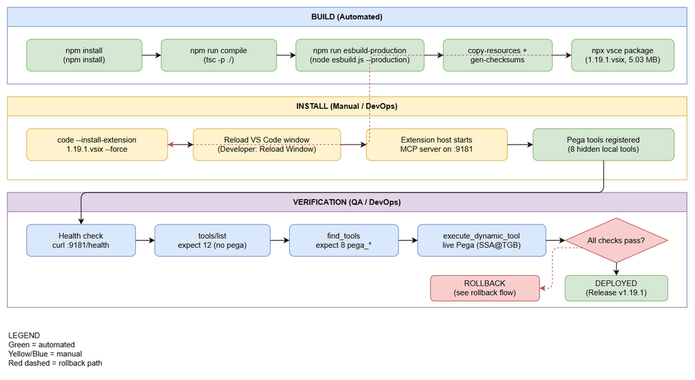
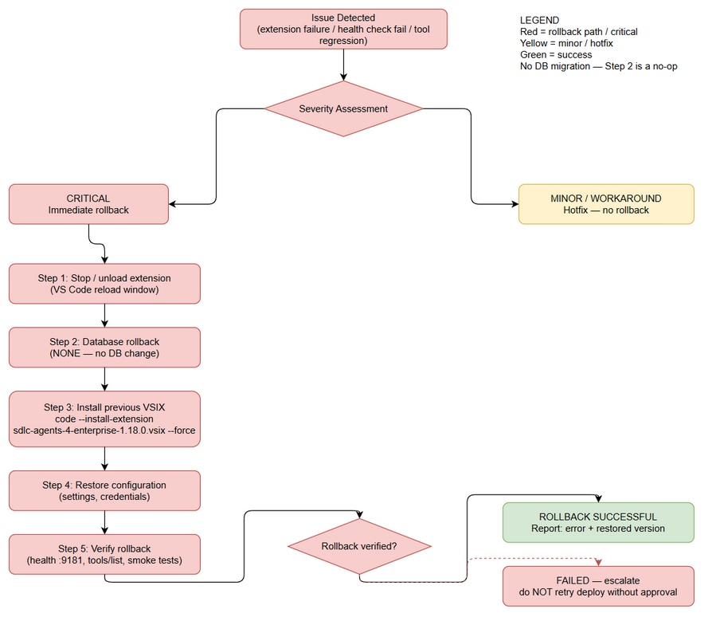

# Deployment Guide (DPG)

## SDLC Agents 4 Enterprise — SA4E-82: [Pega MCP] Register 8 Pega tools as hidden local tools (find_tools/execute_dynamic_tool)

---

## Document Information

| Field | Value |
|-------|-------|
| Jira Ticket | SA4E-82 |
| Title | [Pega MCP] Register 8 Pega tools as hidden local tools (find_tools/execute_dynamic_tool) |
| Author | DevOps Agent |
| Version | 1.0 |
| Date | 2026-07-31 |
| Status | Approved (backfill) |
| Related TDD | TDD-v1-SA4E-82.docx |

---

## Revision History

| Version | Date | Author | Changes |
|---------|------|--------|---------|
| 1.0 | 2026-07-31 | DevOps Agent | Backfill DPG — documents deployment of a change already implemented, packaged (v1.19.1) and verified. Auto-generated from FSD and verified project context. |

---

## Sign-Off

| Name | Role | Signature and date |
|------|------|--------------------|
| | Dev Lead | ☐ Approved for deployment |
| | QA Lead | ☑ Testing completed (589 tests passed, live Pega verification OK) |
| | Ops Lead | ☑ Infrastructure ready |

---

## 1. Overview

### 1.1 Feature Summary

SA4E-82 registers the **8 Pega MCP tools** (`pega_get_session_context`, `pega_get_rule`, `pega_query_rule`, `pega_list_rules`, `pega_save_rule`, `pega_checkout_rule`, `pega_run_tests`, `pega_create_branch`) as **hidden local tools** in the SDLC Agents 4 Enterprise VS Code extension.

Hidden local tools:
- **Execute locally** — the extension host handles the call directly via the local tool registry (no backend round-trip).
- **Discoverable via `find_tools`** — the LLM can discover them through the backend's `find_tools` MCP method (local definitions are merged into the backend result).
- **Hidden from `tools/list`** — the default tool list stays clean; `pega_*` tools are omitted (they surface only via `find_tools` + `execute_dynamic_tool`, or direct `tools/call`).

This is a **VS Code extension-only change** shipped as VSIX package version **1.19.1**. Backend implementation of `find_tools` / `execute_dynamic_tool` pre-dates this ticket and is unchanged. Pega credentials are read from VS Code `SecretStorage` — never passed as tool arguments.

### 1.2 Deployment Scope

| Item | Type | Description |
|------|------|-------------|
| VS Code extension `sdlc-agents-4-enterprise-1.19.1.vsix` | Modified/Repackaged | Local tool registry refactor + 8 hidden Pega tools registered at startup |
| `extension/src/backend-local-tools.ts` | Modified | Dynamic OCP-compliant registry: `registerLocalTool`, `isLocalTool`, `getLocalToolDefinitions`, `getVisibleLocalToolDefinitions`, `LocalToolDefinition.hidden` |
| `extension/src/mcp/pega-local-tools.ts` | New | Maps the 8 `PegaMcpTools` operations to local tool definitions with `hidden: true` |
| `extension/src/services/WrapperServer.ts` | Modified | `routeToolCall` local-first dispatch; `find_tools` merge; `execute_dynamic_tool` local branch |
| `extension/src/remote-backend-client.ts` | Modified | Merges visible local defs into `tools/list`; registers Pega tools when `SecretStorage` is provided |
| `extension/src/extension.ts` | Modified | Passes `context.secrets` into `McpServerManager` constructor (line ~145) |
| Database | None | No schema change — no database migration required |
| Backend services | None | Unchanged — `find_tools` / `execute_dynamic_tool` core tools pre-date this ticket |

### 1.3 Target Environments

| Environment | URL | Deploy Order | Approval Required |
|-------------|-----|-------------|-------------------|
| DEV | VS Code extension host (local workstation) | 1st | No |
| SIT | VS Code extension host (local workstation) | 2nd | No |
| UAT | VS Code extension host (local workstation) | 3rd | QA Sign-off |
| PROD | VS Code extension host (user workstations) | 4th | PM + Business Sign-off |

> **Note:** This is an extension delivered as a VSIX. "Environment" here maps to the distribution waves of the VSIX to developer/QA workstations, not to a centralized server deployment.

---

## 2. Prerequisites

### 2.1 Infrastructure

| Requirement | Status | Notes |
|-------------|--------|-------|
| VS Code >= 1.85.0 | Ready | Extension host required to run the extension |
| Node.js >= 18.14.1 | Ready | Required to build the VSIX (compile/esbuild/vsce) |
| npm >= 9.x | Ready | Package manager for build & test |
| Remote backend server (REST :48721) | Ready | Provides core tools `find_tools` / `execute_dynamic_tool` and `/api/tools` |
| Pega Platform REST endpoint (reachable) | Ready | `kiroSdlc.pegaEndpoint` — e.g. `http://localhost:8080/prweb`; operator `SSA@TGB`, app `HRAppsV2` verified live |
| OS keychain / SecretStorage | Ready | VS Code SecretStorage requires OS-level keychain for Pega credentials |
| MCP wrapper port 9181 free | Ready | Local in-process HTTP server (`kiroSdlc.mcpServerPort`) |

### 2.2 Software Dependencies

| Dependency | Version | Status |
|-----------|---------|--------|
| Node.js | >= 18.14.1 | Installed |
| npm | >= 9.x | Installed |
| VS Code | >= 1.85.0 | Installed |
| @vscode/vsce | ^2.24.0 (devDep) | Installed for packaging |
| esbuild | ^0.21.0 (devDep) | Installed for bundling |
| TypeScript | ^5.4.0 (devDep) | Installed for compile |
| vitest | ^4.1.8 (devDep) | Installed for tests |

### 2.3 Access Requirements

| Access | Type | Who Needs It |
|--------|------|-------------|
| Pega Platform (operator SSA@TGB, app HRAppsV2) | Basic Auth via SecretStorage | Developer (extension host) |
| Remote backend :48721 | API token / auth headers | Extension host |
| npm registry | Read | Build pipeline |
| GitHub releases / local artifact store | Read | VSIX download/install |

### 2.4 Backup Requirements

- [ ] Previous `.vsix` extension artifact saved (e.g. `extension/sdlc-agents-4-enterprise-1.18.0.vsix`)
- [ ] Configuration backup (VS Code settings for `kiroSdlc.*`, Pega credentials)
- [ ] No database — backup of the backend database NOT required for this change

---

## 3. Pre-Deployment Checklist

| # | Item | Responsible | Status |
|---|------|-------------|--------|
| 1 | Code merged to release branch (v1.19.1) | Developer | ☑ |
| 2 | All unit tests passed (589 tests) | Developer | ☑ |
| 3 | Live verification passed (Pega operator SSA@TGB, app HRAppsV2) | Developer | ☑ |
| 4 | VSIX package built (`sdlc-agents-4-enterprise-1.19.1.vsix`, 5.03 MB, 979 files) | DevOps | ☑ |
| 5 | Database backup completed | N/A | ☑ (no DB change) |
| 6 | Configuration files prepared (Pega endpoint/credentials in SecretStorage) | Developer | ☑ |
| 7 | Feature flags configured | Developer | ☐ N/A (no feature flags) |
| 8 | Monitoring/alerting configured (extension output logs) | DevOps | ☑ |
| 9 | Rollback plan reviewed (reinstall previous VSIX) | Team | ☑ |
| 10 | Deployment window confirmed | PM | ☐ |

---

## 4. Database Migration

### 4.1 Migration Scripts

| Order | Script | Description | Estimated Time |
|-------|--------|-------------|----------------|
| — | None | No database migration required for SA4E-82 | N/A |

### 4.2 Execution Steps

```bash
# No database migration steps required for this release.
echo "No DB migration — extension-only change."
```

### 4.3 Verification Queries

```sql
-- No database verification required.
```

### 4.4 Rollback Scripts

```sql
-- No database rollback required.
```

---

## 5. Application Deployment

### 5.1 Deployment Flow



*[Edit in draw.io](diagrams/deployment-flow.drawio)*

### 5.2 Deployment Steps

The deployment is a **VS Code extension install** via VSIX. Build steps apply to DevOps/CI; install steps apply to each target workstation.

| Step | Action | Command | Verification |
|------|--------|---------|-------------|
| 1 | Install npm dependencies | `cd extension && npm install` | `node_modules` present, no install errors |
| 2 | Compile TypeScript | `npm run compile` | `tsc` exits 0, `out/` produced |
| 3 | Bundle with esbuild | `npm run esbuild-production` | `dist/extension.js` produced, bundle size sane |
| 4 | Copy resources + generate checksums | `npm run copy-resources && npm run gen-checksums` | Exit 0, resources present in `dist/` |
| 5 | Package VSIX | `npx vsce package --no-dependencies` | `sdlc-agents-4-enterprise-1.19.1.vsix` created (5.03 MB) |
| 6 | Install VSIX into VS Code | `code --install-extension sdlc-agents-4-enterprise-1.19.1.vsix --force` | VS Code reports extension installed v1.19.1 |
| 7 | Reload VS Code window | `Developer: Reload Window` (command palette) | Extension host restarts; extension activated |
| 8 | Verify MCP wrapper server | `curl http://127.0.0.1:9181/health` (or check Output channel) | Server on port 9181 responds |
| 9 | Run verification checklist (§7) | — | All §7 checks pass |

### 5.3 Install Command Reference

```bash
# From repo root — the packaged artifact already exists:
cd extension
code --install-extension sdlc-agents-4-enterprise-1.19.1.vsix --force
```

> **Note:** The packaged artifact `extension/sdlc-agents-4-enterprise-1.19.1.vsix` (5,269,301 bytes, 979 files) is already committed. Steps 1–5 are required only when rebuilding from source.

---

## 6. Configuration Changes

### 6.1 New Environment Variables

| Variable | Description | DEV | SIT | UAT | PROD |
|----------|-------------|-----|-----|-----|------|
| (none) | No new OS environment variables | — | — | — | — |

### 6.2 Application Properties Changes

| Property | Old Value | New Value | File |
|----------|-----------|-----------|------|
| `kiroSdlc.pegaEndpoint` | (existing) | Pega REST endpoint, e.g. `http://localhost:8080/prweb` | VS Code settings |
| `kiroSdlc.pegaUsername` | (existing) | Pega operator ID, e.g. `SSA@TGB` | VS Code settings |
| `kiroSdlc.pegaDeveloperShortName` | (existing) | Branch naming short name | VS Code settings |
| Pega credentials (password/token) | — | Stored in VS Code SecretStorage — passed via `context.secrets`, never as tool arguments | SecretStorage |

> **No new settings were introduced by SA4E-82.** Existing `kiroSdlc.*` Pega settings are consumed by `PegaMcpTools`. The key change is that credentials now flow through `SecretStorage` (new wiring `extension.ts` → `McpServerManager` → `RemoteBackendClient` → `PegaMcpTools`).

### 6.3 Feature Flags

| Flag | DEV | SIT | UAT | PROD |
|------|-----|-----|-----|------|
| (none) | — | — | — | — |

> No feature flags used. Pega tools register automatically when `SecretStorage` is available.

---

## 7. Post-Deployment Verification

### 7.1 Health Checks

| Check | Endpoint/Command | Expected Result | Timeout |
|-------|-----------------|-----------------|---------|
| MCP wrapper server up | `curl http://127.0.0.1:9181/health` | HTTP 200 / server responds | 10s |
| Extension activated | VS Code Output channel (SDLC Agents) | No `ERROR`/`FATAL` at startup | 60s |
| Backend reachable | `curl http://127.0.0.1:48721/health` | HTTP 200 | 10s |

### 7.2 Smoke Tests

| # | Scenario | Steps | Expected Result |
|---|----------|-------|-----------------|
| 1 | `tools/list` count | Send MCP JSON-RPC `tools/list` to `:9181/mcp` | **12 tools** — no `pega_*` entries (hidden) |
| 2 | `find_tools` discovers Pega tools | Send `tools/call { name: "find_tools", arguments: {} }` | Returns **8 `pega_*`** tool definitions (merged with local defs) |
| 3 | `execute_dynamic_tool` live Pega call | `tools/call { name: "execute_dynamic_tool", arguments: { tool_name: "pega_get_session_context", arguments: {} } }` | `{ success: true, context }` — live against Pega (operator SSA@TGB, app HRAppsV2) |
| 4 | Direct `tools/call pega_*` | `tools/call { name: "pega_list_rules", arguments: { pxObjClass: "Rule-Obj-Activity" } }` | `{ success: true, data }` returned locally |

### 7.3 Log Verification

| Log Entry | Level | Expected | Location |
|-----------|-------|----------|----------|
| `[RemoteBackendClient] Pega tools registration failed:` | WARN | NOT present (or present = registration skipped gracefully) | VS Code Output channel |
| Pega tools registered | INFO/DEBUG | 8 `pega_*` tools registered | VS Code Output channel |
| No `ERROR`/`FATAL` entries | — | Zero unexpected errors during smoke tests | VS Code Output channel |

### 7.4 Monitoring Dashboard

- [ ] MCP wrapper server (port 9181) responds to health check
- [ ] `tools/list` count is 12 (not 20 — hidden tools correctly excluded)
- [ ] `find_tools` returns the 8 Pega tools
- [ ] Live `execute_dynamic_tool` call succeeds against Pega
- [ ] No unexpected error logs in extension output

---

## 8. Rollback Plan

### 8.1 Rollback Flow



*[Edit in draw.io](diagrams/rollback-flow.drawio)*

### 8.2 Rollback Decision Criteria

| Condition | Action |
|-----------|--------|
| Extension fails to activate after install | Immediate rollback |
| MCP wrapper server does not start on port 9181 | Immediate rollback |
| `tools/list` shows > 12 tools (hidden flag regression) | Immediate rollback |
| `find_tools` missing the 8 `pega_*` tools | Immediate rollback |
| Live `execute_dynamic_tool` Pega call fails with unexpected errors | Investigate; rollback if Pega ops broken |
| Backend health degraded (unrelated regression suspected) | Triage — do not rollback blindly |

### 8.3 Rollback Steps

| Step | Action | Command | Verification |
|------|--------|---------|-------------|
| 1 | Install previous VSIX version | `code --install-extension sdlc-agents-4-enterprise-{prev}.vsix --force` | VS Code reports previous version installed |
| 2 | Reload VS Code window | `Developer: Reload Window` | Extension host restarts cleanly |
| 3 | Verify MCP server | `curl http://127.0.0.1:9181/health` | Server responds |
| 4 | Verify `tools/list` count | MCP `tools/list` | Back to pre-SA4E-82 count; `find_tools`/`execute_dynamic_tool` for pega tools invisible until SA4E-56 wiring — no breaking change |
| 5 | Smoke test | Repeat §7.2 | All pass against previous version |

> **Rollback artifact:** The previous packaged VSIX is preserved in `extension/`. The last available pre-1.19.1 artifact in-repo is `sdlc-agents-4-enterprise-1.18.0.vsix`. Rollback restores the prior behavior: `find_tools`/`execute_dynamic_tool` for Pega tools revert to invisible until the SA4E-56 wiring lands — there is **no breaking change** to `tools/list`.

### 8.4 Rollback Time Estimate

| Action | Estimated Time |
|--------|---------------|
| Database rollback | 0 min (no DB) |
| Application rollback (reinstall VSIX + reload) | 3 minutes |
| Verification (health + smoke tests) | 5 minutes |
| **Total** | **8 minutes** |

---

## 9. Environment-Specific Notes

### 9.1 DEV

- Local install: `code --install-extension sdlc-agents-4-enterprise-1.19.1.vsix --force` + reload.
- Live Pega verification baseline: operator `SSA@TGB`, app `HRAppsV2`.

### 9.2 SIT

- Same VSIX; ensure `kiroSdlc.pegaEndpoint` points at the SIT Pega instance.
- Verify SecretStorage credentials are set for the SIT operator.

### 9.3 UAT

- Requires QA sign-off on §7.2 smoke tests.
- Confirm UAT backend (port 48721) exposes `find_tools` / `execute_dynamic_tool`.

### 9.4 PROD

- **Deployment Window:** Regular maintenance window, outside business hours
- **Approval Required From:** PM + Business Sign-off
- **Communication Plan:** Notify developers to reload VS Code after the VSIX is published; announce in project channel before/after
- **On-Call Contact:** DevOps Agent (project channel)

---

## 10. Appendix

### Contacts

| Role | Name | Contact |
|------|------|---------|
| DevOps Lead | DevOps Agent | Project channel |
| Dev Lead | DEV Agent | Project channel |
| QA Lead | QA Agent | Project channel |
| Release Manager | SM Agent | Project channel |

### Related Tickets

| Ticket | Summary | Relationship |
|--------|---------|-------------|
| SA4E-82 | [Pega MCP] Register 8 Pega tools as hidden local tools (find_tools/execute_dynamic_tool) | Main ticket |
| SA4E-56 | Unified Code & Pega Rule Indexing Pipeline | Backend wiring for find_tools/execute_dynamic_tool; Pega tools visible only after this wiring |
| SA4E-58 | (Pega branch naming convention referenced) | Context for `kiroSdlc.pegaDeveloperShortName` |

---

*End of Deployment Guide — SA4E-82 v1.19.1*

