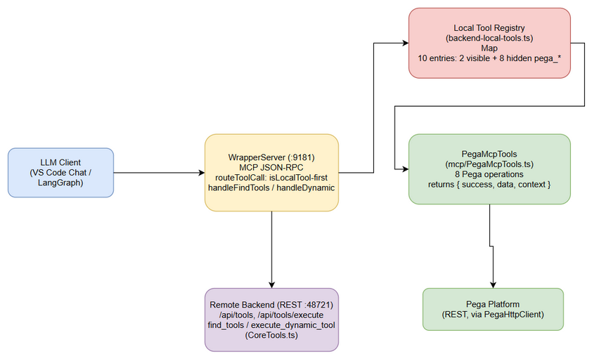
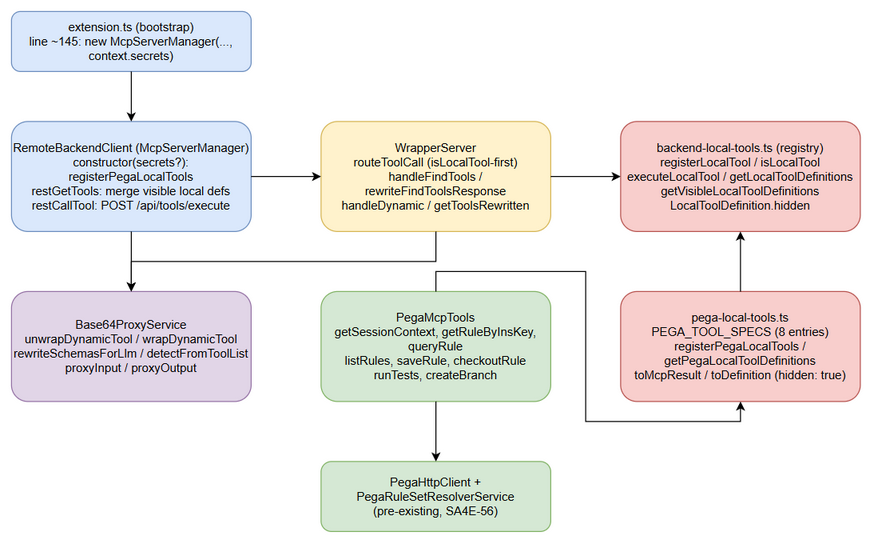
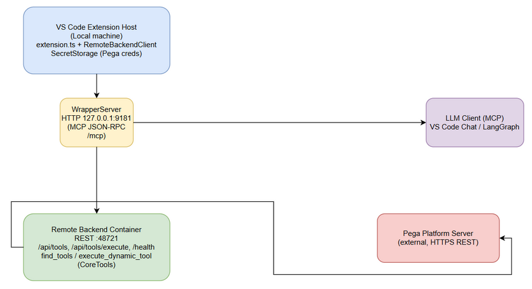
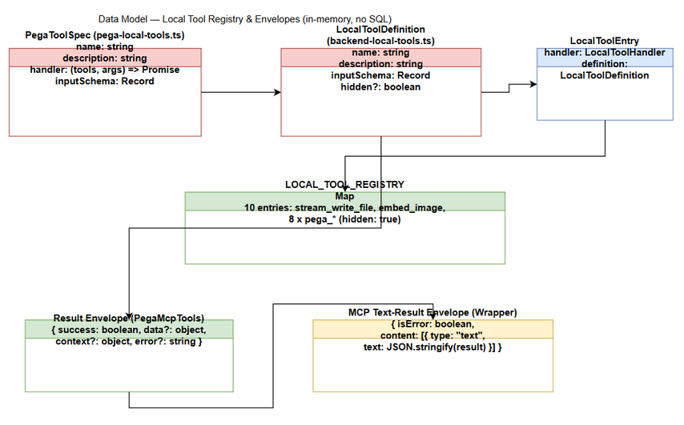
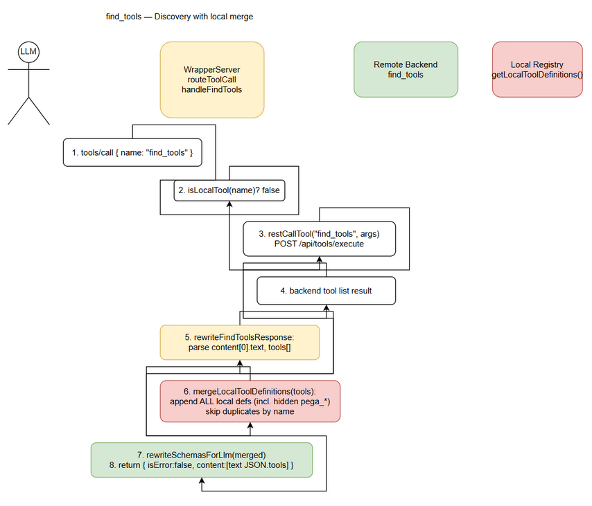
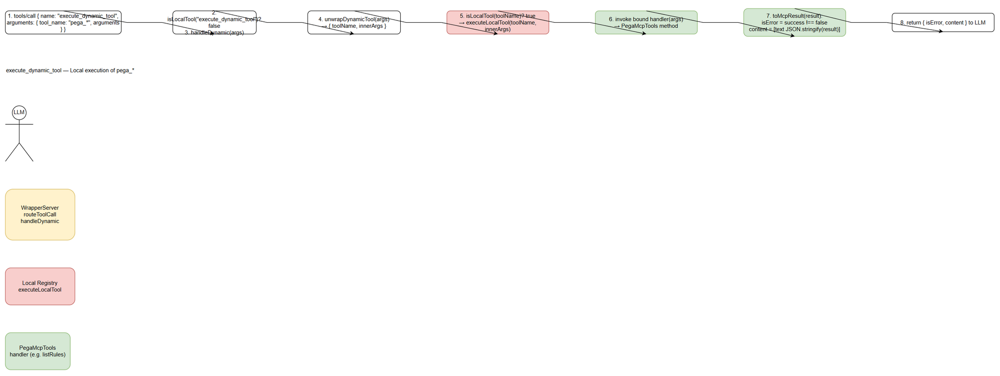
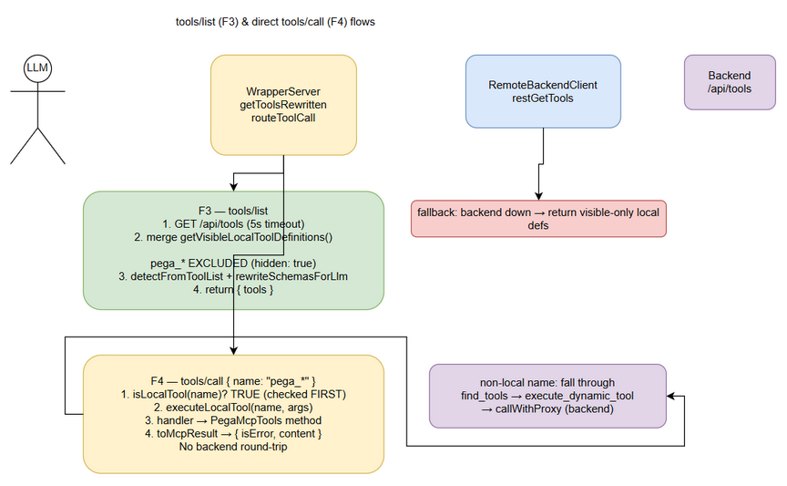

# Technical Design Document (TDD)

## SDLC Agents 4 Enterprise — SA4E-82: [Pega MCP] Register 8 Pega tools as hidden local tools (find_tools/execute_dynamic_tool)

---

## Document Information

| Field | Value |
|-------|-------|
| Jira Ticket | SA4E-82 |
| Title | [Pega MCP] Register 8 Pega tools as hidden local tools (find_tools/execute_dynamic_tool) |
| Author | SA Agent |
| Version | 1.0 |
| Date | 2026-07-31 |
| Status | Approved (backfill) |
| Related BRD | BRD-v1.0-SA4E-82.docx |
| Related FSD | FSD-v1.0-SA4E-82.docx |

---

## Author Tracking

| Role | Name - Position | Responsibility |
|------|-----------------|----------------|
| Author | SA Agent – Solution Architect | Create document |
| Peer Reviewer | DEV Agent – Developer | Review document |

---

## Revision History

| Version | Date | Author | Changes |
|---------|------|--------|---------|
| 1.0 | 2026-07-31 | SA Agent | Initiate document — backfill TDD from BRD, FSD and verified implementation in `extension/src/` |

---

## Sign-Off

| Name | Signature and date |
|------|--------------------|
| | ☐ I agree and confirm the technical design in this TDD |
| | ☐ I agree and confirm the technical design in this TDD |

---

## 1. Introduction

> **Scope Boundary:** This TDD specifies HOW the requirements defined in the FSD are implemented. It does NOT repeat functional requirements, business rules, use cases, or UI specifications — refer to the FSD for those. This document focuses on: technology choices, architecture decisions, implementation patterns, and deployment concerns, all verified against the actual source code.

### 1.1 Purpose

This TDD documents the technical design of registering eight (8) Pega MCP tools as **hidden local tools** in the SDLC Agents 4 Enterprise VS Code extension. The design enables:

- **Local execution** — Pega tool calls are handled inside the extension host via the local tool registry, with no backend round-trip.
- **On-demand discovery** — the tools are merged into `find_tools` responses so the LLM can discover them.
- **Hidden visibility** — the tools are excluded from `tools/list` to keep the default LLM tool list clean; they remain callable by name.

This is a **backfill** document: the implementation was completed and verified before this TDD was written. All technical details below were verified against the actual source files referenced in §1.6.

### 1.2 Scope

**In scope (technical):**

- Dynamic local tool registry (`extension/src/backend-local-tools.ts`) — `Map<string, LocalToolEntry>` with OCP-compliant registration API.
- Hidden-tool visibility model — `LocalToolDefinition.hidden` and `getVisibleLocalToolDefinitions()` filtering.
- Pega tool registration module (`extension/src/mcp/pega-local-tools.ts`) — 8 tool specs, `toMcpResult` envelope, idempotent registration.
- `WrapperServer` routing — `routeToolCall` local-first dispatch, `handleFindTools` merge (`mergeLocalToolDefinitions`), `handleDynamic` local routing, `getToolsRewritten`/`restGetTools` visible-only merge.
- Secret injection chain — `extension.ts` → `McpServerManager` (= `RemoteBackendClient`) → `PegaMcpTools` → `PegaHttpClient` via VS Code `SecretStorage`.
- Tool result envelopes — `{ isError, content: [{ type: "text", text }] }` wrapper around `{ success, data, context }`.

**Out of scope:** Pega integration services (`PegaHttpClient`, `PegaRuleSetResolverService`), backend `find_tools`/`execute_dynamic_tool` (backend `CoreTools.ts`), and any user-facing UI.

### 1.3 Technology Stack

| Layer | Technology | Version |
|-------|-----------|---------|
| Language | TypeScript (extension host) | ^5.4.0 |
| Runtime | VS Code Extension Host (Node.js) | VS Code ^1.85.0, @types/node ^20 |
| Framework | MCP (Model Context Protocol) via WrapperServer HTTP | protocol 2025-06-18 / 2025-03-26 / 2024-11-05 |
| HTTP Server | Node `http` module (WrapperServer, port 9181) | built-in |
| Secret Storage | VS Code `SecretStorage` API | ^1.85.0 |
| Build Tool | esbuild / tsc (VS Code extension) | — |
| Extension Version | sdlc-agents-4-enterprise | 1.19.1 (package.json) |
| Test Framework | Jest | — |

### 1.4 Design Principles

- **SOLID — OCP (Open/Closed Principle):** New local tools are added via `registerLocalTool(name, handler, definition)` — routing code (`routeToolCall`, `executeLocalTool`) is never modified. Verified: `registerPegaLocalTools` registers 8 tools without touching `WrapperServer` routing.
- **SRP (Single Responsibility Principle):** `backend-local-tools.ts` handles only local tool execution + definitions; base64 proxy logic is in `services/Base64ProxyService.ts`.
- **DRY:** Result envelope shape (`{ isError, content }`) is produced once by `toMcpResult` and reused by all 8 Pega handlers.
- **Fail-soft:** Registration failure and backend listing failure degrade gracefully (warn + continue); Pega handler errors are captured as result envelopes, never propagated as exceptions.
- **Security by design:** Pega credentials live only in VS Code `SecretStorage`; they are never passed as tool arguments and never logged.

### 1.5 Constraints

| ID | Constraint | Compliance |
|----|-----------|------------|
| C-1 | Max 200 lines per file | `backend-local-tools.ts` = 185 lines; `pega-local-tools.ts` = 171 lines; `remote-backend-client.ts` = 169 lines; `WrapperServer.ts` = 270 lines (pre-existing) — all new files satisfy the limit |
| C-2 | Max 20 lines per function | All new functions (e.g. `toMcpResult`, `toDefinition`, `mergeLocalToolDefinitions`, `getVisibleLocalToolDefinitions`) are ≤ 20 lines |
| C-3 | SOLID compliance | OCP registry + SRP separation verified in §1.4 |
| C-4 | Diagrams use draw.io only (no Mermaid) | All diagrams in this document are embedded draw.io XML + exported PNG |
| C-5 | Backfill accuracy — no invented details | Every design statement in this TDD was verified against `extension/src/` source |

### 1.6 References

| Document | Location |
|----------|----------|
| BRD | documents/SA4E-82/BRD.md |
| FSD | documents/SA4E-82/FSD.md |
| Local tool registry | extension/src/backend-local-tools.ts |
| Pega tool registration | extension/src/mcp/pega-local-tools.ts |
| MCP wrapper server | extension/src/services/WrapperServer.ts |
| Remote backend client | extension/src/remote-backend-client.ts |
| Extension bootstrap | extension/src/extension.ts (line ~145) |
| Pega operations | extension/src/mcp/PegaMcpTools.ts |
| Unit tests | extension/src/__tests__/pega-local-tools.test.ts, backend-local-tools.test.ts, wrapper-server.test.ts |

---

## 2. System Architecture

### 2.1 Architecture Overview

The extension runs a local HTTP `WrapperServer` on `127.0.0.1:9181` that bridges MCP JSON-RPC requests from the LLM client to the remote backend REST API (`:48721`). For SA4E-82, a **local tool registry** (`backend-local-tools.ts`) was introduced: tools whose handlers run inside the extension host are stored in a `Map<string, LocalToolEntry>` where each entry couples a `handler` function with a public `LocalToolDefinition`. Eight Pega tools (`pega_*`) are registered with `hidden: true`, making them discoverable via `find_tools` and executable locally, but omitted from `tools/list`.

`routeToolCall` performs **local-first dispatch**: `isLocalTool(name)` is evaluated before `find_tools`, `execute_dynamic_tool`, or backend forwarding. This guarantees both direct `tools/call pega_*` and dynamic invocation route to the local registry.



*[Edit in draw.io](diagrams/architecture.drawio)*

```xml
<mxfile host="app.diagrams.net">
  <diagram name="Architecture — Hidden Pega Local Tools" id="sa4e82-tdd-arch">
    <mxGraphModel dx="900" dy="600" grid="1" gridSize="10" guides="1" tooltips="1" connect="1" arrows="1" fold="1" page="1" pageScale="1" pageWidth="900" pageHeight="640" math="0" shadow="0">
      <root>
        <mxCell id="0" />
        <mxCell id="1" parent="0" />
        <mxCell id="llm" value="LLM Client&#10;(VS Code Chat / LangGraph)" style="rounded=1;whiteSpace=wrap;html=1;fillColor=#dae8fc;strokeColor=#6c8ebf;" vertex="1" parent="1">
          <mxGeometry x="30" y="240" width="150" height="70" as="geometry" />
        </mxCell>
        <mxCell id="wrapper" value="WrapperServer (:9181)&#10;MCP JSON-RPC&#10;routeToolCall: isLocalTool-first&#10;handleFindTools / handleDynamic" style="rounded=1;whiteSpace=wrap;html=1;fillColor=#fff2cc;strokeColor=#d6b656;" vertex="1" parent="1">
          <mxGeometry x="310" y="220" width="190" height="110" as="geometry" />
        </mxCell>
        <mxCell id="registry" value="Local Tool Registry&#10;(backend-local-tools.ts)&#10;Map&lt;name,{handler,definition}&gt;&#10;10 entries: 2 visible + 8 hidden pega_*" style="rounded=1;whiteSpace=wrap;html=1;fillColor=#f8cecc;strokeColor=#b85450;" vertex="1" parent="1">
          <mxGeometry x="600" y="40" width="230" height="100" as="geometry" />
        </mxCell>
        <mxCell id="pega" value="PegaMcpTools&#10;(mcp/PegaMcpTools.ts)&#10;8 Pega operations&#10;returns { success, data, context }" style="rounded=1;whiteSpace=wrap;html=1;fillColor=#d5e8d4;strokeColor=#82b366;" vertex="1" parent="1">
          <mxGeometry x="600" y="220" width="230" height="100" as="geometry" />
        </mxCell>
        <mxCell id="pegaSrv" value="Pega Platform&#10;(REST, via PegaHttpClient)" style="rounded=1;whiteSpace=wrap;html=1;fillColor=#d5e8d4;strokeColor=#82b366;" vertex="1" parent="1">
          <mxGeometry x="620" y="440" width="200" height="60" as="geometry" />
        </mxCell>
        <mxCell id="backend" value="Remote Backend (REST :48721)&#10;/api/tools, /api/tools/execute&#10;find_tools / execute_dynamic_tool&#10;(CoreTools.ts)" style="rounded=1;whiteSpace=wrap;html=1;fillColor=#e1d5e7;strokeColor=#9673a6;" vertex="1" parent="1">
          <mxGeometry x="310" y="440" width="190" height="90" as="geometry" />
        </mxCell>
        <mxCell id="e1" style="edgeStyle=orthogonalEdgeStyle;rounded=0;orthogonalLoop=1;jettySize=auto;exitX=1;exitY=0.5;exitDx=0;exitDy=0;entryX=0;entryY=0.5;entryDx=0;entryDy=0;" edge="1" parent="1" source="llm" target="wrapper">
          <mxGeometry relative="1" as="geometry" />
        </mxCell>
        <mxCell id="e2" style="edgeStyle=orthogonalEdgeStyle;rounded=0;orthogonalLoop=1;jettySize=auto;exitX=1;exitY=0.5;exitDx=0;exitDy=0;entryX=0;entryY=0.5;entryDx=0;entryDy=0;" edge="1" parent="1" source="wrapper" target="registry">
          <mxGeometry relative="1" as="geometry" />
        </mxCell>
        <mxCell id="e3" style="edgeStyle=orthogonalEdgeStyle;rounded=0;orthogonalLoop=1;jettySize=auto;exitX=1;exitY=0.5;exitDx=0;exitDy=0;entryX=0;entryY=0.5;entryDx=0;entryDy=0;" edge="1" parent="1" source="registry" target="pega">
          <mxGeometry relative="1" as="geometry" />
        </mxCell>
        <mxCell id="e4" style="edgeStyle=orthogonalEdgeStyle;rounded=0;orthogonalLoop=1;jettySize=auto;exitX=0.5;exitY=1;exitDx=0;exitDy=0;entryX=0.5;entryY=0;entryDx=0;entryDy=0;" edge="1" parent="1" source="pega" target="pegaSrv">
          <mxGeometry relative="1" as="geometry" />
        </mxCell>
        <mxCell id="e5" style="edgeStyle=orthogonalEdgeStyle;rounded=0;orthogonalLoop=1;jettySize=auto;exitX=0.5;exitY=1;exitDx=0;exitDy=0;entryX=0.5;entryY=0;entryDx=0;entryDy=0;" edge="1" parent="1" source="wrapper" target="backend">
          <mxGeometry relative="1" as="geometry" />
        </mxCell>
      </root>
    </mxGraphModel>
  </diagram>
</mxfile>
```

### 2.2 Component Diagram



*[Edit in draw.io](diagrams/component.drawio)*

| Component | Responsibility | Technology |
|-----------|---------------|------------|
| `extension.ts` | Bootstrap; passes `context.secrets` into `McpServerManager` (line ~145) | TypeScript |
| `RemoteBackendClient` (a.k.a. `McpServerManager`) | Constructor registers Pega local tools when `secrets` provided; `restGetTools` merges visible local defs; `restCallTool` forwards to backend `/api/tools/execute` | TypeScript |
| `WrapperServer` | MCP JSON-RPC front door; `routeToolCall` local-first dispatch; `handleFindTools` merge; `handleDynamic` local routing; `getToolsRewritten` | Node `http` |
| `backend-local-tools.ts` | Local tool registry — `Map<string, LocalToolEntry>`; `registerLocalTool`, `isLocalTool`, `executeLocalTool`, `getLocalToolDefinitions`, `getVisibleLocalToolDefinitions` | TypeScript |
| `pega-local-tools.ts` | Maps 8 `PegaMcpTools` operations to local tool definitions with `hidden: true`; `registerPegaLocalTools`, `getPegaLocalToolDefinitions` | TypeScript |
| `PegaMcpTools` | Pega operation facade — 8 methods returning `{ success, data, context }` | TypeScript |
| `Base64ProxyService` | Base64 schema rewrite (`rewriteSchemasForLlm`, `detectFromToolList`) and dynamic tool unwrap/wrap (`unwrapDynamicTool`, `wrapDynamicTool`) | TypeScript |
| Remote Backend | Provides core tools `find_tools` / `execute_dynamic_tool` (`backend/src/config/CoreTools.ts`) | Kotlin/backend |

```xml
<mxfile host="app.diagrams.net">
  <diagram name="Components — Hidden Pega Local Tools" id="sa4e82-tdd-comp">
    <mxGraphModel dx="1000" dy="650" grid="1" gridSize="10" guides="1" tooltips="1" connect="1" arrows="1" fold="1" page="1" pageScale="1" pageWidth="1000" pageHeight="700" math="0" shadow="0">
      <root>
        <mxCell id="0" />
        <mxCell id="1" parent="0" />
        <mxCell id="ext" value="extension.ts (bootstrap)&#10;line ~145: new McpServerManager(..., context.secrets)" style="rounded=1;whiteSpace=wrap;html=1;fillColor=#dae8fc;strokeColor=#6c8ebf;" vertex="1" parent="1">
          <mxGeometry x="20" y="20" width="240" height="60" as="geometry" />
        </mxCell>
        <mxCell id="rbc" value="RemoteBackendClient (McpServerManager)&#10;constructor(secrets?): registerPegaLocalTools&#10;restGetTools: merge visible local defs&#10;restCallTool: POST /api/tools/execute" style="rounded=1;whiteSpace=wrap;html=1;fillColor=#dae8fc;strokeColor=#6c8ebf;" vertex="1" parent="1">
          <mxGeometry x="20" y="130" width="240" height="110" as="geometry" />
        </mxCell>
        <mxCell id="ws" value="WrapperServer&#10;routeToolCall (isLocalTool-first)&#10;handleFindTools / rewriteFindToolsResponse&#10;handleDynamic / getToolsRewritten" style="rounded=1;whiteSpace=wrap;html=1;fillColor=#fff2cc;strokeColor=#d6b656;" vertex="1" parent="1">
          <mxGeometry x="330" y="130" width="230" height="110" as="geometry" />
        </mxCell>
        <mxCell id="blt" value="backend-local-tools.ts (registry)&#10;registerLocalTool / isLocalTool&#10;executeLocalTool / getLocalToolDefinitions&#10;getVisibleLocalToolDefinitions&#10;LocalToolDefinition.hidden" style="rounded=1;whiteSpace=wrap;html=1;fillColor=#f8cecc;strokeColor=#b85450;" vertex="1" parent="1">
          <mxGeometry x="630" y="130" width="240" height="110" as="geometry" />
        </mxCell>
        <mxCell id="plt" value="pega-local-tools.ts&#10;PEGA_TOOL_SPECS (8 entries)&#10;registerPegaLocalTools / getPegaLocalToolDefinitions&#10;toMcpResult / toDefinition (hidden: true)" style="rounded=1;whiteSpace=wrap;html=1;fillColor=#f8cecc;strokeColor=#b85450;" vertex="1" parent="1">
          <mxGeometry x="630" y="300" width="240" height="110" as="geometry" />
        </mxCell>
        <mxCell id="pmt" value="PegaMcpTools&#10;getSessionContext, getRuleByInsKey, queryRule&#10;listRules, saveRule, checkoutRule&#10;runTests, createBranch" style="rounded=1;whiteSpace=wrap;html=1;fillColor=#d5e8d4;strokeColor=#82b366;" vertex="1" parent="1">
          <mxGeometry x="330" y="300" width="230" height="110" as="geometry" />
        </mxCell>
        <mxCell id="b64" value="Base64ProxyService&#10;unwrapDynamicTool / wrapDynamicTool&#10;rewriteSchemasForLlm / detectFromToolList&#10;proxyInput / proxyOutput" style="rounded=1;whiteSpace=wrap;html=1;fillColor=#e1d5e7;strokeColor=#9673a6;" vertex="1" parent="1">
          <mxGeometry x="20" y="300" width="240" height="110" as="geometry" />
        </mxCell>
        <mxCell id="svc" value="PegaHttpClient +&#10;PegaRuleSetResolverService&#10;(pre-existing, SA4E-56)" style="rounded=1;whiteSpace=wrap;html=1;fillColor=#d5e8d4;strokeColor=#82b366;" vertex="1" parent="1">
          <mxGeometry x="330" y="470" width="230" height="70" as="geometry" />
        </mxCell>
        <mxCell id="c1" style="edgeStyle=orthogonalEdgeStyle;rounded=0;orthogonalLoop=1;jettySize=auto;" edge="1" parent="1" source="ext" target="rbc">
          <mxGeometry relative="1" as="geometry" />
        </mxCell>
        <mxCell id="c2" style="edgeStyle=orthogonalEdgeStyle;rounded=0;orthogonalLoop=1;jettySize=auto;" edge="1" parent="1" source="rbc" target="ws">
          <mxGeometry relative="1" as="geometry" />
        </mxCell>
        <mxCell id="c3" style="edgeStyle=orthogonalEdgeStyle;rounded=0;orthogonalLoop=1;jettySize=auto;" edge="1" parent="1" source="ws" target="blt">
          <mxGeometry relative="1" as="geometry" />
        </mxCell>
        <mxCell id="c4" style="edgeStyle=orthogonalEdgeStyle;rounded=0;orthogonalLoop=1;jettySize=auto;exitX=0.5;exitY=0;exitDx=0;exitDy=0;entryX=0.5;entryY=1;entryDx=0;entryDy=0;" edge="1" parent="1" source="plt" target="blt">
          <mxGeometry relative="1" as="geometry" />
        </mxCell>
        <mxCell id="c5" style="edgeStyle=orthogonalEdgeStyle;rounded=0;orthogonalLoop=1;jettySize=auto;exitX=0.5;exitY=0;exitDx=0;exitDy=0;entryX=0.5;entryY=1;entryDx=0;entryDy=0;" edge="1" parent="1" source="pmt" target="plt">
          <mxGeometry relative="1" as="geometry" />
        </mxCell>
        <mxCell id="c6" style="edgeStyle=orthogonalEdgeStyle;rounded=0;orthogonalLoop=1;jettySize=auto;exitX=0.5;exitY=1;exitDx=0;exitDy=0;entryX=0.5;entryY=0;entryDx=0;entryDy=0;" edge="1" parent="1" source="rbc" target="b64">
          <mxGeometry relative="1" as="geometry" />
        </mxCell>
        <mxCell id="c7" style="edgeStyle=orthogonalEdgeStyle;rounded=0;orthogonalLoop=1;jettySize=auto;exitX=0.5;exitY=1;exitDx=0;exitDy=0;entryX=0.5;entryY=0;entryDx=0;entryDy=0;" edge="1" parent="1" source="pmt" target="svc">
          <mxGeometry relative="1" as="geometry" />
        </mxCell>
        <mxCell id="c8" style="edgeStyle=orthogonalEdgeStyle;rounded=0;orthogonalLoop=1;jettySize=auto;exitX=0.5;exitY=1;exitDx=0;exitDy=0;entryX=0.5;entryY=0;entryDx=0;entryDy=0;" edge="1" parent="1" source="ws" target="b64">
          <mxGeometry relative="1" as="geometry" />
        </mxCell>
      </root>
    </mxGraphModel>
  </diagram>
</mxfile>
```

### 2.3 Deployment Architecture



*[Edit in draw.io](diagrams/deployment.drawio)*

The feature runs entirely inside the VS Code extension host on the developer's local machine. No new deployment unit is introduced.

| Node | Runtime | Key Artifacts |
|------|---------|---------------|
| VS Code Extension Host | VS Code ^1.85.0 (Node) | `extension.ts`, `RemoteBackendClient`, `WrapperServer` (127.0.0.1:9181), `backend-local-tools.ts`, `pega-local-tools.ts`, `PegaMcpTools`, `SecretStorage` |
| Remote Backend | Separate process/container | REST `:48721` — `/api/tools`, `/api/tools/execute`, `/health` |
| Pega Platform | External server | HTTPS REST endpoints consumed via `PegaHttpClient` |

```xml
<mxfile host="app.diagrams.net">
  <diagram name="Deployment — Hidden Pega Local Tools" id="sa4e82-tdd-dep">
    <mxGraphModel dx="900" dy="600" grid="1" gridSize="10" guides="1" tooltips="1" connect="1" arrows="1" fold="1" page="1" pageScale="1" pageWidth="900" pageHeight="600" math="0" shadow="0">
      <root>
        <mxCell id="0" />
        <mxCell id="1" parent="0" />
        <mxCell id="vsc" value="VS Code Extension Host&#10;(Local machine)&#10;extension.ts + RemoteBackendClient&#10;SecretStorage (Pega creds)" style="rounded=1;whiteSpace=wrap;html=1;fillColor=#dae8fc;strokeColor=#6c8ebf;" vertex="1" parent="1">
          <mxGeometry x="40" y="40" width="240" height="110" as="geometry" />
        </mxCell>
        <mxCell id="ws" value="WrapperServer&#10;HTTP 127.0.0.1:9181&#10;(MCP JSON-RPC /mcp)" style="rounded=1;whiteSpace=wrap;html=1;fillColor=#fff2cc;strokeColor=#d6b656;" vertex="1" parent="1">
          <mxGeometry x="100" y="190" width="120" height="80" as="geometry" />
        </mxCell>
        <mxCell id="llm" value="LLM Client (MCP)&#10;VS Code Chat / LangGraph" style="rounded=1;whiteSpace=wrap;html=1;fillColor=#e1d5e7;strokeColor=#9673a6;" vertex="1" parent="1">
          <mxGeometry x="700" y="190" width="160" height="80" as="geometry" />
        </mxCell>
        <mxCell id="bk" value="Remote Backend Container&#10;REST :48721&#10;/api/tools, /api/tools/execute, /health&#10;find_tools / execute_dynamic_tool (CoreTools)" style="rounded=1;whiteSpace=wrap;html=1;fillColor=#d5e8d4;strokeColor=#82b366;" vertex="1" parent="1">
          <mxGeometry x="40" y="380" width="240" height="110" as="geometry" />
        </mxCell>
        <mxCell id="pg" value="Pega Platform Server&#10;(external, HTTPS REST)" style="rounded=1;whiteSpace=wrap;html=1;fillColor=#f8cecc;strokeColor=#b85450;" vertex="1" parent="1">
          <mxGeometry x="620" y="380" width="200" height="80" as="geometry" />
        </mxCell>
        <mxCell id="d1" style="edgeStyle=orthogonalEdgeStyle;rounded=0;orthogonalLoop=1;jettySize=auto;exitX=0.5;exitY=1;exitDx=0;exitDy=0;entryX=0.5;entryY=0;entryDx=0;entryDy=0;" edge="1" parent="1" source="vsc" target="ws">
          <mxGeometry relative="1" as="geometry" />
        </mxCell>
        <mxCell id="d2" style="edgeStyle=orthogonalEdgeStyle;rounded=0;orthogonalLoop=1;jettySize=auto;exitX=1;exitY=0.5;exitDx=0;exitDy=0;entryX=0;entryY=0.5;entryDx=0;entryDy=0;" edge="1" parent="1" source="ws" target="llm">
          <mxGeometry relative="1" as="geometry" />
        </mxCell>
        <mxCell id="d3" style="edgeStyle=orthogonalEdgeStyle;rounded=0;orthogonalLoop=1;jettySize=auto;exitX=0.5;exitY=1;exitDx=0;exitDy=0;entryX=0.5;entryY=0;entryDx=0;entryDy=0;" edge="1" parent="1" source="ws" target="bk">
          <mxGeometry relative="1" as="geometry" />
        </mxCell>
        <mxCell id="d4" style="edgeStyle=orthogonalEdgeStyle;rounded=0;orthogonalLoop=1;jettySize=auto;exitX=0;exitY=0.5;exitDx=0;exitDy=0;entryX=1;entryY=0.5;entryDx=0;entryDy=0;" edge="1" parent="1" source="bk" target="pg">
          <mxGeometry relative="1" as="geometry" />
        </mxCell>
      </root>
    </mxGraphModel>
  </diagram>
</mxfile>
```

### 2.4 Communication Patterns

| From | To | Protocol | Pattern | Description |
|------|----|----------|---------|-------------|
| LLM Client | WrapperServer (`/mcp`) | HTTP JSON-RPC (MCP) | Sync request/response | `tools/list`, `tools/call`, `initialize`, `ping` |
| WrapperServer | Local Registry | In-process function call | Sync | `isLocalTool` / `executeLocalTool` — no network |
| WrapperServer | Remote Backend | HTTP REST | Sync | `restCallTool` POST `/api/tools/execute` (30 s), `restGetTools` GET `/api/tools` (5 s) |
| WrapperServer | Base64ProxyService | In-process function call | Sync | Schema rewrite + dynamic tool unwrap/wrap |
| PegaMcpTools | Pega Platform | HTTPS REST | Sync | Via `PegaHttpClient` (out of scope for TDD details) |

---

## 3. API Design

> **Prerequisite:** Functional API contracts (parameters, business errors, data flows) are defined in FSD §3. This section specifies the technical implementation of the MCP methods affected by SA4E-82.

### 3.1 API Overview

| # | Endpoint | Method | Description | Source |
|---|----------|--------|-------------|--------|
| 1 | `tools/call` `{ name: "find_tools" }` | JSON-RPC | Discover backend + local tools (all local defs incl. hidden merged) | UC-002 (F1) |
| 2 | `tools/call` `{ name: "execute_dynamic_tool" }` | JSON-RPC | Execute a tool by name; `pega_*` runs locally | UC-003 (F2) |
| 3 | `tools/list` | JSON-RPC | List backend tools + visible local defs (hidden pega_* excluded) | UC-004 (F3) |
| 4 | `tools/call` `{ name: "pega_*" }` | JSON-RPC | Direct local execution of a hidden Pega tool | UC-005 (F4) |

---

### 3.2 API: find_tools (with local merge)

**Implements:** FSD UC-002, BR-003, BR-006, BR-007, BR-008

| Attribute | Value |
|-----------|-------|
| Method | MCP `tools/call` (JSON-RPC over HTTP POST `/mcp`) |
| Tool Name | `find_tools` |
| Auth | Backend auth headers forwarded to backend REST (`buildBackendAuthHeaders`) |
| Rate Limit | None — bounded by WrapperServer request handling |

**Request Body (MCP tools/call):**

```json
{
  "jsonrpc": "2.0",
  "id": 1,
  "method": "tools/call",
  "params": {
    "name": "find_tools",
    "arguments": { "query": "pega" }
  }
}
```

**Response — success (`{ isError: false }`):**

```json
{
  "jsonrpc": "2.0",
  "id": 1,
  "result": {
    "isError": false,
    "content": [
      {
        "type": "text",
        "text": "{\"tools\":[{\"name\":\"code_search\",\"description\":\"...\",\"inputSchema\":{}},{\"name\":\"pega_get_rule\",\"description\":\"Fetch a Pega rule by its insKey (Service 1).\",\"inputSchema\":{\"type\":\"object\",\"properties\":{\"insKey\":{\"type\":\"string\"},\"key\":{\"type\":\"string\"}},\"required\":[\"insKey\"]},\"hidden\":true},{\"name\":\"pega_get_session_context\",\"description\":\"Get current Pega operator session context (operator, access group, application, ruleset stack).\",\"inputSchema\":{\"type\":\"object\",\"properties\":{},\"required\":[]},\"hidden\":true}]}"
      }
    ]
  }
}
```

**Implementation flow (`WrapperServer.handleFindTools` → `rewriteFindToolsResponse`):**

1. `restCallTool("find_tools", args)` — POST `{ tool_name: "find_tools", arguments }` to backend `/api/tools/execute` (30 s timeout).
2. Parse `result.content[0].text` as JSON; extract `tools` array (`parsed.tools || parsed`).
3. `mergeLocalToolDefinitions(tools)` — append local defs from `getLocalToolDefinitions()` (ALL 10, including hidden `pega_*`) whose name is not already present (backend wins on duplicates).
4. `base64Proxy.rewriteSchemasForLlm(merged)` — rewrite file/base64 schemas for LLM consumption.
5. Return `{ isError: false, content: [{ type: "text", text: JSON.stringify({ tools: merged }) }] }`.

**Error Responses:**

| Condition | Behavior | Description |
|-----------|----------|-------------|
| Backend `find_tools` fails | JSON-RPC error `-32603` | Error propagates from `restCallTool` |
| Result text not valid JSON / no tools array | Original result returned unchanged | `console.warn` logged; no merge (AF-002-2) |

---

### 3.3 API: execute_dynamic_tool (local branch)

**Implements:** FSD UC-003, BR-009, BR-010, BR-011

| Attribute | Value |
|-----------|-------|
| Method | MCP `tools/call` (JSON-RPC over HTTP POST `/mcp`) |
| Tool Name | `execute_dynamic_tool` |
| Auth | None for local branch — no backend call for `pega_*` |
| Rate Limit | None |

**Request Body (MCP tools/call):**

```json
{
  "jsonrpc": "2.0",
  "id": 2,
  "method": "tools/call",
  "params": {
    "name": "execute_dynamic_tool",
    "arguments": {
      "tool_name": "pega_get_session_context",
      "arguments": {}
    }
  }
}
```

**Response — success:**

```json
{
  "jsonrpc": "2.0",
  "id": 2,
  "result": {
    "isError": false,
    "content": [
      {
        "type": "text",
        "text": "{\"success\":true,\"context\":{\"operatorId\":\"SSA@TGB\"}}"
      }
    ]
  }
}
```

**Implementation flow (`WrapperServer.handleDynamic`):**

1. `base64Proxy.unwrapDynamicTool(args)` → `{ toolName, innerArgs }`; if `null`, forward verbatim to backend `execute_dynamic_tool`.
2. If `toolName === "find_tools"` → forward to backend and rewrite response as in §3.2 (AF-003-1).
3. If `isLocalTool(toolName)` → `executeLocalTool(toolName, innerArgs)` — **no backend round-trip** (BR-009).
4. Otherwise → `proxyInput` → `wrapDynamicTool` → forward → `proxyOutput`.

**Error Responses (result-shaped — never MCP exceptions):**

| Condition | Response text | isError |
|-----------|---------------|---------|
| Pega handler returned `success: false` | `{ success: false, error: "<msg>" }` | `true` |
| Pega handler threw | `pega_<tool>: <message>` | `true` |
| Tool name not in registry | `Local tool '<name>' not implemented.` | `true` |

---

### 3.4 API: tools/list (visible-only merge)

**Implements:** FSD UC-004, BR-012, BR-013, BR-014

| Attribute | Value |
|-----------|-------|
| Method | MCP `tools/list` (JSON-RPC over HTTP POST `/mcp`) |
| Auth | Backend auth headers (`buildAuthHeaders`) forwarded to `/api/tools` |
| Rate Limit | None |

**Request Body:**

```json
{ "jsonrpc": "2.0", "id": 3, "method": "tools/list" }
```

**Response — success (hidden `pega_*` excluded):**

```json
{
  "jsonrpc": "2.0",
  "id": 3,
  "result": {
    "tools": [
      { "name": "code_search", "description": "...", "inputSchema": {} },
      { "name": "stream_write_file", "description": "Write or append content to a local workspace file (creates parent dirs).", "inputSchema": {} },
      { "name": "embed_image", "description": "Replace local image refs in markdown with base64 data URIs.", "inputSchema": {} }
    ]
  }
}
```

**Implementation flow (`WrapperServer.getToolsRewritten` → `RemoteBackendClient.restGetTools`):**

1. GET backend `/api/tools` with auth headers (5 s timeout).
2. Merge `getVisibleLocalToolDefinitions()` (only non-hidden: `stream_write_file`, `embed_image`; `pega_*` excluded via `hidden: true`), skipping duplicate names (backend wins).
3. `base64Proxy.detectFromToolList(tools)` + `rewriteSchemasForLlm(tools)`.
4. Return `{ tools }`.

**Error Responses:**

| Condition | Behavior | Description |
|-----------|----------|-------------|
| Backend `/api/tools` fails or times out | Return `getVisibleLocalToolDefinitions()` only | `console.debug` logged; minimal local list served (AF-004-1) |

---

### 3.5 API: tools/call — direct pega_* (local-first routing)

**Implements:** FSD UC-005, BR-015, BR-016

| Attribute | Value |
|-----------|-------|
| Method | MCP `tools/call` (JSON-RPC over HTTP POST `/mcp`) |
| Tool Name | any of the 8 `pega_*` tools |
| Auth | None — local execution, no backend call |
| Rate Limit | None |

**Request Body:**

```json
{
  "jsonrpc": "2.0",
  "id": 4,
  "method": "tools/call",
  "params": {
    "name": "pega_list_rules",
    "arguments": { "pxObjClass": "Rule-Obj-Activity", "pageSize": 50, "pageIndex": 1 }
  }
}
```

**Response — success:**

```json
{
  "jsonrpc": "2.0",
  "id": 4,
  "result": {
    "isError": false,
    "content": [{ "type": "text", "text": "{\"success\":true,\"data\":{\"total\":120,\"items\":[]}}" }]
  }
}
```

**Implementation flow (`WrapperServer.routeToolCall`):**

1. `isLocalTool(name)` is evaluated **first** (BR-015) → `executeLocalTool(name, args)`.
2. Only if not local: `find_tools` → `handleFindTools`; `execute_dynamic_tool` → `handleDynamic`; otherwise `callWithProxy` (backend forward + base64 proxy).

**Error Responses:** same result-shaped errors as §3.3 (EF-005-1) — Pega handler failures return `{ success: false, error }` or `pega_<tool>: <msg>` text with `isError: true`.

---

## 4. Data Design

> **Prerequisite:** Logical data model (entities, relationships) is defined in FSD §4. SA4E-82 introduces **no persistent database** — all state is an in-memory registry plus protocol envelopes. This section specifies the physical data structures (TypeScript types) implementing the FSD logical model.

### 4.1 Data Model Overview



*[Edit in draw.io](diagrams/db-schema.drawio)*

```xml
<mxfile host="app.diagrams.net">
  <diagram name="Data Model — Local Tool Registry &amp; Envelopes" id="sa4e82-tdd-data">
    <mxGraphModel dx="900" dy="600" grid="1" gridSize="10" guides="1" tooltips="1" connect="1" arrows="1" fold="1" page="1" pageScale="1" pageWidth="900" pageHeight="650" math="0" shadow="0">
      <root>
        <mxCell id="0" />
        <mxCell id="1" parent="0" />
        <mxCell id="h1" value="Data Model — Local Tool Registry &amp; Envelopes (in-memory, no SQL)" style="text;html=1;whiteSpace=wrap;" vertex="1" parent="1">
          <mxGeometry x="150" y="10" width="600" height="30" as="geometry" />
        </mxCell>
        <mxCell id="spec" value="PegaToolSpec (pega-local-tools.ts)&#10;name: string&#10;description: string&#10;handler: (tools, args) =&gt; Promise&#10;inputSchema: Record&lt;string, unknown&gt;" style="swimlane;whiteSpace=wrap;html=1;fillColor=#f8cecc;strokeColor=#b85450;" vertex="1" parent="1">
          <mxGeometry x="40" y="60" width="240" height="110" as="geometry" />
        </mxCell>
        <mxCell id="def" value="LocalToolDefinition&#10;(backend-local-tools.ts)&#10;name: string&#10;description: string&#10;inputSchema: Record&lt;string, unknown&gt;&#10;hidden?: boolean" style="swimlane;whiteSpace=wrap;html=1;fillColor=#f8cecc;strokeColor=#b85450;" vertex="1" parent="1">
          <mxGeometry x="380" y="60" width="250" height="110" as="geometry" />
        </mxCell>
        <mxCell id="entry" value="LocalToolEntry&#10;handler: LocalToolHandler&#10;definition: LocalToolDefinition" style="swimlane;whiteSpace=wrap;html=1;fillColor=#dae8fc;strokeColor=#6c8ebf;" vertex="1" parent="1">
          <mxGeometry x="700" y="60" width="170" height="90" as="geometry" />
        </mxCell>
        <mxCell id="registry" value="LOCAL_TOOL_REGISTRY&#10;Map&lt;string, LocalToolEntry&gt;&#10;10 entries: stream_write_file, embed_image,&#10;8 x pega_* (hidden: true)" style="swimlane;whiteSpace=wrap;html=1;fillColor=#d5e8d4;strokeColor=#82b366;" vertex="1" parent="1">
          <mxGeometry x="260" y="240" width="400" height="90" as="geometry" />
        </mxCell>
        <mxCell id="res" value="Result Envelope (PegaMcpTools)&#10;{ success: boolean, data?: object,&#10;  context?: object, error?: string }" style="swimlane;whiteSpace=wrap;html=1;fillColor=#d5e8d4;strokeColor=#82b366;" vertex="1" parent="1">
          <mxGeometry x="60" y="400" width="260" height="90" as="geometry" />
        </mxCell>
        <mxCell id="mcp" value="MCP Text-Result Envelope (Wrapper)&#10;{ isError: boolean,&#10;  content: [{ type: &quot;text&quot;,&#10;             text: JSON.stringify(result) }] }" style="swimlane;whiteSpace=wrap;html=1;fillColor=#fff2cc;strokeColor=#d6b656;" vertex="1" parent="1">
          <mxGeometry x="420" y="400" width="300" height="90" as="geometry" />
        </mxCell>
        <mxCell id="r1" style="edgeStyle=orthogonalEdgeStyle;rounded=0;orthogonalLoop=1;jettySize=auto;exitX=1;exitY=0.5;exitDx=0;exitDy=0;entryX=0;entryY=0.5;entryDx=0;entryDy=0;" edge="1" parent="1" source="spec" target="def">
          <mxGeometry relative="1" as="geometry" />
        </mxCell>
        <mxCell id="r2" style="edgeStyle=orthogonalEdgeStyle;rounded=0;orthogonalLoop=1;jettySize=auto;exitX=1;exitY=0.5;exitDx=0;exitDy=0;entryX=0;entryY=0.5;entryDx=0;entryDy=0;" edge="1" parent="1" source="def" target="entry">
          <mxGeometry relative="1" as="geometry" />
        </mxCell>
        <mxCell id="r3" style="edgeStyle=orthogonalEdgeStyle;rounded=0;orthogonalLoop=1;jettySize=auto;exitX=0.5;exitY=1;exitDx=0;exitDy=0;entryX=0.5;entryY=0;entryDx=0;entryDy=0;" edge="1" parent="1" source="entry" target="registry">
          <mxGeometry relative="1" as="geometry" />
        </mxCell>
        <mxCell id="r4" style="edgeStyle=orthogonalEdgeStyle;rounded=0;orthogonalLoop=1;jettySize=auto;exitX=0.5;exitY=1;exitDx=0;exitDy=0;entryX=0.5;entryY=0;entryDx=0;entryDy=0;" edge="1" parent="1" source="def" target="res">
          <mxGeometry relative="1" as="geometry" />
        </mxCell>
        <mxCell id="r5" style="edgeStyle=orthogonalEdgeStyle;rounded=0;orthogonalLoop=1;jettySize=auto;exitX=0.5;exitY=1;exitDx=0;exitDy=0;entryX=0.5;entryY=0;entryDx=0;entryDy=0;" edge="1" parent="1" source="res" target="mcp">
          <mxGeometry relative="1" as="geometry" />
        </mxCell>
      </root>
    </mxGraphModel>
  </diagram>
</mxfile>
```

### 4.2 Data Structures (TypeScript)

No SQL DDL applies — the feature is in-memory. The "schema" is the following TypeScript definitions (verbatim from source):

#### Structure: `LocalToolDefinition` (backend-local-tools.ts)

```typescript
export interface LocalToolDefinition {
  name: string;
  description: string;
  inputSchema: Record<string, unknown>;
  /** Hidden tools are executable + discoverable via find_tools but omitted from tools/list. */
  hidden?: boolean;
}
```

#### Structure: `LocalToolEntry` + `LOCAL_TOOL_REGISTRY`

```typescript
interface LocalToolEntry {
  handler: LocalToolHandler;      // (args: Record<string, unknown>) => unknown
  definition: LocalToolDefinition;
}

const LOCAL_TOOL_REGISTRY: Map<string, LocalToolEntry> = new Map([
  ["stream_write_file", { handler: handleStreamWriteFile, definition: streamWriteFileDefinition() }],
  ["embed_image", { handler: handleEmbedImage, definition: embedImageDefinition() }],
]);
```

#### Structure: `PegaToolSpec` (pega-local-tools.ts)

```typescript
interface PegaToolSpec {
  name: string;
  description: string;
  handler: PegaHandler;           // (tools: PegaMcpTools, args) => Promise<Record<string, unknown>>
  inputSchema: Record<string, unknown>;
}

const PEGA_TOOL_SPECS: PegaToolSpec[] = [ /* 8 entries — see table below */ ];
```

#### Structure: Result envelopes

```typescript
// Result envelope produced by PegaMcpTools methods:
type PegaResult = { success: boolean; data?: object; context?: object; error?: string };

// Wrapper envelope produced by toMcpResult() and returned by executeLocalTool:
type McpResult = {
  isError: boolean;
  content: [{ type: "text"; text: string }];   // text = JSON.stringify(pegaResult)
};
```

### 4.3 Registry Contents (10 entries)

| Tool Name | hidden | Handler bound to |
|-----------|--------|------------------|
| stream_write_file | false/undefined | `handleStreamWriteFile` |
| embed_image | false/undefined | `handleEmbedImage` |
| pega_get_session_context | **true** | `PegaMcpTools.getSessionContext()` |
| pega_get_rule | **true** | `PegaMcpTools.getRuleByInsKey(args)` |
| pega_query_rule | **true** | `PegaMcpTools.queryRule(args)` |
| pega_list_rules | **true** | `PegaMcpTools.listRules(args)` |
| pega_save_rule | **true** | `PegaMcpTools.saveRule(args)` |
| pega_checkout_rule | **true** | `PegaMcpTools.checkoutRule(args)` |
| pega_run_tests | **true** | `PegaMcpTools.runTests(args)` |
| pega_create_branch | **true** | `PegaMcpTools.createBranch(args)` |

### 4.4 Pega Tool Input Schemas (summary)

| Tool | Required params | Key optional params |
|------|-----------------|---------------------|
| pega_get_session_context | — | — |
| pega_get_rule | `insKey` | `key` (alias) |
| pega_query_rule | `pxObjClass`, `pyRuleName` | `className`, `appliesTo`, `pyClassName`, `ruleName` |
| pega_list_rules | — | `pxObjClass` (default Rule-Obj-Activity), `className`, `pageSize` (50), `pageIndex` (1) |
| pega_save_rule | `ruleJson` | `payload`, `ticketId`, `crId`, `developerShortName`, `preferBranch` |
| pega_checkout_rule | `insKey` | `action` (CHECKOUT/CHECKIN/UNDOCHECKOUT), `comment`, `ticketId`, `crId`, `developerShortName` |
| pega_run_tests | — | `testSuiteID`, `suiteId`, `insKey` |
| pega_create_branch | `rulesetName` | `baseVersion` (01-01-01), `branchName`, `ticketId`, `crId`, `developerShortName` |

### 4.5 Migration Plan

Not applicable — no persistent database, no schema migration. Registry is rebuilt on every extension activation.

### 4.6 Query Patterns

| Operation | Pattern | Expected Performance |
|-----------|---------|---------------------|
| `isLocalTool(name)` | `Map.has(name)` | O(1) — < 1 ms |
| `executeLocalTool(name, args)` | `Map.get(name)` + handler call | O(1) lookup + handler dispatch < 10 ms (excluding Pega HTTP latency) |
| `getLocalToolDefinitions()` | `[...Map.values()].map(e => e.definition)` | O(n=10) — < 1 ms |
| `getVisibleLocalToolDefinitions()` | filter `!d.hidden` | O(n=10) — < 1 ms |
| find_tools merge | Set-based duplicate check + append | < 50 ms over backend round-trip (verified per FSD NFR) |

---

## 5. Class / Module Design

### 5.1 Module Structure

```
extension/src/
├── backend-local-tools.ts        # Local tool registry (185 lines — under 200 limit)
├── remote-backend-client.ts      # RemoteBackendClient (169 lines)
├── extension.ts                  # Bootstrap — line ~145 passes context.secrets
├── mcp/
│   ├── pega-local-tools.ts       # Pega registration (171 lines)
│   └── PegaMcpTools.ts           # 8 Pega operation handlers (pre-existing, SA4E-56)
├── services/
│   ├── WrapperServer.ts          # MCP JSON-RPC server + routing (pre-existing)
│   └── Base64ProxyService.ts     # Schema rewrite + dynamic tool proxy (pre-existing)
└── __tests__/
    ├── pega-local-tools.test.ts
    ├── backend-local-tools.test.ts
    └── wrapper-server.test.ts
```

### 5.2 Key Interfaces

```typescript
// backend-local-tools.ts — registry API (OCP)
export interface LocalToolDefinition {
  name: string;
  description: string;
  inputSchema: Record<string, unknown>;
  hidden?: boolean;                          // hidden = find_tools only, excluded from tools/list
}

export function registerLocalTool(
  name: string,
  handler: LocalToolHandler,
  definition: LocalToolDefinition,
): void;

export function isLocalTool(name: string): boolean;

export async function executeLocalTool(
  name: string,
  args: Record<string, unknown>,
): Promise<unknown>;                          // registry entry handler, or "not implemented" envelope

export function getLocalToolDefinitions(): LocalToolDefinition[];       // ALL (incl. hidden)
export function getVisibleLocalToolDefinitions(): LocalToolDefinition[]; // EXCLUDES hidden
```

```typescript
// pega-local-tools.ts — Pega registration API
export function registerPegaLocalTools(pegaTools: PegaMcpTools): void;  // registers 8 hidden tools
export function getPegaLocalToolDefinitions(): LocalToolDefinition[];   // standalone defs for find_tools merge

function toMcpResult(result: { success?: boolean } & Record<string, unknown>): any {
  const ok = result?.success !== false;
  return { isError: !ok, content: [{ type: "text", text: JSON.stringify(result) }] };
}

function toDefinition(spec: PegaToolSpec): LocalToolDefinition {
  return { name: spec.name, description: spec.description, inputSchema: spec.inputSchema, hidden: true };
}
```

```typescript
// WrapperServer — routing + merge (key methods)
async routeToolCall(params: any): Promise<any> {
  const name = params.name as string;
  const args = (params.arguments || {}) as Record<string, unknown>;
  if (isLocalTool(name)) return executeLocalTool(name, args);   // local-first (BR-015)
  if (name === "find_tools") return this.handleFindTools(args);
  if (name === "execute_dynamic_tool") return this.handleDynamic(args);
  return this.callWithProxy(name, args);
}

private mergeLocalToolDefinitions(tools: any[]): any[] {
  const localDefs = getLocalToolDefinitions();                   // ALL — incl. hidden (BR-006)
  const existing = new Set(tools.map((t) => t?.name));
  const added = localDefs.filter((d) => !existing.has(d.name)); // backend wins (BR-007)
  if (added.length === 0) return tools;
  return [...tools, ...added];
}
```

```typescript
// RemoteBackendClient — Pega bootstrap + visible merge
constructor(workspaceFolder, outputChannel, authManager, backendUrl, secrets?: vscode.SecretStorage) {
  this._port = extractPort(backendUrl);
  if (secrets) {
    try { registerPegaLocalTools(new PegaMcpTools(secrets)); }   // AF-001-2: warn + continue
    catch (err) { console.warn(`[RemoteBackendClient] Pega tools registration failed: ${err.message}`); }
  }
}

private async restGetTools(): Promise<any[]> {
  try {
    const json = await httpGetJson<{ tools?: any[] }>(`${this.backendUrl}/api/tools`,
      { headers: this.buildAuthHeaders(), timeoutMs: 5000 });
    const tools = json.tools || [];
    const existing = new Set(tools.map((t: any) => t.name));
    for (const def of getVisibleLocalToolDefinitions()) {       // visible only (BR-012)
      if (!existing.has(def.name)) tools.push(def);
    }
    return tools;
  } catch (err) {                                               // AF-004-1: local-only fallback
    console.debug(`[RemoteBackendClient] restGetTools failed, using local tools: ${err.message}`);
    return getVisibleLocalToolDefinitions();
  }
}
```

### 5.3 Design Patterns

| Pattern | Where Used | Rationale |
|---------|-----------|-----------|
| **Registry** (Map + registration API) | `LOCAL_TOOL_REGISTRY` in `backend-local-tools.ts` | OCP — new tools added by registration, not by editing routing logic (BR-004) |
| **Handler closure binding** | `registerPegaLocalTools` — each spec binds a closure over the shared `PegaMcpTools` instance | Keeps `PegaMcpTools` stateless w.r.t. routing; 8 entries share 1 instance (N:1) |
| **Adapter/Envelope** | `toMcpResult` — normalizes Pega result `{ success, data, context }` into MCP text-result `{ isError, content }` | Uniform LLM-facing contract; `success:false` → `isError:true` (BR-010) |
| **Facade** | `PegaMcpTools` — exposes 8 typed operations over `PegaHttpClient` + `PegaRuleSetResolverService` | Single entry point for Pega domain |
| **Strategy-free dispatch** | `routeToolCall` linear checks (`isLocalTool` → `find_tools` → `execute_dynamic_tool` → proxy) | Simple, deterministic ordering; hidden tools keep direct-call compatibility (BR-015/BR-016) |

### 5.4 Error Handling

| Error Path | MCP Result | When Triggered |
|------------|------------|----------------|
| Handler returned `success: false` | `{ isError: true, content: [text = JSON { success:false, error }] }` | Pega operation failed (EF-003-1) |
| Handler threw exception | `{ isError: true, content: [text = "pega_<tool>: <msg>"] }` | Exception in PegaMcpTools call (EF-003-2) |
| Unknown local tool name | `{ isError: true, content: [text = "Local tool '<name>' not implemented."] }` | `executeLocalTool` miss (AF-003-4) |
| Backend `find_tools` failure | JSON-RPC error `-32603` | `restCallTool` propagates backend error (EF-002-1) |
| find_tools parse failure | Original (unmerged) result returned | `rewriteFindToolsResponse` catch + `console.warn` (AF-002-2) |
| Backend `/api/tools` failure | `tools/list` serves visible-only local defs | `restGetTools` catch + `console.debug` (AF-004-1) |
| Pega registration failure | N/A — server starts without Pega tools | Constructor catch + `console.warn` (AF-001-2) |

---

## 6. Integration Design

> **Prerequisite:** Business integration requirements (what systems, what data is exchanged) are defined in FSD §5. This section specifies the technical implementation: protocols, timeouts, retry policies, and sequence diagrams.

### 6.1 External System: Remote Backend (REST API)

| Attribute | Value |
|-----------|-------|
| Protocol | HTTP REST (JSON) |
| Endpoint | `{backendUrl}/api/tools` (GET), `{backendUrl}/api/tools/execute` (POST) |
| Authentication | `buildBackendAuthHeaders(authManager)` |
| Timeout | `restGetTools` 5000 ms; `restCallTool` 30000 ms |
| Retry Policy | None at this layer (fail-fast; caller sees JSON-RPC error) |
| Circuit Breaker | None — fail-soft fallbacks instead (local-only tool list) |

**Data Mapping:**

| Source Field | Target Field | Transformation |
|-------------|-------------|----------------|
| `args` (find_tools) | POST body `{ tool_name: "find_tools", arguments }` | Pass-through |
| `{ tool_name, arguments }` (dynamic) | POST body | `wrapDynamicTool` may proxy base64 file inputs |
| GET `/api/tools` response `tools[]` | MCP `tools/list` `tools[]` | Merged with visible local defs; duplicate names skipped |

**Sequence Diagram — find_tools merge:**



*[Edit in draw.io](diagrams/api-sequence-find-tools.drawio)*

```xml
<mxfile host="app.diagrams.net">
  <diagram name="find_tools — Discovery with local merge" id="sa4e82-tdd-seq1">
    <mxGraphModel dx="900" dy="600" grid="1" gridSize="10" guides="1" tooltips="1" connect="1" arrows="1" fold="1" page="1" pageScale="1" pageWidth="900" pageHeight="700" math="0" shadow="0">
      <root>
        <mxCell id="0" />
        <mxCell id="1" parent="0" />
        <mxCell id="h1" value="find_tools — Discovery with local merge" style="text;html=1;whiteSpace=wrap;" vertex="1" parent="1">
          <mxGeometry x="200" y="10" width="400" height="30" as="geometry" />
        </mxCell>
        <mxCell id="llm" value="LLM" style="shape=umlActor;whiteSpace=wrap;html=1;verticalAlign=top;" vertex="1" parent="1">
          <mxGeometry x="60" y="60" width="60" height="120" as="geometry" />
        </mxCell>
        <mxCell id="ws" value="WrapperServer&#10;routeToolCall&#10;handleFindTools" style="rounded=1;whiteSpace=wrap;html=1;fillColor=#fff2cc;strokeColor=#d6b656;" vertex="1" parent="1">
          <mxGeometry x="280" y="60" width="150" height="110" as="geometry" />
        </mxCell>
        <mxCell id="bk" value="Remote Backend&#10;find_tools" style="rounded=1;whiteSpace=wrap;html=1;fillColor=#d5e8d4;strokeColor=#82b366;" vertex="1" parent="1">
          <mxGeometry x="560" y="60" width="150" height="80" as="geometry" />
        </mxCell>
        <mxCell id="reg" value="Local Registry&#10;getLocalToolDefinitions()" style="rounded=1;whiteSpace=wrap;html=1;fillColor=#f8cecc;strokeColor=#b85450;" vertex="1" parent="1">
          <mxGeometry x="760" y="60" width="130" height="80" as="geometry" />
        </mxCell>
        <mxCell id="s1" value="1. tools/call { name: &quot;find_tools&quot; }" style="rounded=1;whiteSpace=wrap;html=1;" vertex="1" parent="1">
          <mxGeometry x="140" y="200" width="200" height="40" as="geometry" />
        </mxCell>
        <mxCell id="s2" value="2. isLocalTool(name)? false" style="rounded=1;whiteSpace=wrap;html=1;" vertex="1" parent="1">
          <mxGeometry x="300" y="260" width="160" height="30" as="geometry" />
        </mxCell>
        <mxCell id="s3" value="3. restCallTool(&quot;find_tools&quot;, args)&#10;POST /api/tools/execute" style="rounded=1;whiteSpace=wrap;html=1;" vertex="1" parent="1">
          <mxGeometry x="400" y="320" width="220" height="50" as="geometry" />
        </mxCell>
        <mxCell id="s4" value="4. backend tool list result" style="rounded=1;whiteSpace=wrap;html=1;" vertex="1" parent="1">
          <mxGeometry x="420" y="400" width="200" height="40" as="geometry" />
        </mxCell>
        <mxCell id="s5" value="5. rewriteFindToolsResponse:&#10;parse content[0].text, tools[]" style="rounded=1;whiteSpace=wrap;html=1;fillColor=#fff2cc;strokeColor=#d6b656;" vertex="1" parent="1">
          <mxGeometry x="280" y="470" width="230" height="50" as="geometry" />
        </mxCell>
        <mxCell id="s6" value="6. mergeLocalToolDefinitions(tools):&#10;append ALL local defs (incl. hidden pega_*)&#10;skip duplicates by name" style="rounded=1;whiteSpace=wrap;html=1;fillColor=#f8cecc;strokeColor=#b85450;" vertex="1" parent="1">
          <mxGeometry x="280" y="550" width="260" height="60" as="geometry" />
        </mxCell>
        <mxCell id="s7" value="7. rewriteSchemasForLlm(merged)&#10;8. return { isError:false, content:[text JSON.tools] }" style="rounded=1;whiteSpace=wrap;html=1;fillColor=#d5e8d4;strokeColor=#82b366;" vertex="1" parent="1">
          <mxGeometry x="180" y="640" width="320" height="50" as="geometry" />
        </mxCell>
        <mxCell id="x1" style="edgeStyle=orthogonalEdgeStyle;rounded=0;orthogonalLoop=1;jettySize=auto;exitX=0.5;exitY=0;exitDx=0;exitDy=0;entryX=0.5;entryY=1;entryDx=0;entryDy=0;" edge="1" parent="1" source="s1" target="s2">
          <mxGeometry relative="1" as="geometry" />
        </mxCell>
        <mxCell id="x2" style="edgeStyle=orthogonalEdgeStyle;rounded=0;orthogonalLoop=1;jettySize=auto;exitX=0.5;exitY=0;exitDx=0;exitDy=0;entryX=0.5;entryY=1;entryDx=0;entryDy=0;" edge="1" parent="1" source="s2" target="s3">
          <mxGeometry relative="1" as="geometry" />
        </mxCell>
        <mxCell id="x3" style="edgeStyle=orthogonalEdgeStyle;rounded=0;orthogonalLoop=1;jettySize=auto;exitX=0.5;exitY=0;exitDx=0;exitDy=0;entryX=0.5;entryY=1;entryDx=0;entryDy=0;" edge="1" parent="1" source="s3" target="s4">
          <mxGeometry relative="1" as="geometry" />
        </mxCell>
        <mxCell id="x4" style="edgeStyle=orthogonalEdgeStyle;rounded=0;orthogonalLoop=1;jettySize=auto;exitX=0.5;exitY=0;exitDx=0;exitDy=0;entryX=0.5;entryY=1;entryDx=0;entryDy=0;" edge="1" parent="1" source="s4" target="s5">
          <mxGeometry relative="1" as="geometry" />
        </mxCell>
        <mxCell id="x5" style="edgeStyle=orthogonalEdgeStyle;rounded=0;orthogonalLoop=1;jettySize=auto;exitX=0.5;exitY=0;exitDx=0;exitDy=0;entryX=0.5;entryY=1;entryDx=0;entryDy=0;" edge="1" parent="1" source="s5" target="s6">
          <mxGeometry relative="1" as="geometry" />
        </mxCell>
        <mxCell id="x6" style="edgeStyle=orthogonalEdgeStyle;rounded=0;orthogonalLoop=1;jettySize=auto;exitX=0.5;exitY=0;exitDx=0;exitDy=0;entryX=0.5;entryY=1;entryDx=0;entryDy=0;" edge="1" parent="1" source="s6" target="s7">
          <mxGeometry relative="1" as="geometry" />
        </mxCell>
      </root>
    </mxGraphModel>
  </diagram>
</mxfile>
```

**Sequence Diagram — execute_dynamic_tool local execution:**



*[Edit in draw.io](diagrams/api-sequence-execute-dynamic.drawio)*

```xml
<mxfile host="app.diagrams.net">
  <diagram name="execute_dynamic_tool — Local execution of pega_*" id="sa4e82-tdd-seq2">
    <mxGraphModel dx="900" dy="600" grid="1" gridSize="10" guides="1" tooltips="1" connect="1" arrows="1" fold="1" page="1" pageScale="1" pageWidth="900" pageHeight="720" math="0" shadow="0">
      <root>
        <mxCell id="0" />
        <mxCell id="1" parent="0" />
        <mxCell id="h1" value="execute_dynamic_tool — Local execution of pega_*" style="text;html=1;whiteSpace=wrap;" vertex="1" parent="1">
          <mxGeometry x="180" y="10" width="500" height="30" as="geometry" />
        </mxCell>
        <mxCell id="llm" value="LLM" style="shape=umlActor;whiteSpace=wrap;html=1;verticalAlign=top;" vertex="1" parent="1">
          <mxGeometry x="60" y="60" width="60" height="120" as="geometry" />
        </mxCell>
        <mxCell id="ws" value="WrapperServer&#10;routeToolCall&#10;handleDynamic" style="rounded=1;whiteSpace=wrap;html=1;fillColor=#fff2cc;strokeColor=#d6b656;" vertex="1" parent="1">
          <mxGeometry x="260" y="60" width="150" height="110" as="geometry" />
        </mxCell>
        <mxCell id="reg" value="Local Registry&#10;executeLocalTool" style="rounded=1;whiteSpace=wrap;html=1;fillColor=#f8cecc;strokeColor=#b85450;" vertex="1" parent="1">
          <mxGeometry x="520" y="60" width="150" height="80" as="geometry" />
        </mxCell>
        <mxCell id="pmt" value="PegaMcpTools&#10;handler (e.g. listRules)" style="rounded=1;whiteSpace=wrap;html=1;fillColor=#d5e8d4;strokeColor=#82b366;" vertex="1" parent="1">
          <mxGeometry x="760" y="60" width="140" height="80" as="geometry" />
        </mxCell>
        <mxCell id="s1" value="1. tools/call { name: &quot;execute_dynamic_tool&quot;,&#10;arguments: { tool_name: &quot;pega_*&quot;, arguments } }" style="rounded=1;whiteSpace=wrap;html=1;" vertex="1" parent="1">
          <mxGeometry x="140" y="200" width="250" height="50" as="geometry" />
        </mxCell>
        <mxCell id="s2" value="2. isLocalTool(&quot;execute_dynamic_tool&quot;)? false&#10;3. handleDynamic(args)" style="rounded=1;whiteSpace=wrap;html=1;" vertex="1" parent="1">
          <mxGeometry x="280" y="280" width="180" height="50" as="geometry" />
        </mxCell>
        <mxCell id="s3" value="4. unwrapDynamicTool(args)&#10;&#8594; { toolName, innerArgs }" style="rounded=1;whiteSpace=wrap;html=1;" vertex="1" parent="1">
          <mxGeometry x="280" y="360" width="200" height="50" as="geometry" />
        </mxCell>
        <mxCell id="s4" value="5. isLocalTool(toolName)? true&#10;&#8594; executeLocalTool(toolName, innerArgs)" style="rounded=1;whiteSpace=wrap;html=1;fillColor=#f8cecc;strokeColor=#b85450;" vertex="1" parent="1">
          <mxGeometry x="300" y="440" width="220" height="50" as="geometry" />
        </mxCell>
        <mxCell id="s5" value="6. invoke bound handler(args)&#10;&#8594; PegaMcpTools method" style="rounded=1;whiteSpace=wrap;html=1;fillColor=#d5e8d4;strokeColor=#82b366;" vertex="1" parent="1">
          <mxGeometry x="520" y="520" width="220" height="50" as="geometry" />
        </mxCell>
        <mxCell id="s6" value="7. toMcpResult(result):&#10;isError = success !== false&#10;content = [text JSON.stringify(result)]" style="rounded=1;whiteSpace=wrap;html=1;fillColor=#d5e8d4;strokeColor=#82b366;" vertex="1" parent="1">
          <mxGeometry x="300" y="600" width="220" height="60" as="geometry" />
        </mxCell>
        <mxCell id="s7" value="8. return { isError, content } to LLM" style="rounded=1;whiteSpace=wrap;html=1;" vertex="1" parent="1">
          <mxGeometry x="160" y="680" width="220" height="40" as="geometry" />
        </mxCell>
        <mxCell id="y1" style="edgeStyle=orthogonalEdgeStyle;rounded=0;orthogonalLoop=1;jettySize=auto;exitX=0.5;exitY=0;exitDx=0;exitDy=0;entryX=0.5;entryY=1;entryDx=0;entryDy=0;" edge="1" parent="1" source="s1" target="s2">
          <mxGeometry relative="1" as="geometry" />
        </mxCell>
        <mxCell id="y2" style="edgeStyle=orthogonalEdgeStyle;rounded=0;orthogonalLoop=1;jettySize=auto;exitX=0.5;exitY=0;exitDx=0;exitDy=0;entryX=0.5;entryY=1;entryDx=0;entryDy=0;" edge="1" parent="1" source="s2" target="s3">
          <mxGeometry relative="1" as="geometry" />
        </mxCell>
        <mxCell id="y3" style="edgeStyle=orthogonalEdgeStyle;rounded=0;orthogonalLoop=1;jettySize=auto;exitX=0.5;exitY=0;exitDx=0;exitDy=0;entryX=0.5;entryY=1;entryDx=0;entryDy=0;" edge="1" parent="1" source="s3" target="s4">
          <mxGeometry relative="1" as="geometry" />
        </mxCell>
        <mxCell id="y4" style="edgeStyle=orthogonalEdgeStyle;rounded=0;orthogonalLoop=1;jettySize=auto;exitX=0.5;exitY=0;exitDx=0;exitDy=0;entryX=0.5;entryY=1;entryDx=0;entryDy=0;" edge="1" parent="1" source="s4" target="s5">
          <mxGeometry relative="1" as="geometry" />
        </mxCell>
        <mxCell id="y5" style="edgeStyle=orthogonalEdgeStyle;rounded=0;orthogonalLoop=1;jettySize=auto;exitX=0.5;exitY=0;exitDx=0;exitDy=0;entryX=0.5;entryY=1;entryDx=0;entryDy=0;" edge="1" parent="1" source="s5" target="s6">
          <mxGeometry relative="1" as="geometry" />
        </mxCell>
        <mxCell id="y6" style="edgeStyle=orthogonalEdgeStyle;rounded=0;orthogonalLoop=1;jettySize=auto;exitX=0.5;exitY=0;exitDx=0;exitDy=0;entryX=0.5;entryY=1;entryDx=0;entryDy=0;" edge="1" parent="1" source="s6" target="s7">
          <mxGeometry relative="1" as="geometry" />
        </mxCell>
      </root>
    </mxGraphModel>
  </diagram>
</mxfile>
```

**Sequence Diagram — tools/list (F3) & direct tools/call (F4):**



*[Edit in draw.io](diagrams/api-sequence-tools-list-call.drawio)*

### 6.2 External System: Pega Platform (via PegaHttpClient)

| Attribute | Value |
|-----------|-------|
| Protocol | HTTPS REST (JSON) |
| Endpoint | Configured Pega Platform REST endpoints (via `PegaHttpClient`) |
| Authentication | Credentials read from VS Code `SecretStorage` (key: Pega secrets) — **never from tool arguments** (BR-005) |
| Timeout | Bounded by `restCallTool` 30 s window per MCP request |
| Retry Policy | None at MCP layer — Pega operations fail soft with `{ success: false, error }` |
| Circuit Breaker | None — per-request error envelopes |

### 6.3 Integration: VS Code SecretStorage

| Attribute | Value |
|-----------|-------|
| Protocol | VS Code `SecretStorage` API (encrypted at rest by VS Code) |
| Direction | `extension.ts` → `McpServerManager` → `RemoteBackendClient` → `PegaMcpTools` → `PegaHttpClient` |
| Frequency | Once at construction; credentials fetched per HTTP request inside `PegaHttpClient` |
| Data | Pega operator credentials (operator ID, password/token) |

**Injection chain (verified at extension.ts line 145):**

```typescript
mcpManager = new McpServerManager(workspaceRoot, outputChannel, authManager, backendUrl, context.secrets);
// McpServerManager is exported as an alias of RemoteBackendClient (mcp-server-manager.ts)
```

---

## 7. Security Design

> **Prerequisite:** Business security requirements (roles, permissions, data classification) are defined in FSD §7. This section specifies the technical implementation.

### 7.1 Authentication

- **LLM → WrapperServer:** No MCP-level authentication — bound to `127.0.0.1:9181` loopback interface; only local processes can connect.
- **WrapperServer → Remote Backend:** Backend auth headers built by `buildBackendAuthHeaders(authManager)` and attached to `/api/tools` and `/api/tools/execute` requests.
- **Extension → Pega Platform:** Pega credentials retrieved from VS Code `SecretStorage` inside `PegaHttpClient`; used for HTTP Basic/auth on Pega REST calls.

### 7.2 Authorization

| Role | Permissions | Feature |
|------|-------------|---------|
| LLM client (chat) | Can call `find_tools`, `execute_dynamic_tool`, `tools/call` for `pega_*` | F1, F2, F4 |
| LLM client (chat) | Cannot see hidden Pega tools in `tools/list` (visibility restriction, not access control) | F3 |
| Extension host | Owns Pega credentials via `SecretStorage`; registers tools | Registration |
| Pega user | Credentials never accepted as tool arguments (BR-005) | All |

### 7.3 Data Protection

| Data Type | At Rest | In Transit | In Logs |
|-----------|---------|------------|---------|
| Pega credentials (operator ID, password/token) | VS Code `SecretStorage` (OS-encrypted) | HTTPS to Pega; loopback to WrapperServer | Never logged |
| Pega rule JSON (data/context results) | Not persisted (in-memory only) | Extension-local MCP text result; HTTPS to Pega | Excluded by default |
| Tool definitions / schemas | Not persisted | Loopback MCP | Only on error paths (warn level) |

### 7.4 Input Validation

| Field | Validation | Sanitization |
|-------|-----------|--------------|
| `tool_name` (dynamic) | `isLocalTool` registry check before local execution | N/A — registry key lookup |
| `insKey` (pega_get_rule/checkout) | Required — handler returns `{ success:false, error:"insKey parameter required" }` | JSON-encoded into result text |
| `pxObjClass`/`pyRuleName` (pega_query_rule) | Required both | JSON-encoded |
| `ruleJson`/`payload` (pega_save_rule) | Required; string payload parsed via `JSON.parse` (catch → error result) | JSON parsed before Pega send |
| `rulesetName` (pega_create_branch) | Required; branch auto-derived from ticketId + developerShortName if `branchName` omitted | Branch name validated by Pega |
| Pega credentials | Not accepted as tool arguments — rejected by design (no schema field) | N/A |

### 7.5 Audit Logging

| Event | Logged Fields | Destination |
|-------|--------------|-------------|
| Pega registration failure | timestamp, error message, component | `console.warn` + output channel |
| Backend `/api/tools` fallback | debug message | `console.debug` |
| find_tools parse failure | warn message | `console.warn` |
| Pega operation errors | Result text `{ success: false, error }` returned to LLM (traceable) | MCP session |
| No Pega credential values are ever written to any log (verified — credentials are read lazily inside `PegaHttpClient` and never serialized) | — | — |

---

## 8. Performance & Scalability

> **Prerequisite:** Business NFR targets are defined in FSD §8. This section specifies how they are achieved.

### 8.1 Caching Strategy

| Cache | What | TTL | Eviction | Technology |
|-------|------|-----|----------|------------|
| LOCAL_TOOL_REGISTRY | Handler + definition pairs (10 entries) | Lifetime of extension session | None (Map cleared on reload) | In-memory `Map` |
| Pega rule cache (pre-existing) | Fetched rule JSON (`getRule` cache check) | Managed by `PegaHttpClient.checkBackendCache` | Backend-managed | Backend cache |

No new caching layer introduced by SA4E-82.

### 8.2 Connection Pooling

| Resource | Min | Max | Timeout | Notes |
|----------|-----|-----|---------|-------|
| Backend REST | n/a | n/a | 5 s (tools) / 30 s (execute) | Stateless per-request HTTP |
| Pega REST | n/a | n/a | ≤ 30 s per MCP request | Via `PegaHttpClient` |

### 8.3 Performance Targets

| Operation | Target | Measurement |
|-----------|--------|-------------|
| find_tools local merge | < 50 ms over backend round-trip; p95 total < 5 s | Jest perf test with 1000 backend tools (FSD §10.2) |
| Local Pega tool dispatch (registry lookup + handler) | < 10 ms (excluding Pega HTTP) | Unit test timing |
| tools/list visible merge | < 10 ms; backend GET ≤ 5 s | Unit test timing |
| `isLocalTool` / `executeLocalTool` lookup | O(1) Map access | Static analysis |

### 8.4 Scalability

- **OCP scaling:** adding a tool = one `registerLocalTool` call (BR-004) — no routing changes.
- **Registry growth:** Map-based O(1); 8 Pega entries share one `PegaMcpTools` instance.
- **Concurrency:** each JSON-RPC request resolves its own handler call; no shared mutable state beyond the immutable-after-registration Map.

---

## 9. Monitoring & Observability

### 9.1 Logging

| Log Event | Level | Fields | Destination |
|-----------|-------|--------|-------------|
| `[WrapperServer] Listening on port X` | INFO | port | Output channel "Kiro MCP Server" |
| `[WrapperServer] Error: <msg>` | ERROR | message | Output channel |
| `[RemoteBackendClient] Pega tools registration failed: <msg>` | WARN | message | `console.warn` + output channel |
| `[RemoteBackendClient] restGetTools failed, using local tools: <msg>` | DEBUG | message | `console.debug` |
| `[WrapperServer] rewriteFindToolsResponse parse failed: <msg>` | WARN | message | `console.warn` |
| Pega operation failure | INFO (result text) | `{ success: false, error }` | MCP result envelope (traceable by LLM) |

**Logging rules:** Pega credentials are never logged (FSD §7.3). Result-shaped errors carry failure details without exception propagation.

### 9.2 Metrics

| Metric | Type | Description | Alert Threshold |
|--------|------|-------------|-----------------|
| WrapperServer HTTP request latency | Histogram (informal) | Per `/mcp` request time | p95 > 5 s investigate |
| Local tool dispatch latency | Histogram (informal) | `executeLocalTool` handler time | > 10 ms (excluding Pega HTTP) |
| Backend fallback count | Counter (informal) | `restGetTools` fallbacks | > 0 sustained → backend health issue |
| find_tools merge duration | Histogram (informal) | Local merge time | > 50 ms |

> **Note:** No formal metrics/alerting infrastructure exists in the extension; the above are observable via output channel and can be promoted to a metrics pipeline in a future ticket (out of scope).

### 9.3 Health Checks

| Endpoint | Checks | Expected Response |
|----------|--------|-------------------|
| `GET /health` (WrapperServer) | Server alive | `{"status":"ok","mode":"wrapper"}` (200) |
| Backend `/health` (RemoteBackendClient.checkHealth) | Backend reachable | 200 within 5 s, else status → "crashed" |

---

## 10. Deployment Considerations

### 10.1 Environment Configuration

| Property | DEV | SIT | UAT | PROD |
|----------|-----|-----|-----|------|
| `kiroSdlc.mcpServerPort` (WrapperServer) | 9181 | 9181 | 9181 | 9181 |
| Backend URL (`backendUrl`) | local backend :48721 | SIT backend | UAT backend | PROD backend |
| Pega secrets (`SecretStorage` key `SECRET_KEYS.pega`) | DEV creds | SIT creds | UAT creds | PROD creds |
| `context.secrets` availability | Yes (opt-in) | Yes | Yes | Yes |

No new environment variables — configuration flows through VS Code settings (`kiroSdlc`) and `SecretStorage`.

### 10.2 Feature Flags

| Flag | Default | Description |
|------|---------|-------------|
| `secrets` provided to `RemoteBackendClient` constructor | Optional (undefined) | When absent, Pega registration is skipped silently (AF-001-1) — acts as an implicit feature gate for Pega tools |

No dedicated feature-flag system is used; the absence of `SecretStorage` disables Pega tools naturally.

### 10.3 Rollback Strategy

Since this is an in-process extension change with no database migration:

1. **Registry behavior revert:** remove `registerPegaLocalTools(...)` call in `RemoteBackendClient` constructor — Pega tools disappear from `find_tools`/`execute_dynamic_tool`; extension keeps working.
2. **Merge revert:** remove local-def merge in `rewriteFindToolsResponse` / `restGetTools` — backend-only tool lists restored.
3. **Extension rollback:** rebuild/publish previous extension VSIX (package.json version). No backend or Pega server changes needed.
4. **Verification:** `tools/list` returns 12 visible tools; `find_tools` returns backend-only list; no Pega routes.

---

## 11. E2E Test Architecture

> **Note (backfill):** The implementation for SA4E-82 is already verified. This section documents the test architecture used for verification so DEV/QA can maintain and extend coverage.

### 11.1 Framework & Language

| Attribute | Value |
|-----------|-------|
| Framework | Jest (unit + integration) |
| Language | TypeScript (matches extension source — E2E tests share models/utilities) |
| Location | `extension/src/__tests__/` (unit), `backend/tests/e2e/` (backend round-trip) |

### 11.2 Test Inventory (existing, verified)

| File | Coverage |
|------|----------|
| `extension/src/__tests__/pega-local-tools.test.ts` | FSD TC-01..TC-06 — 8 definitions hidden, required params, registration, local execution, error mapping |
| `extension/src/__tests__/backend-local-tools.test.ts` | Registry/visibility — `registerLocalTool`, `isLocalTool`, `getVisibleLocalToolDefinitions` filtering |
| `extension/src/__tests__/wrapper-server.test.ts` | Routing + merge — `routeToolCall` local-first, `rewriteFindToolsResponse` merge, `handleDynamic` local branch |
| `extension/src/__tests__/mcp-handshake.regression.test.ts` | MCP protocol negotiation across 2025-06-18 / 2025-03-26 / 2024-11-05 |
| `backend/tests/e2e/tool-forwarding.e2e.test.ts` | Backend find_tools / execute_dynamic_tool forwarding (backend side, unchanged) |
| `backend/tests/e2e/mcp-api.e2e.test.ts` | MCP API round-trip via backend |

### 11.3 E2E Test Design for SA4E-82

**API-level verification scenarios (FSD TC-01..TC-12):**

| TC | Scenario | How to verify |
|----|----------|---------------|
| TC-01/02 | 8 defs exposed, required params present | `getPegaLocalToolDefinitions()` assertions |
| TC-03 | Registration makes tools local | `registerPegaLocalTools(mock)` → `isLocalTool(name)` true for all 8 |
| TC-04/05/06 | Local execution envelope + error mapping | `executeLocalTool(...)` result assertions (`isError`, text JSON) |
| TC-07 | Hidden excluded from visible | `getVisibleLocalToolDefinitions()` contains no `pega_*` |
| TC-08 | find_tools merge includes hidden | `rewriteFindToolsResponse` with mocked backend list → 10 local defs merged, no duplicates |
| TC-09 | tools/list excludes hidden | `restGetTools` with mocked backend list → no `pega_*` |
| TC-10 | Direct tools/call routes locally | `routeToolCall({ name: "pega_list_rules", ... })` → no backend call (spy) |
| TC-11 | Backend failure fallback | Mock `httpGetJson` throw → returns visible-only defs |
| TC-12 | MCP handshake unaffected | `initialize` negotiation → `tools.listChanged: false`, serverInfo name |

**Security check:** assert no Pega credential value appears in any MCP payload or log output (FSD §10.2).

---

## 12. Appendix

### Glossary

| Term | Definition |
|------|------------|
| MCP | Model Context Protocol — JSON-RPC protocol for LLM tool access |
| WrapperServer | Local HTTP server (port 9181) bridging MCP JSON-RPC to remote backend REST |
| Local tool | Tool whose handler executes inside the extension host (registry-backed) |
| Hidden tool | Local tool with `hidden: true` — find_tools-discoverable, tools/list-excluded, callable by name |
| OCP | Open/Closed Principle — extend via registration, not modification |
| insKey | Pega rule instance key, e.g. `RULE-OBJ-ACTIVITY MyClass!MyRule` |
| RuleSet | Pega logical grouping of rules; branch versions derived from RuleSet + branch |
| SecretStorage | VS Code encrypted per-extension secret storage API |
| Backfill | Documentation produced after implementation, verified against source |

### Open Questions

| # | Question | Status | Answer |
|---|----------|--------|--------|
| 1 | Should `find_tools` expose the `hidden` flag to the LLM or strip it? | Open (FSD OI-4) | Currently the flag is present on merged local defs; decide in FSD v1.1 |
| 2 | Handler-catch error text prefixes `pega_` on names already starting with `pega_` (e.g. `pega_pega_get_rule`) — normalize or accept? | Open (FSD OI-2) | Accept for now; normalize in next maintenance sprint |
| 3 | e2e coverage for tools/list exclusion across all 3 MCP protocol versions | Open (FSD OI-3) | Add regression case before v2.0 release |

### FSD → TDD Traceability

| FSD Requirement | TDD Section |
|-----------------|-------------|
| F1 — find_tools merge (UC-002) | §3.2, §5.2 (`mergeLocalToolDefinitions`) |
| F2 — execute_dynamic_tool local (UC-003) | §3.3, §5.2 (`handleDynamic`) |
| F3 — hidden visibility tools/list (UC-004) | §3.4, §5.2 (`restGetTools`, `getVisibleLocalToolDefinitions`) |
| F4 — direct tools/call pega_* (UC-005) | §3.5, §5.2 (`routeToolCall` local-first) |
| Registration (UC-001) | §1.2, §5.2 (`registerPegaLocalTools`), §6.3 |
| BR-001..BR-016 | Referenced inline across §3–§5 |
| FSD §4 data model | §4 (in-memory structures) |
| FSD §5 integration | §6 (timeouts, secrets chain) |
| FSD §7 security | §7 (SecretStorage, validation, audit) |
| FSD §8 NFR | §8 (performance targets) |
| FSD §9 errors | §5.4 (error handling matrix) |
| FSD §10 testing | §11 (test architecture) |

---

## ⛔ MANDATORY: Diagram Requirements

**Every diagram referenced in this TDD exists as a draw.io file (.drawio) AND is exported to PNG (.png).** Mermaid is NOT used — per project standard, only draw.io diagrams are permitted.

### draw.io Diagrams

| # | Diagram | File | Section | Required |
|---|---------|------|---------|----------|
| 1 | Architecture Overview | `diagrams/architecture.drawio` + `.png` | §2.1 | ✅ MANDATORY |
| 2 | Component Diagram | `diagrams/component.drawio` + `.png` | §2.2 | ✅ MANDATORY |
| 3 | Deployment Diagram | `diagrams/deployment.drawio` + `.png` | §2.3 | ✅ MANDATORY |
| 4 | API Sequence — find_tools | `diagrams/api-sequence-find-tools.drawio` + `.png` | §3.2/§6.1 | ✅ MANDATORY |
| 5 | API Sequence — execute_dynamic_tool | `diagrams/api-sequence-execute-dynamic.drawio` + `.png` | §3.3/§6.1 | ✅ MANDATORY |
| 6 | API Sequence — tools/list & tools/call | `diagrams/api-sequence-tools-list-call.drawio` + `.png` | §3.4/§3.5 | ✅ MANDATORY |
| 7 | Data/Registry Schema | `diagrams/db-schema.drawio` + `.png` | §4.1 | ✅ MANDATORY |
| 8 | Class/Module Diagram | `diagrams/class-diagram.drawio` + `.png` | §5.1 | ✅ MANDATORY |

### Rules

1. Every `` reference has a corresponding `.drawio` + `.png` file (all 8 created for SA4E-82).
2. Draw.io XML is embedded inline in this markdown (project standard — FSD does the same) AND persisted as standalone `.drawio` files.
3. Export command: `& "C:\Program Files\draw.io\draw.io.exe" -x -f png -b 10 -o "documents/SA4E-82/diagrams/{name}.png" "documents/SA4E-82/diagrams/{name}.drawio"` — executed for all 8 diagrams.
4. Draw.io XML format: bare `<mxGraphModel>`; every edge has `<mxGeometry>` child.

---

*End of TDD — SA4E-82 (backfill). Technical design verified against `extension/src/` implementation; traceable to FSD v1.0.*
