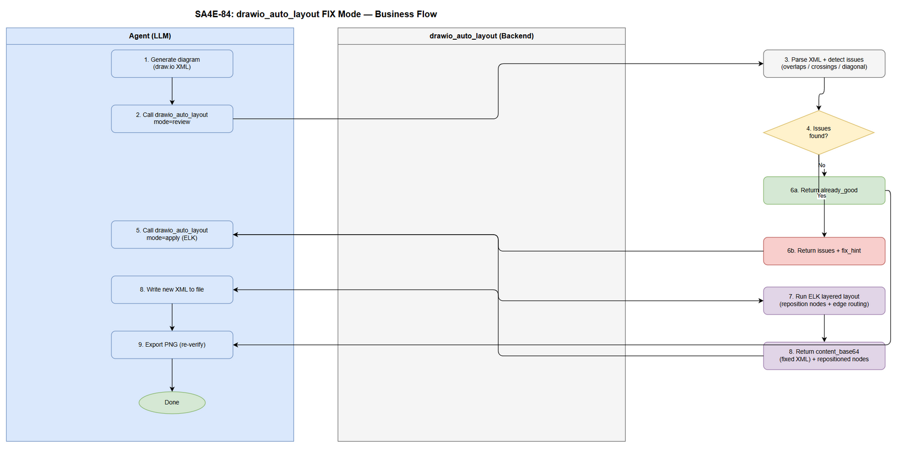
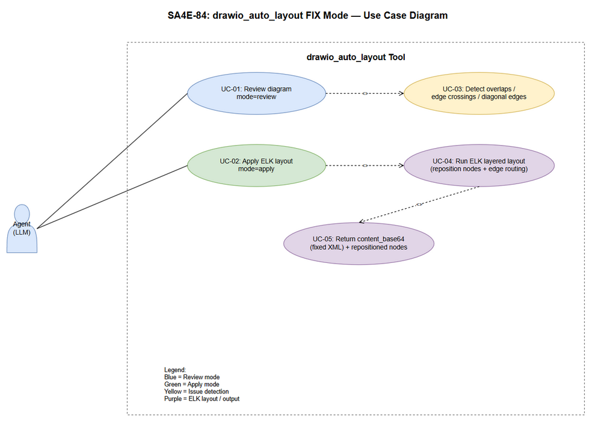

# Business Requirements Document (BRD)

## SDLC Agents 4 Enterprise — SA4E-84: [drawio] Upgrade drawio_auto_layout to FIX mode — auto-layout reduce edge crossings with elkjs

---

## Document Information

| Field | Value |
|-------|-------|
| Jira Ticket | SA4E-84 |
| Title | [drawio] Upgrade drawio_auto_layout to FIX mode — auto-layout reduce edge crossings with elkjs |
| Author | BA Agent |
| Version | 1.0 |
| Date | 2026-08-01 |
| Status | Draft |

---

## Author Tracking

| Role | Name - Position | Responsibility |
|------|-----------------|----------------|
| Author | BA Agent – Business Analyst | Create document |
| Peer Reviewer | SA Agent – Solution Architect | Review document |

---

## Revision History

| Version | Date | Author | Changes |
|---------|------|--------|---------|
| 1.0 | 2026-08-01 | BA Agent | Initiate document — auto-generated from Jira ticket SA4E-84 and feature specification |

---

## Sign-Off

| Name | Signature and date |
|------|--------------------|
| | ☐ I agree and confirm all criteria on this BRD as expected requirements |
| | ☐ I agree and confirm all criteria on this BRD as expected requirements |

---

## 1. Introduction

### 1.1 Overview

SA4E-84 nâng cấp tool **`drawio_auto_layout`** (backend/src/engine/tools/drawio-tool.ts) từ trạng thái **REVIEW-only** lên **FIX mode** sử dụng **elkjs** (ELK layout engine, thuần JavaScript/TypeScript, không cần binary).

**Hiện trạng:** `handleDrawioLayout` chỉ parse XML bằng `drawio-parser.ts`, detect các vấn đề layout (node overlaps, edge crossings, diagonal edges) và trả về report JSON với `fix_hint` — nhưng **KHÔNG sửa file**. Các SDLC agents dựa vào `.kiro/steering/drawio.md` tự tính tọa độ + waypoints thủ công, dẫn tới diagram hay bị đường nối cắt nhau (edge crossing) và phải sửa tay mất thời gian.

**Mục tiêu:** Khi gọi tool với `mode=apply`, hệ thống chạy **ELK layered layout** để tự tính lại vị trí node + edge routing, ghi tọa độ mới (và nếu cần edge style/waypoints) vào drawio XML, rồi trả về `content_base64` chứa XML đã sửa cùng danh sách node đã reposition. Tham khảo cách tiếp cận từ https://github.com/Agents365-ai/drawio-skill (auto-layout Graphviz + edge routing).

### 1.2 Scope

Phạm vi của ticket này (backend — TypeScript, backend/src/engine/tools/):

1. **Thêm dependency `elkjs`** (ELK layout, thuần JS/TS, không cần binary) vào `backend/package.json`.
2. **Nâng cấp `handleDrawioLayout`**:
   - Giữ nguyên **review mode** khi gọi với tham số hiện tại (dry_run / không có `apply` flag) — không phá vỡ hành vi cũ.
   - Thêm **FIX mode**: sau khi detect issues, chạy ELK layered layout tính lại vị trí node + edge routing, ghi tọa độ mới (và nếu cần edge style/waypoints) vào drawio XML.
   - Trả về JSON gồm: `status`, `message`, `nodes`, `edges`, `issues` (trước fix), và khi fix: `content_base64` mới (XML đã sửa) + danh sách `repositioned_nodes`.
   - Giữ nguyên input schema cũ (`content_base64` bắt buộc), thêm tham số tùy chọn `mode: "review" | "apply"` (default: `review`) và giữ các tham số layout đã có (`algorithm`, `spacing`, `direction`).
3. **Cập nhật steering** `.kiro/steering/drawio.md`: hướng dẫn agents gọi tool với `mode=apply` sau khi generate, ghi XML mới nếu có `content_base64` trả về, rồi export PNG lại.
4. **Cập nhật tài liệu/README backend** (danh sách tool) nếu cần.
5. **Viết unit test vitest** cho cả 2 mode (review + apply) — test với drawio XML mẫu có edge crossing.

### 1.3 Out of Scope

- **Không thay đổi `drawio_export_png`** — pipeline export PNG hiện có phải tiếp tục hoạt động không đổi.
- **Không thay đổi parser** `drawio-parser.ts` — schema `DiagramGraph` (nodes/edges/containers) giữ nguyên.
- **Không thay thế các layout algorithms hiện có** (`drawio-layout.ts`: layered/force/mrtree/radial) — ELK được thêm vào như engine cho FIX mode, các thuật toán cũ vẫn dùng cho review/other flows.
- **Không vỡ các test hiện có**: `backend/tests/integration/drawio-export.test.ts`, `backend/src/config/__tests__/CoreTools.test.ts`, `backend/src/__tests__/sa4e-testkit.ts`.
- **Không dùng Mermaid** — chỉ draw.io.
- **Không commit code** — pipeline chỉ tạo docs và code trong `documents/{TICKET}/` và `backend/src/` (commit chỉ khi được phép).

### 1.4 Preliminary Requirement

- **`drawio-parser.ts`** đã parse XML → `DiagramGraph` (nodes/edges/containers) — dùng làm input cho ELK.
- **elkjs** package phải được cài đặt thành công qua npm (thuần JS/TS, chạy trên Node >= 18.14.1).
- Có draw.io XML mẫu chứa edge crossing để viết unit test (test data inline trong test file).
- draw.io CLI hoặc renderer cho `drawio_export_png` (chỉ cần cho việc verify end-to-end, không phải dependency của FIX mode).

---

## 2. Business Requirements

### 2.1 High Level Process Map

Luồng xử lý end-to-end của FIX mode được mô tả trong Business Flow diagram:


*[Edit in draw.io](diagrams/business-flow.drawio)*

1. **Generate**: Agent (LLM) generate diagram draw.io XML.
2. **Review**: Agent gọi `drawio_auto_layout` với `mode=review` (hoặc không truyền mode) → hệ thống parse XML + detect issues (overlaps / crossings / diagonal edges).
3. **Quyết định**: Nếu không có issues → trả `status: "already_good"` → Agent export PNG → kết thúc. Nếu có issues → trả danh sách issues + `fix_hint` (behavior cũ, không đổi).
4. **Apply**: Agent gọi lại `drawio_auto_layout` với `mode=apply` → hệ thống chạy **ELK layered layout** (reposition nodes + edge routing).
5. **Output**: Hệ thống trả về `content_base64` (XML đã sửa) + `repositioned_nodes`.
6. **Ghi file**: Agent ghi XML mới vào file `.drawio` trên đĩa.
7. **Export**: Agent export PNG lại bằng `drawio_export_png` → kết thúc.

> **Note:** Review mode là behavior hiện có — không được phá vỡ. FIX mode chỉ kích hoạt khi caller truyền `mode="apply"`.

### 2.2 List of User Stories / Use Cases

| # | Story / Use Case / Epic | Priority | Source Ticket |
|---|-------------------------|----------|---------------|
| 1 | As an Agent generating draw.io diagrams, I want to detect layout issues (overlaps/crossings/diagonal edges) via review mode so that I know what to fix without modifying the file | MUST HAVE | SA4E-84 |
| 2 | As an Agent, I want to auto-fix the diagram via apply mode (ELK layout) so that node positions and edge routes are corrected automatically and edge crossings are reduced | MUST HAVE | SA4E-84 |
| 3 | As a Developer, I want elkjs added as a pure JS/TS dependency and FIX mode implemented in the backend so that no binary/Graphviz installation is required | MUST HAVE | SA4E-84 |
| 4 | As an Agent, I want the draw.io steering file updated with mode=apply guidance so that I know when to call apply mode, write back the new XML and re-export PNG | SHOULD HAVE | SA4E-84 |
| 5 | As a QA/Developer, I want vitest unit tests covering both review and apply modes so that regressions are caught early | MUST HAVE | SA4E-84 |

---

### 2.3 Details of User Stories

---

#### Business Flow

**Step 1:** Agent generate diagram (draw.io XML) — có thể theo steering thủ công hiện tại.

**Step 2:** Agent gọi `drawio_auto_layout` với `content_base64` (XML) và `mode=review` (hoặc không truyền mode — default review). Hệ thống parse XML bằng `drawio-parser.ts` và chạy `detectAllIssues()`: node overlaps, edge crossings, diagonal edges.

**Step 3:** Hệ thống trả JSON. Nếu `issues.length === 0` → `status: "already_good"`, Agent export PNG và kết thúc. Nếu có issues → `status: "needs_fix"` kèm danh sách issues + `fix_hint`.

**Step 4:** Agent gọi lại tool với `mode=apply`. Hệ thống chạy ELK layered layout trên `DiagramGraph`: tính lại vị trí node (x/y) và edge routing, ghi tọa độ mới vào XML.

**Step 5:** Hệ thống trả về JSON gồm `status: "fixed"`, `content_base64` (XML đã sửa), `repositioned_nodes` (danh sách node đã đổi vị trí), `issues` (danh sách trước fix).

**Step 6:** Agent ghi XML mới (decode `content_base64`) vào file `.drawio` tương ứng.

**Step 7:** Agent gọi `drawio_export_png` để export PNG lại từ XML mới, verify trực quan (hoặc gọi lại review mode để xác nhận 0 issues).

> **Note:** Nếu XML không parse được hoặc không có node nào → trả `error` JSON như hiện tại. Caller không được phép sửa file trực tiếp — FIX mode chỉ trả về XML đã sửa dạng base64.

---

#### STORY 1: Review mode — detect layout issues (behavior hiện có, giữ nguyên)

> As an Agent generating draw.io diagrams, I want to detect layout issues (overlaps/crossings/diagonal edges) via review mode so that I know what to fix without modifying the file.

**Requirement Details:**

1. Giữ nguyên behavior hiện tại: gọi `handleDrawioLayout(args, workspace)` với `content_base64` (bắt buộc) → parse XML → detect issues → trả JSON.
2. Input schema hiện có được giữ nguyên: `content_base64` (required), `file_path`, `algorithm`, `spacing`, `direction`.
3. Thêm tham số tùy chọn `mode: "review" | "apply"` (default `review`) — khi không truyền `mode` hoặc truyền `"review"`, hành vi giống hệt hiện tại (không sửa file).
4. Issue detection gồm 3 loại: `node_overlap` (high), `edge_crossing` (medium), `diagonal_edge` (low) — mỗi issue có `fix_hint`.
5. Khi không có issues → `status: "already_good"`, `issues: []`.

**Data Fields (input schema):**

| Field | Type | Required | Description | Example |
|-------|------|----------|-------------|---------|
| content_base64 | string | Yes | Base64-encoded .drawio XML content | `PHhtbD4...` |
| file_path | string | No | Original file path (reference only) | `documents/SA4E-84/diagrams/business-flow.drawio` |
| algorithm | string | No | Layout algorithm hint: layered\|force\|mrtree\|radial (default: layered) | `layered` |
| spacing | number | No | Node spacing in pixels (default: 80) | `80` |
| direction | string | No | Layout direction: DOWN\|RIGHT\|LEFT\|UP (default: DOWN) | `DOWN` |
| mode | string | No | `review` (default) or `apply` | `review` |

**Acceptance Criteria:**

1. Gọi tool không truyền `mode` → trả về review result (không sửa file) — `status` là `already_good` hoặc `needs_fix`.
2. Gọi tool với `mode="review"` → hành vi giống hệt không truyền mode: `nodes`, `edges`, `issues` được trả về, không có `content_base64` trong response.
3. XML chứa edge crossing → `issues` chứa ít nhất 1 issue type `edge_crossing` với `fix_hint`.
4. XML không có vấn đề → `status: "already_good"`, `issues: []`.

**UI Specifications (if applicable):**

| No. | Name | Type | Required | Description | Note |
|-----|------|------|----------|-------------|------|
| 1 | Review JSON response | MCP tool output (JSON string) | Yes | `{ status, message, nodes, edges, issues }` | Không chứa `content_base64` khi mode=review |

**Validation Rules (if applicable):**

- `content_base64` bắt buộc — thiếu → `{ error: "content_base64 is required" }`.
- Base64 không decode được hoặc XML không parse được → `{ error: "Analysis failed: <msg>" }`.
- Diagram không có node nào → `{ error: "No nodes found in diagram" }`.

**Error Handling (if applicable):**

- Base64 invalid / XML malformed: trả `error` JSON, không throw (try/catch đã có).
- File tạm không tạo được (tmpdir lỗi): trả `error`, cleanup best-effort.

---

#### STORY 2: Apply mode — ELK auto-layout fix edge crossings

> As an Agent, I want to auto-fix the diagram via apply mode (ELK layout) so that node positions and edge routes are corrected automatically and edge crossings are reduced.

**Requirement Details:**

1. Khi gọi với `mode="apply"`, sau khi chạy `detectAllIssues()`, hệ thống chạy **ELK layered layout** (elkjs) để tính lại vị trí node + edge routing.
2. Tọa độ mới (x/y) của node được ghi vào `<mxGeometry>` của từng node trong XML; edge routing (bend points/waypoints) và nếu cần edge style được ghi vào edge cells.
3. Trả về JSON gồm: `status`, `message`, `nodes`, `edges`, `issues` (trước fix) + `content_base64` (XML đã sửa) + `repositioned_nodes` (danh sách node đã reposition với tọa độ cũ/mới).
4. Khi không có issues mà vẫn gọi `mode="apply"` → vẫn trả `already_good` (không cần fix) — XML trả về giữ nguyên.
5. Ràng buộc code: SOLID, max 200 dòng/file, 20 dòng/function, tách model riêng (VD: `elk-layout.ts` / `layout-models.ts`).

**Data Fields (output JSON):**

| Field | Type | Required | Description | Example |
|-------|------|----------|-------------|---------|
| status | string | Yes | `fixed` \| `already_good` \| `needs_fix` \| `error` | `fixed` |
| message | string | Yes | Human-readable summary | `Fixed 3 issues with ELK layered layout.` |
| nodes | number | Yes | Total node count | `12` |
| edges | number | Yes | Total edge count | `14` |
| issues | object[] | Yes | Issues detected BEFORE fix | `[{ type: "edge_crossing", ... }]` |
| content_base64 | string | No (only apply) | Base64 of corrected drawio XML | `PHhtbD4...` |
| repositioned_nodes | object[] | No (only apply) | List of repositioned nodes with before/after coords | `[{ id, x_old, y_old, x_new, y_new }]` |

**Acceptance Criteria:**

1. Gọi tool với `mode="apply"` trên XML có edge crossing → response chứa `content_base64` và `repositioned_nodes` không rỗng.
2. Decode `content_base64` → XML hợp lệ, parse lại được bằng `drawio-parser.ts`, và các node có tọa độ mới (khác tọa độ cũ ít nhất 1 node).
3. Chạy lại review mode trên XML đã fix → số issues sau fix không tăng và thường giảm (edge crossings được loại bỏ hoặc giảm đáng kể).
4. `mode` không hợp lệ (khác `review`/`apply`) → trả `error` hoặc default về `review` (quyết định khi design — ghi vào Open Questions nếu chưa chốt).
5. Gọi `mode="apply"` trên XML không có issues → `status: "already_good"`, không làm thay đổi XML (content_base64 nếu có giữ nguyên nội dung).

**UI Specifications (if applicable):**

| No. | Name | Type | Required | Description | Note |
|-----|------|------|----------|-------------|------|
| 1 | Apply JSON response | MCP tool output (JSON string) | Yes | Chứa `content_base64` + `repositioned_nodes` | Chỉ khi mode=apply |

**Validation Rules (if applicable):**

- `mode` phải là `"review"` hoặc `"apply"` (case-insensitive tùy design) — default `"review"`.
- `algorithm` hỗ trợ: `layered` (ELK layered) — các giá trị khác được map hoặc bỏ qua (chi tiết ở design).
- `spacing` phải là số dương; `direction` phải thuộc DOWN|RIGHT|LEFT|UP.

**Error Handling (if applicable):**

- elkjs chạy lỗi (graph không layout được): trả `error` JSON kèm message gốc, KHÔNG trả XML hỏng.
- XML sửa lỗi dẫn tới không parse lại được: rollback → trả `error`, không trả `content_base64`.

---

#### STORY 3: Add elkjs dependency + backend implementation constraints

> As a Developer, I want elkjs added as a pure JS/TS dependency and FIX mode implemented in the backend so that no binary/Graphviz installation is required.

**Requirement Details:**

1. Thêm `elkjs` vào `backend/package.json` dependencies (thuần JS/TS, chạy trên Node >= 18.14.1 — đúng `engines` hiện tại).
2. Tách implementation theo SOLID: model riêng (VD: `LayoutFixResult`, `RepositionedNode`), engine riêng (VD: `elk-layout.ts`), không nhồi tất cả vào `drawio-tool.ts`.
3. Mỗi file ≤ 200 dòng, mỗi function ≤ 20 dòng.
4. KHÔNG thay đổi `drawio-export-png.ts`, `register-tools.ts` dispatch (chỉ thêm handler nếu cần — dispatch registry hiện tại `drawio_auto_layout` giữ nguyên).
5. Không vỡ các test hiện có: `backend/tests/integration/drawio-export.test.ts`, `backend/src/config/__tests__/CoreTools.test.ts`, `backend/src/__tests__/sa4e-testkit.ts`.

**Data Fields (package.json):**

| Field | Type | Required | Description | Example |
|-------|------|----------|-------------|---------|
| dependencies.elkjs | string | Yes | ELK layout engine (pure JS) | `^0.9.x` (xác nhận version mới nhất khi cài) |

**Acceptance Criteria:**

1. `elkjs` xuất hiện trong `dependencies` của `backend/package.json`.
2. `npm install` chạy thành công không cần binary (chỉ npm registry).
3. Toàn bộ file mới tuân thủ giới hạn dòng (≤200 dòng/file, ≤20 dòng/function) — check bằng lint hoặc review.
4. `drawio-export-png.ts` và `register-tools.ts` không bị thay đổi hành vi (hoặc chỉ thêm, không sửa) — các test hiện có vẫn pass.

**UI Specifications (if applicable):**

N/A — backend change.

**Validation Rules (if applicable):**

- KHÔNG import elkjs trong `drawio-export-png.ts` — export PNG flow phải độc lập.
- Lazy-load elkjs (dynamic import) nếu cần giữ startup time thấp — quyết định tại design.

**Error Handling (if applicable):**

- elkjs không load được (install lỗi): tool trả `error` rõ ràng kèm hint install.

---

#### STORY 4: Steering file update — mode=apply guidance

> As an Agent, I want the draw.io steering file updated with mode=apply guidance so that I know when to call apply mode, write back the new XML and re-export PNG.

**Requirement Details:**

1. Cập nhật `.kiro/steering/drawio.md`:
   - Sau bước generate diagram, khuyến nghị gọi `drawio_auto_layout` với `mode="apply"` (thay vì chỉ review).
   - Nếu response chứa `content_base64` → decode và ghi XML mới vào file `.drawio`.
   - Sau khi ghi XML mới → export PNG lại bằng `drawio_export_png` / `export_drawio`.
2. Bổ sung ví dụ JSON call/response ngắn cho mode=apply.
3. Giữ nguyên các rule edge routing thủ công hiện có cho các trường hợp ELK không xử lý (Use Case, fan-out/fan-in).

**Acceptance Criteria:**

1. Steering file chứa hướng dẫn gọi `mode="apply"` kèm ví dụ.
2. Steering file chứa bước "write back new XML from content_base64" và "re-export PNG".
3. Không phá vỡ các phần khác của steering (các rule hiện có vẫn còn).

**UI Specifications (if applicable):**

| No. | Name | Type | Required | Description | Note |
|-----|------|------|----------|-------------|------|
| 1 | Steering section update | Markdown (`.kiro/steering/drawio.md`) | Yes | Thêm mục FIX mode workflow | Reference cho agents |

**Validation Rules (if applicable):**

- Mọi hướng dẫn phải tham chiếu đúng tên tool `drawio_auto_layout` và tham số `mode`.

**Error Handling (if applicable):**

- Nếu response không có `content_base64` (already_good / error): steering hướng dẫn agent không ghi file, chỉ báo cáo.

---

#### STORY 5: Vitest unit tests for review + apply modes

> As a QA/Developer, I want vitest unit tests covering both review and apply modes so that regressions are caught early.

**Requirement Details:**

1. Viết unit test vitest cho `handleDrawioLayout`:
   - **Review mode tests**: XML mẫu có edge crossing → trả `needs_fix` + issues; XML tốt → `already_good`; thiếu `content_base64` → error.
   - **Apply mode tests**: XML mẫu có edge crossing → trả `content_base64` + `repositioned_nodes`; decode lại XML hợp lệ; chạy lại review trên XML đã fix → issues giảm/không tăng.
2. Test data: drawio XML mẫu inline (đơn giản, 3-6 nodes + 2-3 edges trong đó có 1 cặp edge crossing).
3. File test đặt theo convention backend (`*.test.ts` cạnh source hoặc trong `src/__tests__/`).

**Acceptance Criteria:**

1. Test suite mới chạy pass: `npx vitest run <test-file>`.
2. Ít nhất 3 test cases: (a) review detects crossing, (b) apply fixes and returns content_base64, (c) apply on clean XML returns already_good.
3. Không vỡ các test hiện có: `drawio-export.test.ts`, `CoreTools.test.ts`, `sa4e-testkit.ts` vẫn pass.

**UI Specifications (if applicable):**

| No. | Name | Type | Required | Description | Note |
|-----|------|------|----------|-------------|------|
| 1 | Vitest output | CLI test result | Yes | `npx vitest run` green | Backend test suite |

**Validation Rules (if applicable):**

- Test XML phải là draw.io hợp lệ (mxGraphModel) — có thể reuse fixture pattern từ `drawio-export.test.ts`.

**Error Handling (if applicable):**

- Nếu ELK không sẵn sàng trong môi trường test: mock elkjs hoặc lazy-load để test apply mode không phụ thuộc network.

---

### 2.4 Use Case Diagram


*[Edit in draw.io](diagrams/use-case.drawio)*

| Use Case | Actor | Description |
|----------|-------|-------------|
| UC-01: Review diagram (mode=review) | Agent (LLM) | Detect overlaps/crossings/diagonal edges, trả issues + fix_hint, không sửa file |
| UC-02: Apply ELK layout (mode=apply) | Agent (LLM) | Chạy ELK layered layout, reposition nodes + edge routing, trả content_base64 XML đã fix |
| UC-03: Detect overlaps / edge crossings / diagonal edges | Hệ thống | Issue detection engine (đã có) — `<<include>>` bởi UC-01 |
| UC-04: Run ELK layered layout (reposition + routing) | Hệ thống | ELK layout engine (mới) — `<<include>>` bởi UC-02 |
| UC-05: Return content_base64 (fixed XML) + repositioned nodes | Hệ thống | Output của apply mode — `<<include>>` bởi UC-04 |

---

## 3. Functional Requirements

| ID | Requirement | Source Story | Priority |
|----|-------------|--------------|----------|
| FR-1 | Thêm dependency `elkjs` vào `backend/package.json` (dependencies) | STORY 3 | MUST HAVE |
| FR-2 | Giữ nguyên review mode: gọi `handleDrawioLayout` không có `mode="apply"` → chỉ detect + report, không sửa file | STORY 1 | MUST HAVE |
| FR-3 | Thêm tham số `mode: "review" \| "apply"` (default `review`) vào input schema — `content_base64` vẫn bắt buộc | STORY 1, STORY 2 | MUST HAVE |
| FR-4 | Khi `mode="apply"` và có issues: chạy ELK layered layout tính lại vị trí node + edge routing | STORY 2 | MUST HAVE |
| FR-5 | Khi `mode="apply"`: ghi tọa độ mới (x/y) vào `<mxGeometry>` node, edge routing/waypoints (nếu cần) vào edge cells trong XML | STORY 2 | MUST HAVE |
| FR-6 | Response apply mode gồm: `status`, `message`, `nodes`, `edges`, `issues` (trước fix), `content_base64` (XML đã sửa), `repositioned_nodes` | STORY 2 | MUST HAVE |
| FR-7 | Response review mode giữ nguyên: `status`, `message`, `nodes`, `edges`, `issues` (không `content_base64`) | STORY 1 | MUST HAVE |
| FR-8 | Giữ nguyên các tham số layout hiện có: `algorithm`, `spacing`, `direction` | STORY 1 | MUST HAVE |
| FR-9 | Cập nhật `.kiro/steering/drawio.md` với workflow mode=apply (gọi apply → ghi XML mới → export PNG) | STORY 4 | SHOULD HAVE |
| FR-10 | Cập nhật tài liệu/README backend danh sách tool nếu cần | STORY 4 | COULD HAVE |
| FR-11 | Viết unit test vitest cho review + apply modes với XML mẫu có edge crossing | STORY 5 | MUST HAVE |
| FR-12 | Không thay đổi hành vi `drawio_export_png` và các test hiện có (drawio-export.test.ts, CoreTools.test.ts, sa4e-testkit.ts) | STORY 3 | MUST HAVE |

---

## 4. Dependencies

| Dependency | Type | Related Ticket | Description |
|------------|------|----------------|-------------|
| elkjs (npm package) | External (npm) | N/A | ELK layout engine thuần JS/TS — thêm vào `backend/package.json`, không cần binary |
| drawio-parser.ts (`parseDrawio`, `DiagramGraph`) | System | SA4E-84 | Parser hiện có cung cấp graph input cho ELK — không thay đổi |
| drawio-tool.ts (`handleDrawioLayout`) | System | SA4E-84 | Tool cần nâng cấp — thêm FIX mode |
| drawio-layout.ts | System | SA4E-84 | Layout algorithms hiện có (layered/force/mrtree/radial) — giữ nguyên, ELK bổ sung |
| drawio-export-png.ts | System | SA4E-84 | Export PNG — KHÔNG được vỡ |
| register-tools.ts | System | SA4E-84 | Registry dispatch `drawio_auto_layout` — giữ nguyên entry |
| .kiro/steering/drawio.md | Documentation | SA4E-84 | Steering cần cập nhật hướng dẫn mode=apply |
| Tham khảo drawio-skill (Agents365-ai) | External | N/A | https://github.com/Agents365-ai/drawio-skill — auto-layout + edge routing reference |

---

## 5. Stakeholders

| Role | Name / Team | Responsibility | Source |
|------|-------------|----------------|--------|
| LLM Agents | SDLC pipeline agents (BA, SA, QA, DEV, DevOps) | Generate diagrams, gọi tool review/apply mode, ghi XML mới, export PNG | SA4E-84 (user stories) |
| BA Agent | BA – Business Analyst | Define business requirement và acceptance criteria | SA4E-84 |
| SA Agent | SA – Solution Architect | Review solution design (elkjs integration, model tách riêng) | SA4E-84 (peer reviewer) |
| DEV Team | Backend development team | Implement elkjs dependency + FIX mode + steering update + tests | SA4E-84 |
| QA Team | QA – Test Engineer | Verify acceptance criteria (unit tests 2 modes, không vỡ test cũ) | SA4E-84 (acceptance criteria) |

---

## 6. Risks and Assumptions

### 6.1 Risks

| Risk | Impact | Likelihood | Mitigation |
|------|--------|------------|------------|
| elkjs layout output làm vỡ cấu trúc container/swimlane | High | Medium | Chạy ELK trên nodes theo parent group; resize containers sau layout (pattern từ `drawio-layout.ts`); test với diagram chứa swimlane |
| FIX mode trả XML không parse lại được | High | Low | Verify bằng `parseDrawio` trước khi trả `content_base64`; rollback về error nếu invalid |
| Review mode behavior bị thay đổi ngoài ý muốn | Medium | Low | Giữ nguyên code path review; mode default = review; test regression cho review mode |
| elkjs bundle size / startup time tăng | Medium | Medium | Lazy-load elkjs (dynamic import) khi cần apply mode; đo startup time |
| Các test hiện có (drawio-export, CoreTools, sa4e-testkit) bị vỡ | High | Medium | Chạy toàn bộ suite trước khi merge; không sửa file export/registry |
| Steering update không rõ ràng dẫn tới agents không ghi XML mới | Medium | Medium | Ví dụ call/response cụ thể; checklist bước "ghi XML + re-export PNG" |

### 6.2 Assumptions

- `drawio-parser.ts` trả đủ dữ liệu (x, y, width, height, style) để ELK layout và ghi lại vào XML.
- elkjs hoạt động trên Node >= 18.14.1 (engines hiện tại của backend).
- Caller của tool sẽ tự decode `content_base64` và ghi file — tool không ghi file trực tiếp (giữ nguyên contract hiện tại).
- FIX mode không cần thay đổi `register-tools.ts` (tool đã được đăng ký với cùng tên `drawio_auto_layout`).
- Không có thêm ticket con/linked tickets cho SA4E-84 (chưa xác nhận từ Jira — check khi fetch).

---

## 7. Non-Functional Requirements

| Category | Requirement | Details |
|----------|-------------|---------|
| Performance | ELK layout phải hoàn thành trong thời gian chấp nhận được cho diagram kích thước thường (≤ 200 nodes) | elkjs layered layout là O(V+E)-ish đối với layered; nếu chậm → lazy-load + giới hạn node count |
| Performance | Startup time backend không tăng đáng kể | Lazy-load elkjs (dynamic import) chỉ khi `mode="apply"` được gọi |
| Maintainability | SOLID — tách model/engine riêng, ≤200 dòng/file, ≤20 dòng/function | Tách `elk-layout.ts` + models; không nhồi vào `drawio-tool.ts` |
| Compatibility | Không phá vỡ `drawio_export_png` và các test hiện có | Chạy full test suite; không sửa `drawio-export-png.ts` / registry dispatch |
| Portability | Không cần binary ngoài npm (chống phụ thuộc Graphviz) | elkjs thuần JS/TS; môi trường build/CI không cần cài thêm |
| Reliability | FIX mode không bao giờ trả XML hỏng | Validate parse lại sau fix; rollback nếu lỗi |
| Security | Không log nội dung XML base64 nhạy cảm | Logger dùng message tóm tắt, không dump full content |
| Scalability | Hỗ trợ diagram nhiều node (hàng trăm) mà không explode memory | elkjs xử lý in-memory; giới hạn node count + timeout nếu cần |

---

## 8. Related Tickets

| Ticket Key | Summary | Status | Type | Relationship |
|------------|---------|--------|------|--------------|
| SA4E-84 | [drawio] Upgrade drawio_auto_layout to FIX mode - auto-layout reduce edge crossings with elkjs | In Progress | Story | Main ticket |
| SA4E-34 | (Ví dụ ticket drawio liên quan) | N/A | N/A | (Cần xác nhận link từ Jira — xem Open Questions) |

> **Note:** Chưa có dữ liệu Jira linked tickets (ticket data được cung cấp inline từ feature spec). Nếu có linked tickets khi fetch Jira, bổ sung vào bảng này.

---

## 9. Open Questions

| # | Question | Impact | Suggested By |
|---|----------|--------|--------------|
| 1 | `mode` không hợp lệ (ví dụ `"auto"`) nên trả `error` hay default về `review`? | FR-3 | BA |
| 2 | ELK layout có nên giữ nguyên kích thước node hiện tại hay để ELK tự resize? | FR-4, FR-5 | SA |
| 3 | Có cần hỗ trợ `algorithm` khác (force/mrtree/radial) trong apply mode hay chỉ `layered`? | FR-8 | SA |
| 4 | Lazy-load elkjs (dynamic import) hay import tĩnh ở top-level? (ảnh hưởng startup time) | NFR Performance | DEV |
| 5 | `content_base64` có nên trả cả khi `already_good` (XML giữ nguyên) hay chỉ khi có fix? | FR-6 | DEV |
| 6 | Có cần cập nhật `drawio_export_png` steering/tài liệu để tự gọi review sau export? | FR-9 | BA |
| 7 | Test file đặt tại `backend/src/engine/tools/__tests__/` hay `backend/src/__tests__/`? | FR-11 | DEV |
| 8 | Có linked tickets nào từ Jira cho SA4E-84 không (cần fetch để xác nhận)? | Section 8 | BA |

---

## 10. Diagram Index

| Diagram | Source File | PNG | Type | Section |
|---------|-------------|-----|------|---------|
| Business Flow — FIX mode end-to-end | `diagrams/business-flow.drawio` | `diagrams/business-flow.png` | Business Flow (swimlane) | 2.1 |
| Use Case — drawio_auto_layout review + apply | `diagrams/use-case.drawio` | `diagrams/use-case.png` | Use Case | 2.4 |

Cả 2 file `.drawio` đều dùng native mxGraphModel XML (không Mermaid), có thể edit trong draw.io desktop/online và export lại PNG bằng CLI:
```powershell
& "C:\Program Files\draw.io\draw.io.exe" -x -f png -b 10 -o "documents/SA4E-84/diagrams/{name}.png" "documents/SA4E-84/diagrams/{name}.drawio"
```

---

## 11. Appendix

### 11.1 File tham chiếu (technical context)

| File | Mô tả |
|------|-------|
| `backend/src/engine/tools/drawio-tool.ts` | Tool hiện tại REVIEW only — cần nâng cấp FIX mode (169 dòng) |
| `backend/src/engine/tools/drawio-parser.ts` | Parse XML → `DiagramGraph` (nodes/edges/containers) — giữ nguyên |
| `backend/src/engine/tools/drawio-layout.ts` | Layout algorithms hiện có (layered/force/mrtree/radial) — giữ nguyên |
| `backend/src/engine/tools/drawio-export-png.ts` | Export PNG — KHÔNG được vỡ |
| `backend/src/engine/tools/register-tools.ts` | Registry dispatch `drawio_auto_layout` — giữ nguyên entry |
| `backend/package.json` | Dependencies — thêm `elkjs` |
| `.kiro/steering/drawio.md` | Steering cần cập nhật mode=apply workflow |
| `backend/tests/integration/drawio-export.test.ts` | Integration test hiện có — không vỡ |
| `backend/src/config/__tests__/CoreTools.test.ts` | Unit test hiện có — không vỡ |
| `backend/src/__tests__/sa4e-testkit.ts` | Test kit hiện có — không vỡ |

### 11.2 Flow tóm tắt (textual)

```
Agent generate diagram → mode=review (detect) → [no issues] → export PNG → done
                                            → [issues] → mode=apply (ELK) → content_base64 (fixed XML)
                                                        → write XML to file → export PNG → done
```

### Glossary

| Term | Definition |
|------|------------|
| ELK | Eclipse Layout Kernel — layout engine họ layered/tree/force; bản JS: elkjs |
| elkjs | Thư viện ELK port sang JavaScript/TypeScript thuần, không cần binary |
| Layered layout | Thuật toán xếp node theo tầng có hướng, giảm edge crossings |
| Edge crossing | Đường nối cắt qua node khác hoặc cắt nhau giữa 2 edge |
| Node overlap | Hai node chồng lên nhau (>50% diện tích nhỏ hơn — theo detection hiện có) |
| Diagonal edge | Edge không thẳng hàng ngang/dọc (lệch > 20px cả 2 trục) |
| `fix_hint` | Gợi ý sửa bằng tay mà review mode trả về (không tự sửa) |
| `content_base64` | Nội dung drawio XML mã hóa base64 — contract chính của tool |
| `repositioned_nodes` | Danh sách node được ELK đổi vị trí (kèm tọa độ cũ/mới) |
| `mode` | Tham số mới: `review` (default) hoặc `apply` |

### Reference Documents

| Document | Link / Location |
|----------|-----------------|
| drawio-skill (auto-layout reference) | https://github.com/Agents365-ai/drawio-skill |
| drawio_auto_layout tool (REVIEW only) | `backend/src/engine/tools/drawio-tool.ts` |
| draw.io parser | `backend/src/engine/tools/drawio-parser.ts` |
| Layout algorithms | `backend/src/engine/tools/drawio-layout.ts` |
| PNG export (không được vỡ) | `backend/src/engine/tools/drawio-export-png.ts` |
| Tool registry | `backend/src/engine/tools/register-tools.ts` |
| Steering (cần cập nhật) | `.kiro/steering/drawio.md` |
| BRD template | `documents/templates/BRD-TEMPLATE.md` |
