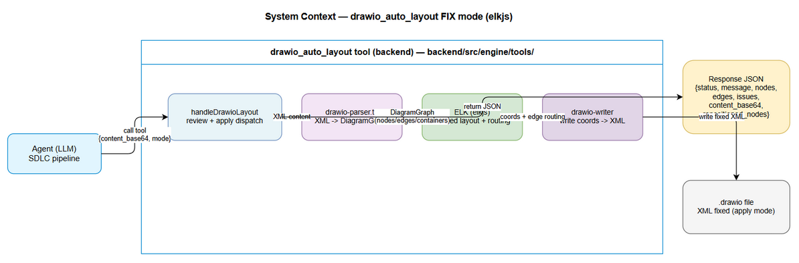
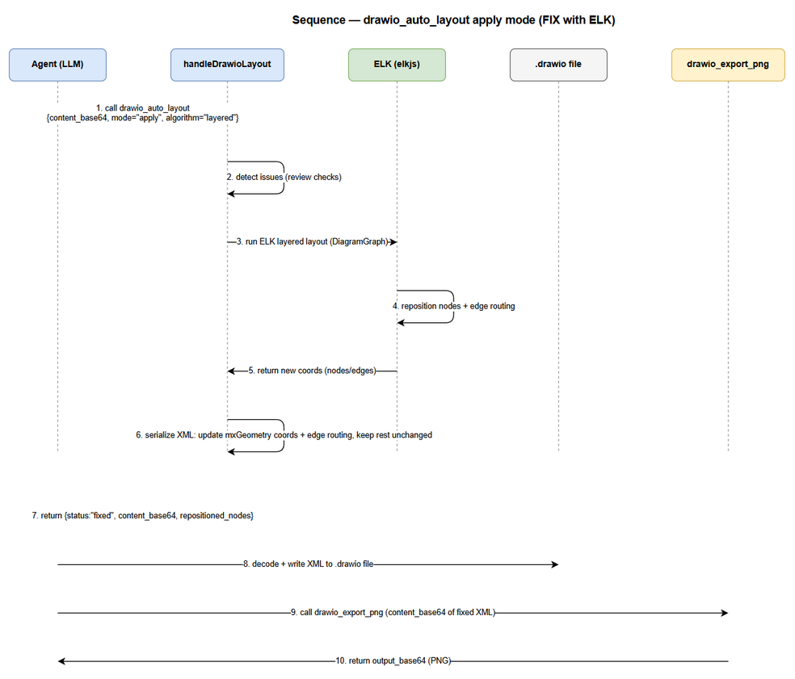
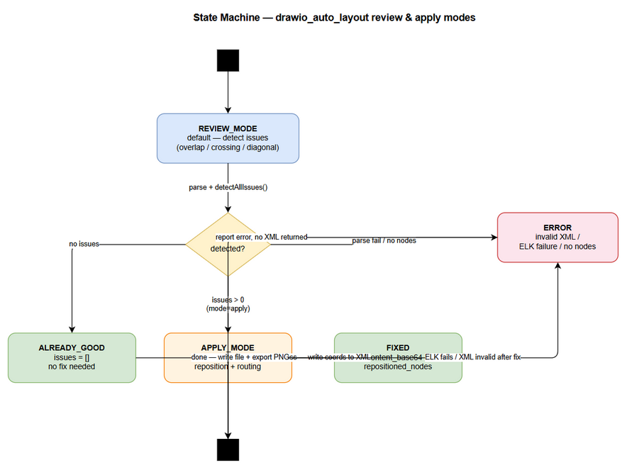

# Functional Specification Document (FSD) — TA-ENRICHED

## SDLC Agents 4 Enterprise — SA4E-84: [drawio] Upgrade drawio_auto_layout to FIX mode — auto-layout reduce edge crossings with elkjs

---

## Document Information

| Field | Value |
|-------|-------|
| Jira Ticket | SA4E-84 |
| Title | [drawio] Upgrade drawio_auto_layout to FIX mode — auto-layout reduce edge crossings with elkjs |
| Author | BA Agent (draft) / TA Agent (technical enrichment) |
| Version | 4 |
| Date | 2026-08-01 |
| Status | Final — synced with implementation decisions (v4) |
| Related BRD | `documents/SA4E-84/BRD.md` |

---

> **Revision Note (v4):** FSD synced with actual implementation decisions — removed `mode` parameter (always detect+fix), removed `content_base64` input/output (tool reads/writes file directly via `file_path`), minimal response schema (`status` + `message` only), added path traversal protection (`resolveFilePath()`). See Revision History for full changelog.

## Revision History

| Version | Date | Author | Changes |
|---------|------|--------|---------|
| 0.1 | 2026-08-01 | BA Agent | Initiate FSD DRAFT from BRD v1.0 + technical context files (drawio-tool.ts, drawio-parser.ts, drawio-layout.ts, drawio-export-png.ts, register-tools.ts, package.json, steering drawio.md) |
| 0.2 | 2026-08-01 | TA Agent | Technical enrichment: full API contracts w/ JSON Schema (3.6), elkjs integration spec (2.3), ELK graph data mapping + pseudocode (6.7-6.8), data model verification vs drawio-parser.ts (6.9), quantified NFR (8), new open issues (9), integration test scenarios (11), UC alternative/exception flows |
| 0.3 | 2026-08-01 | BA Agent | Fix DISC-1, DISC-2 theo SA feedback |
| 4 | 2026-08-01 | BA Agent | v4 sync with implementation decisions: remove mode param, remove content_base64 input/output, minimal response, add path traversal protection, merge UC-1 into UC-2 |

---

## 1. Overview

### 1.1 Purpose

FSD này đặc tả chức năng (HOW) cho tool **`drawio_auto_layout`** sử dụng **elkjs** (ELK layout engine, thuần JavaScript/TypeScript, không cần binary).

Tool nhận `file_path` (đường dẫn file `.drawio`), tự đọc file, detect các vấn đề layout (node overlaps, edge crossings, diagonal edges), và **tự động fix** bằng ELK layout engine nếu có issues. Fixed XML được ghi trực tiếp vào file. Response trả về minimal metadata: `{ status, message }`.

### 1.2 Scope

Phạm vi backend (TypeScript, `backend/src/engine/tools/`):

1. Thêm dependency `elkjs` vào `backend/package.json`.
2. `handleDrawioLayout`: nhận `file_path`, tự đọc file, detect issues, nếu có issues → chạy ELK layout → ghi fixed XML trực tiếp vào file. Response: `{ status, message }` hoặc `{ error }`.
3. Input schema: `file_path` (required) + `algorithm`/`spacing`/`direction` (optional).
4. Output schema: minimal — `{ status, message }` khi thành công, `{ error }` khi lỗi.
5. Path traversal protection: `resolveFilePath()` canonicalize + workspace boundary check (SEC-01: CWE-22).
6. Cập nhật `.kiro/steering/drawio.md` (workflow).
7. Vitest unit tests.

**Out of Scope:** không thay đổi `drawio_export_png`, `drawio-parser.ts` (schema `DiagramGraph` giữ nguyên), các layout algorithms cũ trong `drawio-layout.ts`, registry dispatch `register-tools.ts`; không vỡ các test hiện có (`drawio-export.test.ts`, `CoreTools.test.ts`, `sa4e-testkit.ts`); không dùng Mermaid.

### 1.3 Definitions & Acronyms

| Term | Definition |
|------|------------|
| ELK | Eclipse Layout Kernel — họ thuật toán layout (layered/tree/force); bản JS: elkjs |
| elkjs | Thư viện ELK port sang JS/TS thuần, không cần binary |
| Layered layout | Thuật toán xếp node theo tầng có hướng, giảm edge crossings |
| Edge crossing | Đường nối cắt qua node khác hoặc cắt nhau giữa 2 edge |
| Node overlap | Hai node chồng lên nhau (>50% diện tích node nhỏ hơn) |
| Diagonal edge | Edge không thẳng hàng ngang/dọc (lệch > 20px cả 2 trục) |
| DiagramGraph | Schema parse output: `nodes[]`, `edges[]`, `containers[]` |
| DiagramNode | `id`, `parentId`, `x`, `y`, `width`, `height`, `style`, `isContainer` |
| DiagramEdge | `id`, `sourceId`, `targetId`, `style` |
| `file_path` | Đường dẫn file .drawio — tool tự đọc và ghi file |
| `resolveFilePath()` | Hàm canonicalize path + kiểm tra workspace boundary (SEC-01: CWE-22) |

### 1.4 References

| Document | Location |
|----------|----------|
| BRD SA4E-84 | `documents/SA4E-84/BRD.md` |
| Tool hiện tại (REVIEW only) | `backend/src/engine/tools/drawio-tool.ts` |
| Parser (giữ nguyên) | `backend/src/engine/tools/drawio-parser.ts` |
| Layout algorithms cũ (giữ nguyên) | `backend/src/engine/tools/drawio-layout.ts` |
| PNG export (KHÔNG được vỡ) | `backend/src/engine/tools/drawio-export-png.ts` |
| Tool registry | `backend/src/engine/tools/register-tools.ts` |
| Package.json (Node >= 18.14.1, ESM) | `backend/package.json` |
| Steering (cần cập nhật) | `.kiro/steering/drawio.md` |
| drawio-skill reference (auto-layout + edge routing) | https://github.com/Agents365-ai/drawio-skill |

---

## 2. System Overview

### 2.1 System Context Diagram


*[Edit in draw.io](diagrams/system-context.drawio)*

**Thành phần tham gia:**

| Thành phần | Vai trò |
|------------|---------|
| Agent (LLM) | Caller của tool — gọi `drawio_auto_layout` với `file_path` |
| `handleDrawioLayout` | Entry point của tool — đọc file, detect + fix, ghi file |
| `resolveFilePath()` | Canonicalize path + workspace boundary check (path traversal protection) |
| `drawio-parser.ts` | Parse XML → `DiagramGraph` (nodes/edges/containers) — GIỮ NGUYÊN |
| ELK (elkjs) | Layout engine — chạy layout, reposition nodes + edge routing (chỉ khi có issues) |
| drawio-apply (`drawio-apply.ts`) | Ghi tọa độ mới + edge routing vào XML, ghi trực tiếp vào file |
| `.drawio` file | File đích trên đĩa — tool ghi trực tiếp (không qua Agent) |
| `drawio_export_png` | Export PNG từ XML mới — KHÔNG thay đổi |

### 2.2 System Architecture

- **Ngôn ngữ:** TypeScript, ESM (`"type": "module"`), Node >= 18.14.1.
- **Pipeline (unified — always detect+fix):** `handleDrawioLayout(args, workspace)` → `resolveFilePath(file_path, workspace)` (path traversal check) → `parseDrawio(filePath)` → `detectAllIssues(graph)` → nếu không có issues: trả `{ status: "already_good", message }` (file không bị sửa); nếu có issues: `handleApply()` → ELK layout → ghi fixed XML trực tiếp vào file → trả `{ status: "fixed", message }`.
- **Lazy-load:** elkjs được dynamic import chỉ khi có issues cần fix để giữ startup time.
- **Ràng buộc code:** SOLID, ≤ 200 dòng/file, ≤ 20 dòng/function, tách model/engine riêng (VD: `elk-layout.ts`, `layout-models.ts`).

### 2.3 Integration Requirements — elkjs (ELK layout engine)

<!-- TA enrichment -->

> **Source:** [Implements: BRD STORY 3 / FR-1, FR-4, FR-8] — thêm dependency `elkjs`, dùng làm layout engine cho FIX mode.

#### 2.3.1 Dependency & Import

| Attribute | Value |
|-----------|-------|
| Package | `elkjs` (ELK port sang JS/TS thuần — không cần binary) |
| Version | `^0.9.x` (xác nhận version mới nhất khi `npm install`; không yêu cầu Node binary addon) |
| Install | Thêm vào `dependencies` của `backend/package.json` — **KHÔNG** `devDependencies` (runtime dependency) |
| Import path | `import ELK from 'elkjs/lib/elk.bundled.js'` — bản bundled chứa đủ layout algorithms (layered, force, mrtree, radial) |
| Load strategy | **Lazy-load bắt buộc**: `const { default: ELK } = await import('elkjs/lib/elk.bundled.js')` chỉ trong code path khi có issues cần fix — **KHÔNG** import tĩnh ở top-level (không block startup backend) |
| ESM compatibility | `backend/package.json` có `"type": "module"` — `elkjs/lib/elk.bundled.js` export ESM-compatible default; nếu cần fallback dùng `createRequire` cho CJS variant |

**Quy tắc lazy-load (resolve OQ-4):**

```typescript
// elkjs-loader.ts — singleton loader, đảm bảo elkjs chỉ load 1 lần per process
let elkPromise: Promise<typeof import('elkjs/lib/elk.bundled.js')> | null = null;
export function loadElk(): Promise<typeof import('elkjs/lib/elk.bundled.js')> {
  if (!elkPromise) elkPromise = import('elkjs/lib/elk.bundled.js');
  return elkPromise;
}
```

> **TA Note:** `loadElk()` được gọi từ `elk-layout.ts` (engine) khi có issues cần fix — sau khi parse + detect, trước khi build graph. Nếu `import()` throw (package chưa cài / module không resolve) → trả `{ error: "ELK layout unavailable: run npm install elkjs" }` (EF-2.3, ERR-5).

#### 2.3.2 Layout Options Mapping (input → ELK layoutOptions)

| FSD input | ELK layoutOptions key | Giá trị / Mapping |
|-----------|----------------------|-------------------|
| `algorithm` | `elk.algorithm` | `layered` → `org.eclipse.elk.layered`<br>`force` → `org.eclipse.elk.force`<br>`mrtree` → `org.eclipse.elk.mrtree`<br>`radial` → `org.eclipse.elk.radial`<br>(default `layered`) |
| `spacing` | `elk.spacing.nodeNode` | number (px) — default `80`; chỉ set khi > 0 |
| `direction` | `elk.direction` | `DOWN` → `DOWN`; `RIGHT` → `RIGHT`; `LEFT` → `LEFT`; `UP` → `UP` (ELK dùng cùng enum string) |
| (layered bonus) | `elk.layered.spacing.nodeNodeBetweenLayers` | `spacing * 2` — tăng khoảng cách giữa các tầng để giảm crossings (tùy chọn, giữ default nếu không set) |
| (edge routing) | `elk.layered.considerModelOrder.strategy` | `NODE_ORDER` (giữ thứ tự node hiện có — minimize churn; quyết định thiết kế, xem OQ-13) |

**Build ELK graph từ DiagramGraph (cấu trúc elkjs):**

```typescript
interface ElkNode {
  id: string;
  x?: number; y?: number;            // ELK sẽ điền sau layout
  width: number; height: number;
  children?: ElkNode[];              // node con (container → children)
  edges?: ElkEdge[];                 // edges thuộc node này (trong container)
  layoutOptions?: Record<string, string | number>;
}
interface ElkEdge {
  id: string;
  sources: string[];
  targets: string[];
  sections?: Array<{ startPoint?: { x: number; y: number }; bendPoints?: Array<{ x: number; y: number }>; endPoint?: { x: number; y: number } }>;
}
```

**Mapping rule (container/swimlane):**

| DiagramGraph element | ELK graph mapping |
|----------------------|-------------------|
| `graph.nodes` (node thường, `parentId === '1'`) | `children[]` của root — `{ id, width, height }` |
| `graph.containers` (container/swimlane) | `children[]` của root + `children[]` riêng cho các node có `parentId === container.id` — ELK layout con theo parent group (giảm risk R1 trong BRD) |
| `graph.edges` | `edges[]` — `{ id, sources: [sourceId], targets: [targetId] }`; **edge nội container** (source & target cùng `parentId` container) → `edges[]` của container ELK node; **edge cross-container / root-level** → root `edges[]` (TDD ADR-4) |

> **TA Note:** ELK trả tọa độ `x/y` của node con trong container theo **hệ tọa độ relative của parent**; node root trả theo **absolute**. Khi serialize XML phải giữ nguyên semantics này (mxGeometry của node con trong draw.io cũng là relative — khớp; không cần offset thêm). Chi tiết: Section 6.7 + pseudocode P1-P4.

#### 2.3.3 Integration Architecture — ELK apply flow (draw.io diagram)

<!-- TA enrichment -->

> [Implements: BRD STORY 2 / FR-4..FR-6]. Diagram thể hiện data flow của integration elkjs trong apply mode. (XML inline bên dưới — có thể import vào draw.io desktop khi cần; nếu tạo file, đặt tại `documents/SA4E-84/diagrams/integration-elk.drawio`.)

```xml
<mxfile host="app.diagrams.net">
  <diagram id="integration-elk" name="Integration — ELK Apply Flow">
    <mxGraphModel dx="1000" dy="700" grid="1" gridSize="10" guides="1" tooltips="1" connect="1" arrows="1" fold="1" page="1" pageScale="1" pageWidth="1169" pageHeight="827" math="0" shadow="0">
      <root>
        <mxCell id="0"/>
        <mxCell id="1" parent="0"/>
        <mxCell id="actor" value="Agent (LLM)" style="shape=actor;whiteSpace=wrap;html=1;" vertex="1" parent="1">
          <mxGeometry x="40" y="280" width="40" height="60" as="geometry"/>
        </mxCell>
        <mxCell id="tool" value="drawio-tool.ts&#10;handleDrawioLayout&#10;(detect+fix)" style="rounded=1;whiteSpace=wrap;html=1;fillColor=#dae8fc;strokeColor=#6c8ebf;" vertex="1" parent="1">
          <mxGeometry x="180" y="250" width="160" height="80" as="geometry"/>
        </mxCell>
        <mxCell id="parser" value="drawio-parser.ts&#10;parseDrawio&#10;(GIỮ NGUYÊN)" style="rounded=1;whiteSpace=wrap;html=1;fillColor=#d5e8d4;strokeColor=#82b366;" vertex="1" parent="1">
          <mxGeometry x="180" y="420" width="160" height="70" as="geometry"/>
        </mxCell>
        <mxCell id="elk" value="elkjs (ELK)&#10;elk.layout()&#10;Lazy-load bundled" style="rounded=1;whiteSpace=wrap;html=1;fillColor=#fff2cc;strokeColor=#d6b656;" vertex="1" parent="1">
          <mxGeometry x="460" y="250" width="160" height="80" as="geometry"/>
        </mxCell>
        <mxCell id="writer" value="drawio-writer.ts&#10;applyLayoutToXml&#10;(mới)" style="rounded=1;whiteSpace=wrap;html=1;fillColor=#f8cecc;strokeColor=#b85450;" vertex="1" parent="1">
          <mxGeometry x="460" y="420" width="160" height="70" as="geometry"/>
        </mxCell>
        <mxCell id="resp" value="Response JSON&#10;{ status, message, nodes,&#10;edges, issues, content_base64,&#10;repositioned_nodes }" style="shape=note;whiteSpace=wrap;html=1;backgroundOutline=1;" vertex="1" parent="1">
          <mxGeometry x="700" y="330" width="200" height="80" as="geometry"/>
        </mxCell>
        <mxCell id="e1" value="file_path" style="edgeStyle=orthogonalEdgeStyle;html=1;endArrow=classic;" edge="1" parent="1" source="actor" target="tool">
          <mxGeometry relative="1" as="geometry"><mxPoint x="100" y="310" as="sourcePoint"/><mxPoint x="180" y="310" as="targetPoint"/></mxGeometry>
        </mxCell>
        <mxCell id="e2" value="DiagramGraph (nodes/edges/containers)" style="edgeStyle=orthogonalEdgeStyle;html=1;endArrow=classic;" edge="1" parent="1" source="tool" target="parser">
          <mxGeometry relative="1" as="geometry"><mxPoint x="260" y="330" as="sourcePoint"/><mxPoint x="260" y="420" as="targetPoint"/></mxGeometry>
        </mxCell>
        <mxCell id="e3" value="issues (trước fix) → nếu có issues: buildElkGraph" style="edgeStyle=orthogonalEdgeStyle;html=1;endArrow=classic;dashed=1;" edge="1" parent="1" source="tool" target="elk">
          <mxGeometry relative="1" as="geometry"><mxPoint x="340" y="290" as="sourcePoint"/><mxPoint x="460" y="290" as="targetPoint"/></mxGeometry>
        </mxCell>
        <mxCell id="e4" value="laidOut (x/y + bendPoints)" style="edgeStyle=orthogonalEdgeStyle;html=1;endArrow=classic;" edge="1" parent="1" source="elk" target="writer">
          <mxGeometry relative="1" as="geometry"><mxPoint x="540" y="330" as="sourcePoint"/><mxPoint x="540" y="420" as="targetPoint"/></mxGeometry>
        </mxCell>
        <mxCell id="e5" value="re-parse validate" style="edgeStyle=orthogonalEdgeStyle;html=1;endArrow=classic;dashed=1;" edge="1" parent="1" source="writer" target="parser">
          <mxGeometry relative="1" as="geometry"><mxPoint x="460" y="455" as="sourcePoint"/><mxPoint x="340" y="455" as="targetPoint"/></mxGeometry>
        </mxCell>
        <mxCell id="e6" value="fixed XML → write to file" style="edgeStyle=orthogonalEdgeStyle;html=1;endArrow=classic;" edge="1" parent="1" source="writer" target="resp">
          <mxGeometry relative="1" as="geometry"><mxPoint x="620" y="455" as="sourcePoint"/><mxPoint x="700" y="390" as="targetPoint"/></mxGeometry>
        </mxCell>
      </root>
    </mxGraphModel>
  </diagram>
</mxfile>
```

> Rollback path (không vẽ): nếu `elk.layout()` throw → trả `{ error }`, file KHÔNG bị sửa (BR-7, EF-2.4).

---

## 3. Functional Requirements — Use Cases

> **Ngữ cảnh chung:** Tất cả use cases đều thuộc tool **`drawio_auto_layout`** — MCP tool backend (không có UI). Actor duy nhất: **Agent (LLM)** — SDLC pipeline agent. Response luôn là JSON string.

### 3.1 UC-1: Agent gọi tool detect + auto-fix layout (unified)

**Use Case ID:** UC-1
**Actor:** Agent (LLM)
**Preconditions:**
- File `.drawio` tồn tại tại `file_path` trong workspace.
- Tool `drawio_auto_layout` được đăng ký trong registry (`register-tools.ts`).

**Postconditions:**
- Nếu không có issues: trả `{ status: "already_good", message }`, file KHÔNG bị sửa.
- Nếu có issues: ELK fix + ghi fixed XML vào file, trả `{ status: "fixed", message }`.

**Main Flow:**

| Step | Actor | System | Description |
|------|-------|--------|-------------|
| 1 | Agent | | Gọi tool `drawio_auto_layout` với `file_path` (bắt buộc), optional: `algorithm`, `spacing`, `direction` |
| 2 | | System | `resolveFilePath(file_path, workspace)`: canonicalize path, kiểm tra workspace boundary (SEC-01) |
| 3 | | System | Kiểm tra file tồn tại (`fs.existsSync`); nếu không → trả `{ error: "File not found or not accessible" }` |
| 4 | | System | Gọi `parseDrawio(filePath)` → `{ raw, graph: DiagramGraph }` (nodes + containers + edges) |
| 5 | | System | Kiểm tra node count: nếu 0 → trả `{ error: "No nodes found in diagram" }` |
| 6 | | System | Gọi `detectAllIssues(graph)`: `detectNodeOverlaps` + `detectEdgeCrossings` + `detectDiagonalEdges` |
| 7 | | System | Nếu `issues.length === 0` → trả `{ status: "already_good", message }` — file KHÔNG bị sửa |
| 8 | | System | Nếu có issues → `handleApply(raw, graph, issues, nodeCount, args, filePath)`: chạy ELK layout, ghi fixed XML vào file |
| 9 | | System | Trả `{ status: "fixed", message }` (message gồm số issues fixed + số nodes repositioned) |
| 10 | Agent | | Nhận response, tiếp tục export PNG nếu cần |

**Alternative Flows:**

| ID | Condition | Steps |
|----|-----------|-------|
| AF-1.1 | Không có issues nào được detect | Trả `{ status: "already_good", message }`, file không bị sửa; Agent export PNG trực tiếp |
| AF-1.2 | File chỉ có edges, không có node vertex | Parse vẫn chạy; `nodeCount=0` → trả error — nhưng nếu có ≥1 container thì nodeCount = nodes + containers, vẫn xử lý bình thường |
| AF-1.3 | `file_path` trỏ ra ngoài workspace (path traversal attempt) | `resolveFilePath()` trả `null` → tool trả `{ error: "file_path is required" }` |

**Exception Flows:**

| ID | Condition | Steps |
|----|-----------|-------|
| EF-1.1 | Thiếu `file_path` hoặc `file_path` rỗng | Trả `{ error: "file_path is required" }` — không throw |
| EF-1.2 | File không tồn tại | Trả `{ error: "File not found or not accessible" }` |
| EF-1.3 | Diagram không có node nào (nodes + containers = 0) | Trả `{ error: "No nodes found in diagram" }` |
| EF-1.4 | Parse/analysis exception | Bắt exception → trả `{ error: "Analysis failed: <msg>" }` |
| EF-1.5 | Path traversal detected (canonical path outside workspace) | `resolveFilePath()` trả `null` → error response |

---

### 3.2 UC-2: Hệ thống chạy ELK fix (internal — triggered bởi UC-1 step 8)

**Use Case ID:** UC-2
**Actor:** System (nội bộ — triggered khi UC-1 detect issues)
**Preconditions:**
- `DiagramGraph` hợp lệ có ≥ 1 issue được detect.
- `elkjs` đã được cài trong `backend/package.json`.

**Postconditions:**
- Tool chạy ELK layout, tính lại vị trí node + edge routing.
- Fixed XML được ghi trực tiếp vào file (overwrite).
- Response: `{ status: "fixed", message }` với message gồm số issues + số nodes repositioned.

**Main Flow:**

| Step | Actor | System | Description |
|------|-------|--------|-------------|
| 1 | | System | Lazy-load elkjs (dynamic import) |
| 2 | | System | Build ELK graph từ `DiagramGraph` (nodes với parentId/containers; edges với sourceId/targetId) |
| 3 | | System | Chạy ELK layout: `algorithm`, `spacing`, `direction` (mapping sang ELK options) |
| 4 | | System | Nhận tọa độ mới (x/y) của nodes + edge routing từ ELK |
| 5 | | System | Ghi tọa độ mới vào XML; **preserve** mọi phần XML khác (style, labels, non-geometry attributes) |
| 6 | | System | Ghi fixed XML trực tiếp vào file (overwrite) |
| 7 | | System | Trả `{ status: "fixed", message }` với message mô tả số issues + nodes repositioned |

**Alternative Flows:**

| ID | Condition | Steps |
|----|-----------|-------|
| AF-2.1 | Không có issues (UC-1 step 7 — already_good) | Trả `{ status: "already_good", message }`, không chạy ELK, file không bị sửa |

<!-- TA enrichment -->
| AF-2.2 | `algorithm` khác `"layered"` (`force`/`mrtree`/`radial`) | Map sang ELK algorithm tương ứng: `force` → `org.eclipse.elk.force`, `mrtree` → `org.eclipse.elk.mrtree`, `radial` → `org.eclipse.elk.radial` — KHÔNG báo lỗi (resolve OQ-3; mapping chi tiết Section 2.3.2) |
| AF-2.3 | `algorithm` không thuộc 4 giá trị hợp lệ (VD `"bogus"`) | Fallback về `layered` + ghi chú trong `message` (`"Invalid algorithm 'bogus', using 'layered'"`) — không fail |
| AF-2.4 | `spacing` <= 0 hoặc không phải number (VD `null`, `"80"`) | Clamp về default `80` + ghi chú trong `message` — không fail |
| AF-2.5 | `direction` không hợp lệ (VD `"DIAGONAL"`) | Fallback về `"DOWN"` + ghi chú trong `message` — không fail |
| AF-2.6 | Apply trên diagram chỉ có isolated nodes (0 edges) | ELK vẫn chạy (xếp node theo grid/layer dù không có edge); trả `fixed` với node được reposition — `issues` trước fix có thể rỗng nếu không có overlap (xem EF-2.6 edge case) |

**Exception Flows:**

| ID | Condition | Steps |
|----|-----------|-------|
| EF-2.1 | (Removed — no mode parameter) | N/A |
| EF-2.2 | ELK layout fail | Trả `{ error: "ELK layout failed: <msg>" }` — file không bị sửa |
| EF-2.3 | elkjs load/install lỗi | Trả `error` JSON rõ ràng kèm hint install (VD: `"ELK layout unavailable: run npm install elkjs"`) — KHÔNG trả XML hỏng |
| EF-2.4 | ELK layout fail | Rollback → trả `{ error }` JSON kèm message gốc; file KHÔNG bị sửa |
| EF-2.5 | Diagram không có node | Trả `{ error: "No nodes found in diagram" }` |

<!-- TA enrichment -->
| EF-2.6 | Diagram chỉ có isolated nodes (0 edges) VÀ không có overlap nào | Vẫn chạy ELK theo quyết định AF-2.6 HOẶC trả `already_good` (không có gì để fix) — **quyết định thiết kế**: FSD khuyến nghị trả `already_good` vì không có issue detect được, tiết kiệm vòng lặp ELK (rẻ hơn); note: apply mode chỉ nên chạy ELK khi có ≥1 issue thực sự (BR-4 tinh chỉnh) |
| EF-2.7 | ELK trả output không hợp lệ (node bị NaN, negative width/height, graph cycle không layout được) | Bắt exception/validate output → rollback → trả `{ error: "ELK layout failed: <msg>" }` (nối tiếp EF-2.4) |

---

### 3.3 UC-3: Hệ thống chạy ELK layered layout (node reposition + edge routing)

**Use Case ID:** UC-3
**Actor:** System (nội bộ — triggered bởi UC-2)
**Preconditions:**
- `DiagramGraph` hợp lệ có ≥ 1 node + ≥ 1 edge.
- elkjs đã load thành công.

**Postconditions:**
- Mỗi node có tọa độ (x/y) mới từ ELK; containers được resize theo children (pattern từ `drawio-layout.ts::resizeContainers`).
- Edge routing được tính lại (bend points/waypoints) giảm crossings.

**Main Flow:**

| Step | Actor | System | Description |
|------|-------|--------|-------------|
| 1 | | System | Build ELK graph: `nodes` (id, width, height, parent) + `edges` (sources, targets, sections) |
| 2 | | System | Map direction: `DOWN` → ELK `direction: "DOWN"`, `RIGHT` → `"RIGHT"`, `LEFT` → `"LEFT"`, `UP` → `"UP"` |
| 3 | | System | Config spacing: node spacing = `spacing` (default 80); layered spacing options tương ứng |
| 4 | | System | Gọi `elk.layout(graph)` với layout options `{ layoutOptions: { "elk.algorithm": "layered", "elk.direction": ..., "elk.spacing.nodeNode": spacing } }` |
| 5 | | System | Nhận kết quả: vị trí node (x/y — ELK trả theo absolute nếu không có parent; theo relative với parent container) |
| 6 | | System | Áp dụng tọa độ vào `DiagramNode.x/y`; edge routing (điểm uốn) lưu để writer ghi vào XML |
| 7 | | System | Resize containers theo bounds của children + spacing (pattern hiện có) |
| 8 | | System | Thu thập `repositioned_nodes`: `[{ id, x_old, y_old, x_new, y_new }]` cho node có tọa độ đổi |

**Alternative Flows:**

| ID | Condition | Steps |
|----|-----------|-------|
| AF-3.1 | Graph có container/swimlane | Chạy ELK theo parent group; resize containers sau layout (pattern từ `drawio-layout.ts`); test với diagram chứa swimlane |
| AF-3.2 | Node không có edge (isolated) | ELK xếp isolated node vào layer riêng; giữ nguyên hoặc đặt cạnh group gần nhất tùy output ELK |

<!-- TA enrichment -->
| AF-3.3 | `direction="LEFT"` hoặc `"UP"` | ELK hỗ trợ trực tiếp; sau khi nhận x/y cần kiểm tra negative coordinates — nếu ELK trả x/y âm, shift toàn bộ diagram về gốc (0,0) trước khi serialize (tránh node off-canvas) — quyết định OQ-10 |
| AF-3.4 | Node con nằm trong container nhưng container chưa được resize | Sau khi ELK layout children theo parent group, tính lại bounds container = min/max của children + spacing (reuse pattern `resizeContainers` từ drawio-layout.ts lines 131-143) |

**Exception Flows:**

| ID | Condition | Steps |
|----|-----------|-------|
| EF-3.1 | ELK layout throw (graph không layout được) | Bắt exception → trả `error` với message gốc (nối tiếp EF-2.4) |

<!-- TA enrichment -->
| EF-3.2 | Graph chứa edge cycle (A→B→A) với layered algorithm | ELK layered xử lý cycle bằng feedback edge breaking mặc định — không fail; output vẫn hợp lệ; nếu vẫn throw → bắt exception trả `error` (nối tiếp EF-3.1) |
| EF-3.3 | Node không tìm thấy trong kết quả ELK (ID mismatch) | Log warning + skip node đó (giữ tọa độ cũ); nếu số node bị skip > 50% → trả `error` (quyết định OQ-9 ngưỡng abort) |

---

### 3.4 UC-4: Hệ thống serialize XML đã sửa → ghi vào file

**Use Case ID:** UC-4
**Actor:** System (nội bộ — triggered bởi UC-2 step 9)
**Preconditions:**
- ELK đã trả tọa độ mới + edge routing (UC-3 hoàn thành).
- Có XML gốc (raw string) từ step decode.

**Postconditions:**
- XML mới = XML gốc với **chỉ** các phần tọa độ node + edge routing được thay; mọi thứ khác (style, labels, attributes, containers structure, metadata) **giữ nguyên byte-for-byte** ngoài vùng đã sửa.
- XML mới được ghi trực tiếp vào file (overwrite).

**Main Flow:**

| Step | Actor | System | Description |
|------|-------|--------|-------------|
| 1 | | System | Duyệt raw XML gốc, xác định các `<mxCell>` node (có `<mxGeometry as="geometry">` với x/y) |
| 2 | | System | Với mỗi node được reposition: thay giá trị `x`/`y` trong `<mxGeometry>` bằng tọa độ mới (giữ nguyên `width`/`height`/các attribute khác) |
| 3 | | System | Với mỗi edge có routing mới: cập nhật/gắn `edgeStyle` + waypoints (`<Array as="points">`) nếu cần |
| 4 | | System | Không chạm vào phần XML ngoài vùng sửa (labels, styles, `mxCell` không thuộc node/edge đã đổi) |
| 5 | | System | Serialize XML mới → `Buffer.from(xml, 'utf-8').toString('base64')` |
| 6 | | System | Validate: decode base64 + `parseDrawio` lại thành công trước khi trả (nếu fail → EF-2.4 rollback) |

**Alternative Flows:**

| ID | Condition | Steps |
|----|-----------|-------|
| AF-4.1 | Edge không có routing mới từ ELK (giữ nguyên) | Không ghi waypoints; giữ `edgeStyle` gốc — chỉ thay đổi tối thiểu |

<!-- TA enrichment -->
| AF-4.2 | ELK trả bend points cho edge (sections[].bendPoints) | Serialize thành `<Array as="points">` trong `<mxGeometry>` của edge cell; các mxPoint trong Array giữ tọa độ tuyệt đối như ELK trả; nếu edge đã có `<Array as="points">` cũ → thay thế toàn bộ mảng (không merge) |
| AF-4.3 | Edge có `edgeStyle=orthogonalEdgeStyle` sẵn | Ưu tiên chỉ ghi waypoints nếu ELK trả bend points; nếu ELK không trả → giữ nguyên `edgeStyle` gốc, không thêm style mới (preserve nguyên bản) |

**Exception Flows:**

| ID | Condition | Steps |
|----|-----------|-------|
| EF-4.1 | Regex/string-edit không tìm thấy `<mxGeometry>` của node cần sửa | Bỏ qua node đó (không sửa), log warning; nếu tổng số node chưa sửa > ngưỡng → trả error (chi tiết tại design — điểm mở) |

<!-- TA enrichment -->
| EF-4.2 | Thao tác edit XML làm hỏng cấu trúc XML (ví dụ regex match nhầm node khác / mất attribute) | Bắt exception khi re-parse → rollback về XML gốc, trả `error` (nối tiếp EF-2.4 / BR-7) |
| EF-4.3 | Ghi file fail (permission/disk error) | Rollback → trả `{ error }`; file giữ nguyên nội dung cũ |

---

### 3.5 UC-5: Cập nhật steering + workflow agent ghi XML mới + export PNG

**Use Case ID:** UC-5
**Actor:** Agent (LLM) + System (steering documentation)
**Preconditions:**
- Steering `.kiro/steering/drawio.md` tồn tại (507 dòng hiện tại).
- FIX mode đã implement (UC-2 hoạt động).

**Postconditions:**
- Steering chứa workflow: gọi `drawio_auto_layout` với `file_path` → tool tự fix + ghi file → export PNG.
- Agents không còn tự tính tọa độ/waypoints thủ công cho các case ELK xử lý được.

**Main Flow:**

| Step | Actor | System | Description |
|------|-------|--------|-------------|
| 1 | | System | Cập nhật `.kiro/steering/drawio.md`: sau bước generate diagram, khuyến nghị gọi `drawio_auto_layout` với `file_path` (tool tự detect + fix) |
| 2 | | System | Tool tự ghi fixed XML vào file — Agent không cần decode/ghi |
| 3 | | System | Sau khi tool trả "fixed" → export PNG bằng `drawio_export_png` (file đã được cập nhật) |
| 4 | | System | Bổ sung ví dụ JSON call/response ngắn (file_path input, status+message output) |
| 5 | | System | Giữ nguyên các rule edge routing thủ công cho trường hợp ELK không xử lý (Use Case, fan-out/fan-in) |
| 6 | Agent | | Thực hiện theo steering: generate → drawio_auto_layout (file_path) → export PNG → verify (vision self-check) |

**Alternative Flows:**

| ID | Condition | Steps |
|----|-----------|-------|
| AF-5.1 | Response là `already_good` hoặc `error` | Steering hướng dẫn: file không bị thay đổi, chỉ báo cáo |

**Exception Flows:**

| ID | Condition | Steps |
|----|-----------|-------|
| EF-5.1 | `drawio_export_png` không có renderer (no CLI/MCP) | Steering: giữ `.drawio`, báo user cài draw.io desktop |

---

## 4. Business Rules

| Rule ID | Rule | Source |
|---------|------|--------|
| BR-1 | `file_path` là tham số bắt buộc trong input schema — thiếu/rỗng/path traversal → `{ error: "file_path is required" }` | BRD STORY 1 / FR-3 |
| BR-2 | Tool luôn detect + fix (không có `mode` parameter). Nếu không có issues → trả `already_good`, file không bị sửa. Nếu có issues → fix và ghi file | Implementation decision v4 |
| BR-3 | Tool luôn chạy `detectAllIssues` trước; chỉ fix khi có ≥1 issue. Response minimal: `{ status, message }` | Implementation decision v4 |
| BR-4 | Diagram không có issues → trả `{ status: "already_good", message }`, KHÔNG chạy ELK, file không bị sửa | BRD STORY 2 / AC 5 |
| BR-5 | Fix ghi tọa độ mới vào `<mxGeometry>` node và edge routing vào edge cells; preserve phần XML khác nguyên bản; ghi trực tiếp vào file | BRD STORY 2 / FR-5 |
| BR-6 | Tool ghi fixed XML trực tiếp vào file (overwrite). Caller KHÔNG cần decode/ghi — tool tự làm | Implementation decision v4 |
| BR-7 | Fix không bao giờ ghi XML hỏng vào file: nếu ELK fail hoặc output không hợp lệ → trả `{ error }`, file không bị sửa | BRD STORY 2 / AC 2, Risk |
| BR-8 | Các layout algorithms cũ (`layered/force/mrtree/radial` trong `drawio-layout.ts`) giữ nguyên; ELK chỉ là engine cho FIX mode | BRD STORY 3 / Out of Scope |
| BR-9 | `drawio-export-png.ts`, `register-tools.ts` (dispatch entry `drawio_auto_layout`), `drawio-parser.ts` KHÔNG được đổi hành vi | BRD STORY 3 / AC 4 |
| BR-10 | Ràng buộc code: SOLID, ≤ 200 dòng/file, ≤ 20 dòng/function, tách model/engine riêng (VD: `elk-layout.ts`, `layout-models.ts`) | BRD STORY 2 / Req 5 |
| BR-11 | `spacing` phải là số dương; `direction` phải thuộc `DOWN|RIGHT|LEFT|UP`; `algorithm` hỗ trợ đủ 4 giá trị `layered|force|mrtree|radial` — map sang ELK (AF-2.2); giá trị không hợp lệ → fallback `layered` + message (AF-2.3) | BRD STORY 2 / Validation |
| BR-12 | Steering: hướng dẫn gọi `drawio_auto_layout` với `file_path`; tool tự fix + ghi file; sau đó export PNG; không phá vỡ các rule hiện có | BRD STORY 4 / AC |
| BR-13 | Test: vitest unit tests ≥ 3 case (detect+fix crossing; fix ghi file đúng; diagram sạch → already_good + file không đổi); không vỡ test cũ | BRD STORY 5 / AC |
| BR-14 | Path traversal protection: `resolveFilePath()` canonicalize + workspace boundary check. File path ngoài workspace → trả error | SEC-01: CWE-22 |

---

## 5. UI Specifications

**No UI — backend tool.** `drawio_auto_layout` là MCP tool gọi qua JSON-RPC từ Agent (LLM), không có màn hình/component UI.

| No. | Name | Type | Required | Description | Note |
|-----|------|------|----------|-------------|------|
| 1 | Success JSON response | MCP tool output (JSON string) | Yes | `{ status, message }` — minimal response | BR-2, BR-3 |
| 2 | Error JSON response | MCP tool output (JSON string) | Yes | `{ error }` — khi input invalid hoặc ELK fail | BR-7 |
| 3 | Steering update | Markdown (`.kiro/steering/drawio.md`) | Yes | Thêm mục workflow (file_path) | UC-5 |

---

## 6. Data Specifications

### 6.1 Input Schema (JSON) — `drawio_auto_layout`

| Field | Type | Required | Default | Validation | Description | Source |
|-------|------|----------|---------|------------|-------------|--------|
| `file_path` | string | **Yes** | — | Path to .drawio file (relative to workspace or absolute); `resolveFilePath()` canonicalize + workspace boundary check | Đường dẫn file .drawio | BR-1 |
| `algorithm` | string | No | `"layered"` | `layered` \| `force` \| `mrtree` \| `radial` — map sang ELK; giá trị không hợp lệ → fallback `layered` | Layout algorithm | BR-11 |
| `spacing` | number | No | `80` | Số dương (> 0) | Node spacing (px) | BR-11 |
| `direction` | string | No | `"DOWN"` | `DOWN` \| `RIGHT` \| `LEFT` \| `UP` | Hướng layout | BR-11 |

> **Note:** `algorithm` hỗ trợ 4 giá trị — map sang ELK: `layered` → `org.eclipse.elk.layered`, `force` → `org.eclipse.elk.force`, `mrtree` → `org.eclipse.elk.mrtree`, `radial` → `org.eclipse.elk.radial`. Giá trị không hợp lệ → fallback `layered`. Input JSON Schema: Section 6.7.1.

**Ví dụ request (JSON):**
```json
{
  "file_path": "documents/SA4E-84/diagrams/architecture.drawio",
  "algorithm": "layered",
  "spacing": 80,
  "direction": "DOWN"
}
```

### 6.2 Output Schema (JSON) — success response

| Field | Type | Required | Description |
|-------|------|----------|-------------|
| `status` | string | Yes | `"fixed"` \| `"already_good"` |
| `message` | string | Yes | Tóm tắt human-readable (VD: `Fixed 3 issues with ELK layered layout. 4 nodes repositioned.`) |

> **v4 Note:** Response không còn chứa `nodes`, `edges`, `issues[]`, `content_base64`, `repositioned_nodes[]`. Chỉ `status` + `message`.

### 6.3 Output Schema (JSON) — removed (v4)

> **v4 Note:** Separate review/apply output schemas removed. Tool now has a single unified response: `{ status, message }` for success or `{ error }` for failure. No separate review mode exists.

### 6.4 Output Schema (JSON) — removed (v4)

> **v4 Note:** Apply mode output schema removed. Tool writes fixed XML directly to file and returns minimal `{ status: "fixed", message }`. No `content_base64` or `repositioned_nodes` in response.

### 6.5 Issue Object Structure (từ `detectAllIssues` — giữ nguyên)

| Field | Type | Description |
|-------|------|-------------|
| `type` | string | `node_overlap` \| `edge_crossing` \| `diagonal_edge` |
| `severity` | string | `high` \| `medium` \| `low` |
| context | mixed | Node/edge IDs + metric (VD: `node_a`, `node_b`, `overlap_pct`, `edge_id`, `crosses_node`) |
| `fix_hint` | string | Gợi ý sửa (không tự sửa ở review mode) |

### 6.6 `repositioned_nodes` Item Structure (internal only — không còn trong response v4)

| Field | Type | Description |
|-------|------|-------------|
| `id` | string | Node ID trong drawio XML |
| `x_old` / `y_old` | number | Tọa độ trước fix |
| `x_new` / `y_new` | number | Tọa độ sau fix (từ ELK) |

### 6.7 API Contracts — JSON Schema hoàn chỉnh (TA enrichment)

<!-- TA enrichment -->

> **Source:** [Implements: BRD FR-1..FR-8]. JSON Schema đầy đủ để DEV implement trực tiếp, không cần hỏi thêm. `drawio_auto_layout` là MCP tool qua JSON-RPC — endpoint logic: `tools/call` với `name="drawio_auto_layout"`, `args` = input schema bên dưới. Không có HTTP endpoint riêng.

#### 6.7.1 Input Schema (`drawio_auto_layout`)

```json
{
  "$schema": "http://json-schema.org/draft-07/schema#",
  "title": "DrawioAutoLayoutInput",
  "type": "object",
  "additionalProperties": false,
  "required": ["file_path"],
  "properties": {
    "file_path": {
      "type": "string",
      "description": "Path to .drawio file (relative to workspace or absolute). Tool reads file directly. resolveFilePath() validates workspace boundary.",
      "minLength": 1
    },
    "algorithm": {
      "type": "string",
      "enum": ["layered", "force", "mrtree", "radial"],
      "default": "layered",
      "description": "Layout algorithm. Map ELK: layered->org.eclipse.elk.layered, force->org.eclipse.elk.force, mrtree->org.eclipse.elk.mrtree, radial->org.eclipse.elk.radial."
    },
    "spacing": {
      "type": "number",
      "minimum": 1,
      "default": 80,
      "description": "Node spacing (px)."
    },
    "direction": {
      "type": "string",
      "enum": ["DOWN", "RIGHT", "LEFT", "UP"],
      "default": "DOWN",
      "description": "Layout direction."
    }
  }
}
```

```

#### 6.7.2 Output Schema — success (unified)

```json
{
  "$schema": "http://json-schema.org/draft-07/schema#",
  "title": "DrawioAutoLayoutSuccessOutput",
  "type": "object",
  "required": ["status", "message"],
  "additionalProperties": false,
  "properties": {
    "status": { "type": "string", "enum": ["fixed", "already_good"] },
    "message": { "type": "string", "description": "Human-readable summary. E.g. 'Fixed 3 issues with ELK layered layout. 4 nodes repositioned.' or 'Diagram looks good — no overlapping nodes or edge crossings detected.'" }
  }
}
```

> **v4 Note:** Sections 6.7.2 (review) and 6.7.3 (apply) merged into single success schema. No `nodes`, `edges`, `issues[]`, `content_base64`, `repositioned_nodes[]` in response.

#### 6.7.4 Output Schema — error (chung cho cả 2 mode)

```json
{
  "$schema": "http://json-schema.org/draft-07/schema#",
  "title": "DrawioAutoLayoutErrorOutput",
  "type": "object",
  "required": ["error"],
  "additionalProperties": false,
  "properties": { "error": { "type": "string" } }
}
```

#### 6.7.5 Ví dụ call/response (developer reference)

**Ví dụ 1 — có issues, fixed:**

```json
// Request (MCP tools/call)
{ "name": "drawio_auto_layout", "arguments": { "file_path": "documents/SA4E-84/diagrams/architecture.drawio" } }

// Response
{ "status": "fixed", "message": "Fixed 3 issues with ELK layered layout. 4 nodes repositioned." }
```

**Ví dụ 2 — already good:**

```json
// Request
{ "name": "drawio_auto_layout", "arguments": { "file_path": "documents/SA4E-84/diagrams/clean.drawio" } }

// Response
{ "status": "already_good", "message": "Diagram looks good — no overlapping nodes or edge crossings detected." }
```

**Ví dụ 3 — error (file not found):**

```json
{ "error": "File not found or not accessible" }
```

**Ví dụ 4 — error (path traversal):**

```json
{ "error": "file_path is required" }
```

#### 6.7.6 Rule ràng buộc contract (developer checklist)

| # | Rule | BR ref |
|---|------|--------|
| 1 | Response chỉ chứa `{ status, message }` hoặc `{ error }` — không có `nodes`, `edges`, `issues[]`, `content_base64`, `repositioned_nodes[]` | BR-2, BR-3 |
| 2 | `status="fixed"` chỉ khi tool thực sự ghi file thành công | BR-5, BR-6 |
| 3 | Nếu ELK fail hoặc output invalid → trả `{ error }`, file KHÔNG bị sửa | BR-7 |
| 4 | Input không hợp lệ trả `{ error: string }` — KHÔNG throw exception ra MCP | BR-1 |
| 5 | `file_path` bắt buộc; `resolveFilePath()` validate workspace boundary | BR-1, BR-14 |
| 6 | `algorithm` 4 giá trị hợp lệ — map sang ELK; giá trị khác fallback `layered` | BR-11 |

### 6.8 Processing Logic — ELK Pipeline (Pseudocode, TA enrichment)

<!-- TA enrichment -->

> **Source:** [Implements: BRD FR-4, FR-5, FR-6 / UC-2, UC-3, UC-4]. Ngôn ngữ: TypeScript (backend hiện tại — `"type": "module"`, Node >= 18.14.1). File đề xuất: `backend/src/engine/tools/elk-layout.ts` (engine) + `layout-models.ts` (models), mỗi file ≤ 200 dòng, mỗi function ≤ 20 dòng (BR-10).

#### P1 — Build ELK graph từ DiagramGraph

```typescript
// elk-layout.ts — buildElkGraph
function buildElkGraph(graph: DiagramGraph, spacing: number, direction: string, algorithm: string): ElkNode {
  // Step 1: root node chứa toàn bộ layout
  const root: ElkNode = { id: 'root', children: [], edges: [], layoutOptions: {} };

  // Step 2: map node id -> ElkNode (giữ width/height từ DiagramNode — KHÔNG để ELK resize)
  const nodeMap = new Map<string, ElkNode>();
  for (const n of [...graph.nodes, ...graph.containers]) {
    const elkNode: ElkNode = { id: n.id, width: n.width, height: n.height };
    nodeMap.set(n.id, elkNode);
  }

  // Step 3: gom node con vào container theo parentId
  for (const n of [...graph.nodes, ...graph.containers]) {
    if (n.parentId && n.parentId !== '1' && nodeMap.has(n.parentId)) {
      const parent = nodeMap.get(n.parentId)!;
      parent.children = parent.children ?? [];
      parent.children.push(nodeMap.get(n.id)!);
    } else {
      root.children!.push(nodeMap.get(n.id)!);
    }
  }

  // Step 4: map edges -> ELK edges (TDD ADR-4 — ELK hierarchical semantics)
  //   - Edge NỘI CONTAINER (source & target cùng parentId là container): đặt trong edges[]
  //     của container ELK node (children layout theo parent group) -> ELK route trong không
  //     gian RELATIVE của container; bend points khi serialize khớp tọa độ relative edge cell.
  //   - Edge cross-container / root-level: đặt ở root.edges! (parent="1").
  //   - Cách xác định "nội container": so sánh parentId của source & target node (DiagramEdge
  //     không có parent field — parser KHÔNG cần sửa; DiagramNode.parentId default '1').
  for (const e of graph.edges) {
    if (!nodeMap.has(e.sourceId) || !nodeMap.has(e.targetId)) continue; // EF-3.3: skip dangling
    const edge: ElkEdge = { id: e.id, sources: [e.sourceId], targets: [e.targetId] };
    const srcParent = findNodeById(graph, e.sourceId)?.parentId ?? '1';
    const tgtParent = findNodeById(graph, e.targetId)?.parentId ?? '1';
    const sameContainer = srcParent !== '1' && srcParent === tgtParent && nodeMap.has(srcParent);
    if (sameContainer) {
      const containerElk = nodeMap.get(srcParent)!;
      containerElk.edges = containerElk.edges ?? [];
      containerElk.edges.push(edge);   // edge nội container — trong children[] của container level
    } else {
      root.edges!.push(edge);          // edge root-level / cross-container
    }
  }

  // Step 5: layoutOptions mapping (Section 2.3.2)
  root.layoutOptions = {
    'elk.algorithm': mapAlgorithm(algorithm),     // layered|force|mrtree|radial
    'elk.direction': direction,                    // DOWN|RIGHT|LEFT|UP
    'elk.spacing.nodeNode': spacing,
  };
  return root;
}
```

> **TA Note (DISC-2 fix — TDD ADR-4):** Edge nội container được đặt trong `edges[]` của container ELK node (ELK layout children theo parent group) → ELK route chính xác trong không gian **relative** của container; bend points khi serialize khớp tọa độ relative của edge cell. Edge cross-container / root-level đặt ở `root.edges!`. Cách xác định "nội container" = so sánh `parentId` của source & target node — **không cần sửa `drawio-parser.ts`** (`DiagramEdge` không có `parent`; `DiagramNode.parentId` default `'1'`, xem §6.9). Waypoints v1 chỉ ghi cho edge root-parent (`parent="1"`) — TDD D-11 (xem P3).

#### P2 — Run ELK layout & lấy tọa độ mới

```typescript
// elk-layout.ts — runElkLayout (async)
async function runElkLayout(elkGraph: ElkNode): Promise<ElkNode> {
  // Step 1: lazy-load elkjs (loadElk từ Section 2.3.1) — chỉ chạy khi mode=apply
  const ELK = await loadElk();

  // Step 2: instantiate ELK worker
  const elk = new ELK();

  // Step 3: chạy layout — ELK trả graph với x/y đã điền
  const laidOut = await elk.layout(elkGraph, {
    layoutOptions: elkGraph.layoutOptions,
    // logging: false (tránh log vô ích)
  });

  // Step 4: validate output (EF-2.7)
  for (const node of flatten(laidOut)) {
    if (!Number.isFinite(node.x) || !Number.isFinite(node.y) || node.width <= 0 || node.height <= 0) {
      throw new Error(`ELK returned invalid coordinates for node '${node.id}'`);
    }
  }
  return laidOut;
}
```

#### P3 — Serialize XML: ghi tọa độ mới + edge waypoints

```typescript
// drawio-writer.ts — applyLayoutToXml
function applyLayoutToXml(rawXml: string, laidOut: ElkNode, repositioned: Map<string, {x_old: number; y_old: number; x_new: number; y_new: number}>): string {
  // Step 1: map tọa độ mới theo node id (flatten cả node trong container)
  const newPos = flattenToMap(laidOut); // id -> {x, y}

  // Step 2: duyệt raw XML, thay x/y trong <mxGeometry> của node cell
  //   - Chỉ thay node có trong newPos (node bị skip giữ nguyên — EF-4.1)
  //   - Giữ NGUYÊN width/height/style/value + mọi attribute khác
  let xml = rawXml;
  for (const [id, pos] of newPos) {
    // Regex khớp <mxCell id="<id>" ...><mxGeometry x=".." y=".." width=".." height=".." as="geometry"/>
    const cellRegex = new RegExp(`(<mxCell[^>]*id="${id}"[^>]*>)`, 'g');
    xml = xml.replace(cellRegex, (cellTag) => replaceGeometryXY(cellTag, pos.x, pos.y));
  }

  // Step 3: edge waypoints — ELK trả sections[].bendPoints cho edge nào thì ghi
  for (const edge of collectEdges(laidOut)) {
    const bends = edge.sections?.flatMap(s => s.bendPoints ?? []) ?? [];
    if (bends.length > 0) {
      xml = replaceEdgePoints(xml, edge.id, bends); // thay <Array as="points"> (AF-4.2)
    }
  }

  // Step 4: normalize negative coordinates (AF-3.3) — shift toàn bộ về >= 0
  if (hasNegative(newPos)) xml = shiftXmlToOrigin(xml, newPos);

  return xml;
}
```

#### P4 — Orchestrator apply + rollback

```typescript
// drawio-tool.ts — handleDrawioLayout (mode=apply branch)
async function handleApply(rawXml: string, graph: DiagramGraph, args: LayoutArgs): Promise<string> {
  const originalXml = rawXml; // snapshot để rollback (BR-7)

  try {
    // Step 1: detect issues TRƯỚC fix (BR-3)
    const issues = detectAllIssues(graph);
    if (issues.length === 0) {
      return JSON.stringify({ status: 'already_good', message: '...', nodes: ..., edges: ..., issues: [] }); // BR-4
    }

    // Step 2: lazy-load elkjs (EF-2.3 → error nếu fail)
    const elkGraph = buildElkGraph(graph, spacing, direction, algorithm);   // P1
    const laidOut = await runElkLayout(elkGraph);                            // P2 — throw → EF-2.4

    // Step 3: áp dụng vào XML (P3)
    const fixedXml = applyLayoutToXml(originalXml, laidOut, repositionedMap);

    // Step 4: re-parse validate (BR-7) — nếu fail → rollback error
    const tmp = writeTemp(fixedXml);
    try { parseDrawio(tmp); } catch { return error('Fix produced invalid XML — rolled back'); }

    // Step 5: ghi fixed XML vào file + trả minimal response
    fs.writeFileSync(filePath, fixedXml, 'utf-8');
    return JSON.stringify({
      status: 'fixed',
      message: `Fixed ${issues.length} issues with ELK ${algorithm} layout. ${repositionedMap.size} nodes repositioned.`,
    });
  } catch (e: any) {
    // Step 6: rollback — file KHÔNG bị sửa (EF-2.4, BR-7)
    return error(`ELK layout failed: ${e.message ?? e}`);
  }
}
```

> **TA Note:** 4 block pseudocode tương ứng trực tiếp với use cases UC-2 (P4), UC-3 (P1-P2), UC-4 (P3). DEV có thể dịch sang TypeScript nguyên bản với cấu trúc file đề xuất (`elk-layout.ts`, `drawio-writer.ts`, `layout-models.ts`).

### 6.9 Data Model Verification — DiagramGraph vs actual codebase (TA enrichment)

<!-- TA enrichment -->

> **Source:** [Implements: BRD STORY 3 / AC "parser giữ nguyên"]. Verify schema từ `backend/src/engine/tools/drawio-parser.ts` (118 dòng, read thực tế 2026-08-01).

| FSD / BA Model | Actual codebase (`drawio-parser.ts`) | Consistent? | Note |
|----------------|--------------------------------------|-------------|------|
| `DiagramNode` — `id`, `parentId`, `x`, `y`, `width`, `height`, `style`, `isContainer` | Interface `DiagramNode` lines 8-17 — đúng 8 field | ✅ | Khớp 100%; `parentId` default `'1'` khi thiếu `parent` attribute (line 60) |
| `DiagramEdge` — `id`, `sourceId`, `targetId`, `style` | Interface `DiagramEdge` lines 19-24 | ✅ | Khớp 100%; edge chỉ được parse khi có `edge='1'` VÀ đủ `source` + `target` (lines 62-65) |
| `DiagramGraph` — `nodes[]`, `edges[]`, `containers[]` | Interface `DiagramGraph` lines 26-30 | ✅ | Khớp 100% |
| Node không có `<mxGeometry>` (VD edge, label-only cell) | `parseGeometry` trả `null` → node bị skip (lines 67-68, 87) | ✅ | Quan trọng cho ELK: chỉ nodes có geometry mới vào graph |
| Container detection | `hasChildren(...)` hoặc `isContainerStyle(...)` (lines 69, 106-118) | ✅ | swimlane / fillcolor=none+dashed=1 / large dashed rect |
| `content_base64` decode | `Buffer.from(b64, 'base64').toString('utf-8')` trong `drawio-tool.ts` line 34 | ✅ | Khớp FSD |
| Tọa độ node con trong container | Parser trả x/y **relative** của mxGeometry (không cộng parent) | ✅ | ELK trả relative cho children → khớp, không cần offset (Section 2.3.2) |

**Kết luận:** Data model trong FSD nhất quán hoàn toàn với codebase hiện tại — **KHÔNG cần thay đổi `drawio-parser.ts`**. ELK layer chỉ tiêu thụ `DiagramGraph` như input, không thay đổi schema. Node count = `nodes.length + containers.length` (khớp `drawio-tool.ts` line 37).

---

## 7. Error Handling

> Tool là MCP backend — "user" là Agent (LLM). Mọi error trả dưới dạng JSON `{ error: "..." }`, KHÔNG throw.

### 7.1 Error Scenarios

| Code | Scenario | Severity | Response (JSON) | Expected Behavior |
|------|----------|----------|-----------------|-------------------|
| ERR-1 | Thiếu/invalid `file_path` | Warning | `{ "error": "file_path is required" }` | Trả ngay trước khi parse |
| ERR-2 | File not found | Warning | `{ "error": "File not found or not accessible" }` | Check fs.existsSync before parse |
| ERR-3 | Không có node nào trong diagram | Warning | `{ "error": "No nodes found in diagram" }` | Kiểm tra sau parse, trước detect |
| ERR-4 | Path traversal attempt | Warning | `{ "error": "file_path is required" }` | resolveFilePath() returns null |
| ERR-5 | elkjs không load được | Critical | `{ "error": "ELK layout unavailable: ..." }` | Không trả XML hỏng; hint install |
| ERR-6 | ELK layout fail | Critical | `{ "error": "ELK layout failed: <msg>" }` | Rollback; file không bị sửa |
| ERR-7 | ELK output invalid | Critical | `{ "error": "ELK layout failed: <msg>" }` | Rollback; file không bị sửa (BR-7) |
| ERR-8 | Tmp dir/file tạo lỗi | Info | `{ "error": "Analysis failed: <msg>" }` | Cleanup best-effort |

### 7.2 Notification Requirements

| Event | Who is Notified | Channel | Timing |
|-------|----------------|---------|--------|
| `error` trả về | Agent (LLM) — caller | MCP tool response (JSON) | Immediate |
| `status="fixed"` | Agent (LLM) — caller | MCP tool response (JSON) | Immediate |
| **Không** log full XML content | Logger (pino) | Backend log — message tóm tắt, KHÔNG dump nội dung XML (NFR Security) | Immediate |

---

## 8. Non-Functional Requirements

> NFR business-level. Chi tiết kỹ thuật (caching, monitoring) ở TDD.

### 8.1 NFR table (BA baseline)

| Category | Business Requirement | Acceptance Criteria |
|----------|---------------------|---------------------|
| Performance | ELK layout hoàn thành trong thời gian chấp nhận được cho diagram ≤ 200 nodes | Layered layout chạy < 2s cho 200 nodes (đo bằng benchmark/test); nếu chậm → lazy-load + giới hạn node count |
| Performance | Startup time backend không tăng đáng kể | Dynamic import elkjs chỉ khi có issues cần fix; startup không tăng quá ~5% (đo bằng script) |
| Maintainability | SOLID, file/function giới hạn | Mọi file mới ≤ 200 dòng, function ≤ 20 dòng; model/engine tách riêng |
| Compatibility | Không phá vỡ `drawio_export_png` + test hiện có | Full test suite pass: `drawio-export.test.ts`, `CoreTools.test.ts`, `sa4e-testkit.ts` |
| Portability | Không cần binary ngoài npm (không Graphviz) | `npm install` chỉ dùng npm registry; elkjs thuần JS/TS trên Node >= 18.14.1 |
| Reliability | Fix không bao giờ ghi XML hỏng vào file | Nếu ELK fail → error, file không bị sửa (BR-7) |
| Security | Không log nội dung XML base64 nhạy cảm | Logger dùng message tóm tắt; không dump full content |
| Scalability | Hỗ trợ diagram hàng trăm node không explode memory | elkjs in-memory; giới hạn node count + timeout nếu cần |

### 8.2 Quantified technical targets (TA enrichment)

<!-- TA enrichment -->

> **Source:** [Implements: BRD NFR §7]. Mọi target có số cụ thể, đo được, có test tương ứng (TC-10..TC-13, ITC-5).

| ID | Category | Target (quantified) | How to verify |
|----|----------|---------------------|---------------|
| NFR-P1 | Performance — layout latency | **< 2s (p95) cho diagram ≤ 50 nodes**; **< 5s (p95) cho ≤ 200 nodes** | Bench test: build graph 50/200 nodes, đo `elk.layout()` thời gian thực (TC-10); nếu vượt → giới hạn node count (NFR-P5) |
| NFR-P2 | Performance — startup | **Tăng startup ≤ 100ms** (dynamic import elkjs chỉ khi apply; không import top-level) | Đo `tsx src/index.ts` cold start trước/sau khi thêm elkjs (script benchmark) |
| NFR-P3 | Memory | **Peak RSS tăng ≤ 150MB** khi layout diagram 200 nodes (elkjs bundle ~1.1MB load-once, layout in-memory) | Đo bằng `process.memoryUsage().rss` quanh vòng đời apply; elkjs là singleton (load 1 lần) |
| NFR-P4 | Reliability — rollback | **0% response "fixed" với file bị ghi XML hỏng** (BR-7); nếu ELK fail → `error`, file không bị sửa | Rollback test (TC-5); fuzz/negative tests (TC-8) |
| NFR-P5 | Scalability — giới hạn | **Node count limit = 500** cho apply mode (trên 500 → trả error `"Diagram too large for ELK layout (max 500 nodes)"`); **ELK layout timeout = 10s** | Guard clause đầu `handleApply`; timer wrapper quanh `elk.layout()` (TC-13) |
| NFR-P6 | Consistency | **Idempotent**: apply 2 lần trên cùng input → output giống nhau (định nghĩa: node positions sau lần 2 không đổi) | Test idempotency: apply → decode → apply lại → diff XML (TC-12) |
| NFR-P7 | Logging | **Không log nội dung XML trong log**; chỉ log: tool name, file_path, algorithm, spacing, direction, node/edge count, status, duration ms | Grep log trong integration test (ITC-6) |
| NFR-P8 | Compatibility | **Không thay đổi byte-code `drawio-export-png.ts` / `register-tools.ts` / `drawio-parser.ts`**; test suite cũ 100% pass | `git diff --stat` + `npx vitest run` (TC-9) |

---

## 9. Open Issues

### 9.1 Open Questions (BA + TA)

| ID | Question | Impact | Suggested By |
|----|----------|--------|--------------|
| OQ-1 | **RESOLVED v4** — `mode` parameter removed entirely. Tool always detect+fix. | N/A | BA |
| OQ-2 | ELK layout giữ nguyên kích thước node hiện tại hay để ELK tự resize? FSD khuyến nghị: giữ kích thước, chỉ đổi x/y (preserve nguyên bản) | UC-3, UC-4 | SA |
| OQ-3 | Apply mode có hỗ trợ `algorithm` khác (force/mrtree/radial) hay chỉ `layered`? FSD khuyến nghị: **hỗ trợ đủ 4 algorithms** (`layered`/`force`/`mrtree`/`radial`) — map sang ELK (khớp §2.3.2 / AF-2.2 / JSON Schema 6.7.1); fallback `layered` cho giá trị không hợp lệ (AF-2.3). **✅ RESOLVED** (TDD §1.7 D-3) | BR-11 | SA |
| OQ-4 | Lazy-load elkjs (dynamic import) hay import tĩnh? FSD khuyến nghị: dynamic import (giữ startup time) | NFR Performance | DEV |
| OQ-5 | **RESOLVED v4** — Response không còn chứa `content_base64`. Tool ghi file trực tiếp. | N/A | DEV |
| OQ-6 | Writer sửa XML bằng regex/string-edit hay dùng XML DOM parser? (ảnh hưởng độ chính xác preserve) | UC-4 | DEV |
| OQ-7 | Test file đặt tại `backend/src/engine/tools/__tests__/` hay `backend/src/__tests__/`? FSD khuyến nghị: cạnh source (`__tests__/` theo convention vitest hiện có) | FR-11 | DEV |
| OQ-8 | Có linked tickets nào từ Jira cho SA4E-84 không? (BRD section 8 chưa xác nhận) | Section 8 BRD | BA |
| OQ-9 | Ngưỡng "chưa sửa được node" để abort fix (EF-4.1) — tỉ lệ bao nhiêu %? | UC-4 | DEV |

<!-- TA enrichment -->
| OQ-10 | ELK trả negative coordinates cho `direction=LEFT`/`UP` — có shift toàn bộ diagram về gốc (0,0) trước khi serialize? FSD khuyến nghị: **có**, shift để tránh off-canvas (AF-3.3); nếu shift phải cộng offset vào cả `repositioned_nodes` báo cáo | UC-3 / AF-3.3 | TA |
| OQ-11 | Edge waypoints serialize: ELK trả `sections[].bendPoints` — tọa độ bend points nên ghi **absolute** hay **relative** với edge cell? drawio `<Array as="points">` dùng absolute mxPoint; FSD khuyến nghị: **absolute** (khớp format drawio), nhưng phải kiểm tra edge có `parent` khác root không (relative tới parent) | UC-4 / AF-4.2 | TA |
| OQ-12 | `edgeStyle` xử lý khi ELK trả bend points: giữ `edgeStyle=orthogonalEdgeStyle` sẵn có + thêm waypoints, hay đổi style? FSD khuyến nghị: giữ edgeStyle gốc + chỉ thêm `<Array as="points">`; KHÔNG tự thêm edgeStyle mới nếu chưa có (tránh thay đổi render) | UC-4 / AF-4.3 | TA |
| OQ-13 | Containers/swimlanes: khi ELK layout children theo parent group — vị trí container có được ELK di chuyển theo children hay phải tự resize bounds sau? FSD khuyến nghị: ELK layout children relative trong container; sau đó **tự resize container** theo bounds children + spacing (reuse `resizeContainers` pattern) và **KHÔNG** để ELK tự di chuyển container (tránh phá cấu trúc swimlane) | UC-3 / AF-3.4 / Risk R1 | TA |
| OQ-14 | Edge cycle với layered: ELK xử lý feedback edge thế nào — có cần config `elk.layered.cycleBreaking.strategy`? FSD khuyến nghị: dùng default ELK (GREEDY) — không cần config thêm ở phase 1 | EF-3.2 | TA |
| OQ-15 | Node count limit 500 + timeout 10s (NFR-P5) có nên config qua env (`SA4E_ELK_MAX_NODES`, `SA4E_ELK_TIMEOUT_MS`) để dễ điều chỉnh? FSD khuyến nghị: **có**, đọc từ `process.env` với default | NFR-P5 | TA |
| OQ-16 | Idempotency test (NFR-P6): apply 2 lần có thể tạo jitter nhỏ (floating point) — so sánh bằng epsilon hay diff node count + major positions? FSD khuyến nghị: so sánh positions với epsilon 0.5px | NFR-P6 / TC-12 | TA |

### 9.2 Open Issue Tracker (owners + target dates, TA enrichment)

<!-- TA enrichment -->

| Issue ID | Description | Owner | Target Date | Status |
|----------|-------------|-------|-------------|--------|
| OI-1 | **RESOLVED v4** — `mode` removed entirely | SM + BA | 2026-08-01 | Resolved |
| OI-2 | Chốt OQ-2 (giữ kích thước node — xác nhận ELK `width/height` input = kích thước hiện tại, không resize) | SA | 2026-08-02 | Open |
| OI-3 | Chốt OQ-3 (hỗ trợ 4 algorithms hay chỉ layered) — FSD đã mở mapping 4 algorithms (AF-2.2, 2.3.2). **RESOLVED**: hỗ trợ đủ 4 algorithms, map sang ELK, fallback `layered` (TDD D-3) | SA + DEV | 2026-08-02 | Resolved |
| OI-4 | Chốt OQ-10/OQ-11/OQ-12 (negative coords shift, waypoints absolute/relative, edgeStyle policy) | DEV | 2026-08-03 | Open |
| OI-5 | Chốt OQ-13 (container resize strategy — ELK children parent) | DEV + SA | 2026-08-03 | Open |
| OI-6 | Chốt OQ-15 (env config cho max nodes/timeout) | DEV | 2026-08-03 | Open |
| OI-7 | Xác nhận elkjs version mới nhất tương thích Node 18 (`npm view elkjs version`) | DEV | 2026-08-02 | Open |
| OI-8 | Xác nhận linked tickets từ Jira (OQ-8) | SM | 2026-08-02 | Open |

---

## 10. Diagram Index

| Diagram | Source File | PNG | Type | Section |
|---------|-------------|-----|------|---------|
| System Context — drawio_auto_layout FIX mode | `diagrams/system-context.drawio` | `diagrams/system-context.png` | System Context (C4-style) | 2.1 |
| Sequence — detect+fix mode (ELK) | `diagrams/sequence-apply.drawio` | `diagrams/sequence-apply.png` | Sequence | 2.2 / 3.1 |
| State Machine — tool states | `diagrams/state-mode.drawio` | `diagrams/state-mode.png` | State Machine | 3.1 |

### 10.1 Sequence Diagram — Apply Mode Workflow


*[Edit in draw.io](diagrams/sequence-apply.drawio)*

### 10.2 State Machine — Mode Transition


*[Edit in draw.io](diagrams/state-mode.drawio)*

> Tất cả `.drawio` dùng native mxGraphModel XML (không Mermaid), edges có `<mxGeometry relative="1" as="geometry"/>` (không self-closing), export PNG bằng CLI:
> ```powershell
> & "C:\Program Files\draw.io\draw.io.exe" -x -f png -b 10 -o "documents/SA4E-84/diagrams/{name}.png" "documents/SA4E-84/diagrams/{name}.drawio"
> ```

---

## 11. Testing Considerations

### 11.1 Test Scenarios (Vitest unit tests — từ BRD STORY 5)

| ID | Scenario | Input | Expected Output | Priority |
|----|----------|-------|-----------------|----------|
| TC-1 | Detect + fix edge crossing | File .drawio với 3-6 nodes + 2-3 edges (1 cặp crossing) | `status: "fixed"`, file được ghi với tọa độ mới | High |
| TC-2 | Diagram sạch (no issues) | File .drawio không có issues | `status: "already_good"`, file không bị sửa | High |
| TC-3 | Thiếu file_path | Call không có `file_path` | `{ error: "file_path is required" }` | Medium |
| TC-4 | Fix ghi file đúng | File .drawio có crossing | `status: "fixed"`, file được overwrite với XML mới (tọa độ khác) | High |
| TC-5 | File sau fix parse lại hợp lệ | Đọc file sau TC-4 | `parseDrawio` thành công, ≥ 1 node có tọa độ khác ban đầu | High |
| TC-6 | Apply mode giảm issues sau fix | Chạy review trên XML đã fix | Số issues không tăng, thường giảm (crossing loại bỏ/giảm đáng kể) | High |
| TC-7 | Diagram sạch không fix | File .drawio không có issues | `status: "already_good"`, file không bị thay đổi (checksum giữ nguyên) | Medium |
| TC-8 | File không tồn tại | `file_path` trỏ tới file không tồn tại | `{ error: "File not found or not accessible" }` | Medium |
| TC-9 | Regression — test hiện có không vỡ | `npx vitest run` toàn suite | `drawio-export.test.ts`, `CoreTools.test.ts`, `sa4e-testkit.ts` pass | High |

**Test data:** draw.io XML mẫu inline (mxGraphModel hợp lệ, 3-6 nodes + 2-3 edges có 1 cặp crossing) — có thể reuse fixture pattern từ `drawio-export.test.ts`. Mock/lazy-load elkjs để test không phụ thuộc network.

### 11.2 Integration & Performance Test Scenarios (TA enrichment)

<!-- TA enrichment -->

> **Source:** [Implements: BRD STORY 5 / FR-11; NFR §7]. Bổ sung cho DEV/QA — test thật elkjs (không mock) khi có thể.

| ID | Scenario | Input | Expected Output | Priority |
|----|----------|-------|-----------------|----------|
| ITC-1 | **elkjs thật** — fix crossing | File .drawio 5 nodes + 4 edges (1 crossing) (không mock elkjs) | `fixed`, file được ghi với ≥1 node x/y đổi, parse lại OK | High |
| ITC-2 | **Container test** — apply trên diagram có swimlane | XML container + 3 children + edge giữa 2 children | `fixed`; children nằm trong bounds container sau fix; container resize không phá vỡ (OQ-13 / AF-3.4) | High |
| ITC-3 | **Waypoints test** — edge có bend points | XML 4 nodes với 1 edge phải rẽ qua node khác | Edge cell có `<Array as="points">` nếu ELK trả bend points; XML hợp lệ | Medium |
| ITC-4 | **Rollback test** — ELK throw | Mock `elk.layout()` throw / trả NaN | `{ error: "ELK layout failed: ..." }`, file KHÔNG bị sửa (BR-7) | High |
| ITC-5 | **Performance bench** — 50 nodes + 200 nodes | Graph 50 nodes (NFR-P1), graph 200 nodes | 50 nodes: layout < 2s p95; 200 nodes: < 5s p95 (đo duration của `elk.layout()`) | Medium |
| ITC-6 | **Security log check** | Chạy tool, đọc pino log | Log KHÔNG chứa nội dung XML; chỉ message tóm tắt (NFR-P7) | Medium |
| ITC-7 | **algorithm mapping** | `mode=apply` + `algorithm=force` / `mrtree` / `radial` | `fixed` (hoặc `already_good` nếu sạch) — không error; message ghi rõ algorithm (AF-2.2) | Medium |
| ITC-8 | **Node limit** — > 500 nodes | Graph 501 nodes + `mode=apply` | `{ error: "Diagram too large for ELK layout (max 500 nodes)" }` (NFR-P5) | Low |

### 11.3 Test Fixture — draw.io XML mẫu (inline, TA enrichment)

<!-- TA enrichment -->

> XML mẫu có edge crossing để unit/integration test (reuse pattern từ `drawio-export.test.ts`). Node `n2→n4` (đường chéo qua `n3`) tạo crossing.

```xml
<mxfile host="app.diagrams.net">
  <diagram id="sample" name="crossing-sample">
    <mxGraphModel dx="800" dy="600" grid="1" gridSize="10">
      <root>
        <mxCell id="0"/>
        <mxCell id="1" parent="0"/>
        <mxCell id="n1" value="Start" style="rounded=1;whiteSpace=wrap;html=1;" vertex="1" parent="1">
          <mxGeometry x="40" y="40" width="120" height="60" as="geometry"/>
        </mxCell>
        <mxCell id="n2" value="Process A" style="rounded=1;whiteSpace=wrap;html=1;" vertex="1" parent="1">
          <mxGeometry x="240" y="40" width="120" height="60" as="geometry"/>
        </mxCell>
        <mxCell id="n3" value="Process B" style="rounded=1;whiteSpace=wrap;html=1;" vertex="1" parent="1">
          <mxGeometry x="40" y="200" width="120" height="60" as="geometry"/>
        </mxCell>
        <mxCell id="n4" value="End" style="rounded=1;whiteSpace=wrap;html=1;" vertex="1" parent="1">
          <mxGeometry x="240" y="200" width="120" height="60" as="geometry"/>
        </mxCell>
        <mxCell id="e1" value="" style="edgeStyle=orthogonalEdgeStyle;html=1;" edge="1" parent="1" source="n1" target="n2">
          <mxGeometry relative="1" as="geometry"/>
        </mxCell>
        <mxCell id="e2" value="" style="edgeStyle=orthogonalEdgeStyle;html=1;" edge="1" parent="1" source="n2" target="n4">
          <mxGeometry relative="1" as="geometry"/>
        </mxCell>
        <mxCell id="e3" value="" style="edgeStyle=orthogonalEdgeStyle;html=1;" edge="1" parent="1" source="n1" target="n3">
          <mxGeometry relative="1" as="geometry"/>
        </mxCell>
        <mxCell id="e4" value="" style="edgeStyle=orthogonalEdgeStyle;html=1;" edge="1" parent="1" source="n3" target="n4">
          <mxGeometry relative="1" as="geometry"/>
        </mxCell>
      </root>
    </mxGraphModel>
  </diagram>
</mxfile>
```

> Lưu ý: `e2` (n2→n4) chéo qua `n3` — `detectEdgeCrossings` sẽ detect crossing với `crosses_node=n3`. Apply ELK layered sẽ xếp lại các node theo tầng (n1,n2 → layer 0; n3,n4 → layer 1) và loại bỏ crossing này.

---

## 12. Appendix

### 12.1 Change Log from BRD

| BRD Item | FSD Decision / Clarification |
|----------|------------------------------|
| FR-3 (input param) | Input schema: `file_path` required (không còn `mode`/`content_base64`) — xem Section 6.1 + JSON Schema 6.7.1 |
| FR-6 (response) | Output schema minimal: `{ status, message }` — xem Section 6.2 + JSON Schema 6.7.2 |
| OQ-1 (invalid mode) | **RESOLVED v4**: `mode` parameter removed entirely. Tool always detect+fix. |
| OQ-4 (lazy-load) | **RESOLVED v4**: dynamic import elkjs khi có issues cần fix |
| Writer cơ chế | `drawio-apply.ts` ghi fixed XML trực tiếp vào file; preserve phần XML khác nguyên bản |
| FR-4 (ELK layout) | TA đặc tả: build ELK graph (P1), run layout (P2), serialize (P3), rollback (P4) — Section 6.8 |
| FR-5 (ghi XML) | TA đặc tả: thay x/y trong `<mxGeometry>` giữ nguyên attribute khác + edge waypoints (AF-4.2) |
| BRD Risk R1 (container/swimlane) | TA mở OQ-13: ELK layout children relative + resize container sau — không để ELK di chuyển container |
| BRD NFR Performance | TA lượng hóa: <2s/50 nodes, <5s/200 nodes, max 500 nodes, timeout 10s (NFR-P1..P8) |
| BRD STORY 5 (tests) | TA bổ sung 8 integration/performance tests (ITC-1..8) + fixture XML mẫu (11.3) |

### 12.2 References (technical context)

| File | Mô tả |
|------|-------|
| `backend/src/engine/tools/drawio-tool.ts` | Tool hiện tại REVIEW only (169 dòng) — nâng cấp FIX mode |
| `backend/src/engine/tools/drawio-parser.ts` | Parse XML → `DiagramGraph` (118 dòng) — giữ nguyên |
| `backend/src/engine/tools/drawio-layout.ts` | Layout algorithms cũ (143 dòng) — giữ nguyên |
| `backend/src/engine/tools/drawio-export-png.ts` | Export PNG (111 dòng) — KHÔNG được vỡ |
| `backend/src/engine/tools/register-tools.ts` | Registry dispatch — entry `drawio_auto_layout` giữ nguyên |
| `backend/package.json` | Node >= 18.14.1, ESM; thêm `elkjs` |
| `.kiro/steering/drawio.md` | Steering (507 dòng) — cập nhật mode=apply workflow |
| `backend/tests/integration/drawio-export.test.ts` | Integration test hiện có — không vỡ |
| `backend/src/config/__tests__/CoreTools.test.ts` | Unit test hiện có — không vỡ |
| `backend/src/__tests__/sa4e-testkit.ts` | Test kit hiện có — không vỡ |
| drawio-skill reference | https://github.com/Agents365-ai/drawio-skill |

### 12.3 Flow tóm tắt (textual)

```
Agent generate diagram → drawio_auto_layout(file_path) → [no issues] → already_good → export PNG → done
                                                         → [issues] → ELK fix → write to file → fixed
                                                                    → export PNG → verify → done
```

### 12.4 Glossary

| Term | Definition |
|------|------------|
| ELK / elkjs | Eclipse Layout Kernel — layout engine; elkjs = bản JS/TS thuần |
| Layered layout | Xếp node theo tầng có hướng, giảm edge crossings |
| Edge crossing / Node overlap / Diagonal edge | 3 loại issues được detect (xem Definitions) |
| `fix_hint` | Gợi ý sửa từ review mode (không tự sửa) |
| `file_path` | Input parameter — đường dẫn file .drawio, tool tự đọc và ghi |
| `resolveFilePath()` | Canonicalize path + workspace boundary check (SEC-01: CWE-22) |
| `elk.algorithm` / `elk.direction` / `elk.spacing.nodeNode` | ELK layoutOptions keys (Section 2.3.2) |
| `sections[].bendPoints` | Edge routing output từ ELK — serialize thành `<Array as="points">` (AF-4.2) |

---

### 12.5 TA Review Summary (2026-08-01)

<!-- TA enrichment -->

| Item | Status |
|------|--------|
| Section 2.3 elkjs integration spec (import, lazy-load, layout options mapping) | ✅ Added |
| Section 3 Use Cases — Alternative/Exception flows bổ sung (UC-1..UC-4) | ✅ Added (AF-1.2/1.3, AF-2.2..2.6, EF-2.6/2.7, AF-3.3/3.4, EF-3.2/3.3, AF-4.2/4.3, EF-4.2/4.3) |
| Section 6.7 API Contracts — JSON Schema (input/review/apply/error) + 4 ví dụ + checklist | ✅ Added (4 schemas + 4 examples) |
| Section 6.8 Processing Logic — 4 pseudocode blocks (P1 build graph, P2 run layout, P3 serialize, P4 rollback) | ✅ Added |
| Section 6.9 Data Model verification vs `drawio-parser.ts` (read thực tế) | ✅ Added — consistent, không cần thay đổi parser |
| Section 8.2 Quantified NFR (NFR-P1..P8) | ✅ Added (8 quantified targets) |
| Section 9.1 Open Questions mở rộng (OQ-10..OQ-16) + 9.2 tracker (OI-1..OI-8) | ✅ Added (7 OQ + 8 OI với owner + target date) |
| Section 11.2 Integration/Performance tests (ITC-1..8) + 11.3 fixture XML | ✅ Added |
| Business sections giữ nguyên (Overview, Use Cases, Business Rules, UI, Data Specs, Error Handling) | ✅ Preserved |
| KB ingest (`mem_ingest`) | ⚠️ KHÔNG gọi được — tool không available trong môi trường này; xem report |

---

*FSD v4 — synced with implementation decisions (remove mode, minimal response, file_path input, direct file write, path traversal protection). Các quyết định còn mở (OQ-1..OQ-2, OQ-4..OQ-16) cần được chốt trong giai đoạn design/TDD; theo dõi qua Section 9.2 Open Issue Tracker.*
