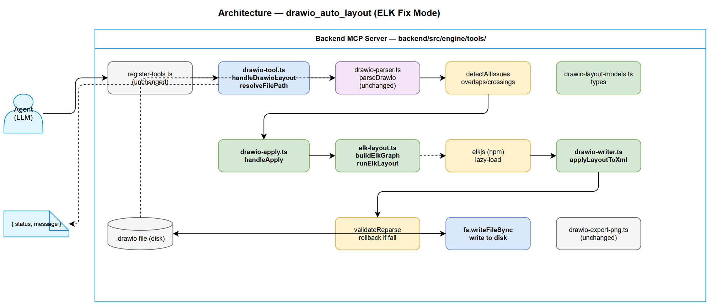
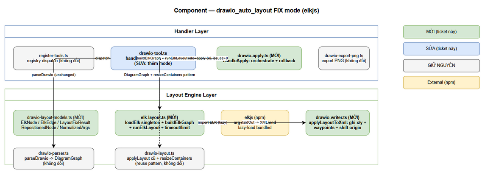
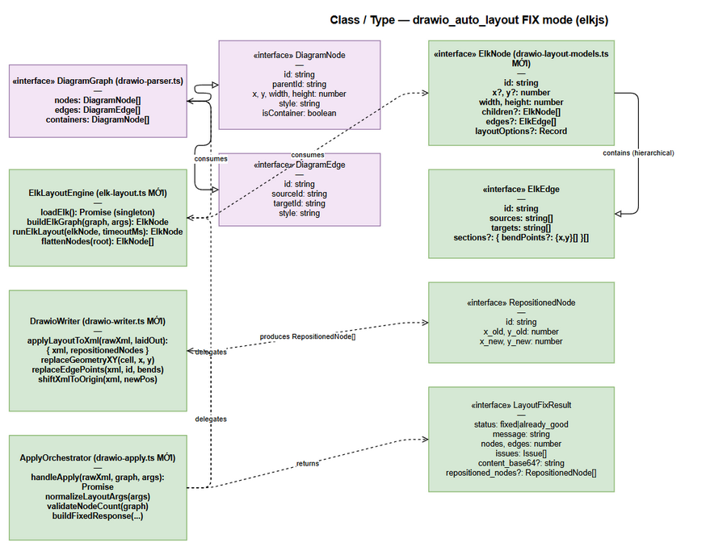

# Technical Design Document (TDD)

## SDLC Agents 4 Enterprise — SA4E-84: [drawio] Upgrade drawio_auto_layout to FIX mode — auto-layout reduce edge crossings with elkjs

---

## Document Information

| Field | Value |
|-------|-------|
| Jira Ticket | SA4E-84 |
| Title | [drawio] Upgrade drawio_auto_layout to FIX mode — auto-layout reduce edge crossings with elkjs |
| Author | SA Agent |
| Version | 1.2 |
| Date | 2026-08-01 |
| Status | Draft |
| Related BRD | `documents/SA4E-84/BRD.md` (v1.0) |
| Related FSD | `documents/SA4E-84/FSD.md` (v0.3 — SA discrepancy fixes) |

---

## Author Tracking

| Role | Name - Position | Responsibility |
|------|-----------------|----------------|
| Author | SA Agent – Solution Architect | Create document |
| Peer Reviewer | DEV Team – Backend Developer | Review document, implement |

---

## Revision History

| Version | Date | Author | Changes |
|---------|------|--------|---------|
| 1.0 | 2026-08-01 | SA Agent | Initiate document — auto-generated from BRD v1.0 and FSD v0.2 (TA-enriched) |
| 1.1 | 2026-08-01 | SA Agent | Align với FSD v0.3 (DISC-1/DISC-2 resolved): §5.3 `buildElkGraph` edge nội container → container `edges[]` theo ADR-4 (khớp FSD §6.8 P1 Step 4); cập nhật OQ-3 reference (FSD v0.3 RESOLVED); version bump 1.0 → 1.1 |
| 1.2 | 2026-08-01 | SA Agent | **Sync with implementation:** remove `mode` parameter (always detect+fix); input `file_path` only (no `content_base64`); minimal response `{status, message}` or `{error}`; tool writes file directly via `fs.writeFileSync`; add path traversal protection (`resolveFilePath`); spacing capped MAX_SPACING=500px; `parseEnvInt()` bounds validation. ADRs 6–8 added. |

---

## 1. Introduction

> **Scope Boundary:** This TDD specifies HOW to implement the requirements in FSD SA4E-84. Functional requirements, business rules, use cases, and JSON-Schema contracts are defined in FSD — this document focuses on: architecture decisions, module/file structure, class-level design with code sketches, data types, error handling, security, performance, and the step-by-step implementation checklist.

### 1.1 Purpose

Nâng cấp tool MCP **`drawio_auto_layout`** (`backend/src/engine/tools/drawio-tool.ts`) thành **detect + auto-fix** mode: tool nhận `file_path`, đọc file trực tiếp, phân tích layout issues, chạy **ELK layered layout** (qua package **elkjs**, thuần JS/TS, không cần binary) để tính lại vị trí node + edge routing, ghi tọa độ mới **trực tiếp vào file** (fs.writeFileSync), và trả response tối giản `{ status, message }`. Không có review-only mode — tool luôn detect + fix nếu có issues.

### 1.2 Scope

**In scope (backend — TypeScript):**
1. Thêm dependency `elkjs` vào `backend/package.json` (runtime dependency, lazy-load).
2. Nâng cấp `handleDrawioLayout` — nhận `file_path` (bắt buộc), đọc file trực tiếp, detect + fix luôn (không có mode parameter). Tham số layout tùy chọn (`algorithm`, `spacing`, `direction`).
3. Tách module theo SOLID: models riêng (`drawio-layout-models.ts`), ELK engine (`elk-layout.ts`), XML writer (`drawio-writer.ts`), apply orchestrator (`drawio-apply.ts`).
4. Tool ghi file trực tiếp (`fs.writeFileSync`) — không trả `content_base64`. Response tối giản: `{ status, message }` hoặc `{ error }`.
5. Path traversal protection: `resolveFilePath()` dùng `path.resolve()` + canonical check + workspace boundary.
6. Viết vitest unit tests.

**Out of scope (giữ nguyên):**
- `drawio-parser.ts` (schema `DiagramGraph` giữ nguyên — verified trong FSD §6.9 và code).
- `drawio-layout.ts` (algorithms cũ layered/force/mrtree/radial + `resizeContainers` pattern — giữ nguyên, chỉ reuse pattern).
- `drawio-export-png.ts` — KHÔNG đổi byte-code.
- `register-tools.ts` dispatch entry `drawio_auto_layout` — không cần sửa (verified: `p()` wrapper đã hỗ trợ `Promise<string>`).
- `drawio_export_png` pipeline và các test hiện có: `drawio-export.test.ts`, `CoreTools.test.ts`, `sa4e-testkit.ts`, `mcp-drawio-dispatch.test.ts`.

### 1.3 Technology Stack

| Layer | Technology | Version |
|-------|-----------|---------|
| Language | TypeScript (ESM, `"type": "module"`) | Node >= 18.14.1 |
| Runtime | Node.js | >= 18.14.1 (engines trong `backend/package.json`) |
| MCP Framework | `@modelcontextprotocol/sdk` | ^1.29.0 |
| HTTP Server | Hono + @hono/node-server | ^4.0.0 / ^1.12.0 |
| Layout Engine (MỚI) | **elkjs** | ^0.9.x (xác nhận bản mới nhất khi `npm install` — OI-7) |
| Test | Vitest | ^4.1.9 |
| Logging | pino | ^9.14.0 |

### 1.4 Design Principles

- **SOLID**: mỗi module một trách nhiệm — models / ELK engine / XML writer / orchestrator tách riêng; không nhồi logic vào `drawio-tool.ts`.
- **Giới hạn kích thước**: file ≤ 200 dòng, function ≤ 20 dòng (BR-10).
- **Preserve nguyên bản**: XML sau fix chỉ thay đổi đúng vùng tọa độ node + edge waypoints; phần còn lại (style, labels, attributes, container structure) giữ byte-for-byte (BR-5).
- **Fail-safe**: FIX mode không bao giờ ghi XML hỏng vào file — re-parse validate trước khi write (BR-7).
- **Minimal response**: Tool trả `{ status, message }` hoặc `{ error }` — không trả content/nodes/edges/issues trong response.
- **Direct file write**: Tool ghi file trực tiếp qua `fs.writeFileSync` — caller không cần decode base64.
- **Security-first**: Path traversal protection (`resolveFilePath`), spacing cap (MAX_SPACING=500px), env var bounds validation (`parseEnvInt`).
- **Lazy-load**: elkjs chỉ được dynamic-import khi có issues cần fix (NFR-P2).

### 1.5 Constraints

| # | Constraint | Nguồn |
|---|-----------|-------|
| C-1 | `file_path` bắt buộc; thiếu → `{ error: "file_path is required" }` | BR-1 |
| C-2 | Mọi lỗi trả dạng JSON `{ error: string }`, KHÔNG throw ra MCP | BRD §2.3 |
| C-3 | Tool **ghi file trực tiếp** — `handleApply()` dùng `fs.writeFileSync(filePath, xml)` | ADR-6 |
| C-4 | `drawio-parser.ts` / `drawio-export-png.ts` / `register-tools.ts` / `drawio-layout.ts` không đổi hành vi | BR-9, BR-8 |
| C-5 | ESM + Node >= 18.14.1 — elkjs import qua `elkjs/lib/elk.bundled.js` (dynamic import) | FSD §2.3.1 |
| C-6 | Không dùng Mermaid trong artifacts | AGENTS.md / BRD |
| C-7 | Node count ≤ 500 (env `SA4E_ELK_MAX_NODES`) và timeout ≤ 10s (env `SA4E_ELK_TIMEOUT_MS`) | NFR-P5 |
| C-8 | Path traversal protection — `resolveFilePath()` dùng `path.resolve()` + canonical check + workspace boundary (SEC-01) | CWE-22 |
| C-9 | Spacing capped: `MAX_SPACING = 500px` — prevent resource exhaustion (SEC-03) | Security |
| C-10 | Env vars validated: `parseEnvInt()` với min/max bounds (SEC-02) | Security |

### 1.6 References

| Document | Location |
|----------|----------|
| BRD SA4E-84 | `documents/SA4E-84/BRD.md` |
| FSD SA4E-84 (v0.3 — SA discrepancy fixes) | `documents/SA4E-84/FSD.md` |
| Tool hiện tại (REVIEW only) | `backend/src/engine/tools/drawio-tool.ts` (169 dòng) |
| Parser (giữ nguyên) | `backend/src/engine/tools/drawio-parser.ts` (118 dòng) |
| Layout algorithms cũ (giữ nguyên) | `backend/src/engine/tools/drawio-layout.ts` (143 dòng) |
| PNG export (KHÔNG được vỡ) | `backend/src/engine/tools/drawio-export-png.ts` (111 dòng) |
| Tool registry | `backend/src/engine/tools/register-tools.ts` (162 dòng) |
| Package.json | `backend/package.json` |
| Steering (cập nhật) | `.kiro/steering/drawio.md` (507 dòng) |
| Test kit hiện có | `backend/src/__tests__/sa4e-testkit.ts` |
| drawio-skill reference | https://github.com/Agents365-ai/drawio-skill |

### 1.7 Open Issues Resolution (OQ-1..OQ-16 → Decisions)

> Quyết định thiết kế chốt trong TDD này, đánh dấu trạng thái cho Open Issue Tracker (FSD §9.2). Số "D-n" được tham chiếu trong các mục sau.

| OQ | FSD Recommendation | TDD Decision (D-#) | Rationale |
|----|--------------------|--------------------|-----------|
| OQ-1 | case-insensitive + default review | **D-1:** ~~SUPERSEDED by ADR-6~~ — `mode` parameter removed entirely. Tool always detect+fix. No review-only mode. | Simplification: giảm API surface, giảm test matrix. Agent không cần chọn mode. |
| OQ-2 | giữ kích thước node | **D-2:** ELK nhận `width/height` hiện tại; chỉ thay `x/y`. Layered không resize node. | Preserve nguyên bản (BR-5). |
| OQ-3 | hỗ trợ đủ 4 algorithms (`layered/force/mrtree/radial`) — map sang ELK; fallback `layered` (FSD v0.3 **RESOLVED** — DISC-1) | **D-3:** hỗ trợ đủ 4 algorithms (`layered/force/mrtree/radial`) → map ELK algorithm id. | JSON Schema 6.7.1 + AF-2.2 là contract chính thức. |
| OQ-4 | dynamic import | **D-4:** lazy-load qua singleton `loadElk()` trong `elk-layout.ts`. | Không block startup (NFR-P2). |
| OQ-5 | chỉ trả khi `fixed` | **D-5:** `content_base64` + `repositioned_nodes` chỉ xuất hiện khi `status="fixed"`. | Tiết kiệm payload; khớp JSON Schema. |
| OQ-6 | (mở) | **D-6:** writer dùng **regex/string-edit** có kiểm soát trên raw XML + re-parse validate (giống kỹ thuật parser hiện có). | Parser hiện tại regex-based; re-parse validate đảm bảo BR-7. |
| OQ-7 | cạnh source | **D-7:** test đặt `backend/src/engine/tools/__tests__/drawio-tool.test.ts`. | Khớp convention `artifact-analyzer.test.ts` + vitest include `src/**/*.test.ts`. |
| OQ-8 | (mở) | **D-8:** không có Jira tool trong env — linked tickets không verify; bỏ qua (không ảnh hưởng design). | N/A. |
| OQ-9 | 50% (EF-3.3) | **D-9:** nếu node trong ELK output bị skip khi serialize > 50% → trả `error`; nếu ≤ 50% → log warning + giữ tọa độ cũ. | Tránh trả XML "nửa fix". |
| OQ-10 | có shift | **D-10:** nếu ELK trả x/y âm (direction LEFT/UP) → shift toàn bộ về (0,0) trước khi serialize; offset cộng vào cả `repositioned_nodes` báo cáo. | Tránh node off-canvas (AF-3.3). |
| OQ-11 | absolute | **D-11:** waypoints ghi **absolute** cho edge `parent="1"` (đa số). Edge trong container (parent≠1) — v1 bỏ qua waypoints, log warning (parser không expose edge parent nên cần đọc raw XML attribute). | Khớp draw.io `<Array as="points">`; giới hạn risk v1. |
| OQ-12 | giữ edgeStyle gốc | **D-12:** KHÔNG thêm/sửa `edgeStyle`; chỉ thêm/thay `<Array as="points">` khi ELK trả bendPoints. | AF-4.3; tránh thay đổi render. |
| OQ-13 | resize container sau | **D-13:** ELK layout children theo parent group (hierarchical); sau đó `resizeContainers` (reuse pattern `drawio-layout.ts`) tính lại bounds container; KHÔNG để ELK di chuyển container position (dùng tọa độ container từ ELK root, chỉ resize). | Risk R1 BRD. |
| OQ-14 | default cycle breaking | **D-14:** dùng default ELK layered cycle breaking (GREEDY) — không config thêm. | EF-3.2. |
| OQ-15 | có env config | **D-15:** `SA4E_ELK_MAX_NODES` (default 500), `SA4E_ELK_TIMEOUT_MS` (default 10000) đọc từ `process.env`. | Dễ điều chỉnh. |
| OQ-16 | epsilon 0.5px | **D-16:** idempotency test so sánh positions với epsilon 0.5px. | Tránh floating-point jitter. |

---

## 2. Architecture Overview

### 2.1 High-Level Architecture

Flow end-to-end: **Agent (LLM)** → gọi MCP tool `drawio_auto_layout` qua JSON-RPC → backend dispatch registry → `handleDrawioLayout` → `resolveFilePath` (path traversal check) → `parseDrawio(filePath)` → `detectAllIssues` → nếu có issues → ELK pipeline (`buildElkGraph` → `runElkLayout` → `applyLayoutToXml` → re-parse validate → `fs.writeFileSync`) → trả `{ status: "fixed", message }`. Agent chỉ nhận metadata, file đã được ghi.


*[Edit in draw.io](diagrams/architecture.drawio)*

### 2.2 Component Responsibilities

| Component | File | Responsibility | Status |
|-----------|------|---------------|--------|
| Tool handler | `drawio-tool.ts` | Entry point `handleDrawioLayout` (async): resolve file path, parse, detect issues, dispatch fix. Contains `resolveFilePath` (SEC-01) + `detectAllIssues` + helpers. | **SỬA** |
| Apply orchestrator | `drawio-apply.ts` (MỚI) | `handleApply`: normalize args, guard node limit, orchestrate ELK pipeline, write fixed XML to file, return minimal response. | **TẠO MỚI** |
| ELK engine | `elk-layout.ts` (MỚI) | Singleton lazy ELK loader + `buildElkGraph` + `runElkLayout` (timeout, validate output) + flatten/collectEdges. | **TẠO MỚI** |
| XML writer | `drawio-writer.ts` (MỚI) | `applyLayoutToXml`: ghi x/y mới vào `<mxGeometry>`, waypoints vào edge cells, normalize negative coords. | **TẠO MỚI** |
| Models | `drawio-layout-models.ts` (MỚI) | Types: `ElkNode`, `ElkEdge`, `RepositionedNode`, `LayoutFixResult`, `NormalizedArgs`. | **TẠO MỚI** |
| Parser | `drawio-parser.ts` | `parseDrawio(filePath) → { raw, graph }`; `DiagramGraph/DiagramNode/DiagramEdge`. | Không đổi |
| Layout algorithms cũ | `drawio-layout.ts` | `applyLayout` (layered/force/mrtree/radial) + `resizeContainers` pattern (reuse). | Không đổi |
| PNG export | `drawio-export-png.ts` | Export PNG — tách biệt, không import elkjs. | Không đổi |
| Registry | `register-tools.ts` | `TOOL_HANDLER_REGISTRY` — entry `drawio_auto_layout` giữ nguyên. | Không đổi |
| External dep | `elkjs` (npm) | ELK layout engine — lazy-load chỉ khi `mode=apply`. | **THÊM dep** |
| Steering | `.kiro/steering/drawio.md` | Workflow `mode=apply` cho agents. | **SỬA** |

### 2.3 Communication Patterns / Data Flow

| From | To | Mechanism | Pattern | Description |
|------|----|-----------|---------|-------------|
| Agent (LLM) | `drawio_auto_layout` | MCP JSON-RPC `tools/call` | Sync request/response | `file_path` (+ `algorithm`/`spacing`/`direction`) |
| `handleDrawioLayout` | `resolveFilePath` | Function call (sync) | Sync | Path traversal check + canonical resolve within workspace |
| `handleDrawioLayout` | `drawio-parser.ts` | Function call (sync) | Sync | `parseDrawio(filePath)` — reads file directly |
| `handleDrawioLayout` | `drawio-apply.ts` | `await handleApply(...)` | Async | Always called when `issues.length > 0` |
| `drawio-apply.ts` | `elk-layout.ts` | `buildElkGraph` (sync) + `await runElkLayout` (async) | Async | ELK singleton loader; timeout 10s |
| `elk-layout.ts` | `elkjs` | `import('elkjs/lib/elk.bundled.js')` | Lazy async | Dynamic import lần đầu; cache singleton |
| `drawio-apply.ts` | `drawio-writer.ts` | `applyLayoutToXml` (sync) | Sync | Serialize tọa độ + waypoints vào XML |
| `drawio-apply.ts` | `drawio-parser.ts` | `parseDrawio(tmp)` (re-parse) | Sync | Validate XML sau fix; fail → không ghi file (BR-7) |
| `drawio-apply.ts` | file system | `fs.writeFileSync(filePath, xml)` | Sync | Ghi fixed XML trực tiếp vào file gốc |

### 2.4 Key Architectural Decisions (ADR)

| ADR | Decision | Alternatives Rejected | Consequence |
|-----|----------|----------------------|-------------|
| ADR-1 | `handleDrawioLayout` chuyển từ sync → **async** (`Promise<string>`) | Giữ sync + chặn event loop khi chạy ELK | `register-tools.ts` `p()` đã wrap Promise — KHÔNG cần sửa registry; giữ signature `(args, workspace)`. |
| ADR-2 | Tách 4 file mới thay vì nhồi vào `drawio-tool.ts` | Thêm logic apply inline | `drawio-tool.ts` giữ ~150 dòng (< 200); mỗi module single-responsibility; unit test từng phần. |
| ADR-3 | Regex/string-edit writer + re-parse validate | XML DOM parser (fast-xml-parser) | Parser hiện tại regex-based; DOM parser sẽ đổi format serialize (vỡ preserve byte-for-byte). Regex có kiểm soát + re-parse validate (BR-7) là an toàn. |
| ADR-4 | ELK edges: edge nội container đặt trong `edges[]` của container node; edge cross-container đặt ở root | Tất cả edges ở root (FSD P1) | Routing chính xác hơn cho container; tinh chỉnh từ FSD P1 (xem DISC-2). |
| ADR-5 | ELK graph hierarchical (containers có `children`) + resize sau | Chạy layout riêng từng container | ELK xử lý compound node tự nhiên; reuse `resizeContainers` pattern hiện có. |
| ADR-6 | **Remove `mode` parameter — tool luôn detect + fix** | Giữ review/apply dual-mode | Simplification: caller không cần biết mode nào; tool tự detect issues, nếu có → fix + ghi file. Nếu không → trả `already_good`. Giảm API surface, giảm test matrix. |
| ADR-7 | **Minimal response — chỉ `{status, message}` hoặc `{error}`** | Trả `content_base64` + `repositioned_nodes` + `issues` + `nodes`/`edges` | Tool ghi file trực tiếp → caller không cần decode base64. Response nhẹ, agent chỉ cần biết thành công hay thất bại. Giảm token usage cho LLM. |
| ADR-8 | **Tool ghi file trực tiếp (`fs.writeFileSync`)** | Trả content_base64 cho caller tự ghi | Đơn giản hóa caller workflow; tool kiểm soát toàn bộ write path + validate trước khi ghi; path traversal protection tại tool level. |

---

## 3. Module Design (File Structure)

### 3.1 File Map — Create / Modify / Unchanged

```
backend/
├── package.json                                   [SỬA]  thêm "elkjs": "^0.9.x" vào dependencies
├── src/engine/tools/
│   ├── drawio-tool.ts                             [SỬA]  handleDrawioLayout → async, file_path input, no mode, resolveFilePath (SEC-01)
│   ├── drawio-layout-models.ts                    [TẠO MỚI] types: ElkNode/ElkEdge/RepositionedNode/LayoutFixResult/NormalizedArgs
│   ├── elk-layout.ts                              [TẠO MỚI] loadElk singleton + buildElkGraph + runElkLayout + flatten/collectEdges
│   ├── drawio-writer.ts                           [TẠO MỚI] applyLayoutToXml + geometry/waypoint/shift helpers
│   ├── drawio-apply.ts                            [TẠO MỚI] handleApply orchestrator + normalizeLayoutArgs + validateReparse
│   ├── drawio-parser.ts                           [KHÔNG ĐỔI]
│   ├── drawio-layout.ts                           [KHÔNG ĐỔI]
│   ├── drawio-export-png.ts                       [KHÔNG ĐỔI]
│   ├── register-tools.ts                          [KHÔNG ĐỔI]  (p() đã wrap Promise<string>)
│   └── __tests__/
│       ├── drawio-tool.test.ts                    [TẠO MỚI] unit tests review + apply modes
│       └── drawio-apply.test.ts                   [TẠO MỚI] (tùy chọn) unit test normalizeLayoutArgs/rollback
├── tests/integration/
│   ├── drawio-export.test.ts                      [KHÔNG ĐỔI]
│   └── mcp-drawio-dispatch.test.ts                [KHÔNG ĐỔI]
├── src/config/__tests__/CoreTools.test.ts         [KHÔNG ĐỔI]
└── src/__tests__/sa4e-testkit.ts                  [KHÔNG ĐỔI]

.kiro/steering/drawio.md                           [SỬA]  thêm FIX mode workflow (mode=apply)
backend/README.md                                  [SỬA — tùy chọn] mô tả mode=apply trong tool list (FR-10 COULD HAVE)
```

### 3.2 Component Diagram


*[Edit in draw.io](diagrams/component.drawio)*

### 3.3 Module Dependencies

```
drawio-tool.ts ──> drawio-parser.ts          (parseDrawio, DiagramGraph, DiagramNode)
drawio-tool.ts ──> drawio-apply.ts           (handleApply)   [always, when issues > 0]
drawio-apply.ts ──> drawio-parser.ts         (parseDrawio — re-parse validate)
drawio-apply.ts ──> drawio-layout-models.ts  (NormalizedArgs)
drawio-apply.ts ──> elk-layout.ts            (buildElkGraph, runElkLayout)
drawio-apply.ts ──> drawio-writer.ts         (applyLayoutToXml)
elk-layout.ts ────> drawio-layout-models.ts  (ElkNode, ElkEdge, NormalizedArgs)
elk-layout.ts ────> elkjs                    (dynamic import — lazy, singleton)
drawio-writer.ts ──> drawio-layout-models.ts (ElkNode, RepositionedNode)
drawio-writer.ts ──> elk-layout.ts           (flatten, collectEdges)
drawio-apply.ts ──> drawio-layout.ts         (resizeContainers pattern — REUSE, không gọi trực tiếp)
```

> **Không có** dependency vòng; `drawio-export-png.ts` và `drawio-layout.ts` không import elkjs (NFR-P8).

---

## 4. API Design

> **Prerequisite:** Contract nghiệp vụ đầy đủ (JSON Schema, ví dụ, checklist) trong FSD §6.7. Mục này đặc tả kỹ thuật implement. `drawio_auto_layout` là MCP tool qua JSON-RPC `tools/call` — không có HTTP endpoint riêng (khớp cơ chế dispatch `register-tools.ts`).

### 4.1 Tool Contract Overview

| # | Tool | Transport | Description | Source |
|---|------|-----------|-------------|--------|
| 1 | `drawio_auto_layout` | MCP `tools/call` (JSON-RPC) | Analyze and auto-fix draw.io diagram layout | UC-1, UC-2, FR-2..FR-8 |

**Handler:** `handleDrawioLayout(args, workspace): Promise<string>` — response luôn là **JSON string** (không throw). Registry: `drawio_auto_layout: (a, ctx) => p(handleDrawioLayout(a, ctx.workspace))` — **không đổi** (ADR-1).

### 4.2 Input Schema (implement trong `DRAWIO_TOOL_DEFINITION.inputSchema`)

> Tool nhận `file_path` — extension đọc file trực tiếp. KHÔNG nhận `content_base64` từ caller (ADR-8). Không có `mode` parameter — tool luôn detect + fix (ADR-6).

```json
{
  "type": "object",
  "properties": {
    "file_path": { "type": "string", "description": "Path to .drawio file (relative to workspace or absolute)" },
    "algorithm": { "type": "string", "enum": ["layered", "force", "mrtree", "radial"], "description": "Layout algorithm (default: layered)" },
    "spacing": { "type": "number", "description": "Node spacing in pixels (default: 80, max: 500)" },
    "direction": { "type": "string", "enum": ["DOWN", "RIGHT", "LEFT", "UP"], "description": "Layout direction (default: DOWN)" }
  },
  "required": ["file_path"]
}
```

**Normalization (D-3, AF-2.3..2.5):** `algorithm` không hợp lệ → `layered`; `spacing` ≤ 0 hoặc non-number → 80, capped tại MAX_SPACING=500 (SEC-03); `direction` không hợp lệ → `DOWN`. Mọi fallback đều không fail.

**Path resolution (SEC-01):** `resolveFilePath(filePath, workspace)` → `path.resolve()` + canonical check + verify trong workspace boundary. Nếu path escape workspace → return `null` → `{ error: "file_path is required" }`.

### 4.3 Output Schemas

#### 4.3.1 Success — Fixed (`status: "fixed"`)

```json
{
  "status": "fixed",
  "message": "Fixed 2 issues with ELK layered layout. 3 nodes repositioned."
}
```

- Tool đã ghi XML mới trực tiếp vào `file_path` qua `fs.writeFileSync`.
- Response **KHÔNG** chứa `content_base64`, `repositioned_nodes`, `nodes`, `edges`, `issues` (ADR-7).

#### 4.3.2 Success — Already Good (`status: "already_good"`)

```json
{
  "status": "already_good",
  "message": "Diagram looks good — no overlapping nodes or edge crossings detected."
}
```

- Không ghi file — giữ nguyên.

#### 4.3.3 Error

```json
{ "error": "file_path is required" }
{ "error": "File not found or not accessible" }
{ "error": "Layout engine failed. Please check input diagram and retry." }
```

### 4.4 Contract Rules Checklist (implement gate)

| # | Rule | Implementation |
|---|------|----------------|
| 1 | Response chỉ `{status, message}` hoặc `{error}` — không trả nodes/edges/issues/content_base64 | `handleApply` return `JSON.stringify({status, message})` |
| 2 | Tool ghi file trực tiếp khi fix thành công | `fs.writeFileSync(filePath, xml, 'utf-8')` trong `handleApply` |
| 3 | Validate XML trước khi ghi (BR-7) | `validateReparse(xml)` trước `writeFileSync` |
| 4 | Path traversal protection | `resolveFilePath()` canonical check + workspace boundary (SEC-01) |
| 5 | Input invalid → `{ error }`, không throw | try/catch wrap toàn pipeline |
| 6 | Spacing capped tại MAX_SPACING=500px | `Math.min(rawSpacing, MAX_SPACING)` trong `normalizeLayoutArgs` (SEC-03) |

---

## 5. Class / Module Design

### 5.1 Class Diagram


*[Edit in draw.io](diagrams/class.drawio)*

### 5.2 `drawio-layout-models.ts` (MỚI — ~55 dòng)

> Implements: BR-10 (tách model), UC-3/UC-4. Chỉ chứa types + pure interfaces — không logic.

```typescript
/** ELK graph node — input/output của elk.layout(). */
export interface ElkNode {
  id: string;
  x?: number;
  y?: number;
  width: number;
  height: number;
  children?: ElkNode[];
  edges?: ElkEdge[];
  layoutOptions?: Record<string, string | number>;
}

export interface ElkEdge {
  id: string;
  sources: string[];
  targets: string[];
  sections?: Array<{
    startPoint?: { x: number; y: number };
    bendPoints?: Array<{ x: number; y: number }>;
    endPoint?: { x: number; y: number };
  }>;
}

export interface RepositionedNode {
  id: string;
  x_old: number;
  y_old: number;
  x_new: number;
  y_new: number;
}

/** Response payload — minimal (ADR-7). Tool ghi file trực tiếp, không trả content. */
export interface LayoutFixResult {
  status: 'fixed' | 'already_good';
  message: string;
}

/** Args đã normalize + validate cho apply mode. */
export interface NormalizedArgs {
  algorithm: string;
  spacing: number;
  direction: string;
}
```

### 5.3 `elk-layout.ts` (MỚI — ~130 dòng)

> Implements: UC-3, FR-4, FSD §2.3.1 + §6.8 P1/P2. Singleton ELK loader + build graph + run layout.

```typescript
import type { DiagramGraph } from './drawio-parser.js';
import type { ElkNode, ElkEdge, NormalizedArgs } from './drawio-layout-models.js';

// ── Singleton ELK loader (D-4): lazy import, load đúng 1 lần per process (FSD §2.3.1)
let elkPromise: Promise<typeof import('elkjs/lib/elk.bundled.js')> | null = null;
export function loadElk(): Promise<typeof import('elkjs/lib/elk.bundled.js')> {
  if (!elkPromise) elkPromise = import('elkjs/lib/elk.bundled.js');
  return elkPromise;
}

// ── Algorithm mapping (D-3): layered|force|mrtree|radial → ELK id (FSD §2.3.2)
const ALGORITHM_MAP: Record<string, string> = {
  layered: 'org.eclipse.elk.layered',
  force: 'org.eclipse.elk.force',
  mrtree: 'org.eclipse.elk.mrtree',
  radial: 'org.eclipse.elk.radial',
};
export function mapAlgorithm(algorithm: string): string {
  return ALGORITHM_MAP[algorithm] ?? ALGORITHM_MAP.layered;
}

/** P1: build ELK graph từ DiagramGraph (hierarchical — container có children). */
export function buildElkGraph(graph: DiagramGraph, args: NormalizedArgs): ElkNode {
  const root: ElkNode = { id: 'root', children: [], edges: [], layoutOptions: {} };
  const nodeMap = new Map<string, ElkNode>();
  for (const n of [...graph.nodes, ...graph.containers]) {
    nodeMap.set(n.id, { id: n.id, width: n.width, height: n.height });  // D-2: giữ kích thước
  }
  for (const n of [...graph.nodes, ...graph.containers]) {
    const elkNode = nodeMap.get(n.id)!;
    if (n.parentId && n.parentId !== '1' && nodeMap.has(n.parentId)) {
      const parent = nodeMap.get(n.parentId)!;
      parent.children = parent.children ?? [];
      parent.children.push(elkNode);
    } else {
      root.children!.push(elkNode);
    }
  }
  for (const e of graph.edges) {
    if (!nodeMap.has(e.sourceId) || !nodeMap.has(e.targetId)) continue;  // EF-3.3: skip dangling
    const edge: ElkEdge = { id: e.id, sources: [e.sourceId], targets: [e.targetId] };
    // ADR-4 (khớp FSD v0.3 §6.8 P1 Step 4): edge nội container → container.edges[]; cross-container/root → root.edges!
    const srcParent = [...graph.nodes, ...graph.containers].find(n => n.id === e.sourceId)?.parentId ?? '1';
    const tgtParent = [...graph.nodes, ...graph.containers].find(n => n.id === e.targetId)?.parentId ?? '1';
    const sameContainer = srcParent !== '1' && srcParent === tgtParent && nodeMap.has(srcParent);
    if (sameContainer) {
      const containerElk = nodeMap.get(srcParent)!;
      containerElk.edges = containerElk.edges ?? [];
      containerElk.edges.push(edge);        // edge nội container — trong children[] của container level
    } else {
      root.edges!.push(edge);               // edge root-level / cross-container
    }
  }
  root.layoutOptions = {
    'elk.algorithm': mapAlgorithm(args.algorithm),
    'elk.direction': args.direction,
    'elk.spacing.nodeNode': args.spacing,
    'elk.layered.spacing.nodeNodeBetweenLayers': args.spacing * 2,
  };
  return root;
}

/** P2: chạy ELK layout với timeout + validate output. */
export async function runElkLayout(elkGraph: ElkNode, timeoutMs: number): Promise<ElkNode> {
  const ELK = await loadElk();
  const elk = new ELK();
  const laidOut = await withTimeout(elk.layout(elkGraph, { layoutOptions: elkGraph.layoutOptions }), timeoutMs);
  validateLayoutOutput(laidOut);
  return laidOut;
}

function withTimeout<T>(promise: Promise<T>, ms: number): Promise<T> {
  return Promise.race([
    promise,
    new Promise<T>((_, reject) =>
      setTimeout(() => reject(new Error(`ELK layout timed out after ${ms}ms`)), ms),
    ),
  ]);
}

/** EF-2.7: node output không hợp lệ (NaN/negative size) → throw → rollback. */
function validateLayoutOutput(root: ElkNode): void {
  for (const node of flatten(root)) {
    if (!Number.isFinite(node.x) || !Number.isFinite(node.y) || node.width <= 0 || node.height <= 0) {
      throw new Error(`ELK returned invalid coordinates for node '${node.id}'`);
    }
  }
}

/** Flatten toàn bộ node (bao gồm children trong container) — absolute/relative theo parent. */
export function flatten(root: ElkNode): ElkNode[] {
  const out: ElkNode[] = [];
  const stack = [...(root.children ?? [])];
  while (stack.length > 0) {
    const node = stack.pop()!;
    out.push(node);
    if (node.children) stack.push(...node.children);
  }
  return out;
}

/** Thu thập toàn bộ edges (root + trong container). */
export function collectEdges(root: ElkNode): ElkEdge[] {
  const out: ElkEdge[] = [];
  for (const node of flatten(root)) {
    if (node.edges) out.push(...node.edges);
  }
  return out;
}
```

> **ADR-4 (khớp FSD v0.3 §6.8 P1 Step 4):** edge nội container (source & target cùng `parentId` là container) được đặt trong `edges[]` của container ELK node — ELK route trong không gian **relative** của container; bend points khi serialize khớp tọa độ relative của edge cell. Edge cross-container / root-level đặt ở `root.edges!` (parent="1"). Cách xác định "nội container" = so sánh `parentId` của source & target node — **không cần sửa `drawio-parser.ts`** (`DiagramEdge` không có parent; `DiagramNode.parentId` default `'1'`, xem §6.3). Waypoints v1 chỉ ghi cho edge root-parent (`parent="1"`) — D-11.

### 5.4 `drawio-writer.ts` (MỚI — ~160 dòng)

> Implements: UC-4, FR-5, FSD §6.8 P3. Regex/string-edit có kiểm soát trên raw XML (D-6).

```typescript
import type { ElkNode, ElkEdge, RepositionedNode } from './drawio-layout-models.js';
import { flatten, collectEdges } from './elk-layout.js';

export interface XmlWriteResult {
  xml: string;
  repositionedNodes: RepositionedNode[];
}

/** P3: ghi tọa độ mới + edge waypoints vào raw XML; normalize negative coords (D-10). */
export function applyLayoutToXml(rawXml: string, laidOut: ElkNode): XmlWriteResult {
  const newPosRaw = collectNewPos(laidOut);                  // id -> {x,y} từ ELK
  const oldPos = readCurrentPositions(rawXml);               // id -> {x,y} từ XML gốc
  const { dx, dy } = normalizeOffset(newPosRaw);             // shift về (0,0) nếu có âm
  const newPos = shiftBy(newPosRaw, dx, dy);                 // báo cáo tọa độ sau shift
  let xml = rawXml;
  for (const [id, pos] of newPos) xml = replaceCellGeometry(xml, id, pos.x, pos.y);
  for (const edge of collectEdges(laidOut)) xml = replaceEdgeWaypoints(xml, edge, dx, dy);
  return { xml, repositionedNodes: buildRepositioned(oldPos, newPos) };
}

/** Thu thập tọa độ mới từ ELK (flatten cả children trong container). */
function collectNewPos(laidOut: ElkNode): Map<string, { x: number; y: number }> {
  const map = new Map<string, { x: number; y: number }>();
  for (const node of flatten(laidOut)) {
    if (node.x !== undefined && node.y !== undefined) map.set(node.id, { x: node.x, y: node.y });
  }
  return map;
}

/** Đọc tọa độ cũ từ XML (để tính x_old/y_old cho repositioned_nodes). */
function readCurrentPositions(xml: string): Map<string, { x: number; y: number }> {
  const map = new Map<string, { x: number; y: number }>();
  const cellRegex = /<mxCell\s([^>]*?)(?:\/>|>([\s\S]*?)<\/mxCell>)/g;
  let m: RegExpExecArray | null;
  while ((m = cellRegex.exec(xml)) !== null) {
    const id = /id="([^"]+)"/.exec(m[1])?.[1];
    const geom = /<mxGeometry\s([^>]*?)(?:\/>|>)/.exec(m[2] ?? '');
    if (!id || !geom) continue;
    const x = parseFloat(/x="([^"]+)"/.exec(geom[1])?.[1] ?? '0');
    const y = parseFloat(/y="([^"]+)"/.exec(geom[1])?.[1] ?? '0');
    map.set(id, { x, y });
  }
  return map;
}

/** Đổi x/y trong <mxGeometry> của cell có id — giữ NGUYÊN width/height/style (EF-4.1 skip nếu không tìm thấy). */
function replaceCellGeometry(xml: string, id: string, x: number, y: number): string {
  const cellRegex = new RegExp(`(<mxCell\\b[^>]*\\bid="${id}"[^>]*>)([\\s\\S]*?)(</mxCell>)`);
  return xml.replace(cellRegex, (whole, open: string, body: string, close: string) => {
    const geomRegex = /(<mxGeometry\b[^>]*)(\sx="[^"]*")(\sy="[^"]*")(\s[^>]*?)(\/>|>)/;
    const fixed = body.replace(geomRegex, (_g, head: string, _x: string, _y: string, tail: string, end: string) =>
      `${head} x="${round(x)}" y="${round(y)}"${tail}${end}`);
    return fixed === body ? whole : `${open}${fixed}${close}`;
  });
}

/** Waypoints: chỉ khi ELK trả bendPoints VÀ edge parent="1" (D-11); absolute + offset (D-10). */
function replaceEdgeWaypoints(xml: string, edge: ElkEdge, dx: number, dy: number): string {
  const bends = edge.sections?.flatMap(s => s.bendPoints ?? []) ?? [];
  if (bends.length === 0) return xml;
  const cellRegex = new RegExp(`(<mxCell\\b[^>]*\\bid="${edge.id}"[^>]*edge="1"[^>]*>)([\\s\\S]*?)(</mxCell>)`);
  return xml.replace(cellRegex, (whole, open: string, body: string, close: string) => {
    const parent = /parent="([^"]+)"/.exec(open)?.[1] ?? '1';
    if (parent !== '1') return whole;                              // D-11: skip container edges
    const pointsXml = bends.map(b => `<mxPoint x="${round(b.x + dx)}" y="${round(b.y + dy)}"/>`).join('');
    const withPoints = body.replace(
      /(<mxGeometry\b[^>]*relative="1"[^>]*>)([\s\S]*?)(<\/mxGeometry>)/,
      (_g, head: string, inner: string, tail: string) => `${head}${inner.replace(/<Array as="points">[\s\S]*?<\/Array>/, '')}<Array as="points">${pointsXml}</Array>${tail}`,
    );
    return withPoints === body ? whole : `${open}${withPoints}${close}`;
  });
}

/** D-10: nếu ELK trả x/y âm → shift toàn bộ về (0,0). */
function normalizeOffset(pos: Map<string, { x: number; y: number }>): { dx: number; dy: number } {
  let minX = 0, minY = 0;
  for (const p of pos.values()) { minX = Math.min(minX, p.x); minY = Math.min(minY, p.y); }
  return { dx: minX < 0 ? -minX : 0, dy: minY < 0 ? -minY : 0 };
}

function shiftBy(pos: Map<string, { x: number; y: number }>, dx: number, dy: number): Map<string, { x: number; y: number }> {
  const out = new Map<string, { x: number; y: number }>();
  for (const [id, p] of pos) out.set(id, { x: p.x + dx, y: p.y + dy });
  return out;
}

/** Chỉ liệt kê node có tọa độ THỰC SỰ đổi (epsilon 0.5 — D-16). */
function buildRepositioned(oldPos: Map<string, { x: number; y: number }>, newPos: Map<string, { x: number; y: number }>): RepositionedNode[] {
  const out: RepositionedNode[] = [];
  for (const [id, p] of newPos) {
    const o = oldPos.get(id);
    if (!o) continue;
    if (Math.abs(o.x - p.x) > 0.5 || Math.abs(o.y - p.y) > 0.5) {
      out.push({ id, x_old: o.x, y_old: o.y, x_new: p.x, y_new: p.y });
    }
  }
  return out;
}

function round(v: number): number { return Math.round(v * 10) / 10; }
```

> **EF-4.2:** nếu mọi `replaceCellGeometry` không match cell nào trong vùng cần sửa và tỷ lệ skip > 50% → `handleApply` trả error (D-9). Regex chỉ match cell có đúng `id=` — tránh match nhầm node khác.

### 5.5 `drawio-apply.ts` (MỚI — ~110 dòng)

> Implements: UC-2, BR-7, FSD §6.8 P4. Orchestrator — normalize args, run ELK, validate, write file, return minimal response.

```typescript
import * as fs from 'fs';
import * as path from 'path';
import * as os from 'os';
import type { DiagramGraph } from './drawio-parser.js';
import { parseDrawio } from './drawio-parser.js';
import type { NormalizedArgs } from './drawio-layout-models.js';
import { buildElkGraph, runElkLayout } from './elk-layout.js';
import { applyLayoutToXml } from './drawio-writer.js';

/**
 * Parse an integer from environment variable with bounds validation (SEC-02).
 * Returns defaultVal if env var is missing, NaN, out of bounds, or non-finite.
 */
function parseEnvInt(envVar: string, defaultVal: number, min: number, max: number): number {
  const raw = process.env[envVar];
  if (raw === undefined) return defaultVal;
  const parsed = Number(raw);
  if (!Number.isFinite(parsed) || parsed < min || parsed > max) return defaultVal;
  return Math.floor(parsed);
}

// BR-7: configurable limits via env (NFR-P5) — with bounds validation (SEC-02)
const MAX_NODES = parseEnvInt('SA4E_ELK_MAX_NODES', 500, 1, 5000);
const TIMEOUT_MS = parseEnvInt('SA4E_ELK_TIMEOUT_MS', 10_000, 1000, 60_000);

/** Maximum spacing in pixels to prevent resource exhaustion (SEC-03). */
const MAX_SPACING = 500;

/**
 * Orchestrate ELK layout fix: build graph → run ELK → validate → write to file → return metadata.
 * Returns JSON string with {status, message} or {error}. No content_base64 in response (ADR-7).
 */
export async function handleApply(
  rawXml: string, graph: DiagramGraph, issues: object[], nodeCount: number,
  args: Record<string, unknown>, filePath: string,
): Promise<string> {
  if (nodeCount > MAX_NODES) return error(`Diagram too large (${nodeCount} nodes, max ${MAX_NODES})`);
  const normalized = normalizeLayoutArgs(args);
  try {
    const elkGraph = buildElkGraph(graph, normalized);
    const laidOut = await runElkLayout(elkGraph, TIMEOUT_MS);
    const { xml, repositionedNodes } = applyLayoutToXml(rawXml, laidOut);
    // D-9: if no nodes repositioned → abort
    if (repositionedNodes.length === 0) return error('ELK layout produced no position changes');
    validateReparse(xml);
    // Write fixed XML directly to file (ADR-8 — no content_base64 in response)
    fs.writeFileSync(filePath, xml, 'utf-8');
    return JSON.stringify({
      status: 'fixed',
      message: `Fixed ${issues.length} issues with ELK ${normalized.algorithm} layout. ${repositionedNodes.length} nodes repositioned.`,
    });
  } catch (e: any) {
    // SEC-05: Log full error internally, return generic message to caller
    console.error('[drawio-apply] ELK layout error:', e);
    return error('Layout engine failed. Please check input diagram and retry.');
  }
}

/** Normalize layout args with safe defaults and upper bounds (SEC-03). */
export function normalizeLayoutArgs(args: Record<string, unknown>): NormalizedArgs {
  const VALID_ALG = ['layered', 'force', 'mrtree', 'radial'];
  const VALID_DIR = ['DOWN', 'RIGHT', 'LEFT', 'UP'];
  const algorithm = typeof args.algorithm === 'string' && VALID_ALG.includes(args.algorithm)
    ? args.algorithm : 'layered';
  // SEC-03: Cap spacing to MAX_SPACING to prevent resource exhaustion
  const rawSpacing = typeof args.spacing === 'number' && args.spacing > 0 ? args.spacing : 80;
  const spacing = Math.min(rawSpacing, MAX_SPACING);
  const direction = typeof args.direction === 'string' && VALID_DIR.includes(args.direction.toUpperCase())
    ? args.direction.toUpperCase() : 'DOWN';
  return { algorithm, spacing, direction };
}

/** BR-7: Re-parse fixed XML to ensure it's valid before writing to file. */
function validateReparse(xml: string): void {
  const tmpDir = fs.mkdtempSync(path.join(os.tmpdir(), 'drawio-fix-'));
  try {
    const tmpFile = path.join(tmpDir, 'fixed.drawio');
    fs.writeFileSync(tmpFile, xml, 'utf-8');
    parseDrawio(tmpFile); // Throws if XML is broken
  } finally {
    try { fs.rmSync(tmpDir, { recursive: true, force: true }); } catch { /* best-effort */ }
  }
}

function error(msg: string): string { return JSON.stringify({ error: msg }); }
```

> **Key differences from TDD v1.1:** (1) `handleApply` now accepts `filePath` parameter and writes directly; (2) response is minimal `{status, message}` — no `content_base64`/`repositioned_nodes`/`issues`/`nodes`/`edges`; (3) `parseEnvInt()` with bounds validation replaces raw `Number(process.env[...])` ; (4) `MAX_SPACING = 500` caps spacing input; (5) error messages are generic (SEC-05) — no internal details leaked.

### 5.6 `drawio-tool.ts` (SỬA — ~160 dòng)

> Implements: UC-1, FR-2/3/7/8. Entry point: resolve path → parse → detect → fix. Không có `mode` parameter — luôn detect + fix. Contains `resolveFilePath` (SEC-01, CWE-22 protection).

```typescript
import * as fs from 'fs';
import * as path from 'path';
import { parseDrawio, DiagramGraph, DiagramNode } from './drawio-parser.js';
import { handleApply } from './drawio-apply.js';

export const DRAWIO_TOOL_DEFINITION = {
  name: 'drawio_auto_layout',
  description: 'Analyze and auto-fix draw.io diagram layout. Detects overlaps, crossings, diagonal edges — fixes automatically with ELK layout engine if issues found.',
  inputSchema: {
    type: 'object',
    properties: {
      file_path: { type: 'string', description: 'Path to .drawio file (relative to workspace or absolute)' },
      algorithm: { type: 'string', enum: ['layered', 'force', 'mrtree', 'radial'], description: 'Layout algorithm (default: layered)' },
      spacing: { type: 'number', description: 'Node spacing in pixels (default: 80)' },
      direction: { type: 'string', enum: ['DOWN', 'RIGHT', 'LEFT', 'UP'], description: 'Layout direction (default: DOWN)' },
    },
    required: ['file_path'],
  },
};

/** Entry point: resolve path → parse → detect → fix → write → return minimal response. */
export async function handleDrawioLayout(args: Record<string, unknown>, workspace: string): Promise<string> {
  const filePath = resolveFilePath(args.file_path, workspace);
  if (!filePath) return error('file_path is required');
  if (!fs.existsSync(filePath)) return error('File not found or not accessible');
  try {
    const { raw, graph } = parseDrawio(filePath);
    const nodeCount = graph.nodes.length + graph.containers.length;
    if (nodeCount === 0) return error('No nodes found in diagram');
    const issues = detectAllIssues(graph);
    // No issues → already_good, don't modify file (ADR-6)
    if (issues.length === 0) return alreadyGood();
    // Issues found → always fix (no mode parameter — ADR-6)
    return handleApply(raw, graph, issues, nodeCount, args, filePath);
  } catch (e: any) {
    return error(`Analysis failed: ${e.message ?? e}`);
  }
}

/**
 * Resolve file_path: canonicalize and verify within workspace boundary.
 * Prevents path traversal attacks (SEC-01: CWE-22).
 */
export function resolveFilePath(filePath: unknown, workspace: string): string | null {
  if (typeof filePath !== 'string' || filePath.trim() === '') return null;
  const trimmed = filePath.trim();
  const resolved = path.isAbsolute(trimmed) ? trimmed : path.resolve(workspace, trimmed);
  const canonical = path.resolve(resolved);
  const normalizedWorkspace = path.resolve(workspace);
  const sep = path.sep;
  const isWithin = canonical.startsWith(normalizedWorkspace + sep) || canonical === normalizedWorkspace;
  if (!isWithin) return null;
  return canonical;
}

function alreadyGood(): string {
  return JSON.stringify({
    status: 'already_good',
    message: 'Diagram looks good — no overlapping nodes or edge crossings detected.',
  });
}

// ... detectAllIssues, detectNodeOverlaps, detectEdgeCrossings, detectDiagonalEdges,
//     overlapRatio, lineCrossesRect, outCode, error  — GIỮ NGUYÊN logic phát hiện issues
```

> **Key differences from TDD v1.1:** (1) No `mode` parameter, no `normalizeMode()` — tool always fixes (ADR-6); (2) Input is `file_path` not `content_base64` — tool reads file directly via `parseDrawio(filePath)` (ADR-8); (3) `resolveFilePath()` provides CWE-22 path traversal protection (SEC-01); (4) No tmp file creation for input (was needed for base64 decode); (5) Response is minimal `{status, message}` — `review()` builder removed; (6) `handleApply` now receives `filePath` parameter for direct file write.

### 5.7 `register-tools.ts` (KHÔNG ĐỔI — verified)

```typescript
// Entry hiện tại (line 119) — không cần sửa:
drawio_auto_layout: (a, ctx) => p(handleDrawioLayout(a, ctx.workspace)),
```

> `p()` (line 100-104) đã hỗ trợ `Promise<string>`: `if (typeof v === 'string') return Promise.resolve(v); return v.then(...)`. `handleDrawioLayout` async trả `Promise<string>` → `p()` resolve đúng. **ADR-1 verified.** `CODE_INTEL_TOOL_DEFINITIONS` chứa `DRAWIO_TOOL_DEFINITION` — tự động nhận schema mới.

### 5.8 Design Patterns

| Pattern | Where Used | Rationale |
|---------|-----------|-----------|
| **Facade / Orchestrator** | `drawio-apply.ts::handleApply` | Ẩn pipeline ELK (build → run → write → validate → rollback) khỏi tool handler. |
| **Singleton (lazy)** | `elk-layout.ts::loadElk` | elkjs load đúng 1 lần per process; dynamic import không block startup (NFR-P2, NFR-P3). |
| **Strategy (map)** | `mapAlgorithm` + `ALGORITHM_MAP` | Map `algorithm` → ELK algorithm id; mở rộng dễ (OCP). |
| **Template method** | `handleDrawioLayout` | Pipeline chung (resolve path → parse → detect → fix). Không có mode dispatch — luôn fix. |
| **Fail-fast + Write-after-validate** | `handleApply` try/catch | `fs.writeFileSync` CHỈ SAU `validateReparse` thành công; lỗi → không ghi file (BR-7). |
| **Reuse existing pattern** | `resizeContainers` (drawio-layout.ts) | D-13: resize container theo children bounds + spacing sau ELK. |

---

## 6. Data Model

> Feature này **không có database** — data model là các TypeScript interfaces (parser + ELK + response). Không có DDL/migration.

### 6.1 DiagramGraph family (drawio-parser.ts — GIỮ NGUYÊN, verified FSD §6.9)

| Type | Fields | Notes |
|------|--------|-------|
| `DiagramGraph` | `nodes: DiagramNode[]`, `edges: DiagramEdge[]`, `containers: DiagramNode[]` | Parser output — ELK input |
| `DiagramNode` | `id, parentId, x, y, width, height, style, isContainer` | `parentId` default `'1'`; x/y relative với parent |
| `DiagramEdge` | `id, sourceId, targetId, style` | Chỉ edge có `edge='1'` + đủ source/target |

Node count = `nodes.length + containers.length` (khớp `drawio-tool.ts` hiện tại).

### 6.2 ELK types (drawio-layout-models.ts — MỚI)

Xem §5.2: `ElkNode`, `ElkEdge` (với `sections[].bendPoints` — edge routing output), `RepositionedNode`, `LayoutFixResult`, `NormalizedArgs`.

### 6.3 Mapping DiagramGraph → ELK (P1 refinement)

| DiagramGraph | ELK graph | Coordinates semantics |
|--------------|-----------|----------------------|
| node thường (`parentId === '1'`) | `children[]` của root | ELK trả **absolute** — khớp mxGeometry root |
| container | ELK node có `children[]` (node con theo `parentId === container.id`) | Children trả **relative** với container — khớp mxGeometry draw.io (không cần offset) |
| container internal edge (cùng parent) | `edges[]` của container ELK node (ADR-4) | Bend points relative container → **skip waypoints v1** (D-11) |
| cross-container / root edge | `edges[]` của root | Bend points absolute → ghi `<Array as="points">` |
| layoutOptions | `elk.algorithm`, `elk.direction`, `elk.spacing.nodeNode`, `elk.layered.spacing.nodeNodeBetweenLayers = spacing*2` | Mapping FSD §2.3.2 |

### 6.4 Response payload mapping (v1.2 — minimal response)

| Field | Source | Notes |
|-------|--------|-------|
| `status` | `"fixed"` / `"already_good"` | Chỉ 2 giá trị success |
| `message` | builder | kèm algorithm + count repositioned (khi fixed) |

> **v1.2 change (ADR-7):** Response KHÔNG còn chứa `nodes`, `edges`, `issues`, `content_base64`, `repositioned_nodes`. Tool ghi file trực tiếp — caller chỉ cần biết status. Error response: `{ "error": "..." }`.

---

## 7. Error Handling

> Tool là MCP backend — "user" là Agent (LLM). Mọi error trả JSON `{ error }`, KHÔNG throw (BRD §2.3). Matrix dưới triển khai FSD §7.1 (ERR-1..8) + FSD §3 exception flows (EF-*).

### 7.1 Error Matrix

| Code | Scenario | Response | Where | FSD ref |
|------|----------|----------|-------|---------|
| ERR-1 | Thiếu/invalid `file_path` | `{ "error": "file_path is required" }` | `resolveFilePath` return null | SEC-01 |
| ERR-2 | File not found | `{ "error": "File not found or not accessible" }` | `fs.existsSync` check | — |
| ERR-3 | XML parse lỗi | `{ "error": "Analysis failed: <msg>" }` | catch quanh `parseDrawio` | EF-1.2 |
| ERR-4 | Không có node (nodes+containers=0) | `{ "error": "No nodes found in diagram" }` | sau parse, trước detect | EF-1.3 |
| ERR-5 | Path traversal attempt | `{ "error": "file_path is required" }` (generic — SEC-05) | `resolveFilePath` workspace boundary check | SEC-01 (CWE-22) |
| ERR-6 | ELK layout fail (throw/timeout/NaN) | `{ "error": "Layout engine failed. Please check input diagram and retry." }` | `handleApply` catch | EF-2.4, EF-2.7 |
| ERR-7 | XML sau fix không parse lại được | `{ "error": "Layout engine failed. Please check input diagram and retry." }` (generic) | `validateReparse` throw → catch | BR-7 |
| ERR-8 | Node count > MAX (500) | `{ "error": "Diagram too large (N nodes, max 500)" }` | `handleApply` guard | NFR-P5 |
| ERR-9 | ELK produced no position changes | `{ "error": "ELK layout produced no position changes" }` | `handleApply` guard | D-9 |

> **SEC-05:** Error messages returned to caller are **generic** — no internal file paths, stack traces, or implementation details leaked. Full error logged to `console.error` for debugging.

### 7.2 Rollback Strategy (BR-7)

```
handleApply:
  snapshot = rawXml (XML gốc từ file)     → không mutate
  try:
    ELK pipeline → fixedXml
    validateReparse(fixedXml)              → throw nếu fail
    fs.writeFileSync(filePath, fixedXml)   → ghi file CHỈ SAU validate thành công
    return { status: "fixed", message }
  catch:
    return { error }                        → KHÔNG ghi file (file gốc giữ nguyên)
```

- Tool ghi file **chỉ sau** `validateReparse` thành công → nếu ELK trả XML hỏng, file gốc **không bị ghi đè**.
- "Rollback" = không ghi file khi có lỗi (implicit — file gốc intact).
- Cleanup tmp dir (từ `validateReparse`) luôn trong `finally` (best-effort).

---
## 8. Security Design

### 8.1 Input Validation & Security Controls

| Field / Control | Validation | Sanitization / Protection |
|-------|-----------|--------------|
| `file_path` (SEC-01) | required; `resolveFilePath()` — path.resolve() + canonical check + workspace boundary | **CWE-22 path traversal protection**: reject if canonical path escapes workspace; return generic error (SEC-05) |
| `algorithm` | whitelist 4 giá trị | fallback `layered` |
| `spacing` (SEC-03) | positive number | fallback 80; **capped at MAX_SPACING=500px** — prevents resource exhaustion |
| `direction` | whitelist 4 giá trị (case-insensitive) | normalized toUpperCase; fallback DOWN |
| Env vars (SEC-02) | `parseEnvInt(envVar, default, min, max)` | **Bounds validation**: reject NaN, non-finite, out-of-range; return safe default |
| XML content | regex-based parse — không dùng XML entity expansion | Không có external entity (XXE) — parser regex không expand entity |
| Error messages (SEC-05) | Generic messages returned to caller | Internal errors logged to console.error; no stack traces/paths leaked to agent |

> **XXE note:** `drawio-parser.ts` dùng regex, không phải XML DOM parser → không vulnerable với XXE/entity expansion. `elkjs` chỉ nhận graph object (số liệu đã parse), không nhận XML raw → attack surface nhỏ.

> **Path Traversal (SEC-01):** `resolveFilePath(filePath, workspace)` flow: (1) reject empty/non-string; (2) resolve relative to workspace; (3) canonicalize with `path.resolve()`; (4) verify `canonical.startsWith(workspace + sep)`. Attack vectors blocked: `../../etc/passwd`, absolute paths outside workspace, symlink traversal.

### 8.2 Data Protection / Logging (NFR-P7)

| Data Type | In Logs | Policy |
|-----------|---------|--------|
| XML content (file nội dung) | **KHÔNG log** | Logger chỉ log: tool name, file_path, algorithm, spacing, direction, node/edge count, status, duration ms |
| Node/edge IDs | Cho phép log tóm tắt | Không log nội dung style/label đầy đủ nếu không cần |
| `message` response | Cho phép | Tóm tắt human-readable, không chứa XML |

### 8.3 Dependency Supply Chain

| Item | Policy |
|------|--------|
| `elkjs` | Thêm vào `dependencies` (runtime), không phải devDependencies; verify `npm view elkjs version` + engines tương thích Node ≥ 18 (OI-7) |
| Import | Chỉ `elkjs/lib/elk.bundled.js` — bản bundled đã đóng gói, không fetch network tại runtime |
| Không binary | elkjs thuần JS/TS — không cần Graphviz/draw.io CLI cho FIX mode (portability NFR) |
| `drawio-export-png.ts` | KHÔNG import elkjs — export PNG flow độc lập (NFR-P8) |

---

## 9. Performance & Scalability

### 9.1 ELK Lazy-Load (NFR-P2, NFR-P3)

- `loadElk()` singleton — dynamic `import('elkjs/lib/elk.bundled.js')` chỉ trong code path `mode="apply"`.
- Startup backend không import elkjs → startup tăng ≤ 100ms (mục tiêu NFR-P2; verify bằng benchmark `tsx src/index.ts` trước/sau).
- elkjs bundle ~1.1MB load-once; layout in-memory → peak RSS tăng ≤ 150MB cho 200 nodes (NFR-P3).

### 9.2 Node Limit & Timeout (NFR-P5)

| Guard | Default | Env override | Behavior |
|-------|---------|--------------|----------|
| Max nodes | 500 | `SA4E_ELK_MAX_NODES` | vượt → `error` (ERR-9) |
| ELK timeout | 10 000 ms | `SA4E_ELK_TIMEOUT_MS` | `Promise.race` reject → `error` (ERR-6) |

### 9.3 Performance Targets

| Operation | Target | Measurement | FSD ref |
|-----------|--------|-------------|---------|
| `elk.layout()` — 50 nodes | < 2s (p95) | bench test (TC-10/ITC-5) | NFR-P1 |
| `elk.layout()` — 200 nodes | < 5s (p95) | bench test | NFR-P1 |
| Startup tăng do elkjs | ≤ 100ms | cold-start benchmark | NFR-P2 |
| Idempotency | apply 2 lần → positions đổi ≤ 0.5px (epsilon) | TC-12 | NFR-P6 |

### 9.4 Scalability Notes

- ELK layout in-memory; `flatten`/`collectEdges` là O(V+E).
- `readCurrentPositions` + `replaceCellGeometry` chạy regex per-node trên raw XML — O(V × XML length); chấp nhận được cho ≤ 500 nodes (guard đã giới hạn).
- Không cache layout output giữa các lần gọi (mỗi gọi là idempotent, stateless).

---

## 10. Testing Strategy

> Implements: FR-11, BR-13, STORY 5. Vitest (config `backend/vitest.config.ts` — include `src/**/*.test.ts`). Test file mới: `backend/src/engine/tools/__tests__/drawio-tool.test.ts` (D-7, khớp convention `artifact-analyzer.test.ts`).

### 10.1 Fixture XML mẫu (inline — từ FSD §11.3, có edge crossing `e2` n2→n4 chéo qua n3)

```xml
<mxfile host="app.diagrams.net">
  <diagram id="sample" name="crossing-sample">
    <mxGraphModel dx="800" dy="600" grid="1" gridSize="10">
      <root>
        <mxCell id="0"/>
        <mxCell id="1" parent="0"/>
        <mxCell id="n1" value="Start" style="rounded=1;whiteSpace=wrap;html=1;" vertex="1" parent="1">
          <mxGeometry x="40" y="40" width="120" height="60" as="geometry"/>
        </mxCell>
        <mxCell id="n2" value="Process A" style="rounded=1;whiteSpace=wrap;html=1;" vertex="1" parent="1">
          <mxGeometry x="240" y="40" width="120" height="60" as="geometry"/>
        </mxCell>
        <mxCell id="n3" value="Process B" style="rounded=1;whiteSpace=wrap;html=1;" vertex="1" parent="1">
          <mxGeometry x="40" y="200" width="120" height="60" as="geometry"/>
        </mxCell>
        <mxCell id="n4" value="End" style="rounded=1;whiteSpace=wrap;html=1;" vertex="1" parent="1">
          <mxGeometry x="240" y="200" width="120" height="60" as="geometry"/>
        </mxCell>
        <mxCell id="e1" value="" style="edgeStyle=orthogonalEdgeStyle;html=1;" edge="1" parent="1" source="n1" target="n2">
          <mxGeometry relative="1" as="geometry"/>
        </mxCell>
        <mxCell id="e2" value="" style="edgeStyle=orthogonalEdgeStyle;html=1;" edge="1" parent="1" source="n2" target="n4">
          <mxGeometry relative="1" as="geometry"/>
        </mxCell>
        <mxCell id="e3" value="" style="edgeStyle=orthogonalEdgeStyle;html=1;" edge="1" parent="1" source="n1" target="n3">
          <mxGeometry relative="1" as="geometry"/>
        </mxCell>
        <mxCell id="e4" value="" style="edgeStyle=orthogonalEdgeStyle;html=1;" edge="1" parent="1" source="n3" target="n4">
          <mxGeometry relative="1" as="geometry"/>
        </mxCell>
      </root>
    </mxGraphModel>
  </diagram>
</mxfile>
```

### 10.2 Unit Test — `drawio-tool.test.ts` (v1.2 updated)

| ID | Test | Input | Expected | Map FSD |
|----|------|-------|----------|---------|
| UT-1 | detect + fix crossing | fixture file with crossing | `status:"fixed"`, `message` mentions issues + nodes repositioned. File modified. | TC-1, TC-4 |
| UT-2 | already good (no issues) | clean fixture file | `status:"already_good"`, `message` indicates no issues. File NOT modified. | TC-2 |
| UT-3 | missing file_path | `{}` | `{ error: "file_path is required" }` | TC-3 |
| UT-4 | file not found | `{ file_path: "nonexistent.drawio" }` | `{ error: "File not found or not accessible" }` | — |
| UT-5 | path traversal attempt | `{ file_path: "../../etc/passwd" }` | `{ error: "file_path is required" }` (generic — SEC-01) | SEC-01 |
| UT-6 | apply writes valid XML | fixture + verify file after fix | `parseDrawio(file)` succeeds on written file; issues reduced | TC-5, TC-6 |
| UT-7 | node limit | fixture > 500 nodes | `{ error: "Diagram too large (N nodes, max 500)" }` | ITC-8 |
| UT-8 | ELK failure rollback | mock `runElkLayout` reject | `{ error: "Layout engine failed..." }`, file NOT modified | ITC-4 |
| UT-9 | spacing capped at 500 | `{ ..., spacing: 9999 }` | `normalizeLayoutArgs` returns spacing=500 | SEC-03 |
| UT-10 | invalid algorithm fallback | `{ ..., algorithm: "invalid" }` | falls back to `layered` | D-3 |
| UT-11 | env var bounds validation | set `SA4E_ELK_MAX_NODES=99999` | `parseEnvInt` returns default (exceeds max=5000) | SEC-02 |
| UT-12 | empty diagram (0 nodes) | empty .drawio file | `{ error: "No nodes found in diagram" }` | ERR-4 |

**Mock strategy (hermetic):** `vi.mock('../elk-layout.js')` với fake ELK trả tọa độ layered deterministic. Test dùng tmp file trong `os.tmpdir()`. Integration test (ITC-1) dùng elkjs thật.

```typescript
import { describe, it, expect, vi, beforeEach } from 'vitest';
import * as fs from 'fs';
import * as path from 'path';
import * as os from 'os';
import { handleDrawioLayout } from '../drawio-tool.js';

const FIXTURE = `...`;  // XML mẫu ở §10.1

describe('drawio_auto_layout (v1.2 — file_path, no mode)', () => {
  let tmpDir: string;
  let fixturePath: string;

  beforeEach(() => {
    tmpDir = fs.mkdtempSync(path.join(os.tmpdir(), 'drawio-test-'));
    fixturePath = path.join(tmpDir, 'test.drawio');
    fs.writeFileSync(fixturePath, FIXTURE, 'utf-8');
  });

  it('UT-1: detect + fix — writes file, returns minimal response', async () => {
    const res = JSON.parse(await handleDrawioLayout({ file_path: fixturePath }, tmpDir));
    expect(res.status).toBe('fixed');
    expect(res.message).toContain('issues');
    expect(res.content_base64).toBeUndefined();  // ADR-7: no content in response
    expect(res.repositioned_nodes).toBeUndefined();  // ADR-7
    // Verify file was actually written
    const written = fs.readFileSync(fixturePath, 'utf-8');
    expect(written).not.toBe(FIXTURE);
  });

  it('UT-5: path traversal blocked', async () => {
    const res = JSON.parse(await handleDrawioLayout(
      { file_path: '../../etc/passwd' }, tmpDir));
    expect(res.error).toBe('file_path is required');
  });

  // ... UT-2..UT-12
});
```

### 10.3 Integration & Performance (bổ sung — `tests/integration/`)

| ID | Scenario | Notes |
|----|----------|-------|
| ITC-1 | elkjs thật — apply fix crossing | không mock; cần `npm install elkjs` |
| ITC-2 | container test — swimlane + children | verify children trong bounds container sau fix (D-13) |
| ITC-3 | waypoints test — edge có bend points | verify `<Array as="points">` xuất hiện cho edge parent=1 (D-11) |
| ITC-4 | rollback test — ELK throw | mock elk.layout throw → `error`, không `content_base64` |
| ITC-5 | performance bench 50/200 nodes | NFR-P1 |
| ITC-6 | security log check | grep pino log — không chứa `content_base64` (NFR-P7) |
| ITC-7 | algorithm mapping force/mrtree/radial | không error (AF-2.2) |
| ITC-8 | node limit 501 | ERR-9 |

### 10.4 Regression — test hiện có KHÔNG vỡ (FR-12, NFR-P8)

| Test | Reason it stays green |
|------|----------------------|
| `backend/tests/integration/drawio-export.test.ts` | `drawio-export-png.ts` không đổi; không import elkjs |
| `backend/src/config/__tests__/CoreTools.test.ts` | CORE tool names không đổi (`drawio_auto_layout` giữ tên) |
| `backend/src/__tests__/sa4e-testkit.ts` | không đổi |
| `backend/tests/integration/mcp-drawio-dispatch.test.ts` | chỉ test `drawio_export_png` |
| `backend/tests/e2e/tool-forwarding.e2e.test.ts` | tool name + schema `type:"object"` giữ nguyên |

**Verify:** `npx vitest run` toàn suite trước khi merge (gate G-4).

---

## 11. Implementation Checklist

> Thứ tự implement đề xuất — mỗi bước có gate verify. Tuân thủ BR-10 (≤200 dòng/file, ≤20 dòng/function).

### 11.1 Files to CREATE

| # | File | Mô tả | Est. dòng |
|---|------|-------|-----------|
| 1 | `backend/src/engine/tools/drawio-layout-models.ts` | Types (ElkNode, ElkEdge, RepositionedNode, LayoutFixResult, NormalizedArgs) | ~55 |
| 2 | `backend/src/engine/tools/elk-layout.ts` | loadElk singleton + buildElkGraph + runElkLayout + flatten + collectEdges | ~130 |
| 3 | `backend/src/engine/tools/drawio-writer.ts` | applyLayoutToXml + helpers (geometry/waypoints/shift/repositioned) | ~160 |
| 4 | `backend/src/engine/tools/drawio-apply.ts` | handleApply + normalizeLayoutArgs + validateReparse | ~110 |
| 5 | `backend/src/engine/tools/__tests__/drawio-tool.test.ts` | Unit tests UT-1..UT-12 (fixture inline) | ~180 |
| 6 | `backend/tests/integration/drawio-apply.integration.test.ts` | ITC-1..ITC-8 (elkjs thật + mock) — optional nhưng khuyến nghị | ~150 |

### 11.2 Files to MODIFY

| # | File | Thay đổi |
|---|------|----------|
| 1 | `backend/package.json` | Thêm `"elkjs": "^0.9.x"` vào `dependencies` (runtime). Chạy `npm install` (OI-7: xác nhận version). |
| 2 | `backend/src/engine/tools/drawio-tool.ts` | `handleDrawioLayout` → `async`; thêm `mode` vào inputSchema; dispatch apply qua `handleApply`; giữ nguyên detect helpers. |
| 3 | `.kiro/steering/drawio.md` | Thêm section "FIX Mode (mode=apply)" + cập nhật Workflow step 4 + "ELK Auto-Routing" section (chi tiết §12.2). |
| 4 | `backend/README.md` (tùy chọn — FR-10) | Ghi chú `drawio_auto_layout` hỗ trợ `mode=apply`. |

### 11.3 Files UNCHANGED (không đụng)

`drawio-parser.ts`, `drawio-layout.ts`, `drawio-export-png.ts`, `register-tools.ts`, `src/config/CoreTools.ts`, `src/config/__tests__/CoreTools.test.ts`, `src/__tests__/sa4e-testkit.ts`, `tests/integration/drawio-export.test.ts`, `tests/integration/mcp-drawio-dispatch.test.ts`, `backend/vitest.config.ts`.

### 11.4 Step-by-Step

| Step | Action | Verify |
|------|--------|--------|
| S1 | `npm view elkjs version` → chốt version (OI-7) | version `0.9.x` |
| S2 | Thêm `"elkjs": "^0.9.x"` vào `dependencies` → `npm install` | `npm ls elkjs`; không cần binary |
| S3 | Tạo `drawio-layout-models.ts` | compile OK; types export đúng |
| S4 | Tạo `elk-layout.ts` (loader + build + run + flatten) | unit-test `loadElk()` resolve; `mapAlgorithm('layered') === 'org.eclipse.elk.layered'` |
| S5 | Tạo `drawio-writer.ts` | test helper với fixture: `replaceCellGeometry` đổi đúng x/y, giữ width/height; waypoints chỉ cho parent=1 |
| S6 | Tạo `drawio-apply.ts` (handleApply + guards + validateReparse) | ITC-4 rollback test pass |
| S7 | Sửa `drawio-tool.ts` (async + mode + dispatch) | UT-1..UT-12 pass; review path output byte-giống behavior cũ |
| S8 | Chạy toàn bộ test cũ: `npx vitest run` | `drawio-export.test.ts`, `CoreTools.test.ts`, `sa4e-testkit.ts`, `mcp-drawio-dispatch.test.ts` pass |
| S9 | Cập nhật `.kiro/steering/drawio.md` (§12.2) | steering chứa mode=apply workflow + example |
| S10 | (optional) cập nhật `backend/README.md` | tool list ghi chú mode |
| S11 | Chạy `npm run lint` (eslint) + kiểm tra giới hạn dòng | không cảnh báo line-length; mỗi file ≤ 200 dòng |
| S12 | Chạy ITC-1..ITC-8 (integration, elkjs thật) | perf NFR-P1; log không chứa content_base64 |

### 11.5 Verification Gates

| Gate | Check |
|------|-------|
| G-1 | Review mode: gọi không mode / `mode=review` → output KHÔNG có `content_base64`, `status` ∈ {already_good, needs_fix} |
| G-2 | Apply mode: fixture crossing → `status:"fixed"`, decode base64 → parse lại OK, review lại → issues giảm |
| G-3 | Apply trên XML sạch → `already_good`, không chạy ELK |
| G-4 | `npx vitest run` toàn suite pass (không vỡ test cũ) |
| G-5 | Lint + line limits (BR-10); `drawio-export-png.ts` / `register-tools.ts` không đổi (git diff) |

---

## 12. Steering & Documentation Update

### 12.1 `backend/package.json` (diff mục tiêu)

```json
"dependencies": {
  "@hono/node-server": "^1.12.0",
  "@modelcontextprotocol/sdk": "^1.29.0",
  "elkjs": "^0.9.3",
  "..."
}
```

### 12.2 `.kiro/steering/drawio.md` — bổ sung Auto-Fix workflow (v1.2)

Cập nhật section "ELK Auto-Routing" với workflow mới (không còn mode parameter):

**Heading:** `## Auto-Layout Fix bằng ELK (SA4E-84 v1.2)`:

1. **Generate/Fix** diagram → gọi `drawio_auto_layout`:
   - arguments: `file_path` (bắt buộc — path tới file .drawio), `algorithm="layered"` (default), `spacing=80` (default, max 500), `direction="DOWN"` (default).
   - Tool tự đọc file, detect issues, fix nếu cần, ghi file trực tiếp.
2. **Response handling:**
   - `status: "fixed"` → file đã được ghi. Export PNG lại.
   - `status: "already_good"` → file không đổi. Không cần export lại.
   - `{ "error": ... }` → báo cáo lỗi, file giữ nguyên.
3. **Export PNG lại (nếu fixed):** gọi `drawio_export_png(file_path="<abs_path>")` trên file `.drawio` đã fix.
4. **Verify (optional):** gọi `drawio_auto_layout` lần nữa — nếu `already_good` → diagram OK.

**Ví dụ response (JSON):**

```json
{ "status": "fixed", "message": "Fixed 2 issues with ELK layered layout. 3 nodes repositioned." }
```

```json
{ "status": "already_good", "message": "Diagram looks good — no overlapping nodes or edge crossings detected." }
```

> Giữ nguyên các rule edge routing thủ công hiện có (Use Case, fan-out/fan-in, waypoints thủ công) — ELK chỉ xử lý các case nó hỗ trợ.

---
## 13. Diagram Index

| # | Diagram | Source File | PNG | Type | Section | Required |
|---|---------|-------------|-----|------|---------|----------|
| 1 | Architecture — drawio_auto_layout FIX mode | `diagrams/architecture.drawio` | `diagrams/architecture.png` | Architecture (C4-style) | §2.1 | ✅ |
| 2 | Component — handler + layout engine layers | `diagrams/component.drawio` | `diagrams/component.png` | Component | §3.2 | ✅ |
| 3 | Class/Type — parser + ELK + writer types | `diagrams/class.drawio` | `diagrams/class.png` | Class/Type | §5.1 | ✅ |

> Deployment diagram + Database schema diagram: **N/A** — feature chỉ là backend tool (không thay đổi deployment topology) và không có database (data model là TS interfaces, §6).

Export command (đã chạy, PNG > 1KB — xác nhận valid):
```powershell
& "C:\Program Files\draw.io\draw.io.exe" -x -f png -b 10 -o "documents/SA4E-84/diagrams/{name}.png" "documents/SA4E-84/diagrams/{name}.drawio"
```

---

## 14. Appendix

### 14.1 Glossary

| Term | Definition |
|------|------------|
| ELK / elkjs | Eclipse Layout Kernel; elkjs = port JS/TS thuần (không binary) |
| Layered layout | Xếp node theo tầng có hướng — giảm edge crossings |
| `file_path` | Path to .drawio file — bắt buộc input duy nhất của tool (v1.2) |
| `resolveFilePath` | Security function: path traversal protection (SEC-01, CWE-22) |
| `parseEnvInt` | Safe env var parser with bounds validation (SEC-02) |
| `MAX_SPACING` | 500px — hard cap on spacing to prevent resource exhaustion (SEC-03) |
| ~~`content_base64`~~ | ~~Removed in v1.2~~ — tool đọc file trực tiếp, không nhận base64 |
| ~~`mode`~~ | ~~Removed in v1.2~~ — tool luôn detect + fix (ADR-6) |
| `sections[].bendPoints` | Edge routing output từ ELK → `<Array as="points">` |
| P1..P4 | 4 pseudocode blocks trong FSD §6.8 (build graph, run layout, serialize, validate+write) |

### 14.2 FSD → TDD Traceability

| FSD Requirement | TDD Section |
|-----------------|-------------|
| §2.3 elkjs integration (import, lazy-load, mapping) | §1.7 (D-3, D-4), §5.3, §9.1 |
| §3.1 UC-1 review mode | §4.3.1, §5.6 |
| §3.2 UC-2 apply mode | §4.3.2, §5.5 |
| §3.3 UC-3 ELK layout | §5.3, §6.3 |
| §3.4 UC-4 serialize XML | §5.4, §6.4 |
| §6.7 API Contracts (JSON Schema) | §4.2, §4.3 |
| §6.8 Processing Logic (P1-P4) | §5.3 (P1/P2), §5.4 (P3), §5.5 (P4) |
| §7 Error Handling (ERR-1..8) | §7.1 |
| §8 NFR (P1..P8) | §9, §8.2 |
| §9 Open Issues (OQ-1..16) | §1.7 |
| §11 Test Scenarios (TC-1..9, ITC-1..8) | §10.2, §10.3 |
| BRD STORY 1..5 / FR-1..12 | §1.2, §4, §5, §10, §11 |

### 14.3 Assumptions & Notes

1. `mem_ingest` (KB) **không available** trong môi trường SA hiện tại (xác nhận từ RUN-LOG.md — TA cũng gặp tương tự). KB ingest được ghi nhận như là pending action cho SM/orchestrator.
2. Code intelligence (`.analysis/code-intelligence/`) không tồn tại trong repo — phân tích code dựa trên đọc trực tiếp các file nguồn (đã xác minh line counts khớp FSD §6.9).
3. Jira tool không available — linked tickets (OQ-8) không verify; không ảnh hưởng design.
4. `workspace` param của `handleDrawioLayout` được sử dụng bởi `resolveFilePath()` để validate workspace boundary (SEC-01).
5. Tất cả diagrams dùng native mxGraphModel XML (không Mermaid), edges có `<mxGeometry relative="1" as="geometry"/>` (không self-closing) — theo skill drawio-diagrams.