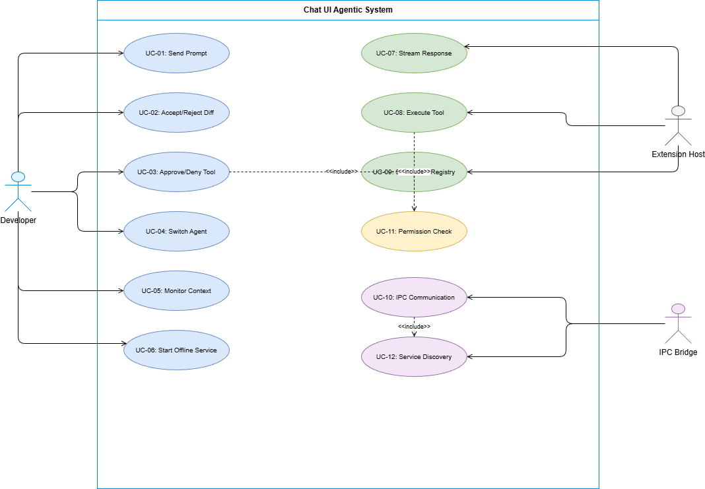

# Business Requirements Document (BRD)

## SDLC Agents 4 Enterprise — SA4E-85: Nâng cấp Chat UI Agentic - Svelte Webview với Actionable Diff, Context Engineering, Dynamic Agent Registry, IPC Bridge

---

## Document Information

| Field | Value |
|-------|-------|
| Jira Ticket | SA4E-85 |
| Title | Nâng cấp Chat UI Agentic - Svelte Webview |
| Author | BA Agent |
| Version | 1.0 |
| Date | 2026-08-01 |
| Status | Draft |

---

## Author Tracking

| Role | Name - Position | Responsibility |
|------|-----------------|----------------|
| Author | BA Agent – Business Analyst | Create document |
| Peer Reviewer | TA Agent – Technical Architect | Review document |

---

## Revision History

| Version | Date | Author | Changes |
|---------|------|--------|---------|
| 1.0 | 2026-08-01 | BA Agent | Initiate document from SA4E-85 design session |
| 2.0 | 2026-08-01 | BA Agent | Incorporate Gemini Review-01: +5 findings (concurrent modification, context pruning, STREAM_ERROR, terminal log block, telemetry) |
| 3.0 | 2026-08-02 | BA Agent | Architecture pivot to Backend-Driven State: LangGraph in-scope, Story 9 (Multi-IDE Sync), Hydration at startup |
| 3.1 | 2026-08-02 | BA Agent | **[Review-05]** Backend-Driven Knowledge Architecture: KB = Single Source of Truth, LangGraph stays in Extension Host with RemoteCheckpointer via HTTP. Removed SQLite Checkpointer as primary source. See BRD-Review/Review-05-Gap-Analysis.md |

---

## Sign-Off

| Name | Signature and date |
|------|--------------------|
| | ☐ I agree and confirm all criteria on this BRD as expected requirements |
| | ☐ I agree and confirm all criteria on this BRD as expected requirements |

---

## 1. Introduction

### 1.1 Overview

SA4E-85 nâng cấp toàn diện **Chat UI** của VSCode Extension từ trạng thái cơ bản lên **Agentic Chat UI** đầy đủ, sử dụng **Svelte + Vite** (bundle ~15KB).

**Hiện trạng:** Backend mạnh (9 SDLC agents, LangGraph, RAG, MCP) nhưng Chat UI chỉ render text thuần — không hiển thị tool status, không cho phép approve/reject code changes, không có context indicator, không hỗ trợ multi-IDE.

**Mục tiêu:** Agentic Chat UI với 5 giai đoạn: (1) Actionable Diff + Progress, (2) Context Engineering, (3) Dynamic Agent Registry, (4) IDE Integration + Permission Guard, (5) IPC Bridge.

### 1.2 Scope

1. **Svelte Webview Components** — ActionableDiff, ThinkingBlock, ContextBadge, AgentSelector, PermissionGuard, ServiceOfflineWarning, TerminalLogBlock, DiagramBlock
2. **Extension Host Modules (TypeScript)** — KiroAgentRegistry, OpenCodeToolHandler, IpcBridge, IdeContextManager, RemoteCheckpointer
3. **Backend Knowledge Service** — **[v3.1]** Backend là nguồn dữ liệu duy nhất (SSOT): Threads, Messages, Checkpoints, Long-term Memory, Tool Executions, Artifacts, Event History, Agent Registry. LangGraph Runtime GIỮ ở Extension Host, giao tiếp qua `RemoteCheckpointer` (HTTP). **KHÔNG dùng SQLite Checkpointer cục bộ làm nguồn chính**
4. **Svelte Stores** — chatStore, agentStore, contextStore, toolStore, connectionStore (Mirror data từ Backend)
5. **Message Protocol** — Bi-directional postMessage giữa Extension Host và Webview
6. **IPC Bridge** — ~~JSON-RPC 2.0 over WebSocket cho multi-IDE communication + Pub/Sub Broadcasting~~ **[v3.1 DEPRECATED]** Không cần thiết — LangGraph là in-process module, extension chạy TRONG IDE. Giao tiếp = direct function call. Code giữ lại cho tương lai (multi-process scaling) nhưng KHÔNG DÙNG trong v1.
7. **Agent Config Format** — .code-intel/agents/*.md YAML frontmatter parsing
8. **Multi-IDE Session Management** — **[v3.1]** `thread_id` shared, state hydration từ Backend Knowledge Service khi IDE open. `.code-intel/.run/session.json` KHÔNG còn là nguồn state chính

### 1.3 Out of Scope

- ~~Backend LangGraph pipeline changes~~ — [v3.1] LangGraph Runtime GIỮ ở Extension Host (in-process). Chỉ thay đổi checkpointer layer để trỏ về Backend Knowledge Service qua HTTP
- RAG/embedding infrastructure (đã có)
- MCP server implementation (đã có, chỉ tái sử dụng qua IPC)
- VSCode Marketplace publishing process
- Mobile/web client support
- Agent logic/prompt engineering (chỉ registry + UI switching)

### 1.4 Preliminary Requirement

- VSCode Extension Host environment (Node.js runtime)
- Svelte + Vite build toolchain configured
- Existing backend SDLC agents infrastructure (LangGraph, MCP)
- .code-intel/ directory structure ở client workspace
- WebSocket runtime support (Node.js built-in ws module)

---

## 2. Business Requirements

### 2.1 High Level Process Map

Luồng xử lý end-to-end của Chat UI Agentic:


1. **User Input**: Developer gõ prompt trong Chat UI hoặc dùng slash command (/ask-{agentId})
2. **Agent Selection**: UI xác định target agent (từ dropdown hoặc slash command) → gửi SEND_PROMPT tới Extension Host
3. **Processing**: Extension Host route prompt tới backend agent, nhận stream response
4. **Tool Execution**: Khi agent gọi tool → Extension Host gửi TOOL_CALL_REQUEST tới Webview
5. **Permission Check**: Webview kiểm tra 
equiresApproval → nếu dangerous tool → hiển thị PermissionGuard cho user approve/deny
6. **Diff Display**: Khi tool tạo code patch → render ActionableDiff với Accept/Reject buttons
7. **Context Update**: Extension Host gửi CONTEXT_UPDATE (token usage, files in context) → ContextBadge cập nhật
8. **IPC Bridge**: Nếu cần tài nguyên từ Kiro/AntiGravity IDE → IpcBridge gọi qua JSON-RPC WebSocket
9. **Response Complete**: Stream kết thúc → STREAM_END → UI finalize message display

### 2.2 List of User Stories / Use Cases

| # | Story / Use Case / Epic | Priority | Source Ticket |
|---|-------------------------|----------|---------------|
| 1 | As a Developer, I want to see code diffs with Accept/Reject buttons so that I can review and apply agent-suggested changes safely | MUST HAVE | SA4E-85 |
| 2 | As a Developer, I want to see real-time progress spinners when agent calls tools so that I know the system is working | MUST HAVE | SA4E-85 |
| 3 | As a Developer, I want to see context usage (token count, files) so that I understand what the agent "knows" | MUST HAVE | SA4E-85 |
| 4 | As a Developer, I want collapsible thinking blocks showing agent reasoning so that I can debug agent behavior when needed | SHOULD HAVE | SA4E-85 |
| 5 | As a Developer, I want to switch between agents via dropdown or slash commands so that I can route questions to the right specialist | MUST HAVE | SA4E-85 |
| 6 | As a Developer, I want dangerous tool calls (write, shell) to require my explicit approval so that I maintain control over my workspace | MUST HAVE | SA4E-85 |
| 7 | As a Developer, I want the UI to detect and connect to Kiro/AntiGravity IDE services so that I can leverage cross-IDE capabilities | SHOULD HAVE | SA4E-85 |
| 8 | As a Developer, I want offline service warnings with auto-start buttons so that I can quickly recover from disconnections | SHOULD HAVE | SA4E-85 |
| 9 | **[v3.0]** As a Developer, I want my active chat session and context to synchronize in real-time across VSCode, Kiro IDE, and AntiGravity, so that I can switch development environments seamlessly without losing my conversation history | MUST HAVE | SA4E-85 |
| 10 | **[v3.1]** As a Developer, I want all conversation state (messages, checkpoints, artifacts) persisted on the Backend Knowledge Service so that any IDE can hydrate the full session from the single source of truth | MUST HAVE | SA4E-85 |

---

### 2.3 Details of User Stories

---

#### Business Flow


*[Edit in draw.io](diagrams/business-flow.drawio)*

**Step 1:** Developer mở Chat Panel trong VSCode sidebar hoặc editor area.

**Step 2:** Developer gõ prompt text hoặc chọn agent qua dropdown/slash command.

**Step 3:** Extension Host nhận message, xác định target agent, gửi tới LangGraph backend.

**Step 4:** Backend agent bắt đầu xử lý — Extension Host stream tokens về Webview (STREAM_TOKEN messages).

**Step 5:** Khi agent cần gọi tool — Extension Host gửi TOOL_CALL_REQUEST. Nếu tool dangerous (write/shell) → Webview hiển thị PermissionGuard. Nếu safe (read/search) → auto-approve.

**Step 6:** Khi tool trả về code patch — Webview render ActionableDiff component với unified diff view + Accept/Reject buttons.

**Step 7:** User click Accept → Extension Host dùng WorkspaceEdit API ghi file (giữ Undo/Redo). User click Reject → discard patch.

**Step 8:** Trong suốt quá trình, ContextBadge hiển thị token usage + files in context. ThinkingBlock hiển thị agent reasoning (collapsible).

**Step 9:** Stream kết thúc → STREAM_END → message finalized trong chat history.

> **Note:** IPC Bridge hoạt động ngầm — khi agent cần MCP tool từ Kiro IDE hoặc workflow từ AntiGravity, IpcBridge tự động route qua WebSocket JSON-RPC.

---

#### STORY 1: Actionable Diff Block — Accept/Reject Code Changes

> As a Developer, I want to see code diffs with Accept/Reject buttons so that I can review and apply agent-suggested changes safely.

**Requirement Details:**

1. Khi agent gọi tool sửa code (patch/write), Extension Host gửi diff data tới Webview
2. Webview render ActionableDiff.svelte component hiển thị unified diff (old/new lines, syntax highlighting)
3. Component có 2 buttons: "Accept Diff" (xanh) và "Reject" (đỏ)
4. Accept → gửi ACTION_ACCEPT_DIFF → Extension Host dùng scode.workspace.applyEdit(WorkspaceEdit) ghi file
5. Reject → gửi ACTION_REJECT_DIFF → discard, hiển thị "Rejected" badge
6. WorkspaceEdit giữ nguyên Undo/Redo stack — user có thể Ctrl+Z sau khi Accept

**Acceptance Criteria:**

1. Khi agent tạo code patch, ActionableDiff component render trong chat với diff view rõ ràng (added lines xanh, removed lines đỏ)
2. Click "Accept Diff" → file được sửa đúng theo patch, Undo/Redo hoạt động
3. Click "Reject" → file không bị thay đổi, component hiển thị "Rejected" state
4. Multiple diffs trong 1 response → mỗi diff là 1 ActionableDiff component riêng biệt
5. Diff component hiển thị file path, line numbers, và language syntax highlighting
6. **[Review-01] Concurrent Modification Detection:** Nếu file đã bị chỉnh sửa (dirty) kể từ lúc Agent nhận context (so sánh file version/hash), hệ thống PHẢI chặn apply patch, hiển thị cảnh báo "File has been modified since patch was generated" và cung cấp nút "Regenerate Patch" để Agent tạo lại diff dựa trên nội dung file hiện tại
7. **[Review-01] Stale Patch Expiry:** Nếu diff đã tồn tại >5 phút mà chưa được Accept, hiển thị warning badge "Patch may be outdated" trên ActionableDiff component

---

#### STORY 2: Progress Spinner & Tool Execution Log

> As a Developer, I want to see real-time progress spinners when agent calls tools so that I know the system is working.

**Requirement Details:**

1. Mỗi khi agent gọi tool, Webview hiển thị spinner + status text ("Đang phân tích AST...", "Đang ghi file...")
2. Tool name và mô tả ngắn hiển thị inline trong chat stream
3. Khi tool hoàn thành → spinner biến mất, hiển thị ✓ hoặc ✗ tùy kết quả
4. Không để user cảm thấy hệ thống bị treo — timeout indicator nếu tool chạy >10s

**Acceptance Criteria:**

1. Khi TOOL_CALL_REQUEST được nhận, spinner xuất hiện ngay trong chat
2. Status text mô tả tool đang chạy (tool name + human-readable description)
3. Khi MCP_TOOL_RESULT trả về → spinner thay bằng result icon (✓ success / ✗ error)
4. Nếu tool chạy >10s → hiển thị elapsed time indicator ("Running for 12s...")
5. Nhiều tools chạy đồng thời → mỗi tool có spinner riêng
6. **[Review-01] Terminal Log Block:** Khi tool là shell command (type: shell), thay vì chỉ spinner, render TerminalLogBlock.svelte streaming stdout/stderr realtime vào chat (monospace font, scrollable, max-height 300px, auto-scroll)
7. **[Review-01] Long-running Shell Output:** Cho phép user expand/collapse terminal output. Khi tool kết thúc, tự động collapse và hiển thị summary (exit code, duration, last 3 lines)

---

#### STORY 3: Context Indicator Badge — Token & Files Tracking

> As a Developer, I want to see context usage (token count, files) so that I understand what the agent "knows".

**Requirement Details:**

1. ContextBadge.svelte hiển thị ở góc chat header
2. Hiển thị: danh sách files hiện trong context (clickable → open file)
3. Progress bar token usage: xanh (>50% remaining) → vàng (20-50%) → đỏ (<20%)
4. Tooltip chi tiết: exact token count / max tokens, list files with sizes
5. Update realtime khi nhận CONTEXT_UPDATE message từ Extension Host

**Acceptance Criteria:**

1. ContextBadge hiển thị token progress bar với color coding (xanh→vàng→đỏ)
2. Click badge → expand danh sách files trong context
3. Mỗi file entry clickable → mở file trong editor
4. Token count cập nhật realtime trong conversation
5. Khi context gần đầy (>80%) → badge blink/pulse animation cảnh báo
6. **[Review-01] Context Pruning — Unpin Files:** Mỗi file entry trong expanded badge có nút "✕" (unpin) để developer chủ động gỡ file khỏi agent context, giải phóng token budget ngay lập tức
7. **[Review-01] Clear Session Context:** Slash command `/clear` reset toàn bộ session context (xóa pinned files, reset token counter) mà không cần khởi động lại Extension. Hiển thị confirmation dialog trước khi clear
8. **[Review-01] Auto-prune Suggestion:** Khi token >90%, hệ thống tự động suggest danh sách files ít liên quan nhất (oldest pinned, largest files) để user unpin

---

#### STORY 4: Collapsible Thinking Block — Agent Reasoning

> As a Developer, I want collapsible thinking blocks showing agent reasoning so that I can debug agent behavior when needed.

**Requirement Details:**

1. ThinkingBlock.svelte đóng gói Chain-of-Thought / ReAct logs
2. Mặc định: tự mở khi agent đang "suy nghĩ" (THINKING_START), tự đóng khi xong (THINKING_END)
3. User có thể toggle mở/đóng bất kỳ lúc nào
4. Svelte slide animation khi mở/đóng (smooth, không giật)
5. Content render markdown formatted (code blocks, lists)

**Acceptance Criteria:**

1. Khi nhận THINKING_START → ThinkingBlock tự mở với animation
2. THINKING_TOKEN streaming → text hiển thị realtime trong block
3. THINKING_END → block tự đóng (collapse) sau 1s delay
4. Click header → toggle mở/đóng (override auto behavior)
5. Thinking content hỗ trợ markdown rendering (code blocks, bold, lists)

---

#### STORY 5: Dynamic Agent Registry & Slash Commands

> As a Developer, I want to switch between agents via dropdown or slash commands so that I can route questions to the right specialist.

**Requirement Details:**

1. KiroAgentRegistry.ts quét .code-intel/agents/*.md ở client workspace
2. Parse YAML frontmatter: id, 
ame, description, 	ools, mcp_servers, uto_approve
3. FileSystemWatcher hot-reload: khi file .md thêm/xóa/sửa → registry update + UI refresh
4. Tự động sinh slash commands /ask-{agentId} cho mỗi agent
5. AgentSelector dropdown trong chat header — reactive, realtime update
6. Input area: khi gõ / → dropdown auto-complete hiện danh sách commands

**Acceptance Criteria:**

1. Thêm file .code-intel/agents/new-agent.md → agent xuất hiện trong dropdown trong <2s
2. Xóa file → agent biến mất khỏi dropdown ngay
3. Gõ / trong input → dropdown hiện tất cả available slash commands
4. Gõ /ask-ba → auto-complete suggest "BA Agent" → Enter → agent switched
5. YAML frontmatter invalid → agent bị skip, warning log (không crash)
6. Dropdown hiển thị agent name + short description

---

#### STORY 6: Permission Guard — Tool Approval UI

> As a Developer, I want dangerous tool calls (write, shell) to require my explicit approval so that I maintain control over my workspace.

**Requirement Details:**

1. PermissionGuard.svelte hiển thị khi tool cần approval (
equiresApproval: true)
2. Dangerous tools: write_file, shell_execute, delete_file, git operations
3. Safe tools: read_file, search, list_directory → auto-approve (không hiện UI)
4. UI hiển thị: tool name, arguments summary, risk level indicator
5. Buttons: "Allow" (xanh) + "Deny" (đỏ) + "Allow All Session" (optional)
6. Response gửi TOOL_CALL_RESPONSE (APPROVE/REJECT) về Extension Host
7. Timeout: nếu user không respond trong 60s → auto-deny + notify

**Acceptance Criteria:**

1. Dangerous tool call → PermissionGuard hiện với tool details rõ ràng
2. Safe tool call → auto-approve, không hiện UI (chỉ log trong tool execution area)
3. Click "Allow" → tool executes, result streams back
4. Click "Deny" → tool skipped, agent nhận denied response
5. "Allow All Session" → subsequent calls cùng tool type auto-approve trong session
6. Risk indicator: 🔴 High (shell, delete), 🟡 Medium (write), 🟢 Low (read)

---

#### STORY 7: IPC Bridge — Multi-IDE Communication

> As a Developer, I want the UI to detect and connect to Kiro/AntiGravity IDE services so that I can leverage cross-IDE capabilities.

**Requirement Details:**

1. File-based service discovery: đọc .code-intel/.run/kiro.json và ntigravity.json
2. Mỗi file chứa: ws_endpoint, 
est_endpoint, pid, status
3. IpcBridge.ts kết nối WebSocket tới discovered endpoints
4. Protocol: JSON-RPC 2.0 (method, params, id / 
esult, rror)
5. Kiro Bridge: mcp.execute_tool — tái sử dụng MCP servers qua local port
6. AntiGravity Bridge: workflow.start + workflow.stream_event
7. Auto-reconnect khi connection drops (exponential backoff, max 5 retries)
8. IPC_STATUS messages cập nhật Webview về connection state

**Acceptance Criteria:**

1. Khi .code-intel/.run/kiro.json exists + valid → auto-connect WebSocket
2. Connection established → IPC_STATUS(connected) → UI hiển thị green indicator
3. Connection lost → auto-reconnect với backoff (1s, 2s, 4s, 8s, 16s)
4. mcp.execute_tool call qua Kiro Bridge → tool result trả về đúng
5. workflow.start qua AntiGravity Bridge → stream events nhận về realtime
6. Service file deleted/invalid → graceful disconnect, UI hiển thị offline state

---

#### STORY 8: Service Offline Warning — Recovery UI

> As a Developer, I want offline service warnings with auto-start buttons so that I can quickly recover from disconnections.

**Requirement Details:**

1. ServiceOfflineWarning.svelte hiển thị khi IPC service offline
2. Cảnh báo rõ ràng: service name, last known status, time since disconnect
3. Nút "Tự động khởi động" → gửi RUN_TERMINAL_COMMAND để start service
4. Auto-hide khi service reconnects (IPC_STATUS changes to connected)
5. Non-intrusive: warning bar ở top chat, không block interaction

**Acceptance Criteria:**

1. Service offline → warning bar hiện ở top chat area với service name
2. Click "Tự động khởi động" → Extension Host spawn terminal + run start command
3. Service reconnects → warning auto-hide với fade animation
4. Multiple services offline → stack warnings (1 per service)
5. Warning không block chat interaction — user có thể tiếp tục chat

---

### 2.4 Use Case Diagram


*[Edit in draw.io](diagrams/use-case.drawio)*

| Use Case | Actor | Description |
|----------|-------|-------------|
| UC-01: Send Prompt | Developer | Gửi message/prompt tới agent qua chat input |
| UC-02: Accept/Reject Diff | Developer | Review code diff và accept hoặc reject changes |
| UC-03: Approve/Deny Tool | Developer | Cho phép hoặc từ chối dangerous tool execution |
| UC-04: Switch Agent | Developer | Chuyển đổi agent qua dropdown hoặc slash command |
| UC-05: Monitor Context | Developer | Xem token usage và files trong agent context |
| UC-06: Start Offline Service | Developer | Khởi động lại service bị disconnect |
| UC-07: Stream Response | Extension Host | Stream tokens từ backend agent về Webview |
| UC-08: Execute Tool | Extension Host | Gọi tool qua MCP/IPC, trả result về Webview |
| UC-09: Sync Agent Registry | Extension Host | Quét + watch .code-intel/agents/ và sync tới Webview |
| UC-10: IPC Communication | IPC Bridge | Kết nối JSON-RPC WebSocket tới Kiro/AntiGravity |
| UC-11: Sync Multi-IDE State | Backend KB | **[v3.1]** Hydrate chat history + context từ Backend Knowledge Service khi IDE mở |

---

## 3. Dependencies

| Dependency | Type | Related Ticket | Description |
|------------|------|----------------|-------------|
| Svelte 4.x + Vite 5.x | External (npm) | N/A | Frontend framework + bundler cho Webview |
| VSCode Extension API | System | N/A | WorkspaceEdit, FileSystemWatcher, Terminal, Diagnostics APIs |
| gray-matter (npm) | External (npm) | N/A | YAML frontmatter parser cho agent .md files |
| ws (npm) | External (npm) | N/A | WebSocket client cho IPC Bridge |
| LangGraph Runtime | System | SA4E-77 | Agent orchestration pipeline — **[v3.1]** chạy in-process trong Extension Host |
| Backend Knowledge Service | System | SA4E-85 | **[v3.1]** Backend Server (Node) cung cấp KB REST API: threads, messages, checkpoints, artifacts, event history |
| RemoteCheckpointer | System | SA4E-85 | **[v3.1]** BaseCheckpointSaver gọi Backend KB qua HTTP (GET/PUT /api/v1/threads/:id/checkpoint) |
| MCP Server Infrastructure | System | SA4E-52 | Tool execution qua MCP protocol (đã có) |
| .code-intel/ workspace structure | Convention | N/A | Agent configs + service discovery files |
| diff library (npm) | External (npm) | N/A | Unified diff generation cho ActionableDiff |

---

## 4. Stakeholders

| Role | Name / Team | Responsibility | Source |
|------|-------------|----------------|--------|
| End User | Developers using VSCode | Interact with Chat UI, approve tools, review diffs | SA4E-85 |
| Extension Developer | DEV Team | Implement Svelte components + Extension Host modules | SA4E-85 |
| BA Agent | BA – Business Analyst | Define requirements, review UG | SA4E-85 |
| SA Agent | SA – Solution Architect | Technical design (TDD) | SA4E-85 |
| QA Agent | QA – Test Engineer | Test planning + execution | SA4E-85 |

---

## 5. Risks and Assumptions

### 5.1 Risks

| Risk | Impact | Likelihood | Mitigation |
|------|--------|------------|------------|
| Svelte Webview CSP restrictions block functionality | High | Medium | Test CSP early; use nonce-based script loading; avoid inline scripts |
| WebSocket connections unstable in corporate networks | Medium | Medium | Exponential backoff reconnect; offline fallback UI; configurable timeout |
| FileSystemWatcher performance with many agent files | Low | Low | Debounce watcher events (300ms); limit watch depth to 1 level |
| Large diffs cause Webview memory issues | Medium | Low | Virtualize diff rendering; limit displayed lines; collapse large diffs |
| postMessage serialization overhead for large payloads | Medium | Medium | Chunk large messages; compress base64 payloads; lazy-load diff content |
| Agent YAML frontmatter format inconsistency | Low | Medium | Graceful parsing with defaults; skip invalid files with warning log |

### 5.2 Assumptions

- VSCode version >= 1.85 (Webview API stable, FileSystemWatcher reliable)
- .code-intel/ directory managed by user/team (not bundled in extension)
- Backend agent streaming protocol already established (STREAM_START/TOKEN/END)
- Extension Host has access to workspace filesystem (not remote/SSH scenario for v1)
- Kiro/AntiGravity services expose JSON-RPC 2.0 over WebSocket when running

---

## 6. Non-Functional Requirements

| Category | Requirement | Details |
|----------|-------------|---------|
| Performance | Webview bundle size ≤ 15KB gzipped | Svelte compiles to vanilla JS; tree-shake unused components |
| Performance | First message render < 100ms after stream start | Direct DOM update via Svelte reactivity, no virtual DOM overhead |
| Performance | Agent registry hot-reload < 2s | FileSystemWatcher + debounce; incremental parse only changed files |
| Performance | Extension activation time impact < 200ms | Lazy-load IPC Bridge and heavy modules |
| Reliability | IPC auto-reconnect with exponential backoff | 1s, 2s, 4s, 8s, 16s — max 5 retries before showing offline UI |
| Reliability | Graceful degradation when services unavailable | Chat still works without IPC; features degrade progressively |
| Security | Tool approval required for dangerous operations | write_file, shell, delete, git → user must click Allow |
| Security | CSP-compliant Webview | No inline scripts/styles; nonce-based loading; no eval() |
| Security | WebSocket connections local-only | IPC connects only to localhost endpoints from service discovery |
| Usability | All UI components accessible (WCAG 2.1 AA) | Keyboard navigation, ARIA labels, focus management |
| Usability | Dark/Light theme support | Follow VSCode theme variables (--vscode-* CSS custom properties) |
| Scalability | Support ≤50 registered agents | Registry handles dynamic add/remove without performance degradation |
| Scalability | Chat history ≤1000 messages with virtualization | Render only visible messages; lazy-load older messages |
| Maintainability | Each Svelte component ≤ 200 lines | Follow code-standards.md (SRP, file size limits) |
| Observability | **[Review-01]** Track Accept/Reject ratio per agent | Silently log telemetry: { agentId, action: accept/reject, toolName, timestamp } to local .code-intel/telemetry.jsonl. No external network calls. Used for prompt tuning of SDLC agents |
| Observability | **[Review-01]** Track tool execution metrics | Log: { toolName, duration_ms, success: bool, agentId } per tool call. Aggregated weekly report viewable via `/metrics` slash command |

---

## 7. Related Tickets

| Ticket Key | Summary | Status | Type | Relationship |
|------------|---------|--------|------|--------------|
| SA4E-85 | Nâng cấp Chat UI Agentic - Svelte Webview | In Progress | Story | Main ticket |
| SA4E-77 | LangGraph Agent Pipeline | Done | Story | Provides backend agent orchestration |
| SA4E-52 | MCP Server Infrastructure | Done | Story | Provides tool execution infrastructure |
| SA4E-84 | Draw.io Auto-Layout FIX mode | In Progress | Story | Related tooling improvement |

---

## 8. Appendix

### 8.1 Message Protocol Reference

**Extension Host → Webview:**

| Message Type | Payload | Description |
|--------------|---------|-------------|
| STREAM_START | { messageId, agentId } | New response stream begins |
| STREAM_TOKEN | { messageId, token } | Incremental text token |
| STREAM_END | { messageId } | Response complete |
| STREAM_ERROR | { messageId, error: { code, message, recoverable } } | **[Review-01]** Stream interrupted due to backend crash, LLM timeout, or connection loss. UI renders error inline (red text) with optional "Retry" button if recoverable=true |
| SYNC_CHAT_HISTORY | { messages[], context } | **[v3.1]** Hydrate toàn bộ lịch sử + context từ Backend Knowledge Service khi IDE mở |
| THINKING_START | { messageId } | Agent reasoning begins |
| THINKING_TOKEN | { messageId, token } | Reasoning text token |
| THINKING_END | { messageId } | Reasoning complete |
| TOOL_CALL_REQUEST | { toolId, name, args, requiresApproval } | Tool needs execution/approval |
| MCP_TOOL_RESULT | { toolId, result, error? } | Tool execution result |
| IDE_STATE_SYNC | { diagnostics[], activeFile } | LSP diagnostics + active editor |
| SYNC_AVAILABLE_AGENTS | { agents[] } | Agent registry update |
| IPC_STATUS | { service, status, endpoint? } | Connection state change |
| CONTEXT_UPDATE | { tokenCount, maxTokens, files[] } | Context budget update |

**Webview → Extension Host:**

| Message Type | Payload | Description |
|--------------|---------|-------------|
| SEND_PROMPT | { text, agentId, contextFiles? } | User sends message |
| TOOL_CALL_RESPONSE | { toolId, decision: APPROVE/REJECT } | User approves/denies tool |
| COMMAND_DISPATCH | { command, args } | Slash command or agent swap |
| RUN_TERMINAL_COMMAND | { command, terminalName } | Start service in terminal |
| ACTION_ACCEPT_DIFF | { diffId, filePath, patch } | User accepts code diff |
| ACTION_REJECT_DIFF | { diffId } | User rejects code diff |
| REQUEST_SYNC_STATE | {} | **[v3.1]** Webview yêu cầu Backend gửi lại full state cho thread hiện tại |

### 8.2 Agent Config Format (.code-intel/agents/*.md)

```yaml
---
id: ba-agent
name: Business Analyst
description: Analyzes requirements, creates BRD and FSD documents
tools:
  - mem_search
  - mem_ingest
  - jira_get_issue
mcp_servers:
  - atlassian
  - markdown-exporter
auto_approve:
  - mem_search
  - read_file
---

# BA Agent System Prompt

You are a Business Analyst agent...
```

### 8.3 Service Discovery Format (.code-intel/.run/*.json)

```json
{
  "ws_endpoint": "ws://localhost:9100/rpc",
  "rest_endpoint": "http://localhost:9100/api",
  "pid": 12345,
  "status": "running",
  "version": "1.0.0",
  "started_at": "2026-08-01T10:00:00Z"
}
```

### 8.4 IPC JSON-RPC 2.0 Examples

**Kiro MCP Tool Call:**
```json
{
  "jsonrpc": "2.0",
  "method": "mcp.execute_tool",
  "params": { "tool_name": "mem_search", "arguments": { "query": "BRD SA4E-85" } },
  "id": 1
}
```

**AntiGravity Workflow Start:**
```json
{
  "jsonrpc": "2.0",
  "method": "workflow.start",
  "params": { "workflow_id": "code-review", "input": { "branch": "SA4E-85" } },
  "id": 2
}
```

### Glossary

| Term | Definition |
|------|------------|
| Agentic UI | Chat interface that exposes AI agent tool-use capabilities directly to the user |
| ActionableDiff | UI component showing code changes with Accept/Reject user actions |
| IPC Bridge | Inter-Process Communication layer connecting multiple IDE instances via WebSocket |
| Context Engineering | Practice of managing what information (files, tokens) an AI agent has access to |
| Dynamic Agent Registry | Runtime-discovered agent configurations from workspace filesystem |
| Permission Guard | Security UI requiring explicit user approval for dangerous tool operations |
| Service Discovery | File-based mechanism to find running IDE services (Kiro, AntiGravity) |

### Diagram Index

| # | Diagram | Image | Source (editable) |
|---|---------|-------|-------------------|
| 1 | Business Flow | [business-flow.png](diagrams/business-flow.png) | [business-flow.drawio](diagrams/business-flow.drawio) |
| 2 | Use Case | [use-case.png](diagrams/use-case.png) | [use-case.drawio](diagrams/use-case.drawio) |
