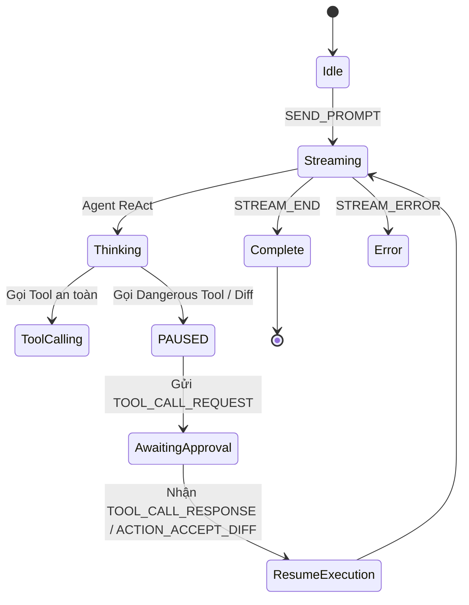

# Functional Specification Document (FSD)

> ## ⚠️ [v3.1] CẬP NHẬT KIẾN TRÚC — Review-05
>
> Bản FSD **3.0 dưới đây đã được thay thế** theo quyết định **Backend-Driven Knowledge (v3.1)**
> trong `documents/SA4E-85/BRD-Review/Review-05-Gap-Analysis.md`. Tài liệu **chính thức hiện hành**
> là `documents/SA4E-85/FSD.md` (v3.1). Thay đổi chính:
>
> - **KB (Knowledge Service) = Single Source of Truth**, KHÔNG phải SQLite Checkpointer
> - **LangGraph Runtime giữ ở Extension Host** + `RemoteCheckpointer` (HTTP → Backend KB)
> - UC-11 rewrite: hydrate từ Backend KB (GET /api/v1/threads/:id/messages), không đọc session.json như nguồn chính
> - BR-30/BR-31 đã được cập nhật trong FSD.md v3.1
>
> Nội dung dưới đây giữ nguyên để phục vụ lịch sử review. Đọc FSD.md v3.1 để lấy spec hiện hành.

## SDLC Agents 4 Enterprise — SA4E-85: Nâng cấp Chat UI Agentic - Svelte Webview

---

## Document Information

| Field | Value |
| --- | --- |
| Jira Ticket | SA4E-85 |
| Title | Nâng cấp Chat UI Agentic - Svelte Webview |
| Author | BA Agent |
| Version | 3.0 |
| Date | 2026-08-02 |
| Status | Approved |
| Related BRD | documents/SA4E-85/BRD.md (v2.0) |

---

## Revision History

| Version | Date | Author | Changes |
| --- | --- | --- | --- |
| 1.0 | 2026-08-01 | BA Agent | Initial FSD from BRD v2 + Review-01 findings |
| 2.0 | 2026-08-01 | BA Agent | Incorporate FSD-Review-01: deep-link handoff, living doc extraction, diagram render engine |
| 3.0 | 2026-08-02 | BA Agent | Chuyển đổi kiến trúc sang **Backend-Driven State**, đưa LangGraph Refactoring vào In-Scope, thêm cơ chế Multi-IDE Context Sync qua Checkpointer |

---

## 1. Introduction

### 1.1 Purpose

This FSD specifies functional behavior of the Agentic Chat UI upgrade for the VSCode Extension, translating User Stories into implementable Use Cases, Business Rules, Data Models, API contracts, and UI specifications. Phiên bản 3.0 định nghĩa lại kiến trúc quản trị trạng thái (State Management) tập trung tại Backend Server để hỗ trợ đa môi trường IDE (VSCode, Kiro, AntiGravity).

### 1.2 Scope (Cập nhật v3.0)

* **Svelte Webview Components** — ActionableDiff, ThinkingBlock, ContextBadge, AgentSelector, PermissionGuard, ServiceOfflineWarning, TerminalLogBlock, DiagramBlock.
* **Extension Host Modules (TypeScript)** — KiroAgentRegistry, OpenCodeToolHandler, IpcBridge, IdeContextManager.
* **LangGraph Backend Refactoring (Python/Node.js)** — Dynamic Graph Routing (từ `KiroAgentRegistry`), Human-in-the-loop (cơ chế `interrupt` chờ duyệt tool), StateGraph Schema cấp phát IDE Context & SQLite Checkpointer.
* **Svelte Stores** — chatStore, agentStore, contextStore, toolStore, connectionStore (đóng vai trò "Mirror" dữ liệu từ Backend).
* **Message Protocol & IPC Bridge** — Bi-directional postMessage và JSON-RPC 2.0 over WebSocket.

### 1.3 Out of Scope (Cập nhật v3.0)

* RAG/embedding infrastructure (đã có).
* MCP server implementation (đã có, chỉ tái sử dụng qua IPC).
* VSCode Marketplace publishing process.

### 1.4 Definitions & Acronyms

| Term | Definition |
| --- | --- |
| Agentic UI | Giao diện Chat bộc lộ khả năng sử dụng tool của AI agent cho user |
| Backend-Driven State | Toàn bộ trạng thái hội thoại và ngữ cảnh được lưu tại Backend (LangGraph Checkpointer), Frontend chỉ render (Hydration) |
| ActionableDiff | UI component hiển thị code changes kèm nút Accept/Reject |
| IPC Bridge | Giao tiếp liên tiến trình qua WebSocket JSON-RPC 2.0 |
| Concurrent Modification | Lỗi khi file bị sửa đổi sau khi agent đọc nhưng trước khi patch được áp dụng |

---

## 2. System Overview

### 2.1 System Context Diagram (Backend-Driven Architecture)

Kiến trúc 3 lớp: Webview (Svelte) ↔ Extension Host (TS Hub) ↔ LangGraph Backend (Single Source of Truth) & External Services (Kiro/AntiGravity). Toàn bộ State được lưu vĩnh viễn tại `chat_history.db` bằng SQLite Checkpointer của LangGraph.

---

## 3. Functional Requirements — Use Cases

### 3.1 UC-01: Send Prompt & Receive Streamed Response

**Actor:** Developer
**Preconditions:** Chat Panel open, kết nối Backend ổn định.
**Main Flow:** User gửi prompt → `SEND_PROMPT` → Backend cập nhật State → Backend trả stream `STREAM_TOKEN` → Webview render.

### 3.2 UC-02: Accept/Reject Code Diff (Human-in-the-loop & Concurrent Mod)

**Actor:** Developer
**Preconditions:** LangGraph Backend đang ở trạng thái `PAUSED` do gọi hàm `interrupt()` đối với tool `apply_patch`.
**Main Flow:**

1. Diff nhận được qua `TOOL_CALL_REQUEST`.
2. ActionableDiff render unified diff.
3. User click Accept.
4. Extension Host kiểm tra SHA-256 hash của file hiện tại so với hash lúc tạo patch.
5. Nếu khớp: Áp dụng `WorkspaceEdit`, gửi `TOOL_CALL_RESPONSE(APPROVE)` để Backend resume graph.
6. Nếu sai lệch (Dirty file): Chặn apply, hiện cảnh báo, user bấm "Regenerate Patch", gửi tín hiệu `REGENERATE_PATCH` để Backend chạy lại.

### 3.3 UC-03: Tool Execution Progress & Terminal Log Block

**Actor:** Developer
**Main Flow:** Tool chạy hiện Spinner. Nếu `type=shell`, render `TerminalLogBlock` streaming stdout. Khi hoàn tất, detect các artifact links bằng Regex (vd: `target/site/serenity/index.html`) và hiện nút "View Test Report" hoặc "Open in AntiGravity".

### 3.4 UC-04: Context Monitoring & Pruning

**Actor:** Developer
**Main Flow:** User theo dõi token qua ContextBadge. Khi >90%, hệ thống tự suggest file để gỡ. User có thể bấm ✕ để gỡ file, Backend cập nhật lại State. Lệnh `/clear` reset toàn bộ memory.

### 3.5 UC-06: Permission Guard — Tool Approval

**Actor:** Developer
**Main Flow:** Các tool rủi ro cao (write, shell) sẽ ngắt luồng Backend (`interrupt`). `PermissionGuard` hiện thông tin. User có 60s để Allow/Deny.

### 3.6 UC-11: Sync Multi-IDE Chat State (Hydration) [MỚI v3.0]

**Actor:** Webview (Khi khởi động) / Developer
**Preconditions:** User vừa mở IDE (VSCode, Kiro, hoặc AntiGravity) trong cùng một workspace.
**Main Flow:**

1. Webview load Svelte app và gửi `REQUEST_SYNC_STATE` tới Backend.
2. Backend đọc `thread_id` từ `.code-intel/.run/session.json`.
3. Backend query toàn bộ lịch sử từ SQLite Checkpointer.
4. Backend trả về message `SYNC_CHAT_HISTORY`.
5. Frontend cập nhật Svelte Stores, tự động cuộn xuống cuối, hiển thị nguyên trạng phiên làm việc.

---

## 4. Business Rules

| Rule ID | Rule | Category |
| --- | --- | --- |
| BR-01 | Dangerous tools (write, shell) require user approval (Graph Paused) | Permission |
| BR-05 | File hash MUST be checked before applying patch | Integrity |
| BR-07 | Concurrent mod → BLOCK + Regenerate | Integrity |
| BR-10 | `/clear` resets ALL backend context and starts a new thread | Context |
| BR-26 | External workflow results with `deepLinkUri` → render "Open in AntiGravity" | Handoff |
| BR-27 | TerminalLogBlock auto-detects artifact paths via regex → render buttons | Living Doc |
| BR-28 | Diagram rendering uses Server-side SVG (PlantUML/BPMN) to ensure <5KB bundle | Rendering |
| BR-30 | **[v3.0]** LangGraph Checkpointer is the Single Source of Truth. Svelte Stores are Mirrors. | State |
| BR-31 | **[v3.0]** Multi-IDE Session is managed via `.code-intel/.run/session.json` (`thread_id`) | State |

---

## 5. UI Specifications

### Chat Panel Layout

```text
┌──────────────────────────────────────────┐
│ [AgentSelector▾] [ContextBadge 🟢 45%]  │ Header
├──────────────────────────────────────────┤
│ [ServiceOfflineWarning — if offline]     │ Warning
├──────────────────────────────────────────┤
│ [ChatMessage user]                       │
│ [ChatMessage agent]                      │
│   ├─ [ThinkingBlock]                     │
│   ├─ [TerminalLogBlock /w Artifact Link] │
│   ├─ [ActionableDiff]                    │
│   ├─ [PermissionGuard]                   │
│   └─ [DiagramBlock SVG]                  │
├──────────────────────────────────────────┤
│ [/ autocomplete]                         │
│ [Input] [Send]                           │ Footer
└──────────────────────────────────────────┘

```

---

## 6. Data Model

### 6.1 LangGraph Backend State Schema (v3.0)

```typescript
interface LangGraphState {
  messages: BaseMessage[];
  // IDE Context Hướng Môi trường
  ide_context: {
    active_file: string | null;
    lsp_diagnostics: Diagnostic[];
    workspace_root: string;
  };
  // Dynamic Routing & Tool Control
  active_agent_id: string;        
  pending_tool_call: string | null; // Ghi nhận ID tool đang bị ngắt luồng (Paused)
  approval_status: 'approved' | 'rejected' | 'conflict' | null; 
}

```

### 6.2 Message Types (Frontend)

```typescript
interface ChatMessage {
  id: string;
  role: 'user' | 'assistant';
  agentId: string;
  content: string;
  status: 'streaming' | 'complete' | 'error';
  thinkingContent?: string;
  toolCalls?: ToolCall[];
  diffs?: DiffBlock[];
  diagrams?: DiagramBlock[];
}

interface ToolResult {
  output: string;
  error?: string;
  exitCode?: number;
  duration_ms: number;
  deepLinkUri?: string;       // URI scheme (antigravity://workspace/...)
  artifacts?: ArtifactLink[]; // Tự động Regex từ stdout
}

interface DiagramBlock {
  diagramId: string;
  type: 'plantuml' | 'bpmn' | 'cmmn';
  source: string;             
  renderedSvg?: string;       
}

```

---

## 7. API Specifications — Message Protocol

### 7.1 Extension Host / Backend → Webview

| Type | Payload | Description |
| --- | --- | --- |
| **SYNC_CHAT_HISTORY** | `{messages: ChatMessage[], context: ContextState}` | **[v3.0]** Hydrate state từ Checkpointer khi IDE mở |
| STREAM_START | `{messageId, agentId}` | Bắt đầu response |
| STREAM_TOKEN | `{messageId, token}` | Incremental text (Đã được buffer) |
| STREAM_ERROR | `{messageId, error:{code,message,recoverable}}` | Báo lỗi Backend |
| TOOL_CALL_REQUEST | `{toolId,name,args,requiresApproval}` | Tool trigger (Kèm Graph Pause) |

### 7.2 Webview → Extension Host / Backend

| Type | Payload | Description |
| --- | --- | --- |
| **REQUEST_SYNC_STATE** | `{}` | **[v3.0]** Yêu cầu Backend gửi lại data hiện tại |
| SEND_PROMPT | `{text,agentId,contextFiles?}` | Gửi query |
| TOOL_CALL_RESPONSE | `{toolId,decision}` | Resume Graph với (APPROVE/REJECT) |
| ACTION_ACCEPT_DIFF | `{diffId,filePath,patch}` | Apply code (và Resume Graph Success) |
| REGENERATE_PATCH | `{diffId,filePath}` | Resume Graph Error để tự động sinh lại code |

---

## 8. Integration Requirements

### 8.1 SQLite Checkpointer Database

* **Vị trí lưu trữ:** `.code-intel/database/chat_history.db`
* **Chức năng:** Lưu trữ State của LangGraph dạng BLOB. Cho phép resume các luồng bị ngắt (`interrupt`) và cung cấp lịch sử đầy đủ cho Multi-IDE clients.

### 8.2 Session Discovery (Multi-IDE)

* File chia sẻ ID phiên: `.code-intel/.run/session.json`
* Nội dung: `{"thread_id": "uuid-1234", "started_at": "..."}`
* Bất kỳ IDE nào kết nối đều đọc file này để gọi API `getThreadState(thread_id)` từ Backend.

---

## 9. State Diagram — Agent Lifecycle (v3.0)



*(Biểu đồ thể hiện trạng thái `PAUSED` do Checkpointer của LangGraph quản lý để chờ sự tương tác từ Human-in-the-loop).*