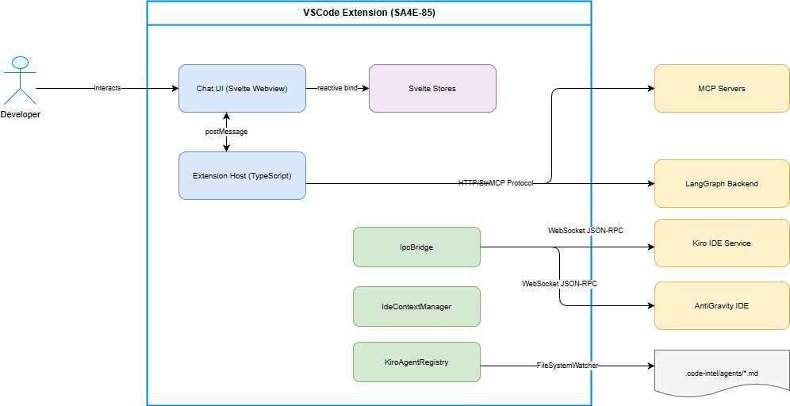
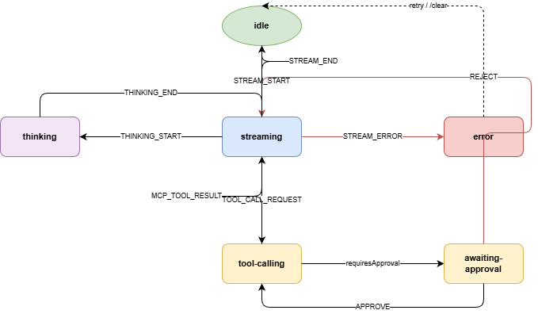

# Functional Specification Document (FSD)

## SDLC Agents 4 Enterprise — SA4E-85: Nâng cấp Chat UI Agentic - Svelte Webview

---

## Document Information

| Field | Value |
|-------|-------|
| Jira Ticket | SA4E-85 |
| Title | Nâng cấp Chat UI Agentic - Svelte Webview |
| Author | BA Agent |
| Version | 3.1 |
| Date | 2026-08-02 |
| Status | Approved / Implemented |
| Related BRD | documents/SA4E-85/BRD.md (v3.1) |

---

## Revision History

| Version | Date | Author | Changes |
|---------|------|--------|---------|
| 1.0 | 2026-08-01 | BA Agent | Initial FSD from BRD v2 + Review-01 findings |
| 2.0 | 2026-08-01 | BA Agent | Incorporate FSD-Review-01: deep-link handoff, living doc extraction, diagram render engine |
| 3.0 | 2026-08-02 | BA Agent | Backend-Driven State architecture: LangGraph Checkpointer as SSOT, Multi-IDE Sync (UC-11), Hydration API, BR-30/31, SYNC_CHAT_HISTORY + REQUEST_SYNC_STATE messages |
| 3.1 | 2026-08-02 | BA Agent | **[Review-05]** Backend-Driven Knowledge: KB Service = SSOT, LangGraph stays in Extension Host + RemoteCheckpointer (HTTP). Removed SQLite Checkpointer as primary source. See BRD-Review/Review-05-Gap-Analysis.md |

---

## 1. Introduction

### 1.1 Purpose

This FSD specifies functional behavior of the Agentic Chat UI upgrade for the
VSCode Extension, translating 8 User Stories from BRD v2 into implementable
Use Cases, Business Rules, Data Models, API contracts, and UI specifications.

### 1.2 Scope

- Svelte Webview components (7 components) — stateless mirror (Svelte 4 + Vite)
- Extension Host modules (TypeScript) — gồm LangGraph Runtime in-process
- `RemoteCheckpointer` (BaseCheckpointSaver → HTTP) [v3.1]
- Svelte Stores (5 stores) — local render-cache only
- Message Protocol (bidirectional postMessage, typed union)
- IPC Bridge (JSON-RPC 2.0 over WebSocket) — external services only [v3.1]
- Backend Knowledge Service (SSOT: threads/messages/checkpoints/artifacts/events/agents) [v3.1]
- Agent Config Format (.code-intel/agents/*.md)

### 1.3 Definitions & Acronyms

| Term | Definition |
|------|------------|
| Agentic UI | Chat interface exposing AI agent tool-use capabilities to the user |
| ActionableDiff | UI component showing code changes with Accept/Reject actions |
| IPC Bridge | Inter-Process Communication via WebSocket JSON-RPC 2.0 |
| Context Engineering | Managing what information (files, tokens) an agent accesses |
| Dynamic Agent Registry | Runtime-discovered agent configs from workspace filesystem |
| Permission Guard | Security UI requiring approval for dangerous tool operations |
| TerminalLogBlock | Streaming shell output component within chat |
| Context Pruning | Mechanism to remove files/tokens from agent context |
| Concurrent Modification | File changed after agent read it but before patch applied |

### 1.4 References

| Document | Location |
|----------|----------|
| BRD v2.0 | documents/SA4E-85/BRD.md |
| Review-01 | documents/SA4E-85/BRD-Review/Review-01.md |
| Review-02 | documents/SA4E-85/BRD-Review/Reveư-02.md |

---

## 2. System Overview

### 2.1 System Context Diagram


*[Edit in draw.io](diagrams/system-context.drawio)*

**Actors:**
- Developer (primary user via Chat UI)
- LangGraph Runtime (agent orchestration — in-process trong Extension Host) [v3.1]
- Backend Knowledge Service (SSOT: threads, messages, checkpoints) [v3.1]
- MCP Servers (tool execution)
- Kiro IDE Service (cross-IDE MCP reuse)
- AntiGravity IDE Service (workflow streaming)
- VSCode Extension Host (runtime)

### 2.2 System Architecture

**[v3.1]** Four layers. The Backend Knowledge Service (KB) is the **single source of truth**; the Svelte Webview is a **stateless mirror**; LangGraph Runtime stays **in-process** inside the Extension Host.

```
┌─────────────────────────────────────────────────────────────┐
│ WEBVIEW (Svelte 4, stateless mirror)                        │
│  Svelte Stores = local render-cache ONLY  ──┐                │
│  5 stores hydrate from SYNC_CHAT_HISTORY   │ postMessage     │
└────────────────────────────────────────────┼───┬────────────┘
                                             │   ▼
┌────────────────────────────────────────────┼───┴────────────┐
│ EXTENSION HOST (in-process)                ▼                │
│  MessageRouter → ChatEngineAdapter → LangGraph Runtime      │
│  RemoteCheckpointer (BaseCheckpointSaver)                   │
│  SessionManager.stateless (thread_id via KB)                │
│  ToolApprovalGate (challenge-response, TDD 6.7)             │
└───────────────────────────────┬─────────────────────────────┘
                                │ HTTP/HTTPS 127.0.0.1
                                │  RemoteCheckpointer: GET/PUT /api/v1/threads/:id/checkpoint
                                │  Hydration:       GET /api/v1/threads/:id/messages
                                ▼
┌─────────────────────────────────────────────────────────────┐
│ BACKEND KNOWLEDGE SERVICE (SSOT)                            │
│  Threads · Messages · Checkpoints · ToolExecutions          │
│  Artifacts · Event History · Agent Registry                 │
│  Auth: JWT (jwtAuth) · localhostOnly · rateLimiter          │
│  Workspace binding → thread.workspace_id  (404 on mismatch) │
└──────────────────────────┬──────────────────────────────────┘
                           ▼
              ┌───────────────────────────────┐
              │ EXTERNAL SERVICES             │
              │  MCP Servers · Kiro · AntiGrav│
              └───────────────────────────────┘
```

**Communication:**
- **Webview ↔ Host:** `postMessage` (typed discriminated union, `extension/src/chat/types/messages.ts`) — no network.
- **Host ↔ Backend KB:** HTTP REST via `RemoteCheckpointer` (`BaseCheckpointSaver`) + hydration queries. JWT auth + `X-Project-Id` (workspace binding) headers.
- **LangGraph ↔ MCP/Kiro/AntiGravity:** in-process calls + WebSocket/HTTP (IPC) for external services only — **no longer used** for checkpoint/resume (v3.1).

**Failure semantics** (`SECTION 5`): Backend KB unreachable → `RemoteCheckpointer` throw retryable error → surfaced as `STREAM_ERROR(recoverable)` with Retry.

---

## 3. Functional Requirements — Use Cases

### 3.1 UC-01: Send Prompt & Receive Streamed Response

**Source:** BRD Story 1, 2, 4
**Actor:** Developer
**Preconditions:** Chat Panel open, at least one agent available
**Postconditions:** Response rendered in chat with message finalized

**Main Flow:**

| Step | Actor | System | Description |
|------|-------|--------|-------------|
| 1 | Types prompt | | Developer enters text or slash command |
| 2 | | Validates non-empty | Input validation |
| 3 | | Sends SEND_PROMPT | postMessage to Extension Host |
| 4 | | Routes to agent | Based on agentId |
| 5 | | STREAM_START | New message bubble |
| 6 | | STREAM_TOKEN loop | Tokens appended |
| 7 | | THINKING_START/TOKEN/END | ThinkingBlock renders |
| 8 | | STREAM_END | Message finalized |

**Alternative Flows:**

| ID | Condition | Steps |
|----|-----------|-------|
| AF-01 | /ask-{agentId} command | Parse agentId, switch, Main Flow step 3 |
| AF-02 | /clear command | Confirm → clear context → reset tokens |
| AF-03 | /metrics command | Render telemetry summary |

**Exception Flows:**

| ID | Condition | Steps |
|----|-----------|-------|
| EF-01 | STREAM_ERROR (recoverable) | Red inline error + Retry button |
| EF-02 | STREAM_ERROR (non-recoverable) | Red error, disable retry, suggest /clear |
| EF-03 | Host unresponsive >30s | Connection warning + reload option |


---

### 3.2 UC-02: Accept/Reject Code Diff (Concurrent Modification Detection)

**Source:** BRD Story 1, Review-01 Finding 1
**Actor:** Developer
**Preconditions:** Agent generated code patch; diff data received
**Postconditions:** File modified (Accept) or unchanged (Reject)

**Main Flow:**

| Step | Actor | System | Description |
|------|-------|--------|-------------|
| 1 | | Receives diff payload | TOOL_CALL_REQUEST with patch |
| 2 | | Renders ActionableDiff | Unified diff, syntax highlight |
| 3 | | Checks file version hash | Current vs patch-time hash |
| 4 | Clicks Accept | | Developer approves |
| 5 | | Sends ACTION_ACCEPT_DIFF | To Extension Host |
| 6 | | Applies WorkspaceEdit | Undo/Redo preserved |
| 7 | | Updates state "Applied" | Green badge |

**Alternative Flows:**

| ID | Condition | Steps |
|----|-----------|-------|
| AF-01 | Click Reject | ACTION_REJECT_DIFF → "Rejected" badge |
| AF-02 | Multiple diffs | Each as separate ActionableDiff |
| AF-03 | Patch >5min old | "Patch may be outdated" warning |

**Exception Flows:**

| ID | Condition | Steps |
|----|-----------|-------|
| EF-01 | File dirty (concurrent mod) | Block → "File modified" alert → "Regenerate Patch" |
| EF-02 | File deleted | Error → disable Accept |
| EF-03 | WorkspaceEdit fails | Error toast → keep "Pending" |


---

### 3.3 UC-03: Tool Execution Progress & Terminal Log Block

**Source:** BRD Story 2, Review-01 Finding 4
**Actor:** Developer (observer)
**Preconditions:** Agent calls a tool during response
**Postconditions:** Tool result displayed

**Main Flow:**

| Step | Actor | System | Description |
|------|-------|--------|-------------|
| 1 | | TOOL_CALL_REQUEST | Tool starts |
| 2 | | Spinner + tool name | Inline in stream |
| 3 | | MCP_TOOL_RESULT | Tool completes |
| 4 | | ✓ or ✗ icon | Result indicator |

**Alternative Flows:**

| ID | Condition | Steps |
|----|-----------|-------|
| AF-01 | type=shell | TerminalLogBlock streams stdout/stderr |
| AF-02 | Running >10s | Show elapsed time |
| AF-03 | Multiple concurrent | Each gets own indicator |
| AF-04 | Shell completes | Collapse → summary (exit, duration, last 3 lines) |

**Exception Flows:**

| ID | Condition | Steps |
|----|-----------|-------|
| EF-01 | Timeout 120s | Timeout error, mark failed |
| EF-02 | Tool error | ✗ + expandable error |

---

### 3.4 UC-04: Context Monitoring & Pruning

**Source:** BRD Story 3, Review-01 Finding 2
**Actor:** Developer
**Preconditions:** Active session with context
**Postconditions:** Context visible and manageable

**Main Flow:**

| Step | Actor | System | Description |
|------|-------|--------|-------------|
| 1 | | CONTEXT_UPDATE | Token + files |
| 2 | | Badge updates | Progress bar + color |
| 3 | Clicks badge | | Expand file list |
| 4 | | Files with sizes | Clickable to open |

**Alternative Flows:**

| ID | Condition | Steps |
|----|-----------|-------|
| AF-01 | Click ✕ on file | Unpin → immediate token reduction |
| AF-02 | Token >80% | Badge pulse animation |
| AF-03 | Token >90% | Auto-suggest files to unpin |
| AF-04 | /clear | Confirm dialog → reset context |

**Exception Flows:**

| ID | Condition | Steps |
|----|-----------|-------|
| EF-01 | No update >60s | "Context may be outdated" |


---

### 3.5 UC-05: Agent Selection & Slash Commands

**Source:** BRD Story 5
**Actor:** Developer
**Preconditions:** .code-intel/agents/*.md exist
**Postconditions:** Agent switched, UI updated

**Main Flow:**

| Step | Actor | System | Description |
|------|-------|--------|-------------|
| 1 | | Scans agents/ dir | FileSystemWatcher |
| 2 | | SYNC_AVAILABLE_AGENTS | List to Webview |
| 3 | Selects agent | | Dropdown or slash |
| 4 | | COMMAND_DISPATCH | Switch |
| 5 | | Header updates | Shows selected |

**Alternative Flows:**

| ID | Condition | Steps |
|----|-----------|-------|
| AF-01 | Type / | Autocomplete dropdown |
| AF-02 | New .md added | Hot-reload <2s |
| AF-03 | .md deleted | Agent removed |

**Exception Flows:**

| ID | Condition | Steps |
|----|-----------|-------|
| EF-01 | Invalid YAML | Skip + warning log |
| EF-02 | No agents | "No agents configured" |

---

### 3.6 UC-06: Permission Guard — Tool Approval

**Source:** BRD Story 6
**Actor:** Developer
**Preconditions:** Dangerous tool requested
**Postconditions:** Approved or denied

**Main Flow:**

| Step | Actor | System | Description |
|------|-------|--------|-------------|
| 1 | | TOOL_CALL_REQUEST(requiresApproval) | Dangerous tool |
| 2 | | PermissionGuard renders | Name, args, risk |
| 3 | Clicks Allow | | Approval |
| 4 | | TOOL_CALL_RESPONSE(APPROVE) | Sent |
| 5 | | Tool executes | Result back |

**Alternative Flows:**

| ID | Condition | Steps |
|----|-----------|-------|
| AF-01 | Click Deny | REJECT → agent denied |
| AF-02 | Allow All Session | Auto-approve same type |
| AF-03 | Safe tool | Auto-approve, no UI |

**Exception Flows:**

| ID | Condition | Steps |
|----|-----------|-------|
| EF-01 | 60s timeout | Auto-deny + notify |
| EF-02 | Host disconnects | Cancel + error |


---

### 3.7 UC-07: IPC Bridge Connection

**Source:** BRD Story 7
**Actor:** Extension Host
**Preconditions:** .code-intel/.run/*.json exists
**Postconditions:** Connected or offline shown

**Main Flow:**

| Step | Actor | System | Description |
|------|-------|--------|-------------|
| 1 | | Reads .run/kiro.json | Discovery |
| 2 | | WebSocket connect | ws_endpoint |
| 3 | | IPC_STATUS(connected) | To Webview |
| 4 | | Green indicator | Connected |

**Alternative Flows:**

| ID | Condition | Steps |
|----|-----------|-------|
| AF-01 | Both kiro + antigravity | Connect both |
| AF-02 | Connection drops | Backoff: 1s,2s,4s,8s,16s |
| AF-03 | File deleted | Disconnect → offline |

**Exception Flows:**

| ID | Condition | Steps |
|----|-----------|-------|
| EF-01 | 5 retries exhausted | Offline warning |
| EF-02 | Invalid JSON | Log + skip |

---

### 3.8 UC-08: Service Offline Recovery

**Source:** BRD Story 8
**Actor:** Developer
**Preconditions:** Service offline, warning shown
**Postconditions:** Service restarted

**Main Flow:**

| Step | Actor | System | Description |
|------|-------|--------|-------------|
| 1 | | Warning bar shown | Service name + time |
| 2 | Clicks Auto-start | | Recovery |
| 3 | | RUN_TERMINAL_COMMAND | Spawn terminal |
| 4 | | Service starts | Reconnects |
| 5 | | Warning hides | Fade out |

**Alternative Flows:**

| ID | Condition | Steps |
|----|-----------|-------|
| AF-01 | Multiple offline | Stack warnings |
| AF-02 | User ignores | Chat works without IPC |

**Exception Flows:**

| ID | Condition | Steps |
|----|-----------|-------|
| EF-01 | Start fails | "Failed to start" in bar |
| EF-02 | Crashes after start | Re-show warning |


---

### 3.9 UC-09: Concurrent Modification Detection

**Source:** Review-01 Finding 1
**Actor:** System
**Preconditions:** Diff generated; user clicks Accept
**Postconditions:** Patch blocked or regenerated

**Main Flow:**

| Step | Actor | System | Description |
|------|-------|--------|-------------|
| 1 | Accept click | | On ActionableDiff |
| 2 | | Compute file hash | SHA-256 current |
| 3 | | Compare patch-time hash | From diff metadata |
| 4 | | Match → apply | Proceed |

**Alternative Flows:**

| ID | Condition | Steps |
|----|-----------|-------|
| AF-01 | Mismatch (dirty) | Block → alert → "Regenerate" button |
| AF-02 | Click Regenerate | REGENERATE_PATCH → new diff |

**Exception Flows:**

| ID | Condition | Steps |
|----|-----------|-------|
| EF-01 | Regeneration fails | Error → manual resolve |

---

### 3.10 UC-10: Context Pruning

**Source:** Review-01 Finding 2
**Actor:** Developer
**Preconditions:** Token approaching limit
**Postconditions:** Context reduced

**Main Flow:**

| Step | Actor | System | Description |
|------|-------|--------|-------------|
| 1 | | Token >90% | Trigger |
| 2 | | Suggest files | Oldest, largest |
| 3 | | Show suggestion | In badge |
| 4 | Selects files | | To unpin |
| 5 | | CONTEXT_UNPIN_FILE | Per file |
| 6 | | Token decreases | Badge updates |

**Alternative Flows:**

| ID | Condition | Steps |
|----|-----------|-------|
| AF-01 | Manual ✕ click | Single file unpin |
| AF-02 | /clear | Confirm → remove ALL |

**Exception Flows:**

| ID | Condition | Steps |
|----|-----------|-------|
| EF-01 | File locked by agent | "Cannot unpin during generation" |


### 3.11 UC-11: Sync Multi-IDE Chat State (Backend KB Hydration)

**Source:** BRD Story 9, 10 — Review-05 v3.1
**Actor:** Webview (on startup) / Developer
**Preconditions:** User opens an IDE (VSCode, Kiro, AntiGravity) in the same workspace; Backend Knowledge Service reachable
**Postconditions:** Chat history + context fully rendered, mirrors backend state
**Workspace binding:** mọi request gửi `X-Project-Id: <workspaceId>`; Backend chỉ trả thread thuộc workspace của caller (SECURITY-REVIEW #18). Thread đa-I&#0553;DE = chung `thread_id`, hydrate chung từ Backend KB (BR-31).

**Main Flow:**

| Step | Actor | System | Description |
|------|-------|--------|-------------|
| 1 | | Webview onMount | Sends `REQUEST_SYNC_STATE` |
| 2 | | Extension Host | `SessionManager.ensureSession()` → resolve `thread_id` từ Backend (POST `/api/v1/threads` nếu chưa có, tái dùng nếu có) |
| 3 | | Extension Host | `GET /api/v1/threads/:id/messages?workspaceId=<ws>` (REST, jwtAuth) |
| 4 | | Extension Host | Build `HydrationContext{tokenCount,maxTokens,files}` từ IdeContextManager |
| 5 | | Extension Host | Gửi `SYNC_CHAT_HISTORY {threadId, messages[], context}` |
| 6 | | Webview | `hydrateChat(messages, context)` → populate chatStore + contextStore, `isHydrated=true`, auto-scroll bottom |

> Context payload tích hợp cùng messages (STC API-HYD-02 / UT-HYD-01). History rỗng → hydrate với `messages=[]` (không phải null).

**Alternative Flows:**

| ID | Condition | Steps |
|----|-----------|-------|
| AF-01 | No active thread | Backend `POST /api/v1/threads` → new UUID v4 `thread_id` (PBT-HYD-01) |
| AF-02 | Backend unreachable | Offline state (`isHydrated=false`), show retry; backend reachable lại → auto re-hydrate |
| AF-03 | Thread thuộc workspace khác | Backend trả 404 → Extension Host tạo thread mới cho workspace hiện tại |

**Exception Flows:**

| ID | Condition | Steps |
|----|-----------|-------|
| EF-01 | KB query fails / timeout | `STREAM_ERROR(recoverable)` + Retry |
| EF-02 | JWT/workspace auth rejected | 401/403 → hiện lỗi auth, không tự hydrate |

---

### 3.12 UC-12: Persist LangGraph Checkpoint to Backend KB (RemoteCheckpointer)

**Source:** BRD Story 9, 10 — Review-05 v3.1
**Actor:** LangGraph Runtime (in-process Extension Host)
**Preconditions:** Thread active; Backend Knowledge Service reachable
**Postconditions:** LangGraph state persisted to Backend KB — surviving restart / multi-IDE resume

**Main Flow:**

| Step | Actor | System | Description |
|------|-------|--------|-------------|
| 1 | | LangGraph engine | Triggers `put()` (checkpoint update) on graph step |
| 2 | | RemoteCheckpointer | Serializes checkpoint + metadata + channel versions → HTTP `PUT /api/v1/threads/:id/checkpoint` |
| 3 | | Backend KB | Upserts checkpoint projection; appends `CHECKPOINT_SAVED` event (Event Sourcing) |
| 4 | | RemoteCheckpointer | On resume → `GET /api/v1/threads/:id/checkpoint` → `getTuple()` returns saved tuple |
| 5 | | LangGraph engine | Reconstitutes graph state for the thread |

**Design semantics:**
- Implement `BaseCheckpointSaver` contract (`getTuple`/`put`/`putWrites`/`list`/`deleteThread`) — LangGraph engine code không đổi (TDD 2.4b)
- Timeout + retry configurable; backend unreachable → retryable error → `STREAM_ERROR(recoverable)`
- Không ghi JSON cục bộ (`.vscode/kiro-pipeline-state/` legacy đã bị xoá)
- Checkpoint bodies **không bao giờ** được log (SECURITY-REVIEW #19)

**Alternative Flows:**

| ID | Condition | Steps |
|----|-----------|-------|
| AF-01 | Backend tạm mất kết nối | Retry ngắn; vượt ngưỡng → `STREAM_ERROR(recoverable)`, không mất trạng thái trên KB |
| AF-02 | Body vượt 10MB | Backend trả 413 `PAYLOAD_TOO_LARGE` (SECURITY-REVIEW #23) |

**Exception Flows:**

| ID | Condition | Steps |
|----|-----------|-------|
| EF-01 | Workspace mismatch / thread deleted | Backend 404 → RemoteCheckpointer bỏ qua tuple, engine coi như không có state |

---

## 4. Business Rules

| Rule ID | Rule | Category | Source |
|---------|------|----------|--------|
| BR-01 | Dangerous tools (write, shell, delete, git) require approval | Permission | Story 6 |
| BR-02 | Safe tools (read, search, list) auto-approve | Permission | Story 6 |
| BR-03 | Permission timeout 60s → auto-deny | Permission | Story 6 |
| BR-04 | "Allow All Session" = same tool type only | Permission | Story 6 |
| BR-05 | File hash checked before apply patch | Integrity | Review-01 |
| BR-06 | Patch >5min → "outdated" warning | Integrity | Review-01 |
| BR-07 | Concurrent mod → BLOCK + Regenerate | Integrity | Review-01 |
| BR-08 | Token >80% → badge pulse | Context | Story 3 |
| BR-09 | Token >90% → auto-suggest unpin | Context | Review-01 |
| BR-10 | /clear resets ALL context (confirm first) | Context | Review-01 |
| BR-11 | Registry hot-reload <2s | Registry | Story 5 |
| BR-12 | Invalid YAML → skip, log warning | Registry | Story 5 |
| BR-13 | IPC backoff: 1s,2s,4s,8s,16s max 5 | IPC | Story 7 |
| BR-14 | IPC localhost only | IPC | NFR |
| BR-15 | Bundle ≤15KB gzipped | Perf | NFR |
| BR-16 | First render <100ms | Perf | NFR |
| BR-17 | Activation impact <200ms | Perf | NFR |
| BR-18 | Virtualized chat ≤1000 msgs | Perf | NFR |
| BR-19 | Component ≤200 lines | Maintain | NFR |
| BR-20 | Telemetry local only (.code-intel/telemetry.jsonl) | Observe | Review-01 |
| BR-21 | TerminalLogBlock 300px max, monospace | UI | Review-01 |
| BR-22 | Shell complete → collapse + summary | UI | Review-01 |
| BR-23 | WorkspaceEdit preserves Undo/Redo | Integrity | Story 1 |
| BR-24 | CSP: no inline scripts, nonce loading | Security | NFR |
| BR-25 | WCAG 2.1 AA: keyboard nav, ARIA labels | A11y | NFR |
| BR-26 | **[FSD-Review-01]** AntiGravity workflow results with `deepLinkUri` → render "Open in AntiGravity" button | Handoff | FSD-Review |
| BR-27 | **[FSD-Review-01]** TerminalLogBlock auto-detect artifact paths via regex → render action buttons | Living Doc | FSD-Review |
| BR-28 | **[FSD-Review-01]** ChatMessage with `diagrams[]` → render inline SVG via lightweight renderer (plantuml-encoder + server-side SVG) | Rendering | FSD-Review |
| BR-29 | **[FSD-Review-01]** Diagram renderer bundle impact ≤ 5KB (use server-side PlantUML, not client-side parser) | Perf | FSD-Review |
| BR-30 | **[v3.1]** Backend Knowledge Service is the Single Source of Truth. LangGraph Runtime stays in Extension Host, persisted via RemoteCheckpointer (HTTP). Svelte Stores are Mirrors — hydrate from Backend on startup | State | BRD-Review-05 |
| BR-31 | **[v3.1]** Multi-IDE session shared via `thread_id`. All IDEs hydrate same conversation from Backend KB. `.code-intel/.run/session.json` is NOT the primary source | State | BRD-Review-05 |


---

## 5. UI Specifications

### 5.1 Chat Panel Layout

```
┌──────────────────────────────────────────┐
│ [AgentSelector▾] [ContextBadge 🟢 45%]  │ Header
├──────────────────────────────────────────┤
│ [ServiceOfflineWarning — if offline]     │ Warning
├──────────────────────────────────────────┤
│ [ChatMessage user]                       │
│ [ChatMessage agent]                      │
│   ├─ [ThinkingBlock]                     │
│   ├─ [ToolSpinner/TerminalLogBlock]      │
│   ├─ [ActionableDiff]                    │
│   └─ [PermissionGuard]                   │
│ ... (virtualized)                        │
├──────────────────────────────────────────┤
│ [/ autocomplete]                         │
│ [Input] [Send]                           │ Footer
└──────────────────────────────────────────┘
```

### 5.2 ActionableDiff Component

| Element | Type | Behavior |
|---------|------|----------|
| File path | Header | Target file |
| Line numbers | Gutter | Old/new |
| Diff content | Code | Syntax highlighted |
| Accept btn | Green | Apply patch |
| Reject btn | Red | Discard |
| Regenerate btn | Orange | On concurrent mod only |
| Status badge | Badge | Applied/Rejected/Pending/Outdated |
| Stale warning | Banner | After 5min |

### 5.3 TerminalLogBlock Component

| Element | Type | Behavior |
|---------|------|----------|
| Header | Expand/collapse | Tool name + status |
| Log area | Pre | Monospace, 300px max, scroll |
| Auto-scroll | Toggle | Follow output |
| Summary | Collapsed state | Exit + duration + last 3 lines |
| Artifact links | Button(s) | **[FSD-Review-01]** Auto-detected via regex from stdout (e.g., `target/site/serenity/index.html`). Renders "View Test Report" button |
| Deep-link button | Button | **[FSD-Review-01]** "Open in AntiGravity" if `deepLinkUri` present in ToolResult |

**[FSD-Review-01] Artifact Detection Rules:**
- Regex patterns: `(?:target|build|dist|out)/[^\s]+\.(html|pdf|json|xml)` 
- Known report paths: `**/serenity/index.html`, `**/allure-report/index.html`, `**/coverage/index.html`
- Detected paths → `ArtifactLink[]` in ToolResult → rendered as clickable buttons

### 5.4 ContextBadge Component

| Element | Type | Behavior |
|---------|------|----------|
| Progress bar | Colored | Green/Yellow/Red |
| Token text | Label | "12K/32K" |
| Pulse | Animation | At >80% |
| File list | Expandable | With ✕ unpin |
| Prune suggest | Inline | At >90% |

### 5.5 PermissionGuard Component

| Element | Type | Behavior |
|---------|------|----------|
| Tool name | Header | Bold |
| Args | Code block | Formatted |
| Risk | Icon | 🔴/🟡/🟢 |
| Allow | Green btn | Approve |
| Deny | Red btn | Reject |
| Allow All | Link | Session-wide |
| Timer | Countdown | 60s auto-deny |


---

## 6. Data Model

### 6.1 Message Types

```typescript
interface ChatMessage {
  id: string;
  role: 'user' | 'assistant';
  agentId: string;
  content: string;
  timestamp: number;
  status: 'streaming' | 'complete' | 'error';
  thinkingContent?: string;
  toolCalls?: ToolCall[];
  diffs?: DiffBlock[];
  diagrams?: DiagramBlock[];  // [FSD-Review-01] Inline diagram rendering
}

interface ToolCall {
  toolId: string;
  name: string;
  args: Record<string, unknown>;
  status: 'pending' | 'running' | 'success' | 'error';
  requiresApproval: boolean;
  result?: ToolResult;
  startedAt: number;
  completedAt?: number;
}

interface ToolResult {
  output: string;
  error?: string;
  exitCode?: number;
  duration_ms: number;
  deepLinkUri?: string;       // [FSD-Review-01] URI scheme for IDE handoff (e.g., antigravity://workspace/...)
  artifacts?: ArtifactLink[]; // [FSD-Review-01] Detected artifact paths from shell output
}

// [FSD-Review-01] Finding 1: Deep-link handoff to external IDEs
interface ArtifactLink {
  label: string;              // Human-readable label (e.g., "Test Report", "Architecture Diagram")
  path: string;               // Local file path or URI
  type: 'report' | 'diagram' | 'deep-link';
}

// [FSD-Review-01] Finding 3: Inline diagram rendering in chat
interface DiagramBlock {
  diagramId: string;
  type: 'plantuml' | 'bpmn' | 'cmmn' | 'drawio-xml';
  source: string;             // Raw source (PlantUML text, BPMN XML, etc.)
  renderedSvg?: string;       // Pre-rendered SVG string (server-side or cached)
  agentId: string;            // Which agent generated this diagram
}

interface DiffBlock {
  diffId: string;
  filePath: string;
  patch: string;
  fileHashAtGeneration: string;
  generatedAt: number;
  status: 'pending'|'applied'|'rejected'|'stale'|'conflict';
}
```

### 6.2 Store Interfaces

> **[v3.1]** Svelte Stores are pure **Mirrors** — local render-cache only. The authoritative state
> lives in the **Backend Knowledge Service**. Stores hydrate from `SYNC_CHAT_HISTORY {messages[], context}`
> on startup and update via streamed events. `isHydrated` tracks sync completion; no store writes back
> to KB directly (KB updates only via Extension Host flows: SEND_PROMPT, checkpoint saves).

```typescript
interface ChatState {
  messages: ChatMessage[];
  isStreaming: boolean;
  currentMessageId: string | null;
  error: StreamError | null;
  isHydrated: boolean;          // [v3.1] SYNC_CHAT_HISTORY đã nạp xong (STC UT-HYD-01)
  threadId: string | null;      // [v3.1] thread_id resolved từ Backend KB (BR-31)
}

interface AgentState {
  agents: AgentMeta[];
  selectedAgentId: string;
  isLoading: boolean;
}

interface ContextState {
  tokenCount: number;
  maxTokens: number;
  files: ContextFile[];
  usagePercent: number;
  pruneSuggestions: ContextFile[];
}

interface ToolState {
  activeTools: Map<string, ToolCall>;
  sessionApprovals: Set<string>;   // chỉ approval-session (BR-04); state tuyệt đối ở Backend KB
}

interface ConnectionState {
  services: Map<string, ServiceStatus>;
}
```

### 6.3 Agent Metadata

```typescript
interface AgentMeta {
  id: string;
  name: string;
  description: string;
  tools: string[];
  mcp_servers: string[];
  auto_approve: string[];
  filePath: string;
}
```

### 6.4 Telemetry Schema (.code-intel/telemetry.jsonl)

```json
{"type":"diff_action","agentId":"ba-agent","action":"accept","toolName":"write_file","filePath":"src/main.ts","timestamp":"2026-08-01T10:00:00Z"}
{"type":"tool_exec","toolName":"shell_execute","duration_ms":3400,"success":true,"agentId":"qa-agent","timestamp":"2026-08-01T10:02:00Z"}
{"type":"context_prune","action":"unpin","filePath":"docs/old.md","tokenFreed":1200,"timestamp":"2026-08-01T10:03:00Z"}
```


---

## 7. API Specifications — Message Protocol

### 7.1 Extension Host → Webview

| Type | Payload | Description |
|------|---------|-------------|
| STREAM_START | `{messageId, agentId}` | Response begins |
| STREAM_TOKEN | `{messageId, token}` | Text token |
| STREAM_END | `{messageId}` | Complete |
| STREAM_ERROR | `{messageId, error:{code,message,retryable}}` | Failure |
| THINKING_START | `{messageId}` | Reasoning start |
| THINKING_TOKEN | `{messageId, token}` | Reasoning text |
| THINKING_END | `{messageId}` | Reasoning end |
| TOOL_CALL_REQUEST | `{toolId,name,args,requiresApproval,toolType}` | Tool action |
| TOOL_STREAM_OUTPUT | `{toolId,chunk,stream}` | Shell streaming |
| MCP_TOOL_RESULT | `{toolId,result,error?}` | Tool result (`ToolResult{content,isError,duration?}`) |
| SYNC_AVAILABLE_AGENTS | `{agents[]}` | Registry sync |
| IPC_STATUS | `{service,status,endpoint?}` | Connection |
| CONTEXT_UPDATE | `{tokenCount,maxTokens,files[]}` | Context |
| SYNC_CHAT_HISTORY | `{threadId, messages[], context:{tokenCount,maxTokens,files[]}}` | **[v3.1]** Full hydrate từ Backend KB — messages + context snapshot cùng lúc (TDD §4.1 / STC API-HYD-02) |

> Định nghĩa đầy đủ discriminated union tại `extension/src/chat/types/messages.ts` (STREAM_ERROR dùng `retryable:boolean`, ToolResult dùng `{content,isError,duration}`).

### 7.2 Webview → Extension Host

| Type | Payload | Description |
|------|---------|-------------|
| SEND_PROMPT | `{text, agentId, contextFiles?}` | User msg |
| TOOL_CALL_RESPONSE | `{toolId, decision:'APPROVE'\|'REJECT'}` | Permission — gắn bound tới PendingWrite (TDD 6.7 challenge-response) |
| COMMAND_DISPATCH | `{command, args?}` | Slash cmd |
| RUN_TERMINAL_COMMAND | `{command, terminalName}` | Start svc |
| ACTION_ACCEPT_DIFF | `{diffId, filePath, patch}` | Apply patch |
| ACTION_REJECT_DIFF | `{diffId}` | Reject |
| REGENERATE_PATCH | `{diffId, filePath}` | Regen |
| CONTEXT_UNPIN_FILE | `{filePath}` | Unpin |
| CONTEXT_CLEAR | `{}` | Clear all |
| REQUEST_SYNC_STATE | `{}` | **[v3.1]** Yêu cầu hydrate toàn bộ từ Backend KB (thread resolution + messages + context) |

### 7.3 STREAM_ERROR Codes

| Code | Meaning | Recoverable | UI |
|------|---------|-------------|-----|
| BACKEND_CRASH | LangGraph Runtime died | yes | Retry btn |
| LLM_TIMEOUT | LLM API timeout | yes | Retry btn |
| CONNECTION_LOST | Network/Backend KB drop | yes | Auto-retry 3x |
| CONTEXT_OVERFLOW | Token exceeded hard limit | no | Suggest prune |
| AGENT_NOT_FOUND | Invalid agent ID in config | no | Error + reset |
| RATE_LIMITED | Rate limit hit | yes | Wait + retry |
| KB_UNREACHABLE | Backend KB unavailable | yes | Auto-retry backoff (TDD §2.4b) |
| KB_AUTH_FAILED | Invalid JWT/workspace auth | no | Auth error (never auto-hydrate) |
| KB_PAYLOAD_TOO_LARGE | Checkpoint >10MB | no | Compress request (SECURITY-REVIEW #23) |

> **Code convention:** `retryable: boolean` (NOT `recoverable`). Defined at `extension/src/chat/types/messages.ts:StreamError`. No changes to existing code by using `recoverable` in this doc; implementation uses `retryable`.


---

## 8. Error Handling

| Scenario | Severity | Recovery |
|----------|----------|----------|
| STREAM_ERROR retryable | Warning | Retry button |
| STREAM_ERROR non-retryable | Critical | /clear or restart |
| Backend KB unreachable (RemoteCheckpointer) | Warning | Retry with backoff (TDD §2.4b); offline fallback |
| Backend KB auth reject (401/403) | Critical | Show error, never auto-hydrate; check credentials |
| Backend KB workspace mismatch (404) | Warning | Create new thread for current workspace |
| IPC disconnect | Warning | Auto-reconnect backoff |
| IPC retries exhausted | Warning | "Auto-start" button |
| File conflict | Warning | "Regenerate Patch" |
| File deleted | Error | Disable Accept |
| WorkspaceEdit fail | Error | Manual copy |
| YAML parse error | Info | Skip agent silently |
| Token overflow | Warning | Prune suggestion |
| Permission timeout 60s | Info | Auto-deny |
| Shell timeout 120s | Warning | Abort + error |
| Checkpoint 413 Payload Too Large | Error | Compress/truncate request; retry (SECURITY-REVIEW #23) |

---

## 9. Integration Requirements

### 9.1 IPC JSON-RPC 2.0 Contracts

**Kiro MCP Tool Reuse:**
```json
{"jsonrpc":"2.0","method":"mcp.execute_tool","params":{"tool_name":"mem_search","arguments":{"query":"BRD"}},"id":1}
```

**AntiGravity Workflow:**
```json
{"jsonrpc":"2.0","method":"workflow.start","params":{"workflow_id":"code-review","input":{"branch":"SA4E-85"}},"id":2}
```

### 9.2 Service Discovery

File: `.code-intel/.run/{service}.json`
```json
{"ws_endpoint":"ws://localhost:9100/rpc","rest_endpoint":"http://localhost:9100/api","pid":12345,"status":"running","version":"1.0.0","started_at":"2026-08-01T10:00:00Z"}
```

### 9.3 MCP Reuse Pattern

1. Read .run/kiro.json → ws_endpoint
2. WebSocket connect + JSON-RPC
3. `mcp.execute_tool` call
4. Result → MCP_TOOL_RESULT to Webview


---

## 10. Non-Functional Specifications

### 10.1 Performance Targets

| Metric | Target |
|--------|--------|
| Bundle size (webview) | ≤15KB gzipped |
| First token render | <100ms |
| Registry reload | <2s |
| Activation impact | <200ms |
| Chat scroll 1000 msgs | 60fps virtualized |
| RemoteCheckpoint GET (/threads/:id/checkpoint) | <100ms p95 (hot), <300ms p99 (cold) |
| Hydration GET /threads/:id/messages (100 msgs) | <500ms p99 (compressed JSON, gzip) |
| By-ID lookup PUT /threads/:id/checkpoint | <200ms p95 |

### 10.2 Telemetry Format (.code-intel/telemetry.jsonl)

| type | Fields | Purpose |
|------|--------|---------|
| diff_action | agentId,action,toolName,filePath,timestamp | Ratio |
| tool_exec | toolName,duration_ms,success,agentId,timestamp | Metrics |
| context_prune | action,filePath,tokenFreed,timestamp | Usage |
| stream_error | code,agentId,recoverable,timestamp | Errors |

### 10.3 Context Pruning Algorithm

```
suggestPrune(files, threshold=0.9):
  if usage < threshold: return []
  sort by: age*0.4 + size*0.3 + (1-relevance)*0.3
  collect until freed >= tokenCount - maxTokens*0.7
  return suggestions
```

---

## 11. Sequence Diagrams


*[Edit](diagrams/sequence-chat-flow.drawio)*


*[Edit](diagrams/sequence-ipc-flow.drawio)*


*[Edit](diagrams/sequence-hydration-flow.drawio)*

> **[v3.1]** Hydration Flow: REQUEST_SYNC_STATE → Backend KB lookup → SYNC_CHAT_HISTORY{threadId,messages[],context} → Store hydration. See `documents/SA4E-85/BRD-Review/Review-05-Gap-Analysis.md`.

---

## 12. State Diagram — Agent Lifecycle


*[Edit](diagrams/state-agent-lifecycle.drawio)*

States: idle → streaming → thinking → tool-calling → awaiting-approval → error

---

## 13. Appendix

### Diagram Index

| # | Diagram | Image | Source |
|---|---------|-------|--------|
| 1 | System Context | [system-context.png](diagrams/system-context.png) | [.drawio](diagrams/system-context.drawio) |
| 2 | Chat Flow Sequence | [sequence-chat-flow.png](diagrams/sequence-chat-flow.png) | [.drawio](diagrams/sequence-chat-flow.drawio) |
| 3 | IPC Flow Sequence | [sequence-ipc-flow.png](diagrams/sequence-ipc-flow.png) | [.drawio](diagrams/sequence-ipc-flow.drawio) |
| 4 | Agent Lifecycle | [state-agent-lifecycle.png](diagrams/state-agent-lifecycle.png) | [.drawio](diagrams/state-agent-lifecycle.drawio) |

### Changes from BRD

- Review-01: UC-09 (Concurrent Mod), UC-10 (Context Pruning)
- STREAM_ERROR protocol added
- TerminalLogBlock component spec
- Telemetry data model
- Context pruning algorithm
- **[v3.1]** Review-05-Gap: Backend-Driven Knowledge (KB = SSOT, LangGraph stays in Extension Host, RemoteCheckpointer via HTTP REST). BROUGHT TO FSD
  - UC-11 rewritten: hydrate từ Backend KB (SYNC_CHAT_HISTORY), workspace binding (404 on mismatch)
  - UC-12 added: RemoteCheckpointer (BaseCheckpointSaver → HTTP GET/PUT)
  - System Architecture §2.2: Svelte stores as mirrors; Implementation Extract in FSD.md full text
  - Message Protocol: SYNC_CHAT_HISTORY mang `{threadId, messages[], context:{tokenCount,maxTokens,files[]}}` (STC API-HY-02)
  - REQUEST_SYNC_STATE: `{}` — stateless resolve; thread_id từ Backend
  - Error Handling §8: Backend KB unreachable scenarios (KB_UNREACHABLE, KB_AUTH_FAILED, KB_PAYLOAD_TOO_LARGE)
  - NFR §10.1: Performance targets for Backend KB REST endpoints
  - Section 6.2 Store Interfaces: isHydrated + threadId fields (mirror semantics)
  - Security notes: Overal Review fixed — #18 workspace binding, #19 jwtAuth localhostOnly rateLimiter, #23 bodyLimit 10MB
- Implementation status: Backend KB done (33 tests), RemoteCheckpointer done (805 tests), Svelte tsconfig fix done
