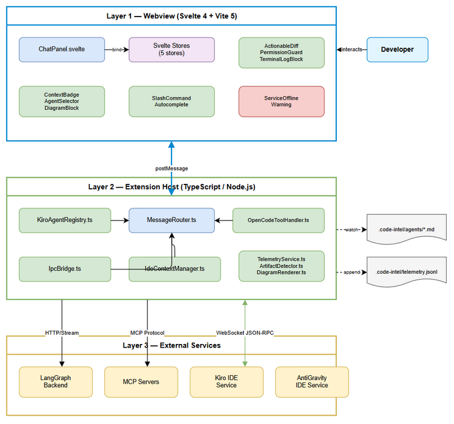
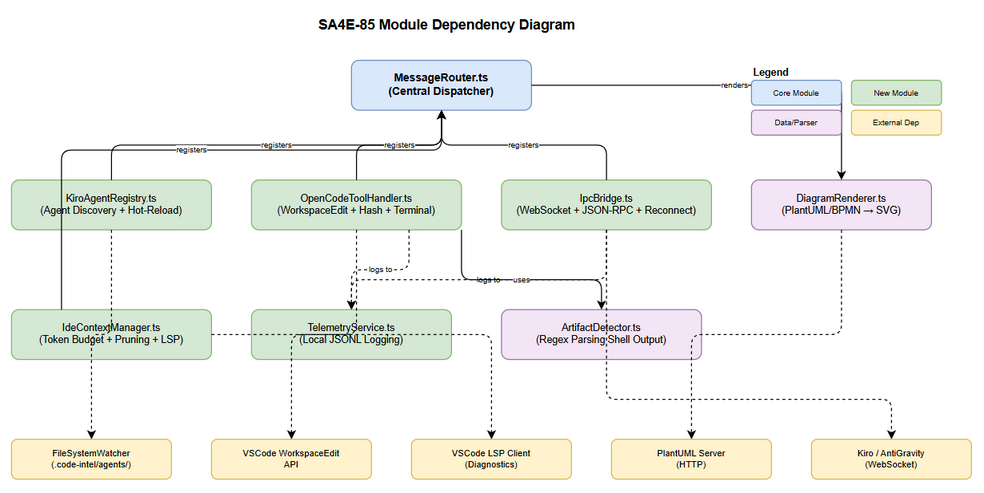

# Technical Design Document (TDD)

## SDLC Agents 4 Enterprise — SA4E-85: Nâng cấp Chat UI Agentic - Svelte Webview

---

## Document Information

| Field | Value |
|-------|-------|
| Jira Ticket | SA4E-85 |
| Title | Nâng cấp Chat UI Agentic - Svelte Webview |
| Author | SA Agent |
| Version | 1.0 |
| Date | 2026-08-01 |
| Status | Draft |
| Related FSD | FSD-v2-SA4E-85.docx |
| Related BRD | BRD-v2-SA4E-85.docx |

---

## Revision History

| Version | Date | Author | Changes |
|---------|------|--------|---------|
| 1.0 | 2026-08-01 | SA Agent | Initial TDD from FSD v2 |
| 2.0 | 2026-08-02 | SA Agent | Incorporate TDD-Review-01: token buffering, diagram skin constraints, WebSocket dispose lifecycle |
| 3.0 | 2026-08-02 | SA Agent | Backend-Driven State: LangGraphOrchestrator module, Phase 0 (5 backend tasks), Pub/Sub broadcasting, Resume Graph integration, Hydration API |
| 3.1 | 2026-08-02 | SA Agent | **[Review-05]** Backend-Driven Knowledge: LangGraph Runtime STAYS in Extension Host. New RemoteCheckpointer (HTTP → Backend KB). Removed SQLite Checkpointer as primary source. See BRD-Review/Review-05-Gap-Analysis.md |

---

## 1. Architecture Overview

### 1.1 Design Philosophy

- **Plugin/Extension Pattern**: Operates within VSCode host constraints
- **Layered Architecture**: 3-tier (Webview → Extension Host → External)
- **Reactive State**: Svelte stores drive UI reactivity
- **Message-Driven**: Cross-boundary communication via typed messages
- **Fail-Safe**: Graceful degradation when external services unavailable

### 1.2 Layer Diagram


*[Edit in draw.io](diagrams/architecture.drawio)*

**[v3.1] Layer Architecture (Backend-Driven Knowledge):**

```text
Svelte Webview (Stateless — Mirror only)
        │  postMessage
Extension Host (Thin Proxy + LangGraph Runtime in-process)
        │  RemoteCheckpointer (HTTP)
Backend Agent Server (Node)
        │  Knowledge Service (SSOT)
Knowledge Base — Threads / Messages / Checkpoints / ToolExecs / Artifacts / Events / Agents
```

> LangGraph Runtime chạy **trong Extension Host** (in-process). Toàn bộ state đọc/ghi thông qua
> `RemoteCheckpointer` gọi Backend Knowledge Service qua HTTP. Backend là nguồn dữ liệu duy nhất.

### 1.3 Technology Stack

| Layer | Technology | Constraint |
|-------|-----------|------------|
| Webview UI | Svelte 4 + Vite 5 | Bundle ≤15KB gzipped |
| State | Svelte writable/derived stores | 5 stores max — Mirrors |
| Extension Host | TypeScript (Node.js) | Activation <200ms, LangGraph in-process |
| LangGraph Runtime | @langchain/langgraph (TS) | **[v3.1]** Giữ ở Extension Host |
| RemoteCheckpointer | BaseCheckpointSaver (TS) | **[v3.1]** HTTP → Backend KB |
| Backend KB Service | Node (Hono) | **[v3.1]** SSOT: threads, messages, checkpoints, artifacts, events |
| IPC External | WebSocket + JSON-RPC 2.0 | localhost only |
| Agent Config | .code-intel/agents/*.md | YAML frontmatter |
| Rendering | PlantUML/BPMN → server-side SVG | ≤5KB bundle impact |
| Telemetry | .code-intel/telemetry.jsonl | Local-only, append |
| Integrity | SHA-256 file hash | Concurrent mod detect |

### 1.4 Communication Patterns

| Boundary | Protocol | Direction |
|----------|----------|-----------|
| Webview ↔ Extension Host | postMessage (JSON) | Bidirectional |
| Extension Host ↔ LangGraph Runtime | Direct function call (in-process) | Bidirectional |
| Extension Host ↔ Backend KB | HTTP REST (`RemoteCheckpointer`) | Request-Response |
| Extension Host ↔ MCP Servers | MCP Protocol | Bidirectional |
| Extension Host ↔ Kiro/AntiGravity | WebSocket JSON-RPC 2.0 | Bidirectional |
| Extension Host ↔ Filesystem | VSCode FileSystem API | Read/Watch/Write |

---

## 2. Module Design

### 2.1 Module Dependency Diagram


*[Edit in draw.io](diagrams/component.drawio)*

### 2.2 MessageRouter.ts

**Responsibility:** Central dispatcher routing postMessage events from Webview to correct Extension Host handler and vice-versa.

**Interfaces:**

```typescript
/**
 * SA4E-85 — MessageRouter. Routes postMessage between Webview and Extension Host handlers.
 * Validates message structure before dispatch.
 */
interface IMessageRouter {
  /** Register handler for a specific message type */
  registerHandler(type: MessageType, handler: MessageHandler): void;
  /** Dispatch incoming message to registered handler */
  dispatch(message: WebviewMessage): Promise<void>;
  /** Send message to Webview panel */
  postToWebview(message: ExtensionMessage): void;
}

type MessageHandler = (payload: unknown) => Promise<void>;
```

**Dependencies:** None (leaf module — all other modules register with it)

**Design Decisions:**
- Strategy Pattern: Each message type maps to a handler function
- Validation via discriminated union on `type` field
- Async handlers to support awaitable operations
- Error boundary per handler (one handler crash doesn't kill router)
- **[TDD-Review-01] Token Buffering:** For STREAM_TOKEN messages, Extension Host buffers tokens for 16-50ms before postMessage to Webview (reduces cross-boundary calls from per-char to per-frame). Buffer flushes on: timer expiry, STREAM_END, or buffer > 256 chars.

---

### 2.3 KiroAgentRegistry.ts

**Responsibility:** Discovers agent configurations from `.code-intel/agents/*.md`, parses YAML frontmatter, maintains live registry with hot-reload via FileSystemWatcher.

**Interfaces:**

```typescript
/**
 * SA4E-85 — KiroAgentRegistry. Agent discovery + hot-reload from workspace filesystem.
 * Watches .code-intel/agents/*.md for changes.
 */
interface IAgentRegistry {
  /** Get all currently registered agents */
  getAgents(): AgentMeta[];
  /** Get agent by ID */
  getAgent(agentId: string): AgentMeta | undefined;
  /** Start watching for file changes */
  startWatching(): void;
  /** Stop watching and dispose resources */
  dispose(): void;
  /** Event: fired when agent list changes */
  onAgentsChanged: Event<AgentMeta[]>;
}

interface AgentMeta {
  id: string;
  name: string;
  description: string;
  tools: string[];
  mcp_servers: string[];
  auto_approve: string[];
  filePath: string;
}
```

**Dependencies:** VSCode FileSystemWatcher API, YAML parser (gray-matter)

**Design Decisions:**
- Observer Pattern: Emits events on agent add/remove/update
- Hot-reload <2s (BR-11) via debounced FileSystemWatcher
- Invalid YAML → skip agent, log warning (BR-12)
- Idempotent reload: full rescan on change, compare diff

**Business Rules Implemented:** BR-11, BR-12

---

### 2.4 OpenCodeToolHandler.ts

**Responsibility:** Handles tool execution results from agents — WorkspaceEdit for code patches, terminal spawning for shell commands, file hash computation for concurrent modification detection.

**Interfaces:**

```typescript
/**
 * SA4E-85 — OpenCodeToolHandler. Manages WorkspaceEdit, terminal ops, and file integrity.
 * Implements concurrent modification detection via SHA-256 hash.
 */
interface IToolHandler {
  /** Apply code diff via WorkspaceEdit (preserves Undo/Redo) */
  applyDiff(diff: DiffBlock): Promise<ApplyResult>;
  /** Reject diff — mark as rejected */
  rejectDiff(diffId: string): void;
  /** Regenerate patch for a conflicted diff */
  regeneratePatch(diffId: string, filePath: string): Promise<DiffBlock>;
  /** Compute SHA-256 hash of file at given path */
  computeFileHash(filePath: string): Promise<string>;
  /** Spawn terminal with command for service recovery */
  runTerminalCommand(command: string, terminalName: string): void;
}

interface ApplyResult {
  success: boolean;
  error?: 'CONFLICT' | 'FILE_DELETED' | 'EDIT_FAILED';
}
```

**Dependencies:** MessageRouter, VSCode WorkspaceEdit API, VSCode Terminal API, crypto (SHA-256)

**Design Decisions:**
- Template Method: applyDiff checks hash → compare → apply/block
- SHA-256 comparison before every patch apply (BR-05)
- WorkspaceEdit preserves Undo/Redo stack (BR-23)
- Stale detection: patch >5min old triggers warning (BR-06)
- **[v3.1]** After apply/reject, diff status is persisted to Backend KB (artifact store) via RemoteCheckpointer/KB client — not kept only in client state

**Business Rules Implemented:** BR-05, BR-06, BR-07, BR-23

---

### 2.4b RemoteCheckpointer.ts [v3.1 — NEW]

**Responsibility:** LangGraph `BaseCheckpointSaver` implementation that persists checkpoint state to the **Backend Knowledge Service via HTTP** — replaces the legacy `WorkspaceCheckpointer` (JSON files in `.vscode/kiro-pipeline-state/`). Backend KB is the single source of truth.

**Interfaces:**

```typescript
/**
 * SA4E-85 — RemoteCheckpointer [v3.1].
 * Persists LangGraph checkpoints to Backend KB over HTTP.
 * Backend is the single source of truth; multi-IDE hydrate from here.
 */
class RemoteCheckpointer extends BaseCheckpointSaver {
  constructor(private kbBaseUrl: string, private options?: { timeoutMs?: number; retries?: number }) {}
  // HTTP: GET /api/v1/threads/:id/checkpoint
  getTuple(config: RunnableConfig): Promise<CheckpointTuple | undefined>;
  // HTTP: PUT /api/v1/threads/:id/checkpoint
  put(config: RunnableConfig, checkpoint: Checkpoint, metadata: CheckpointMetadata, newVersions: ChannelVersions): Promise<RunnableConfig>;
  putWrites(config: RunnableConfig, writes: PendingWrite[], taskId: string): Promise<void>;
  list(config: RunnableConfig, options?): AsyncGenerator<CheckpointTuple>;
  deleteThread(threadId: string): Promise<void>;
}
```

**Design Decisions:**
- All persistence delegated to Backend KB via HTTP REST (no local JSON writes)
- Network resilience: configurable timeout + retry; on unreachable backend → surface STREAM_ERROR(recoverable)
- Implements the SAME `BaseCheckpointSaver` contract so LangGraph engine code is unchanged
- Replaces `WorkspaceCheckpointer` (extension/src/langgraph/core/checkpointer.ts) — old code removed
- Supports `listPersistedPipelines`/`cleanup` via KB query endpoints

**Business Rules Implemented:** BR-30, BR-31

---

### 2.4c BackendKnowledgeService.ts [v3.1 — NEW]

**Responsibility:** Backend module (`backend/src/knowledge/`) — single source of truth for Threads, Messages, Checkpoints, Tool Executions, Artifacts, Event History, Agent Registry. Exposes REST API consumed by RemoteCheckpointer and hydration flows.

**API Contract (REST):**

| Method | Path | Description |
|--------|------|-------------|
| GET | `/api/v1/threads` | List threads |
| POST | `/api/v1/threads` | Create thread |
| GET | `/api/v1/threads/:id` | Thread metadata |
| GET | `/api/v1/threads/:id/messages` | Full message history |
| GET | `/api/v1/threads/:id/checkpoint` | LangGraph checkpoint (getTuple) |
| PUT | `/api/v1/threads/:id/checkpoint` | Save checkpoint (put/putWrites) |
| GET | `/api/v1/threads/:id/events` | Event sourcing log |
| GET | `/api/v1/threads/:id/artifacts` | Artifact store (diffs, diagrams) |
| GET | `/api/v1/agents` | Agent registry |
| DELETE | `/api/v1/threads/:id` | Delete thread |

**Design Decisions:**
- Entity model: Thread, Message, Checkpoint, ToolExecution, Artifact, Event, Agent
- Event Sourcing (P1-2): every mutation is an append-only event; checkpoint is a projection
- Auth: JWT (reuse existing middleware in `backend/src/server/middleware/jwt-auth.ts`)
- No SQLite Checkpointer as primary source — DB is an internal persistence layer of Knowledge Service only

---

### 2.5 IpcBridge.ts [DEPRECATED — v3.1]

> ⚠️ **DESIGN FLAW IDENTIFIED:** LangGraph is an in-process TypeScript module, NOT a separate server. Extension runs INSIDE the IDE. Therefore WebSocket/JSON-RPC/service discovery is UNNECESSARY for core functionality. Direct function call between modules is the correct pattern.
>
> **Kept for:** Potential future multi-process scaling (Phase 2.0)
> **Status:** Code exists but NOT wired into main application flow

**Original Responsibility:** Managed WebSocket connections to external IDE services.

**Interfaces:**

```typescript
/**
 * SA4E-85 — IpcBridge. WebSocket JSON-RPC 2.0 connection manager.
 * Auto-reconnect with exponential backoff. Localhost-only connections.
 */
interface IIpcBridge {
  /** Connect to service discovered from .run/*.json */
  connect(service: ServiceDiscovery): Promise<void>;
  /** Disconnect from service */
  disconnect(serviceId: string): void;
  /** Send JSON-RPC request */
  call(serviceId: string, method: string, params: unknown): Promise<unknown>;
  /** Get connection status for all services */
  getStatus(): Map<string, ServiceStatus>;
  /** Event: connection status changed */
  onStatusChanged: Event<{ service: string; status: ServiceStatus }>;
  /** Dispose all connections */
  dispose(): void;
}

interface ServiceDiscovery {
  ws_endpoint: string;   // Must be ws://localhost:*
  rest_endpoint: string;
  pid: number;
  status: string;
  version: string;
  started_at: string;
}

type ServiceStatus = 'connected' | 'connecting' | 'disconnected' | 'offline';
```

**Dependencies:** MessageRouter, ws (WebSocket library), FileSystemWatcher (.run/*.json)

**Design Decisions:**
- Exponential backoff: 1s, 2s, 4s, 8s, 16s — max 5 retries (BR-13)
- Localhost-only validation on ws_endpoint (BR-14)
- Service discovery via .code-intel/.run/{service}.json
- Dual connection support: Kiro + AntiGravity simultaneously
- Auto-disconnect on .run/*.json file deletion
- **[TDD-Review-01] Lifecycle Management (CRITICAL):** `IpcBridge.dispose()` MUST be pushed into `ExtensionContext.subscriptions[]` during activation. This ensures WebSocket cleanup on extension deactivate/uninstall, preventing memory leaks from orphaned reconnect timers and dangling socket handles.

**Business Rules Implemented:** BR-13, BR-14

---

### 2.6 IdeContextManager.ts

**Responsibility:** Manages agent context — tracks token usage, file list, implements context pruning algorithm, provides LSP diagnostic integration.

**Interfaces:**

```typescript
/**
 * SA4E-85 — IdeContextManager. Token budget management, file tracking, and context pruning.
 * Implements auto-suggest pruning at >90% token usage.
 */
interface IContextManager {
  /** Get current context state */
  getState(): ContextState;
  /** Add file to context */
  pinFile(filePath: string, tokenCount: number): void;
  /** Remove file from context */
  unpinFile(filePath: string): void;
  /** Clear all context (with confirmation) */
  clearAll(): void;
  /** Get prune suggestions when over threshold */
  suggestPrune(): ContextFile[];
  /** Get active file diagnostics from LSP */
  getDiagnostics(filePath: string): Diagnostic[];
  /** Event: context state changed */
  onContextChanged: Event<ContextState>;
}

interface ContextState {
  tokenCount: number;
  maxTokens: number;
  files: ContextFile[];
  usagePercent: number;
  pruneSuggestions: ContextFile[];
}

interface ContextFile {
  filePath: string;
  tokenCount: number;
  pinnedAt: number;
  relevanceScore: number;
}
```

**Dependencies:** MessageRouter, VSCode Language Client (LSP)

**Design Decisions:**
- Pruning algorithm: sort by `age*0.4 + size*0.3 + (1-relevance)*0.3`
- Collect until freed >= tokenCount - maxTokens*0.7
- Badge pulse at >80% (BR-08), auto-suggest at >90% (BR-09)
- /clear resets ALL context with confirmation (BR-10)
- File locked by agent → cannot unpin during generation

**Business Rules Implemented:** BR-08, BR-09, BR-10

---

### 2.7 TelemetryService.ts

**Responsibility:** Local-only telemetry logging to `.code-intel/telemetry.jsonl`. Records diff actions, tool executions, context pruning, and stream errors.

**Interfaces:**

```typescript
/**
 * SA4E-85 — TelemetryService. Local-only append logging to telemetry.jsonl.
 * No external transmission — privacy-first design.
 */
interface ITelemetryService {
  /** Log a diff accept/reject action */
  logDiffAction(agentId: string, action: string, toolName: string, filePath: string): void;
  /** Log tool execution metrics */
  logToolExec(toolName: string, durationMs: number, success: boolean, agentId: string): void;
  /** Log context prune event */
  logContextPrune(action: string, filePath: string, tokenFreed: number): void;
  /** Log stream error */
  logStreamError(code: string, agentId: string, recoverable: boolean): void;
}
```

**Dependencies:** VSCode FileSystem API (append-only write)

**Design Decisions:**
- Append-only JSONL format (one JSON object per line)
- No network calls — purely local (BR-20)
- Async write with buffer flush on dispose
- File rotation: new file per day (optional future enhancement)

**Business Rules Implemented:** BR-20

---

### 2.8 ArtifactDetector.ts

**Responsibility:** Parses shell output (stdout/stderr) using regex patterns to detect report/artifact paths. Generates ArtifactLink[] for TerminalLogBlock rendering.

**Interfaces:**

```typescript
/**
 * SA4E-85 — ArtifactDetector. Regex-based detection of artifact paths from shell output.
 * Detects test reports, coverage reports, and build artifacts.
 */
interface IArtifactDetector {
  /** Scan shell output for artifact paths */
  detect(output: string): ArtifactLink[];
  /** Register additional detection pattern */
  addPattern(pattern: RegExp, label: string, type: ArtifactType): void;
}

interface ArtifactLink {
  label: string;
  path: string;
  type: 'report' | 'diagram' | 'deep-link';
}

type ArtifactType = 'report' | 'diagram' | 'deep-link';
```

**Dependencies:** None (pure function module)

**Design Decisions:**
- Default patterns: `(?:target|build|dist|out)/[^\s]+\.(html|pdf|json|xml)`
- Known report paths: serenity, allure, coverage
- Extensible: new patterns registerable at runtime
- Stateless: no side effects, pure detection

**Business Rules Implemented:** BR-27

---

### 2.9 DiagramRenderer.ts

**Responsibility:** Renders PlantUML/BPMN/CMMN diagram source to SVG via server-side rendering. Manages render cache for performance.

**Interfaces:**

```typescript
/**
 * SA4E-85 — DiagramRenderer. Local PlantUML CLI rendering to SVG.
 * Bundle impact: 0KB — uses local plantuml binary, no npm dependency.
 */
interface IDiagramRenderer {
  /** Render diagram source to SVG string */
  render(block: DiagramBlock): Promise<string>;
  /** Check if renderer supports given diagram type */
  supports(type: DiagramType): boolean;
  /** Clear render cache */
  clearCache(): void;
}

interface DiagramBlock {
  diagramId: string;
  type: 'plantuml' | 'bpmn' | 'cmmn' | 'drawio-xml';
  source: string;
  renderedSvg?: string;
  agentId: string;
}

type DiagramType = 'plantuml' | 'bpmn' | 'cmmn' | 'drawio-xml';
```

**Dependencies:** Local PlantUML CLI (`plantuml` binary or `java -jar plantuml.jar`). No npm dependencies for rendering.

**Design Decisions:**
- Server-side rendering: encode → fetch SVG from PlantUML server
- Bundle ≤5KB impact (BR-29) — no client-side parser
- LRU cache: max 50 rendered SVGs in memory
- Fallback: if server unreachable, show source in code block
- BPMN/CMMN: delegate to same server or local lightweight parser
- **[TDD-Review-01] Minimal Design Skin:** All PlantUML requests MUST include default skin params to enforce clean rendering: `skinparam linetype ortho`, `skinparam nodesep 60`, `skinparam ranksep 40`, `hide empty members`. This prevents cluttered diagrams when displayed in constrained chat viewport.

**Business Rules Implemented:** BR-28, BR-29


---

## 3. Svelte Component Architecture

### 3.1 Component Tree

```
ChatPanel.svelte (root)
├── ChatHeader.svelte
│   ├── AgentSelector.svelte (dropdown)
│   └── ContextBadge.svelte (progress bar + file list)
├── ServiceOfflineWarning.svelte (conditional)
├── ChatMessageList.svelte (virtualized)
│   └── ChatMessage.svelte (per message)
│       ├── ThinkingBlock.svelte (collapsible)
│       ├── ToolSpinner.svelte (inline indicator)
│       ├── TerminalLogBlock.svelte (shell output)
│       │   └── ArtifactLinkButton.svelte
│       ├── ActionableDiff.svelte (unified diff)
│       ├── PermissionGuard.svelte (approval modal)
│       └── DiagramBlock.svelte (inline SVG)
├── SlashCommandAutocomplete.svelte (popup)
└── ChatInput.svelte (textarea + send button)
```

### 3.2 Store Bindings

| Store | Type | Bound Components |
|-------|------|-----------------|
| chatStore | ChatState | ChatMessageList, ChatInput, ChatMessage |
| agentStore | AgentState | AgentSelector, ChatInput (agentId) |
| contextStore | ContextState | ContextBadge |
| toolStore | ToolState | PermissionGuard, ToolSpinner, TerminalLogBlock |
| connectionStore | ConnectionState | ServiceOfflineWarning |

### 3.3 Event Flow (Webview Internal)

```
User types → ChatInput dispatches 'send'
  → chatStore.addMessage(user)
  → postMessage(SEND_PROMPT) to Extension Host

Extension Host responds:
  STREAM_START → chatStore.startStream()
  STREAM_TOKEN → chatStore.appendToken()
  STREAM_END → chatStore.finalizeMessage()
  TOOL_CALL_REQUEST → toolStore.addTool()
  CONTEXT_UPDATE → contextStore.update()
```

### 3.4 Virtualization Strategy (BR-18)

- Use `svelte-virtual-list` or custom implementation
- Render only visible messages + 5 buffer above/below
- Messages ≤1000 at 60fps target
- Overscan: 200px above and below viewport
- Key: message.id for stable DOM recycling

### 3.5 Component Size Constraint (BR-19)

Each Svelte component ≤200 lines. Decomposition strategy:
- Logic extraction to TypeScript modules
- Shared utilities in `lib/` folder
- Event handlers in separate `handlers/` modules
- Store interactions via thin wrapper functions

---

## 4. API Design — Message Type Definitions

### 4.1 Base Message Types

```typescript
/**
 * SA4E-85 — Message protocol type definitions.
 * Discriminated union on 'type' field for type-safe routing.
 */

// Direction: Extension Host → Webview
type ExtensionMessage =
  | { type: 'STREAM_START'; messageId: string; agentId: string }
  | { type: 'STREAM_TOKEN'; messageId: string; token: string }
  | { type: 'STREAM_END'; messageId: string }
  | { type: 'STREAM_ERROR'; messageId: string; error: StreamError }
  | { type: 'THINKING_START'; messageId: string }
  | { type: 'THINKING_TOKEN'; messageId: string; token: string }
  | { type: 'THINKING_END'; messageId: string }
  | { type: 'TOOL_CALL_REQUEST'; toolId: string; name: string; args: Record<string, unknown>; requiresApproval: boolean; toolType: ToolType }
  | { type: 'TOOL_STREAM_OUTPUT'; toolId: string; chunk: string; stream: 'stdout' | 'stderr' }
  | { type: 'MCP_TOOL_RESULT'; toolId: string; result: ToolResult; error?: string }
  | { type: 'SYNC_AVAILABLE_AGENTS'; agents: AgentMeta[] }
  | { type: 'IPC_STATUS'; service: string; status: ServiceStatus; endpoint?: string }
  | { type: 'CONTEXT_UPDATE'; tokenCount: number; maxTokens: number; files: ContextFile[] }
  | { type: 'SYNC_CHAT_HISTORY'; messages: ChatMessage[]; context: ContextState }; // [v3.1] hydrate from Backend KB

// Direction: Webview → Extension Host
type WebviewMessage =
  | { type: 'SEND_PROMPT'; text: string; agentId: string; contextFiles?: string[] }
  | { type: 'TOOL_CALL_RESPONSE'; toolId: string; decision: 'APPROVE' | 'REJECT' }
  | { type: 'COMMAND_DISPATCH'; command: string; args?: Record<string, unknown> }
  | { type: 'RUN_TERMINAL_COMMAND'; command: string; terminalName: string }
  | { type: 'ACTION_ACCEPT_DIFF'; diffId: string; filePath: string; patch: string }
  | { type: 'ACTION_REJECT_DIFF'; diffId: string }
  | { type: 'REGENERATE_PATCH'; diffId: string; filePath: string }
  | { type: 'CONTEXT_UNPIN_FILE'; filePath: string }
  | { type: 'CONTEXT_CLEAR' }
  | { type: 'REQUEST_SYNC_STATE' }; // [v3.1] Webview requests full state from Backend KB
```

### 4.2 Error Types

```typescript
interface StreamError {
  code: StreamErrorCode;
  message: string;
  recoverable: boolean;
}

type StreamErrorCode =
  | 'BACKEND_CRASH'      // LangGraph died — retry
  | 'LLM_TIMEOUT'       // API timeout — retry
  | 'CONNECTION_LOST'   // Network drop — auto-retry 3x
  | 'CONTEXT_OVERFLOW'  // Token exceeded — suggest prune
  | 'AGENT_NOT_FOUND'   // Invalid ID — error + reset
  | 'RATE_LIMITED';     // Rate limit — wait + retry

type ToolType = 'read' | 'write' | 'shell' | 'search' | 'delete' | 'git';
```

### 4.3 Validation Rules

| Field | Validation | Error Response |
|-------|-----------|---------------|
| `type` | Must be valid MessageType enum value | Silently drop + log |
| `messageId` | Non-empty string, UUID format | Reject with error |
| `text` (SEND_PROMPT) | Non-empty, trimmed | Block send button |
| `agentId` | Must exist in agentStore | AGENT_NOT_FOUND error |
| `toolId` | Must match active tool | Silently drop |
| `decision` | 'APPROVE' or 'REJECT' only | Ignore |
| `filePath` | Relative to workspace root | Reject with error |
| `patch` | Valid unified diff format | Block apply |

---

## 5. Error Handling Strategy

### 5.1 STREAM_ERROR Recovery

| Code | Recovery Strategy | UI |
|------|------------------|-----|
| BACKEND_CRASH | Show retry button, user clicks → resend prompt | Red inline + "Retry" |
| LLM_TIMEOUT | Show retry button with countdown | Red inline + "Retry" |
| CONNECTION_LOST | Auto-retry 3x with 2s interval, then show error | Yellow → Red |
| CONTEXT_OVERFLOW | Disable retry, show prune suggestion | Red + "Reduce Context" |
| AGENT_NOT_FOUND | Reset to default agent, show error | Red + agent selector |
| RATE_LIMITED | Show wait timer, auto-retry after cooldown | Yellow + countdown |

### 5.2 IPC Disconnect Recovery

```
State Machine: connected → disconnected → reconnecting → connected/offline

1. Connection drops → status = 'disconnected'
2. Start backoff: delays = [1000, 2000, 4000, 8000, 16000] ms
3. Each attempt: try WebSocket reconnect
4. Success → status = 'connected', reset retry count
5. All 5 retries fail → status = 'offline'
6. Show "Auto-start" button (UC-08)
7. User clicks → RUN_TERMINAL_COMMAND to spawn service
8. .run/*.json reappears → re-read → reconnect
```

### 5.3 File Conflict Resolution (Concurrent Modification)

```
Accept Click Flow:
1. User clicks "Accept" on ActionableDiff
2. Compute current file SHA-256 hash
3. Compare with DiffBlock.fileHashAtGeneration
4. Match → apply WorkspaceEdit → status = 'applied'
5. Mismatch → BLOCK → show "File Modified" alert
   → Offer "Regenerate Patch" button
6. User clicks "Regenerate" → REGENERATE_PATCH message
7. Extension Host requests new diff from agent
8. New DiffBlock returned with fresh hash
```

### 5.4 Error Boundaries

| Boundary | Scope | Recovery |
|----------|-------|----------|
| MessageRouter dispatch | Per-handler | Log error, continue other handlers |
| IpcBridge call | Per-RPC call | Reject promise, caller handles |
| RemoteCheckpointer | Per-HTTP request | **[v3.1]** Timeout + retry; STREAM_ERROR(recoverable) nếu backend unreachable |
| AgentRegistry parse | Per-file | Skip invalid, continue scan |
| TelemetryService write | Per-entry | Buffer, retry on next flush |
| DiagramRenderer render | Per-diagram | Show source code fallback |
| WorkspaceEdit apply | Per-edit | Toast error, keep "Pending" |


---

## 6. Security Design

### 6.1 Content Security Policy (CSP)

```
default-src 'none';
style-src ${webview.cspSource} 'nonce-${nonce}';
script-src 'nonce-${nonce}';
img-src ${webview.cspSource} data:;
font-src ${webview.cspSource};
connect-src ws://localhost:* http://localhost:*;
```

**Rules:**
- No inline scripts (all via nonce) — BR-24
- No eval() or Function() constructor
- Images: only from extension resources or data URIs (SVG diagrams)
- WebSocket: localhost only (explicit connect-src)
- No external CDN or remote resources

### 6.2 Permission Model

| Tool Type | Risk Level | Approval Required | Reference |
|-----------|-----------|-------------------|-----------|
| read, search, list | Safe (🟢) | No — auto-approve | BR-02 |
| write, shell, delete, git | Dangerous (🔴) | Yes — PermissionGuard | BR-01 |

**Session Approval:**
- "Allow All Session" applies to same tool TYPE only (BR-04)
- Stored in toolStore.sessionApprovals: Set<string>
- Cleared on extension deactivate or window reload
- 60s timeout on unanswered permission → auto-deny (BR-03)

### 6.3 IPC Security — Localhost Only (BR-14)

```typescript
// Validation in IpcBridge.connect()
function validateEndpoint(endpoint: string): boolean {
  const url = new URL(endpoint);
  // MUST be localhost — reject any non-local address
  const allowedHosts = ['localhost', '127.0.0.1', '::1'];
  return allowedHosts.includes(url.hostname)
    && url.protocol === 'ws:';
}
```

**Additional Controls:**
- No authentication tokens in WebSocket URL (use headers)
- JSON-RPC responses validated against expected schema
- Maximum message size: 10MB (prevent memory exhaustion)
- Connection timeout: 5s (prevent hung connections)

### 6.4 File System Access Controls

| Operation | Scope | Protection |
|-----------|-------|-----------|
| Agent config read | .code-intel/agents/ only | Path validation |
| Service discovery | .code-intel/.run/ only | Path validation |
| Telemetry write | .code-intel/telemetry.jsonl only | Append-only |
| WorkspaceEdit | Workspace files only | VSCode API sandbox |
| File hash read | Any workspace file | Read-only access |

### 6.5 Input Sanitization

| Input Source | Sanitization |
|-------------|-------------|
| Agent YAML frontmatter | Schema validation, reject unknown fields |
| Shell output (TerminalLogBlock) | HTML entity encoding before render |
| Diff content | Syntax highlighting via tokenizer, no raw HTML |
| User prompt text | Trim, length limit (10K chars) |
| Diagram SVG from server | DOMPurify sanitization before DOM insert |
| JSON-RPC responses | JSON schema validation |

### 6.6 WCAG 2.1 AA Compliance (BR-25)

| Requirement | Implementation |
|-------------|---------------|
| Keyboard navigation | Tab order for all interactive elements |
| Focus management | Focus trap in PermissionGuard modal |
| ARIA labels | All buttons, status indicators, progress bars |
| Color contrast | 4.5:1 minimum for text |
| Screen reader | Role announcements for state changes |
| Reduced motion | Respect `prefers-reduced-motion` for animations |

### 6.7 [v3.0] Graph Resume Authorization — Challenge-Response (Security Finding #11)

**Problem:** In Multi-IDE architecture, a rogue local process could connect to WebSocket and send `TOOL_CALL_RESPONSE(APPROVE)` to bypass PermissionGuard without human interaction.

**Solution: First-Responder Lock + Challenge Token**

```typescript
/**
 * SA4E-85 — Graph Resume Authorization.
 * Prevents unauthorized tool approval by ensuring only the client that
 * displayed PermissionGuard can respond. Uses crypto challenge token.
 */

interface InterruptChallenge {
  toolId: string;
  /** Random 32-byte hex challenge issued WITH TOOL_CALL_REQUEST */
  challenge: string;
  /** Client ID that received the interrupt (first-responder) */
  issuedTo: string;
  /** Expiry timestamp — matches BR-03 (60s timeout) */
  expiresAt: number;
}

interface SecureToolCallResponse {
  type: 'TOOL_CALL_RESPONSE';
  toolId: string;
  decision: 'APPROVE' | 'REJECT';
  /** Client MUST echo back the challenge token to prove ownership */
  challengeResponse: string;
  /** Client ID must match issuedTo */
  clientId: string;
}
```

**Flow:**

1. Backend calls `interrupt()` → issues `TOOL_CALL_REQUEST` with `challenge: crypto.randomBytes(32).hex()`
2. Backend records: `{ toolId, challenge, issuedTo: firstClientId, expiresAt: now+60s }`
3. Only ONE client receives the challenge (first connected client for that thread OR client that triggered the prompt)
4. Client displays PermissionGuard, stores `challenge` in memory
5. User clicks Allow/Deny → client sends `SecureToolCallResponse` with echoed `challengeResponse`
6. Backend verifies: `response.challengeResponse === stored.challenge && response.clientId === stored.issuedTo`
7. If mismatch → REJECT + log security warning
8. If expired (>60s) → auto-REJECT
9. After first valid response → mark challenge as consumed (no replay)
10. Broadcast `TOOL_RESOLVED { toolId, decision }` to other clients so they dismiss any duplicate PermissionGuard UI

**Rules:**
- Challenge token generated via `crypto.randomBytes(32)` (256 bits entropy)
- One challenge per toolId — consumed after first valid response
- Only the first-responder client (that received the interrupt) can respond
- Other connected clients receive `TOOL_RESOLVED` notification only
- Challenge NOT stored in session.json or filesystem — memory-only on backend

**Business Rules Implemented:** BR-01 (reinforced), BR-03 (60s timeout)
**Security Finding Addressed:** #11 (Unauthorized Graph Resume)

---

## 7. Performance Design

### 7.1 Bundle Budget (BR-15)

| Module | Estimated Size (gzipped) | Strategy |
|--------|-------------------------|----------|
| Svelte runtime | ~4KB | Tree-shaken |
| Components (7) | ~5KB | Code-split by route |
| Stores + utils | ~2KB | Shared bundle |
| plantuml-encoder | ~0KB | **[TDD-Review-01] Local CLI** — no npm dep needed |
| **Total** | **~14KB** | **Under 15KB target** |

### 7.2 Rendering Performance

| Metric | Target | Implementation |
|--------|--------|---------------|
| First render | <100ms (BR-16) | Pre-compiled Svelte, minimal hydration |
| Activation impact | <200ms (BR-17) | Lazy module loading, deferred IPC connect |
| Chat scroll 1000 msgs | 60fps (BR-18) | Virtual list, recycle DOM nodes |
| Token stream render | <16ms per token | requestAnimationFrame batching |
| Agent registry reload | <2s (BR-11) | Incremental diff, not full re-parse |

### 7.3 Lazy Loading Strategy

```
Extension Activate:
  1. Register Webview Provider (immediate)
  2. Start AgentRegistry watcher (immediate)
  3. Defer: IpcBridge connect (after first message)
  4. Defer: TelemetryService init (after first event)
  5. Defer: DiagramRenderer (on first diagram block)
```


---

## 8. Implementation Checklist (Ordered Tasks for DEV Agent)

### Phase 0: Backend Knowledge Service + RemoteCheckpointer (Days 1-3) [v3.1]

| # | Task | Module | Depends On | BR |
|---|------|--------|-----------|-----|
| 0.1 | Backend KB: entity + schema (Thread, Message, Checkpoint, ToolExecution, Artifact, Event, Agent) | backend/src/knowledge/ | — | BR-30 |
| 0.2 | Backend KB: repository + service + REST API (threads/messages/checkpoint/events/artifacts/agents) | backend/src/knowledge/ | 0.1 | BR-30 |
| 0.3 | Backend KB: Checkpoint REST endpoints (GET/PUT /api/v1/threads/:id/checkpoint) | backend/src/knowledge/ | 0.2 | BR-30 |
| 0.4 | RemoteCheckpointer (BaseCheckpointSaver → HTTP) in extension | extension/src/langgraph/core/remote-checkpointer.ts | 0.3 | BR-30 |
| 0.5 | Remove WorkspaceCheckpointer; wire RemoteCheckpointer into LangGraph engine | extension/src/langgraph/ | 0.4 | BR-30 |
| 0.6 | Stateless SessionManager: thread_id via backend, drop .code-intel/.run/session.json as source | extension/src/chat/engine/SessionManager.ts | 0.3 | BR-31 |
| 0.7 | Hydration flow: REQUEST_SYNC_STATE → KB query → SYNC_CHAT_HISTORY | ChatEngineAdapter + MessageRouter | 0.5 | BR-31 |

### Phase 1: Foundation (Days 4-5)

| # | Task | Module | Depends On | BR |
|---|------|--------|-----------|-----|
| 1.1 | Setup Vite + Svelte 4 project structure | Build | — | BR-15 |
| 1.2 | Configure CSP nonce injection | Webview Provider | 1.1 | BR-24 |
| 1.3 | Implement MessageRouter with type validation | MessageRouter.ts | 1.1 | — |
| 1.4 | Define all message type discriminated unions | types/ | 1.3 | — |
| 1.5 | Create 5 Svelte stores (chat, agent, context, tool, connection) | stores/ | 1.1 | — |
| 1.6 | Implement postMessage bridge (Webview ↔ Host) | MessageRouter.ts | 1.3 | — |

### Phase 2: Core Chat (Days 3-4)

| # | Task | Module | Depends On | BR |
|---|------|--------|-----------|-----|
| 2.1 | ChatPanel root component | ChatPanel.svelte | 1.5 | BR-19 |
| 2.2 | ChatInput with slash command detection | ChatInput.svelte | 2.1 | — |
| 2.3 | ChatMessageList with virtual scrolling | ChatMessageList.svelte | 2.1 | BR-18 |
| 2.4 | ChatMessage renderer (markdown + code) | ChatMessage.svelte | 2.3 | — |
| 2.5 | ThinkingBlock (collapsible reasoning) | ThinkingBlock.svelte | 2.4 | — |
| 2.6 | Stream token handling (RAF batching) | chatStore | 1.5, 1.6 | BR-16 |

### Phase 3: Agent Registry (Day 5)

| # | Task | Module | Depends On | BR |
|---|------|--------|-----------|-----|
| 3.1 | KiroAgentRegistry with FileSystemWatcher | KiroAgentRegistry.ts | 1.3 | BR-11 |
| 3.2 | YAML frontmatter parser (gray-matter) | KiroAgentRegistry.ts | 3.1 | BR-12 |
| 3.3 | AgentSelector dropdown component | AgentSelector.svelte | 3.1, 1.5 | — |
| 3.4 | SlashCommandAutocomplete component | SlashCommandAutocomplete.svelte | 3.3 | — |
| 3.5 | Hot-reload <2s validation | KiroAgentRegistry.ts | 3.1 | BR-11 |

### Phase 4: Tool Execution (Days 6-7)

| # | Task | Module | Depends On | BR |
|---|------|--------|-----------|-----|
| 4.1 | ToolSpinner inline indicator | ToolSpinner.svelte | 2.4 | — |
| 4.2 | TerminalLogBlock (streaming shell) | TerminalLogBlock.svelte | 4.1 | BR-21, BR-22 |
| 4.3 | ArtifactDetector regex engine | ArtifactDetector.ts | 4.2 | BR-27 |
| 4.4 | ArtifactLinkButton component | ArtifactLinkButton.svelte | 4.3 | BR-27 |
| 4.5 | PermissionGuard modal + timer | PermissionGuard.svelte | 4.1 | BR-01, BR-03, BR-04 |
| 4.6 | Session approval tracking | toolStore | 4.5 | BR-04 |

### Phase 5: Code Diff (Days 8-9)

| # | Task | Module | Depends On | BR |
|---|------|--------|-----------|-----|
| 5.1 | ActionableDiff component (syntax highlight) | ActionableDiff.svelte | 2.4 | — |
| 5.2 | SHA-256 file hash computation | OpenCodeToolHandler.ts | 1.3 | BR-05 |
| 5.3 | Concurrent modification detection | OpenCodeToolHandler.ts | 5.2 | BR-07 |
| 5.4 | WorkspaceEdit integration (Undo/Redo) | OpenCodeToolHandler.ts | 5.1 | BR-23 |
| 5.5 | Stale patch warning (>5min) | ActionableDiff.svelte | 5.1 | BR-06 |
| 5.6 | Regenerate patch flow | OpenCodeToolHandler.ts | 5.3 | BR-07 |

### Phase 6: Context Management (Day 10)

| # | Task | Module | Depends On | BR |
|---|------|--------|-----------|-----|
| 6.1 | ContextBadge with progress bar | ContextBadge.svelte | 1.5 | BR-08 |
| 6.2 | File list expand/collapse + unpin | ContextBadge.svelte | 6.1 | — |
| 6.3 | Pruning algorithm implementation | IdeContextManager.ts | 1.3 | BR-09 |
| 6.4 | Auto-suggest UI at >90% | ContextBadge.svelte | 6.3 | BR-09 |
| 6.5 | Badge pulse animation at >80% | ContextBadge.svelte | 6.1 | BR-08 |

### Phase 7: IPC Bridge (Days 11-12)

| # | Task | Module | Depends On | BR |
|---|------|--------|-----------|-----|
| 7.1 | Service discovery (.run/*.json reader) | IpcBridge.ts | 1.3 | — |
| 7.2 | WebSocket connection manager | IpcBridge.ts | 7.1 | BR-14 |
| 7.3 | JSON-RPC 2.0 request/response handler | IpcBridge.ts | 7.2 | — |
| 7.4 | Exponential backoff reconnect | IpcBridge.ts | 7.2 | BR-13 |
| 7.5 | ServiceOfflineWarning component | ServiceOfflineWarning.svelte | 7.4, 1.5 | — |
| 7.6 | Auto-start terminal command | IpcBridge.ts | 7.5 | — |
| 7.7 | Deep-link "Open in AntiGravity" button | TerminalLogBlock.svelte | 7.3 | BR-26 |

### Phase 8: Diagram Rendering + Telemetry (Day 13)

| # | Task | Module | Depends On | BR |
|---|------|--------|-----------|-----|
| 8.1 | DiagramRenderer (local PlantUML CLI) | DiagramRenderer.ts | 1.3 | BR-28 |
| 8.2 | DiagramBlock inline SVG component | DiagramBlock.svelte | 8.1 | BR-29 |
| 8.3 | TelemetryService (JSONL append) | TelemetryService.ts | 1.3 | BR-20 |
| 8.4 | Telemetry hooks in all modules | All modules | 8.3 | BR-20 |

### Phase 9: Polish + Performance (Days 14-15)

| # | Task | Module | Depends On | BR |
|---|------|--------|-----------|-----|
| 9.1 | Bundle size audit (≤15KB) | Build | All | BR-15 |
| 9.2 | First render benchmark (<100ms) | Webview | All | BR-16 |
| 9.3 | Activation impact test (<200ms) | Extension | All | BR-17 |
| 9.4 | WCAG 2.1 AA audit | All components | All | BR-25 |
| 9.5 | Error handling integration test | All modules | All | — |
| 9.6 | Chat header layout (AgentSelector + ContextBadge) | ChatHeader.svelte | 3.3, 6.1 | — |

---

## 9. Data Flow Diagrams

### 9.1 Chat Message Flow

```
Developer → ChatInput → SEND_PROMPT → MessageRouter → LangGraph Runtime (Extension Host)
                                                              ↓ (RemoteCheckpointer HTTP)
                                                         Backend Knowledge Service
                                                              ↓
Developer ← ChatMessage ← chatStore ← STREAM_TOKEN ← MessageRouter
```

### 9.2 Tool Approval Flow

```
LangGraph Runtime → TOOL_CALL_REQUEST → MessageRouter → toolStore → PermissionGuard
                                                                          ↓
LangGraph Runtime ← TOOL_CALL_RESPONSE ← MessageRouter ← toolStore ← User Decision
        ↓
Backend Knowledge Service (persist tool execution + checkpoint)
```

### 9.3 IPC Bridge Flow

```
.run/kiro.json → FileSystemWatcher → IpcBridge → WebSocket → Kiro Service
                                          ↓
              connectionStore ← IPC_STATUS ← IpcBridge ← JSON-RPC Response
```

---

## 10. Appendix

### 10.1 Diagram Index

| # | Diagram | Image | Source (editable) |
|---|---------|-------|-------------------|
| 1 | 3-Layer Architecture | [architecture.png](diagrams/architecture.png) | [architecture.drawio](diagrams/architecture.drawio) |
| 2 | Module Dependencies | [component.png](diagrams/component.png) | [component.drawio](diagrams/component.drawio) |

### 10.2 Business Rule Traceability

| BR-ID | Module | Section |
|-------|--------|---------|
| BR-01 | PermissionGuard, toolStore | 2.4, 4, 6 |
| BR-02 | PermissionGuard | 6.2 |
| BR-03 | PermissionGuard | 6.2 |
| BR-04 | toolStore | 6.2 |
| BR-05 | OpenCodeToolHandler | 2.4, 5.3 |
| BR-06 | ActionableDiff, OpenCodeToolHandler | 2.4 |
| BR-07 | OpenCodeToolHandler | 2.4, 5.3 |
| BR-08 | ContextBadge, IdeContextManager | 2.6 |
| BR-09 | IdeContextManager | 2.6 |
| BR-10 | IdeContextManager | 2.6 |
| BR-11 | KiroAgentRegistry | 2.3 |
| BR-12 | KiroAgentRegistry | 2.3 |
| BR-13 | IpcBridge | 2.5 |
| BR-14 | IpcBridge | 2.5, 6.3 |
| BR-15 | Build config | 7.1 |
| BR-16 | Webview, chatStore | 7.2 |
| BR-17 | Extension activate | 7.2 |
| BR-18 | ChatMessageList | 3.4, 7.2 |
| BR-19 | All components | 3.5 |
| BR-20 | TelemetryService | 2.7 |
| BR-21 | TerminalLogBlock | Component spec |
| BR-22 | TerminalLogBlock | Component spec |
| BR-23 | OpenCodeToolHandler | 2.4 |
| BR-24 | Webview Provider CSP | 6.1 |
| BR-25 | All components | 6.6 |
| BR-26 | TerminalLogBlock | 2.8 |
| BR-27 | ArtifactDetector | 2.8 |
| BR-28 | DiagramRenderer | 2.9 |
| BR-29 | DiagramRenderer | 2.9 |
| BR-30 | RemoteCheckpointer, BackendKnowledgeService | 2.4b, 2.4c |
| BR-31 | RemoteCheckpointer, BackendKnowledgeService, SessionManager | 2.4b, 2.4c, 2.4 |

### 10.3 FSD Use Case Coverage

| UC-ID | TDD Module(s) | Section |
|-------|--------------|---------|
| UC-01 | MessageRouter, chatStore, ChatMessage | 2.2, 3, 4 |
| UC-02 | OpenCodeToolHandler, ActionableDiff | 2.4, 5.3 |
| UC-03 | ToolSpinner, TerminalLogBlock, ArtifactDetector | 2.8 |
| UC-04 | IdeContextManager, ContextBadge | 2.6 |
| UC-05 | KiroAgentRegistry, AgentSelector | 2.3 |
| UC-06 | PermissionGuard, toolStore | 4 |
| UC-07 | IpcBridge | 2.5 |
| UC-08 | ServiceOfflineWarning, IpcBridge | 2.5, 5.2 |
| UC-09 | OpenCodeToolHandler (hash check) | 2.4, 5.3 |
| UC-10 | IdeContextManager (pruning) | 2.6 |
| UC-11 | BackendKnowledgeService, RemoteCheckpointer, SessionManager, ChatEngineAdapter | 2.4b, 2.4c |
