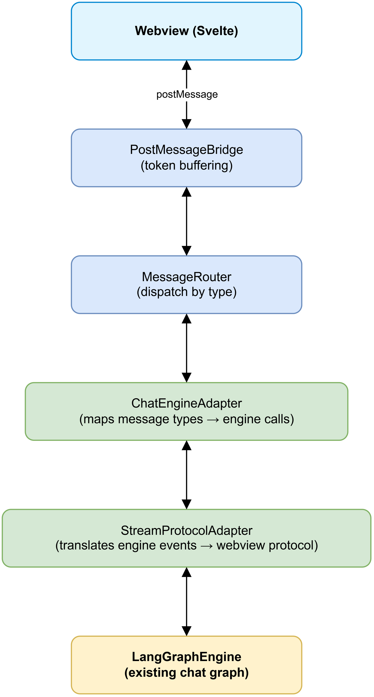

# SA4E-85 — Agentic Chat Engine Adapter: User Guide

## Overview

The Agentic Chat module connects the new `src/chat/` architecture to the existing LangGraph engine, enabling a fully wired chat experience with tool approval, stream protocol translation, and session persistence.

## Quick Start

1. Open VS Code with the Kiro extension installed
2. Open Command Palette (`Ctrl+Shift+P`)
3. Run: `kiroSdlc.openAgenticChat`
4. The Agentic Chat panel opens beside your editor
5. Type a prompt and press Enter — the LangGraph engine processes your request

## Architecture



*[Edit in draw.io](diagrams/ug-architecture.drawio)*

## Features

### Message Protocol

| Webview → Extension | Action |
|---------------------|--------|
| `SEND_PROMPT` | Invokes `engine.invokeChat(text)` |
| `TOOL_CALL_RESPONSE` | Approves or rejects a tool execution |
| `COMMAND_DISPATCH` | Executes a VS Code command |
| `ACTION_ACCEPT_DIFF` | Applies a code diff via WorkspaceEdit |
| `ACTION_REJECT_DIFF` | Marks diff as rejected |
| `CONTEXT_UNPIN_FILE` | Removes a file from context window |
| `CONTEXT_CLEAR` | Clears all context files |
| `RUN_TERMINAL_COMMAND` | Runs a command in an integrated terminal |
| `REGENERATE_PATCH` | Requests fresh patch after conflict |

| Extension → Webview | Meaning |
|---------------------|---------|
| `STREAM_START` | New assistant response begins |
| `STREAM_TOKEN` | Incremental token from LLM |
| `STREAM_END` | Response complete |
| `STREAM_ERROR` | Error with retryable flag |
| `TOOL_CALL_REQUEST` | Tool needs execution (with approval flag) |

### Tool Approval (Human-in-the-Loop)

Dangerous tools require user approval before execution:

| Dangerous (requires approval) | Safe (auto-execute) |
|-------------------------------|---------------------|
| `write_file`, `stream_write_file` | `read_file` |
| `shell_execute` | `search_text` |
| `delete_file` | `list_directory` |
| `git_commit`, `git_push`, `git_checkout` | `get_diagnostics` |
| `git_merge`, `git_rebase` | `grep_search`, `file_search` |

When a dangerous tool is invoked:
1. Webview receives `TOOL_CALL_REQUEST` with `requiresApproval: true`
2. A permission guard modal appears in the UI
3. User clicks **Approve** or **Reject**
4. Extension sends decision to engine via `TOOL_CALL_RESPONSE`

### Session Persistence (Backend-Driven Knowledge)

Sessions are persisted on the **Backend Knowledge Service** — the single source of truth:

```json
{
  "thread_id": "uuid-v4",
  "started_at": "2025-01-27T10:00:00.000Z",
  "ide": "vscode"
}
```

- `thread_id` is created/returned by the backend (`POST /api/v1/threads`) on first prompt
- The LangGraph Runtime (in Extension Host) persists checkpoints via `RemoteCheckpointer` (HTTP) to the backend
- On IDE startup, the webview sends `REQUEST_SYNC_STATE` and hydrates full history via `SYNC_CHAT_HISTORY`
- Any IDE (VSCode, Kiro, AntiGravity) opening the same workspace hydrates the same conversation
- `.code-intel/.run/session.json` is **not** the source of truth — backend KB is

### Token Buffering

The `PostMessageBridge` buffers `STREAM_TOKEN` messages (16-50ms batching) to reduce postMessage frequency and improve rendering performance. Buffered tokens are flushed on `STREAM_END`.

## Configuration

No additional configuration required. The Agentic Chat uses the same LLM provider configured for the existing Chat Panel.

### Prerequisites

- An LLM provider must be configured (Settings → Kiro → LLM Provider)
- MCP server should be running for tool access
- **Backend Agent Server must be running** — it hosts the Knowledge Service (single source of truth for threads/messages/checkpoints). If offline, chat shows a retryable connection error.

## Commands

| Command ID | Description |
|-----------|-------------|
| `kiroSdlc.openAgenticChat` | Opens the new Agentic Chat panel |

## Troubleshooting

| Problem | Solution |
|---------|----------|
| "Requires an active LLM connection" warning | Configure an LLM provider in Settings |
| No tools available | Ensure MCP server is running (check status bar) |
| Stream tokens appear delayed | Normal — 16-50ms buffering for performance |
| Chat history not restored on reopen | Check Backend Agent Server is running (Knowledge Service) |

## Error Codes

| Code | Message | Retryable | Cause |
|------|---------|-----------|-------|
| `ENGINE_ERROR` | Varies | Yes | LangGraph engine reported an error |
| `PIPELINE_ERROR` | Varies | Yes | Chat pipeline timeout or exception |

## Backward Compatibility

The existing `kiroChatPanel` sidebar view continues to work unchanged. The new Agentic Chat is an alternative command (`kiroSdlc.openAgenticChat`) that opens in a separate panel.

## Files Created

| File | Purpose |
|------|---------|
| `src/chat/engine/IChatEngineAdapter.ts` | Adapter interface |
| `src/chat/engine/ChatEngineAdapter.ts` | Adapter implementation |
| `src/chat/engine/IStreamProtocolAdapter.ts` | Stream translator interface |
| `src/chat/engine/StreamProtocolAdapter.ts` | Stream translator implementation |
| `src/chat/engine/ISessionManager.ts` | Session manager interface |
| `src/chat/engine/SessionManager.ts` | Thread resolution (via Backend KB) |
| `src/chat/engine/ToolApprovalClassifier.ts` | Tool danger classification |
| `src/chat/engine/index.ts` | Module barrel export |
| `src/langgraph/core/remote-checkpointer.ts` | [v3.1] RemoteCheckpointer (HTTP → Backend KB) |

## Files Modified

| File | Change |
|------|--------|
| `src/chat/index.ts` | Added engine module exports |
| `src/langgraph/subgraphs/chat-graph-nodes.ts` | Added `requiresApproval` to tool call events |
| `src/extension.ts` | Registered `kiroSdlc.openAgenticChat` command and wiring |
