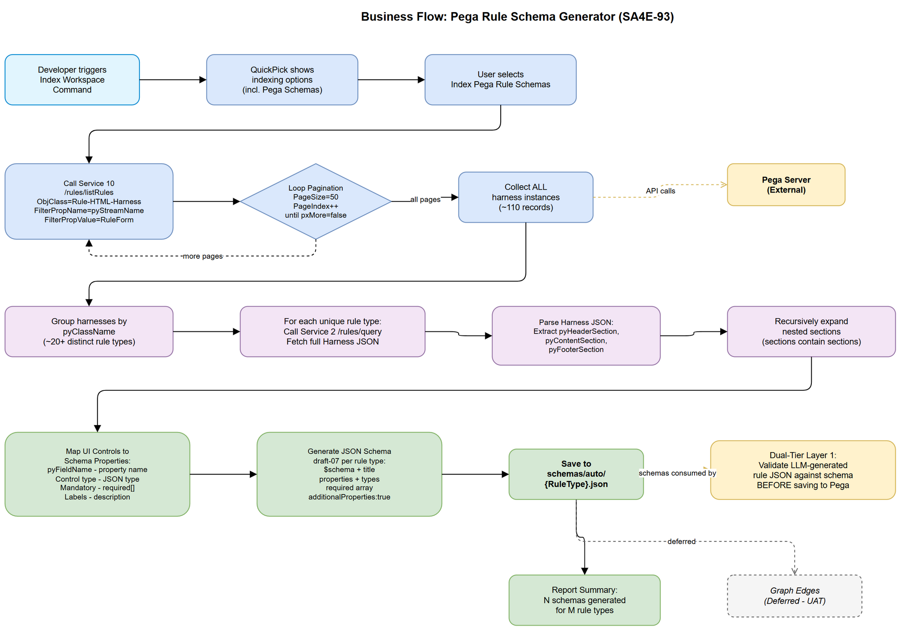
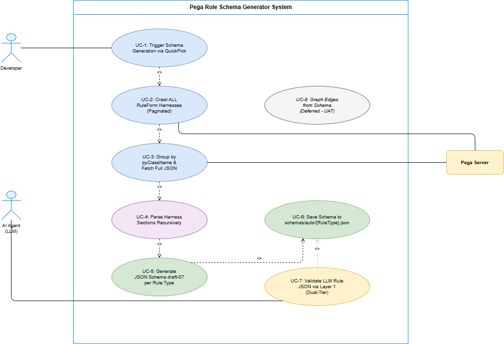

# Business Requirements Document (BRD)

## SDLC-Agents-4-Enterprise — SA4E-93: [pega] Pega Rule Schema Generator - Auto-generate JSON Schemas from Harness RuleForms

---

## Document Information

| Field | Value |
|-------|-------|
| Jira Ticket | SA4E-93 |
| Title | Pega Rule Schema Generator — Auto-generate JSON Schemas from Harness RuleForms |
| Author | BA Agent |
| Version | 1.0 |
| Date | 2026-08-07 |
| Status | Draft |

---

## Author Tracking

| Role | Name - Position | Responsibility |
|------|-----------------|----------------|
| Author | BA Agent – Business Analyst | Create document |
| Peer Reviewer | TA Agent – Technical Architect | Review document |

---

## Revision History

| Version | Date | Author | Changes |
|---------|------|--------|---------|
| 1.0 | 2026-08-07 | BA Agent | Initiate document — auto-generated from Jira ticket SA4E-93 |

---

## Sign-Off

| Name | Signature and date |
|------|--------------------|
| | ☐ I agree and confirm all criteria on this BRD as expected requirements |
| | ☐ I agree and confirm all criteria on this BRD as expected requirements |

---

## 1. Introduction

### 1.1 Scope

Tạo utility tích hợp trong **Index Workspace** command của VS Code/Kiro extension, cho phép tự động crawl tất cả Harness RuleForms từ Pega Platform, parse cấu trúc sections/controls, và generate JSON Schema (draft-07) cho mỗi rule type. Schema này phục vụ validation lớp 1 (Dual-Tier Safety Architecture) khi LLM Agent tạo rule JSON trước khi commit vào Pega.

### 1.2 Out of Scope

- Graph edges từ schema relationships → **Deferred to UAT phase** (AC8)
- Tự động cập nhật schema khi Pega server thay đổi (live sync/webhook)
- UI hiển thị schema trong extension webview
- Schema cho non-RuleForm harnesses (custom harnesses)
- Integration với Pega DX API (chỉ dùng custom REST services đã triển khai)

### 1.3 Preliminary Requirement

- Pega server đã triển khai Service Package `CodeIntelligence` (hoặc `KiroAgents`) với đầy đủ 10 REST Services
- Service 10 (`/rules/listRules`) đã hoạt động với pagination
- Service 2 (`/rules/query`) đã hoạt động để fetch full Harness JSON
- `PegaHttpClient` extension service đã kết nối được Pega server
- Extension IndexingService đã có QuickPick UI cho index workspace options

---

## 2. Business Requirements

### 2.1 High Level Process Map

Quy trình tổng quát: Extension cung cấp option "Index Pega Rule Schemas" trong QuickPick → crawl ALL RuleForm harnesses từ Pega server → group by rule type (pyClassName) → parse harness sections/controls recursively → generate JSON Schema draft-07 → save to `schemas/auto/{RuleType}.json` → schema được Dual-Tier Layer 1 sử dụng để validate rule JSON do LLM tạo.

### 2.2 List of User Stories / Use Cases

| # | Story / Use Case / Epic | Priority | Source Ticket |
|---|-------------------------|----------|---------------|
| 1 | As a Developer/AI Agent, I want to auto-generate JSON Schemas from Pega Harness RuleForms so that rule JSON created by LLM can be validated before saving to Pega | MUST HAVE | SA4E-93 |
| 2 | As a Developer, I want a new "Index Pega Rule Schemas" option in the Index Workspace QuickPick so that I can trigger schema generation on demand | MUST HAVE | SA4E-93 |
| 3 | As an AI Agent, I want validated JSON Schemas per rule type so that I understand mandatory/optional fields, field types, and valid values before generating rule JSON | MUST HAVE | SA4E-93 |
| 4 | As a Developer, I want schema files saved to a predictable location (schemas/auto/) so that other services can easily locate and load them | SHOULD HAVE | SA4E-93 |
| 5 | As a QA Agent, I want schema validation results with clear error messages so that I can identify which fields are missing or invalid in generated rules | SHOULD HAVE | SA4E-93 |

---

### 2.3 Details of User Stories

---

#### Business Flow

**Step 1:** Developer triggers "Index Workspace" command in VS Code/Kiro extension

**Step 2:** QuickPick displays available indexing options including new "Index Pega Rule Schemas"

**Step 3:** User selects "Index Pega Rule Schemas" option

**Step 4:** Extension calls PegaHttpClient.listRulesByFilter() with parameters:
- ObjClass = `Rule-HTML-Harness`
- FilterPropName = `pyStreamName`
- FilterPropValue = `RuleForm`
- Loop pagination (PageSize=50, PageIndex=1,2,3...) until all harnesses retrieved

**Step 5:** Group retrieved harnesses by `pyClassName` (= rule type, e.g., `Rule-Obj-Activity`, `Rule-Obj-Flow`, `Rule-Obj-Model`)

**Step 6:** For each unique rule type: call PegaHttpClient.queryRuleByTriple() to fetch full Harness JSON data

**Step 7:** Parse Harness JSON recursively:
- Extract header/content/footer sections
- Recursively expand nested sections
- Map UI controls to property definitions

**Step 8:** For each UI control, determine:
- Field name (`pyFieldName` / `pyPropertyName`)
- Field type (inferred from control type)
- Mandatory/optional status
- Valid values (from dropdowns/picklists)
- Description (from control labels/tooltips)

**Step 9:** Generate JSON Schema draft-07 per rule type with:
- `$schema` declaration
- `type: "object"`
- `properties` with types and descriptions
- `required` array for mandatory fields

**Step 10:** Save schema files to `schemas/auto/{RuleType}.json`

**Step 11:** Report completion summary (number of schemas generated, rule types covered)

> **Note:** Graph edges from schema relationships are deferred to UAT phase. Schema generation focuses on structural validation — semantic relationships will be addressed later.

---

#### STORY 1: Auto-generate JSON Schemas from Pega Harness RuleForms

> As a Developer/AI Agent, I want to auto-generate JSON Schemas from Pega Harness RuleForms so that rule JSON created by LLM can be validated before saving to Pega

**Requirement Details:**

1. Crawl ALL RuleForm harnesses from Pega server using Service 10 `/rules/listRules` API
2. Handle pagination correctly — loop until `pxMore` is false or all pages exhausted
3. Group harnesses by `pyClassName` to identify distinct rule types (~20+ distinct types from ~110 harness instances)
4. For each unique rule type, fetch full Harness JSON via Service 2 `/rules/query`
5. Parse harness sections recursively (sections contain nested sections, sections contain UI controls)
6. Map UI controls to JSON Schema properties with:
   - Type inference from control type (TextInput → string, Checkbox → boolean, NumberInput → number, Dropdown → enum)
   - Required/optional from control configuration (mandatory controls → required array)
   - Description from control labels/tooltips
7. Generate valid JSON Schema draft-07 per rule type
8. Save to `schemas/auto/{pxObjClass}.json` (filename sanitized from pxObjClass)

**Data Fields:**

| Field | Type | Required | Description | Example |
|-------|------|----------|-------------|---------|
| pxObjClass | string | Yes | Pega rule class (schema identifier) | `Rule-Obj-Activity` |
| pyClassName | string | Yes | Class that the harness applies to (= rule type) | `Rule-Obj-Activity` |
| pyStreamName | string | Yes | Harness stream name (always "RuleForm" for this use case) | `RuleForm` |
| pzInsKey | string | Yes | Unique harness instance key | `RULE-HTML-HARNESS RULE-OBJ-ACTIVITY RULEFORM #20260422T...` |
| pyHeaderSection | object | No | Header section of the harness | Nested section JSON |
| pyContentSection | object | No | Main content section | Nested section JSON |
| pyFooterSection | object | No | Footer section | Nested section JSON |

**Acceptance Criteria:**

1. AC2: System crawls ALL RuleForm harnesses from Pega server with proper pagination (handles >50 results)
2. AC3: Harnesses are grouped by pyClassName; full JSON fetched for each unique rule type
3. AC4: Harness sections are parsed recursively including nested sections and UI controls
4. AC5: Generated JSON Schema is valid draft-07 with required fields, property types, and descriptions
5. AC6: Schema files saved to `schemas/auto/{RuleType}.json`

**Validation Rules:**

- Schema MUST validate against JSON Schema draft-07 meta-schema
- Required fields array MUST only contain fields that are truly mandatory in the Pega harness
- Property types MUST be correctly inferred from UI control types
- Schema file naming: sanitize pxObjClass (replace special characters, use proper casing)

**Error Handling:**

- Pega server unreachable: Log error, abort schema generation, report to user
- Individual harness fetch fails (404): Skip that rule type, continue with others, log warning
- Invalid/unparseable harness JSON: Skip, log warning, continue
- No harnesses found: Report "No RuleForm harnesses found on server" — not an error

---

#### STORY 2: Index Workspace QuickPick Option

> As a Developer, I want a new "Index Pega Rule Schemas" option in the Index Workspace QuickPick so that I can trigger schema generation on demand

**Requirement Details:**

1. Add new option "$(symbol-class) Index Pega Rule Schemas" to the existing QuickPick in `showIndexOptions()` function
2. Option should be in the QuickPick list alongside existing options (Index Source Code, Index Documents, Sync Code → Memory)
3. When selected, triggers the schema generation pipeline
4. Shows progress via VS Code progress notification (similar to existing indexing)
5. Outputs results to the SDLC Indexing output channel

**Acceptance Criteria:**

1. AC1: Index workspace command has new option "Index Pega Rule Schemas" in QuickPick
2. Option is clearly labeled with appropriate VS Code icon
3. Selection triggers full schema generation pipeline
4. Progress is shown incrementally (crawling → parsing → generating → saving)

**UI Specifications:**

| No. | Name | Type | Required | Description | Note |
|-----|------|------|----------|-------------|------|
| 1 | Index Pega Rule Schemas | QuickPick Item | No | Option in multi-select QuickPick | Icon: $(symbol-class), Description: "Generate JSON Schemas from Pega RuleForms" |

---

#### STORY 3: Dual-Tier Layer 1 Validation Integration

> As an AI Agent, I want validated JSON Schemas per rule type so that I understand mandatory/optional fields, field types, and valid values before generating rule JSON

**Requirement Details:**

1. Generated schemas are consumed by the Dual-Tier Safety Architecture Layer 1
2. Before LLM-generated rule JSON is saved to Pega (Service 4), it MUST be validated against the corresponding schema
3. Schema lookup: match rule's `pxObjClass` → load `schemas/auto/{pxObjClass}.json`
4. Validation result includes: valid/invalid boolean, list of errors (path, message, expected type)
5. If validation fails, rule is rejected locally — never sent to Pega server

**Acceptance Criteria:**

1. AC7: Dual-Tier Safety Layer 1 validation uses generated schemas for rule validation
2. Schema lookup by pxObjClass works correctly
3. Validation errors are clear and actionable (field path + expected type + actual value)

**Error Handling:**

- Schema file not found for a given pxObjClass: Fallback to permissive validation (warn but don't block)
- Schema file corrupted/invalid: Log error, skip schema validation for that type, warn user

---

#### STORY 4: Schema File Organization

> As a Developer, I want schema files saved to a predictable location (schemas/auto/) so that other services can easily locate and load them

**Requirement Details:**

1. All auto-generated schemas saved under `schemas/auto/` directory in workspace root
2. Filename format: `{RuleType}.json` where RuleType is the sanitized pxObjClass
3. Each schema file is a standalone valid JSON Schema document
4. Schema files are overwritten on re-generation (idempotent operation)
5. Directory created automatically if not exists

**Data Fields:**

| Field | Type | Required | Description | Example |
|-------|------|----------|-------------|---------|
| File path | string | Yes | Location of generated schema | `schemas/auto/Rule-Obj-Activity.json` |
| $schema | string | Yes | JSON Schema version URI | `http://json-schema.org/draft-07/schema#` |
| title | string | Yes | Human-readable schema title | `Rule-Obj-Activity Schema` |
| description | string | No | Generated description of the rule type | `Schema for Pega Activity rules` |

**Acceptance Criteria:**

1. AC6: Schema files saved to `schemas/auto/{RuleType}.json`
2. Files are valid JSON
3. Directory auto-created if missing
4. Re-running generates fresh schemas (overwrite)

---

#### STORY 5: Schema Quality and Semantic Understanding

> As a QA Agent, I want schema validation results with clear error messages so that I can identify which fields are missing or invalid in generated rules

**Requirement Details:**

1. Schema includes `description` for each property (from Pega control labels/tooltips)
2. Schema includes `default` values where applicable (from control defaults)
3. Schema includes `enum` for fields with fixed valid values (from dropdowns)
4. Schema includes `pattern` for fields with specific format requirements
5. Schema marks `additionalProperties: true` to allow Pega system fields not in harness

**Acceptance Criteria:**

1. Property descriptions are populated from harness control metadata
2. Enum values correctly extracted from dropdown/picklist controls
3. Schema allows additional properties (Pega always adds system fields)

---

## 3. Dependencies

| Dependency | Type | Related Ticket | Description |
|------------|------|----------------|-------------|
| PegaHttpClient | System | SA4E-57 | HTTP client for communicating with Pega REST services |
| Service 10 (listRules) | External | SA4E-57 | Pega REST API for listing rules with filter and pagination |
| Service 2 (query) | External | SA4E-57 | Pega REST API for querying full rule JSON by triple |
| IndexingService | System | Existing | Extension service orchestrating workspace indexing |
| PegaRuleAstParser | System | Existing | Backend parser for Pega rule JSON (layout extraction) |
| Dual-Tier Safety Architecture | System | SA4E-57 | Layer 1 validation framework consuming schemas |
| VS Code Extension API | Infrastructure | N/A | QuickPick UI, Progress notification, Output channels |

---

## 4. Stakeholders

| Role | Name / Team | Responsibility | Source |
|------|-------------|----------------|--------|
| Developer | DEV Agent | Implements schema generator service | Ticket assignee |
| Technical Architect | TA Agent | Reviews FSD technical specifications | Reviewer |
| Solution Architect | SA Agent | Designs system architecture (TDD) | Design lead |
| QA | QA Agent | Validates schema correctness and integration | Tester |
| End User | Developer using Extension | Triggers schema generation, benefits from validation | User |

---

## 5. Risks and Assumptions

### 5.1 Risks

| Risk | Impact | Likelihood | Mitigation |
|------|--------|------------|------------|
| Pega server timeout during crawl (>110 harnesses) | Medium | Medium | Implement pagination with retry logic, configurable batch size |
| Harness structure varies across Pega versions (7.x vs 8.x vs Infinity) | High | Low | Design parser to be resilient — skip unknown sections, log warnings |
| UI control types not fully mapped to JSON types | Medium | Medium | Start with known mappings, fallback to `string` for unknown types |
| Schema too permissive (all fields optional) | Medium | Low | Cross-reference with actual rule saves — fields that always appear = required |
| Schema too restrictive (blocks valid rules) | High | Medium | Set `additionalProperties: true`, iterative refinement during UAT |

### 5.2 Assumptions

- Pega server has Service 10 `/rules/listRules` deployed and functioning
- All rule types have a corresponding RuleForm harness (standard Pega behavior)
- Harness sections follow standard Pega structure (header/content/footer with nested sections)
- UI control properties (`pyFieldName`, `pyPropertyName`, control type) are consistently populated
- ~110 harness instances across ~20+ distinct rule types based on current Pega server state
- Network connectivity to Pega server is stable during crawl operation
- Extension SecretStorage contains valid Pega credentials

---

## 6. Non-Functional Requirements

| Category | Requirement | Details |
|----------|-------------|---------|
| Performance | Schema generation completes within 5 minutes | For ~110 harnesses, ~20 unique rule types, including network calls |
| Performance | Pagination handles 50 records per page | Standard Pega pagination limit |
| Reliability | Retry failed API calls up to 2 times | With exponential backoff (existing PegaHttpClient pattern) |
| Reliability | Partial success acceptable | If some harnesses fail, continue with others; report summary |
| Scalability | Support up to 500 harness instances | Future growth — pagination handles unlimited pages |
| Storage | Schema files < 100KB each | Typical schema for a rule type ~5-50KB |
| Compatibility | JSON Schema draft-07 | Compatible with ajv (default mode), zod-to-json-schema, MCP inputSchema |
| Maintainability | Schema re-generation is idempotent | Running twice produces same output for same Pega server state |

---

## 7. Related Tickets

| Ticket Key | Summary | Status | Type | Relationship |
|------------|---------|--------|------|--------------|
| SA4E-93 | Pega Rule Schema Generator | In Progress | Story | Main ticket |
| SA4E-57 | Pega REST Bridge Services implementation | Done | Story | Provides HTTP services used |
| SA4E-82 | Pega MCP Tools integration | Done | Story | Provides PegaMcpTools (listRules, queryRule) |
| SA4E-92 | Stream Ingest (NDJSON) | Done | Story | Provides PegaStreamIngester pattern |

---

## 8. Appendix

### Use Case Diagram

### Glossary

| Term | Definition |
|------|------------|
| Harness | A Pega UI rule that defines the layout/form for editing a specific rule type. "RuleForm" harnesses define the edit form for each rule class. |
| RuleForm | The standard harness stream name used to render the rule editing form in Pega Dev Studio |
| pyClassName | The Pega class that a harness applies to — identifies the rule type (e.g., Rule-Obj-Activity) |
| Section | A UI container within a harness that groups controls. Sections can be nested recursively. |
| UI Control | A form element (text input, dropdown, checkbox, etc.) within a section that corresponds to a rule property |
| JSON Schema draft-07 | JSON Schema specification version compatible with ajv, zod, and MCP tool definitions |
| Dual-Tier Safety Architecture | Two-layer validation: Layer 1 = local schema validation, Layer 2 = Pega native validation engine |
| pxObjClass | Pega system field identifying the class of an object/rule instance |
| pzInsKey | Pega system field — unique instance key (primary key) for any rule/object |

### Reference Documents

| Document | Link / Location |
|----------|-----------------|
| Pega Implementation Guide | documents/pega-integration/PEGA_IMPLEMENTATION_GUIDE.md |
| Ticket Draft | documents/SA4E-NEXT/TICKET-DRAFT.md |
| SA4E Architecture | .code-intel/SA4E-ARCHITECTURE.md |

### Diagram Index

| # | Diagram | Image | Source (editable) |
|---|---------|-------|-------------------|
| 1 | Use Case Diagram | [use-case.png](diagrams/use-case.png) | [use-case.drawio](diagrams/use-case.drawio) |
| 2 | Business Flow Diagram | [business-flow.png](diagrams/business-flow.png) | [business-flow.drawio](diagrams/business-flow.drawio) |
