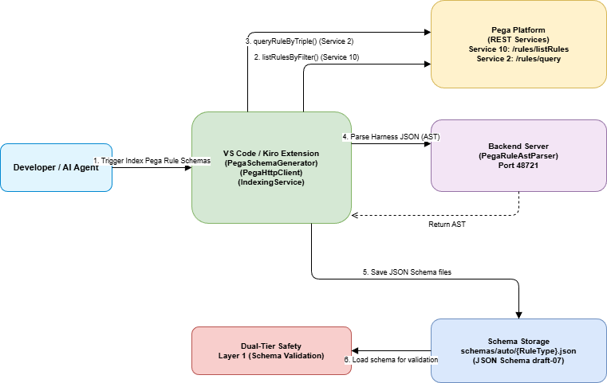
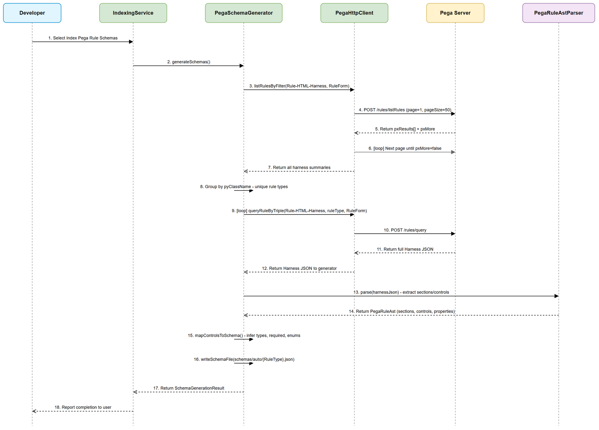
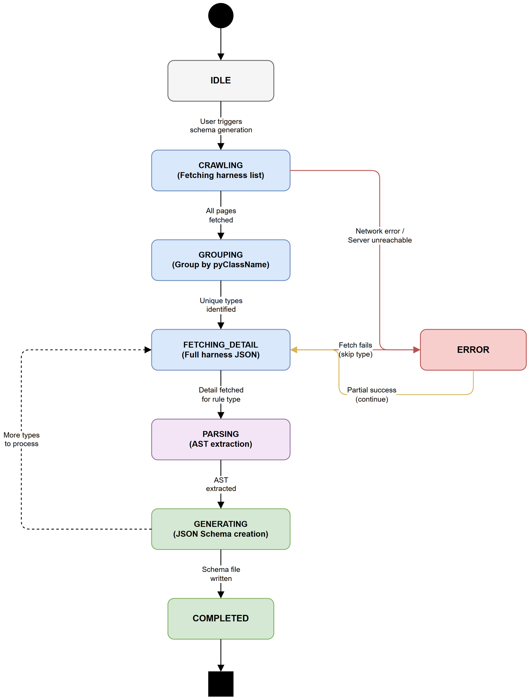

# Functional Specification Document (FSD)

## SDLC-Agents-4-Enterprise — SA4E-93: Pega Rule Schema Generator

---

## Document Information

| Field | Value |
|-------|-------|
| Jira Ticket | SA4E-93 |
| Title | Pega Rule Schema Generator — Auto-generate JSON Schemas from Harness RuleForms |
| Author | BA Agent |
| Version | 1.0 |
| Date | 2026-08-07 |
| Status | Draft |
| Related BRD | documents/SA4E-93/BRD.md |

---

## Revision History

| Version | Date | Author | Changes |
|---------|------|--------|---------|
| 1.0 | 2026-08-07 | BA Agent | Initial FSD — translated from BRD v1.0 |

---

## 1. Introduction

### 1.1 Purpose

This FSD specifies the functional behavior of the Pega Rule Schema Generator feature.
The system crawls Harness RuleForms from Pega Platform, parses their structure into an AST, maps UI controls to property definitions, and generates JSON Schema (draft-07) files used for Layer 1 validation in the Dual-Tier Safety Architecture.

### 1.2 Scope

- Crawl all `Rule-HTML-Harness` rules with `pyStreamName=RuleForm` from Pega server
- Parse harness sections/controls recursively using PegaRuleAstParser
- Generate one JSON Schema file per unique rule type (pyClassName)
- Save schemas to `schemas/auto/{RuleType}.json`
- Integrate as a new option in the VS Code "Index Workspace" QuickPick

### 1.3 Definitions & Acronyms

| Term | Definition |
|------|------------|
| Harness | Pega UI rule defining the layout/form for editing a rule type |
| RuleForm | Standard harness stream name for rule editing forms in Dev Studio |
| pyClassName | Pega class a harness applies to — identifies the rule type |
| Section | UI container within a harness grouping controls; can nest recursively |
| UI Control | Form element (text input, dropdown, checkbox) mapping to a rule property |
| JSON Schema draft-07 | Schema spec compatible with ajv, zod, MCP inputSchema |
| PegaRuleAst | Internal AST representation of parsed Pega rule JSON |
| Dual-Tier Safety | Layer 1 = local schema validation, Layer 2 = Pega native validation |

### 1.4 References

| Document | Location |
|----------|----------|
| BRD | documents/SA4E-93/BRD.md |
| Pega Implementation Guide | documents/pega-integration/PEGA_IMPLEMENTATION_GUIDE.md |
| SA4E Architecture | .code-intel/SA4E-ARCHITECTURE.md |

---

## 2. System Overview

### 2.1 System Context Diagram



The system involves four components:

1. **VS Code/Kiro Extension** — PegaSchemaGenerator orchestrates the pipeline
2. **Pega Platform** — REST Services provide harness data (Service 10, Service 2)
3. **Backend Server** — PegaRuleAstParser converts harness JSON to structured AST
4. **Schema Storage** — Generated JSON Schema files at `schemas/auto/`

### 2.2 System Architecture

The new `PegaSchemaGenerator` service lives in `extension/src/services/` and coordinates:
- `PegaHttpClient.listRulesByFilter()` — new method using Service 10 `/rules/listRules`
- `PegaHttpClient.queryRuleByTriple()` — existing method using Service 2 `/rules/query`
- `PegaRuleAstParser.parse()` — existing backend parser for Pega rule JSON
- Local file system — writes JSON Schema files to workspace `schemas/auto/` directory

---

## 3. Functional Requirements

### 3.1 Use Cases

#### UC-01: Generate Schemas from Pega RuleForms

**Use Case ID:** UC-01
**Actor:** Developer / AI Agent
**Preconditions:**
- Pega server reachable with valid credentials in SecretStorage
- Service 10 `/rules/listRules` deployed on Pega server
- Service 2 `/rules/query` deployed on Pega server

**Postconditions:**
- JSON Schema files exist at `schemas/auto/{RuleType}.json` for each discovered rule type
- User notified with summary of generated schemas

**Main Flow:**

| Step | Actor | System | Description |
|------|-------|--------|-------------|
| 1 | Developer | | Triggers "Index Workspace" command |
| 2 | | Extension | Displays QuickPick with "Index Pega Rule Schemas" option |
| 3 | Developer | | Selects "Index Pega Rule Schemas" |
| 4 | | PegaSchemaGenerator | Calls `listRulesByFilter(Rule-HTML-Harness, pyStreamName, RuleForm)` |
| 5 | | PegaHttpClient | Paginates through Service 10 (pageSize=50) until `pxMore=false` |
| 6 | | PegaSchemaGenerator | Groups harness summaries by `pyClassName` to unique rule types |
| 7 | | PegaSchemaGenerator | For each unique rule type: calls `queryRuleByTriple()` to get full JSON |
| 8 | | PegaRuleAstParser | Parses harness JSON to extract sections, nested sections, UI controls |
| 9 | | PegaSchemaGenerator | Maps controls to JSON Schema properties (type inference, required, enums) |
| 10 | | PegaSchemaGenerator | Writes JSON Schema draft-07 file to `schemas/auto/{RuleType}.json` |
| 11 | | Extension | Reports summary: "Generated N schemas for N rule types" |

**Alternative Flows:**

| ID | Condition | Steps |
|----|-----------|-------|
| AF-01 | No harnesses found on server | System reports "No RuleForm harnesses found" -- not an error. Returns empty result. |
| AF-02 | Some harness fetches fail (404) | Skip failed rule type, continue with others, log warning. Report partial success at end. |
| AF-03 | Harness JSON unparseable | Skip that harness, log warning with pzInsKey, continue processing others. |
| AF-04 | Schema directory does not exist | Auto-create `schemas/auto/` directory before writing files. |
| AF-05 | Re-run schema generation | Overwrite existing schema files (idempotent operation). |

**Exception Flows:**

| ID | Condition | Steps |
|----|-----------|-------|
| EF-01 | Pega server unreachable | Abort entire schema generation. Log error. Report "Pega server unreachable" to user. |
| EF-02 | Authentication failure (401/403) | Abort. Report "Invalid credentials" to user. |
| EF-03 | All harness fetches fail | Report "Schema generation failed -- could not retrieve any harness data" to user. |
| EF-04 | File system write fails | Log error for that specific schema, continue with others. Report partial failure. |

---

#### UC-02: Validate Rule JSON Against Generated Schema

**Use Case ID:** UC-02
**Actor:** AI Agent (LLM)
**Preconditions:**
- Schema file exists at `schemas/auto/{pxObjClass}.json`
- LLM has generated rule JSON for saving to Pega

**Postconditions:**
- Rule JSON validated (pass/fail with error details)
- Invalid rules blocked from being sent to Pega

**Main Flow:**

| Step | Actor | System | Description |
|------|-------|--------|-------------|
| 1 | AI Agent | | Generates rule JSON with pxObjClass field |
| 2 | | Dual-Tier Layer 1 | Loads schema from `schemas/auto/{pxObjClass}.json` |
| 3 | | Dual-Tier Layer 1 | Validates rule JSON against schema using ajv |
| 4a | | Dual-Tier Layer 1 | If valid: passes rule to Service 4 (savePegaRule) |
| 4b | | Dual-Tier Layer 1 | If invalid: returns validation errors (field path, expected type, actual value) |

**Alternative Flows:**

| ID | Condition | Steps |
|----|-----------|-------|
| AF-06 | Schema file not found for pxObjClass | Fallback to permissive validation (warn but do not block). Log warning. |
| AF-07 | Schema file corrupted/invalid JSON | Skip schema validation for that type. Warn user. |

**Exception Flows:**

| ID | Condition | Steps |
|----|-----------|-------|
| EF-05 | Schema loading I/O error | Log error, continue without schema validation (permissive mode). |

---

#### UC-03: Trigger Schema Generation from QuickPick

**Use Case ID:** UC-03
**Actor:** Developer
**Preconditions:**
- Extension activated in VS Code/Kiro
- Pega project detected (pega-project.json exists)

**Postconditions:**
- Schema generation pipeline executed
- Progress shown to user via VS Code notification

**Main Flow:**

| Step | Actor | System | Description |
|------|-------|--------|-------------|
| 1 | Developer | | Executes "SDLC: Index Workspace" command |
| 2 | | Extension | Shows QuickPick multi-select with options |
| 3 | Developer | | Selects "$(symbol-class) Index Pega Rule Schemas" |
| 4 | | Extension | Shows progress notification "Generating rule schemas..." |
| 5 | | PegaSchemaGenerator | Executes full pipeline (UC-01) |
| 6 | | Extension | Reports result in Output Channel + notification |

---

### 3.2 Business Rules

| Rule ID | Rule | Source |
|---------|------|--------|
| BR-01 | Schema MUST validate against JSON Schema draft-07 meta-schema | BRD AC5 |
| BR-02 | Required fields array MUST only contain fields marked mandatory in Pega harness | BRD Story 1 |
| BR-03 | Property types MUST be inferred from UI control types (TextInput->string, Checkbox->boolean, NumberInput->number, Dropdown->enum) | BRD Story 1 |
| BR-04 | Schema files MUST be saved to `schemas/auto/{RuleType}.json` with sanitized filename | BRD AC6 |
| BR-05 | Pagination MUST handle >50 results by looping pages until `pxMore=false` | BRD AC2 |
| BR-06 | Schema MUST set `additionalProperties: true` to allow Pega system fields | BRD Story 5 |
| BR-07 | Schema generation MUST be idempotent -- re-running produces same output for same server state | BRD NFR |
| BR-08 | Individual harness failures MUST NOT abort entire pipeline (partial success acceptable) | BRD Error Handling |
| BR-09 | Schema filename sanitization: replace `Rule-` prefix dots and special chars, preserve casing | BRD Story 4 |
| BR-10 | When schema not found for validation, system MUST use permissive mode (warn, not block) | BRD Story 3 |
| BR-11 | Harness grouping MUST use `pyClassName` field as the rule type key | BRD Step 5 |
| BR-12 | Filter query MUST use ObjClass=`Rule-HTML-Harness` and FilterPropValue=`RuleForm` | BRD Step 4 |

---

## 4. Sequence Diagram — Schema Generation Flow



The sequence diagram shows the complete flow from user trigger through crawl, parse, and generate phases:

1. **Crawl Phase** (Steps 1-7): Discover all RuleForm harnesses via paginated Service 10 calls
2. **Parse Phase** (Steps 8-14): Group by rule type, fetch full JSON, parse into AST
3. **Generate Phase** (Steps 15-18): Map controls to schema properties, write files, report

---

## 5. State Diagram — Schema Generation Process



### State Transitions

| From State | To State | Trigger | Guard |
|------------|----------|---------|-------|
| IDLE | CRAWLING | User triggers schema generation | Pega credentials available |
| CRAWLING | GROUPING | All pages fetched | pxMore=false |
| CRAWLING | ERROR | Network error / server unreachable | -- |
| GROUPING | FETCHING_DETAIL | Unique types identified | At least 1 type found |
| FETCHING_DETAIL | PARSING | Full harness JSON received | Valid JSON |
| FETCHING_DETAIL | ERROR | Fetch fails for current type | Retry exhausted |
| PARSING | GENERATING | AST extraction successful | -- |
| GENERATING | FETCHING_DETAIL | More types to process | Remaining types > 0 |
| GENERATING | COMPLETED | All types processed | No more types |
| ERROR | FETCHING_DETAIL | Partial success (skip failed, continue next) | Other types remain |
| COMPLETED | (end) | -- | -- |

---

## 6. API Specifications (Internal Service Interfaces)

### 6.1 PegaSchemaGenerator (New Service)

**Location:** `extension/src/services/PegaSchemaGenerator.ts`

#### Interface: `SchemaGenerationResult`

```typescript
interface SchemaGenerationResult {
  totalHarnesses: number;        // Total harness instances crawled
  uniqueRuleTypes: number;       // Distinct pyClassName values
  schemasGenerated: number;      // Successfully written schema files
  schemasFailed: number;         // Failed schema generations
  errors: SchemaError[];         // Detailed error list
  outputDirectory: string;       // Absolute path to schemas/auto/
}

interface SchemaError {
  ruleType: string;              // pyClassName that failed
  phase: 'crawl' | 'fetch' | 'parse' | 'generate' | 'write';
  message: string;               // Human-readable error
}
```

#### Method: `generateSchemas(report: ProgressReporter): Promise<SchemaGenerationResult>`

**Purpose:** Orchestrate full schema generation pipeline
**Input:** VS Code progress reporter for UI feedback
**Output:** Summary of generation results
**Throws:** Only on fatal errors (server unreachable, auth failure)

---

### 6.2 PegaHttpClient — New Method

#### Method: `listRulesByFilter(objClass, filterPropName, filterPropValue, pageSize?, pageIndex?)`

**Purpose:** List rules matching a property filter with pagination (Service 10)
**Endpoint:** `POST /rules/listRules`

**Input Parameters:**

| Parameter | Type | Required | Default | Description |
|-----------|------|----------|---------|-------------|
| objClass | string | Yes | -- | Pega rule class to filter (e.g., `Rule-HTML-Harness`) |
| filterPropName | string | Yes | -- | Property name to filter on (e.g., `pyStreamName`) |
| filterPropValue | string | Yes | -- | Property value to match (e.g., `RuleForm`) |
| pageSize | number | No | 50 | Records per page |
| pageIndex | number | No | 1 | Page number (1-based) |

**Output:**

```typescript
interface ListRulesResponse {
  pxResults: HarnessSummary[];   // Array of matching rules
  pxMore: boolean;               // True if more pages available
  totalCount?: number;           // Total matching records (if Pega provides)
}

interface HarnessSummary {
  pzInsKey: string;              // Unique instance key
  pxObjClass: string;            // Always "Rule-HTML-Harness"
  pyClassName: string;           // Rule type this harness applies to
  pyRuleName: string;            // Harness rule name
  pyStreamName: string;          // "RuleForm"
  pyLabel?: string;              // Optional display label
}
```

**Business Error Scenarios:**

| Scenario | User Message | Trigger Condition |
|----------|-------------|-------------------|
| Server unreachable | "Cannot connect to Pega server" | Network timeout or DNS failure |
| Auth failure | "Invalid Pega credentials" | HTTP 401/403 response |
| No results | "No RuleForm harnesses found" | pxResults empty on first page |

---

### 6.3 PegaRuleAstParser — Existing (Enhanced Usage)

The existing `PegaRuleAstParser.parse()` method handles harness JSON via the `buildUi()` builder (triggered by `pxObjClass.startsWith('Rule-HTML-')` or `pxObjClass.startsWith('Rule-UI-')`).

**Key extraction for schema generation:**
- `ast.children` → Layout nodes containing sections
- Each Layout node → `properties` containing control definitions
- Control properties → `pyFieldName`, `pyPropertyName`, control type indicators

---

## 7. Data Model

### 7.1 Harness Structure (Input from Pega)

```
Harness (Rule-HTML-Harness)
├── pyClassName: string          (rule type identifier)
├── pyStreamName: "RuleForm"
├── pyHeaderSection: Section
├── pyContentSection: Section
└── pyFooterSection: Section
    └── Section
        ├── pySectionName: string
        ├── pyLayoutType: string (grid, flex, etc.)
        ├── pyControls: Control[]
        └── pySections: Section[]  (nested recursively)
            └── Control
                ├── pyFieldName: string
                ├── pyPropertyName: string
                ├── pyControlType: string (TextInput, Dropdown, Checkbox, etc.)
                ├── pyMandatory: boolean
                ├── pyLabel: string
                ├── pyTooltip: string
                ├── pyDefaultValue: string
                └── pyValidValues: string[] (for dropdowns/picklists)
```

### 7.2 Control Type to JSON Schema Type Mapping

| Pega Control Type | JSON Schema Type | Additional Schema Properties |
|-------------------|-----------------|------------------------------|
| TextInput | `"string"` | maxLength if pyMaxLength present |
| TextArea | `"string"` | -- |
| NumberInput | `"number"` | minimum/maximum if configured |
| Checkbox | `"boolean"` | default: false |
| Dropdown | `"string"` | `enum: [values]` from pyValidValues |
| RadioButtons | `"string"` | `enum: [values]` from options |
| DatePicker | `"string"` | `format: "date-time"` |
| Autocomplete | `"string"` | description mentions autocomplete source |
| Link | `"string"` | `format: "uri"` |
| Integer | `"integer"` | -- |
| Hidden | `"string"` | -- (included but not required) |
| PageList | `"array"` | items: { type: "object" } |
| PageGroup | `"object"` | additionalProperties: true |
| Unknown/Other | `"string"` | Fallback type (BR-03) |

### 7.3 Generated Schema Structure (Output)

```json
{
  "$schema": "http://json-schema.org/draft-07/schema#",
  "title": "Rule-Obj-Activity Schema",
  "description": "Auto-generated schema from Pega RuleForm harness for Rule-Obj-Activity",
  "type": "object",
  "properties": {
    "pxObjClass": {
      "type": "string",
      "const": "Rule-Obj-Activity",
      "description": "Pega rule class identifier"
    },
    "pyClassName": {
      "type": "string",
      "description": "Class this rule applies to"
    },
    "pyRuleName": {
      "type": "string",
      "description": "Activity name"
    }
  },
  "required": ["pxObjClass", "pyClassName", "pyRuleName"],
  "additionalProperties": true
}
```

---

## 8. Processing Logic

### 8.1 Schema Generation Pipeline

**Trigger:** User selects "Index Pega Rule Schemas" in QuickPick
**Schedule:** On-demand only (no automatic trigger)

**Processing Steps:**

| Step | Description | Error Handling |
|------|-------------|----------------|
| 1 | Validate Pega credentials available in SecretStorage | Abort with "credentials not configured" message |
| 2 | Call `listRulesByFilter()` page by page | Abort on network/auth error; return empty on "no results" |
| 3 | Group results by `pyClassName` | No error possible (in-memory operation) |
| 4 | For each unique rule type: `queryRuleByTriple()` | Skip on 404, abort on 5xx (after retry) |
| 5 | Parse harness JSON via PegaRuleAstParser | Skip unparseable JSON, log warning |
| 6 | Recursively extract sections and controls from AST | Skip if no children nodes |
| 7 | Map controls to JSON Schema properties | Use fallback type "string" for unknown controls |
| 8 | Determine required fields (pyMandatory=true controls) | Empty required array if none found |
| 9 | Build JSON Schema draft-07 document | Always succeeds (deterministic) |
| 10 | Write schema file to `schemas/auto/{RuleType}.json` | Log I/O error, continue with others |
| 11 | Report completion summary | Always executes |

### 8.2 Recursive Section Parsing Algorithm

```
function extractControls(section):
    controls = []
    for each control in section.pyControls:
        controls.push(mapControl(control))
    for each nestedSection in section.pySections:
        controls.push(...extractControls(nestedSection))
    return controls

function mapControl(control):
    return {
        name: control.pyFieldName || control.pyPropertyName,
        type: inferJsonType(control.pyControlType),
        required: control.pyMandatory === true,
        description: control.pyLabel || control.pyTooltip || "",
        enum: control.pyValidValues || undefined,
        default: control.pyDefaultValue || undefined
    }
```

---

## 9. Error Handling (User-Facing)

### 9.1 Error Scenarios

| Scenario | Severity | User Message | Expected Behavior |
|----------|----------|-------------|-------------------|
| Pega server unreachable | Critical | "Cannot connect to Pega server. Check network and endpoint configuration." | Abort entire operation. No partial schemas written. |
| Invalid credentials (401) | Critical | "Pega authentication failed. Check username/password in extension settings." | Abort. Prompt user to verify credentials. |
| Forbidden (403) | Critical | "Access denied. Operator does not have permission to list rules." | Abort. Suggest verifying access group. |
| Service 10 not deployed | Critical | "Service `/rules/listRules` not available on Pega server." | Abort. Suggest deploying CodeIntelligence service package. |
| Individual harness fetch 404 | Warning | Logged: "Harness for {ruleType} not found, skipping." | Skip that type, continue with others. |
| Parse error on harness JSON | Warning | Logged: "Cannot parse harness for {ruleType}: {reason}" | Skip that type, continue with others. |
| No harnesses found | Info | "No RuleForm harnesses found on Pega server." | Complete successfully with zero schemas. |
| File write permission error | Warning | Logged: "Cannot write schema for {ruleType}: {reason}" | Skip that file, continue with others. |
| Schema validation lookup miss | Info | "No schema found for {pxObjClass}. Using permissive validation." | Continue without blocking the rule save. |

### 9.2 Progress Reporting

| Phase | Progress Message | Duration Estimate |
|-------|-----------------|-------------------|
| Crawling | "Crawling Pega harnesses (page {N})..." | 10-30s |
| Grouping | "Grouping {N} harnesses by rule type..." | <1s |
| Fetching detail | "Fetching harness detail ({current}/{total})..." | 1-3min |
| Parsing | "Parsing harness structure for {ruleType}..." | <1s per type |
| Generating | "Generating schema for {ruleType}..." | <1s per type |
| Saving | "Saving {N} schema files..." | <1s |
| Complete | "Schema generation complete: {N} schemas for {M} rule types" | -- |

---

## 10. Non-Functional Requirements

| Category | Business Requirement | Acceptance Criteria |
|----------|---------------------|---------------------|
| Performance | Schema generation completes within 5 minutes | For ~110 harnesses, ~20 unique rule types |
| Performance | Pagination uses 50 records per page | Standard Pega pagination limit |
| Reliability | Retry failed API calls up to 2 times | Exponential backoff (existing pattern) |
| Reliability | Partial success acceptable | Continue on individual failures |
| Scalability | Support up to 500 harness instances | Pagination handles unlimited pages |
| Storage | Schema files < 100KB each | Typical 5-50KB per rule type |
| Compatibility | JSON Schema draft-07 | Compatible with ajv, zod, MCP inputSchema |
| Idempotency | Re-generation produces identical output | Same Pega state = same schemas |

---

## 11. Integration Specifications

### 11.1 External System: Pega Platform (REST Services)

| Attribute | Value |
|-----------|-------|
| Purpose | Source of truth for RuleForm harness definitions |
| Direction | Inbound (extension reads from Pega) |
| Data Format | JSON |
| Frequency | On-demand (user-triggered) |
| Authentication | Basic Auth (from SecretStorage) |

**Service 10 — `/rules/listRules`:**

| Our Parameter | Pega Parameter | Direction | Business Rule |
|---------------|---------------|-----------|---------------|
| objClass | ObjClass / RequestClass | Send | Always "Rule-HTML-Harness" (BR-12) |
| filterPropName | FilterPropName | Send | Always "pyStreamName" |
| filterPropValue | FilterPropValue | Send | Always "RuleForm" (BR-12) |
| pageSize | PageSize | Send | Default 50 (BR-05) |
| pageIndex | PageIndex | Send | Incremented per page |

**Service 2 — `/rules/query`:**

| Our Parameter | Pega Parameter | Direction | Business Rule |
|---------------|---------------|-----------|---------------|
| pxObjClass | RequestClass | Send | "Rule-HTML-Harness" |
| appliesTo | RequestAppliesTo | Send | The pyClassName (rule type) |
| pyRuleName | RequestRuleName | Send | "RuleForm" |

### 11.2 Internal System: Backend PegaRuleAstParser

| Attribute | Value |
|-----------|-------|
| Purpose | Parse raw harness JSON into structured AST |
| Direction | Request/Response (extension calls backend) |
| Data Format | JSON (in/out) |
| Frequency | Once per unique rule type during generation |
| Endpoint | Backend local service (port 48721) |

---

## 12. Security Requirements

### 12.1 Authentication & Authorization

| Role | Permissions | Features |
|------|-------------|----------|
| Developer (Pega Operator) | Read access to Rule-HTML-Harness rules | Schema generation |
| AI Agent | Read schemas from disk | Schema validation (Layer 1) |

### 12.2 Data Sensitivity

| Data Type | Classification | Business Requirement |
|-----------|---------------|---------------------|
| Pega credentials | Confidential | Stored in VS Code SecretStorage only. Never logged. |
| Harness JSON (in memory) | Internal | Discarded after schema generation. Not persisted. |
| Generated schemas | Internal | No PII. Safe to store in workspace. |

---

## 13. Testing Considerations

### 13.1 Key Test Scenarios

| ID | Scenario | Input | Expected Output | Priority |
|----|----------|-------|-----------------|----------|
| TC-01 | Happy path: full pipeline | Pega server with 3+ harnesses | 3+ schema files in schemas/auto/ | High |
| TC-02 | Pagination: >50 harnesses | Server returns pxMore=true | All pages fetched, all types processed | High |
| TC-03 | Individual fetch failure | One harness returns 404 | Other schemas generated, failure logged | High |
| TC-04 | Server unreachable | No network | Abort with clear error message | High |
| TC-05 | Empty result | Server returns 0 harnesses | "No harnesses found" info message | Medium |
| TC-06 | Schema validation (valid) | Valid rule JSON + matching schema | Validation passes | High |
| TC-07 | Schema validation (invalid) | Missing required field | Validation fails with field path + message | High |
| TC-08 | Schema not found | Unknown pxObjClass | Permissive mode (warn, not block) | Medium |
| TC-09 | Idempotency | Run twice, same server state | Identical schema files | Medium |
| TC-10 | Control type mapping | Each known control type | Correct JSON Schema type | High |

---

## 14. Appendix

### Diagram Index

| # | Diagram | Image | Source (editable) |
|---|---------|-------|-------------------|
| 1 | System Context Diagram | [system-context.png](diagrams/system-context.png) | [system-context.drawio](diagrams/system-context.drawio) |
| 2 | Sequence Diagram — Schema Generation | [sequence-schema-generation.png](diagrams/sequence-schema-generation.png) | [sequence-schema-generation.drawio](diagrams/sequence-schema-generation.drawio) |
| 3 | State Diagram — Schema Process | [state-schema-process.png](diagrams/state-schema-process.png) | [state-schema-process.drawio](diagrams/state-schema-process.drawio) |

### Change Log from BRD

- **Clarified** `listRulesByFilter()` as a new method (not existing `listApplicationRules`)
- **Added** UC-02 for schema validation consumption (implied in BRD Story 3 but not explicit)
- **Specified** control-to-type mapping table (BRD mentioned inference without details)
- **Added** state diagram showing lifecycle states and error recovery paths
- **Deferred** graph edges from schema relationships to UAT phase (per BRD Out of Scope)
