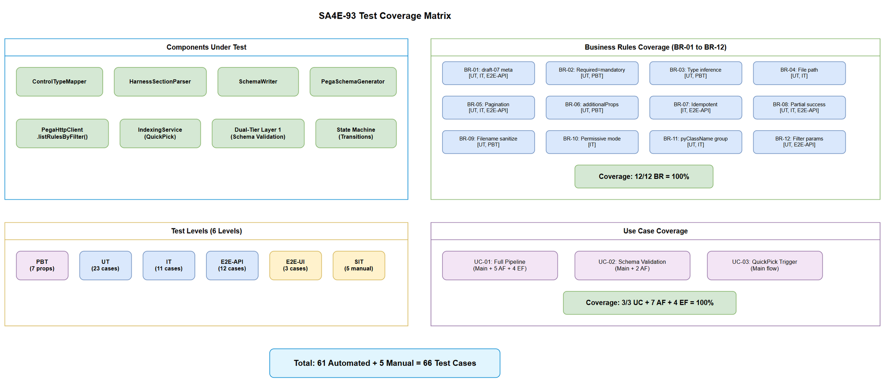
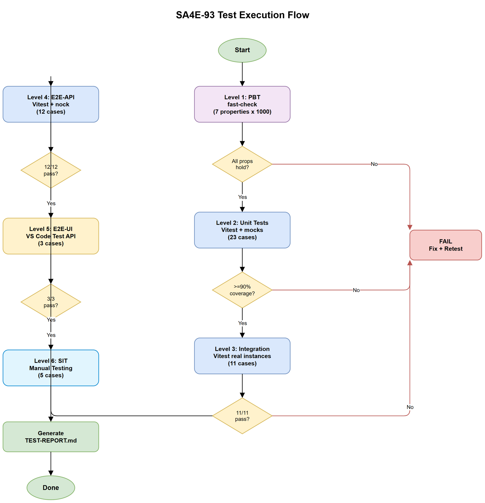

# System Test Plan (STP)

## SDLC-Agents-4-Enterprise — SA4E-93: Pega Rule Schema Generator

---

## Document Information

| Field | Value |
|-------|-------|
| Jira Ticket | SA4E-93 |
| Title | Pega Rule Schema Generator — Auto-generate JSON Schemas from Harness RuleForms |
| Author | QA Agent |
| Version | 1.0 |
| Date | 2026-08-07 |
| Status | Draft |
| Related BRD | BRD-v1-SA4E-93.docx |
| Related FSD | FSD-v1-SA4E-93.docx |
| Related TDD | TDD-v1-SA4E-93.docx |

---

## Revision History

| Version | Date | Author | Changes |
|---------|------|--------|---------|
| 1.0 | 2026-08-07 | QA Agent | Initial STP — test plan from BRD v1.0, FSD v1.0, TDD v1.0 |

---

## 1. Test Objectives

### 1.1 Scope

Validate the Pega Rule Schema Generator feature end-to-end, covering:

- **PegaSchemaGenerator** orchestrator pipeline (crawl → group → fetch → parse → generate → save)
- **HarnessSectionParser** recursive section extraction
- **ControlTypeMapper** type inference (13 control types + Unknown fallback)
- **SchemaWriter** file I/O and filename sanitization
- **PegaHttpClient.listRulesByFilter()** pagination and error handling
- **IndexingService** QuickPick integration (UC-03)
- **Dual-Tier Layer 1** schema validation (UC-02)
- **State Machine** transitions (IDLE → CRAWLING → ... → COMPLETED/ERROR)

### 1.2 Out of Scope

- Graph edges from schema relationships (deferred to UAT)
- Live sync/webhook (not in this ticket)
- Webview UI rendering of schemas
- Non-RuleForm harnesses
- Pega DX API integration

### 1.3 Test Strategy Summary

| Level | Tool | Focus | Coverage Target |
|-------|------|-------|-----------------|
| PBT | fast-check | ControlTypeMapper, SchemaWriter.sanitizeFileName | 100% mapping table + edge cases |
| UT | Vitest + mocks | All 4 components individually | ≥90% branch coverage |
| IT | Vitest + real instances | PegaSchemaGenerator pipeline with mocked HTTP | ≥80% integration paths |
| E2E-API | Vitest + nock/MSW | Full pipeline against mocked Pega REST API | All UC-01 flows |
| E2E-UI | VS Code Extension Test API | QuickPick trigger + progress notification | UC-03 happy path |
| SIT | Manual + visual | Extension UX, progress messages, output channel | User experience validation |

---

## 2. Requirements Traceability Matrix (RTM)

### 2.1 BRD Acceptance Criteria → Test Coverage

| AC ID | Acceptance Criteria | Test Level | Test Case IDs |
|-------|--------------------:|:----------:|---------------|
| AC1 | QuickPick has "Index Pega Rule Schemas" option | E2E-UI, SIT | TC-E2E-UI-01, TC-SIT-01 |
| AC2 | Crawls ALL RuleForm harnesses with pagination (>50) | UT, IT, E2E-API | TC-UT-11, TC-IT-03, TC-E2E-API-02 |
| AC3 | Grouped by pyClassName; full JSON fetched per type | UT, IT, E2E-API | TC-UT-12, TC-IT-04, TC-E2E-API-03 |
| AC4 | Sections parsed recursively including nested | UT, PBT | TC-UT-05 to TC-UT-09, TC-PBT-03 |
| AC5 | Valid JSON Schema draft-07 with required + types | UT, IT, E2E-API | TC-UT-01 to TC-UT-04, TC-IT-05, TC-E2E-API-04 |
| AC6 | Schema files saved to schemas/auto/{RuleType}.json | UT, IT, E2E-API | TC-UT-13 to TC-UT-15, TC-IT-06, TC-E2E-API-05 |
| AC7 | Dual-Tier Layer 1 uses generated schemas | IT, E2E-API | TC-IT-08, TC-E2E-API-06 |

### 2.2 FSD Use Cases → Test Coverage

| UC ID | Use Case | Test Levels | Test Case IDs |
|-------|----------|:-----------:|---------------|
| UC-01 | Generate Schemas from Pega RuleForms | UT, IT, E2E-API | TC-UT-01–15, TC-IT-01–07, TC-E2E-API-01–05 |
| UC-01 AF-01 | No harnesses found | UT, E2E-API | TC-UT-16, TC-E2E-API-07 |
| UC-01 AF-02 | Some fetch fails (404) | UT, IT, E2E-API | TC-UT-17, TC-IT-07, TC-E2E-API-08 |
| UC-01 AF-03 | Unparseable harness JSON | UT | TC-UT-18 |
| UC-01 AF-04 | Schema directory does not exist | UT | TC-UT-19 |
| UC-01 AF-05 | Re-run (idempotency) | IT, E2E-API | TC-IT-09, TC-E2E-API-09 |
| UC-01 EF-01 | Pega server unreachable | UT, E2E-API | TC-UT-20, TC-E2E-API-10 |
| UC-01 EF-02 | Auth failure (401/403) | UT, E2E-API | TC-UT-21, TC-E2E-API-11 |
| UC-01 EF-03 | All fetches fail | IT, E2E-API | TC-UT-22, TC-E2E-API-12 |
| UC-01 EF-04 | File system write fails | UT | TC-UT-23 |
| UC-02 | Validate Rule JSON Against Schema | IT, E2E-API | TC-IT-08, TC-E2E-API-06 |
| UC-02 AF-06 | Schema not found (permissive) | IT | TC-IT-10 |
| UC-02 AF-07 | Schema corrupted | IT | TC-IT-11 |
| UC-03 | QuickPick trigger | E2E-UI, SIT | TC-E2E-UI-01–03, TC-SIT-01–03 |

### 2.3 Business Rules → Test Coverage

| BR ID | Rule | Test Level | Test Case IDs |
|-------|------|:----------:|---------------|
| BR-01 | Schema validates against draft-07 meta-schema | UT, IT, E2E-API | TC-UT-01, TC-IT-05, TC-E2E-API-04 |
| BR-02 | Required array only contains mandatory fields | UT, PBT | TC-UT-02, TC-PBT-04 |
| BR-03 | Type inference from control types (13 mappings + Unknown) | UT, PBT | TC-UT-03, TC-UT-04, TC-PBT-01, TC-PBT-02 |
| BR-04 | Files saved to schemas/auto/{RuleType}.json | UT, IT | TC-UT-13, TC-IT-06 |
| BR-05 | Pagination handles >50 results (loop pxMore) | UT, IT, E2E-API | TC-UT-11, TC-IT-03, TC-E2E-API-02 |
| BR-06 | additionalProperties: true always | UT, PBT | TC-UT-01, TC-PBT-05 |
| BR-07 | Idempotent (re-run = same output) | IT, E2E-API | TC-IT-09, TC-E2E-API-09 |
| BR-08 | Individual failures don't abort pipeline | UT, IT, E2E-API | TC-UT-17, TC-IT-07, TC-E2E-API-08 |
| BR-09 | Filename sanitization (preserve casing, replace invalid chars) | UT, PBT | TC-UT-14, TC-UT-15, TC-PBT-06 |
| BR-10 | Schema not found → permissive mode | IT | TC-IT-10 |
| BR-11 | Grouping uses pyClassName | UT, IT | TC-UT-12, TC-IT-04 |
| BR-12 | Filter: ObjClass=Rule-HTML-Harness, FilterPropValue=RuleForm | UT, E2E-API | TC-UT-10, TC-E2E-API-01 |

---

## 3. Test Levels

### 3.1 Level 1: Property-Based Testing (PBT)

**Tool:** fast-check
**Purpose:** Exhaustively verify stateless mappers with generated inputs

| ID | Target | Property | Generator |
|----|--------|----------|-----------|
| TC-PBT-01 | ControlTypeMapper.mapControlToSchema | All 13 known types map to correct JSON type | `fc.constantFrom(...13 types)` |
| TC-PBT-02 | ControlTypeMapper.inferJsonType | Unknown type always returns "string" | `fc.string().filter(s => !knownTypes.includes(s))` |
| TC-PBT-03 | HarnessSectionParser.extractControls | Nested depth N always returns flat array | `fc.nat({max:10})` → generate N-deep sections |
| TC-PBT-04 | PegaSchemaGenerator.buildSchema | Required array ⊆ properties keys | `fc.array(fc.record({fieldName: fc.string(), required: fc.boolean()}))` |
| TC-PBT-05 | PegaSchemaGenerator.buildSchema | additionalProperties always true | Any control set → schema.additionalProperties === true |
| TC-PBT-06 | SchemaWriter.sanitizeFileName | Output contains only [a-zA-Z0-9_-.] | `fc.string()` → sanitize → regex match |
| TC-PBT-07 | SchemaWriter.sanitizeFileName | Non-empty input → non-empty output | `fc.string({minLength:1})` |

**Pass Criteria:** 1000 random inputs per property, zero failures.

### 3.2 Level 2: Unit Testing (UT)

**Tool:** Vitest + vi.mock
**Purpose:** Test each component in isolation with mocked dependencies

#### 3.2.1 ControlTypeMapper Tests

| ID | Scenario | Input | Expected | BR |
|----|----------|-------|----------|-----|
| TC-UT-01 | TextInput maps to string | `{controlType:'TextInput', fieldName:'pyName'}` | `{type:'string'}` | BR-03 |
| TC-UT-02 | Checkbox maps to boolean with default | `{controlType:'Checkbox', required:true}` | `{type:'boolean', default:false}` | BR-03 |
| TC-UT-03 | Dropdown maps to string+enum | `{controlType:'Dropdown', validValues:['A','B']}` | `{type:'string', enum:['A','B']}` | BR-03 |
| TC-UT-04 | Unknown fallback to string | `{controlType:'CustomWidget'}` | `{type:'string'}` | BR-03 |

#### 3.2.2 HarnessSectionParser Tests

| ID | Scenario | Input | Expected |
|----|----------|-------|----------|
| TC-UT-05 | Single section with 3 controls | Section JSON with pyControls[3] | 3 ControlDefinitions |
| TC-UT-06 | Nested sections (2 levels) | Section with pySections containing controls | Flat array of all controls |
| TC-UT-07 | Empty section (no controls) | Section with empty pyControls | Empty array |
| TC-UT-08 | Duplicate fieldName dedup | 2 controls same fieldName | 1 control in output |
| TC-UT-09 | Header + Content + Footer extraction | Full harness JSON | Controls from all 3 sections |

#### 3.2.3 PegaHttpClient.listRulesByFilter Tests

| ID | Scenario | Input | Expected | BR |
|----|----------|-------|----------|-----|
| TC-UT-10 | Correct filter params sent | objClass, filterPropName, filterPropValue | POST body matches BR-12 | BR-12 |
| TC-UT-11 | Pagination loop until pxMore=false | 3 pages (pxMore=true,true,false) | All 3 pages aggregated | BR-05 |

#### 3.2.4 PegaSchemaGenerator Tests

| ID | Scenario | Input | Expected | BR |
|----|----------|-------|----------|-----|
| TC-UT-12 | groupByRuleType deduplicates | 5 summaries, 3 unique pyClassName | Map with 3 entries | BR-11 |
| TC-UT-13 | buildSchema produces valid draft-07 | Controls array | Schema passes ajv meta-validation | BR-01 |

#### 3.2.5 SchemaWriter Tests

| ID | Scenario | Input | Expected | BR |
|----|----------|-------|----------|-----|
| TC-UT-14 | sanitize preserves casing | "Rule-Obj-Activity" | "Rule-Obj-Activity.json" | BR-09 |
| TC-UT-15 | sanitize replaces invalid chars | "Rule/With\\Special:Chars" | "Rule-With-Special-Chars.json" | BR-09 |

#### 3.2.6 Error Handling Tests

| ID | Scenario | Input | Expected | BR/EF |
|----|----------|-------|----------|-------|
| TC-UT-16 | No harnesses found | Empty pxResults page 1 | schemasGenerated=0, no error | AF-01 |
| TC-UT-17 | Single fetch 404 → skip | 3 types, 1 returns 404 | 2 schemas, 1 in errors[] | BR-08 |
| TC-UT-18 | Unparseable JSON → skip | Invalid JSON response | Skipped, logged, continue | AF-03 |
| TC-UT-19 | Directory auto-created | schemas/auto/ not exist | Directory created, file written | AF-04 |
| TC-UT-20 | Network unreachable → FATAL | fetch throws ECONNREFUSED | Throws, state=ERROR | EF-01 |
| TC-UT-21 | 401/403 → FATAL | HTTP 401 response | Throws, state=ERROR | EF-02 |
| TC-UT-22 | All fetches fail | All types return 404/500 | schemasGenerated=0, all in errors[] | EF-03 |
| TC-UT-23 | File write permission error | fs.writeFile throws EACCES | Skipped, in errors[], continue | EF-04 |

**Pass Criteria:** All assertions pass, ≥90% branch coverage per file.

### 3.3 Level 3: Integration Testing (IT)

**Tool:** Vitest, real component instances (mocked HTTP only)
**Purpose:** Verify component interactions within the pipeline

| ID | Scenario | Components | Expected | BR/UC |
|----|----------|-----------|----------|-------|
| TC-IT-01 | Happy path: 3 rule types | Generator + Parser + Mapper + Writer (mocked HTTP) | 3 schema files created | UC-01 |
| TC-IT-02 | State transitions correct | Generator state observed | IDLE→CRAWL→GROUP→FETCH→PARSE→GEN→COMPLETE | FSD §5 |
| TC-IT-03 | Pagination integration | Client (mocked) → Generator | All pages consumed | BR-05 |
| TC-IT-04 | Grouping dedup integration | Client→Generator→Writer | Unique types only processed | BR-11 |
| TC-IT-05 | Generated schema meta-validates | Generator→Writer→ajv | ajv.compile succeeds | BR-01 |
| TC-IT-06 | File path correct | Writer output | schemas/auto/{RuleType}.json exists | BR-04 |
| TC-IT-07 | Partial success (1 of 3 fails) | Generator with 1 bad response | 2 schemas + 1 error entry | BR-08 |
| TC-IT-08 | Schema validation pass (UC-02) | Generated schema + valid rule JSON | ajv validates true | UC-02 |
| TC-IT-09 | Idempotency (run twice) | Same mock data, run pipeline twice | Files identical (byte compare) | BR-07 |
| TC-IT-10 | Schema not found → permissive | No schema file + rule JSON | Warn logged, validation skipped | BR-10 |
| TC-IT-11 | Schema corrupted → skip | Invalid JSON in schema file | Error logged, permissive mode | UC-02 AF-07 |

**Pass Criteria:** All integration paths verified, no resource leaks.

### 3.4 Level 4: End-to-End API Testing (E2E-API)

**Tool:** Vitest + nock (HTTP mock at transport level)
**Purpose:** Full pipeline execution against simulated Pega server responses

| ID | Scenario | Mock Server Setup | Expected Result |
|----|----------|-------------------|-----------------|
| TC-E2E-API-01 | Filter params correct | Verify request body | ObjClass=Rule-HTML-Harness, FilterPropValue=RuleForm |
| TC-E2E-API-02 | Multi-page crawl | 3 pages × 50 records | 150 harnesses processed |
| TC-E2E-API-03 | Group + fetch per type | 20 unique pyClassNames | 20 queryRuleByTriple calls |
| TC-E2E-API-04 | Schema validity | Full pipeline | All schemas pass draft-07 meta |
| TC-E2E-API-05 | File output structure | Full pipeline | schemas/auto/*.json files correct |
| TC-E2E-API-06 | Validation integration | Schema + valid/invalid rule | Correct pass/fail results |
| TC-E2E-API-07 | Empty server | 0 results page 1 | "No harnesses found" info |
| TC-E2E-API-08 | Partial failure | 2/5 types return 404 | 3 schemas, 2 errors |
| TC-E2E-API-09 | Idempotency E2E | Run twice same mocks | Identical output files |
| TC-E2E-API-10 | Server unreachable | nock disabled | FATAL error thrown |
| TC-E2E-API-11 | Auth failure | 401 response | FATAL error, clear message |
| TC-E2E-API-12 | All fail | All types return 500 | 0 schemas, all errors |

**Pass Criteria:** Pipeline produces correct results for all mock scenarios.

### 3.5 Level 5: End-to-End UI Testing (E2E-UI)

**Tool:** VS Code Extension Test API (@vscode/test-electron)
**Purpose:** Verify extension UI integration

| ID | Scenario | Steps | Expected |
|----|----------|-------|----------|
| TC-E2E-UI-01 | QuickPick shows option | Execute "Index Workspace" command | "Index Pega Rule Schemas" visible |
| TC-E2E-UI-02 | Selection triggers pipeline | Select schema option | Progress notification appears |
| TC-E2E-UI-03 | Completion notification | Pipeline finishes | "Generated N schemas" message |

**Pass Criteria:** Extension test runner confirms all UI elements present and functional.

### 3.6 Level 6: System Integration Testing (SIT)

**Tool:** Manual testing with checklist
**Purpose:** Visual/UX validation that cannot be automated

| ID | Scenario | Steps | Expected |
|----|----------|-------|----------|
| TC-SIT-01 | QuickPick UX | Open command palette → Index Workspace | Option has $(symbol-class) icon, proper label |
| TC-SIT-02 | Progress messages | Trigger generation | Messages update: Crawling → Grouping → Fetching → Parsing → Generating → Complete |
| TC-SIT-03 | Output channel log | Monitor SDLC Indexing channel | Detailed logs with timestamps |
| TC-SIT-04 | Error notification UX | Disconnect Pega server → trigger | Clear error message in notification |
| TC-SIT-05 | Schema file inspection | Open generated schema | Valid JSON, readable, properly formatted |

**Pass Criteria:** Human tester confirms UX meets expectations, no visual issues.

---

## 4. Test Data Strategy

### 4.1 Test Data Files

| File | Content | Used By |
|------|---------|---------|
| `test-data/harness-summaries.csv` | Mock listRulesByFilter responses | UT, IT, E2E-API |
| `test-data/harness-full-json.csv` | Full harness JSON samples per rule type | UT, IT, E2E-API |
| `test-data/control-type-mappings.csv` | All 14 control type → schema type pairs | PBT, UT |
| `test-data/expected-schemas.csv` | Expected generated schema per rule type | IT, E2E-API |
| `test-data/invalid-inputs.csv` | Invalid/edge-case inputs for error paths | UT, PBT |
| `test-data/filename-sanitization.csv` | Input → expected filename pairs | PBT, UT |

### 4.2 Mock Server Fixtures

| Fixture | Description |
|---------|-------------|
| `fixtures/pega-list-page1.json` | Service 10 response page 1 (50 items, pxMore=true) |
| `fixtures/pega-list-page2.json` | Service 10 response page 2 (50 items, pxMore=true) |
| `fixtures/pega-list-page3.json` | Service 10 response page 3 (10 items, pxMore=false) |
| `fixtures/harness-activity.json` | Full harness JSON for Rule-Obj-Activity |
| `fixtures/harness-flow.json` | Full harness JSON for Rule-Obj-Flow |
| `fixtures/harness-model.json` | Full harness JSON for Rule-Obj-Model |
| `fixtures/harness-malformed.json` | Invalid JSON for error testing |

---

## 5. Test Environment

### 5.1 Development Environment

| Component | Version | Purpose |
|-----------|---------|---------|
| Node.js | 18+ | Runtime |
| TypeScript | 5.x | Language |
| Vitest | latest | Test runner |
| fast-check | latest | PBT framework |
| nock | latest | HTTP mock |
| ajv | 8.x (draft-07) | Schema validation |
| VS Code | 1.85+ | Extension host |

### 5.2 CI/CD Integration

- Tests run on every push to feature branch
- PBT + UT + IT: `npm test` (Vitest)
- E2E-UI: `npm run test:e2e` (VS Code test runner)
- SIT: Manual, tracked in test report

---

## 6. Entry/Exit Criteria

### 6.1 Entry Criteria

| Criteria | Verification |
|----------|-------------|
| BRD, FSD, TDD finalized | Documents exist in documents/SA4E-93/ |
| Code implementation complete | All 4 components + integration exist |
| Build passes | `npm run build` succeeds |
| Test environment ready | Dependencies installed, mocks available |

### 6.2 Exit Criteria

| Criteria | Threshold |
|----------|-----------|
| PBT: All properties hold | 1000 iterations × 7 properties, 0 failures |
| UT: Branch coverage | ≥90% per component |
| IT: All integration paths | 11/11 pass |
| E2E-API: All scenarios | 12/12 pass |
| E2E-UI: All UI tests | 3/3 pass |
| SIT: Manual checklist | 5/5 items verified |
| Critical defects | 0 open Critical/High |
| BR coverage | 12/12 business rules tested |

---

## 7. Risk Analysis

| Risk | Impact | Likelihood | Mitigation |
|------|--------|------------|------------|
| Pega harness JSON structure varies | Test fixtures may not match real data | Medium | Use real anonymized samples when available |
| Pagination edge cases (exactly 50) | Boundary errors | Low | PBT with boundary values |
| Schema too permissive (all optional) | Validation not effective | Medium | Compare with known-required fields |
| Control type mapping incomplete | Missing types default to string | Low | Monitor Unknown count in reports |
| VS Code API changes | E2E-UI tests break | Low | Pin VS Code version in CI |

---

## 8. Test Execution Schedule

| Phase | Duration | Dependencies |
|-------|----------|--------------|
| PBT + UT | Day 1-2 | Code implementation |
| IT | Day 3 | UT pass |
| E2E-API | Day 4 | IT pass |
| E2E-UI | Day 5 | E2E-API pass |
| SIT | Day 5 | E2E-UI pass |
| Report | Day 6 | All levels complete |

---

## 9. Test Coverage Diagram

---

## 10. Test Execution Flow

---

## Appendix

### Diagram Index

| # | Diagram | Image | Source (editable) |
|---|---------|-------|-------------------|
| 1 | Test Coverage | [test-coverage.png](diagrams/test-coverage.png) | [test-coverage.drawio](diagrams/test-coverage.drawio) |
| 2 | Test Execution Flow | [test-execution-flow.png](diagrams/test-execution-flow.png) | [test-execution-flow.drawio](diagrams/test-execution-flow.drawio) |
