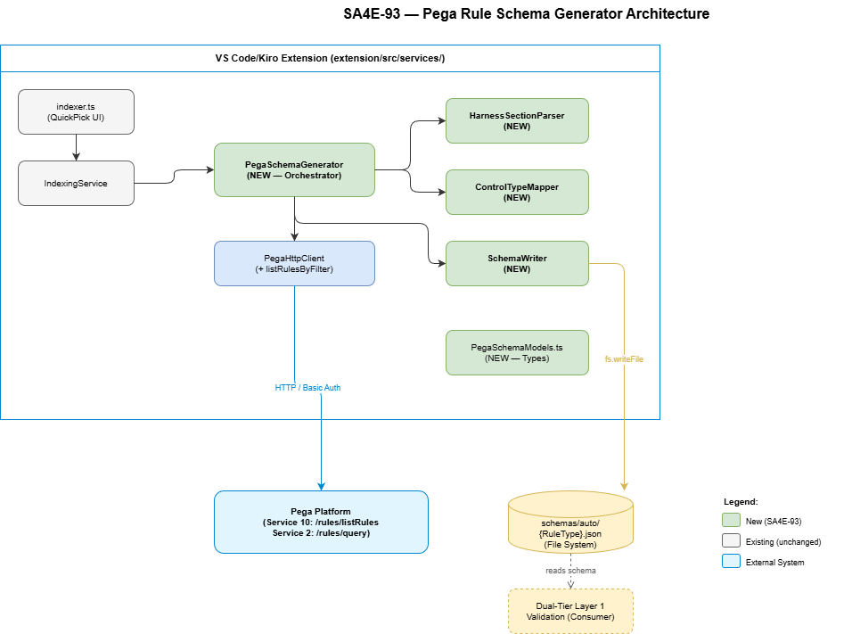
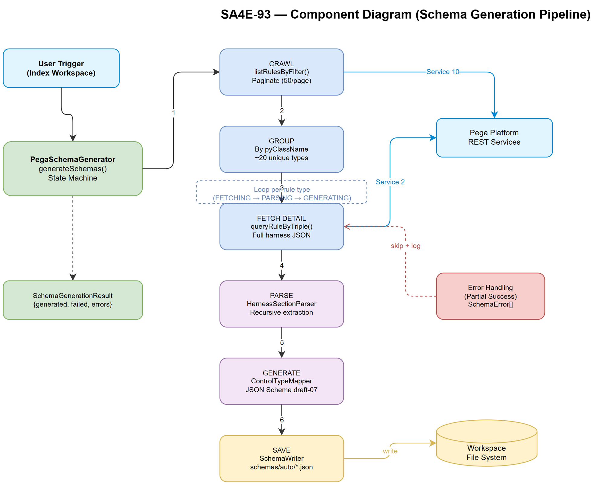

# Technical Design Document (TDD)

## SDLC-Agents-4-Enterprise — SA4E-93: Pega Rule Schema Generator

---

## Document Information

| Field | Value |
|-------|-------|
| Jira Ticket | SA4E-93 |
| Title | Pega Rule Schema Generator — Auto-generate JSON Schemas from Harness RuleForms |
| Author | SA Agent |
| Version | 1.0 |
| Date | 2026-08-07 |
| Status | Draft |
| Related FSD | documents/SA4E-93/FSD.md |
| Related BRD | documents/SA4E-93/BRD.md |

---

## Revision History

| Version | Date | Author | Changes |
|---------|------|--------|---------|
| 1.0 | 2026-08-07 | SA Agent | Initial TDD — architecture design from FSD v1.0 |

---

## 1. Architecture Overview

### 1.1 System Context

The Pega Rule Schema Generator is a new service (`PegaSchemaGenerator`) in the VS Code/Kiro extension that orchestrates a multi-phase pipeline:

1. **Crawl** — Discover all RuleForm harnesses from Pega Platform via paginated REST API
2. **Group** — Deduplicate by `pyClassName` to identify unique rule types
3. **Fetch** — Retrieve full harness JSON for each unique rule type
4. **Parse** — Extract sections and controls recursively
5. **Generate** — Map controls to JSON Schema properties using ControlTypeMapper
6. **Save** — Write schema files to `schemas/auto/{RuleType}.json`

### 1.2 Architecture Diagram



### 1.3 Module Dependencies

```
extension/src/
├── indexer.ts ──► IndexingService ──► PegaSchemaGenerator
│                                         │
│                      ┌──────────────────┼──────────────┐
│                      ▼                  ▼              ▼
│             PegaHttpClient    SchemaWriter    ControlTypeMapper
│             (listRulesByFilter)                        │
│                      │                                ▼
│                      │                     HarnessSectionParser
└──────────────────────┼─────────────────────────────────────
                       │ HTTP (Basic Auth)
                       ▼
Pega Platform (External)
  Service 10: /rules/listRules (pagination)
  Service 2:  /rules/query (full harness JSON)
```

### 1.4 Design Decisions

| Decision | Rationale |
|----------|-----------|
| PegaSchemaGenerator in extension (not backend) | Orchestration lives close to VS Code UI, reuses existing PegaHttpClient + progress APIs |
| ControlTypeMapper as pure function module | Stateless mapping, easily testable, no side effects |
| SchemaWriter as separate service | SRP — file I/O concerns isolated from business logic |
| HarnessSectionParser in extension | Direct parsing of raw harness JSON; avoids extra network call to backend for AST |
| State machine pattern | Clear progress reporting, error recovery per-phase (BR-08) |
| `additionalProperties: true` always | Pega adds system fields not in harness (BR-06); prevents false rejections |
| No backend round-trip for parsing | Raw harness JSON has well-known structure; HarnessSectionParser handles directly |

---

## 2. Component Design

### 2.1 Component Diagram



### 2.2 PegaSchemaGenerator

**Location:** `extension/src/services/PegaSchemaGenerator.ts`
**Responsibility:** Orchestrate the full schema generation pipeline (UC-01 main flow)
**Dependencies:** PegaHttpClient, HarnessSectionParser, ControlTypeMapper, SchemaWriter

```
PegaSchemaGenerator
├── generateSchemas(report): Promise<SchemaGenerationResult>
│   ├── crawlHarnesses(report): Promise<HarnessSummary[]>
│   ├── groupByRuleType(summaries): Map<string, HarnessSummary>
│   ├── fetchAndParseHarness(ruleType, summary): Promise<ControlDefinition[]>
│   └── buildSchema(ruleType, controls): JsonSchema
└── State: IDLE → CRAWLING → GROUPING → FETCHING_DETAIL → PARSING → GENERATING → COMPLETED
```

**Design Pattern:** Template Method — `generateSchemas()` defines the algorithm skeleton; each step is a separate method that can be overridden for testing.

**Error Strategy:** Partial success (BR-08). Fatal errors (network/auth) abort immediately. Individual harness failures are logged and skipped.

### 2.3 HarnessSectionParser

**Location:** `extension/src/services/HarnessSectionParser.ts`
**Responsibility:** Recursively extract UI controls from raw harness JSON
**Dependencies:** None (pure function module)

```
HarnessSectionParser
├── extractControls(harnessJson: Record<string, unknown>): ControlDefinition[]
│   └── parseSection(section: unknown): ControlDefinition[]
│       └── parseSection(nestedSection): ControlDefinition[]  (recursive)
└── inferControlType(properties: Record<string, unknown>): PegaControlType
```

**Algorithm (FSD Section 8.2):**
```
function extractControls(harnessJson):
    controls = []
    for sectionKey in [pyHeaderSection, pyContentSection, pyFooterSection]:
        section = harnessJson[sectionKey]
        if section exists:
            controls.push(...parseSection(section))
    // Also check pyLayouts (backend AST structure)
    if harnessJson.pyLayouts exists:
        for layout in pyLayouts:
            controls.push(...parseSection(layout))
    return deduplicateByFieldName(controls)

function parseSection(section):
    controls = []
    for each control in section.pyControls (or section properties with field indicators):
        controls.push(mapRawControl(control))
    for each nestedSection in section.pySections (or section.pyLayouts):
        controls.push(...parseSection(nestedSection))
    return controls
```

### 2.4 ControlTypeMapper

**Location:** `extension/src/services/ControlTypeMapper.ts`
**Responsibility:** Map Pega UI control types to JSON Schema type definitions (BR-03)
**Dependencies:** None (pure function module)

**Mapping Table (13 types from FSD Section 7.2):**

| PegaControlType | JSON Schema `type` | Extra properties |
|-----------------|-------------------|------------------|
| TextInput | `"string"` | maxLength? |
| TextArea | `"string"` | — |
| NumberInput | `"number"` | minimum?, maximum? |
| Checkbox | `"boolean"` | default: false |
| Dropdown | `"string"` | enum: [...] |
| RadioButtons | `"string"` | enum: [...] |
| DatePicker | `"string"` | format: "date-time" |
| Autocomplete | `"string"` | — |
| Link | `"string"` | format: "uri" |
| Integer | `"integer"` | — |
| Hidden | `"string"` | — |
| PageList | `"array"` | items: { type: "object" } |
| PageGroup | `"object"` | additionalProperties: true |
| (Unknown) | `"string"` | — (fallback, BR-03) |

### 2.5 SchemaWriter

**Location:** `extension/src/services/SchemaWriter.ts`
**Responsibility:** Write JSON Schema files to disk (BR-04, BR-07 idempotency)
**Dependencies:** VS Code workspace.fs API (or Node fs)

**File naming (BR-09):** `schemas/auto/{pxObjClass}.json`
- Preserve original casing (e.g., `Rule-Obj-Activity.json`)
- Replace characters not valid in filenames with `-`
- Directory auto-created if missing (AF-04)

### 2.6 PegaHttpClient — New Method

**Location:** `extension/src/services/PegaHttpClient.ts` (existing file)
**Method:** `listRulesByFilter()`

Uses Service 10 `/rules/listRules` endpoint. Follows existing patterns:
- `getCustomRestPrefixes()` for multi-prefix discovery
- `fetchWithRetry()` for retry with exponential backoff
- `activePrefix` caching after first successful response

---

## 3. API Design (Interfaces & Method Signatures)

### 3.1 PegaSchemaGenerator

```typescript
/**
 * PegaSchemaGenerator — Orchestrates JSON Schema generation from Pega RuleForms.
 * Entry point for UC-01 full pipeline.
 */
export class PegaSchemaGenerator {
  constructor(
    private readonly pegaClient: PegaHttpClient,
    private readonly sectionParser: HarnessSectionParser,
    private readonly controlMapper: ControlTypeMapper,
    private readonly schemaWriter: SchemaWriter,
    private readonly log: (msg: string) => void,
  ) {}

  /**
   * Execute full schema generation pipeline.
   * @param report VS Code progress reporter for UI feedback
   * @returns Summary of generation results
   * @throws On fatal errors only (server unreachable, auth failure)
   */
  public async generateSchemas(
    report: ProgressReporter,
  ): Promise<SchemaGenerationResult> {}

  /** Crawl all RuleForm harnesses with pagination (BR-05, BR-12) */
  private async crawlHarnesses(
    report: ProgressReporter,
  ): Promise<HarnessSummary[]> {}

  /** Group summaries by pyClassName → unique rule types (BR-11) */
  private groupByRuleType(
    summaries: HarnessSummary[],
  ): Map<string, HarnessSummary> {}

  /** Fetch full harness JSON and extract controls */
  private async fetchAndParse(
    ruleType: string,
    summary: HarnessSummary,
  ): Promise<ControlDefinition[]> {}

  /** Build JSON Schema draft-07 from control definitions */
  private buildSchema(
    ruleType: string,
    controls: ControlDefinition[],
  ): JsonSchema {}
}
```

### 3.2 HarnessSectionParser

```typescript
/**
 * HarnessSectionParser — Extracts control definitions from raw harness JSON.
 * Pure function module — no side effects, no I/O.
 */
export class HarnessSectionParser {
  /**
   * Extract all UI controls from a raw harness JSON object.
   * Recursively walks sections and layouts.
   * @param harnessJson Full harness JSON from Pega
   * @returns Flat array of control definitions (deduplicated by fieldName)
   */
  public extractControls(
    harnessJson: Record<string, unknown>,
  ): ControlDefinition[] {}

  /** Recursively parse a section/layout for controls */
  private parseSection(section: unknown): ControlDefinition[] {}

  /** Infer PegaControlType from raw property indicators */
  private inferControlType(
    props: Record<string, unknown>,
  ): PegaControlType {}
}
```

### 3.3 ControlTypeMapper

```typescript
/**
 * ControlTypeMapper — Maps Pega control types to JSON Schema types.
 * Stateless, pure-function design.
 */
export class ControlTypeMapper {
  /**
   * Map a single control definition to a JSON Schema property.
   * @param control Control definition from HarnessSectionParser
   * @returns JSON Schema property definition
   */
  public mapControlToSchema(
    control: ControlDefinition,
  ): JsonSchemaProperty {}

  /**
   * Infer JSON Schema type from Pega control type.
   * Unknown types fallback to "string" (BR-03).
   */
  public inferJsonType(controlType: PegaControlType): string {}
}
```

### 3.4 SchemaWriter

```typescript
/**
 * SchemaWriter — Handles file I/O for generated JSON Schema files.
 * Creates directory if missing (AF-04), overwrites on re-run (BR-07).
 */
export class SchemaWriter {
  /**
   * Write a JSON Schema to disk at schemas/auto/{ruleType}.json.
   * @param ruleType Pega pxObjClass (used for filename)
   * @param schema Complete JSON Schema object
   * @param workspaceRoot Workspace root path
   */
  public async writeSchema(
    ruleType: string,
    schema: JsonSchema,
    workspaceRoot: string,
  ): Promise<void> {}

  /** Sanitize pxObjClass for use as filename (BR-09) */
  public sanitizeFileName(ruleType: string): string {}

  /** Ensure schemas/auto/ directory exists */
  private async ensureDirectory(dirPath: string): Promise<void> {}
}
```

### 3.5 PegaHttpClient.listRulesByFilter()

```typescript
/**
 * Service 10: POST /rules/listRules
 * List rules matching a property filter with pagination.
 * @param objClass Pega rule class (e.g., "Rule-HTML-Harness")
 * @param filterPropName Property to filter on (e.g., "pyStreamName")
 * @param filterPropValue Value to match (e.g., "RuleForm")
 * @param pageSize Records per page (default 50, BR-05)
 * @param pageIndex 1-based page number (default 1)
 * @returns Paginated response with pxMore flag
 */
public async listRulesByFilter(
  objClass: string,
  filterPropName: string,
  filterPropValue: string,
  pageSize = 50,
  pageIndex = 1,
): Promise<ListRulesResponse> {}
```

---

## 4. Data Model (TypeScript Types/Interfaces)

### 4.1 New File: `extension/src/models/PegaSchemaModels.ts`

```typescript
/**
 * PegaSchemaModels — Types for Pega Rule Schema Generator (SA4E-93).
 */

/** Pipeline generation state (FSD Section 5) */
export type SchemaGenerationState =
  | 'IDLE'
  | 'CRAWLING'
  | 'GROUPING'
  | 'FETCHING_DETAIL'
  | 'PARSING'
  | 'GENERATING'
  | 'COMPLETED'
  | 'ERROR';

/** Result from schema generation pipeline */
export interface SchemaGenerationResult {
  totalHarnesses: number;
  uniqueRuleTypes: number;
  schemasGenerated: number;
  schemasFailed: number;
  errors: SchemaError[];
  outputDirectory: string;
}

/** Detailed error for failed schema generation */
export interface SchemaError {
  ruleType: string;
  phase: 'crawl' | 'fetch' | 'parse' | 'generate' | 'write';
  message: string;
}

/** Summary of a harness rule from listRulesByFilter */
export interface HarnessSummary {
  pzInsKey: string;
  pxObjClass: string;
  pyClassName: string;
  pyRuleName: string;
  pyStreamName: string;
  pyLabel?: string;
}

/** Response from listRulesByFilter (Service 10) */
export interface ListRulesResponse {
  pxResults: HarnessSummary[];
  pxMore: boolean;
  totalCount?: number;
}

/** Pega UI control types (FSD Section 7.2) */
export type PegaControlType =
  | 'TextInput'
  | 'TextArea'
  | 'NumberInput'
  | 'Checkbox'
  | 'Dropdown'
  | 'RadioButtons'
  | 'DatePicker'
  | 'Autocomplete'
  | 'Link'
  | 'Integer'
  | 'Hidden'
  | 'PageList'
  | 'PageGroup'
  | 'Unknown';

/** Extracted control definition from harness section */
export interface ControlDefinition {
  fieldName: string;
  controlType: PegaControlType;
  required: boolean;
  label?: string;
  tooltip?: string;
  defaultValue?: string;
  validValues?: string[];
  maxLength?: number;
  minimum?: number;
  maximum?: number;
}

/** JSON Schema property definition */
export interface JsonSchemaProperty {
  type: string;
  description?: string;
  enum?: string[];
  default?: unknown;
  format?: string;
  const?: string;
  maxLength?: number;
  minimum?: number;
  maximum?: number;
  items?: { type: string };
  additionalProperties?: boolean;
}

/** Complete JSON Schema document (draft-07) */
export interface JsonSchema {
  $schema: string;
  title: string;
  description: string;
  type: 'object';
  properties: Record<string, JsonSchemaProperty>;
  required: string[];
  additionalProperties: true;
}

/** JSON Schema type info for control type mapping lookup */
export interface JsonSchemaTypeInfo {
  type: string;
  format?: string;
  additionalProps?: Record<string, unknown>;
}
```

### 4.2 Type Relationships

```
SchemaGenerationResult ←── PegaSchemaGenerator.generateSchemas()
    └── SchemaError[]

HarnessSummary ←── PegaHttpClient.listRulesByFilter()
    └── ListRulesResponse.pxResults[]

ControlDefinition ←── HarnessSectionParser.extractControls()
    └── PegaControlType (enum)

JsonSchemaProperty ←── ControlTypeMapper.mapControlToSchema()
    └── JsonSchemaTypeInfo (lookup table entry)

JsonSchema ←── PegaSchemaGenerator.buildSchema()
    └── properties: Record<fieldName, JsonSchemaProperty>
    └── required: string[] (fields with control.required=true)
```

---

## 5. Integration Points with Existing Code

### 5.1 IndexingService Integration

**File:** `extension/src/indexer.ts`
**Change:** Add QuickPick option in `showIndexOptions()`:

```typescript
{ label: "$(symbol-class) Index Pega Rule Schemas",
  description: "Generate JSON Schemas from Pega RuleForms",
  id: "schemas", picked: false }
```

**File:** `extension/src/services/IndexingService.ts`
**Change:** Add `schemas` to `IndexOptions` interface, call `PegaSchemaGenerator.generateSchemas()` when selected.

### 5.2 PegaHttpClient Integration

**File:** `extension/src/services/PegaHttpClient.ts`
**Change:** Add `listRulesByFilter()` method (~50 lines)

Implementation follows existing `listApplicationRules()` pattern:
- Same prefix discovery loop
- Same fetchWithRetry
- Query params: `ObjClass`, `FilterPropName`, `FilterPropValue`, `PageSize`, `PageIndex`
- Body: `{ ruleJson: JSON.stringify({...params}) }`

### 5.3 Harness Fetching via queryRuleByTriple

Existing method `PegaHttpClient.queryRuleByTriple()` already handles fetching full harness JSON:
- `pxObjClass = "Rule-HTML-Harness"`
- `appliesTo = pyClassName` (the rule type)
- `pyRuleName = "RuleForm"`

No changes needed to this method.

### 5.4 Dual-Tier Layer 1 Validation (UC-02)

**Future integration point** (not implemented in this ticket):
- Consumer service calls `validateRuleAgainstSchema(rule, schemaDir)` before `savePegaRule()`
- Loads schema from `schemas/auto/{pxObjClass}.json`
- Validates with ajv (draft-07 mode)
- Permissive fallback when schema not found (BR-10)

---

## 6. Error Handling Strategy

### 6.1 Error Classification

| Category | Examples | Action | User Message |
|----------|----------|--------|-------------|
| FATAL | Network unreachable, 401/403, Service 10 not deployed | Abort entire pipeline | Clear error in notification |
| RECOVERABLE | Individual 404, parse error, I/O write error | Skip item, continue | Logged to output channel |
| INFO | No harnesses found | Complete with 0 results | Info notification |

### 6.2 Error Flow per Phase

```
CRAWLING:
  - Network error → FATAL → abort, report "Pega server unreachable"
  - 401/403 → FATAL → abort, report "Invalid credentials"
  - Empty results (page 1) → INFO → complete with schemasGenerated=0

FETCHING_DETAIL:
  - Individual 404 → RECOVERABLE → skip rule type, add to errors[]
  - 5xx after retry exhausted → RECOVERABLE → skip, continue remaining

PARSING:
  - No sections in harness JSON → RECOVERABLE → skip (empty harness)
  - No controls extracted → RECOVERABLE → skip (schema not useful)

GENERATING:
  - Always succeeds (deterministic mapping, fallback type = "string")

SAVING:
  - I/O permission error → RECOVERABLE → skip file, log error
  - Directory creation fails → RECOVERABLE → skip file, log error
```

### 6.3 Partial Success Reporting (BR-08)

`SchemaGenerationResult` always reports:
- `schemasGenerated`: successfully written files
- `schemasFailed`: failed attempts
- `errors[]`: detailed list with phase + ruleType + message

Final notification: `"Generated {N} schemas for {M} rule types ({F} failed)"`

### 6.4 Retry Strategy

Reuses existing `PegaHttpClient.fetchWithRetry()`:
- Max 2 retries with exponential backoff
- Retry on HTTP 502/503/504
- No retry on 401/403/404 (deterministic failures)

---

## 7. Security Design

### 7.1 Credential Handling

- Pega credentials stored in VS Code `SecretStorage` (existing pattern)
- Credentials never logged, persisted, or included in error messages
- Basic Auth header constructed per-request via existing `getAuthHeader()`

### 7.2 Data Classification

| Data | Classification | Handling |
|------|---------------|----------|
| Pega credentials | Confidential | SecretStorage only, never in logs |
| Raw harness JSON | Internal | In-memory only during processing, discarded after |
| Generated schemas | Internal | Saved to workspace, no PII content |
| Error messages | Internal | Logged to output channel, sanitized (no credentials) |

### 7.3 Input Validation

- `listRulesByFilter()` validates parameters are non-empty strings
- Harness JSON parsed defensively with try/catch per item
- Schema filenames sanitized to prevent path traversal (BR-09): only `[a-zA-Z0-9_-.]` allowed

### 7.4 No Sensitive Data in Schemas

Generated schemas contain only structural metadata (field names, types, constraints). No credentials, user data, or business-sensitive values are persisted in schema files.

---

## 8. State Machine Design

### 8.1 States and Transitions (FSD Section 5)

| From State | To State | Trigger | Guard |
|------------|----------|---------|-------|
| IDLE | CRAWLING | User triggers generation | Credentials available |
| CRAWLING | GROUPING | All pages fetched | pxMore=false |
| CRAWLING | ERROR | Network/auth error | Fatal classification |
| GROUPING | FETCHING_DETAIL | Types identified | ≥1 type found |
| GROUPING | COMPLETED | No types found | 0 types (AF-01) |
| FETCHING_DETAIL | PARSING | Full JSON received | Valid JSON |
| FETCHING_DETAIL | FETCHING_DETAIL | Fetch failed (skip) | Other types remain |
| PARSING | GENERATING | Controls extracted | ≥1 control |
| PARSING | FETCHING_DETAIL | Parse failed (skip) | Other types remain |
| GENERATING | FETCHING_DETAIL | Schema written | More types to process |
| GENERATING | COMPLETED | All types processed | No remaining types |

### 8.2 Progress Reporting per State

| State | Message Template | Example |
|-------|-----------------|---------|
| CRAWLING | `"Crawling Pega harnesses (page {N})..."` | "Crawling Pega harnesses (page 3)..." |
| GROUPING | `"Grouping {N} harnesses into {M} rule types..."` | "Grouping 110 harnesses into 22 rule types..." |
| FETCHING_DETAIL | `"Fetching harness detail ({i}/{total})..."` | "Fetching harness detail (5/22)..." |
| PARSING | `"Parsing harness for {ruleType}..."` | "Parsing harness for Rule-Obj-Activity..." |
| GENERATING | `"Generating schema for {ruleType}..."` | "Generating schema for Rule-Obj-Activity..." |
| COMPLETED | `"Schema generation complete: {N} schemas for {M} rule types"` | "Schema generation complete: 20 schemas for 22 rule types" |

---

## 9. Implementation Checklist

### 9.1 Ordered Tasks

| # | Task | File | Dependencies | Est. |
|---|------|------|--------------|------|
| 1 | Create `PegaSchemaModels.ts` | `extension/src/models/PegaSchemaModels.ts` | None | 1h |
| 2 | Export from models index | `extension/src/models/index.ts` | Task 1 | 5min |
| 3 | Implement `ControlTypeMapper.ts` | `extension/src/services/ControlTypeMapper.ts` | Task 1 | 1h |
| 4 | Implement `HarnessSectionParser.ts` | `extension/src/services/HarnessSectionParser.ts` | Task 1 | 2h |
| 5 | Implement `SchemaWriter.ts` | `extension/src/services/SchemaWriter.ts` | Task 1 | 1h |
| 6 | Add `listRulesByFilter()` to PegaHttpClient | `extension/src/services/PegaHttpClient.ts` | None | 1h |
| 7 | Implement `PegaSchemaGenerator.ts` | `extension/src/services/PegaSchemaGenerator.ts` | Tasks 3-6 | 3h |
| 8 | Integrate into IndexingService | `extension/src/services/IndexingService.ts` | Task 7 | 1h |
| 9 | Add QuickPick option in indexer.ts | `extension/src/indexer.ts` | Task 8 | 30min |
| 10 | Unit tests: ControlTypeMapper | `extension/src/__tests__/ControlTypeMapper.test.ts` | Task 3 | 1h |
| 11 | Unit tests: HarnessSectionParser | `extension/src/__tests__/HarnessSectionParser.test.ts` | Task 4 | 1.5h |
| 12 | Unit tests: SchemaWriter | `extension/src/__tests__/SchemaWriter.test.ts` | Task 5 | 1h |
| 13 | Integration test: PegaSchemaGenerator | `extension/src/__tests__/PegaSchemaGenerator.test.ts` | Task 7 | 2h |

**Total estimate:** ~15 hours

### 9.2 File Size Compliance (200 lines max)

| File | Estimated Lines | Content |
|------|----------------|---------|
| `PegaSchemaModels.ts` | ~80 | Types/interfaces only |
| `ControlTypeMapper.ts` | ~80 | Mapping table + 2 methods |
| `HarnessSectionParser.ts` | ~90 | Recursive parser + helper |
| `SchemaWriter.ts` | ~60 | File I/O + sanitize |
| `PegaSchemaGenerator.ts` | ~150 | Orchestrator (5 private methods) |
| `listRulesByFilter()` | ~50 | Added to existing PegaHttpClient |

---

## 10. Non-Functional Considerations

### 10.1 Performance

| Metric | Target | Implementation |
|--------|--------|---------------|
| Total pipeline time | < 5 minutes | Sequential fetch for ~20 unique types (network-bound) |
| Memory peak | < 50MB | Process one harness at a time, discard raw JSON after |
| Page size | 50 per page | BR-05, standard Pega pagination limit |

### 10.2 Idempotency (BR-07)

- Same Pega server state → identical schema files
- Files overwritten on re-run (no stale data)
- No side effects beyond file writes to `schemas/auto/`

### 10.3 Scalability

- Pagination supports unlimited harness count (BR-05)
- O(N) where N = unique rule types (~20-50 typically)
- Each schema file independent — no cross-schema dependencies

---

## Appendix

### Diagram Index

| # | Diagram | Image | Source (editable) |
|---|---------|-------|-------------------|
| 1 | Architecture Diagram | [architecture.png](diagrams/architecture.png) | [architecture.drawio](diagrams/architecture.drawio) |
| 2 | Component Diagram | [component.png](diagrams/component.png) | [component.drawio](diagrams/component.drawio) |
