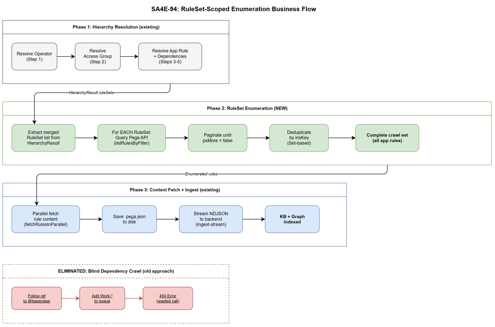
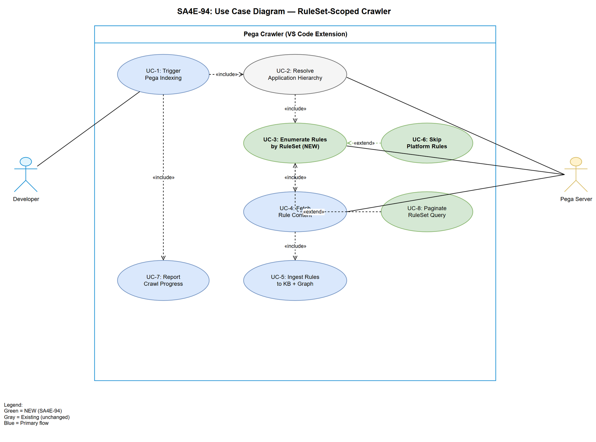

# Business Requirements Document (BRD)

## SA4E — SA4E-94: Redesign Pega Crawler: RuleSet-scoped enumeration instead of blind dependency crawl

---

## Document Information

| Field | Value |
|-------|-------|
| Jira Ticket | SA4E-94 |
| Title | Redesign Pega Crawler: RuleSet-scoped enumeration instead of blind dependency crawl |
| Author | BA Agent |
| Version | 1.0 |
| Date | 2025-07-08 |
| Status | Draft |
| Priority | High |

---

## Author Tracking

| Role | Name - Position | Responsibility |
|------|-----------------|----------------|
| Author | BA Agent – Business Analyst | Create document |
| Peer Reviewer | TA Agent – Technical Architect | Review document |

---

## Revision History

| Version | Date | Author | Changes |
|---------|------|--------|---------|
| 1.0 | 2025-07-08 | BA Agent | Initiate document — auto-generated from Jira ticket SA4E-94 |

---

## 1. Introduction

### 1.1 Scope

Redesign the Pega Indexer crawler strategy from a blind dependency-graph crawl (follow-references) to a deterministic RuleSet-scoped enumeration approach. The crawler will enumerate ALL rules within the application's declared RuleSets instead of following reference chains that lead to platform rules outside the app scope.

This is an **internal backend refactoring** — no UI changes, no new user-facing features. The change affects:
- `extension/src/services/IndexingService.ts` — main crawl loop
- `extension/src/services/PegaCrawlHelper.ts` — fetch strategies
- `extension/src/services/PegaHttpClient.ts` — API query methods
- `extension/src/services/PegaHierarchyResolver.ts` — RuleSet resolution (already exists)
- `backend/src/server/routes/pega-stream.ts` — backend ingest orchestration

### 1.2 Out of Scope

- UI changes or user-facing configuration
- Pega API schema changes (using existing endpoints)
- Changes to the Knowledge Base (KB) storage layer
- Changes to graph node structure or KB ingestion format
- Changes to authentication/credentials handling
- Other indexing types (document indexing, code intelligence)

### 1.3 Preliminary Requirements

- Existing `PegaHierarchyResolver.ts` already resolves RuleSets from Application Rule (Step 3-5 in current hierarchy resolution)
- Pega API endpoint `POST /rules/listRules` supports filtering by RuleSet (via `FilterPropName=pyRuleSet&FilterPropValue={RuleSetName}`)
- `PegaHttpClient.listRulesByFilter()` method already supports paginated queries with filters
- Application context (AppName, RuleSets, depended applications) is already resolved before crawl begins

---

## 2. Business Requirements

### 2.1 High Level Process Map

The redesigned crawler follows a **enumerate-by-RuleSet** strategy:

1. Resolve Application hierarchy (already implemented — Operator → Access Group → App Rule → Dependencies)
2. Extract declared RuleSets from Application Rule + depended applications
3. For EACH RuleSet: Query Pega API to enumerate ALL rules belonging to that RuleSet
4. Aggregate all enumerated rules → this IS the complete crawl set
5. Fetch full rule content for each enumerated rule (parallel, chunked)
6. Ingest into KB — complete, deterministic, no 404s

### 2.2 List of User Stories / Use Cases

| # | Story / Use Case | Priority | Source Ticket |
|---|------------------|----------|---------------|
| 1 | As a developer, I want the Pega crawler to only fetch rules within my app's declared RuleSets so that indexing is deterministic and complete | MUST HAVE | SA4E-94 |
| 2 | As a developer, I want zero 404 errors during Pega indexing so that the output channel is clean and trustworthy | MUST HAVE | SA4E-94 |
| 3 | As a developer, I want all application rules indexed regardless of reference chains so that no app rules are missed | MUST HAVE | SA4E-94 |
| 4 | As a developer, I want platform rules skipped entirely so that API calls are not wasted on out-of-scope rules | MUST HAVE | SA4E-94 |
| 5 | As a developer, I want the crawler to complete faster by eliminating wasted 404 calls so that indexing time is reduced | SHOULD HAVE | SA4E-94 |

---

### 2.3 Details of User Stories

---

#### Business Flow

**Current State (Problem):**

**Step 1:** Hierarchy resolves seeds (Operator → Access Group → App → CaseTypes)

**Step 2:** Seeds are placed in crawl queue

**Step 3:** For each rule fetched, references to other classes are discovered

**Step 4:** Referenced classes are added to crawl queue regardless of RuleSet scope

**Step 5:** Crawler attempts to fetch platform rules (@baseclass, Work-, Assign-*) → 404 errors

**Step 6:** Non-deterministic behavior — different runs produce different crawl paths based on reference order

> **Problem:** Steps 4-6 cause wasted API calls, 404 errors, and non-deterministic coverage.

---

**Target State (Solution):**

**Step 1:** Hierarchy resolves Application + depended applications (already implemented)

**Step 2:** Extract merged RuleSet list (e.g., HRAppsV2:01-02, HRAppsV2Int:01-01, CreditCheck:01-01)

**Step 3:** For each RuleSet, query Pega API: "Give me ALL rules in RuleSet X" (paginated)

**Step 4:** Aggregate all enumerated rules → this IS the complete crawl set

**Step 5:** Fetch full rule content for each enumerated rule (parallel, chunked)

**Step 6:** Ingest into KB — complete, deterministic, no 404s

> **Note:** Platform rules are never referenced because enumeration is scoped to app RuleSets only.

---

#### STORY 1: RuleSet-Scoped Enumeration

> As a developer, I want the Pega crawler to only fetch rules within my app's declared RuleSets so that indexing is deterministic and complete.

**Requirement Details:**

1. After hierarchy resolution completes, the crawler MUST extract the merged RuleSet list from `HierarchyResult.ruleSets`
2. For each RuleSet in the list, the crawler MUST query the Pega API to enumerate ALL rules belonging to that RuleSet
3. The enumeration query MUST paginate (pageSize=200) until all rules are retrieved (`pxMore === false`)
4. The union of all enumerated rules across all RuleSets forms the complete crawl set
5. No rule outside this set shall be fetched (no dependency-following)

**Acceptance Criteria:**

1. GIVEN an application with RuleSets [HRAppsV2:01-02, HRAppsV2Int:01-01], WHEN crawler runs, THEN only rules belonging to these RuleSets are fetched
2. GIVEN a rule in RuleSet HRAppsV2:01-02 that references @baseclass, WHEN crawler processes it, THEN @baseclass is NOT added to any queue
3. GIVEN the crawl completes, THEN the set of indexed rules is identical regardless of execution order (deterministic)
4. GIVEN a RuleSet with 500 rules, WHEN enumeration runs, THEN all 500 rules are discovered via pagination

---

#### STORY 2: Zero 404 Errors for Platform Rules

> As a developer, I want zero 404 errors during Pega indexing so that the output channel is clean and trustworthy.

**Requirement Details:**

1. The crawler MUST NOT attempt to fetch any rule that is not in the enumerated set
2. Platform rules (classes starting with `@baseclass`, `Work-`, `Assign-`, `Data-Admin-`, `Rule-`) that are NOT in app RuleSets MUST be skipped entirely
3. The crawl output log MUST contain zero "Not found" entries for platform rules
4. If a rule in the enumerated set genuinely returns 404 (deleted/moved), that is logged as an anomaly but does not trigger further crawling

**Acceptance Criteria:**

1. GIVEN a crawl run, WHEN examining output channel logs, THEN there are zero 404 errors for platform rules
2. GIVEN @baseclass is referenced by an app rule, WHEN the rule is processed, THEN @baseclass fetch is NEVER attempted
3. GIVEN the crawler encounters a genuine 404 for an enumerated rule, THEN it logs a warning and continues (no cascading crawl)

---

#### STORY 3: Complete App Rule Coverage

> As a developer, I want all application rules indexed regardless of reference chains so that no app rules are missed.

**Requirement Details:**

1. The RuleSet enumeration MUST discover ALL rule types within scope: Classes, Properties, Activities, Flows, Decision Tables, Data Transforms, Sections, Service-REST, Report Definitions, Field Values, etc.
2. Rules that were previously missed by dependency crawl (orphaned rules, unreferenced utilities) MUST now be discovered via RuleSet enumeration
3. The total rule count after enumeration MUST be >= the count achieved by the old dependency crawl (for the same application)
4. Sub-rule expansion (fetching Properties/Activities for a Class) remains valid but only for classes already in the enumerated set

**Acceptance Criteria:**

1. GIVEN an app rule that has no inbound references from other rules, WHEN crawler runs, THEN it is still indexed (discovered via RuleSet enumeration)
2. GIVEN a RuleSet enumeration returns N rules, WHEN comparing to old crawl result, THEN N >= old count (no regression in coverage)
3. GIVEN a Class rule in the enumerated set, WHEN processing it, THEN its sub-rules (properties, activities) are also fetched

---

#### STORY 4: Platform Rule Exclusion

> As a developer, I want platform rules skipped entirely so that API calls are not wasted on out-of-scope rules.

**Requirement Details:**

1. Rules belonging to Pega platform RuleSets (Pega-RULES, Pega-ProcessCommander, Pega-IntSvcs, etc.) MUST NOT be enumerated
2. Only RuleSets explicitly declared in the Application Rule (and its depended applications) are crawled
3. The `PegaHierarchyResolver` already computes the merged RuleSet list — this is the single source of truth for scope
4. No heuristic/pattern-matching to filter platform rules — scope is defined solely by RuleSet membership

**Acceptance Criteria:**

1. GIVEN the application declares RuleSets [AppRS:01-01], WHEN crawler runs, THEN only rules in AppRS:01-01 are fetched
2. GIVEN Pega-RULES RuleSet contains thousands of platform rules, WHEN crawler runs, THEN zero rules from Pega-RULES are fetched
3. GIVEN the HierarchyResult.ruleSets list, WHEN crawler starts enumeration, THEN it uses EXACTLY this list (no additions)

---

#### STORY 5: Improved Performance via Elimination of Wasted Calls

> As a developer, I want the crawler to complete faster by eliminating wasted 404 calls so that indexing time is reduced.

**Requirement Details:**

1. Wasted API calls (calls that result in 404 or fetch out-of-scope rules) MUST be reduced to zero
2. The total number of API calls SHOULD be: (number of RuleSets x pagination calls) + (number of rules to fetch full content)
3. The crawl SHOULD complete in fewer API calls than the old approach for the same application
4. Concurrency tuning (`calibrateFetchConcurrency`) remains active for the rule-content fetch phase

**Acceptance Criteria:**

1. GIVEN a crawl run, WHEN counting total API calls, THEN calls = enumeration calls + content fetch calls (no wasted 404 calls)
2. GIVEN the old crawler made N API calls (including 404s), WHEN new crawler runs on same app, THEN total calls < N

---

## 3. Dependencies

| Dependency | Type | Related Ticket | Description |
|------------|------|----------------|-------------|
| PegaHierarchyResolver | Internal | SA4E-92 | Already resolves RuleSets from App Rule — provides `HierarchyResult.ruleSets` |
| Pega REST API | External | N/A | `POST /rules/listRules` endpoint with FilterPropName/FilterPropValue for RuleSet filtering |
| PegaHttpClient.listRulesByFilter() | Internal | SA4E-92 | Existing method supports paginated filtering — may need RuleSet-specific wrapper |
| Backend NDJSON ingest | Internal | SA4E-92 | `POST /pega/ingest-stream` accepts NDJSON batch — no changes needed |
| PegaCrawlHelper parallel fetch | Internal | SA4E-92 | `fetchRulesInParallel()` for content fetching — reusable as-is |

---

## 4. Stakeholders

| Role | Name / Team | Responsibility | Source |
|------|-------------|----------------|--------|
| Developer | Dev Team | Implement redesigned crawler | Assignee |
| Architect | SA Agent | Design technical solution | Reviewer |
| QA | QA Agent | Verify acceptance criteria | Tester |

---

## 5. Risks and Assumptions

### 5.1 Risks

| Risk | Impact | Likelihood | Mitigation |
|------|--------|------------|------------|
| Pega API does not support efficient RuleSet-based listing | High | Low | `listRulesByFilter(objClass, "pyRuleSet", ruleSetName)` already works — verified in existing code |
| RuleSet enumeration returns too many rules (thousands) | Medium | Medium | Pagination (pageSize=200) + parallel fetch with concurrency tuning handles volume |
| Some rule types not returned by RuleSet filter | Medium | Low | Enumerate multiple rule types (Rule-Obj-Class, Rule-Obj-Activity, Rule-Obj-Flow, etc.) per RuleSet |
| Depended application RuleSets have overlapping rules | Low | Medium | Use Set-based deduplication by insKey (already done in current code) |
| Performance regression if RuleSet enumeration is slower than targeted crawl | Medium | Low | Enumeration replaces wasted 404 calls — net positive; measure and compare |

### 5.2 Assumptions

- The Pega REST API's `listRules` endpoint supports filtering by `pyRuleSet` field name
- The merged RuleSet list from `PegaHierarchyResolver` is complete and accurate (includes all app + dependency RuleSets)
- Platform RuleSets (Pega-RULES, Pega-ProcessCommander) are NEVER included in the application's declared RuleSet list
- Rule content fetching (getObject/getRuleByInsKey) remains unchanged — only the discovery/enumeration phase changes
- The backend ingest pipeline (NDJSON stream) requires no changes — it accepts whatever rules the extension sends

---

## 6. Non-Functional Requirements

| Category | Requirement | Details |
|----------|-------------|---------|
| Performance | Crawl time <= current approach | Eliminating 404 calls should net reduce total time; target: at most 90% of current crawl time for same app |
| Determinism | Identical results across runs | Same app + same RuleSet versions = identical set of indexed rules every time |
| Reliability | Zero spurious errors | No 404 errors for platform rules; only genuine errors (server down, auth failure) logged as errors |
| Scalability | Handle large RuleSets (1000+ rules) | Pagination + parallel fetch handles volume without OOM |
| Observability | Clear progress reporting | Log: "Enumerating RuleSet X: found N rules", "Fetching content: M/N complete" |
| Backward Compatibility | No regression in rule coverage | All rules indexed by old approach MUST also be indexed by new approach |

---

## 7. Related Tickets

| Ticket Key | Summary | Status | Type | Relationship |
|------------|---------|--------|------|--------------|
| SA4E-94 | Redesign Pega Crawler: RuleSet-scoped enumeration | In Progress | Story | Main ticket |
| SA4E-92 | Pega Indexer performance (parallel fetch, NDJSON stream) | Done | Story | Prerequisite — established parallel fetch + stream ingest |
| SA4E-93 | Generate JSON Schemas from Pega RuleForms | Done | Story | Related — schema generation after rule indexing |

---

## 8. Appendix

### Glossary

| Term | Definition |
|------|------------|
| RuleSet | A Pega versioning container that groups related rules (e.g., HRAppsV2:01-02). Each application declares its RuleSets. |
| insKey | Instance key — unique identifier for a Pega rule (e.g., `RULE-OBJ-CLASS TGB-HRAPPS-WORK-PAYROLLSETUP`) |
| Platform Rule | A rule belonging to Pega's core RuleSets (Pega-RULES, Pega-ProcessCommander) — not part of the customer application |
| Blind Dependency Crawl | Current approach: follow references from rule to rule, adding discovered keys to a crawl queue regardless of scope |
| RuleSet Enumeration | New approach: query Pega API for ALL rules belonging to a specific RuleSet, building a complete set before fetching content |
| HierarchyResult | Output of `PegaHierarchyResolver` — contains app name, merged RuleSets, depended apps, access groups, and seed keys |

### Use Case Diagram

### Diagram Index

| # | Diagram | Image | Source (editable) |
|---|---------|-------|-------------------|
| 1 | Business Flow | [business-flow.png](diagrams/business-flow.png) | [business-flow.drawio](diagrams/business-flow.drawio) |
| 2 | Use Case Diagram | [use-case.png](diagrams/use-case.png) | [use-case.drawio](diagrams/use-case.drawio) |
