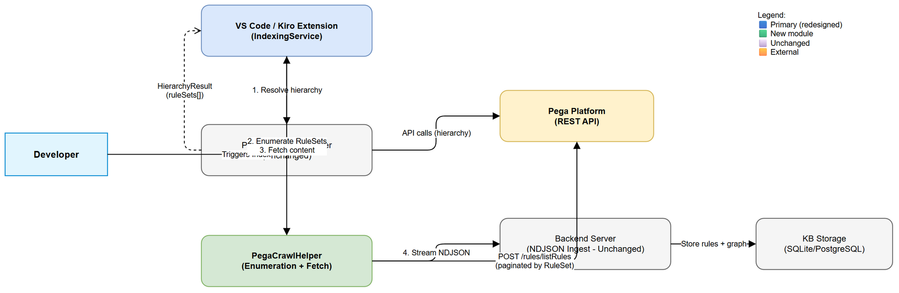
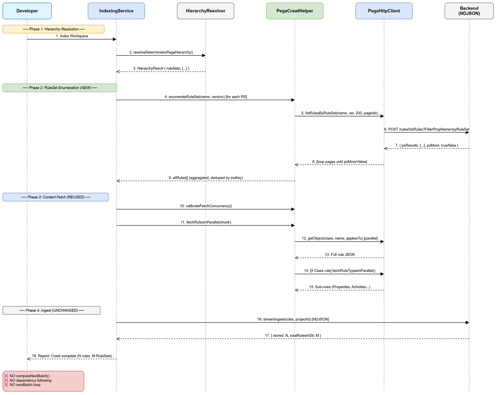
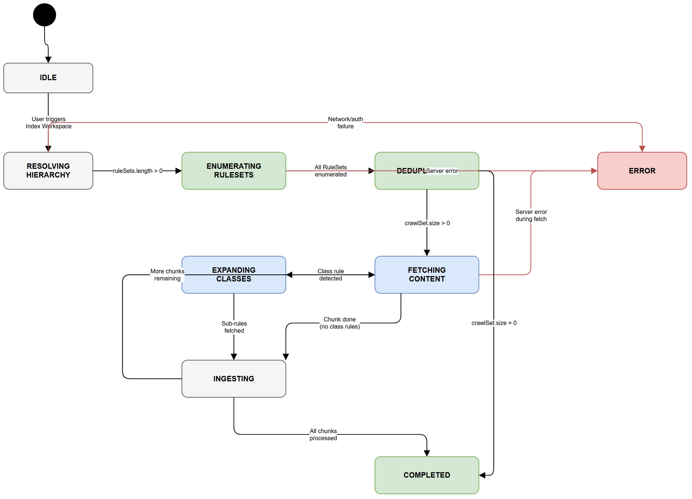

# Functional Specification Document (FSD)

## SDLC-Agents-4-Enterprise — SA4E-94: Redesign Pega Crawler: RuleSet-scoped enumeration

---

## Document Information

| Field | Value |
|-------|-------|
| Jira Ticket | SA4E-94 |
| Title | Redesign Pega Crawler: RuleSet-scoped enumeration instead of blind dependency crawl |
| Author | BA Agent |
| Version | 1.0 |
| Date | 2025-07-08 |
| Status | Draft |
| Related BRD | documents/SA4E-94/BRD.md |

---

## Revision History

| Version | Date | Author | Changes |
|---------|------|--------|---------|
| 1.0 | 2025-07-08 | BA Agent | Initial FSD — translated from BRD v1.0 |

---

## 1. Introduction

### 1.1 Purpose

This FSD specifies the functional behavior of the redesigned Pega Crawler.
The system replaces the blind dependency-graph crawl (follow-references) with a
deterministic RuleSet-scoped enumeration approach. The crawler will enumerate ALL
rules within the application's declared RuleSets, eliminating 404 errors from
platform rule fetches and ensuring complete, deterministic coverage.

### 1.2 Scope

Internal backend refactoring — no UI changes. Affected components:
- `IndexingService.ts` — main crawl loop (redesigned)
- `PegaCrawlHelper.ts` — new enumeration methods added
- `PegaHttpClient.ts` — new `listRulesByRuleSet()` method
- `PegaHierarchyResolver.ts` — unchanged (already provides RuleSets)
- `PegaCrawler.ts` (backend) — `computeNextBatch()` REMOVED

### 1.3 Definitions & Acronyms

| Term | Definition |
|------|------------|
| RuleSet | Pega versioning container grouping related rules (e.g., HRAppsV2:01-02) |
| insKey | Instance key — unique Pega rule identifier (e.g., `RULE-OBJ-CLASS TGB-HRAPPS-WORK-PAYROLLSETUP`) |
| Platform Rule | Rule in Pega's core RuleSets (Pega-RULES, Pega-ProcessCommander) — not app-scoped |
| Blind Dependency Crawl | OLD approach: follow references, adding discovered keys to queue regardless of scope |
| RuleSet Enumeration | NEW approach: query ALL rules belonging to a specific RuleSet before fetching content |
| HierarchyResult | Output of `PegaHierarchyResolver` — contains app name, merged RuleSets, seeds |
| NDJSON | Newline-delimited JSON — streaming ingest format for backend |
| Sub-rule Expansion | Fetching Properties/Activities/Flows for a discovered Class rule |

### 1.4 References

| Document | Location |
|----------|----------|
| BRD | documents/SA4E-94/BRD.md |
| Pega Implementation Guide | documents/pega-integration/PEGA_IMPLEMENTATION_GUIDE.md |
| SA4E Architecture | .code-intel/SA4E-ARCHITECTURE.md |
| SA4E-92 FSD (prerequisite) | documents/SA4E-92/FSD.md |

---

## 2. System Overview

### 2.1 System Context Diagram



The system involves four components interacting during the crawl:

1. **VS Code/Kiro Extension** — `IndexingService` orchestrates the RuleSet enumeration pipeline
2. **Pega Platform** — REST Services provide rule listings and content
3. **Backend Server** — NDJSON ingest, KB storage, graph construction (unchanged)
4. **PegaHierarchyResolver** — provides merged RuleSet list (unchanged, already implemented)

### 2.2 System Architecture — What Changes vs What Stays

| Component | Status | Description |
|-----------|--------|-------------|
| `PegaHierarchyResolver` | UNCHANGED | Already resolves App → RuleSets → merged list |
| `PegaHttpClient.listRulesByFilter()` | REUSED | Existing paginated filter query (Service 10) |
| `PegaHttpClient.listRulesByRuleSet()` | NEW | Convenience wrapper: enumerate ALL rules in a RuleSet |
| `IndexingService.indexPegaProject()` | REDESIGNED | Replace iterative crawl loop with enumeration-then-fetch |
| `PegaCrawlHelper.enumerateRuleSet()` | NEW | Paginate through a RuleSet until pxMore=false |
| `PegaCrawlHelper.fetchRulesInParallel()` | REUSED | Parallel content fetch with concurrency tuning |
| `PegaCrawlHelper.fetchRuleTypesInParallel()` | REUSED | Sub-rule expansion for Class rules |
| `PegaCrawler.computeNextBatch()` | REMOVED | Dependency extraction — no longer needed |
| `PegaStreamIngester` | UNCHANGED | NDJSON batch ingest to backend |
| Backend ingest route | UNCHANGED | Accepts whatever rules extension sends |

---

## 3. Functional Requirements

### 3.1 Use Cases

#### UC-01: RuleSet-Scoped Enumeration Crawl

**Use Case ID:** UC-01
**Actor:** Developer / AI Agent
**Preconditions:**
- Pega server reachable with valid credentials in SecretStorage
- `PegaHierarchyResolver` successfully resolved Application hierarchy
- `HierarchyResult.ruleSets` contains at least one RuleSet entry

**Postconditions:**
- All rules belonging to the application's declared RuleSets are fetched and ingested into KB
- Zero 404 errors for platform rules in the output log
- Crawl result is deterministic (same RuleSets → same indexed rules)

**Main Flow:**

| Step | Actor | System | Description |
|------|-------|--------|-------------|
| 1 | Developer | | Triggers "Index Workspace" command |
| 2 | | IndexingService | Detects pega-project.json, resolves hierarchy via PegaHierarchyResolver |
| 3 | | PegaHierarchyResolver | Returns HierarchyResult with merged `ruleSets[]` |
| 4 | | IndexingService | Extracts RuleSet list from HierarchyResult |
| 5 | | PegaCrawlHelper | For EACH RuleSet: calls `enumerateRuleSet(ruleSetName, ruleSetVersion)` |
| 6 | | PegaHttpClient | Paginates Service 10 (pageSize=200) until `pxMore=false` for each RuleSet |
| 7 | | IndexingService | Aggregates all enumerated rule keys → deduplicates by insKey |
| 8 | | IndexingService | Calibrates fetch concurrency (existing `calibrateFetchConcurrency()`) |
| 9 | | PegaCrawlHelper | Fetches full rule content in parallel chunks (`fetchRulesInParallel()`) |
| 10 | | PegaCrawlHelper | For Class rules: expands sub-rules (`fetchRuleTypesInParallel()`) |
| 11 | | PegaStreamIngester | Ingests all fetched rules via NDJSON stream to backend |
| 12 | | IndexingService | Reports summary: "Enumerated N rules from M RuleSets, ingested K" |

**Alternative Flows:**

| ID | Condition | Steps |
|----|-----------|-------|
| AF-01 | RuleSet enumeration returns 0 rules for one RuleSet | Log warning "RuleSet X returned 0 rules", continue with next RuleSet |
| AF-02 | Some rule content fetches fail (404 for enumerated rule) | Log as anomaly, skip rule, continue. Does NOT trigger further crawling |
| AF-03 | HierarchyResult.ruleSets is empty | Fall back to seed-based crawl (hierarchy seeds only — no enumeration) |
| AF-04 | Pagination returns duplicate rules across RuleSets | Deduplication via Set<insKey> ensures each rule processed once |
| AF-05 | Sub-rule expansion finds rules already in enumerated set | Skip (already in visitedKeys), no double-fetch |

**Exception Flows:**

| ID | Condition | Steps |
|----|-----------|-------|
| EF-01 | Pega server unreachable during enumeration | Abort entire crawl. Report "Pega server unreachable" |
| EF-02 | Authentication failure (401/403) | Abort. Report "Invalid credentials" |
| EF-03 | Service 10 `/rules/listRules` not deployed | Abort. Report "Service not available" |
| EF-04 | All RuleSet enumerations return server errors | Abort. Report "Cannot enumerate RuleSets" |

---

#### UC-02: Sub-rule Expansion for Enumerated Classes

**Use Case ID:** UC-02
**Actor:** System (automatic within UC-01)
**Preconditions:**
- UC-01 content fetch phase has retrieved a rule with `pxObjClass = Rule-Obj-Class`
- The class rule belongs to an enumerated RuleSet (already in scope)

**Postconditions:**
- All sub-rules (Properties, Activities, Flows, etc.) for the class are fetched
- Sub-rules are ingested alongside the class rule

**Main Flow:**

| Step | Actor | System | Description |
|------|-------|--------|-------------|
| 1 | | IndexingService | Detects fetched rule is a Class rule (pxObjClass = Rule-Obj-Class) |
| 2 | | PegaCrawlHelper | Calls `fetchRuleTypesInParallel(className)` for 9 rule types |
| 3 | | PegaHttpClient | Queries `getClassRules(className, ruleType)` for each type |
| 4 | | PegaCrawlHelper | Deduplicates against visitedKeys, returns new sub-rules |
| 5 | | IndexingService | Adds sub-rules to ingestion batch |

**Alternative Flows:**

| ID | Condition | Steps |
|----|-----------|-------|
| AF-06 | Class has no sub-rules for a given type | Return empty array for that type, continue |
| AF-07 | Sub-rule already in visitedKeys (found via enumeration) | Skip, no double-fetch |

---

### 3.2 Business Rules

| Rule ID | Rule | Source |
|---------|------|--------|
| BR-01 | Crawler MUST enumerate rules ONLY from RuleSets declared in HierarchyResult.ruleSets | BRD Story 1 |
| BR-02 | Enumeration MUST paginate with pageSize=200 until `pxMore === false` | BRD Story 1 AC4 |
| BR-03 | The union of all enumerated rules across all RuleSets is the complete crawl set — no rule outside this set shall be fetched | BRD Story 1 AC1 |
| BR-04 | Platform rules (Pega-RULES, Pega-ProcessCommander, etc.) MUST NOT be enumerated | BRD Story 4 |
| BR-05 | RuleSet scope is defined SOLELY by HierarchyResult.ruleSets — no heuristic filtering | BRD Story 4 AC3 |
| BR-06 | Dependency references found inside rules MUST NOT trigger additional crawling | BRD Story 2 |
| BR-07 | Sub-rule expansion is permitted ONLY for Class rules already in the enumerated set | BRD Story 3 |
| BR-08 | A genuine 404 for an enumerated rule is logged as anomaly, does NOT trigger cascading crawl | BRD Story 2 AC3 |
| BR-09 | Deduplication by insKey — each rule fetched at most once regardless of how many RuleSets reference it | BRD Story 3 |
| BR-10 | The `computeNextBatch()` method in PegaCrawler MUST be removed (no dependency extraction) | BRD target state |
| BR-11 | Crawl result MUST be deterministic: same RuleSets → identical indexed rule set | BRD NFR |
| BR-12 | Concurrency tuning (`calibrateFetchConcurrency`) MUST remain active for content fetch phase | BRD Story 5 |
| BR-13 | RuleSet enumeration query MUST use FilterPropName=`pyRuleSet` and FilterPropValue=`{RuleSetName}` | BRD dependency |
| BR-14 | Backend NDJSON ingest pipeline requires NO changes — accepts whatever rules extension sends | BRD assumption |
| BR-15 | Total API calls = (RuleSet enumeration pagination calls) + (content fetch calls) — zero wasted 404s | BRD Story 5 |

---

## 4. Sequence Diagram — RuleSet Enumeration Flow



The sequence diagram shows the redesigned crawl flow:

1. **Hierarchy Phase** (Steps 1-3): Resolve Application → Access Group → RuleSets (already implemented)
2. **Enumeration Phase** (Steps 4-8): For each RuleSet, paginate to discover ALL rules
3. **Content Fetch Phase** (Steps 9-14): Fetch full rule JSON in parallel, expand class sub-rules
4. **Ingest Phase** (Steps 15-17): Stream all rules to backend via NDJSON

---

## 5. State Diagram — Crawler Lifecycle



### State Transitions

| From State | To State | Trigger | Guard |
|------------|----------|---------|-------|
| IDLE | RESOLVING_HIERARCHY | User triggers Index Workspace | Pega credentials available |
| RESOLVING_HIERARCHY | ENUMERATING | Hierarchy resolved | ruleSets.length > 0 |
| RESOLVING_HIERARCHY | ERROR | Network/auth failure | — |
| ENUMERATING | DEDUPLICATING | All RuleSets enumerated | All paginations complete |
| ENUMERATING | ERROR | Server error during enumeration | — |
| DEDUPLICATING | FETCHING_CONTENT | Unique rule set computed | crawlSet.size > 0 |
| DEDUPLICATING | COMPLETED | No rules to fetch | crawlSet.size === 0 |
| FETCHING_CONTENT | EXPANDING_CLASSES | Chunk fetched, class rules detected | isClassRule === true |
| FETCHING_CONTENT | INGESTING | Chunk complete, no class rules | — |
| EXPANDING_CLASSES | INGESTING | Sub-rules fetched | — |
| INGESTING | FETCHING_CONTENT | More chunks to process | remaining > 0 |
| INGESTING | COMPLETED | All chunks processed | remaining === 0 |
| ERROR | (end) | Fatal error | — |
| COMPLETED | (end) | — | — |

---

## 6. API Specifications

### 6.1 PegaHttpClient — New Method

#### Method: `listRulesByRuleSet(ruleSetName: string, ruleSetVersion: string, pageSize?: number, pageIndex?: number)`

**Purpose:** Enumerate ALL rules belonging to a specific RuleSet via Service 10
**Endpoint:** `POST /rules/listRules`
**Implementation:** Wraps existing `listRulesByFilter()` with RuleSet-specific parameters

**Input Parameters:**

| Parameter | Type | Required | Default | Description |
|-----------|------|----------|---------|-------------|
| ruleSetName | string | Yes | — | RuleSet name (e.g., `HRAppsV2`) |
| ruleSetVersion | string | Yes | — | RuleSet version (e.g., `01-02`) |
| pageSize | number | No | 200 | Records per page (BR-02) |
| pageIndex | number | No | 1 | Page number (1-based) |

**Output:**

```typescript
interface ListRulesByRuleSetResponse {
  pxResults: RuleSetRuleSummary[];  // Array of rules in this RuleSet
  pxMore: boolean;                   // True if more pages available
  totalCount?: number;               // Total matching records
}

interface RuleSetRuleSummary {
  pzInsKey: string;        // Unique instance key
  pxObjClass: string;      // Rule class (Rule-Obj-Class, Rule-Obj-Activity, etc.)
  pyClassName: string;     // Class this rule applies to
  pyRuleName: string;      // Rule name
  pyRuleSet: string;       // RuleSet name (should match query)
  pyRuleSetVersion: string; // RuleSet version
  pyLabel?: string;        // Display label
}
```

**Underlying API Call:**

```
POST /rules/listRules?ObjClass=Rule-Obj-&FilterPropName=pyRuleSet&FilterPropValue={ruleSetName}&PageSize=200&PageIndex=1
```

**Note:** The `ObjClass` parameter requires iteration over known rule types OR a wildcard class. Implementation will use multiple calls per rule type if the API does not support wildcard enumeration. See BR-13.

**Business Error Scenarios:**

| Scenario | User Message | Trigger Condition |
|----------|-------------|-------------------|
| Server unreachable | "Cannot connect to Pega server" | Network timeout / DNS failure |
| Auth failure | "Invalid Pega credentials" | HTTP 401/403 |
| RuleSet not found | "RuleSet {name} returned 0 rules" (warning) | Empty pxResults on first page |
| Service not deployed | "Service `/rules/listRules` not available" | HTTP 404 on endpoint itself |

---

### 6.2 PegaCrawlHelper — New Method

#### Method: `enumerateRuleSet(ruleSetName: string, ruleSetVersion: string, pegaClient: PegaHttpClient, log: LogFn): Promise<RuleSetRuleSummary[]>`

**Purpose:** Enumerate ALL rules in a RuleSet by paginating until exhausted
**Algorithm:**

```
function enumerateRuleSet(ruleSetName, ruleSetVersion, pegaClient, log):
    allRules = []
    pageIndex = 1
    loop:
        response = pegaClient.listRulesByRuleSet(ruleSetName, ruleSetVersion, 200, pageIndex)
        allRules.push(...response.pxResults)
        log("Enumerating RuleSet {ruleSetName}: page {pageIndex}, found {response.pxResults.length} rules")
        if response.pxMore === false:
            break
        pageIndex++
    log("RuleSet {ruleSetName}: total {allRules.length} rules enumerated")
    return allRules
```

**Concurrency:** RuleSet enumerations MAY run in parallel (one per RuleSet) since they are independent queries.

---

### 6.3 IndexingService — Redesigned Crawl Loop

#### Method: `indexPegaProject()` — Redesigned Flow

**Before (OLD — will be removed):**
```
seeds → crawlPlan() → fetchRulesInParallel() → computeNextBatch() → loop until empty
```

**After (NEW — RuleSet enumeration):**
```
hierarchy.ruleSets → enumerateAllRuleSets() → dedup → fetchRulesInParallel() → sub-rule expand → ingest
```

**Pseudocode:**

```
async indexPegaProject():
    // Phase 1: Hierarchy resolution (UNCHANGED)
    hierarchy = await pegaClient.resolveDeterministicPegaHierarchy(operatorId)

    // Phase 2: RuleSet enumeration (NEW)
    allEnumeratedRules = new Map<string, RuleSetRuleSummary>()  // dedup by insKey
    for each ruleSetEntry in hierarchy.ruleSets:
        [ruleSetName, ruleSetVersion] = parseRuleSetEntry(ruleSetEntry)  // "HRAppsV2:01-02" → ["HRAppsV2", "01-02"]
        rules = await enumerateRuleSet(ruleSetName, ruleSetVersion, pegaClient, log)
        for each rule in rules:
            allEnumeratedRules.set(rule.pzInsKey, rule)

    log("Enumeration complete: {allEnumeratedRules.size} unique rules from {hierarchy.ruleSets.length} RuleSets")

    // Phase 3: Content fetch (REUSED — parallel chunked fetch)
    crawlSet = Array.from(allEnumeratedRules.values())
    await calibrateFetchConcurrency(pegaClient, crawlSet.length, log)

    visitedKeys = new Set<string>()
    for chunk in splitIntoChunks(crawlSet, 50):
        fetchResult = await fetchRulesInParallel(chunk, pegaClient, log)
        if fetchResult.serverError: throw Error(fetchResult.serverError)

        // Sub-rule expansion for Class rules (REUSED)
        for each {ruleObj, item} in fetchResult.fetched:
            visitedKeys.add(item.insKey)
            if isClassRule(ruleObj):
                subRules = await fetchRuleTypesInParallel(className, pegaClient, visitedKeys, log)
                // add to ingest batch

        // Phase 4: NDJSON ingest (UNCHANGED)
        await streamIngester.streamIngest(fetchedRules, projectId, ...)

    // NO nextBatch loop — enumeration is the complete set
    log("Crawl finished. Deterministic: {visitedKeys.size} rules indexed")
```

---

## 7. Data Model

### 7.1 RuleSet Entry Format (from HierarchyResult)

The `HierarchyResult.ruleSets` array contains strings in format `{RuleSetName}:{MajorVersion}-{MinorVersion}`:
- `"HRAppsV2:01-02"` → name=`HRAppsV2`, version=`01-02`
- `"HRAppsV2Int:01-01"` → name=`HRAppsV2Int`, version=`01-01`

Parser function:
```typescript
function parseRuleSetEntry(entry: string): [string, string] {
  const colonIdx = entry.lastIndexOf(':');
  if (colonIdx < 0) return [entry, ''];
  return [entry.substring(0, colonIdx), entry.substring(colonIdx + 1)];
}
```

### 7.2 Enumerated Rule Summary (from Service 10)

Each enumerated rule from the Pega API provides a summary (not full content):

| Field | Type | Description |
|-------|------|-------------|
| pzInsKey | string | Unique instance key — used for deduplication and content fetch |
| pxObjClass | string | Rule type (Rule-Obj-Class, Rule-Obj-Activity, Rule-Obj-Flow, etc.) |
| pyClassName | string | Class this rule applies to |
| pyRuleName | string | Rule name |
| pyRuleSet | string | RuleSet name this rule belongs to |
| pyRuleSetVersion | string | RuleSet version |
| pyLabel | string? | Optional display label |

### 7.3 Crawl Result (unchanged format)

The output fed to the backend ingest remains unchanged:
- Full rule JSON objects (fetched via `getObject()` / `getRuleByInsKey()`)
- Streamed as NDJSON to `POST /pega/ingest-stream`
- Backend parses, generates KB entries, builds graph — no changes needed

---

## 8. Processing Logic

### 8.1 Complete Crawl Pipeline

**Trigger:** User selects "Index Workspace" → Pega project detected
**Schedule:** On-demand only

**Processing Steps:**

| Step | Phase | Description | Error Handling |
|------|-------|-------------|----------------|
| 1 | Setup | Read pega-project.json, extract appName/operatorId | Abort if not Pega project |
| 2 | Hierarchy | Call `resolveDeterministicPegaHierarchy()` | Abort on network/auth error |
| 3 | Hierarchy | Extract `hierarchy.ruleSets` array | If empty → AF-03 fallback |
| 4 | Enumeration | Parse each RuleSet entry ("Name:Version") | Skip unparseable entries |
| 5 | Enumeration | For each RuleSet: paginate listRulesByRuleSet() | Skip RuleSet on error, continue others |
| 6 | Enumeration | Aggregate into Map<insKey, RuleSummary> (dedup) | No error possible (in-memory) |
| 7 | Enumeration | Log: "Enumerated N unique rules from M RuleSets" | — |
| 8 | Fetch | Calibrate concurrency (measure latency) | Use default=10 on failure |
| 9 | Fetch | Split crawl set into chunks of 50 | — |
| 10 | Fetch | For each chunk: fetchRulesInParallel() | Abort on server error; skip 404s |
| 11 | Fetch | For Class rules: fetchRuleTypesInParallel() | Skip on error, continue |
| 12 | Fetch | Save rule files to disk (saveRuleFile()) | Log I/O error, continue |
| 13 | Ingest | Stream NDJSON to backend | Log error, finish crawl |
| 14 | Done | Report: "Crawl complete: N rules from M RuleSets" | — |

### 8.2 Removed Logic (from current implementation)

The following logic is REMOVED in this redesign:

| Removed Component | Location | Reason |
|-------------------|----------|--------|
| `computeNextBatch()` | `PegaCrawler.ts` | Dependency extraction generates platform rule refs → 404s |
| `extractRuleReferences()` | `PegaCrawler.ts` | No longer following references |
| Iterative crawl loop | `IndexingService.ts` | Replaced by single-pass enumeration + fetch |
| `crawlPlan()` backend call | `IndexingService.ts` | No longer computing "missing" via backend |
| `nextBatch` from stream response | `PegaStreamIngester` | Backend no longer returns next rules to crawl |

### 8.3 Kept Logic (reused as-is)

| Kept Component | Location | Reason |
|----------------|----------|--------|
| `resolveDeterministicPegaHierarchy()` | PegaHttpClient.ts | Provides RuleSet list — input to new flow |
| `fetchRulesInParallel()` | PegaCrawlHelper.ts | Content fetch — still needed |
| `fetchRuleTypesInParallel()` | PegaCrawlHelper.ts | Sub-rule expansion — still needed |
| `calibrateFetchConcurrency()` | PegaCrawlHelper.ts | Latency-based tuning — still needed |
| `saveRuleFile()` | PegaCrawlHelper.ts | Disk persistence — still needed |
| `PegaStreamIngester.streamIngest()` | PegaStreamIngester.ts | NDJSON ingest — unchanged |
| Backend ingest route | pega-stream.ts | Accepts rules — no changes |

---

## 9. Error Handling (User-Facing)

### 9.1 Error Scenarios

| Scenario | Severity | User Message | Expected Behavior |
|----------|----------|-------------|-------------------|
| Pega server unreachable | Critical | "Cannot connect to Pega server. Check network." | Abort entire crawl |
| Invalid credentials (401/403) | Critical | "Pega authentication failed." | Abort |
| Service 10 not deployed | Critical | "Service `/rules/listRules` not available." | Abort |
| RuleSet enumeration returns 0 total rules | Warning | "No rules found in application RuleSets." | Complete with 0 results |
| Single RuleSet returns 0 rules | Info | Logged: "RuleSet {name} returned 0 rules" | Skip, continue others |
| Enumerated rule genuinely 404 | Warning | Logged: "Anomaly: enumerated rule {insKey} not found" | Skip, continue |
| Server error during content fetch | Critical | "Pega server error during fetch. Aborting." | Abort remaining fetches |
| Sub-rule expansion fails for a class | Info | Logged: "Cannot expand class {name}" | Skip, continue |

### 9.2 Progress Reporting

| Phase | Progress Message | Duration Estimate |
|-------|-----------------|-------------------|
| Hierarchy | "Resolving Pega hierarchy..." | 5-10s |
| Enumeration | "Enumerating RuleSet {name} (page {N})..." | 10-30s per RuleSet |
| Dedup | "Deduplicating: {N} unique rules from {M} RuleSets" | <1s |
| Fetch | "Fetching rule content ({current}/{total})..." | 1-5min |
| Ingest | "Ingesting {N} rules to KB..." | 10-30s |
| Complete | "Crawl complete: {N} rules from {M} RuleSets indexed" | — |

---

## 10. Non-Functional Requirements

| Category | Business Requirement | Acceptance Criteria |
|----------|---------------------|---------------------|
| Performance | Crawl time ≤ current approach | Eliminating 404 calls nets reduced total time; target ≤90% of old crawl time |
| Performance | Enumeration completes in <60s | For typical app with 5-10 RuleSets |
| Determinism | Identical results across runs | Same RuleSet versions = identical indexed rule set |
| Reliability | Zero spurious 404 errors | No platform rule fetch attempts; only genuine errors logged |
| Scalability | Handle large RuleSets (1000+ rules) | Pagination (200/page) + parallel fetch handles volume |
| Observability | Clear progress reporting | Log "Enumerating RuleSet X: found N rules" per RuleSet |
| Backward Compat | No regression in rule coverage | All rules from old crawl ⊆ rules from new enumeration |
| API Efficiency | Total calls = enum + content fetch | Zero wasted calls; measurable via call count logging |

---

## 11. Integration Specifications

### 11.1 External System: Pega Platform (REST Services)

| Attribute | Value |
|-----------|-------|
| Purpose | Source of truth for application rules |
| Direction | Inbound (extension reads from Pega) |
| Data Format | JSON |
| Frequency | On-demand (user-triggered) |
| Authentication | Basic Auth (from SecretStorage) |

**Service 10 — `/rules/listRules` (RuleSet Enumeration):**

| Our Parameter | Pega Parameter | Direction | Business Rule |
|---------------|---------------|-----------|---------------|
| (no ObjClass filter) | — | — | Enumerate ALL rule types in RuleSet |
| filterPropName | FilterPropName | Send | Always `pyRuleSet` (BR-13) |
| filterPropValue | FilterPropValue | Send | RuleSet name from HierarchyResult (BR-01) |
| pageSize | PageSize | Send | 200 (BR-02) |
| pageIndex | PageIndex | Send | Incremented per page until pxMore=false |

**Service 2 — `/rules/query` (Content Fetch — unchanged):**

| Our Parameter | Pega Parameter | Direction | Business Rule |
|---------------|---------------|-----------|---------------|
| pxObjClass | RequestClass | Send | From enumerated rule summary |
| appliesTo | RequestAppliesTo | Send | pyClassName from summary |
| pyRuleName | RequestRuleName | Send | pyRuleName from summary |

### 11.2 Internal System: Backend NDJSON Ingest (Unchanged)

| Attribute | Value |
|-----------|-------|
| Purpose | Store rules in KB, build graph relationships |
| Direction | Outbound (extension sends to backend) |
| Data Format | NDJSON (newline-delimited JSON) |
| Frequency | After each chunk of rules is fetched |
| Endpoint | POST /pega/ingest-stream |
| Change | NONE — backend accepts whatever rules extension sends |

---

## 12. Security Requirements

### 12.1 Authentication & Authorization

| Role | Permissions | Features |
|------|-------------|----------|
| Developer (Pega Operator) | Read access to rules in declared RuleSets | RuleSet enumeration + content fetch |
| System | Service account with app-scoped access | Same as developer |

### 12.2 Data Sensitivity

| Data Type | Classification | Business Requirement |
|-----------|---------------|---------------------|
| Pega credentials | Confidential | Stored in VS Code SecretStorage only. Never logged. |
| Rule content (in memory) | Internal | Persisted to disk + KB. No PII expected in rule definitions. |
| RuleSet names | Internal | Logged for progress reporting |

---

## 13. Testing Considerations

### 13.1 Key Test Scenarios

| ID | Scenario | Input | Expected Output | Priority |
|----|----------|-------|-----------------|----------|
| TC-01 | Happy path: enumerate + fetch | App with 3 RuleSets, 100 rules total | All 100 rules indexed, 0 errors | High |
| TC-02 | Pagination: RuleSet with 500 rules | pageSize=200, 3 pages needed | All 500 discovered via pagination | High |
| TC-03 | Zero platform rules fetched | Rule refs @baseclass, Work-* | 0 API calls to platform rules | High |
| TC-04 | Determinism: two identical runs | Same app, same RuleSets | Identical indexed rule set both times | High |
| TC-05 | Deduplication across RuleSets | Same rule in 2 RuleSets | Fetched once only | Medium |
| TC-06 | Genuine 404 for enumerated rule | Rule deleted between enum and fetch | Warning logged, no cascading crawl | High |
| TC-07 | Empty RuleSet | RuleSet with 0 rules | Warning logged, other RuleSets still processed | Medium |
| TC-08 | Server unreachable during enum | Network failure | Abort with clear message | High |
| TC-09 | Sub-rule expansion | Class rule in scope | Properties/Activities fetched | High |
| TC-10 | Coverage comparison | Same app, old vs new crawler | new.ruleCount >= old.ruleCount | High |
| TC-11 | No computeNextBatch dependency following | Rule references external class | External class NOT fetched | High |
| TC-12 | Concurrency tuning active | Large rule set (500+) | calibrateFetchConcurrency called, logged | Medium |

---

## 14. Appendix

### Diagram Index

| # | Diagram | Image | Source (editable) |
|---|---------|-------|-------------------|
| 1 | System Context Diagram | [system-context.png](diagrams/system-context.png) | [system-context.drawio](diagrams/system-context.drawio) |
| 2 | Sequence Diagram — Enumeration Flow | [sequence-enumeration.png](diagrams/sequence-enumeration.png) | [sequence-enumeration.drawio](diagrams/sequence-enumeration.drawio) |
| 3 | State Diagram — Crawler Lifecycle | [state-crawler.png](diagrams/state-crawler.png) | [state-crawler.drawio](diagrams/state-crawler.drawio) |

### Change Log from BRD

- **Specified** `listRulesByRuleSet()` as a new wrapper method around existing `listRulesByFilter()`
- **Clarified** the RuleSet entry parsing format (`Name:Version` → split at last colon)
- **Added** UC-02 for sub-rule expansion behavior (implied in BRD Story 3 but not explicit)
- **Specified** state diagram showing enumeration lifecycle (not in BRD)
- **Detailed** what is removed vs kept from current implementation
- **Added** fallback flow (AF-03) when HierarchyResult has empty RuleSet list
- **Clarified** that backend `computeNextBatch()` and dependency extraction are fully removed
- **Specified** `enumerateRuleSet()` algorithm with pagination loop
