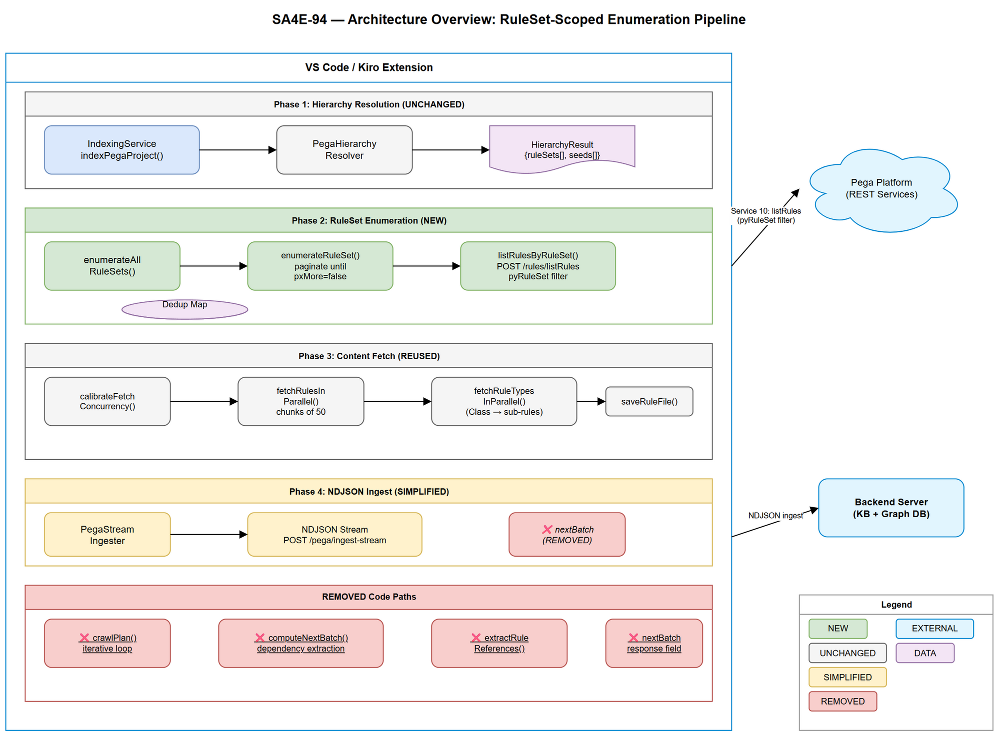
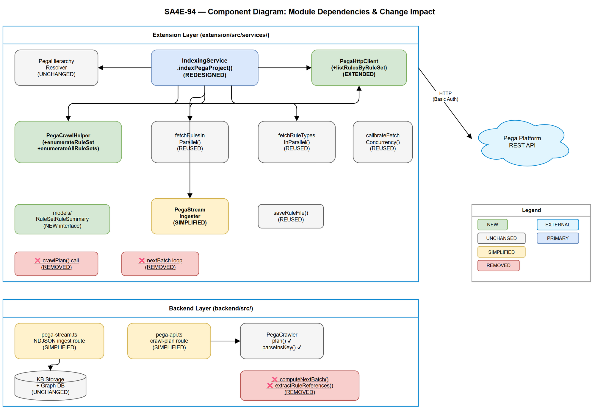

# Technical Design Document (TDD)

## SDLC-Agents-4-Enterprise — SA4E-94: Redesign Pega Crawler

---

## Document Information

| Field | Value |
|-------|-------|
| Jira Ticket | SA4E-94 |
| Title | Redesign Pega Crawler: RuleSet-scoped enumeration instead of blind dependency crawl |
| Author | SA Agent |
| Version | 1.0 |
| Date | 2025-07-08 |
| Status | Draft |
| Related BRD | documents/SA4E-94/BRD.md |
| Related FSD | documents/SA4E-94/FSD.md |

---

## Revision History

| Version | Date | Author | Changes |
|---------|------|--------|---------|
| 1.0 | 2025-07-08 | SA Agent | Initial TDD — architecture for RuleSet enumeration redesign |

---

## 1. Architecture Overview

### 1.1 Design Philosophy

Replace the iterative **blind dependency crawl** (follow-references → computeNextBatch → loop) with a deterministic **enumerate-then-fetch** pipeline. The crawler discovers ALL rules upfront via RuleSet-scoped enumeration, then fetches content in a single pass — eliminating 404 errors for platform rules and ensuring deterministic coverage.

### 1.2 High-Level Architecture



The redesigned pipeline has 4 sequential phases:

1. **Hierarchy Resolution** (unchanged) — Operator → Access Group → App Rule → merged RuleSets
2. **RuleSet Enumeration** (NEW) — Paginate Service 10 per RuleSet to discover ALL rules
3. **Content Fetch** (reused) — Parallel chunked fetch with concurrency tuning
4. **NDJSON Ingest** (simplified) — Stream to backend, no `nextBatch` loop

### 1.3 Component Status Matrix

| Component | Location | Status | Change Description |
|-----------|----------|--------|-------------------|
| `PegaHierarchyResolver` | extension/src/services/ | UNCHANGED | Provides `HierarchyResult.ruleSets` |
| `PegaHttpClient.listRulesByFilter()` | extension/src/services/ | REUSED | Existing paginated query |
| `PegaHttpClient.listRulesByRuleSet()` | extension/src/services/ | **NEW** | Convenience wrapper for RuleSet enum |
| `PegaCrawlHelper.enumerateRuleSet()` | extension/src/services/ | **NEW** | Paginate until pxMore=false |
| `PegaCrawlHelper.enumerateAllRuleSets()` | extension/src/services/ | **NEW** | Parallel enum across RuleSets |
| `IndexingService.indexPegaProject()` | extension/src/services/ | **REDESIGNED** | Replace crawl loop with enum-then-fetch |
| `PegaCrawlHelper.fetchRulesInParallel()` | extension/src/services/ | REUSED | Content fetch (unchanged) |
| `PegaCrawlHelper.fetchRuleTypesInParallel()` | extension/src/services/ | REUSED | Sub-rule expansion (unchanged) |
| `PegaCrawlHelper.calibrateFetchConcurrency()` | extension/src/services/ | REUSED | Latency-based tuning (unchanged) |
| `PegaCrawlHelper.saveRuleFile()` | extension/src/services/ | REUSED | Disk persistence (unchanged) |
| `PegaStreamIngester` | extension/src/services/ | **SIMPLIFIED** | Remove `nextBatch` consumption |
| `PegaCrawler.computeNextBatch()` | backend/src/modules/pega/ | **REMOVED** | Dependency extraction eliminated |
| `PegaCrawler.extractRuleReferences()` | backend/src/modules/pega/ | **REMOVED** | No longer following references |
| `pega-stream.ts` (nextBatch) | backend/src/server/routes/ | **SIMPLIFIED** | Remove nextBatch computation |
| `pega-api.ts` (nextBatch) | backend/src/server/routes/ | **SIMPLIFIED** | Remove nextBatch from response |

---

## 2. Module Design

### 2.1 Component Diagram



### 2.2 New Module: `PegaHttpClient.listRulesByRuleSet()`

**File:** `extension/src/services/PegaHttpClient.ts`
**Pattern:** Facade — wraps existing `listRulesByFilter()` with RuleSet-specific semantics

```typescript
/**
 * Enumerate ALL rules belonging to a specific RuleSet via Service 10.
 * Wraps listRulesByFilter() with pyRuleSet filter (BR-13).
 * @param ruleSetName - RuleSet name (e.g., "HRAppsV2")
 * @param ruleSetVersion - RuleSet version (e.g., "01-02")
 * @param pageSize - Records per page (default 200, BR-02)
 * @param pageIndex - 1-based page number
 * @returns Paginated response with rule summaries and pxMore flag
 */
public async listRulesByRuleSet(
  ruleSetName: string,
  ruleSetVersion: string,
  pageSize = 200,
  pageIndex = 1,
): Promise<{ pxResults: RuleSetRuleSummary[]; pxMore: boolean; totalCount?: number }>
```

**Implementation Strategy:**

The Pega `listRules` API requires an `ObjClass` parameter. Since we need ALL rule types in a RuleSet, we query with a broad `Rule-` prefix or iterate known top-level rule classes. The implementation delegates to `listRulesByFilter()`:

```typescript
// Actual call: POST /rules/listRules?ObjClass=Rule-&FilterPropName=pyRuleSet&FilterPropValue={name}&PageSize=200&PageIndex=1
return this.listRulesByFilter("Rule-", "pyRuleSet", ruleSetName, pageSize, pageIndex);
```

**Interface — `RuleSetRuleSummary`:**

```typescript
export interface RuleSetRuleSummary {
  pzInsKey: string;        // Unique instance key — dedup key
  pxObjClass: string;      // Rule type (Rule-Obj-Class, Rule-Obj-Activity, etc.)
  pyClassName: string;     // Class this rule applies to
  pyRuleName: string;      // Rule name
  pyRuleSet: string;       // RuleSet name (matches query)
  pyRuleSetVersion: string; // RuleSet version
  pyLabel?: string;        // Optional display label
}
```

### 2.3 New Module: `PegaCrawlHelper.enumerateRuleSet()`

**File:** `extension/src/services/PegaCrawlHelper.ts`
**Pattern:** Iterator — paginate until exhausted

```typescript
/**
 * Enumerate ALL rules in a single RuleSet by paginating until pxMore=false.
 * Each page returns up to 200 rules (BR-02). Logs progress per page.
 * @param ruleSetName - RuleSet name from HierarchyResult
 * @param ruleSetVersion - RuleSet version from HierarchyResult
 * @param pegaClient - HTTP client for Pega API calls
 * @param log - Logging function for progress reporting
 * @returns Complete array of rule summaries for this RuleSet
 */
export async function enumerateRuleSet(
  ruleSetName: string,
  ruleSetVersion: string,
  pegaClient: PegaHttpClient,
  log: LogFn,
): Promise<RuleSetRuleSummary[]>
```

**Algorithm:**

```
allRules = []
pageIndex = 1
loop:
    response = pegaClient.listRulesByRuleSet(ruleSetName, ruleSetVersion, 200, pageIndex)
    allRules.push(...response.pxResults)
    log("Enumerating RuleSet {name}: page {pageIndex}, found {len} rules")
    if response.pxMore === false: break
    pageIndex++
return allRules
```

### 2.4 New Module: `PegaCrawlHelper.enumerateAllRuleSets()`

**File:** `extension/src/services/PegaCrawlHelper.ts`
**Pattern:** Fan-out — parallel enumeration of independent RuleSets

```typescript
/**
 * Enumerate ALL rules across multiple RuleSets in parallel.
 * Each RuleSet is enumerated independently. Results are deduplicated by pzInsKey.
 * @param ruleSets - Array of RuleSet entries from HierarchyResult (format: "Name:Version")
 * @param pegaClient - HTTP client
 * @param log - Logger
 * @returns Deduplicated Map<insKey, RuleSetRuleSummary>
 */
export async function enumerateAllRuleSets(
  ruleSets: string[],
  pegaClient: PegaHttpClient,
  log: LogFn,
): Promise<Map<string, RuleSetRuleSummary>>
```

**Implementation Notes:**

- Parse each entry at last colon: `"HRAppsV2:01-02"` → `["HRAppsV2", "01-02"]`
- Run enumerations in parallel (`Promise.all`) — RuleSets are independent queries
- Deduplicate into `Map<pzInsKey, RuleSetRuleSummary>` — same rule in 2 RuleSets counted once (BR-09)
- Log warning for RuleSets returning 0 rules (AF-01)

### 2.5 Redesigned: `IndexingService.indexPegaProject()`

**File:** `extension/src/services/IndexingService.ts`
**Change:** Replace the iterative `while (currentQueue.length > 0)` crawl loop with a linear enumeration pipeline.

**Current flow (REMOVED):**

```
seeds → crawlPlan() → fetchRulesInParallel() → streamIngest() → nextBatch → loop
```

**New flow (REPLACEMENT):**

```
hierarchy.ruleSets → enumerateAllRuleSets() → dedup → calibrate → fetchChunks → expand → ingest
```

**Key structural changes to `indexPegaProject()`:**

1. **Remove** lines 195-302: The `while (currentQueue.length > 0)` loop, `crawlPlan()` call, `nextBatch` handling
2. **Remove** local checksum scanning (lines 180-194): No longer needed since we enumerate, not diff
3. **Add** Phase 2: Call `enumerateAllRuleSets(hierarchy.ruleSets, pegaClient, log)`
4. **Add** Phase 3: Split enumerated rules into chunks of 50, fetch with `fetchRulesInParallel()`
5. **Simplify** Phase 4: Call `streamIngest()` without processing `nextBatch` response

### 2.6 Simplified: `PegaStreamIngester`

**File:** `extension/src/services/PegaStreamIngester.ts`

**Change:** The `StreamIngestResult.nextBatch` field is no longer consumed. The extension ignores any `nextBatch` data returned by the backend (backward-compatible: backend may still return it until removed).

```typescript
// BEFORE: currentQueue = streamRes.nextBatch.map(k => k.insKey)
// AFTER: (deleted — no nextBatch loop)
```

### 2.7 Removed: Backend `PegaCrawler.computeNextBatch()`

**File:** `backend/src/modules/pega/PegaCrawler.ts`

**Remove:** The entire `computeNextBatch()` method (lines 73-101) and `extractRuleReferences()` (lines 112-220). These methods extract dependency references from ingested rules and compute a next batch of rules to crawl — this is the core of the blind dependency crawl being eliminated.

**Retain:** `PegaCrawler.plan()` and `parseInsKey()` — still used for crawlPlan endpoint (backward compat during migration).

### 2.8 Simplified: Backend Routes

**File:** `backend/src/server/routes/pega-stream.ts` (line 137)

```typescript
// BEFORE:
nextBatch = crawler.computeNextBatch(ingestedRules, visitedKeys, meta?.projectId || '');

// AFTER:
// nextBatch computation removed — return empty array for backward compatibility
const nextBatch: PegaCrawlKey[] = [];
```

**File:** `backend/src/server/routes/pega-api.ts` (line 245)

```typescript
// BEFORE:
const nextBatch = crawler.computeNextBatch(body.rules, visitedKeys, body.projectId);

// AFTER:
const nextBatch: PegaCrawlKey[] = [];
```

---

## 3. API Design

### 3.1 New Extension Method — `listRulesByRuleSet`

| Attribute | Value |
|-----------|-------|
| Layer | Extension (PegaHttpClient) |
| HTTP Method | POST |
| Pega Endpoint | `/rules/listRules` |
| Query Params | `ObjClass=Rule-&FilterPropName=pyRuleSet&FilterPropValue={name}&PageSize=200&PageIndex={n}` |
| Response | `{ pxResults: RuleSetRuleSummary[], pxMore: boolean, totalCount?: number }` |

### 3.2 Backend Response Change — `pega-stream.ts`

| Before | After |
|--------|-------|
| `{ stored, totalRulesInDb, ..., nextBatch: PegaCrawlKey[] }` | `{ stored, totalRulesInDb, ..., nextBatch: [] }` |

The response shape is preserved for backward compatibility. `nextBatch` is always empty. In a future cleanup ticket, the field can be removed from the interface.

### 3.3 Removed Backend Computation

| Endpoint | Change |
|----------|--------|
| `POST /pega/ingest-stream` | No longer calls `computeNextBatch()` — returns empty `nextBatch` |
| `POST /pega/ingest` | No longer calls `computeNextBatch()` — returns empty `nextBatch` |
| `POST /pega/crawl-plan` | Still operational (backward compat) but not called by redesigned flow |

---

## 4. Data Flow & Sequence

### 4.1 Redesigned Crawl Sequence

```
┌─────────────────────────────────────────────────────────────────────────────────┐
│                     PHASE 1: Hierarchy Resolution (UNCHANGED)                     │
├─────────────────────────────────────────────────────────────────────────────────┤
│ IndexingService → PegaHttpClient.resolveDeterministicPegaHierarchy(operatorId)   │
│ Output: HierarchyResult { seeds[], ruleSets["HRAppsV2:01-02", ...], ... }       │
└─────────────────────────────────────────────────────────────────────────────────┘
                                        │
                                        ▼
┌─────────────────────────────────────────────────────────────────────────────────┐
│                     PHASE 2: RuleSet Enumeration (NEW)                            │
├─────────────────────────────────────────────────────────────────────────────────┤
│ For EACH ruleSet in hierarchy.ruleSets (PARALLEL):                               │
│   PegaCrawlHelper.enumerateRuleSet(name, version, client)                        │
│     → PegaHttpClient.listRulesByRuleSet(name, version, 200, pageIndex)           │
│     → Paginate until pxMore === false                                            │
│ Aggregate: Map<insKey, RuleSetRuleSummary> (deduplicated)                        │
│ Output: crawlSet[] — complete list of rules to fetch                             │
└─────────────────────────────────────────────────────────────────────────────────┘
                                        │
                                        ▼
┌─────────────────────────────────────────────────────────────────────────────────┐
│                     PHASE 3: Content Fetch (REUSED)                               │
├─────────────────────────────────────────────────────────────────────────────────┤
│ calibrateFetchConcurrency(pegaClient, crawlSet.length)                           │
│ Split crawlSet into chunks of 50                                                 │
│ For EACH chunk:                                                                  │
│   fetchRulesInParallel(chunk, pegaClient) → full rule JSON                       │
│   For Class rules: fetchRuleTypesInParallel(className, client, visitedKeys)      │
│   saveRuleFile(rule, root)                                                       │
└─────────────────────────────────────────────────────────────────────────────────┘
                                        │
                                        ▼
┌─────────────────────────────────────────────────────────────────────────────────┐
│                     PHASE 4: NDJSON Ingest (SIMPLIFIED)                           │
├─────────────────────────────────────────────────────────────────────────────────┤
│ PegaStreamIngester.streamIngest(fetchedRules, projectId, checksums, versions)     │
│ Backend stores rules, generates KB entries, builds graph                          │
│ NO nextBatch loop — ingest is fire-and-forget per chunk                          │
└─────────────────────────────────────────────────────────────────────────────────┘
```

### 4.2 RuleSet Entry Parsing

```typescript
/** Parse "HRAppsV2:01-02" → ["HRAppsV2", "01-02"] */
function parseRuleSetEntry(entry: string): [string, string] {
  const colonIdx = entry.lastIndexOf(':');
  if (colonIdx < 0) return [entry, ''];
  return [entry.substring(0, colonIdx), entry.substring(colonIdx + 1)];
}
```

### 4.3 CrawlPlanItem Mapping

Enumerated `RuleSetRuleSummary` must be mapped to `CrawlPlanItem` for `fetchRulesInParallel()`:

```typescript
function summaryToCrawlItem(s: RuleSetRuleSummary): CrawlPlanItem {
  return {
    insKey: s.pzInsKey,
    pxObjClass: s.pxObjClass,
    pyClassName: s.pyClassName,
    pyRuleName: s.pyRuleName,
  };
}
```

---

## 5. Error Handling Strategy

### 5.1 Error Classification

| Phase | Error | Severity | Action |
|-------|-------|----------|--------|
| Hierarchy | Network/auth failure | FATAL | Abort entire crawl |
| Enumeration | Single RuleSet returns 0 rules | WARNING | Log, continue with others (AF-01) |
| Enumeration | Single RuleSet server error | WARNING | Log, skip RuleSet, continue others |
| Enumeration | ALL RuleSets fail | FATAL | Abort — "Cannot enumerate RuleSets" (EF-04) |
| Enumeration | Auth failure (401/403) | FATAL | Abort — "Invalid credentials" (EF-02) |
| Content Fetch | Rule genuinely 404 | WARNING | Log anomaly, skip, continue (BR-08) |
| Content Fetch | Server error (5xx) | FATAL | Abort remaining fetches |
| Sub-rule expansion | Expansion fails for class | INFO | Skip class, continue (AF-06) |
| Ingest | Stream ingest fails | WARNING | Log, finish crawl with partial results |

### 5.2 Rollback Plan

Since this is a **refactoring** (no schema changes, no data migration), rollback is straightforward:

| Scenario | Rollback Action |
|----------|----------------|
| New code deployed, enumeration broken | Revert branch `SA4E-94` on extension side |
| Backend `computeNextBatch` removed prematurely | Backend still has `plan()` — old extension can use crawlPlan |
| Partial deployment (extension updated, backend not) | Extension sends rules, backend ingests — `nextBatch` ignored by extension |
| Performance regression | Extension fallback: if enumeration returns 0 rules, fall back to seed-based crawl (AF-03) |

### 5.3 Deployment Order (Zero-Downtime)

1. **Backend first:** Remove `computeNextBatch()` call from routes → return empty `nextBatch`
2. **Extension second:** Deploy redesigned `indexPegaProject()` with enumeration pipeline
3. **Cleanup (future ticket):** Remove `computeNextBatch()` and `extractRuleReferences()` methods entirely

This order ensures:
- Old extension + new backend: Extension still loops on `nextBatch`, but gets empty → finishes after 1 iteration
- New extension + old backend: Extension ignores `nextBatch` → no dependency crawl triggered

---

## 6. Security Design

### 6.1 Authentication

No changes to authentication model. Pega credentials remain in VS Code SecretStorage. The new `listRulesByRuleSet()` uses the same `getAuthHeader()` (Basic Auth) as all existing methods.

### 6.2 Data Exposure

| Concern | Assessment |
|---------|------------|
| RuleSet names logged | Internal data — acceptable for progress reporting |
| Rule keys in memory | Same as current — no PII in rule definitions |
| Parallel enumeration timing | No timing attack vector — internal tool |
| Overfetching | Scoped by `HierarchyResult.ruleSets` — only declared app RuleSets |

### 6.3 Input Validation

- `ruleSetName`: validated non-empty before API call
- `ruleSetVersion`: validated format (digits-digits) before API call
- `pageIndex`: enforced >= 1
- `pageSize`: capped at 200 (server-side limit)

---

## 7. Implementation Checklist

### Phase 1: Extension — New Methods (No Breaking Changes)

- [ ] Add `RuleSetRuleSummary` interface to `extension/src/services/models/`
- [ ] Add `listRulesByRuleSet()` to `PegaHttpClient.ts`
- [ ] Add `enumerateRuleSet()` to `PegaCrawlHelper.ts`
- [ ] Add `enumerateAllRuleSets()` to `PegaCrawlHelper.ts`
- [ ] Add `parseRuleSetEntry()` utility function
- [ ] Add `summaryToCrawlItem()` mapping function
- [ ] Unit tests for `parseRuleSetEntry()` (edge cases: no colon, multiple colons)
- [ ] Unit tests for `enumerateRuleSet()` with mocked pagination

### Phase 2: Extension — Redesign IndexingService

- [ ] Rewrite `indexPegaProject()` to use enumeration pipeline
- [ ] Remove `crawlPlan()` call and iterative loop
- [ ] Remove `nextBatch` consumption from stream ingest result
- [ ] Remove local checksum scanning (no longer needed for crawl planning)
- [ ] Add fallback (AF-03): if `hierarchy.ruleSets` is empty, use seeds-only approach
- [ ] Integration test: mock Pega API → verify enumeration → fetch → ingest sequence

### Phase 3: Backend — Simplify Routes

- [ ] Remove `computeNextBatch()` call from `pega-stream.ts` (line 137)
- [ ] Remove `computeNextBatch()` call from `pega-api.ts` (line 245)
- [ ] Return empty `nextBatch: []` in both routes
- [ ] Keep `PegaCrawler.plan()` operational (backward compat during migration)

### Phase 4: Backend — Dead Code Removal (Post-Verification)

- [ ] Remove `computeNextBatch()` method from `PegaCrawler.ts`
- [ ] Remove `extractRuleReferences()` method from `PegaCrawler.ts`
- [ ] Remove `PegaCrawlBatchResponse` interface (no longer used)
- [ ] Update unit tests for `PegaCrawler`

### Phase 5: Verification & Regression

- [ ] Run full Pega crawl on test application
- [ ] Compare rule count: new crawl >= old crawl (BR-11)
- [ ] Verify zero 404 errors in output channel (Story 2)
- [ ] Verify determinism: run twice → same rule set (BR-11)
- [ ] Measure total API calls: enum + fetch < old total (Story 5)
- [ ] Verify sub-rule expansion still works for Class rules

---

## 8. Non-Functional Considerations

### 8.1 Performance

| Metric | Target | Rationale |
|--------|--------|-----------|
| Enumeration time | < 60s for 5-10 RuleSets | Parallel pagination, 200/page |
| Total crawl time | ≤ 90% of old approach | Eliminates all 404 calls |
| Memory usage | No increase | Enumeration returns summaries (small), not full rules |
| API calls | enum_pages + content_fetches | Zero wasted calls |

### 8.2 Scalability

| Scenario | Handling |
|----------|----------|
| RuleSet with 1000+ rules | Pagination (200/page) → 5 pages automatic |
| 10+ RuleSets per app | Parallel enumeration → all run concurrently |
| Large content fetch (500+ rules) | Existing chunking (50/batch) + concurrency tuning |

### 8.3 Observability

Progress messages at each phase:
- `"Resolving Pega hierarchy..."`
- `"Enumerating RuleSet HRAppsV2 (page 1)... found 200 rules"`
- `"Enumeration complete: 450 unique rules from 3 RuleSets"`
- `"Fetching rule content (50/450)..."`
- `"Crawl complete: 450 rules from 3 RuleSets indexed"`

---

## 9. Appendix

### Diagram Index

| # | Diagram | Image | Source (editable) |
|---|---------|-------|-------------------|
| 1 | Architecture Overview | [architecture.png](diagrams/architecture.png) | [architecture.drawio](diagrams/architecture.drawio) |
| 2 | Component Diagram | [component.png](diagrams/component.png) | [component.drawio](diagrams/component.drawio) |

### Business Rules Traceability

| BR | TDD Section | Implementation |
|----|-------------|----------------|
| BR-01 | 2.4 | `enumerateAllRuleSets()` uses only `HierarchyResult.ruleSets` |
| BR-02 | 2.2, 2.3 | `pageSize=200`, paginate until `pxMore=false` |
| BR-03 | 2.5 | No rule outside enumerated set is fetched |
| BR-04 | 2.4 | Only declared RuleSets enumerated |
| BR-05 | 2.4 | Scope from `HierarchyResult.ruleSets` — no heuristic |
| BR-06 | 2.7 | `computeNextBatch()` removed — no dependency following |
| BR-07 | 2.5 | Sub-rule expansion only for Class rules in enumerated set |
| BR-08 | 5.1 | Genuine 404 logged as anomaly, no cascading crawl |
| BR-09 | 2.4 | Dedup via `Map<insKey, ...>` |
| BR-10 | 2.7 | `computeNextBatch()` removed |
| BR-11 | 2.5 | Same RuleSets → same enumerated set → deterministic |
| BR-12 | 2.5 | `calibrateFetchConcurrency()` still called before fetch phase |
| BR-13 | 2.2 | `FilterPropName=pyRuleSet` in query |
| BR-14 | 2.6, 3.2 | Backend NDJSON unchanged — accepts whatever rules sent |
| BR-15 | 3.1 | Total calls = enum pages + content fetches |

### Glossary

| Term | Definition |
|------|------------|
| Enumeration Phase | New phase: query Pega API for ALL rules in each RuleSet before fetching content |
| CrawlPlanItem | Existing interface: `{ insKey, pxObjClass, pyClassName, pyRuleName }` |
| RuleSetRuleSummary | New interface: minimal rule metadata returned by Service 10 enumeration |
| visitedKeys | `Set<string>` tracking processed insKeys to prevent double-fetch |
| nextBatch | REMOVED concept: backend no longer computes next rules to crawl |


