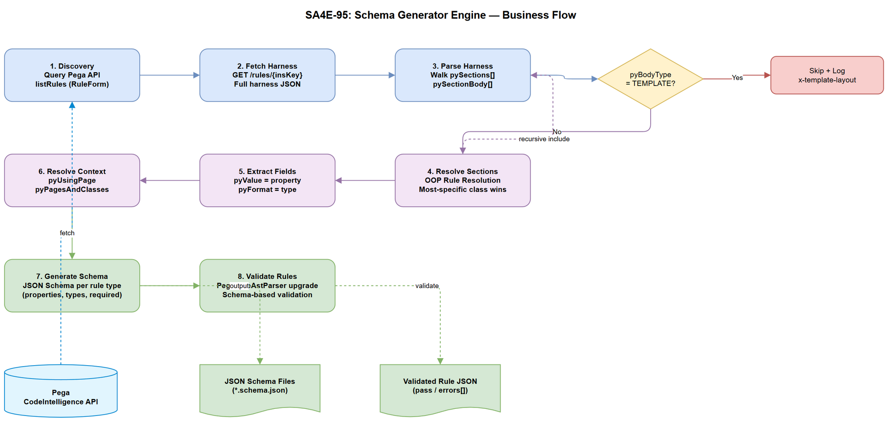
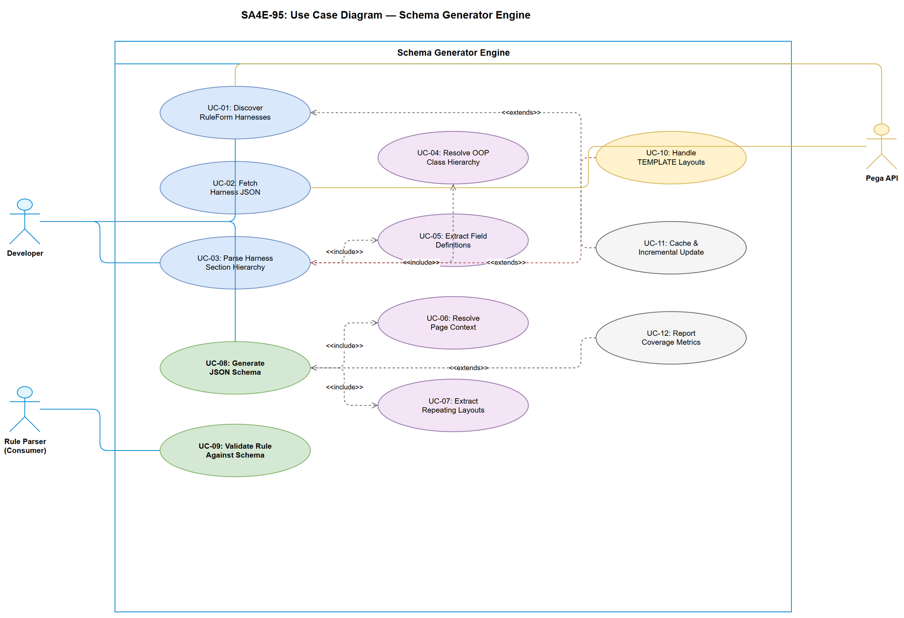

# Business Requirements Document (BRD)

## SA4E — SA4E-95: Pega Rule Schema Generator Engine Upgrade

---

## Document Information

| Field | Value |
|-------|-------|
| Jira Ticket | SA4E-95 |
| Title | Pega Rule Schema Generator Engine Upgrade |
| Author | BA Agent |
| Version | 1.0 |
| Date | 2026-08-07 |
| Status | Draft |

---

## Author Tracking

| Role | Name - Position | Responsibility |
|------|-----------------|----------------|
| Author | BA Agent – Business Analyst | Create document |
| Peer Reviewer | TA Agent – Technical Architect | Review document |

---

## Revision History

| Version | Date | Author | Changes |
|---------|------|--------|---------|
| 1.0 | 2026-08-07 | BA Agent | Initiate document — auto-generated from Jira ticket SA4E-95 and research analysis |

---

## Sign-Off

| Name | Signature and date |
|------|--------------------|
| | ☐ I agree and confirm all criteria on this BRD as expected requirements |
| | ☐ I agree and confirm all criteria on this BRD as expected requirements |

---

## 1. Introduction

### 1.1 Scope

Upgrade the Pega Rule Schema Generator Engine to produce accurate JSON Schemas from RuleForm harness parsing. The engine will:

1. **Fetch RuleForm harnesses** via Pega CodeIntelligence API (`listRules` + `GET /rules/{insKey}`)
2. **Parse harness → section hierarchy recursively**, resolving class inheritance (OOP most-specific-class wins)
3. **Extract fields** (property bindings via `pyValue`, widget types via `pyFormat`, editability via `pyReadOnly`)
4. **Extract repeating layouts** (page list tables via `pyPageListProperty` + `pyPageListPropertyClass`)
5. **Resolve page context** (`pyUsingPage`, `pyPagesAndClasses`, `pxNamedPageReferences`)
6. **Generate JSON Schema** per rule type (properties, types, required fields, nested objects for page lists)
7. **Upgrade rule parser** to validate rule JSON against generated schemas

### 1.2 Out of Scope

- **TEMPLATE layouts** (DecisionTable grid, Data Transform editor) — JavaScript-rendered at runtime, cannot be parsed statically
- **Dynamic runtime sections** (sections loaded via Activities/Flows at runtime, not declared in harness JSON)
- **UI rendering** — this engine only generates schema definitions, not visual forms
- **Rule editing/saving** — read-only schema generation
- **Non-RuleForm harnesses** (Perform, Confirm, Review harnesses for case management)

### 1.3 Preliminary Requirement

| # | Prerequisite | Status |
|---|-------------|--------|
| 1 | Pega CodeIntelligence REST API accessible (SSA@TGB credentials) | ✅ Available |
| 2 | Existing `PegaRuleAstParser` with 20+ rule types | ✅ Exists in `backend/src/modules/pega/` |
| 3 | Existing schemas directory (`backend/src/modules/pega/schemas/`) | ✅ Exists |
| 4 | Research analysis complete (ANALYSIS.md, COMPOSITE-DIAGRAMS.md) | ✅ Complete |

---

## 2. Business Requirements

### 2.1 High Level Process Map

The Schema Generator Engine operates in a pipeline:

1. **Discovery** — Query Pega API for all RuleForm harnesses across rule types
2. **Fetch** — Retrieve full harness JSON for each rule type
3. **Parse** — Walk harness → sections → sub-sections recursively
4. **Resolve** — Apply OOP class hierarchy to resolve most-specific sections
5. **Extract** — Collect field definitions, page contexts, repeating layouts
6. **Generate** — Produce JSON Schema per rule type
7. **Validate** — Upgrade rule parser to validate rule instances against schemas



### 2.2 List of User Stories / Use Cases

| # | Story / Use Case | Priority | Source Ticket |
|---|-----------------|----------|---------------|
| 1 | As a developer, I want the engine to fetch and parse RuleForm harnesses so that field schemas are auto-generated | MUST HAVE | SA4E-95 |
| 2 | As a developer, I want JSON Schema generated per rule type with correct property types so that I can validate rule JSON | MUST HAVE | SA4E-95 |
| 3 | As a developer, I want repeating layouts (page lists) represented as array types in the schema so that nested structures are modeled correctly | MUST HAVE | SA4E-95 |
| 4 | As a developer, I want page context resolution so that fields are attributed to the correct parent object in the schema | MUST HAVE | SA4E-95 |
| 5 | As a developer, I want OOP class hierarchy resolution so that subclass overrides are reflected in the generated schema | MUST HAVE | SA4E-95 |
| 6 | As a developer, I want the upgraded rule parser to validate any rule JSON against its generated schema | SHOULD HAVE | SA4E-95 |
| 7 | As a developer, I want TEMPLATE layouts gracefully skipped with a marker in the schema so that the engine doesn't crash | SHOULD HAVE | SA4E-95 |
| 8 | As a developer, I want schema generation to be cacheable and incremental so that re-runs are fast | COULD HAVE | SA4E-95 |

---

### 2.3 Details of User Stories

---

#### Business Flow

**Step 1:** Engine queries Pega API: `GET /rules/listRules?ObjClass=Rule-HTML-Harness&FilterPropName=pyStreamName&FilterPropValue=RuleForm` — retrieves list of all RuleForm harnesses with their `pzInsKey`.

**Step 2:** For each harness, engine fetches full JSON: `GET /rules/{pzInsKey}` — receives complete harness structure including `pyClassName`, `pyPagesAndClasses`, `pySections`.

**Step 3:** Engine parses harness JSON top-down:
- Extract `pyClassName` (primary class = schema root)
- Extract `pyPagesAndClasses` (available page contexts)
- Walk `pySections[].pySectionBody[]` recursively

**Step 4:** For each section body:
- If `pyBodyType=INCLUDE` → fetch referenced section rule, recurse
- If `pyBodyType=SIMPLELAYOUT` → extract fields from `pyRows[].pyCells[]`
- If `pyBodyType=REPEATLAYOUT` → extract page list property + class (array type)
- If `pyBodyType=TEMPLATE` → mark as dynamic, skip parsing

**Step 5:** For each field cell (`pyType=FIELD`):
- Map `pyValue` (e.g., `.propertyName`) → schema property name
- Map `pyFormat` → JSON Schema type (pxTextInput→string, pxCheckbox→boolean, pxDropdown→enum, pxDateTime→date-time)
- Map `pyReadOnly` → mark in schema metadata

**Step 6:** Resolve OOP inheritance:
- Walk class hierarchy from most-specific to `@baseclass`
- First section match wins (Rule Resolution algorithm)
- Merge fields from all resolved sections into final schema

**Step 7:** Generate JSON Schema:
- Root object = primary class
- Properties from extracted fields
- Nested objects from page context (`pyUsingPage`)
- Arrays from repeating layouts (`pyPageListProperty`)
- Required fields from non-optional bindings

**Step 8:** Upgrade `PegaRuleAstParser` to:
- Load generated schema for each rule type
- Validate incoming rule JSON via `ajv` or Zod schema validation
- Report validation errors with field-level detail

> **Note:** Steps 3-6 involve recursive descent that may reach depth 4+ for complex harnesses like Rule-Connect-REST (1.4MB section with nested repeats).

---

#### STORY 1: Fetch and Parse RuleForm Harnesses

> As a developer, I want the engine to fetch and parse RuleForm harnesses so that field schemas are auto-generated from the actual Pega rule definitions.

**Requirement Details:**

1. Engine MUST fetch all RuleForm harnesses for known rule types (20+ types currently in PegaRuleAstParser)
2. Engine MUST parse the hierarchical structure: Harness → pySections[] → pySectionBody[] → pyRows[] → pyCells[] → FIELD
3. Engine MUST handle nested section includes (recursive depth up to 5 levels)
4. Engine MUST respect `pyUsingPage` for context switching between sections

**Data Fields:**

| Field | Source Path | Type | Required | Description |
|-------|------------|------|----------|-------------|
| pyClassName | harness.pyClassName | string | Yes | Primary class the harness applies to |
| pyPagesAndClasses | harness.pyPagesAndClasses[] | array | No | Available page contexts |
| pySections | harness.pySections[] | array | Yes | Layout sections of the harness |
| pyInclude | sectionBody.pyInclude | string | Conditional | Name of included section |
| pyUsingPage | sectionBody.pyUsingPage | string | No | Page context override |
| pyBodyType | sectionBody.pyBodyType | enum | Yes | INCLUDE/SIMPLELAYOUT/REPEATLAYOUT/TEMPLATE |

**Acceptance Criteria:**

1. Given a Pega instance with RuleForm harnesses, when the engine runs, then it MUST successfully fetch harness JSON for all known rule types
2. Given a harness JSON with nested sections, when parsed, then the engine MUST resolve all INCLUDE references recursively
3. Given a section with `pyBodyType=TEMPLATE`, when encountered, then the engine MUST skip it gracefully and log a warning
4. Given API authentication failure, when the engine tries to fetch, then it MUST report a clear error message without crashing

---

#### STORY 2: Generate JSON Schema Per Rule Type

> As a developer, I want JSON Schema generated per rule type with correct property types so that I can validate rule JSON instances.

**Requirement Details:**

1. Engine MUST produce one JSON Schema file per rule type (e.g., `Rule-Obj-Activity.schema.json`)
2. Schema MUST map `pyFormat` values to appropriate JSON Schema types
3. Schema MUST include `required` array for non-optional fields
4. Schema MUST include `description` from field labels where available

**Format-to-Type Mapping:**

| pyFormat | JSON Schema Type | Format | Notes |
|----------|-----------------|--------|-------|
| pxTextInput | string | — | Standard text input |
| pxTextArea | string | — | Multi-line text |
| pxDropdown | string | — | With `enum` if options known |
| pxCheckbox | boolean | — | True/false toggle |
| pxDateTime | string | date-time | ISO 8601 format |
| pxAutoComplete | string | — | With autocomplete hint |
| pxDisplayText | string | — | Read-only display |
| pxLink | string | uri | Hyperlink |
| Default | string | — | Fallback for unknown formats |

**Acceptance Criteria:**

1. Given a parsed harness with 10 fields, when schema is generated, then the output JSON Schema MUST contain exactly those 10 properties with correct types
2. Given a field with `pyFormat=pxCheckbox`, when schema is generated, then the property type MUST be `boolean`
3. Given a field with `pyReadOnly=true`, when schema is generated, then the property MUST include `readOnly: true` in metadata
4. Generated schema MUST be valid JSON Schema Draft 2020-12

---

#### STORY 3: Repeating Layouts as Array Types

> As a developer, I want repeating layouts (page lists) represented as array types in the schema so that nested data structures are modeled correctly.

**Requirement Details:**

1. When `pyPageListProperty` is present, engine MUST generate an `array` type property
2. The array's `items` schema MUST be derived from parsing the `pyPageListPropertyClass` section
3. Indexed page references (e.g., `.pyPATCHResponseDataList(1)`) MUST resolve to the correct item schema
4. Nested repeating layouts (repeat within repeat) MUST be supported

**Data Fields:**

| Field | Source | Type | Description |
|-------|--------|------|-------------|
| pyPageListProperty | sectionBody | string | Property name of the page list (e.g., `.pyGETRequestHeaders`) |
| pyPageListPropertyClass | sectionBody | string | Class of items in the list (e.g., `Embed-InterfaceParameter`) |

**Acceptance Criteria:**

1. Given a section with `pyPageListProperty='.pyGETRequestHeaders'` and `pyPageListPropertyClass='Embed-InterfaceParameter'`, when schema is generated, then the schema MUST contain `pyGETRequestHeaders: { type: "array", items: { ... } }`
2. Given a Rule-Connect-REST harness with 5 HTTP methods each having request/response headers, when parsed, then the schema MUST contain 10+ array properties
3. Given nested repeats (page list inside page list), when parsed, then the schema MUST model nested arrays correctly

---

#### STORY 4: Page Context Resolution

> As a developer, I want page context resolution so that fields are attributed to the correct parent object in the schema.

**Requirement Details:**

1. Engine MUST resolve page context from `pyUsingPage` values
2. Empty `pyUsingPage` = primary page (harness.pyClassName)
3. `pyUsingPage` starting with `.` = relative property reference → nested object in schema
4. `pyUsingPage` starting with `D_` = Data Page reference → separate schema object
5. Named pages (e.g., `pyWorkPage`) = resolve class from `pyPagesAndClasses`

**Context Resolution Algorithm:**

```
resolveContext(pyUsingPage, contextPages, primaryClass):
  if pyUsingPage == '':
    return primaryClass
  if pyUsingPage starts with 'D_':
    return DataPage class (from contextPages or Data Page definition)
  if pyUsingPage starts with '.':
    return property reference class (from contextPages)
  match = contextPages.find(p => p.page == pyUsingPage)
  return match?.class || '@baseclass'
```

**Acceptance Criteria:**

1. Given a section with `pyUsingPage=''`, when context is resolved, then fields MUST be placed under the root schema object
2. Given a section with `pyUsingPage='.pyPATCHResponseDataList(1)'`, when context is resolved, then fields MUST be placed under `pyPATCHResponseDataList.items`
3. Given a section with `pyUsingPage='D_OperatorList'`, when context is resolved, then fields MUST be placed under a separate named object

---

#### STORY 5: OOP Class Hierarchy Resolution

> As a developer, I want OOP class hierarchy resolution so that subclass overrides are reflected in the generated schema.

**Requirement Details:**

1. Engine MUST implement Pega Rule Resolution: walk up class hierarchy, most-specific match wins
2. Section overrides (e.g., `Rule-Obj-Activity` overriding `@baseclass::RuleFormLayout`) MUST be detected
3. All rule types share the same harness template (`Harness → INCLUDE 'RuleFormMain'`), differentiation happens via class-specific section overrides
4. Engine MUST merge fields from base sections with overridden sections correctly

**Known Override Patterns:**

| Class | Sections Count | Key Overrides |
|-------|---------------|---------------|
| @baseclass | base | RuleFormMain, pzRuleFormKeysAndDescription |
| Rule-Obj-Activity | 35 | RuleFormLayout, pzSteps, pzDefinition |
| Rule-Obj-Model | 18 | RuleFormLayout, pzDefinition |
| Rule-Obj-When | 28 | RuleFormLayout, pzConditions |
| Rule-Declare-DecisionTable | 25 | RuleFormLayout, pzDecisionTable |
| Rule-Connect-REST | 27 | Methods, AuthConfig |
| Rule-Obj-Report-Definition | 87 | RuleFormLayout, pzReportExplorer |

**Acceptance Criteria:**

1. Given `Rule-Obj-Activity` with section override `RuleFormLayout`, when resolved, then the Activity-specific section MUST be used (not @baseclass version)
2. Given a class hierarchy `Rule-Obj-Activity → Rule- → @baseclass`, when resolving section `pzRuleFormKeysAndDescription`, then the @baseclass version MUST be used (no override exists)
3. Engine MUST handle at least 20 rule types with their respective class hierarchies

---

#### STORY 6: Upgraded Rule Parser with Schema Validation

> As a developer, I want the upgraded rule parser to validate any rule JSON against its generated schema.

**Requirement Details:**

1. Existing `PegaRuleAstParser` MUST be extended with schema validation capability
2. Parser MUST load the appropriate schema based on the rule's `pxObjClass`
3. Validation MUST report field-level errors (missing required fields, wrong types, unknown properties)
4. Validation MUST be optional (opt-in) to avoid breaking existing parser consumers

**Acceptance Criteria:**

1. Given a valid Rule-Obj-Activity JSON, when validated against its schema, then validation MUST pass with 0 errors
2. Given a rule JSON missing a required field, when validated, then the error MUST specify which field is missing and its expected type
3. Given a rule JSON with a field of wrong type (string instead of boolean), when validated, then the error MUST identify the field and expected type
4. Validation MUST NOT break existing parser functionality when disabled

---

#### STORY 7: Graceful TEMPLATE Layout Handling

> As a developer, I want TEMPLATE layouts gracefully skipped with a marker in the schema so that the engine doesn't crash on unparseable sections.

**Requirement Details:**

1. Sections with `pyBodyType=TEMPLATE` MUST be detected and skipped
2. A schema marker (`x-template-layout: true`) MUST be added for skipped sections
3. Engine MUST log which sections were skipped (for future coverage tracking)
4. Known TEMPLATE sections: DecisionTable grid, Data Transform editor, Activity steps

**Acceptance Criteria:**

1. Given a Rule-Declare-DecisionTable harness with TEMPLATE layout `pzDecisionTable`, when parsed, then the engine MUST NOT crash and MUST include a marker in the schema
2. Given a rule type where 100% of unique fields are in TEMPLATE sections, then the schema MUST still be generated (with template markers) and not be empty
3. Engine MUST produce a coverage report showing percentage of fields parsed vs. skipped

---

#### STORY 8: Cacheable and Incremental Schema Generation

> As a developer, I want schema generation to be cacheable and incremental so that re-runs only process changed rules.

**Requirement Details:**

1. Engine SHOULD cache fetched harness JSON locally (per rule type + version)
2. Engine SHOULD detect unchanged harnesses and skip re-processing
3. Cache invalidation SHOULD be based on rule version/timestamp from Pega API
4. Schema output SHOULD include a version hash for consumers to detect changes

**Acceptance Criteria:**

1. Given a previously generated schema with no upstream changes, when engine re-runs, then it SHOULD skip fetching and return cached schema
2. Given a changed harness (newer pzUpdateDateTime), when engine re-runs, then it MUST regenerate the schema for that rule type
3. Cache SHOULD reduce full regeneration time by >80% on subsequent runs

---

## 3. Dependencies

| Dependency | Type | Related Ticket | Description |
|------------|------|----------------|-------------|
| Pega CodeIntelligence API | External | N/A | REST API for fetching rules (listRules, GET /rules/{insKey}) |
| PegaRuleAstParser | System | N/A | Existing parser in `backend/src/modules/pega/` — must be extended |
| Pega Instance | Infrastructure | N/A | Academy instance: `https://zdk8budo.pegaacademy.net/prweb/api/CodeIntelligence/v1` |
| JSON Schema Validator | System | N/A | `ajv` or Zod for runtime schema validation |
| Existing Schemas | System | N/A | `backend/src/modules/pega/schemas/` — existing manual schemas to be replaced/augmented |

---

## 4. Stakeholders

| Role | Name / Team | Responsibility | Source |
|------|-------------|----------------|--------|
| Developer | DEV Agent | Implement schema generator engine | SA4E-95 assignee |
| Architect | SA Agent | Design engine architecture | TDD author |
| Reviewer | TA Agent | Review technical specification | FSD reviewer |
| QA | QA Agent | Test schema accuracy and validation | Test planning |

---

## 5. Risks and Assumptions

### 5.1 Risks

| Risk | Impact | Likelihood | Mitigation |
|------|--------|------------|------------|
| Pega API rate limiting blocks batch fetching | High | Medium | Implement retry with backoff; cache aggressively |
| Complex harnesses (>1MB) cause memory issues | Medium | Low | Stream parsing; limit recursion depth |
| TEMPLATE layouts cover majority of fields for some rule types | High | Medium | Accept partial schemas; log coverage metrics |
| Class hierarchy resolution incorrect for edge cases | Medium | Medium | Validate against known rule instances from research |
| API credential rotation breaks engine | Medium | Low | Externalize credentials; health check endpoint |
| Section circular references cause infinite recursion | High | Low | Track visited sections; max depth limit |

### 5.2 Assumptions

- Pega CodeIntelligence API response format is stable and documented
- All RuleForm harnesses follow the proven hierarchy: Harness → pySections → pySectionBody → pyRows → pyCells → FIELD
- OOP Rule Resolution follows standard Pega behavior (most-specific class wins, walk up hierarchy)
- `pyUsingPage=''` (empty) consistently means primary page context across all rule types
- Existing `PegaRuleAstParser` supports 20+ rule types that will all benefit from schema generation
- The research data (ANALYSIS.md, COMPOSITE-DIAGRAMS.md) accurately represents production Pega behavior

---

## 6. Non-Functional Requirements

| Category | Requirement | Details |
|----------|-------------|---------|
| Performance | Schema generation for single rule type < 5 seconds | Including API fetch + parse + generate |
| Performance | Full regeneration (all 20+ types) < 2 minutes | With caching, < 10 seconds |
| Reliability | Engine must not crash on malformed harness JSON | Graceful degradation with error logging |
| Scalability | Support up to 50 rule types without architecture change | Current: 20+, growth expected |
| Maintainability | New rule types added by configuration, not code change | Mapping table for format→type |
| Accuracy | ≥90% field coverage for parseable sections | Excluding TEMPLATE layouts |
| Testability | Each component independently testable | Unit tests for parser, resolver, generator |

---

## 7. Related Tickets

| Ticket Key | Summary | Status | Type | Relationship |
|------------|---------|--------|------|--------------|
| SA4E-95 | Pega Rule Schema Generator Engine Upgrade | In Progress | Story | Main ticket |

---

## 8. Appendix

### Use Case Diagram



### Glossary

| Term | Definition |
|------|------------|
| RuleForm | Standard Pega harness type used to display/edit rule definitions in Dev Studio |
| Harness | Top-level UI container in Pega that organizes sections and controls |
| Section | Reusable UI component within a harness; contains layouts, fields, sub-sections |
| pyUsingPage | Property that defines which page context a section operates on |
| pyPageListProperty | Property that defines a repeating (table/grid) layout bound to a page list |
| Rule Resolution | Pega OOP algorithm: walk up class hierarchy, first match wins |
| TEMPLATE Layout | JavaScript-rendered section that cannot be parsed statically |
| pyFormat | Cell property defining the widget type (pxTextInput, pxDropdown, etc.) |
| pyValue | Cell property defining the property binding (e.g., `.propertyName`) |
| pzInsKey | Pega internal unique key for a rule instance |
| CodeIntelligence API | Pega REST API for programmatic access to rule definitions |
| Page Context | The class/page that a section's fields bind to at runtime |
| @baseclass | Universal base class in Pega; all classes inherit from it |

### Reference Documents

| Document | Link / Location |
|----------|-----------------|
| Harness Analysis | documents/SA4E-95/ANALYSIS.md |
| Composite Diagrams | documents/SA4E-95/COMPOSITE-DIAGRAMS.md |
| Raw Harness: Operator-ID | documents/SA4E-95/ruleform-operator-id-raw.json |
| Raw Section: RuleFormMain | documents/SA4E-95/section-ruleformmain-raw.json |
| Pega API Base URL | https://zdk8budo.pegaacademy.net/prweb/api/CodeIntelligence/v1 |

### Diagram Index

| # | Diagram | Image | Source (editable) |
|---|---------|-------|-------------------|
| 1 | Business Flow | [business-flow.png](diagrams/business-flow.png) | [business-flow.drawio](diagrams/business-flow.drawio) |
| 2 | Use Case | [use-case.png](diagrams/use-case.png) | [use-case.drawio](diagrams/use-case.drawio) |
