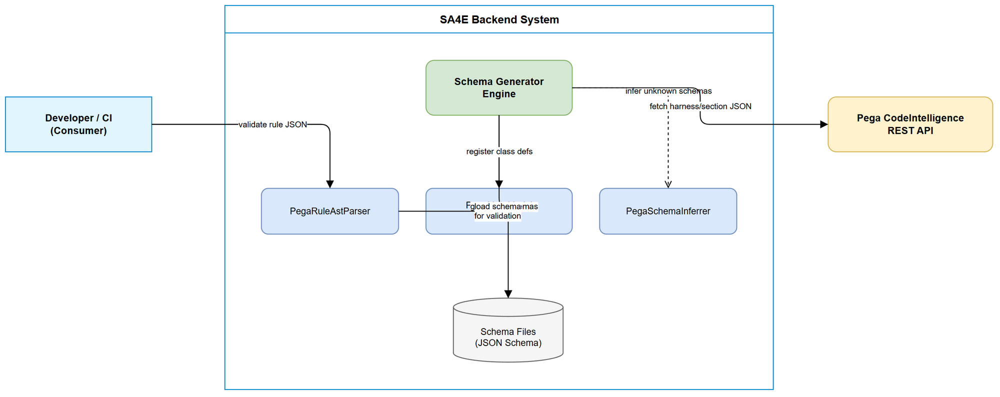
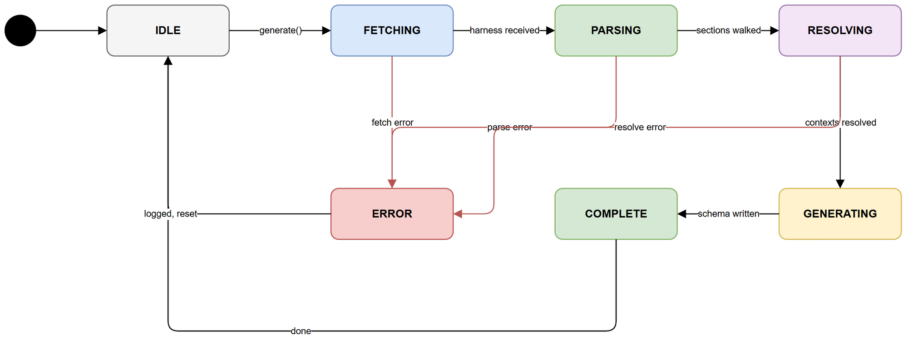
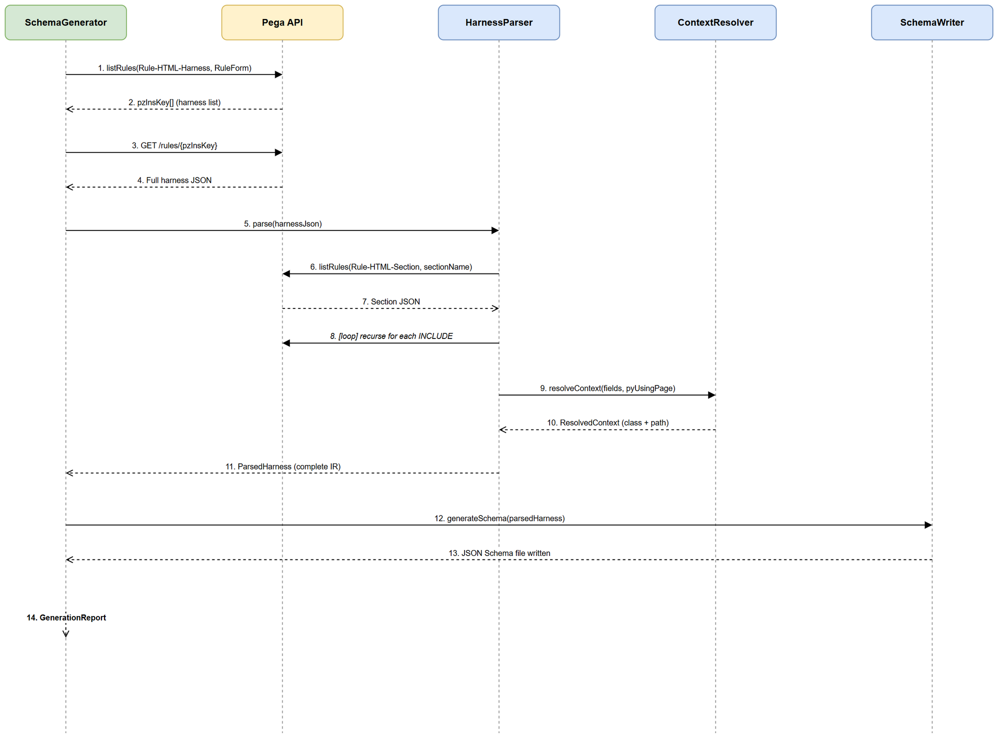
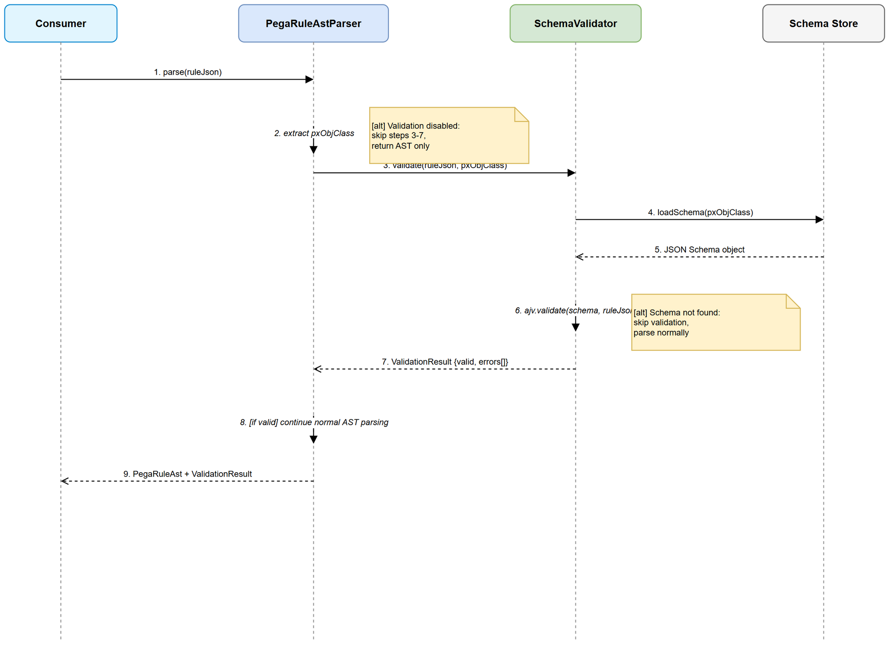

# Functional Specification Document (FSD)

## SA4E — SA4E-95: Pega Rule Schema Generator Engine Upgrade

---

## Document Information

| Field | Value |
|-------|-------|
| Jira Ticket | SA4E-95 |
| Title | Pega Rule Schema Generator Engine Upgrade |
| Author | BA Agent |
| Version | 2.0 |
| Date | 2026-08-09 |
| Status | Updated |
| Related BRD | documents/SA4E-95/BRD.md |

---

## Revision History

| Version | Date | Author | Changes |
|---------|------|--------|---------|
| 1.0 | 2026-08-07 | BA Agent | Initiate document — auto-generated from BRD and research analysis |
| 2.0 | 2026-08-09 | BA Agent | Unified pipeline (extension→backend single flow), KB ingest use case, graph edge creation, UX changes (QuickPick default, auto-enable, Pega project detection, dynamic banner) |

---

## 1. Introduction

### 1.1 Purpose

This FSD specifies the functional behavior of the Pega Rule Schema Generator Engine upgrade.
It translates the BRD user stories into precise use cases, business rules, API specifications,
and data models that developers can implement directly.

### 1.2 Scope

The engine upgrade covers:
- **Unified Pipeline**: Extension crawls ALL RuleForm harnesses → sends to backend → backend generates schemas → extension writes files + ingests to KB
- Recursive harness to section to field parsing (backend computation)
- Page context resolution and OOP class hierarchy resolution
- JSON Schema generation per rule type (ALL types in single batch)
- KB ingest of generated schemas (type=PEGA_RULE) as primary storage
- Graph edge creation on rule ingest (dependency relationships)
- Schema-based validation in the existing PegaRuleAstParser
- Caching and incremental regeneration
- UX: Schema generation as default QuickPick option with auto-enable

Out of scope: TEMPLATE layouts, dynamic runtime sections, UI rendering, rule editing.

### 1.3 Definitions & Acronyms

| Term | Definition |
|------|------------|
| RuleForm | Standard Pega harness type for displaying/editing rule definitions in Dev Studio |
| Harness | Top-level UI container organizing sections and controls |
| Section | Reusable UI component within a harness containing layouts and fields |
| pyUsingPage | Property defining which page context a section operates on |
| pyPageListProperty | Property defining a repeating layout bound to a page list |
| Rule Resolution | Pega OOP algorithm: walk up class hierarchy, first match wins |
| TEMPLATE Layout | JavaScript-rendered section that cannot be parsed statically |
| pyFormat | Cell property defining widget type (pxTextInput, pxDropdown, etc.) |
| pyValue | Cell property defining property binding (e.g., `.propertyName`) |
| pzInsKey | Pega internal unique key for a rule instance |
| CodeIntelligence API | Pega REST API for programmatic access to rule definitions |
| JSON Schema | Standard format (Draft 2020-12) for describing JSON structure |
| OOP | Object-Oriented Programming — Pega class hierarchy model |

### 1.4 References

| Document | Location |
|----------|----------|
| BRD | documents/SA4E-95/BRD.md |
| Harness Analysis | documents/SA4E-95/ANALYSIS.md |
| Composite Diagrams | documents/SA4E-95/COMPOSITE-DIAGRAMS.md |
| Pega API Base URL | https://zdk8budo.pegaacademy.net/prweb/api/CodeIntelligence/v1 |
| Existing Parser | backend/src/modules/pega/PegaRuleAstParser.ts |
| Existing Schemas | backend/src/modules/pega/schemas/ |
| Schema Inferrer | backend/src/modules/pega/inference/PegaSchemaInferrer.ts |

---

## 2. System Overview

### 2.1 System Context Diagram



The Schema Generator Engine operates as a unified pipeline across extension and backend:
- **VS Code Extension (Orchestrator)** — crawls ALL RuleForm harnesses from Pega API, sends to backend, writes files, ingests to KB
- **Backend (Pure Computation)** — receives harness JSON, parses hierarchy, generates JSON Schema
- **Pega CodeIntelligence API** (external) — source of harness/section rule JSON
- **Knowledge Base** (internal) — primary storage for generated schemas (type=PEGA_RULE)
- **Graph Database** (internal) — stores dependency edges between rules
- **PegaRuleAstParser** (internal) — consumer of generated schemas for validation
- **File System** (internal) — backup storage for JSON Schema files (`schemas/auto/`)

### 2.2 System Architecture

The engine follows a unified pipeline architecture:
1. **Crawler** (Extension) — Paginated discovery of ALL RuleForm harnesses via Pega API
2. **Fetcher** (Extension) — Fetch full harness + section JSON per rule type
3. **Parser** (Backend) — Recursive descent through harness/section hierarchy
4. **Resolver** (Backend) — OOP class resolution + page context resolution
5. **Generator** (Backend) — JSON Schema output production
6. **Writer** (Extension) — Write schema files to disk
7. **Ingestor** (Extension) — POST schemas to KB + create graph edges

Each stage is independently testable. Extension handles all Pega API I/O; backend is a pure computation service with no external API calls.

---

## 3. Functional Requirements

### 3.1 Use Case: Generate All Rule Schemas (Unified Pipeline)

**Use Case ID:** UC-01
**Actor:** Extension (PegaSchemaIndexer — orchestrator)
**Preconditions:** Pega API credentials configured; backend service running
**Postconditions:** JSON Schema files written for ALL rule types; schemas ingested to KB; graph edges created

**Main Flow:**

| Step | Actor | System | Description |
|------|-------|--------|-------------|
| 1 | Extension | | Crawl ALL Rule-HTML-Harness rules with pyStreamName=RuleForm (paginated, 200/page) |
| 2 | | Pega API | Return full list of harness summaries with pzInsKey, pyClassName |
| 3 | Extension | | For each harness: extract ruleType from pyClassName |
| 4 | Extension | | Fetch full harness JSON via GET /rules/{pzInsKey} |
| 5 | Extension | | Fetch referenced sections (pyTemplateName, pySectionBody references) |
| 6 | Extension | | POST {harnessJson, sectionJsons, ruleType} to backend /api/v1/pega/schema/generate |
| 7 | | Backend | Parse harness hierarchy, resolve OOP, generate JSON Schema (UC-02 through UC-07) |
| 8 | | Backend | Return generated schema JSON |
| 9 | Extension | | Write schema file to disk (schemas/auto/{ruleType}.schema.json) |
| 10 | Extension | | Ingest schema to KB via POST /api/v1/memory/ingest (UC-10) |
| 11 | Extension | | Report progress: "[N/Total] {ruleType}..." |
| 12 | Extension | | After all: produce summary "Generated N schemas for M rule types" |

**Alternative Flows:**

| ID | Condition | Steps |
|----|-----------|-------|
| AF-01-1 | Harness has no pyClassName | Skip, increment failed counter |
| AF-01-2 | Schema cached and unchanged | Skip fetch, use cache (UC-09) |
| AF-01-3 | Multiple pages of harnesses | Paginate until pxMore=false |

**Exception Flows:**

| ID | Condition | Steps |
|----|-----------|-------|
| EF-01-1 | API 401/403 auth failure | Log error, abort entire generation with credentials message |
| EF-01-2 | API timeout for single harness | Log error, skip rule type, continue others |
| EF-01-3 | Backend returns error for single type | Log error, skip rule type, continue others |
| EF-01-4 | API 429 rate limit | Wait Retry-After, then retry |
| EF-01-5 | KB ingest fails | Non-fatal — file already written as backup, log warning |

---

### 3.2 Use Case: Parse Harness Hierarchy

**Use Case ID:** UC-02
**Actor:** Schema Generator Engine
**Preconditions:** Harness JSON fetched (UC-01 complete)
**Postconditions:** Complete field extraction tree with page contexts

**Main Flow:**

| Step | Actor | System | Description |
|------|-------|--------|-------------|
| 1 | Engine | | Extract pyClassName as primary class |
| 2 | Engine | | Extract pyPagesAndClasses as context pages |
| 3 | Engine | | Walk pySections[].pySectionBody[] top-down |
| 4 | Engine | | For each body: evaluate pyBodyType |
| 5 | Engine | | INCLUDE: fetch section rule, recurse (UC-03) |
| 6 | Engine | | SIMPLELAYOUT: extract fields from pyRows/pyCells |
| 7 | Engine | | REPEATLAYOUT: extract page list (UC-04) |
| 8 | Engine | | TEMPLATE: mark dynamic, skip with metadata |
| 9 | Engine | | Build ParsedHarness intermediate representation |

**Alternative Flows:**

| ID | Condition | Steps |
|----|-----------|-------|
| AF-02-1 | Section already parsed (circular ref) | Skip, reference existing result |
| AF-02-2 | Recursion depth > 5 | Stop, log warning, mark truncated |

**Exception Flows:**

| ID | Condition | Steps |
|----|-----------|-------|
| EF-02-1 | Missing pyBodyType | Skip body, log error, continue |
| EF-02-2 | Unknown pyBodyType | Treat as TEMPLATE (skip with marker) |

---

### 3.3 Use Case: Resolve Included Section

**Use Case ID:** UC-03
**Actor:** Schema Generator Engine
**Preconditions:** Section body with pyBodyType=INCLUDE encountered
**Postconditions:** Referenced section fully parsed and merged into tree

**Main Flow:**

| Step | Actor | System | Description |
|------|-------|--------|-------------|
| 1 | Engine | | Read pyInclude value (section name) |
| 2 | Engine | | Determine target class via OOP resolution (UC-06) |
| 3 | | Pega API | Query listRules: ObjClass=Rule-HTML-Section, FilterPropName=pyStreamName, FilterPropValue={pyInclude}, FilterClassName={targetClass} |
| 4 | | Pega API | Return section rule with pzInsKey |
| 5 | | Pega API | GET /rules/{pzInsKey} for full section JSON |
| 6 | Engine | | Read pyUsingPage for context resolution (UC-05) |
| 7 | Engine | | Recurse: parse section body same as UC-02 steps 3-8 |

**Alternative Flows:**

| ID | Condition | Steps |
|----|-----------|-------|
| AF-03-1 | Section not found for specific class | Walk up class hierarchy to @baseclass |
| AF-03-2 | Section cached from previous parse | Use cached parsed section |

**Exception Flows:**

| ID | Condition | Steps |
|----|-----------|-------|
| EF-03-1 | Section not found in any class | Log warning, mark as unresolved in tree |
| EF-03-2 | API error fetching section | Log error, mark section as fetch-failed |

---

### 3.4 Use Case: Extract Repeating Layout

**Use Case ID:** UC-04
**Actor:** Schema Generator Engine
**Preconditions:** Section body with pyPageListProperty present
**Postconditions:** Array type property added to schema with items definition

**Main Flow:**

| Step | Actor | System | Description |
|------|-------|--------|-------------|
| 1 | Engine | | Read pyPageListProperty (e.g., .pyGETRequestHeaders) |
| 2 | Engine | | Read pyPageListPropertyClass (e.g., Embed-InterfaceParameter) |
| 3 | Engine | | Create array-type schema property |
| 4 | Engine | | Resolve items schema from pyPageListPropertyClass |
| 5 | Engine | | Parse nested fields within repeat body |
| 6 | Engine | | Attach items schema to array property |

**Alternative Flows:**

| ID | Condition | Steps |
|----|-----------|-------|
| AF-04-1 | Nested repeat within repeat | Create nested array (array of arrays) |
| AF-04-2 | pyPageListPropertyClass has own sections | Fetch and parse class-specific section |

**Exception Flows:**

| ID | Condition | Steps |
|----|-----------|-------|
| EF-04-1 | Missing pyPageListPropertyClass | Default items to empty object schema |
| EF-04-2 | Class not resolvable | Log warning, use generic object items |

---

### 3.5 Use Case: Resolve Page Context

**Use Case ID:** UC-05
**Actor:** Schema Generator Engine
**Preconditions:** pyUsingPage value encountered during parsing
**Postconditions:** Correct target class/object path determined

**Main Flow:**

| Step | Actor | System | Description |
|------|-------|--------|-------------|
| 1 | Engine | | Read pyUsingPage value |
| 2 | Engine | | If empty: return primary class (harness.pyClassName) |
| 3 | Engine | | If starts with D_: lookup Data Page class in context |
| 4 | Engine | | If starts with dot: resolve property reference class |
| 5 | Engine | | If named page: find in pyPagesAndClasses array |
| 6 | Engine | | Return resolved class + object path for schema nesting |

**Alternative Flows:**

| ID | Condition | Steps |
|----|-----------|-------|
| AF-05-1 | Indexed reference (e.g., .pyList(1)) | Resolve to items schema of parent array |
| AF-05-2 | Page found in section's own pyPagesAndClasses | Use section-level context over harness-level |

**Exception Flows:**

| ID | Condition | Steps |
|----|-----------|-------|
| EF-05-1 | Page not found in any context | Default to @baseclass, log warning |
| EF-05-2 | Ambiguous page reference | Use first match, log ambiguity |

---

### 3.6 Use Case: OOP Class Hierarchy Resolution

**Use Case ID:** UC-06
**Actor:** Schema Generator Engine
**Preconditions:** Section name known, need to find most-specific version
**Postconditions:** Correct class-specific section rule identified

**Main Flow:**

| Step | Actor | System | Description |
|------|-------|--------|-------------|
| 1 | Engine | | Start from target class (e.g., Rule-Obj-Activity) |
| 2 | Engine | | Search for section with name on target class |
| 3 | Engine | | If found: use this section (most-specific wins) |
| 4 | Engine | | If not found: walk up to parent class |
| 5 | Engine | | Repeat until found or reach @baseclass |
| 6 | Engine | | Return resolved section rule reference |

**Alternative Flows:**

| ID | Condition | Steps |
|----|-----------|-------|
| AF-06-1 | Override exists (e.g., Activity overrides RuleFormLayout) | Use override, skip @baseclass version |
| AF-06-2 | Multiple RuleSet versions of same section | Use highest circumstance-qualified version |

**Exception Flows:**

| ID | Condition | Steps |
|----|-----------|-------|
| EF-06-1 | Section not found in entire hierarchy | Return null, mark as unresolved |
| EF-06-2 | Class hierarchy unknown | Use direct class only, log warning |

---

### 3.7 Use Case: Generate JSON Schema

**Use Case ID:** UC-07
**Actor:** Schema Generator Engine
**Preconditions:** ParsedHarness IR complete with all fields and contexts
**Postconditions:** Valid JSON Schema Draft 2020-12 file produced

**Main Flow:**

| Step | Actor | System | Description |
|------|-------|--------|-------------|
| 1 | Engine | | Create root schema object (type: object) |
| 2 | Engine | | Set title = rule type class name |
| 3 | Engine | | For each extracted field: map to property |
| 4 | Engine | | Map pyFormat to JSON Schema type (BR-02) |
| 5 | Engine | | For each nested page context: create nested object |
| 6 | Engine | | For each repeat layout: create array property |
| 7 | Engine | | Determine required fields (non-optional) |
| 8 | Engine | | Add template markers for skipped sections |
| 9 | Engine | | Write schema to file system |

**Alternative Flows:**

| ID | Condition | Steps |
|----|-----------|-------|
| AF-07-1 | Field has known enum values | Add enum constraint to property |
| AF-07-2 | Field is readOnly | Add readOnly: true to property metadata |

**Exception Flows:**

| ID | Condition | Steps |
|----|-----------|-------|
| EF-07-1 | No parseable fields extracted | Generate minimal schema with template markers only |
| EF-07-2 | Schema validation fails internally | Log error, output schema anyway with warning metadata |

---

### 3.8 Use Case: Validate Rule JSON Against Schema

**Use Case ID:** UC-08
**Actor:** PegaRuleAstParser (consumer)
**Preconditions:** Generated schema exists for rule type; rule JSON to validate
**Postconditions:** Validation result with field-level errors (if any)

**Main Flow:**

| Step | Actor | System | Description |
|------|-------|--------|-------------|
| 1 | Parser | | Receive rule JSON for parsing |
| 2 | Parser | | Extract pxObjClass from rule JSON |
| 3 | Parser | | Load corresponding generated schema |
| 4 | Parser | | Run JSON Schema validation (ajv/Zod) |
| 5 | Parser | | If valid: return success + parsed AST |
| 6 | Parser | | If invalid: return validation errors array |

**Alternative Flows:**

| ID | Condition | Steps |
|----|-----------|-------|
| AF-08-1 | No schema exists for rule type | Skip validation, parse normally (backward compat) |
| AF-08-2 | Validation disabled via config | Skip validation entirely |

**Exception Flows:**

| ID | Condition | Steps |
|----|-----------|-------|
| EF-08-1 | Schema file corrupted/unreadable | Log error, skip validation, parse normally |
| EF-08-2 | Validator library error | Log error, skip validation, parse normally |

---

### 3.9 Use Case: Cache and Incremental Generation

**Use Case ID:** UC-09
**Actor:** Schema Generator Engine
**Preconditions:** Previous generation run completed
**Postconditions:** Only changed schemas regenerated

**Main Flow:**

| Step | Actor | System | Description |
|------|-------|--------|-------------|
| 1 | Engine | | Load cache manifest (rule types + versions + hashes) |
| 2 | Engine | | For each target rule type: check pzUpdateDateTime |
| 3 | Engine | | If unchanged: skip, use cached schema |
| 4 | Engine | | If changed: regenerate schema (UC-01 through UC-07) |
| 5 | Engine | | Update cache manifest with new versions/hashes |

**Alternative Flows:**

| ID | Condition | Steps |
|----|-----------|-------|
| AF-09-1 | Force regeneration requested | Ignore cache, regenerate all |
| AF-09-2 | Cache manifest missing | Treat as first run, generate all |

**Exception Flows:**

| ID | Condition | Steps |
|----|-----------|-------|
| EF-09-1 | Cache file corrupted | Delete cache, regenerate all |
| EF-09-2 | Cannot determine version from API | Regenerate to be safe |

---

### 3.10 Use Case: Ingest Schema to Knowledge Base

**Use Case ID:** UC-10
**Actor:** Extension (PegaSchemaIndexer)
**Preconditions:** Schema successfully generated for a rule type (UC-07 complete)
**Postconditions:** Schema stored in KB as PEGA_RULE entry; agents can search via mem_search("pega schema {ruleType}")

**Main Flow:**

| Step | Actor | System | Description |
|------|-------|--------|-------------|
| 1 | Extension | | Construct KB entry content: "PEGA_SCHEMA \| ruleType={ruleType} \| fields={count} \| {schema JSON}" |
| 2 | Extension | | POST to /api/v1/memory/ingest with type=PEGA_RULE, source=pega-schema/{ruleType}, tags=pega,schema,{ruleType}, scope=PROJECT |
| 3 | | Backend KB | Store entry, index for BM25 search |
| 4 | | Backend KB | Return success/created status |
| 5 | Extension | | Log: "[SchemaGen] ✅ Schema ingested to KB for {ruleType}" |

**Alternative Flows:**

| ID | Condition | Steps |
|----|-----------|-------|
| AF-10-1 | Schema already exists in KB for this ruleType | Overwrite (upsert by source key) |
| AF-10-2 | Schema content exceeds KB entry size limit | Truncate to summary + store full file path reference |

**Exception Flows:**

| ID | Condition | Steps |
|----|-----------|-------|
| EF-10-1 | KB service unavailable | Non-fatal — log warning, file on disk is backup |
| EF-10-2 | Network error during ingest | Non-fatal — skip KB ingest, continue pipeline |

**Business Rule:** KB is the PRIMARY source for agent schema access. File on disk (`schemas/auto/`) is BACKUP only.

---

### 3.11 Use Case: Create Graph Edges on Rule Ingest

**Use Case ID:** UC-11
**Actor:** Backend (PegaGraphProjector)
**Preconditions:** Rule JSON ingested to KB; rule contains dependency references
**Postconditions:** Graph edges created in graph_edges table representing rule relationships

**Main Flow:**

| Step | Actor | System | Description |
|------|-------|--------|-------------|
| 1 | Backend | | Receive rule JSON during KB ingest processing |
| 2 | Backend | | Extract dependencies from rule JSON (class references, activity calls, flow connections, property references) |
| 3 | Backend | | For each dependency: determine edge type (see Edge Types below) |
| 4 | Backend | | Create source node if not exists (rule being ingested) |
| 5 | Backend | | Create target node if not exists (referenced rule/class) |
| 6 | Backend | | INSERT edge into graph_edges table: {source_id, target_id, edge_type, metadata} |
| 7 | Backend | | Log edge creation count for this rule |

**Edge Types:**

| Edge Type | Meaning | Extracted From |
|-----------|---------|----------------|
| CALLS | Rule A invokes Rule B | Activity steps calling other activities/flows |
| INHERITS | Class A extends Class B | pyClassName → parent class hierarchy |
| HAS_PROPERTY | Class owns a property | Property definitions within class schema |
| CONNECTS_TO | Rule uses external connection | Connect-REST, Connect-SOAP references |
| EVALUATES | Rule evaluates a decision | Decision Table/Tree references in flows |
| USES | Generic dependency reference | Any rule reference not covered above |

**Alternative Flows:**

| ID | Condition | Steps |
|----|-----------|-------|
| AF-11-1 | Edge already exists | Skip (idempotent) |
| AF-11-2 | Target node not in KB yet | Create placeholder node, edges still valid |

**Exception Flows:**

| ID | Condition | Steps |
|----|-----------|-------|
| EF-11-1 | Graph DB write failure | Log error, continue — graph is enhancement not critical path |
| EF-11-2 | Circular dependency detected | Create edge anyway (cycles are valid in Pega) |

**Agent Usage:** Agents traverse graph via `mem_graph(action: "neighbors", node_id: X)` to discover rule dependencies and impact analysis.


---
## 4. Business Rules

| Rule ID | Rule | Source | Applies To |
|---------|------|--------|------------|
| BR-01 | pyBodyType determines parsing strategy: INCLUDE=recurse, SIMPLELAYOUT=extract fields, REPEATLAYOUT=array, TEMPLATE=skip | ANALYSIS.md Section 5 | UC-02 |
| BR-02 | pyFormat maps to JSON Schema type: pxTextInput/pxTextArea/pxAutoComplete/pxDisplayText/pxLink=string, pxCheckbox=boolean, pxDateTime=string(date-time), pxDropdown=string(enum), Default=string | BRD Story 2 | UC-07 |
| BR-03 | Empty pyUsingPage means primary page context (harness.pyClassName) | ANALYSIS.md Section 6 | UC-05 |
| BR-04 | pyUsingPage starting with D_ indicates Data Page reference | ANALYSIS.md Section 6 | UC-05 |
| BR-05 | pyUsingPage starting with dot indicates relative property reference | ANALYSIS.md Section 6 | UC-05 |
| BR-06 | Indexed page reference (.pyList(N)) resolves to items schema of parent array | ANALYSIS.md Section 2B | UC-05 |
| BR-07 | OOP Rule Resolution: most-specific class wins, walk up hierarchy | BRD Story 5 | UC-06 |
| BR-08 | All rule types share same harness template (Harness -> INCLUDE RuleFormMain), differentiation via section overrides | COMPOSITE-DIAGRAMS.md OOP Evidence | UC-06 |
| BR-09 | Maximum recursion depth = 5 levels for section parsing | BRD Story 1 | UC-02 |
| BR-10 | TEMPLATE layouts must be marked with x-template-layout: true in schema | BRD Story 7 | UC-07 |
| BR-11 | pyValue with leading dot = property binding (strip dot for schema property name) | ANALYSIS.md Section 2 | UC-02 |
| BR-12 | pyReadOnly=true maps to readOnly: true in JSON Schema property | BRD Story 2 | UC-07 |
| BR-13 | Schema validation is opt-in (disabled by default) to preserve backward compat | BRD Story 6 | UC-08 |
| BR-14 | Cache invalidation based on pzUpdateDateTime comparison | BRD Story 8 | UC-09 |
| BR-15 | Circular section references must be detected and broken (track visited set) | BRD Risk Section | UC-02 |
| BR-16 | pyPageListProperty value with leading dot = strip dot for property name | ANALYSIS.md Section 2B | UC-04 |
| BR-17 | Fields from FIELD-type cells only (pyType=FIELD); LABEL/BUTTON/ICON/SEPARATOR skipped | COMPOSITE-DIAGRAMS.md Control Catalog | UC-02 |
| BR-18 | Coverage metric = parsed fields / (parsed fields + template-skipped fields) * 100 | BRD Story 7 AC-3 | UC-07 |
| BR-19 | Generated schema MUST be stored in KB (type=PEGA_RULE) — KB is primary, file on disk is backup | SA4E-95 v2.0 | UC-10 |
| BR-20 | Rules ingested to KB MUST create graph edges representing dependencies (CALLS, INHERITS, HAS_PROPERTY, CONNECTS_TO, EVALUATES, USES) | SA4E-95 v2.0 | UC-11 |
| BR-21 | Schema generation auto-enables when no schema files detected in workspace (schemas/auto/ empty or missing) | SA4E-95 v2.0 | UC-01 |
| BR-22 | Schema generation runs for ALL rule types in a single batch (extension crawls all harnesses, not 1 class at a time) | SA4E-95 v2.0 | UC-01 |
| BR-23 | Schema gen is the first option in QuickPick menu with picked:true by default | SA4E-95 v2.0 | UC-01, UI |
| BR-24 | Pega project detection: display "rules are the source code" message (not "No source files found") | SA4E-95 v2.0 | UI |
| BR-25 | Progress banner title: "Pega Rule Schema Generation Started" (not "Workspace Indexing") | SA4E-95 v2.0 | UI |
| BR-26 | All log messages in English | SA4E-95 v2.0 | All |

---

## 5. API Specifications

### 5.1 External API: Pega CodeIntelligence REST

**Base URL:** `https://zdk8budo.pegaacademy.net/prweb/api/CodeIntelligence/v1`  
**Authentication:** Basic Auth (SSA@TGB credentials)

#### 5.1.1 List Rules

**Endpoint:** `GET /rules/listRules`  
**Purpose:** Discover harness/section rules by class and name

**Parameters:**

| Parameter | Type | Required | Description |
|-----------|------|----------|-------------|
| ObjClass | string | Yes | Rule class (Rule-HTML-Harness or Rule-HTML-Section) |
| FilterPropName | string | Yes | Filter property name (pyStreamName) |
| FilterPropValue | string | Yes | Filter value (RuleForm for harness, section name for sections) |
| FilterClassName | string | No | Target class for Rule Resolution |

**Response:**

| Field | Type | Description |
|-------|------|-------------|
| pxResults | array | List of matching rules |
| pxResults[].pzInsKey | string | Unique rule instance key |
| pxResults[].pyClassName | string | Class the rule applies to |
| pxResults[].pyStreamName | string | Rule name/stream name |
| pxResults[].pxUpdateDateTime | string | Last update timestamp |

#### 5.1.2 Get Rule

**Endpoint:** `GET /rules/{pzInsKey}`  
**Purpose:** Fetch full rule JSON by instance key

**Parameters:**

| Parameter | Type | Required | Description |
|-----------|------|----------|-------------|
| pzInsKey | path | Yes | URL-encoded rule instance key |

**Response:** Full rule JSON object (harness or section)

#### 5.1.3 Direct Children

**Endpoint:** `GET /rules/directChildren`  
**Purpose:** Get class hierarchy for OOP resolution

**Parameters:**

| Parameter | Type | Required | Description |
|-----------|------|----------|-------------|
| className | string | Yes | Parent class name |

**Response:**

| Field | Type | Description |
|-------|------|-------------|
| pxResults | array | Child classes |
| pxResults[].pyClassName | string | Child class name |

### 5.2 Internal Engine APIs

#### 5.2.1 Schema Generation API (Backend)

**Endpoint:** `POST /api/v1/pega/schema/generate`
**Purpose:** Generate JSON Schema from harness and section JSON (pure computation — no external API calls)

**Request Body:**

| Field | Type | Required | Description |
|-------|------|----------|-------------|
| harnessJson | object | Yes | Full harness rule JSON from Pega API |
| sectionJsons | Record<string, object> | Yes | Map of section name → section JSON |
| ruleType | string | Yes | Target rule type class name |

**Response:**

| Field | Type | Description |
|-------|------|-------------|
| schema | JSONSchema | Generated JSON Schema Draft 2020-12 |

**Error Responses:** 400 (invalid input), 500 (parse failure)

#### 5.2.2 KB Ingest API

**Endpoint:** `POST /api/v1/memory/ingest`
**Purpose:** Store schema in Knowledge Base for agent search

**Request Body:**

| Field | Type | Required | Description |
|-------|------|----------|-------------|
| content | string | Yes | Schema content with metadata prefix |
| type | string | Yes | "PEGA_RULE" |
| source | string | Yes | "pega-schema/{ruleType}" |
| tags | string | Yes | "pega,schema,{ruleType}" |
| scope | string | Yes | "PROJECT" |

**Response:** 201 Created

**Agent Search Pattern:** `mem_search("pega schema {ruleType}", type: "PEGA_RULE")`

#### 5.2.3 HarnessSchemaGenerator Interface

```typescript
interface HarnessSchemaGenerator {
  generateForRuleType(ruleType: string): Promise<GeneratedSchema>;
  generateAll(): Promise<GenerationReport>;
  generateIncremental(): Promise<GenerationReport>;
}
```

**GeneratedSchema:**

| Field | Type | Description |
|-------|------|-------------|
| ruleType | string | Pega rule class (e.g., Rule-Obj-Activity) |
| schema | JSONSchema | Generated JSON Schema Draft 2020-12 |
| coverage | number | Percentage of fields parsed (0-100) |
| templateSections | string[] | List of skipped TEMPLATE sections |
| version | string | Hash of schema content for change detection |

#### 5.2.2 Harness Parser API

**Interface:** `HarnessParser`

```typescript
interface HarnessParser {
  parse(harnessJson: Record<string, unknown>): ParsedHarness;
}
```

#### 5.2.3 Page Context Resolver API

**Interface:** `PageContextResolver`

```typescript
interface PageContextResolver {
  resolve(pyUsingPage: string, contextPages: PageContext[], primaryClass: string): ResolvedContext;
}
```

#### 5.2.4 Class Hierarchy Resolver API

**Interface:** `ClassHierarchyResolver`

```typescript
interface ClassHierarchyResolver {
  resolveSection(sectionName: string, targetClass: string): Promise<ResolvedSection | null>;
  getClassHierarchy(className: string): string[];
}
```

#### 5.2.5 Schema Validator API (Extension to PegaRuleAstParser)

```typescript
interface SchemaValidator {
  validate(ruleJson: Record<string, unknown>, pxObjClass: string): ValidationResult;
  isValidationEnabled(): boolean;
}

interface ValidationResult {
  valid: boolean;
  errors: ValidationError[];
}

interface ValidationError {
  path: string;        // JSON path to invalid field
  message: string;     // Human-readable error
  expected: string;    // Expected type/value
  actual: unknown;     // Actual value found
}
```

---

## 6. Data Model

### 6.1 Intermediate Representations

#### Entity: ParsedHarness

| Attribute | Type | Required | Description |
|-----------|------|----------|-------------|
| ruleType | string | Yes | pxObjClass of the rule (e.g., Rule-Obj-Activity) |
| primaryClass | string | Yes | harness.pyClassName |
| contextPages | PageContext[] | Yes | Available page contexts from pyPagesAndClasses |
| sections | ParsedSection[] | Yes | Recursively parsed section tree |
| templateMarkers | TemplateMarker[] | No | Skipped TEMPLATE sections |
| metadata | HarnessMetadata | Yes | Version, update time, source key |

#### Entity: ParsedSection

| Attribute | Type | Required | Description |
|-----------|------|----------|-------------|
| name | string | Yes | Section name (pyInclude value) |
| sourceClass | string | Yes | Class where section was resolved |
| bodyType | BodyType | Yes | INCLUDE/SIMPLELAYOUT/REPEATLAYOUT/TEMPLATE |
| pageContext | ResolvedContext | Yes | Resolved page/class context |
| fields | ExtractedField[] | No | Fields from SIMPLELAYOUT |
| repeatProperty | RepeatDefinition | No | For REPEATLAYOUT only |
| children | ParsedSection[] | No | Nested included sections |
| depth | number | Yes | Recursion depth (0=harness level) |

#### Entity: ExtractedField

| Attribute | Type | Required | Description |
|-----------|------|----------|-------------|
| propertyName | string | Yes | Property binding (from pyValue, dot stripped) |
| pyFormat | string | Yes | Widget format (pxTextInput, pxCheckbox, etc.) |
| readOnly | boolean | Yes | From pyReadOnly |
| label | string | No | Display label (pyLabel) |
| required | boolean | Yes | Whether field is mandatory |
| pageContext | string | Yes | Owning page/class path |

#### Entity: PageContext

| Attribute | Type | Required | Description |
|-----------|------|----------|-------------|
| page | string | Yes | Page reference name |
| className | string | Yes | Class of the page |
| mode | string | No | Access mode (readOnly, etc.) |

#### Entity: ResolvedContext

| Attribute | Type | Required | Description |
|-----------|------|----------|-------------|
| className | string | Yes | Resolved target class |
| objectPath | string | Yes | Path in schema (root, nested, array items) |
| source | string | Yes | How resolved: primary/named/dataPage/relative |

#### Entity: RepeatDefinition

| Attribute | Type | Required | Description |
|-----------|------|----------|-------------|
| propertyName | string | Yes | pyPageListProperty (dot stripped) |
| itemClass | string | Yes | pyPageListPropertyClass |
| fields | ExtractedField[] | No | Fields within repeat body |
| nestedRepeats | RepeatDefinition[] | No | Nested repeats |

#### Entity: TemplateMarker

| Attribute | Type | Required | Description |
|-----------|------|----------|-------------|
| sectionName | string | Yes | Name of skipped section |
| ruleType | string | Yes | Rule type it belongs to |
| reason | string | Yes | Why skipped (TEMPLATE layout) |

#### Entity: GenerationReport

| Attribute | Type | Required | Description |
|-----------|------|----------|-------------|
| totalRuleTypes | number | Yes | Number of rule types processed |
| generated | number | Yes | Schemas successfully generated |
| skipped | number | Yes | Rule types skipped (cached/no-harness) |
| failed | number | Yes | Rule types that failed |
| averageCoverage | number | Yes | Average field coverage percentage |
| duration | number | Yes | Total time in milliseconds |
| details | SchemaDetail[] | Yes | Per-rule-type detail |

#### Entity: CacheManifest

| Attribute | Type | Required | Description |
|-----------|------|----------|-------------|
| version | string | Yes | Manifest format version |
| generatedAt | string | Yes | ISO timestamp of last full generation |
| entries | CacheEntry[] | Yes | Per-rule-type cache entries |

#### Entity: CacheEntry

| Attribute | Type | Required | Description |
|-----------|------|----------|-------------|
| ruleType | string | Yes | pxObjClass |
| harnessInsKey | string | Yes | pzInsKey of harness used |
| updateDateTime | string | Yes | pzUpdateDateTime at generation time |
| schemaHash | string | Yes | SHA-256 hash of generated schema |
| schemaPath | string | Yes | Relative path to schema file |

#### Entity: KBIngestEntry

| Attribute | Type | Required | Description |
|-----------|------|----------|-------------|
| content | string | Yes | "PEGA_SCHEMA \| ruleType={ruleType} \| fields={N} \| {schema JSON}" |
| type | string | Yes | Always "PEGA_RULE" |
| source | string | Yes | "pega-schema/{ruleType}" — used as upsert key |
| tags | string | Yes | "pega,schema,{ruleType}" |
| scope | string | Yes | Always "PROJECT" |

#### Entity: GraphEdge

| Attribute | Type | Required | Description |
|-----------|------|----------|-------------|
| source_id | number | Yes | Graph node ID of source rule |
| target_id | number | Yes | Graph node ID of target rule/class |
| edge_type | string | Yes | CALLS, INHERITS, HAS_PROPERTY, CONNECTS_TO, EVALUATES, USES |
| metadata | object | No | Additional context (e.g., step number, property name) |
| created_at | string | Yes | ISO timestamp of edge creation |

#### Entity: GraphNode (for Pega rules)

| Attribute | Type | Required | Description |
|-----------|------|----------|-------------|
| id | number | Yes | Auto-increment node ID |
| label | string | Yes | Rule/class name (e.g., "Rule-Obj-Activity") |
| type | string | Yes | FUNCTION, CLASS, PROPERTY, DOCUMENT |
| tier | string | No | Rule tier (e.g., "Rule-", "Data-", "Work-") |
| source | string | No | Origin file or KB entry reference |

### 6.2 Output Schema Structure

Generated schemas follow JSON Schema Draft 2020-12 format:

```json
{
  "$schema": "https://json-schema.org/draft/2020-12/schema",
  "$id": "pega://schemas/Rule-Obj-Activity.schema.json",
  "title": "Rule-Obj-Activity",
  "description": "Auto-generated schema from RuleForm harness parsing",
  "type": "object",
  "properties": {
    "pyLabel": { "type": "string", "description": "Rule label" },
    "pyClassName": { "type": "string", "description": "Applies-to class" },
    "pySteps": {
      "type": "array",
      "items": { "$ref": "#/$defs/Embed-Activity-Steps" },
      "x-source-section": "pzSteps",
      "x-page-list-class": "Embed-Activity-Steps"
    }
  },
  "required": ["pyClassName", "pyLabel"],
  "$defs": {
    "Embed-Activity-Steps": {
      "type": "object",
      "properties": { ... }
    }
  },
  "x-generation-metadata": {
    "generatedAt": "2026-08-07T10:00:00Z",
    "harnessInsKey": "RULE-HTML-HARNESS RULE-OBJ-ACTIVITY RULEFORM",
    "coverage": 72.5,
    "templateSections": ["pzDefinition"],
    "version": "sha256:abc123..."
  }
}
```

---

## 7. Integration Specifications

### 7.1 External System: Pega CodeIntelligence API

| Attribute | Value |
|-----------|-------|
| Purpose | Source of truth for rule definitions (harnesses, sections, class hierarchy) |
| Direction | Inbound (read-only) |
| Data Format | JSON |
| Frequency | On-demand (triggered by schema generation run) |
| Auth | Basic Auth (SSA@TGB) |
| Rate Limits | Unknown; implement defensive retry with backoff |

**Data Exchange:**

| Our Data | External Data | Direction | Business Rule |
|----------|--------------|-----------|---------------|
| Rule type class name | listRules query results | Receive | Filter by ObjClass + pyStreamName |
| pzInsKey | Full rule JSON | Receive | Direct GET by key |
| Class name | directChildren results | Receive | For hierarchy resolution |

### 7.2 Internal System: Knowledge Base (KB)

| Attribute | Value |
|-----------|-------|
| Purpose | Primary storage for generated schemas — agents search KB for rule schemas |
| Direction | Outbound (extension → KB via backend API) |
| Data Format | JSON (schema content with metadata prefix) |
| Frequency | On each schema generation (per rule type) |
| Entry Type | PEGA_RULE |
| Tags | pega, schema, {ruleType} |

**Data Exchange:**

| Our Data | KB Data | Direction | Business Rule |
|----------|---------|-----------|---------------|
| Generated JSON Schema | KB entry (type=PEGA_RULE) | Write | BR-19: KB is primary |
| Agent query "pega schema {ruleType}" | Matching KB entries | Read | Agents use mem_search |

### 7.3 Internal System: Graph Database (graph_edges table)

| Attribute | Value |
|-----------|-------|
| Purpose | Store dependency relationships between Pega rules for traversal and visualization |
| Direction | Outbound (backend writes edges on ingest) |
| Data Format | Graph edges: {source_id, target_id, edge_type, metadata} |
| Frequency | On each rule ingest to KB |
| Edge Types | CALLS, INHERITS, HAS_PROPERTY, CONNECTS_TO, EVALUATES, USES |

**Data Exchange:**

| Our Data | Graph Data | Direction | Business Rule |
|----------|-----------|-----------|---------------|
| Rule dependencies extracted from JSON | Graph edges in graph_edges table | Write | BR-20: Must create edges |
| Agent query neighbors(node_id) | Connected nodes + edge types | Read | Impact analysis, traversal |

### 7.4 Internal System: PegaMetaModelRegistry

| Attribute | Value |
|-----------|-------|
| Purpose | Store and serve generated class definitions |
| Direction | Bidirectional |
| Data Format | TypeScript objects (PegaClassDefinition) |
| Frequency | Real-time (during generation and validation) |

### 7.5 Internal System: PegaRuleAstParser

| Attribute | Value |
|-----------|-------|
| Purpose | Consumer of generated schemas for rule validation |
| Direction | Outbound (schemas consumed by parser) |
| Data Format | JSON Schema files |
| Frequency | On every parse() call when validation enabled |

---

## 7.6 UI Specification — Schema Generation UX

### 7.6.1 QuickPick Menu

When user triggers workspace indexing, the QuickPick displays available options:

| # | Option Label | Description | Default State |
|---|-------------|-------------|---------------|
| 1 | Pega Rule Schema Generation | Generate JSON Schemas for all Pega rule types | **picked: true** (first option, selected by default) |
| 2 | Source Code Indexing | Index source code files | picked: false |
| 3 | Document Indexing | Index markdown/docs | picked: false |
| 4 | Code Symbol Sync | Sync symbols to KB | picked: false |

**Business Rules:**
- Schema generation is ALWAYS the first item in the list (BR-23)
- Schema generation is pre-selected (`picked: true`) by default (BR-23)
- If no schemas detected in workspace → auto-enable schema generation even if user didn't pick it (BR-21)

### 7.6.2 Auto-Enable Logic

```
IF schemas/auto/ directory is empty OR does not exist:
  THEN: auto-enable schema generation (override user selection)
  LOG: "[IndexingService] Auto-enabling schema generation (no schemas found in workspace)."
```

### 7.6.3 Progress Banner

| State | Banner Title | Example Message |
|-------|-------------|-----------------|
| Schema gen starting | "Pega Rule Schema Generation Started" | "Crawling Pega RuleForm harnesses..." |
| During generation | "SDLC Agents" (notification) | "[3/25] Rule-Obj-Activity..." |
| Pega project detected (code option) | N/A | "✅ Pega rules are the source code — already indexed above" |
| No Pega source (non-Pega) | N/A | Standard source code indexing |

**Key UX Rules:**
- Banner title MUST be "Pega Rule Schema Generation Started" (NOT "Workspace Indexing") when schema gen is the primary task (BR-25)
- For Pega projects: message is "rules are the source code" (NOT "No source files found") (BR-24)
- All log/progress messages in English (BR-26)

### 7.6.4 Output Channel Messages

All messages written to the VS Code Output Channel follow English-only format:

| Event | Message Format |
|-------|---------------|
| Start crawl | `[SchemaGen] Crawled {N} harness summaries in {P} pages.` |
| Schema success | `[SchemaGen] ✅ Schema written for {ruleType}` |
| Schema failure | `[SchemaGen] ❌ {ruleType}: {error message}` |
| Failed summary | `[SchemaGen] Failed: {list of failed types}` |
| Final summary | `📐 Pega Rule Schemas: Generated {N} schemas for {M} rule types (F failed)` |
| Auto-enable | `[IndexingService] Auto-enabling schema generation (no schemas found in workspace).` |

---

## 8. Processing Logic

### 8.1 Schema Generation Pipeline

**Trigger:** User selects "Pega Rule Schema Generation" from QuickPick (default selected), OR auto-triggered when no schemas detected
**Input:** All RuleForm harnesses discovered from Pega instance
**Output:** JSON Schema files + KB entries + graph edges + GenerationReport

**Processing Steps:**

| Step | Description | Error Handling |
|------|-------------|----------------|
| 1 | Auto-detect if schemas exist (check schemas/auto/ directory) | If check fails: proceed with generation |
| 2 | Show progress: "Pega Rule Schema Generation Started" | N/A |
| 3 | Crawl ALL RuleForm harnesses (paginated, 200/page) | API error: abort with credentials message |
| 4 | For each harness: fetch full JSON + referenced sections | Fetch error: skip rule type, continue |
| 5 | POST to backend /api/v1/pega/schema/generate | Backend error: skip rule type, continue |
| 6 | Write schema file to schemas/auto/{ruleType}.schema.json | IO error: log, continue |
| 7 | POST schema to /api/v1/memory/ingest (type=PEGA_RULE) | Ingest error: non-fatal, file is backup |
| 8 | Backend creates graph edges from rule dependencies (UC-11) | Graph error: non-fatal, log warning |
| 9 | Produce GenerationReport summary | Always succeeds |s (UC-01) | API error: skip type, log, continue |
| 4 | Parse harness hierarchy recursively (UC-02) | Parse error: skip type with partial result |
| 5 | Resolve all page contexts (UC-05) | Resolution error: default to primary class |
| 6 | Apply OOP resolution for sections (UC-06) | Resolution fail: use @baseclass version |
| 7 | Generate JSON Schema (UC-07) | Generation error: log, skip type |
| 8 | Write schema file to disk | IO error: abort type |
| 9 | Update cache manifest | Cache write error: log warning, continue |
| 10 | Produce GenerationReport | Always succeeds |

### 8.2 Harness Parsing State Machine



**States:**

| State | Description | Transitions |
|-------|-------------|-------------|
| IDLE | No parsing in progress | -> FETCHING (on generate request) |
| FETCHING | Fetching harness from API | -> PARSING (on success) / ERROR (on failure) |
| PARSING | Walking section hierarchy | -> RESOLVING (all sections walked) / ERROR |
| RESOLVING | Resolving OOP + page contexts | -> GENERATING (resolved) / ERROR |
| GENERATING | Producing JSON Schema output | -> COMPLETE (success) / ERROR |
| COMPLETE | Schema generated successfully | -> IDLE |
| ERROR | Error occurred in any stage | -> IDLE (after logging) |

### 8.3 Field Extraction Algorithm

```
extractFields(sectionBody, contextPages, primaryClass, depth, visited):
  if depth > MAX_DEPTH(5): return []
  if sectionBody.id in visited: return [] // circular ref
  visited.add(sectionBody.id)
  
  fields = []
  
  switch sectionBody.pyBodyType:
    case "SIMPLELAYOUT":
      for row in sectionBody.pyRows:
        for cell in row.pyCells:
          if cell.pyType == "FIELD":
            field = {
              propertyName: stripDot(cell.pyValue),
              pyFormat: cell.pyFormat || "Default",
              readOnly: cell.pyReadOnly == "true",
              label: cell.pyLabel || "",
              pageContext: resolveContext(sectionBody.pyUsingPage, contextPages, primaryClass)
            }
            fields.push(field)
    
    case "INCLUDE":
      section = fetchSection(sectionBody.pyInclude, primaryClass)
      for childBody in section.pySectionBody:
        fields.push(...extractFields(childBody, contextPages, primaryClass, depth+1, visited))
    
    case "REPEATLAYOUT":
      repeatField = {
        propertyName: stripDot(sectionBody.pyPageListProperty),
        type: "array",
        itemClass: sectionBody.pyPageListPropertyClass,
        items: extractFields(sectionBody.repeatBody, contextPages, sectionBody.pyPageListPropertyClass, depth+1, visited)
      }
      fields.push(repeatField)
    
    case "TEMPLATE":
      // Skip - mark for coverage tracking
      templateMarkers.push({ name: sectionBody.id, reason: "TEMPLATE layout" })
  
  return fields
```

---

## 9. Error Handling

### 9.1 Error Scenarios

| Scenario | Severity | Code | User Message | Recovery |
|----------|----------|------|-------------|----------|
| API authentication failure | Critical | ERR_AUTH_FAILED | Cannot authenticate with Pega instance | Check credentials configuration |
| API timeout | Warning | ERR_API_TIMEOUT | Pega API not responding within 10s | Retry with backoff; skip after 2 fails |
| API rate limited | Warning | ERR_RATE_LIMITED | Pega API rate limit hit | Wait and retry per Retry-After |
| Harness not found | Info | ERR_NO_HARNESS | No RuleForm harness for {ruleType} | Skip rule type, log |
| Section not resolvable | Warning | ERR_SECTION_UNRESOLVED | Section {name} not found in hierarchy | Use partial schema |
| Circular reference | Warning | ERR_CIRCULAR_REF | Circular section reference detected | Break cycle, log |
| Max depth exceeded | Warning | ERR_MAX_DEPTH | Section nesting exceeds 5 levels | Truncate, log |
| Malformed harness JSON | Critical | ERR_MALFORMED_JSON | Harness JSON structure invalid | Skip rule type |
| Schema write failure | Critical | ERR_WRITE_FAILED | Cannot write schema file to disk | Abort, report |
| Validation schema missing | Info | ERR_NO_SCHEMA | No generated schema for {ruleType} | Skip validation |
| Unknown pyFormat value | Info | ERR_UNKNOWN_FORMAT | Unknown widget format: {format} | Default to string type |
| Unknown pyBodyType | Warning | ERR_UNKNOWN_BODY | Unknown body type: {type} | Treat as TEMPLATE |

### 9.2 Error Handling Strategy

| Category | Strategy |
|----------|----------|
| API errors (network) | Retry once with exponential backoff; on 2nd failure skip rule type |
| API errors (auth) | Fail immediately, report credential issue |
| Parse errors (per section) | Skip section, continue with siblings, log warning |
| Parse errors (per harness) | Skip entire rule type, report in GenerationReport |
| Resolution errors | Fallback to @baseclass or primary class |
| Generation errors | Skip rule type, report partial failure |
| Validation errors (at parse time) | Never crash parser; validation errors are informational |

---

## 10. Non-Functional Requirements

| Category | Requirement | Acceptance Criteria |
|----------|-------------|---------------------|
| Performance | Single rule type schema generation < 5s | Including API fetch + parse + generate |
| Performance | Full regeneration (20+ types) < 2 minutes | Cold start, no cache |
| Performance | Incremental regeneration < 10s | With cache, only changed types |
| Reliability | Engine must not crash on malformed JSON | Graceful skip with logging |
| Reliability | Partial failures produce partial results | Never all-or-nothing |
| Scalability | Support 50 rule types without changes | Current: 20+, extensible |
| Accuracy | Field coverage >= 90% for parseable sections | Excluding TEMPLATE layouts |
| Maintainability | New formats added via mapping table | No code change for new pyFormat |
| Testability | Each component independently testable | Unit tests per module |
| Backward Compat | Validation opt-in, parser unchanged when off | Zero breaking changes |

---

## 11. Sequence Diagrams

### 11.1 Schema Generation Flow



### 11.2 Validation Flow



---

## 12. Testing Considerations

### 12.1 Test Scenarios

| ID | Scenario | Input | Expected Output | Priority |
|----|----------|-------|-----------------|----------|
| TC-01 | Fetch harness for known rule type | Rule-Obj-Activity | Full harness JSON returned | High |
| TC-02 | Parse simple harness (Operator-ID, 38KB) | operator-id harness JSON | ParsedHarness with 3 fields | High |
| TC-03 | Parse complex harness (REST Methods, 1.4MB) | connect-rest harness JSON | ParsedHarness with 10+ arrays | High |
| TC-04 | Resolve empty pyUsingPage | pyUsingPage="" | Primary class returned | High |
| TC-05 | Resolve Data Page reference | pyUsingPage="D_OperatorList" | Data Page class returned | Medium |
| TC-06 | Resolve indexed reference | pyUsingPage=".pyPATCHResponseDataList(1)" | Array items schema | High |
| TC-07 | OOP override detection | Rule-Obj-Activity::RuleFormLayout | Activity-specific section used | High |
| TC-08 | OOP fallback to @baseclass | Rule-Obj-Activity::pzRuleFormKeysAndDescription | @baseclass section used | High |
| TC-09 | TEMPLATE skip with marker | DecisionTable pzDecisionTable section | x-template-layout: true | Medium |
| TC-10 | Circular reference break | Section A includes B includes A | Cycle broken, no infinite loop | High |
| TC-11 | Max depth enforcement | 6-level nesting | Truncated at depth 5 | Medium |
| TC-12 | Cache hit (unchanged) | Same harness, same version | Schema served from cache | Medium |
| TC-13 | Cache miss (changed version) | Updated pzUpdateDateTime | Schema regenerated | Medium |
| TC-14 | Validation pass | Valid Activity JSON | valid=true, errors=[] | High |
| TC-15 | Validation fail (wrong type) | String where boolean expected | errors with field path | High |
| TC-16 | Validation disabled | Config flag off | No validation performed | Medium |
| TC-17 | API timeout retry | First call times out | Retry succeeds, schema generated | Medium |
| TC-18 | Coverage report generation | Mixed parseable/TEMPLATE | Correct coverage percentage | Medium |

---

## 13. Appendix

### Diagram Index

| # | Diagram | Image | Source (editable) |
|---|---------|-------|-------------------|
| 1 | System Context | [system-context.png](diagrams/system-context.png) | [system-context.drawio](diagrams/system-context.drawio) |
| 2 | Schema Generation Sequence | [sequence-schema-generation.png](diagrams/sequence-schema-generation.png) | [sequence-schema-generation.drawio](diagrams/sequence-schema-generation.drawio) |
| 3 | Validation Sequence | [sequence-validation.png](diagrams/sequence-validation.png) | [sequence-validation.drawio](diagrams/sequence-validation.drawio) |
| 4 | Harness Parsing State | [state-harness-parsing.png](diagrams/state-harness-parsing.png) | [state-harness-parsing.drawio](diagrams/state-harness-parsing.drawio) |

### Change Log from BRD

**v1.0 changes:**
- UC-09 (Caching) downgraded from MUST to SHOULD per BRD Story 8 priority (COULD HAVE)
- Added UC-03 as explicit use case for section resolution (was implicit in BRD)
- Added BR-15 (circular reference detection) based on BRD risk analysis
- Added BR-17 (FIELD-type cells only) based on COMPOSITE-DIAGRAMS control catalog
- Added BR-18 (coverage metric) based on BRD Story 7 AC-3

**v2.0 changes (2026-08-09):**
- UC-01 rewritten: unified pipeline — extension crawls ALL harnesses → backend generates → write file + ingest KB
- Added UC-10 (KB Ingest): each schema stored in KB as type=PEGA_RULE
- Added UC-11 (Graph Edge Creation): dependencies extracted and stored as graph edges
- Added BR-19 through BR-26: KB as primary, graph edges, auto-enable, QuickPick defaults, UX messages
- Added Section 7.6: UI Specification for QuickPick, auto-enable, progress banner, output messages
- Added API specs: POST /api/v1/pega/schema/generate, POST /api/v1/memory/ingest
- Added Integration specs: KB (7.2), Graph DB (7.3)
- Added data model entities: KBIngestEntry, GraphEdge, GraphNode
- Updated Processing Logic (8.1) for unified pipeline flow

### Known Rule Types (Target 20+)

| # | pxObjClass | Harness Size | Key Override Sections |
|---|-----------|-------------|---------------------|
| 1 | Rule-Obj-Activity | 29KB | RuleFormLayout, pzSteps, pzDefinition |
| 2 | Rule-Obj-Model (Data Transform) | 29KB | RuleFormLayout, pzDefinition |
| 3 | Rule-Obj-When | 29KB | RuleFormLayout, pzConditions |
| 4 | Rule-Declare-DecisionTable | 28KB | pzDecisionTable (TEMPLATE) |
| 5 | Rule-Connect-REST | 1.4MB | Methods, AuthConfig |
| 6 | Rule-Obj-Report-Definition | 42KB | RuleFormLayout, pzReportExplorer |
| 7 | Rule-Obj-Flow | ~30KB | pzFlowShapes |
| 8 | Rule-Obj-FlowAction | ~20KB | pzFlowActionContent |
| 9 | Rule-Obj-Property | ~15KB | (minimal) |
| 10 | Rule-Obj-Corr | ~25KB | pzCorrespondence |
| 11 | Rule-Obj-Parse-XML | ~20KB | (connector) |
| 12 | Rule-Service-MCP | 32KB | pzServiceConfig |
| 13 | Data-Admin-Operator-ID | 38KB | (admin harness) |

### pyFormat to JSON Schema Type Mapping (Complete)

| pyFormat | JSON Schema type | format | additionalProperties |
|----------|-----------------|--------|---------------------|
| pxTextInput | string | - | - |
| pxTextArea | string | - | - |
| pxDropdown | string | - | enum (if options known) |
| pxCheckbox | boolean | - | - |
| pxDateTime | string | date-time | - |
| pxAutoComplete | string | - | x-autocomplete: true |
| pxDisplayText | string | - | readOnly: true |
| pxLink | string | uri | - |
| pxRadioButtons | string | - | enum (if options known) |
| pxIconAddItem | string | - | x-widget: icon-add |
| Default | string | - | - |
| (unknown) | string | - | x-unknown-format: {value} |
