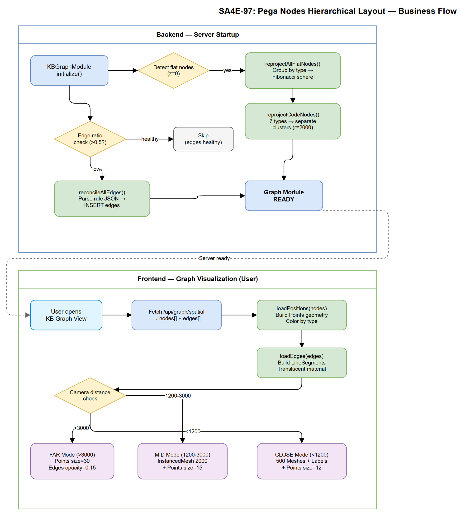

# Business Requirements Document (BRD)

## Code Intelligence Platform — SA4E-97: [Graph] Pega nodes hierarchical layout by Records tree + edges rendering

---

## Document Information

| Field | Value |
|-------|-------|
| Jira Ticket | SA4E-97 |
| Title | [Graph] Pega nodes hierarchical layout by Records tree + edges rendering |
| Author | BA Agent |
| Version | 1.0 |
| Date | 2025-07-27 |
| Status | Final (Retroactive) |

---

## Author Tracking

| Role | Name - Position | Responsibility |
|------|-----------------|----------------|
| Author | BA Agent – Business Analyst | Create document |
| Peer Reviewer | TA Agent – Technical Architect | Review document |

---

## Revision History

| Version | Date | Author | Changes |
|---------|------|--------|---------|
| 1.0 | 2025-07-27 | BA Agent | Retroactive BRD — auto-generated from implemented code for SA4E-97 |

---

## Sign-Off

| Name | Signature and date |
|------|--------------------|
| | ☐ I agree and confirm all criteria on this BRD as expected requirements |
| | ☐ I agree and confirm all criteria on this BRD as expected requirements |

---

## 1. Introduction

### 1.1 Scope

This change request addresses the 3D graph visualization of Pega nodes and code symbols in the Knowledge Base Graph. Before this feature, all 2,136+ Pega nodes were rendered on the same flat plane (z=0), making it impossible to distinguish node types visually. The feature introduces hierarchical spatial layout using Fibonacci sphere clustering, grouping nodes by their Pega Records tree category (16 categories) and code entity type (7 types), with proper LOD-based rendering and edge visibility at all zoom levels.

### 1.2 Out of Scope

- Pega rule ingestion logic (covered by separate ingestion pipeline)
- Graph database schema changes (reuses existing `graph_nodes`/`graph_edges` tables)
- User-configurable clustering parameters (fixed algorithm)
- Real-time collaborative graph editing

### 1.3 Preliminary Requirement

- SA4E-51: KB Graph Module must be operational (graph_nodes/graph_edges tables exist)
- SA4E-41: GraphSyncService must be projecting code symbols into graph_nodes
- Pega rules ingested into knowledge_entries with valid pxObjClass metadata

---

## 2. Business Requirements

### 2.1 High Level Process Map

The system must spatially organize thousands of knowledge graph nodes into visually distinct clusters based on their semantic category. When a user opens the KB Graph visualization, Pega nodes are grouped by their Records tree category (e.g., Process, Data Model, Security) and code nodes by their entity type (e.g., Class, Function, Interface). Edges representing dependencies between nodes are rendered at all zoom levels to show relationships between clusters.

### 2.2 List of User Stories / Use Cases

| # | Story / Use Case / Epic | Priority | Source Ticket |
|---|-------------------------|----------|---------------|
| 1 | As a developer, I want Pega nodes grouped by Records tree category in the 3D graph so that I can visually identify rule clusters by domain | MUST HAVE | SA4E-97 |
| 2 | As a developer, I want code symbols grouped by type (Class, Function, etc.) so that I can navigate code structure in 3D space | MUST HAVE | SA4E-97 |
| 3 | As a developer, I want dependency edges visible at all zoom levels so that I can understand relationships between node clusters | MUST HAVE | SA4E-97 |
| 4 | As a developer, I want flat nodes auto-reprojected on startup so that existing data is immediately visualized correctly without manual action | SHOULD HAVE | SA4E-97 |
| 5 | As a developer, I want the graph to perform smoothly with 2000+ nodes so that the visualization remains usable at scale | MUST HAVE | SA4E-97 |

---

### 2.3 Details of User Stories

---

#### Business Flow

**Step 1:** System starts up and KBGraphModule initializes

**Step 2:** Auto-reproject detects flat nodes (z=0) in graph_nodes table

**Step 3:** Nodes are grouped by type/category and assigned 3D positions using Fibonacci sphere algorithm

**Step 4:** Code nodes are separately reprojected with type-based clustering (CLASS, FUNCTION, METHOD, INTERFACE, ENUM, TYPE, CONSTRUCTOR)

**Step 5:** Dependency edges are auto-reconciled from stored Pega rule JSON

**Step 6:** User opens KB Graph visualization in browser

**Step 7:** Renderer loads node positions and edge data from spatial API

**Step 8:** LOD system renders nodes based on camera distance (FAR/MID/CLOSE modes)

**Step 9:** Edges rendered as translucent lines connecting related nodes across clusters

> **Note:** Steps 2-5 run asynchronously in background on every server startup. Steps 6-9 happen on-demand when user navigates to the graph view.

---

#### STORY 1: Pega Nodes Grouped by Records Tree Category

> As a developer, I want Pega nodes grouped by Records tree category in the 3D graph so that I can visually identify rule clusters by domain.

**Requirement Details:**

1. All Pega nodes (prefix `pega:*`) must be assigned to one of 16 predefined Records tree categories
2. Categories map to Pega's standard Records tree: APPLICATION_DEFINITION, DATA_MODEL, DECISION, GENERATIVE_AI, INTEGRATION_CONNECTORS, INTEGRATION_MAPPING, INTEGRATION_RESOURCES, INTEGRATION_SERVICES, ORGANIZATION, PROCESS, REPORTS, SECURITY, SURVEY, SYSADMIN, TECHNICAL, USER_INTERFACE
3. Each category forms a distinct spatial cluster on a Fibonacci sphere (radius=1500 for spatial API, radius=800 for sync service)
4. Nodes within a cluster are distributed using local Fibonacci sphere with spread proportional to sqrt(group size)
5. Unmapped node types default to TECHNICAL category

**Data Fields:**

| Field | Type | Required | Description | Example |
|-------|------|----------|-------------|---------|
| entry_id | string | Yes | Unique graph node ID | `pega:Rule-Obj-Activity:Work-Claim:ProcessClaim` |
| type | string | Yes | Records tree category | `PROCESS` |
| x, y, z | number | Yes | 3D position coordinates | `x=1200.5, y=-340.2, z=890.1` |
| level | string | No | Hierarchy level | `micro` |
| cluster_id | string | No | Cluster identifier | `code-function` |

**Acceptance Criteria:**

1. Given 2136 Pega nodes, when the graph loads, then nodes are visibly separated into distinct clusters by category
2. Given a node of type DATA_MODEL, when positioned, then it is spatially near other DATA_MODEL nodes and distant from PROCESS nodes
3. Given an unmapped pxObjClass, when projected, then it defaults to TECHNICAL category cluster
4. Given the Fibonacci sphere algorithm, when placing 16 categories, then cluster centers are evenly distributed in 3D space with no overlap

---

#### STORY 2: Code Symbols Grouped by Entity Type

> As a developer, I want code symbols grouped by type (Class, Function, etc.) so that I can navigate code structure in 3D space.

**Requirement Details:**

1. Code nodes (prefix `code:*`) are grouped by 7 entity types: CLASS, FUNCTION, METHOD, INTERFACE, ENUM, TYPE, CONSTRUCTOR
2. Each type forms a separate cluster with unique center position on Fibonacci sphere
3. Cluster radius is 800px with local spread of 120px, plus Z-offset by type (CLASS=400, INTERFACE=350, FUNCTION=200, METHOD=100, ENUM=300, TYPE=250, CONSTRUCTOR=150)
4. The `reprojectCodeNodes()` function uses larger inter-cluster distance (2000px) for wide separation

**Acceptance Criteria:**

1. Given code symbols from a project, when synced to graph, then CLASS nodes cluster together and are separate from FUNCTION nodes
2. Given a project with 500+ code symbols, when viewed in graph, then type clusters are clearly distinguishable
3. Given the renderer color map, when viewing code nodes, then each type has a distinct color (e.g., CLASS=fuchsia, FUNCTION=indigo, INTERFACE=purple)

---

#### STORY 3: Dependency Edges Visible at All Zoom Levels

> As a developer, I want dependency edges visible at all zoom levels so that I can understand relationships between node clusters.

**Requirement Details:**

1. Edges must be rendered as `THREE.LineSegments` with translucent material (opacity varies by zoom level)
2. FAR mode (distance > 3000): edges visible with opacity=0.15 (thin connecting lines between clusters)
3. MID mode (distance 1200-3000): edges visible with default opacity
4. CLOSE mode (distance < 1200): edges visible with full detail
5. Edge data fetched from `graph_edges` table alongside node positions from spatial API

**Acceptance Criteria:**

1. Given the user is zoomed out (FAR mode), when viewing the graph, then thin lines are visible connecting related clusters
2. Given the user zooms to MID level, when edges load, then they show relationships with moderate visibility
3. Given the spatial API response, when edges are present, then `loadEdges()` renders them immediately after `loadPositions()`

---

#### STORY 4: Auto-Reproject Flat Nodes on Startup

> As a developer, I want flat nodes auto-reprojected on startup so that existing data is immediately visualized correctly without manual action.

**Requirement Details:**

1. On KBGraphModule initialization, detect all nodes with z=0 (flat layout from before SA4E-97)
2. Group flat nodes by type and assign hierarchical positions using Fibonacci sphere
3. Additionally reproject all `code:*` nodes with proper type-based separation
4. Process runs asynchronously (non-blocking, non-fatal) — server startup is not delayed
5. Log count of updated nodes for observability

**Acceptance Criteria:**

1. Given 2000 nodes with z=0, when server starts, then all nodes receive non-zero z coordinates grouped by type
2. Given auto-reproject fails (e.g., DB error), when server starts, then startup completes normally with a warning log
3. Given nodes already have correct positions (z != 0), when server starts, then `reprojectAllFlatNodes` returns 0 (no unnecessary updates)

---

#### STORY 5: Graph Performance at Scale

> As a developer, I want the graph to perform smoothly with 2000+ nodes so that the visualization remains usable at scale.

**Requirement Details:**

1. LOD rendering with 3 modes prevents rendering thousands of individual meshes simultaneously
2. FAR mode: single Points draw call (point size=30) for all nodes — 1 GPU draw call regardless of node count
3. MID mode: InstancedMesh for up to 2000 nearby nodes + Points for rest (point size=15)
4. CLOSE mode: individual Mesh for 500 nearest nodes + Points for rest (point size=12)
5. Mode transitions based on camera distance to orbit target
6. Spatial API computes positions on-the-fly (no pre-stored positions needed for ad-hoc query)

**Acceptance Criteria:**

1. Given 2136 Pega nodes + 500 code nodes, when rendered in FAR mode, then frame rate stays above 30 FPS
2. Given the user zooms in to a cluster, when transitioning FAR to MID to CLOSE, then mode switches happen without visible stutter
3. Given the spatial API, when queried, then response returns positions for all nodes within 2 seconds

---

## 3. Dependencies

| Dependency | Type | Related Ticket | Description |
|------------|------|----------------|-------------|
| KB Graph Module (SA4E-51) | System | SA4E-51 | Graph node/edge storage in SQLite/PostgreSQL |
| GraphSyncService (SA4E-41) | System | SA4E-41 | Code symbol projection into graph_nodes |
| Pega Ingestion Pipeline | System | SA4E-91+ | Rules must be ingested before they can be projected |
| Three.js (r152+) | Infrastructure | N/A | WebGL 3D rendering library loaded in admin viewer |
| OrbitControls | Infrastructure | SA4E-31 | 3D camera navigation for graph visualization |
| Edge reconciliation (SA4E-98) | System | SA4E-98 | Auto-creates graph_edges from stored rule dependencies |

---

## 4. Stakeholders

| Role | Name / Team | Responsibility | Source |
|------|-------------|----------------|--------|
| Developer | Development Team | Implement and maintain graph visualization | Ticket assignee |
| End User | Developers using Code Intelligence | Navigate and explore knowledge graph | Primary user |
| Architect | SA Agent | Design spatial algorithm and module integration | Technical oversight |

---

## 5. Risks and Assumptions

### 5.1 Risks

| Risk | Impact | Likelihood | Mitigation |
|------|--------|------------|------------|
| Performance degradation with >5000 nodes | Medium | Low | LOD system limits draw calls; Fibonacci computation is O(n) |
| Cluster overlap with uneven category sizes | Low | Medium | Local spread scales with sqrt(group size), preventing overcrowding |
| Auto-reproject corrupts node positions | Medium | Low | Non-fatal: wrapped in try/catch, logs warning on failure |
| Edge count explosion with full reconciliation | Medium | Low | Edge reconciliation limited to 10,000 edges in spatial API; INSERT OR IGNORE prevents duplicates |

### 5.2 Assumptions

- Pega nodes have valid `pxObjClass` that maps to one of 16 categories via `pxObjClassToGraphType()`
- The graph_nodes table supports x, y, z, level, and cluster_id columns (schema from SA4E-51)
- Three.js and OrbitControls are available in the admin viewer HTML page
- Browser supports WebGL 2.0 for Points/InstancedMesh rendering

---

## 6. Non-Functional Requirements

| Category | Requirement | Details |
|----------|-------------|---------|
| Performance | Graph must render 2000+ nodes at 30+ FPS | LOD system with FAR/MID/CLOSE modes limits GPU draw calls |
| Performance | Spatial API response < 2 seconds for full graph | Positions computed on-the-fly grouped by type |
| Performance | Auto-reproject completes within 10 seconds on startup | Batch UPDATE queries, non-blocking background task |
| Scalability | Support up to 10,000 nodes without degradation | Fibonacci sphere distributes evenly regardless of count |
| Reliability | Auto-reproject failure must not crash server | Non-fatal try/catch with warning log |
| Usability | Distinct visual clusters per node category | Color-coded by type, spatially separated in 3D |

---

## 7. Related Tickets

| Ticket Key | Summary | Status | Type | Relationship |
|------------|---------|--------|------|--------------|
| SA4E-97 | [Graph] Pega nodes hierarchical layout by Records tree + edges rendering | Done | Story | Main ticket |
| SA4E-51 | KB Graph Module | Done | Story | Dependency (graph storage) |
| SA4E-41 | GraphSyncService — Code symbol projection | Done | Story | Dependency (code nodes) |
| SA4E-31 | 3D OrbitControls + full graph navigation | Done | Story | Dependency (camera controls) |
| SA4E-98 | Pega dependency edge extraction + reconciliation | Done | Story | Related (edge data) |
| SA4E-91 | Code edge extraction (IMPORTS, CALLS, EXTENDS) | Done | Story | Related (code edges) |

---

## 8. Appendix

### Glossary

| Term | Definition |
|------|------------|
| Fibonacci Sphere | Algorithm distributing N points evenly on a sphere surface using golden ratio |
| Records Tree | Pega's standard categorization of rules into 16 categories in Dev Studio |
| LOD (Level of Detail) | Rendering technique that reduces detail for distant objects to maintain performance |
| Cluster | A group of nodes of the same type positioned near each other in 3D space |
| Reproject | Recalculate and update spatial positions for existing nodes in the database |
| Edge Reconciliation | Process of scanning stored rule JSON to extract and insert missing dependency edges |

### Reference Documents

| Document | Link / Location |
|----------|-----------------|
| PegaGraphProjector.ts | `backend/src/modules/pega/PegaGraphProjector.ts` |
| spatial.ts (getAllPositions) | `backend/src/modules/kb-graph/service/spatial.ts` |
| kb-graph-renderer.js | `backend/src/viewer/admin/kb-graph-renderer.js` |
| graph-sync-service.ts | `backend/src/engine/graph/graph-sync-service.ts` |
| KBGraphModule.ts | `backend/src/modules/kb-graph/KBGraphModule.ts` |

### Diagram Index

| # | Diagram | Image | Source (editable) |
|---|---------|-------|-------------------|
| 1 | Use Case Diagram | [use-case.png](diagrams/use-case.png) | [use-case.drawio](diagrams/use-case.drawio) |
| 2 | Business Flow Diagram | [business-flow.png](diagrams/business-flow.png) | [business-flow.drawio](diagrams/business-flow.drawio) |
