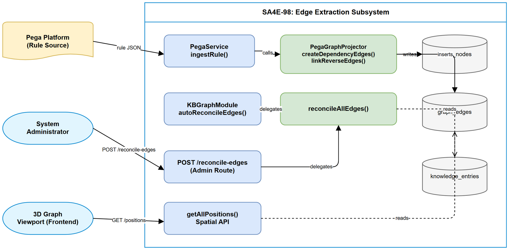
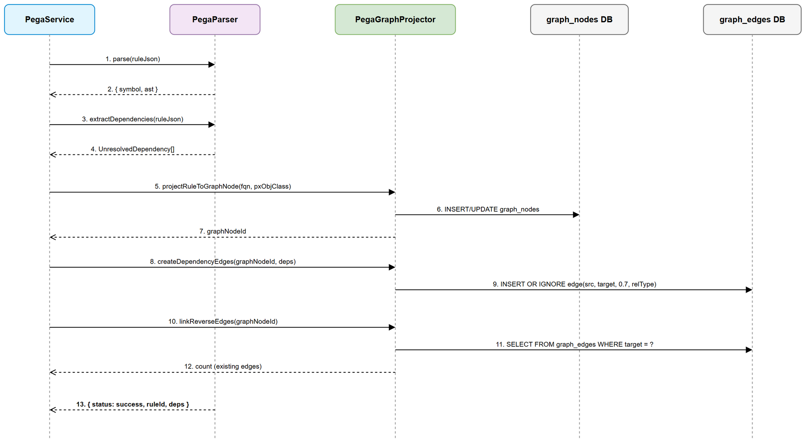
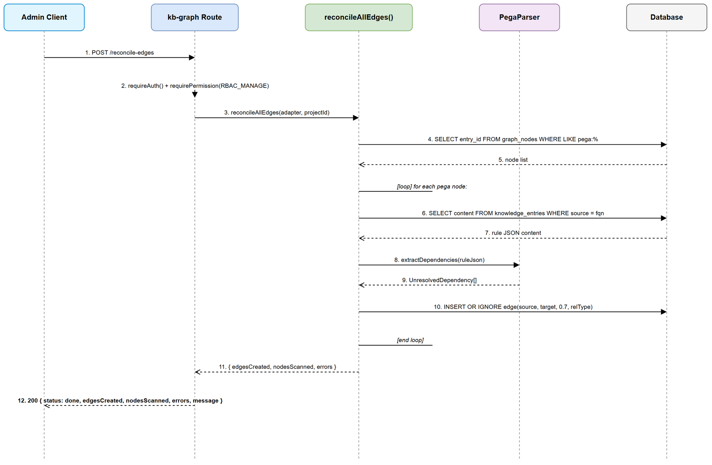
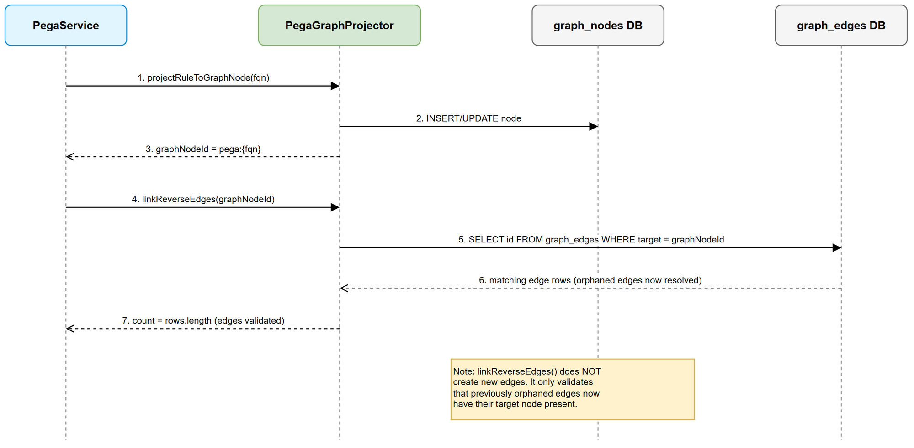
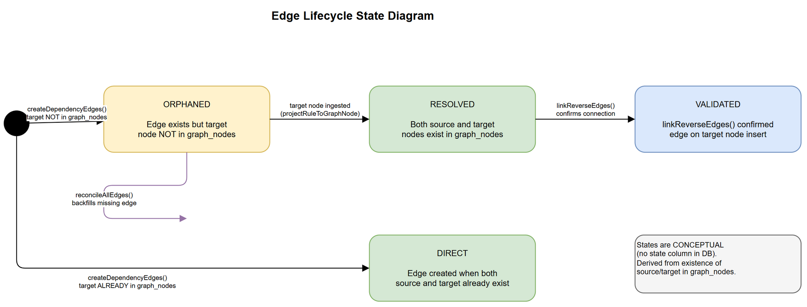

# Functional Specification Document (FSD)

## Pega Graph — SA4E-98: Real OOP Edge Extraction During Ingest + Reconciliation

---

## Document Information

| Field | Value |
|-------|-------|
| Jira Ticket | SA4E-98 |
| Title | [Pega Graph] Real OOP edge extraction during ingest + reconciliation |
| Author | BA Agent |
| Version | 1.0 |
| Date | 2025-07-27 |
| Status | Retroactive (code already implemented) |
| Related BRD | BRD-v1-SA4E-98.docx |

---

## Author Tracking

| Role | Name - Position | Responsibility |
|------|-----------------|----------------|
| Author | BA Agent – Business Analyst | Create document |
| Peer Reviewer | TA Agent – Technical Architect | Review and enrich document |

---

## Revision History

| Version | Date | Author | Changes |
|---------|------|--------|---------|
| 1.0 | 2025-07-27 | BA Agent | Retroactive FSD from implemented code |

---

## 1. Use Cases

### UC-01: Real Dependency Edge Creation During Ingest

| Field | Description |
|-------|-------------|
| ID | UC-01 |
| Title | Create dependency edges when a Pega rule is ingested |
| Actor | System (PegaService) |
| Trigger | PegaService.ingestRule() is called with a Pega rule JSON |
| Preconditions | Rule JSON is valid and parseable; graph_nodes table exists; graph_edges table exists with unique(source, target) constraint |
| Postconditions | Graph node created/updated for the rule; Forward edges inserted for each extracted dependency; Reverse-link check completed for the new node |

#### Main Flow

| Step | Actor | Action |
|------|-------|--------|
| 1 | System | Parse rule JSON via PegaParser.parse() to extract symbol metadata |
| 2 | System | Extract dependencies via PegaParser.extractDependencies() returning UnresolvedDependency[] |
| 3 | System | Call projectRuleToGraphNode(adapter, fqn, pxObjClass, projectId) to insert/update node in graph_nodes |
| 4 | System | Call createDependencyEdges(adapter, graphNodeId, deps) |
| 5 | System | For each dependency, construct targetNodeId = pega:{ruleType}:{className}:{ruleName} |
| 6 | System | Map dependency ruleType to rel_type via mapDependencyRelType() |
| 7 | System | Insert edge: (sourceNodeId, targetNodeId, 0.7, relType) with INSERT OR IGNORE |
| 8 | System | Call linkReverseEdges(adapter, graphNodeId) to query edges where target = new node |
| 9 | System | Return { status: success, ruleId, unresolvedDependencies: deps } |

#### Alternative Flow

| ID | Condition | Action |
|----|-----------|--------|
| AF-01 | Dependency list is empty | Skip createDependencyEdges(), proceed to reverse-link |
| AF-02 | Target node already exists in graph_nodes | Edge is created normally (same as forward edge) |

#### Exception Flow

| ID | Condition | Action |
|----|-----------|--------|
| EF-01 | Single edge insert fails (constraint violation or DB error) | Silently continue to next dependency (non-fatal) |
| EF-02 | Graph projection fails entirely | Catch error, ingestRule() continues — return success without graph data |
| EF-03 | Rule JSON cannot be parsed | Return error response from ingestRule() — no graph operations performed |

---

### UC-02: On-Demand Edge Reconciliation (Admin)

| Field | Description |
|-------|-------------|
| ID | UC-02 |
| Title | Admin triggers full edge reconciliation via REST API |
| Actor | System Administrator |
| Trigger | POST request to /api/admin/kb/graph/reconcile-edges |
| Preconditions | User authenticated with RBAC_MANAGE permission; graph_nodes populated with pega:* entries; knowledge_entries contains stored rule JSON |
| Postconditions | Missing edges backfilled in graph_edges; Response contains reconciliation statistics |

#### Main Flow

| Step | Actor | Action |
|------|-------|--------|
| 1 | Admin | Sends POST /api/admin/kb/graph/reconcile-edges with auth token |
| 2 | System | Validate auth via requireAuth() |
| 3 | System | Validate permission via requirePermission(userId, RBAC_MANAGE) |
| 4 | System | Get projectId from request context (optional filter) |
| 5 | System | Call reconcileAllEdges(adapter, projectId) |
| 6 | System | Query all graph_nodes WHERE entry_id LIKE 'pega:%' |
| 7 | System | For each node, retrieve rule JSON from knowledge_entries |
| 8 | System | Parse JSON and extract dependencies via PegaParser.extractDependencies() |
| 9 | System | Insert missing edges via INSERT OR IGNORE |
| 10 | System | Return { status: done, edgesCreated, nodesScanned, errors, message } |

#### Alternative Flow

| ID | Condition | Action |
|----|-----------|--------|
| AF-01 | Zero pega nodes found | Return { edgesCreated: 0, nodesScanned: 0, errors: 0 } immediately |
| AF-02 | projectId provided | Filter nodes by project_id |

#### Exception Flow

| ID | Condition | Action |
|----|-----------|--------|
| EF-01 | Authentication fails | Return 401 Unauthorized |
| EF-02 | Permission denied | Return 403 Forbidden |
| EF-03 | Individual node JSON is unparseable | Increment errors counter, continue to next node |
| EF-04 | Database error during reconciliation | Return 500 with { error, details } |

---

### UC-03: Auto-Reconciliation on Startup

| Field | Description |
|-------|-------------|
| ID | UC-03 |
| Title | System auto-reconciles edges when graph is sparse at startup |
| Actor | System (KBGraphModule) |
| Trigger | KBGraphModule.initialize() completes |
| Preconditions | KB Graph module initialized; Database accessible |
| Postconditions | If edge ratio < 0.5: missing edges backfilled; If edge ratio >= 0.5: no action taken |

#### Main Flow

| Step | Actor | Action |
|------|-------|--------|
| 1 | System | Count pega nodes: SELECT COUNT(*) FROM graph_nodes WHERE entry_id LIKE 'pega:%' |
| 2 | System | Count pega edges: SELECT COUNT(*) FROM graph_edges WHERE source LIKE 'pega:%' |
| 3 | System | Calculate ratio: edges / nodes |
| 4 | System | If ratio > 0.5 then skip reconciliation (healthy graph) |
| 5 | System | If ratio <= 0.5 then log info and call reconcileAllEdges(adapter) |
| 6 | System | Log reconciliation result: { edgesCreated, nodesScanned, errors } |

#### Alternative Flow

| ID | Condition | Action |
|----|-----------|--------|
| AF-01 | Zero pega nodes exist | Skip reconciliation entirely |
| AF-02 | Edge ratio already healthy (>0.5) | Return without action |

#### Exception Flow

| ID | Condition | Action |
|----|-----------|--------|
| EF-01 | Reconciliation throws error | Log warning (non-fatal), server continues startup normally |

---

### UC-04: Typed Relationship Edges

| Field | Description |
|-------|-------------|
| ID | UC-04 |
| Title | Edges carry semantic relationship type for graph visualization |
| Actor | System (PegaGraphProjector) |
| Trigger | Any edge creation (ingest or reconciliation) |
| Preconditions | Dependency has a ruleType field |
| Postconditions | Edge stored with correct rel_type from 8-type mapping |

#### Main Flow

| Step | Actor | Action |
|------|-------|--------|
| 1 | System | Receive dependency with ruleType string |
| 2 | System | Call mapDependencyRelType(ruleType) |
| 3 | System | Apply priority-based mapping rules (see BR-03) |
| 4 | System | Store rel_type in graph_edges row |

---

### UC-05: Reverse-Link Validation on Node Insert

| Field | Description |
|-------|-------------|
| ID | UC-05 |
| Title | Validate orphaned edges when their target node is created |
| Actor | System (PegaGraphProjector) |
| Trigger | A new graph node is projected via projectRuleToGraphNode() |
| Preconditions | Forward edges may already exist with this node as target |
| Postconditions | Count of edges pointing to this node returned (informational) |

#### Main Flow

| Step | Actor | Action |
|------|-------|--------|
| 1 | System | New node projected with graphNodeId = pega:{fqn} |
| 2 | System | Call linkReverseEdges(adapter, graphNodeId) |
| 3 | System | Query: SELECT id FROM graph_edges WHERE target = ? |
| 4 | System | Return rows.length (count of edges now resolvable) |

#### Notes

- Does NOT create new edges — only validates existing forward edges
- Returned count is informational (used for logging/metrics)

---

### UC-06: Synthetic Edge Fallback for Empty Graphs

| Field | Description |
|-------|-------------|
| ID | UC-06 |
| Title | Generate read-time synthetic edges when no real edges exist |
| Actor | System (spatial service in getAllPositions) |
| Trigger | getAllPositions() API called AND graph_edges returns 0 rows |
| Preconditions | Multiple node types exist in graph_nodes; Zero real edges in graph_edges |
| Postconditions | API response includes synthetic TYPE_BRIDGE and CLUSTER_LINK edges; No edges persisted to database |

#### Main Flow

| Step | Actor | Action |
|------|-------|--------|
| 1 | System | Query graph_edges → 0 rows returned |
| 2 | System | Group nodes by type → identify distinct clusters |
| 3 | System | Generate hub spanning tree: connect first node of each cluster (TYPE_BRIDGE, weight: 0.3) |
| 4 | System | Generate intra-cluster chains: sequential nodes within cluster (CLUSTER_LINK, weight: 0.5) |
| 5 | System | Include synthetic edges in API response alongside node positions |

#### Alternative Flow

| ID | Condition | Action |
|----|-----------|--------|
| AF-01 | Real edges exist (count > 0) | Skip synthetic generation entirely |
| AF-02 | Only 1 node type exists | No TYPE_BRIDGE edges generated |

---

## 2. Business Rules

| ID | Rule | Implementation |
|----|------|----------------|
| BR-01 | Edge creation is idempotent | INSERT OR IGNORE (SQLite) / ON CONFLICT DO NOTHING (PostgreSQL) ensures duplicate edges silently ignored |
| BR-02 | Edge creation is non-fatal | All edge operations wrapped in try/catch; failure does not abort rule ingest |
| BR-03 | Relationship type mapping follows priority order | mapDependencyRelType() checks ruleType.includes() in priority: FlowAction → Activity/Flow → Class → Property → Connect → When → Decision → Model/Transform → Section → default USES |
| BR-04 | Default edge weight is 0.7 | All Pega dependency edges use weight 0.7 |
| BR-05 | Edge target ID is deterministic | Target = pega:{ruleType}:{className}:{ruleName} from UnresolvedDependency fields |
| BR-06 | Auto-reconciliation threshold is 0.5 | If edges/nodes < 0.5, auto-reconciliation triggers on startup |
| BR-07 | Auto-reconciliation is non-blocking | Runs asynchronously during module init; does not block server readiness |
| BR-08 | Reconciliation endpoint requires RBAC_MANAGE | Only admin users with RBAC_MANAGE permission can trigger on-demand reconciliation |
| BR-09 | Synthetic edges are NOT persisted | Generated at read-time only; disappear once real edges exist |
| BR-10 | Reconciliation uses PegaParser for dependency extraction | Dynamic import of PegaParser avoids circular dependency at module level |
| BR-11 | Reverse-link is validation only | linkReverseEdges() does not create or modify edges — only counts existing edges pointing to new node |

---

## 3. System Context Diagram



---

## 4. Sequence Diagrams

### 4.1 Ingest Flow — Edge Creation During Rule Ingest



### 4.2 Reconciliation Flow — On-Demand Full Reconciliation



### 4.3 Reverse-Link Flow — Validation on Node Insert



---

## 5. State Diagram — Edge Lifecycle



An edge transitions through conceptual states:
1. **ORPHANED** — Created with forward-link but target node does not yet exist in graph_nodes
2. **RESOLVED** — Target node has been ingested; edge connects two existing nodes
3. **VALIDATED** — linkReverseEdges() has confirmed the connection on target insert

Note: State is conceptual — derived from whether both source and target exist in graph_nodes.

---

## 6. API Specifications

### POST /api/admin/kb/graph/reconcile-edges

| Property | Value |
|----------|-------|
| Method | POST |
| Path | /api/admin/kb/graph/reconcile-edges |
| Authentication | Bearer token (JWT) |
| Authorization | RBAC_MANAGE permission required |
| Content-Type | application/json |

#### Request Headers

| Header | Required | Description |
|--------|----------|-------------|
| Authorization | Yes | Bearer {jwt_token} |
| X-Project-Id | No | Filter reconciliation to specific project |

#### Request Body

None required (empty body or {}).

#### Response 200 OK

```json
{
  "status": "done",
  "edgesCreated": 142,
  "nodesScanned": 85,
  "errors": 2,
  "message": "Reconciled 85 nodes, created 142 edges (2 errors)."
}
```

| Field | Type | Description |
|-------|------|-------------|
| status | string | Always "done" on success |
| edgesCreated | number | Count of new edges inserted |
| nodesScanned | number | Count of pega nodes processed |
| errors | number | Count of nodes with parse/extraction failures |
| message | string | Human-readable summary |

#### Response 401 Unauthorized

```json
{ "error": "Authentication required" }
```

#### Response 403 Forbidden

```json
{ "error": "Permission denied", "details": "RBAC_MANAGE permission required" }
```

#### Response 500 Internal Server Error

```json
{ "error": "Reconciliation failed", "details": "Database connection lost" }
```

---

## 7. Data Model

### graph_edges Table Schema

| Column | Type | Constraints | Description |
|--------|------|-------------|-------------|
| id | INTEGER | PRIMARY KEY AUTOINCREMENT | Unique edge identifier |
| source | TEXT | NOT NULL | Source node entry_id (pega:{fqn}) |
| target | TEXT | NOT NULL | Target node entry_id (pega:{fqn}) |
| weight | REAL | NOT NULL DEFAULT 0.5 | Edge strength (0.0-1.0); Pega deps use 0.7 |
| rel_type | TEXT | NOT NULL DEFAULT 'RELATED_TO' | Relationship type (8 Pega types) |
| | | UNIQUE(source, target) | Prevents duplicate edges |

### UnresolvedDependency Interface

```typescript
interface UnresolvedDependency {
  insKey?: string;    // Pega instance key (optional)
  ruleType: string;   // e.g. "Rule-Obj-Activity", "Rule-Obj-Flow"
  className: string;  // e.g. "Work-Claim"
  ruleName: string;   // e.g. "ProcessClaim"
}
```

### Target Node ID Construction

```
targetNodeId = `pega:${dep.ruleType}:${dep.className}:${dep.ruleName}`
```

---

## 8. Error Handling

| Error Scenario | HTTP Status | Recovery Action |
|----------------|-------------|-----------------|
| Unauthenticated request | 401 | Client must provide valid JWT |
| Insufficient permissions | 403 | Client needs RBAC_MANAGE role |
| Single edge insert failure | N/A (internal) | Silently continue; non-fatal |
| Rule JSON parse failure during reconciliation | N/A (internal) | Increment error counter; continue |
| Database connection error | 500 | Retry after checking DB connectivity |
| Graph projection failure during ingest | N/A (internal) | Log error; ingest continues without graph data |
| Auto-reconciliation failure on startup | N/A (internal) | Log warning; server starts normally |

### Error Handling Philosophy

- **Non-fatal by design**: All edge operations are secondary to rule ingestion
- **Fail-open**: If edge creation fails, the rule is still ingested successfully
- **Idempotent retry**: Re-running reconciliation is safe (INSERT OR IGNORE)
- **Progressive enhancement**: Graph improves over time as more rules are ingested

---

## 9. Non-Functional Requirements

| ID | Category | Requirement | Target |
|----|----------|-------------|--------|
| NFR-01 | Performance | Edge creation latency per rule during ingest | < 50ms |
| NFR-02 | Performance | Full reconciliation for 1,500 nodes | < 30 seconds |
| NFR-03 | Performance | Reverse-link check per new node | < 5ms |
| NFR-04 | Reliability | Edge operations non-fatal | 100% — never blocks ingest |
| NFR-05 | Scalability | Maximum Pega nodes per project | 5,000 |
| NFR-06 | Data Integrity | Reconciliation idempotency | Repeated runs produce identical results |
| NFR-07 | Availability | Auto-reconciliation non-blocking | Does not delay server readiness |
| NFR-08 | Security | Reconciliation endpoint access control | RBAC_MANAGE permission required |

---

## 10. Diagram Index

| # | Diagram | Image | Source (editable) |
|---|---------|-------|-------------------|
| 1 | System Context | [system-context.png](diagrams/system-context.png) | [system-context.drawio](diagrams/system-context.drawio) |
| 2 | Sequence: Ingest Flow | [sequence-ingest.png](diagrams/sequence-ingest.png) | [sequence-ingest.drawio](diagrams/sequence-ingest.drawio) |
| 3 | Sequence: Reconciliation Flow | [sequence-reconciliation.png](diagrams/sequence-reconciliation.png) | [sequence-reconciliation.drawio](diagrams/sequence-reconciliation.drawio) |
| 4 | Sequence: Reverse-Link Flow | [sequence-reverse-link.png](diagrams/sequence-reverse-link.png) | [sequence-reverse-link.drawio](diagrams/sequence-reverse-link.drawio) |
| 5 | State: Edge Lifecycle | [state-edge-lifecycle.png](diagrams/state-edge-lifecycle.png) | [state-edge-lifecycle.drawio](diagrams/state-edge-lifecycle.drawio) |

---

## 11. Traceability Matrix

| BRD Story | Use Case | Business Rules |
|-----------|----------|----------------|
| Story 1 — Real Dependency Edge Creation | UC-01 | BR-01, BR-02, BR-03, BR-04, BR-05 |
| Story 2 — On-Demand Reconciliation | UC-02 | BR-01, BR-08, BR-10 |
| Story 3 — Auto-Reconciliation on Startup | UC-03 | BR-06, BR-07, BR-10 |
| Story 4 — Typed Relationships | UC-04 | BR-03 |
| Story 5 — Reverse-Link Validation | UC-05 | BR-11 |
| Story 6 — Synthetic Edge Fallback | UC-06 | BR-09 |
