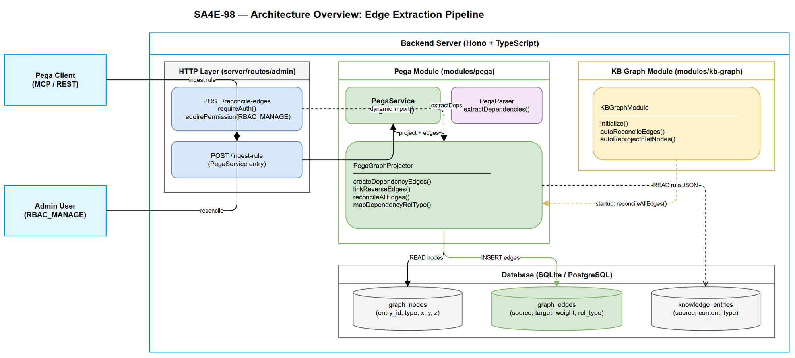
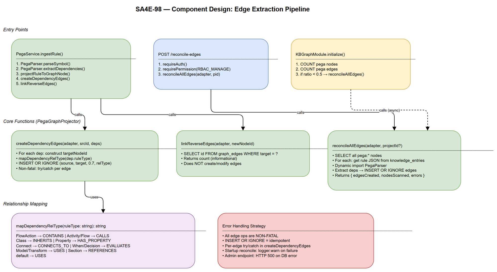

# Technical Design Document (TDD)

## Pega Graph — SA4E-98: Real OOP Edge Extraction During Ingest + Reconciliation

---

## Document Information

| Field | Value |
|-------|-------|
| Jira Ticket | SA4E-98 |
| Title | [Pega Graph] Real OOP edge extraction during ingest + reconciliation |
| Author | SA Agent |
| Version | 1.0 |
| Date | 2025-07-27 |
| Status | Retroactive (code already implemented) |
| Related BRD | BRD-v1-SA4E-98.docx |
| Related FSD | FSD-v1-SA4E-98.docx |

---

## Author Tracking

| Role | Name - Position | Responsibility |
|------|-----------------|----------------|
| Author | SA Agent – Solution Architect | Create document |
| Peer Reviewer | BA Agent – Business Analyst | Review for BRD/FSD completeness |

---

## Revision History

| Version | Date | Author | Changes |
|---------|------|--------|---------|
| 1.0 | 2025-07-27 | SA Agent | Retroactive TDD from implemented code |

---

## 1. Architecture Overview

### 1.1 System Context

SA4E-98 extends the existing Pega Knowledge Graph system (SA4E-51, SA4E-97) with a multi-strategy edge extraction pipeline. The feature operates within three modules:

| Module | Layer | Responsibility |
|--------|-------|----------------|
| `pega` | Business Logic | Edge extraction, dependency mapping, graph projection |
| `kb-graph` | Infrastructure | Module lifecycle, startup hooks, graph persistence |
| `server/routes/admin` | HTTP Layer | Admin REST API for on-demand reconciliation |

### 1.2 Data Flow

```
Pega Rule JSON → PegaService.ingestRule()
    → PegaParser.extractDependencies() → UnresolvedDependency[]
    → PegaGraphProjector.projectRuleToGraphNode() → graphNodeId
    → PegaGraphProjector.createDependencyEdges(graphNodeId, deps) → graph_edges rows
    → PegaGraphProjector.linkReverseEdges(graphNodeId) → count of existing edges
```

**Reconciliation flow:**
```
KBGraphModule.initialize() → autoReconcileEdges()
    → COUNT(graph_nodes pega:*) / COUNT(graph_edges pega:*) → ratio
    → if ratio < 0.5 → reconcileAllEdges(adapter)
        → For each pega:* node → knowledge_entries → PegaParser → INSERT OR IGNORE edges
```

### 1.3 Module Relationships



---

## 2. Component Design

### 2.1 PegaGraphProjector (Primary Component)

**File:** `backend/src/modules/pega/PegaGraphProjector.ts`

**Responsibility:** Projects Pega rules into `graph_nodes` and creates/validates dependency edges in `graph_edges`.

**SA4E-98 additions:**
- `createDependencyEdges()` — Forward edge creation during ingest
- `linkReverseEdges()` — Reverse validation when target node arrives
- `reconcileAllEdges()` — Full backfill from stored rule JSON
- `mapDependencyRelType()` — 8-type relationship mapping

### 2.2 KBGraphModule (Lifecycle Hook)

**File:** `backend/src/modules/kb-graph/KBGraphModule.ts`

**Responsibility:** Module initialization, auto-reconciliation on startup.

**SA4E-98 additions:**
- `autoReconcileEdges()` — Private startup hook that checks edge/node ratio and triggers reconciliation if sparse

### 2.3 Admin Routes (HTTP Layer)

**File:** `backend/src/server/routes/admin/kb-graph.ts`

**Responsibility:** Exposes admin REST endpoint for on-demand reconciliation.

**SA4E-98 additions:**
- `POST /api/admin/kb/graph/reconcile-edges` — RBAC-protected reconciliation trigger

### 2.4 PegaService (Integration Point)

**File:** `backend/src/modules/pega/PegaService.ts`

**Responsibility:** Orchestrates ingest pipeline; calls graph projection and edge creation.

**SA4E-98 integration:**
- `ingestRule()` calls `projectRuleToGraphNode()` → `createDependencyEdges()` → `linkReverseEdges()` within a non-fatal try/catch



---

## 3. API Design

### 3.1 POST /api/admin/kb/graph/reconcile-edges

| Property | Value |
|----------|-------|
| Method | POST |
| Path | `/api/admin/kb/graph/reconcile-edges` |
| Authentication | Bearer JWT |
| Authorization | `RBAC_MANAGE` permission |
| Content-Type | application/json |

#### Request

No body required. Optional header `X-Project-Id` to scope reconciliation.

#### Response 200 OK

```json
{
  "status": "done",
  "edgesCreated": 142,
  "nodesScanned": 85,
  "errors": 2,
  "message": "Reconciled 85 nodes, created 142 edges (2 errors)."
}
```

#### Response 401 / 403 / 500

| Status | Condition | Body |
|--------|-----------|------|
| 401 | Missing/invalid JWT | `{ "error": "Authentication required" }` |
| 403 | No RBAC_MANAGE | `{ "error": "Permission denied", "details": "..." }` |
| 500 | DB error | `{ "error": "Reconciliation failed", "details": "..." }` |

---

## 4. Class/Module Design — Method Signatures

### 4.1 PegaGraphProjector (exported functions)

```typescript
/**
 * SA4E-98: Create graph edges from a rule node to its extracted dependencies.
 * Uses INSERT OR IGNORE for idempotent duplicate handling.
 */
export async function createDependencyEdges(
  adapter: DatabaseAdapter,
  sourceNodeId: string,
  deps: UnresolvedDependency[],
): Promise<void>;

/**
 * SA4E-98: Reverse-link — count existing edges targeting a newly created node.
 * Validates that previously-created forward edges are now resolvable.
 * @returns Count of edges pointing to newNodeId.
 */
export async function linkReverseEdges(
  adapter: DatabaseAdapter,
  newNodeId: string,
): Promise<number>;

/**
 * SA4E-98: Full reconciliation — scan all pega:* nodes, re-extract deps, backfill edges.
 * @returns { edgesCreated, nodesScanned, errors }
 */
export async function reconcileAllEdges(
  adapter: DatabaseAdapter,
  projectId?: string,
): Promise<{ edgesCreated: number; nodesScanned: number; errors: number }>;

/**
 * SA4E-98: Map Pega rule type string to one of 8 relationship types.
 * Priority: FlowAction > Activity/Flow > Class > Property > Connect > When/Decision > Model/Transform > Section
 * Default fallback: 'USES'
 */
function mapDependencyRelType(ruleType: string): string;
```

### 4.2 Relationship Type Mapping (8 types)

| Priority | ruleType.includes() | Mapped rel_type | Semantic |
|----------|---------------------|-----------------|----------|
| 1 | `FlowAction` | CONTAINS | Flow contains FlowAction steps |
| 2 | `Activity` or `Flow` | CALLS | Rule calls Activity/Flow |
| 3 | `Class` | INHERITS | Class inheritance |
| 4 | `Property` | HAS_PROPERTY | Class owns Property |
| 5 | `Connect` | CONNECTS_TO | Connector to external system |
| 6 | `When` | EVALUATES | References When rule |
| 7 | `Decision` | EVALUATES | References Decision |
| 8 | `Model` or `Transform` | USES | Data Transform/Model usage |
| 9 | `Section` | REFERENCES | Section embeds Section |
| default | — | USES | Fallback |

### 4.3 KBGraphModule.autoReconcileEdges()

```typescript
/**
 * SA4E-98: Private startup hook. Non-blocking, non-fatal.
 * Checks edge/node ratio for pega:* entries.
 * If ratio <= 0.5 → triggers reconcileAllEdges().
 */
private async autoReconcileEdges(): Promise<void>;
```

### 4.4 Target Node ID Construction

```typescript
// Deterministic target ID from UnresolvedDependency
const targetNodeId = `pega:${dep.ruleType}:${dep.className}:${dep.ruleName}`;
```

### 4.5 Edge Schema

```sql
INSERT OR IGNORE INTO graph_edges (source, target, weight, rel_type)
VALUES (?, ?, 0.7, ?);
-- PostgreSQL variant:
INSERT INTO graph_edges (source, target, weight, rel_type)
VALUES ($1, $2, $3, $4) ON CONFLICT (source, target) DO NOTHING;
```

---

## 5. Error Handling Strategy

### 5.1 Design Philosophy

All edge operations are **non-fatal** by design. The primary business operation (rule ingest) must never fail due to secondary graph operations.

### 5.2 Error Handling Matrix

| Context | Strategy | Implementation |
|---------|----------|----------------|
| Single edge insert failure | Silent continue | `try { await insert } catch { /* non-fatal */ }` |
| Graph projection in ingestRule | Non-fatal catch-all | `try { ... } catch { /* non-fatal graph projection */ }` |
| JSON parse in reconciliation | Count + continue | `errors++; continue;` |
| Dependency extraction failure | Count + continue | `errors++; continue;` |
| Auto-reconciliation on startup | Log warning, continue | `logger.warn(...)` in catch block |
| Admin endpoint DB failure | Return 500 | `c.json({ error, details }, 500)` |

### 5.3 Idempotency Guarantee

- `INSERT OR IGNORE` (SQLite) / `ON CONFLICT (source, target) DO NOTHING` (PostgreSQL)
- Repeated reconciliation produces identical graph state
- No UPDATE — edges are immutable once created
- Safe for concurrent execution (duplicate INSERT is silently ignored)

---

## 6. Security Design

### 6.1 Endpoint Protection

| Control | Implementation |
|---------|----------------|
| Authentication | `ctx.requireAuth(c)` — validates JWT Bearer token |
| Authorization | `ctx.requirePermission(c, userId, 'RBAC_MANAGE')` — admin-only |
| 401 response | Missing/expired token |
| 403 response | Valid token but no RBAC_MANAGE permission |

### 6.2 Data Security

| Concern | Mitigation |
|---------|------------|
| SQL injection | Parameterized queries (`?` / `$N` placeholders) — no string concatenation |
| Unauthorized data access | Reconciliation scoped by `projectId` from request context |
| Denial of service | Reconciliation bounded by stored node count; no external input drives iteration |
| Data integrity | UNIQUE(source, target) constraint prevents duplicate edges |

### 6.3 Internal Operations (No Auth Required)

- `createDependencyEdges()` — called within `PegaService.ingestRule()` (already authenticated at route level)
- `linkReverseEdges()` — internal graph consistency check
- `autoReconcileEdges()` — system startup hook, no user context

---

## 7. Database Design

### 7.1 Tables Used

| Table | Role in SA4E-98 |
|-------|-----------------|
| `graph_nodes` | Read: scan pega:* nodes for reconciliation |
| `graph_edges` | Write: INSERT new dependency edges |
| `knowledge_entries` | Read: retrieve stored rule JSON for reconciliation |

### 7.2 Key Queries

```sql
-- Count pega nodes (startup ratio check)
SELECT COUNT(*) as cnt FROM graph_nodes WHERE entry_id LIKE 'pega:%';

-- Count pega edges (startup ratio check)
SELECT COUNT(*) as cnt FROM graph_edges WHERE source LIKE 'pega:%';

-- Scan all pega nodes (reconciliation)
SELECT entry_id FROM graph_nodes WHERE entry_id LIKE 'pega:%';

-- Get stored rule JSON (reconciliation)
SELECT content FROM knowledge_entries
WHERE source = ? AND (type = 'PEGA_RULE' OR type = 'PEGA_DATA') LIMIT 1;

-- Reverse-link check
SELECT e.id FROM graph_edges e WHERE e.target = ?;
```

### 7.3 Edge Table Constraints

```sql
-- UNIQUE constraint ensures idempotent INSERT
UNIQUE(source, target)
```

---

## 8. Non-Functional Design Decisions

| NFR | Design Decision |
|-----|-----------------|
| < 50ms per rule (edge creation) | Sequential INSERT per dependency; no batch optimization needed |
| < 30s for 1500 nodes (reconciliation) | Sequential scan; dynamic import avoids circular dependency |
| < 5ms reverse-link | Single indexed SELECT on `graph_edges.target` |
| Non-blocking startup | `autoReconcileEdges()` runs as fire-and-forget async |
| Engine-agnostic | `adapter.getEngine()` switch for SQL dialect (sqlite vs postgresql) |
| Circular dependency avoidance | `reconcileAllEdges()` uses `await import('./PegaParser.js')` |

---

## 9. Implementation Checklist

| # | Component | File | Status |
|---|-----------|------|--------|
| 1 | `createDependencyEdges()` | PegaGraphProjector.ts | ✅ Done |
| 2 | `linkReverseEdges()` | PegaGraphProjector.ts | ✅ Done |
| 3 | `reconcileAllEdges()` | PegaGraphProjector.ts | ✅ Done |
| 4 | `mapDependencyRelType()` (8 types) | PegaGraphProjector.ts | ✅ Done |
| 5 | `ingestRule()` integration | PegaService.ts | ✅ Done |
| 6 | `POST /api/admin/kb/graph/reconcile-edges` | kb-graph.ts routes | ✅ Done |
| 7 | `autoReconcileEdges()` startup hook | KBGraphModule.ts | ✅ Done |
| 8 | Edge/node ratio threshold (0.5) | KBGraphModule.ts | ✅ Done |
| 9 | Non-fatal error wrapping in ingestRule | PegaService.ts | ✅ Done |
| 10 | Dynamic PegaParser import in reconcile | PegaGraphProjector.ts | ✅ Done |

---

## 10. Traceability Matrix

| BRD Story | FSD Use Case | TDD Component | Method |
|-----------|--------------|---------------|--------|
| Story 1 — Edge Creation During Ingest | UC-01 | PegaGraphProjector | createDependencyEdges() |
| Story 2 — On-Demand Reconciliation | UC-02 | Admin Route + PegaGraphProjector | POST reconcile-edges → reconcileAllEdges() |
| Story 3 — Auto-Reconciliation Startup | UC-03 | KBGraphModule | autoReconcileEdges() |
| Story 4 — Typed Relationships | UC-04 | PegaGraphProjector | mapDependencyRelType() |
| Story 5 — Reverse-Link Validation | UC-05 | PegaGraphProjector | linkReverseEdges() |
| Story 6 — Synthetic Edge Fallback | UC-06 | Spatial service (getAllPositions) | Read-time generation (pre-existing) |

---

## 11. Diagram Index

| # | Diagram | Image | Source (editable) |
|---|---------|-------|-------------------|
| 1 | Architecture Diagram | [architecture.png](diagrams/architecture.png) | [architecture.drawio](diagrams/architecture.drawio) |
| 2 | Component Diagram | [component.png](diagrams/component.png) | [component.drawio](diagrams/component.drawio) |

---

## 12. Appendix

### A. Dependencies

| Dependency | Version | Purpose |
|------------|---------|---------|
| DatabaseAdapter | Internal | Engine-agnostic DB access |
| PegaParser | Internal | extractDependencies() |
| Hono | ^4.x | HTTP framework for admin route |
| Pino | ^8.x | Structured logging |

### B. Configuration

| Parameter | Default | Location |
|-----------|---------|----------|
| Edge weight | 0.7 | Hardcoded in createDependencyEdges |
| Reconciliation threshold | 0.5 | Hardcoded in autoReconcileEdges |
| Synthetic bridge weight | 0.3 | Hardcoded in spatial service |
| Synthetic cluster link weight | 0.5 | Hardcoded in spatial service |

### C. Glossary

| Term | Definition |
|------|------------|
| Forward Edge | Edge created at ingest time; target may not yet exist in graph_nodes |
| Reverse-Link | Validation: when new node arrives, count existing edges pointing to it |
| Reconciliation | Full scan re-extracting deps from stored JSON to backfill graph_edges |
| Edge/Node Ratio | edges_count / nodes_count; threshold 0.5 determines "sparse" |
| FQN | Fully Qualified Name: `{ruleType}:{className}:{ruleName}` |
