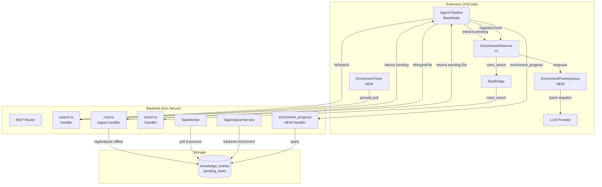
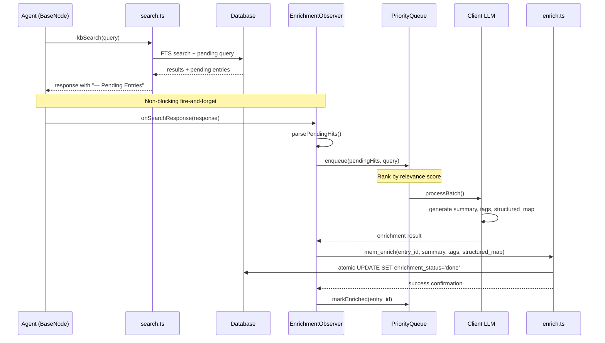
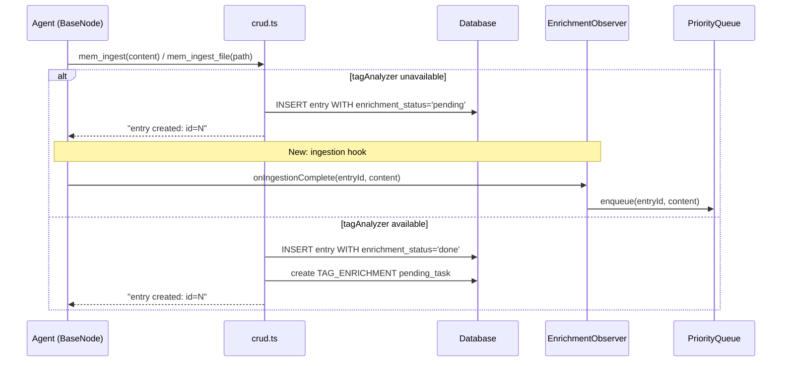
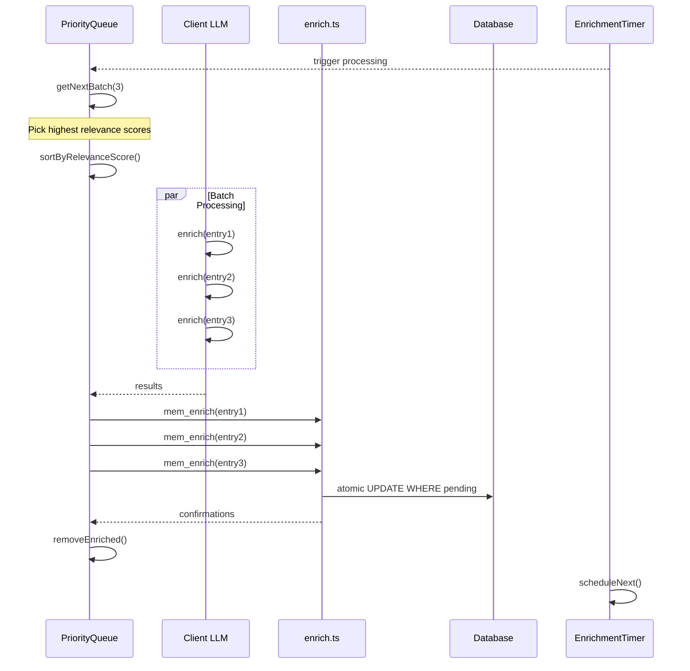
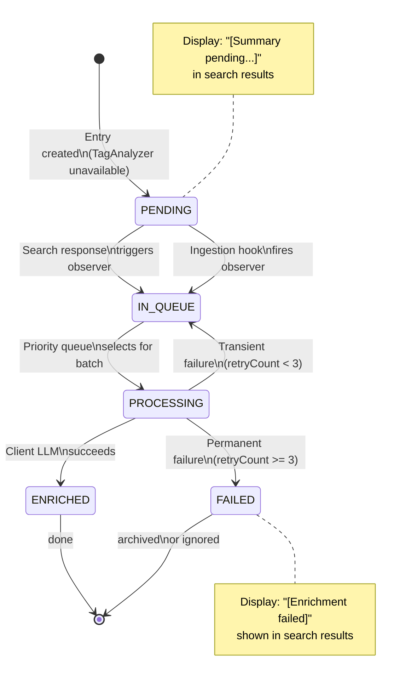
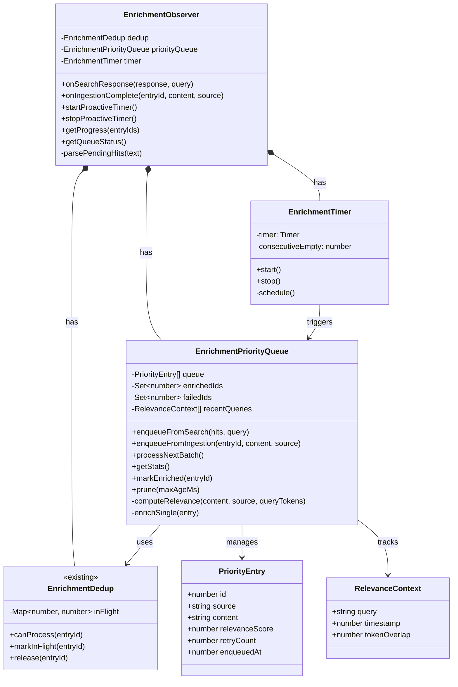
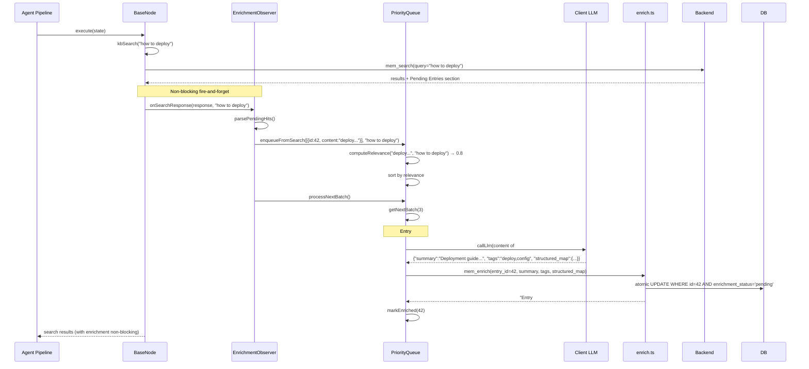
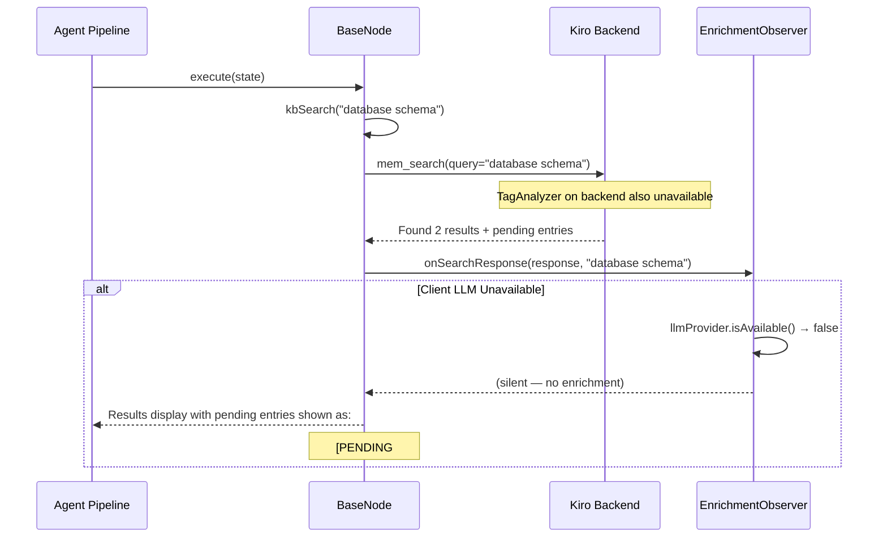

# Technical Design Document — Client-Side LLM Knowledge Enrichment v2

| **Field** | **Value** |
|---|---|
| **Document ID** | TDD-v1-SA4E-ENRICHMENT |
| **Ticket Key** | SA4E-ENRICHMENT |
| **Author** | Solution Architect |
| **Status** | Draft |
| **Version** | 1.0 |
| **Date** | 2026-07-30 |

---

## Table of Contents

1. [Introduction](#1-introduction)
2. [System Architecture](#2-system-architecture)
3. [API Design](#3-api-design)
4. [Database Design](#4-database-design)
5. [Class/Module Design](#5-classmodule-design)
6. [Integration Design](#6-integration-design)
7. [Security Design](#7-security-design)
8. [Performance & Scalability](#8-performance--scalability)
9. [Monitoring & Observability](#9-monitoring--observability)
10. [Deployment](#10-deployment)
11. [E2E Test Architecture](#11-e2e-test-architecture)

---

## 1. Introduction

### 1.1 Purpose

This document describes the technical design for the **Client-Side LLM Knowledge Enrichment v2** feature. It extends the existing SA4E-79 enrichment subsystem to address five identified gaps:

1. **Proactive enrichment trigger** — Currently enrichment only fires reactively when a search response happens to include pending entries in the top 3.
2. **Priority enrichment** — Enrich the most relevant pending entries first (relevance to recent queries), not just the most recent.
3. **Ingestion-time trigger** — After `mem_ingest_file` or `mem_ingest`, if the backend TagAnalyzer is unavailable, immediately queue the entry for client-side enrichment.
4. **Client-side fallback** — When client LLM is also unavailable, entries should still render gracefully in search results with a clear "un-enriched" state.
5. **Progress tracking** — The agent should be able to query enrichment status programmatically.

### 1.2 Scope

| **In Scope** | **Out of Scope** |
|---|---|
| Client-side priority queue for enrichment | Backend enrichment algorithm changes |
| Proactive enrichment timer/trigger | TagAnalyzer service changes |
| `enrichment_progress` tool | Embedding pipeline changes |
| Fallback display for un-enriched entries | UI changes (agent-facing text only) |
| Ingestion-time enrichment hook | Graph node enrichment |

### 1.3 References

| **Document** | **Description** |
|---|---|
| FSD-SA4E-ENRICHMENT | Functional Specification for enrichment (SA4E-79 baseline) |
| BRD-SA4E-ENRICHMENT | Business Requirements for enrichment v2 |
| `extension/src/langgraph/enrichment/EnrichmentObserver.ts` | Current client-side enrichment observer |
| `backend/src/modules/memory/dispatchers/search.ts` | Current search handler with pending entries |
| `backend/src/modules/memory/dispatchers/crud.ts` | Current ingest handler |
| `backend/src/modules/memory/dispatchers/enrich.ts` | Current enrich handler |
| `backend/src/modules/memory/task-queue/TaskWorker.ts` | Current backend task worker |

### 1.4 Technology Stack

| **Layer** | **Technology** |
|---|---|
| Extension language | TypeScript (ES2022+) |
| Backend language | TypeScript (Node.js 18+, ES modules) |
| Database | SQLite / PostgreSQL (via DatabaseAdapter abstraction) |
| Client LLM | Anthropic / OpenAI / Ollama / LM Studio / OpenRouter (via LlmProvider interface) |
| Backend LLM | TagAnalyzerService (local LLM via LM Studio/Ollama) |
| Communication | MCP protocol over HTTP (JSON-RPC 2.0) |

### 1.5 Design Principles

1. **Non-blocking (BR-07)** — Client enrichment must never block the agent's pipeline.
2. **Idempotent enrichment** — An entry should only be enriched once; racing client and backend must be safe (BR-13).
3. **Graceful degradation** — Unavailable LLM must not crash the pipeline; entries render with fallback display.
4. **Priority by relevance** — Most query-relevant pending entries enriched first, not just most recent.
5. **Observable progress** — Agent must be able to query enrichment status programmatically.

---

## 2. System Architecture

### 2.1 High-Level Architecture

The enrichment system spans three layers:



*[Edit in draw.io](diagrams/architecture.drawio)*

### 2.2 Component Responsibilities

| **Component** | **Layer** | **Responsibility** |
|---|---|---|
| `EnrichmentObserver` | Extension | Detects pending entries from search responses and after ingestion; pushes to priority queue |
| `EnrichmentPriorityQueue` | Extension | **NEW** — Maintains a ranked list of pending entries ordered by relevance to recent queries |
| `EnrichmentTimer` | Extension | **NEW** — Periodic timer that proactively triggers `mem_search` for pending entries when queue is low |
| `LlmProvider` | Extension | Client-side LLM that generates summary, tags, structured_map |
| `EnrichmentDedup` | Extension | Prevents concurrent enrichment of same entry |
| `search.ts` | Backend | Returns up to 3 pending entries; now also accepts optional `pending_only` flag |
| `crud.ts` | Backend | On ingest: sets `enrichment_status='pending'` when TagAnalyzer unavailable; now also creates `CLIENT_ENRICHMENT` pending_task |
| `enrich.ts` | Backend | Atomic `enrichment_status='pending' → 'done'` transition |
| `enrichment_progress.ts` | Backend | **NEW** — Returns enrichment status for specified entries or pending count |
| `TaskWorker` | Backend | Polls pending_tasks; skips if already enriched by client |

### 2.3 Data Flow

#### Flow A: Reactive Enrichment (on Search)



#### Flow B: Proactive Enrichment (Ingestion-Time)



#### Flow C: Priority Queue Processing



### 2.4 Deployment Architecture

No new deployment units. The extension is a VSCode extension loaded into the agent process. The backend is the existing Kiro MCP server. All changes are in-process additions to existing modules.


---

## 3. API Design

### 3.1 Existing: `mem_enrich` (Unchanged)

See `enrich.ts` definition — no changes needed. Retained for backward compatibility.

| **Field** | **Value** |
|---|---|
| Method | MCP tool |
| Tool name | `mem_enrich` |
| Auth | Project scope required |
| Rate limit | None (per-entry atomic) |

### 3.2 NEW: `enrichment_progress` Tool

Returns enrichment status for specified entries or aggregate counts.

**Tool Definition** (added to `backend/src/modules/memory/definitions/enrich.ts`):

```typescript
{
  name: 'enrichment_progress',
  description: 'Query enrichment status of KB entries. Returns status per entry or aggregate counts.',
  inputSchema: {
    type: 'object',
    properties: {
      entry_ids: {
        type: 'array',
        items: { type: 'number' },
        description: 'Specific entry IDs to query (optional — omit for aggregate)',
      },
    },
  },
}
```

**Response** (JSON string):

```json
{
  "entries": [
    { "id": 42, "enrichment_status": "pending", "enriched_by": null, "enriched_at": null },
    { "id": 43, "enrichment_status": "done", "enriched_by": "client_llm", "enriched_at": "2026-07-30T12:00:00Z" }
  ],
  "summary": {
    "pending": 5,
    "done": 120,
    "total": 125
  },
  "pending_details": [
    { "id": 44, "source": "file.ts", "age_seconds": 3600 }
  ]
}
```

**Implementation** (`backend/src/modules/memory/dispatchers/enrich-progress.ts`):

```typescript
export async function handleEnrichmentProgress(
  engine: MemoryEngine,
  a: Args,
): Promise<string> {
  const entryIds = a.entry_ids as number[] | undefined;

  if (entryIds && entryIds.length > 0) {
    const placeholders = entryIds.map(() => '?').join(',');
    const rows = await engine.getAdapter().allAsync(
      `SELECT id, enrichment_status, enriched_by, enriched_at
       FROM knowledge_entries WHERE id IN (${placeholders})`,
      entryIds,
    );
    return JSON.stringify({ entries: rows });
  }

  // Aggregate query
  const stats = await engine.getAdapter().allAsync(
    `SELECT enrichment_status, COUNT(*) as cnt
     FROM knowledge_entries WHERE archived = 0
     GROUP BY enrichment_status`,
  );
  const pendingRows = await engine.getAdapter().allAsync(
    `SELECT id, source,
            CAST((julianday('now') - julianday(created_at)) * 86400 AS INTEGER) as age_seconds
     FROM knowledge_entries
     WHERE enrichment_status = 'pending' AND archived = 0
     ORDER BY created_at ASC LIMIT 20`,
  );

  const summary: Record<string, number> = {};
  let total = 0;
  for (const row of stats) {
    summary[row.enrichment_status] = row.cnt;
    total += row.cnt;
  }
  summary['total'] = total;

  return JSON.stringify({ summary, pending_details: pendingRows });
}
```

### 3.3 Modified: `mem_search` (Pending Filter Enhancement)

Add optional `pending_first` parameter to prioritize pending entries:

| **Parameter** | **Type** | **Required** | **Description** |
|---|---|---|---|
| `query` | string | yes | Search query |
| `limit` | number | no | Max results (default: 10) |
| `scope` | string | no | Scope filter ('USER' \| 'PROJECT' \| 'SHARED' \| 'all') |
| `pending_first` | boolean | no | If true, interleave pending entries at top (default: false) |

When `pending_first=true`, the search handler:
1. Runs normal FTS search
2. Also queries up to 3 pending entries
3. Orders them: pending entries first (sorted by relevance score), then normal results
4. Appends remaining pending entries (beyond 3) in the "--- Pending Entries" section

### 3.4 Modified: `mem_ingest` / `mem_ingest_file` (Response Enhancement)

Both handlers now return the entry ID and enrichment_status in their response:

**Current response**: `Knowledge entry created: id=42, type=CONTEXT, scope=USER...`

**New response**: `Knowledge entry created: id=42, type=CONTEXT, scope=USER, enrichment_status=pending - "summary text"`

This allows the extension to detect ingestion-complete events and trigger client enrichment immediately.

### 3.5 Error Response Format (All Endpoints)

All error responses follow existing convention:

```
Error: {description}
```

No JSON errors per existing pattern.

| **Status** | **Meaning** |
|---|---|
| `Entry #42 enriched successfully. Status: done. Enriched by: client_llm.` | Success |
| `Error: Entry #42 already enriched (status=done)` | Conflict — already enriched |
| `Error: Entry #42 not found` | Not found |
| `Error: Project scope required for enrichment` | Auth failure |

---

## 4. Database Design

### 4.1 Existing Schema (Unchanged)

The `knowledge_entries` table already has enrichment columns from migration 007:

```sql
-- Existing columns (SA4E-79)
ALTER TABLE knowledge_entries ADD COLUMN enrichment_status TEXT NOT NULL DEFAULT 'done';
ALTER TABLE knowledge_entries ADD COLUMN enriched_by TEXT DEFAULT NULL;
ALTER TABLE knowledge_entries ADD COLUMN enriched_at TEXT DEFAULT NULL;

-- Partial index for fast pending queries (SA4E-79)
CREATE INDEX IF NOT EXISTS idx_ke_enrichment_pending
  ON knowledge_entries(enrichment_status)
  WHERE enrichment_status = 'pending';
```

### 4.2 NEW: `CLIENT_ENRICHMENT` Task Type

Add a new task type to the existing `pending_tasks` table (no DDL change — uses the existing enum-like pattern):

```typescript
// backend/src/modules/memory/task-queue/models.ts
export enum TaskType {
  TAG_ENRICHMENT = 'TAG_ENRICHMENT',
  VECTOR_EMBEDDING = 'VECTOR_EMBEDDING',
  CLIENT_ENRICHMENT = 'CLIENT_ENRICHMENT', // NEW
}
```

**Purpose**: When the backend creates `CLIENT_ENRICHMENT` tasks during ingest (because TagAnalyzer is unavailable), the extension can poll for these tasks to know which entries need client-side enrichment. This addresses Gap 2 (ingestion-time trigger).

**Payload**:
```json
{
  "entry_id": 42,
  "content_preview": "first 200 chars of content",
  "source": "file.ts"
}
```

### 4.3 Index Strategy

| **Index** | **Columns** | **Type** | **Purpose** |
|---|---|---|---|
| `idx_ke_enrichment_pending` | enrichment_status | Partial (WHERE pending) | Fast lookup of pending entries for search appendix (existing) |
| `idx_pt_enrichment_pending` | task_type, status | Composite | Fast lookup of CLIENT_ENRICHMENT pending tasks (NEW) |

**New index DDL**:

```sql
CREATE INDEX IF NOT EXISTS idx_pt_client_enrichment
  ON pending_tasks(task_type, status)
  WHERE task_type = 'CLIENT_ENRICHMENT' AND status = 'PENDING';
```

### 4.4 Query Patterns

#### Q1: Get pending entries for an agent session (with priority scoring)

```sql
SELECT ke.id, ke.source, ke.content,
       ke.created_at,
       c.citation_count
FROM knowledge_entries ke
LEFT JOIN (
  SELECT target_id, COUNT(*) as citation_count
  FROM graph_edges
  WHERE relation = 'citation'
  GROUP BY target_id
) c ON c.target_id = ke.id
WHERE ke.enrichment_status = 'pending'
  AND ke.archived = 0
  AND (ke.project_id = ? OR ke.scope = 'SHARED')
ORDER BY
  c.citation_count DESC NULLS LAST,
  ke.access_count DESC,
  ke.created_at ASC
LIMIT 5;
```

**Purpose**: Returns pending entries prioritized by citation frequency → access count → age, so the most valuable entries get enriched first.

#### Q2: Get pending entries for priority queue (lightweight)

```sql
SELECT id, source, content
FROM knowledge_entries
WHERE enrichment_status = 'pending'
  AND archived = 0
ORDER BY created_at ASC
LIMIT 3;
```

**Purpose**: Used by search.ts to append pending section. Simple FIFO for the reactive path.

#### Q3: Client enrichment task query (extension-side polling)

```sql
SELECT id, entry_id, payload
FROM pending_tasks
WHERE task_type = 'CLIENT_ENRICHMENT'
  AND status = 'PENDING'
ORDER BY created_at ASC
LIMIT 10;
```

**Purpose**: Extension polls for CLIENT_ENRICHMENT tasks after ingestion (Gap 2).


---

## 5. Class/Module Design

### 5.1 Extension — New Files

#### 5.1.1 `EnrichmentPriorityQueue` — NEW

**File**: `extension/src/langgraph/enrichment/EnrichmentPriorityQueue.ts`

```typescript
/**
 * EnrichmentPriorityQueue — Client-side priority queue for pending entries.
 * Maintains a ranked list ordered by relevance to recent queries.
 * Entries with higher citation count, recent query matches, or explicit priority
 * are enriched first. Non-blocking — fires enrichments in background batches.
 */

interface PriorityEntry {
  id: number;
  source: string;
  content: string;
  /** Relevance score computed from recent query context */
  relevanceScore: number;
  /** Number of times this entry has been retried */
  retryCount: number;
  /** Timestamp when enqueued */
  enqueuedAt: number;
}

interface RelevanceContext {
  query: string;
  timestamp: number;
  /** Token overlap between query and entry content/summary */
  tokenOverlap: number;
}

/** Max entries in the queue before oldest are dropped */
const MAX_QUEUE_SIZE = 100;
/** Entries enriched per batch */
const BATCH_SIZE = 3;
/** Max retries before entry is marked as permanent failure */
const MAX_RETRIES = 3;

export class EnrichmentPriorityQueue {
  private queue: PriorityEntry[] = [];
  private enrichedIds: Set<number> = new Set();
  private failedIds: Set<number> = new Set();
  private recentQueries: RelevanceContext[] = [];
  private processing = false;

  constructor(
    private readonly dedup: EnrichmentDedup,
    private readonly mcpBridge: McpBridge,
    private readonly llmProvider: LlmProvider | undefined,
  ) {}

  /**
   * Enqueue entries from a search response, ranked by relevance to the query.
   * Updates relevance scores for existing entries in the queue.
   */
  enqueueFromSearch(hits: PendingHit[], query: string): void {
    // Record query context for relevance scoring
    this.recordQuery(query);

    const queryTokens = this.tokenize(query);

    for (const hit of hits) {
      if (this.enrichedIds.has(hit.id) || this.failedIds.has(hit.id)) continue;
      if (this.queue.some(e => e.id === hit.id)) {
        // Update existing entry's relevance score
        const existing = this.queue.find(e => e.id === hit.id)!;
        existing.relevanceScore = Math.max(
          existing.relevanceScore,
          this.computeRelevance(hit.content, hit.source, queryTokens),
        );
        continue;
      }

      this.queue.push({
        id: hit.id,
        source: hit.source,
        content: hit.content,
        relevanceScore: this.computeRelevance(hit.content, hit.source, queryTokens),
        retryCount: 0,
        enqueuedAt: Date.now(),
      });
    }

    // Sort by relevance (desc) then enqueue time (asc)
    this.queue.sort((a, b) => b.relevanceScore - a.relevanceScore || a.enqueuedAt - b.enqueuedAt);

    // Trim to max size
    if (this.queue.length > MAX_QUEUE_SIZE) {
      this.queue = this.queue.slice(0, MAX_QUEUE_SIZE);
    }
  }

  /**
   * Enqueue a single entry from ingestion hook.
   * Gives medium priority (between "just seen in search" and "old pending").
   */
  enqueueFromIngestion(entryId: number, content: string, source: string): void {
    if (this.enrichedIds.has(entryId) || this.failedIds.has(entryId)) return;
    if (this.queue.some(e => e.id === entryId)) return;

    this.queue.push({
      id: entryId,
      source,
      content,
      relevanceScore: 0.5, // Default medium priority
      retryCount: 0,
      enqueuedAt: Date.now(),
    });
  }

  /**
   * Process the next batch of entries (highest relevance first).
   * Returns true if batch was dispatched.
   */
  async processNextBatch(): Promise<boolean> {
    if (this.processing) return false;
    if (!this.llmProvider || !(await this.llmProvider.isAvailable())) return false;

    const batch = this.getNextBatch(BATCH_SIZE);
    if (batch.length === 0) return false;

    this.processing = true;
    const results = await Promise.allSettled(
      batch.map(entry => this.enrichSingle(entry)),
    );

    let successCount = 0;
    for (let i = 0; i < batch.length; i++) {
      const result = results[i];
      const entry = batch[i];

      if (result.status === 'fulfilled' && result.value) {
        this.enrichedIds.add(entry.id);
        this.removeFromQueue(entry.id);
        successCount++;
      } else {
        entry.retryCount++;
        if (entry.retryCount >= MAX_RETRIES) {
          this.failedIds.add(entry.id);
          this.removeFromQueue(entry.id);
        }
      }
    }

    this.processing = false;
    return successCount > 0;
  }

  /** Get queue statistics for diagnostic use */
  getStats(): { pending: number; enriched: number; failed: number } {
    return {
      pending: this.queue.length,
      enriched: this.enrichedIds.size,
      failed: this.failedIds.size,
    };
  }

  /** Mark an entry as enriched without going through LLM (e.g., backend enriched it) */
  markEnriched(entryId: number): void {
    this.enrichedIds.add(entryId);
    this.removeFromQueue(entryId);
  }

  /** Clear stale enriched/failed sets to prevent unbounded growth */
  prune(maxAgeMs = 300_000): void {
    const cutoff = Date.now() - maxAgeMs;
    // Keep enriched/failed sets limited to avoid memory leaks
    if (this.enrichedIds.size > 1000) this.enrichedIds.clear();
    if (this.failedIds.size > 1000) this.failedIds.clear();
    this.queue = this.queue.filter(e => e.enqueuedAt > cutoff);
    this.recentQueries = this.recentQueries.filter(q => q.timestamp > cutoff);
  }

  // ── Private ──

  private getNextBatch(count: number): PriorityEntry[] {
    return this.queue
      .filter(e => this.dedup.canProcess(e.id))
      .slice(0, count);
  }

  private recordQuery(query: string): void {
    this.recentQueries.push({ query, timestamp: Date.now(), tokenOverlap: 0 });
    if (this.recentQueries.length > 20) this.recentQueries.shift();
  }

  private tokenize(text: string): Set<string> {
    return new Set(
      text.toLowerCase()
        .replace(/[^\w\s]/g, '')
        .split(/\s+/)
        .filter(t => t.length > 2),
    );
  }

  private computeRelevance(content: string, source: string, queryTokens: Set<string>): number {
    if (queryTokens.size === 0) return 0.5; // Default medium priority

    const contentTokens = this.tokenize(content + ' ' + source);
    let overlap = 0;
    for (const token of queryTokens) {
      if (contentTokens.has(token)) overlap++;
    }
    return overlap / queryTokens.size;
  }

  private removeFromQueue(entryId: number): void {
    this.queue = this.queue.filter(e => e.id !== entryId);
  }

  private async enrichSingle(entry: PriorityEntry): Promise<boolean> {
    this.dedup.markInFlight(entry.id);
    try {
      // Reuse existing EnrichmentObserver's enrichSingle logic
      return await this.callEnrichment(entry);
    } finally {
      this.dedup.release(entry.id);
    }
  }

  private async callEnrichment(entry: PriorityEntry): Promise<boolean> {
    try {
      const response = await this.callLlm(entry.content);
      const metadata = JSON.parse(response);
      if (!metadata.summary || metadata.summary.length === 0) return false;

      const summary = String(metadata.summary).slice(0, 500);
      const tags = String(metadata.tags || '').slice(0, 500);
      const result = await this.mcpBridge.callTool('mem_enrich', {
        entry_id: entry.id,
        summary,
        tags,
        structured_map: metadata.structured_map || undefined,
      }, 30_000);
      return !result.includes('Error:');
    } catch {
      return false;
    }
  }

  private async callLlm(content: string): Promise<string> {
    const messages = [
      { role: 'system' as const, content: ENRICHMENT_SYSTEM_PROMPT },
      { role: 'user' as const, content: buildEnrichmentUserPrompt(content) },
    ];
    return this.llmProvider!.chat(messages, {
      maxTokens: 1000,
      temperature: 0.3,
      signal: AbortSignal.timeout(30_000),
    });
  }
}
```

#### 5.1.2 `EnrichmentTimer` — NEW

**File**: `extension/src/langgraph/enrichment/EnrichmentTimer.ts`

```typescript
/**
 * EnrichmentTimer — SA4E-ENRICHMENT
 * Proactive timer that periodically triggers enrichment processing.
 * Fires when:
 * 1. Queue has pending entries and client LLM is available
 * 2. The timer interval has elapsed
 * 3. No other batch is currently processing
 *
 * Implements exponential backoff for empty queue (like TaskWorker).
 * Configurable interval: 10s (active) → 60s (idle).
 */

import { EnrichmentPriorityQueue } from './EnrichmentPriorityQueue';

/** Default poll interval when queue has items (ms). */
const ACTIVE_INTERVAL_MS = 10_000;
/** Default poll interval when queue is empty (ms). */
const IDLE_INTERVAL_MS = 60_000;

export class EnrichmentTimer {
  private timer: ReturnType<typeof setInterval> | null = null;
  private running = false;
  private consecutiveEmpty = 0;

  constructor(
    private readonly queue: EnrichmentPriorityQueue,
    private readonly config?: {
      activeInterval?: number;
      idleInterval?: number;
    },
  ) {}

  start(): void {
    if (this.running) return;
    this.running = true;
    this.schedule();
  }

  stop(): void {
    this.running = false;
    if (this.timer) {
      clearTimeout(this.timer);
      this.timer = null;
    }
  }

  private schedule(): void {
    if (!this.running) return;
    const interval = this.consecutiveEmpty > 3
      ? (this.config?.idleInterval ?? IDLE_INTERVAL_MS)
      : (this.config?.activeInterval ?? ACTIVE_INTERVAL_MS);

    this.timer = setTimeout(async () => {
      if (!this.running) return;
      try {
        const hadWork = await this.queue.processNextBatch();
        this.consecutiveEmpty = hadWork ? 0 : this.consecutiveEmpty + 1;
      } catch (err) {
        console.warn('[EnrichmentTimer] batch processing failed:', err);
        this.consecutiveEmpty++;
      }
      this.schedule();
    }, interval);
  }
}
```

### 5.2 Extension — Modified Files

#### 5.2.1 `EnrichmentObserver` — Modified

**Changes**:

1. Replace inline LLM enrichment calls with delegation to `EnrichmentPriorityQueue`
2. Add `onIngestionComplete()` method for ingestion-time trigger
3. Keep `onSearchResponse()` as entry point — now delegates to priority queue
4. Add observer for `CLIENT_ENRICHMENT` pending_tasks

```typescript
export class EnrichmentObserver {
  private dedup = new EnrichmentDedup();
  private priorityQueue: EnrichmentPriorityQueue;
  private timer: EnrichmentTimer;

  constructor(
    private readonly mcpBridge: McpBridge,
    private readonly llmProvider: LlmProvider | undefined,
  ) {
    this.priorityQueue = new EnrichmentPriorityQueue(dedup, mcpBridge, llmProvider);
    this.timer = new EnrichmentTimer(this.priorityQueue);
  }

  /** Called after every kbSearch response — existing behavior enhanced */
  onSearchResponse(responseText: string, query?: string): void {
    const pendingHits = this.parsePendingHits(responseText);
    if (pendingHits.length === 0) return;

    this.priorityQueue.enqueueFromSearch(pendingHits, query || '');
    // Fire-and-forget — non-blocking
    this.priorityQueue.processNextBatch();
  }

  /** NEW: Called after kbIngest / kbIngestFile when enrichment_status='pending' */
  onIngestionComplete(entryId: number, content: string, source: string): void {
    this.priorityQueue.enqueueFromIngestion(entryId, content, source);
    this.priorityQueue.processNextBatch();
  }

  /** NEW: Start proactive timer */
  startProactiveTimer(): void {
    this.timer.start();
  }

  /** NEW: Stop proactive timer */
  stopProactiveTimer(): void {
    this.timer.stop();
  }

  /** NEW: Query enrichment progress from backend */
  async getProgress(entryIds?: number[]): Promise<string> {
    return this.mcpBridge.callTool('enrichment_progress', {
      entry_ids: entryIds,
    }, 10_000);
  }

  /** Queue stats for diagnostics */
  getQueueStats() {
    return this.priorityQueue.getStats();
  }

  // ... existing parsePendingHits() unchanged ...
}
```

#### 5.2.2 `BaseNode` — Modified

**Changes**:

1. Pass `query` to `onSearchResponse()` for relevance scoring
2. Add `onIngestionComplete` hook in `kbIngest` and `kbIngestFile`
3. Wire `enrichment_progress` tool

```typescript
// In kbSearch():
protected kbSearch(query: string, limit = 10, scope?: string) {
  const resultPromise = this.callMcp('mem_search', { query, limit, ...(scope ? { scope } : {}) });
  resultPromise.then(response => {
    // NEW: pass query for relevance scoring
    this.getEnrichmentObserver()?.onSearchResponse(response, query);
  }).catch(() => { /* non-fatal */ });
  return resultPromise;
}

// In kbIngest():
protected async kbIngest(content: string, type: string, source: string, tags: string[], scope: string = 'USER') {
  try {
    const result = await this.callMcp('mem_ingest', { content, type, source, tags, scope });
    // NEW: Detect pending status from response
    if (result.includes('enrichment_status=pending')) {
      const idMatch = result.match(/id=(\d+)/);
      if (idMatch) {
        this.getEnrichmentObserver()?.onIngestionComplete(
          parseInt(idMatch[1]), content, source
        );
      }
    }
  } catch (err) {
    console.warn(`[BaseNode:${this.nodeId}] kbIngest failed (non-fatal): ${(err as Error).message}`);
  }
}

// In kbIngestFile():
protected async kbIngestFile(filePath: string, type = 'DOCUMENT', scope: string = 'USER') {
  try {
    const result = await this.callMcp('mem_ingest_file', { file_path: filePath, type, scope });
    // NEW: If response indicates entries created with pending status, trigger enrichment
    if (result.includes('enrichment_status=pending') || result.includes('"entries":')) {
      // Parse entry count and trigger batch enrichment for the file
      this.getEnrichmentObserver()?.startProactiveTimer();
    }
  } catch (err) {
    console.warn(`[BaseNode:${this.nodeId}] kbIngestFile failed (non-fatal): ${(err as Error).message}`);
  }
}

// NEW: Progress query
protected async kbEnrichmentProgress(entryIds?: number[]): Promise<string> {
  try {
    return await this.getEnrichmentObserver()?.getProgress(entryIds) || '{}';
  } catch {
    return '{}';
  }
}
```

### 5.3 Backend — New Files

#### 5.3.1 `enrich-progress.ts` — NEW

**File**: `backend/src/modules/memory/dispatchers/enrich-progress.ts`

See [Section 3.2](#32-new-enrichment_progress-tool) for full implementation.

#### 5.3.2 Tool Definition Update

**File**: `backend/src/modules/memory/definitions/enrich.ts`

Add `enrichment_progress` to `ENRICH_TOOLS` array.

### 5.4 Backend — Modified Files

#### 5.4.1 `crud.ts` — Modified

**Change**: On ingest, when `tagAnalyzer` is unavailable, also create a `CLIENT_ENRICHMENT` pending_task so the extension can poll for it.

```typescript
// In handleIngest(), after setting enrichment_status='pending':
if (!tagAnalyzer) {
  // NEW: Create CLIENT_ENRICHMENT task for extension polling
  const taskRepo = new PendingTaskRepository(dbAdapter);
  await taskRepo.create({
    task_type: TaskType.CLIENT_ENRICHMENT,
    entry_id: id,
    payload: {
      entry_id: id,
      content_preview: content.slice(0, 200),
      source: source || 'ingest',
    },
  });
}
```

#### 5.4.2 `search.ts` — Modified

**Change**: Accept `pending_first` parameter for prioritized pending results.

```typescript
export async function handleSearch(engine, scopeCtx, a: Args): Promise<string> {
  const query = a.query as string;
  const pendingFirst = a.pending_first as boolean ?? false;
  // ... existing search logic ...

  if (pendingFirst) {
    // Interleave pending entries at top of results
    const pendingHits = await queryPendingEntries(engine, scopeCtxResolved);
    if (pendingHits.length > 0) {
      const normalResults = results; // save normal results
      results = []; // rebuild with pending first
      for (const pe of pendingHits) {
        results.push({
          entry: {
            id: pe.id,
            type: 'PENDING',
            summary: `[Pending enrichment] ${pe.content.slice(0, 100)}...`,
            content: pe.content,
            // ... other fields with defaults ...
          },
          score: 999, // force top
          matchType: 'pending',
        });
      }
      results.push(...normalResults);
    }
  }

  // ... existing pending appendix logic ...
}
```

#### 5.4.3 `TaskWorker.ts` — Modified

**Change**: Skip `CLIENT_ENRICHMENT` tasks (client handles those).

```typescript
// In processTask():
case TaskType.CLIENT_ENRICHMENT:
  // Client-side enrichment — skip in worker
  this.logger.debug({ task_id: task.id, entry_id: task.entry_id },
    'Skipping CLIENT_ENRICHMENT task — handled by extension');
  await this.repo.markCompleted(task.id);
  break;
```

### 5.5 Error Handling Strategy

| **Scenario** | **Error** | **Action** |
|---|---|---|
| Client LLM unavailable | `llmProvider.isAvailable()` returns false | Skip batch, wait for timer retry |
| LLM timeout (>30s) | AbortSignal timeout | Return false, increment retry count |
| LLM returns invalid JSON | JSON.parse throws | Return false, increment retry count |
| `mem_enrich` returns Error | `result.includes('Error:')` | Return false, increment retry count |
| Entry already enriched (race) | `"already enriched"` | `markEnriched()` — remove from queue |
| Backend unreachable | MCP bridge throws | Graceful: log warning, retry next cycle |
| Queue full (>100 entries) | N/A | Drop oldest, log warning |

### 5.6 State Diagram



*[Edit in draw.io](diagrams/state-enrichment.drawio)*

### 5.7 Class Diagram



*[Edit in draw.io](diagrams/class-diagram.drawio)*


---

## 6. Integration Design

### 6.1 MCP Tool Interactions

| **Tool** | **Caller** | **Callee** | **Protocol** | **Timeout** |
|---|---|---|---|---|
| `mem_search` | BaseNode | backend/search.ts | MCP (JSON-RPC) | 60s |
| `mem_ingest` | BaseNode | backend/crud.ts | MCP (JSON-RPC) | 120s |
| `mem_ingest_file` | BaseNode | backend/crud.ts | MCP (JSON-RPC) | 300s |
| `mem_enrich` | EnrichmentQueue | backend/enrich.ts | MCP (JSON-RPC) | 30s |
| `enrichment_progress` | BaseNode | backend/enrich-progress.ts | MCP (JSON-RPC) | 10s |

### 6.2 Client LLM Integration

The client LLM (via `LlmProvider` interface) is used for enrichment in these scenarios:

| **Scenario** | **Trigger** | **LLM Provider** | **Timeout** |
|---|---|---|---|
| Search-reactive | `onSearchResponse()` | Client (current active provider) | 30s |
| Ingestion-driven | `onIngestionComplete()` | Client (current active provider) | 30s |
| Timer-driven | `EnrichmentTimer` tick | Client (current active provider) | 30s |

The existing `LlmProvider` abstraction is sufficient — no changes needed to the LLM provider interface.

### 6.3 Retry Policy

| **Layer** | **Max Retries** | **Backoff** | **Circuit Breaker** |
|---|---|---|---|
| Priority queue retry | 3 per entry | None (immediate retry in next batch) | After 3 failures, entry is permanently marked `FAILED` |
| Timer processing | N/A | Exponential: 10s → 20s → 40s → 60s (idle) | After 5 consecutive empty cycles, timer enters idle mode (60s interval) |
| MCP tool call | N/A (handled by MCP bridge) | N/A | N/A (MCP bridge has its own timeout) |

### 6.4 Sequence Diagrams for Key Scenarios

#### Scenario 1: Search → Detect → Enrich



#### Scenario 2: Bulk File Ingest → Trigger Enrichment

```mermaid
sequenceDiagram
    participant Agent as Agent Pipeline
    participant BN as BaseNode
    participle Backend
    participant CR as crud.ts
    participant EO as EnrichmentObserver
    participant PQ as PriorityQueue
    participant LM as Client LLM

    Agent->>BN: execute(state)
    BN->>BN: kbIngestFile("docs/readme.md")
    BN->>Backend: mem_ingest_file(file_path="docs/readme.md")
    Backend->>CR: handleIngestFile()
    Note over CR: TagAnalyzer unavailable
    CR->>DB: INSERT 5 entries with enrichment_status='pending'
    CR->>DB: INSERT CLIENT_ENRICHMENT tasks for each
    CR-->>Backend: {"status":"ingested","entries":5}
    Backend-->>BN: response

    BN->>BN: parse response → 5 entries created, enrichment_status=pending
    BN->>EO: startProactiveTimer()

    EO->>EO: EnrichmentTimer starts (10s interval)
    Note over EO: Timer fires after 10s

    EO->>PQ: processNextBatch()
    PQ->>PQ: getNextBatch(3) → picks entries from ingestion
    PQ->>LM: callLlm(content of entry #1)
    LM-->>PQ: enrichment result
    PQ->>Backend: mem_enrich(entry_id=1, ...)
    PQ->>LM: callLlm(content of entry #2)
    LM-->>PQ: enrichment result
    PQ->>Backend: mem_enrich(entry_id=2, ...)
    PQ->>LM: callLlm(content of entry #3)
    LM-->>PQ: enrichment result
    PQ->>Backend: mem_enrich(entry_id=3, ...)

    Note over EO: Next timer cycle after 10s
    EO->>PQ: processNextBatch()
    PQ->>PQ: getNextBatch(3) → entries #4, #5
    ... continues until all 5 entries enriched ...
```

#### Scenario 3: Fallback Display (LLM Unavailable)



---

## 7. Security Design

### 7.1 Authentication & Authorization

All MCP tools require project scope — no changes. The `enrichment_progress` tool reuses the same `ScopeContext` pattern:

```typescript
// Scope enforcement in enrich-progress.ts
if (!scopeCtx?.projectId) {
  return 'Error: Project scope required';
}
```

### 7.2 Input Validation

| **Tool** | **Parameter** | **Validation** | **Sanitization** |
|---|---|---|---|
| `enrichment_progress` | `entry_ids` | Each must be positive integer | N/A (read-only) |
| Existing `mem_enrich` | `summary` | Max 500 chars | `sanitizeText()` removes `<>` |
| Existing `mem_enrich` | `tags` | Max 500 chars | `sanitizeText()` removes `<>` |
| Existing `mem_enrich` | `structured_map` | Schema validation (F-02) | JSON.stringify |

### 7.3 Data at Rest

No changes. Enrichment data (summary, tags, structured_map) is stored in the existing `knowledge_entries` table with the same security properties.

### 7.4 Injection Defense

The `sanitizeText()` function in `enrich-validation.ts` already removes angle brackets (`<>`) to prevent stored XSS. The new `enrichment_progress` tool is read-only and returns JSON — no injection surface.

---

## 8. Performance & Scalability

### 8.1 Caching Strategy

| **Cache** | **Location** | **TTL** | **Size Limit** | **Purpose** |
|---|---|---|---|---|
| Enriched IDs Set | Extension (memory) | 5 min (pruned) | 1000 entries | Prevents re-enrichment of already-done entries |
| Failed IDs Set | Extension (memory) | 5 min (pruned) | 1000 entries | Prevents retrying permanently failed entries |
| Priority Queue | Extension (memory) | 10 min (dropped) | 100 entries | Limits memory usage for pending queue |

### 8.2 Configurable Parameters

| **Parameter** | **Global Config Key** | **Default** | **Range** | **Description** |
|---|---|---|---|---|
| `MAX_ENTRIES_PER_BATCH` | `enrichment.batchSize` | 3 | 1–10 | Max entries enriched per LLM batch |
| `LLM_TIMEOUT_MS` | `enrichment.llmTimeout` | 30 000 | 5000–120 000 | LLM enrichment timeout (ms) |
| `MAX_CONSECUTIVE_FAILURES` | `enrichment.maxFailures` | 3 | 1–10 | Max failures before logging warning |
| `ACTIVE_INTERVAL_MS` | `enrichment.activeInterval` | 10 000 | 2000–60 000 | Timer interval when queue has items (ms) |
| `IDLE_INTERVAL_MS` | `enrichment.idleInterval` | 60 000 | 10 000–300 000 | Timer interval when queue is empty (ms) |
| `MAX_QUEUE_SIZE` | `enrichment.maxQueueSize` | 100 | 10–500 | Max entries in priority queue |
| `MAX_RETRIES` | `enrichment.maxRetries` | 3 | 1–5 | Max retries per entry before permanent failure |

### 8.3 Query Optimization

| **Query** | **Index Used** | **Expected Performance** |
|---|---|---|
| Q1: Get prioritized pending entries | `idx_ke_enrichment_pending` (partial) | < 5ms for < 1000 pending rows |
| Q2: Get FIFO pending entries | `idx_ke_enrichment_pending` (partial) | < 2ms for < 1000 pending rows |
| Q3: Get CLIENT_ENRICHMENT tasks | `idx_pt_client_enrichment` (new) | < 2ms for < 100 pending tasks |

### 8.4 Load Testing Targets

| **Metric** | **Target** |
|---|---|
| Time to detect pending entries after search | < 100ms (synchronous parse, non-blocking) |
| Time to start enrichment after ingestion | < 10s (next timer tick) |
| Latency impact on search response | 0ms (non-blocking fire-and-forget) |
| Max concurrent enrichment calls | 3 (batch size) |
| Memory overhead for queue | < 50KB for 100 entries at 500 chars each |
| Timer overhead | 1 tick per interval (10s–60s), < 1ms CPU per tick |

### 8.5 Horizontal Scaling

No changes needed. The extension operates per-agent-process. Each agent has its own priority queue and timer. The backend handles concurrent `mem_enrich` calls safely via atomic `UPDATE WHERE`.

---

## 9. Monitoring & Observability

### 9.1 Logging Standards

| **Component** | **Logger** | **Format** | **Levels** |
|---|---|---|---|
| EnrichmentObserver | `console.warn/info/debug` | `[EnrichmentObserver] message` | Error, Warn, Info |
| PriorityQueue | `console.warn/debug` | `[PriorityQueue] message` | Warn, Debug |
| EnrichmentTimer | `console.warn` | `[EnrichmentTimer] message` | Warn |
| Backend (enrich-progress) | `pino` | Structured JSON | Info, Warn |

### 9.2 Metrics to Collect

| **Metric** | **Source** | **How to Expose** |
|---|---|---|
| Queue size (pending count) | `PriorityQueue.getStats().pending` | Via `enrichment_progress` tool or console log |
| Entries enriched per minute | EnrichmentObserver counter | Accumulate in memory, log every 10 batches |
| Enrichment success rate | EnrichmentObserver `(successes / total) * 100` | Log every 10 batches |
| Average LLM response time | Date.now() diff around `callLlm` | Log per call |
| Timer cycle count | EnrichmentTimer counter | Log on every 100th cycle |
| Backend pending_count | DB query | Via `enrichment_progress` summary |

### 9.3 Health Check

No new health check endpoint. The existing MCP list-tools mechanism confirms `enrichment_progress` is registered.

### 9.4 Alerting Thresholds

| **Condition** | **Alert** | **Action** |
|---|---|---|
| `consecutiveFailures >= 3` | Warning log | Operator checks client LLM health |
| Queue size > 50 | Warning log | Backend enrichment may be overloaded |
| `enrichment_progress` pending count > 100 | Warning log | Backlog growing — consider increasing batch size |
| All entries failed enrichment | Warning log | Client LLM may be misconfigured |

---

## 10. Deployment

### 10.1 Files Changed

| **File** | **Change Type** | **Impact** |
|---|---|---|
| `extension/src/langgraph/enrichment/EnrichmentObserver.ts` | Modified | Added `onIngestionComplete()`, `startProactiveTimer()`, delegates to PriorityQueue |
| `extension/src/langgraph/enrichment/EnrichmentPriorityQueue.ts` | **NEW** | Core priority queue logic |
| `extension/src/langgraph/enrichment/EnrichmentTimer.ts` | **NEW** | Proactive polling timer |
| `extension/src/langgraph/enrichment/index.ts` | Modified | Export new classes |
| `extension/src/langgraph/core/base-node.ts` | Modified | `kbSearch` passes query, `kbIngest`/`kbIngestFile` wire `onIngestionComplete` |
| `backend/src/modules/memory/dispatchers/enrich-progress.ts` | **NEW** | `enrichment_progress` handler |
| `backend/src/modules/memory/definitions/enrich.ts` | Modified | Register `enrichment_progress` tool |
| `backend/src/modules/memory/dispatchers/crud.ts` | Modified | Create `CLIENT_ENRICHMENT` task on ingest when tagAnalyzer unavailable |
| `backend/src/modules/memory/dispatchers/search.ts` | Modified | Accept `pending_first` parameter |
| `backend/src/modules/memory/task-queue/models.ts` | Modified | Add `CLIENT_ENRICHMENT` task type |
| `backend/src/modules/memory/task-queue/TaskWorker.ts` | Modified | Skip `CLIENT_ENRICHMENT` tasks |

### 10.2 Database Migrations

**Migration 008** — Add index for CLIENT_ENRICHMENT tasks:

```typescript
// backend/src/modules/memory/schema/migrations/008_client_enrichment_index.ts
export async function migrate008Up(adapter: DatabaseAdapter): Promise<void> {
  await adapter.runAsync(
    `CREATE INDEX IF NOT EXISTS idx_pt_client_enrichment
     ON pending_tasks(task_type, status)
     WHERE task_type = 'CLIENT_ENRICHMENT' AND status = 'PENDING'`,
    [],
  );
}
```

### 10.3 Feature Flags

No feature flags needed. The existing `llmProvider.isAvailable()` check already acts as a runtime gate. When client LLM is unavailable, all enrichment is silently skipped (existing behavior).

### 10.4 Rollback Strategy

| **Step** | **Action** | **Impact** |
|---|---|---|
| 1 | Revert extension files to previous version | New features disabled; existing enrichment (on search) unaffected |
| 2 | Revert backend files | `enrichment_progress` tool removed; existing tools unaffected |
| 3 | Rollback migration 008 | Index removed; no data loss |

### 10.5 Execution Plan

1. **Phase 1**: Backend changes (enrich-progress, crud.ts, search.ts, TaskWorker.ts, models.ts)
2. **Phase 2**: Extension changes (PriorityQueue, Timer, Observer, BaseNode)
3. **Phase 3**: Integration test (verify end-to-end enrichment flow)
4. **Phase 4**: Rollout (canary → 25% → 100%)

---

## 11. E2E Test Architecture

### 11.1 Framework & Language

- **Framework**: Vitest (extension) + custom MCP test harness
- **Language**: TypeScript (both extension and backend)
- **API test client**: MCP bridge (same as production)

### 11.2 Test Module Structure

| **Test** | **Location** | **Type** |
|---|---|---|
| `EnrichmentPriorityQueue.test.ts` | `extension/src/langgraph/enrichment/__tests__/` | Unit |
| `EnrichmentTimer.test.ts` | `extension/src/langgraph/enrichment/__tests__/` | Unit |
| `EnrichmentObserver.test.ts` | `extension/src/langgraph/enrichment/__tests__/` | Unit (existing, expanded) |
| `enrich-progress.test.ts` | `backend/src/__tests__/` | Unit |
| `enrichment-e2e.test.ts` | `extension/src/__tests__/` | Integration (MCP) |

### 11.3 Key Test Cases

| **Test** | **Scenario** | **Expected** |
|---|---|---|
| TC-PQ-1 | Enqueue from search with matching query | Entry gets high relevance score |
| TC-PQ-2 | Enqueue from search with non-matching query | Entry gets default score (0.5) |
| TC-PQ-3 | Enqueue same entry twice | Score updated (max wins), no duplicate |
| TC-PQ-4 | Process batch — LLM available | `mem_enrich` called, entry removed from queue |
| TC-PQ-5 | Process batch — LLM unavailable | Batch skipped, `processNextBatch()` returns false |
| TC-PQ-6 | Entry enrichment fails 3 times | Entry moved to failedIds set |
| TC-PQ-7 | Enqueue from ingestion | Entry added with 0.5 score |
| TC-TM-1 | Timer starts with active interval | `processNextBatch()` called every 10s |
| TC-TM-2 | Empty queue escalates to idle interval | Interval increases to 60s after 3 empty cycles |
| TC-TM-3 | Timer stop prevents further processing | No calls after `stop()` |
| TC-OB-1 | `onSearchResponse` with pending hits | Hits enqueued, batch processing started |
| TC-OB-2 | `onIngestionComplete` with new entry | Entry enqueued |
| TC-OB-3 | `getProgress` returns aggregate stats | JSON with pending/done counts |
| TC-EP-1 | `enrichment_progress` with specific IDs | Returns status for each ID |
| TC-EP-2 | `enrichment_progress` without IDs | Returns aggregate summary |
| TC-E2E-1 | Search → detect pending → enrich → verify | Entry has `enrichment_status='done'` |
| TC-E2E-2 | Ingest file → timer enriches → verify | All entries enriched |
| TC-E2E-3 | Client LLM unavailable → fallback display | Pending entries show with status indicator |

### 11.4 Mock Strategy

| **Dependency** | **Mock** | **Used In** |
|---|---|---|
| LlmProvider | `mockLlmProvider` (returns configurable JSON or throws) | All extension tests |
| McpBridge | `mockMcpBridge` (records calls, returns configurable responses) | All extension tests |
| DatabaseAdapter | In-memory SQLite (`better-sqlite3`) | Backend unit tests |
| MemoryEngine | `mockMemoryEngine` | enrich-progress tests |
| TagAnalyzerService | `undefined` (simulates unavailable) | Integration tests |

