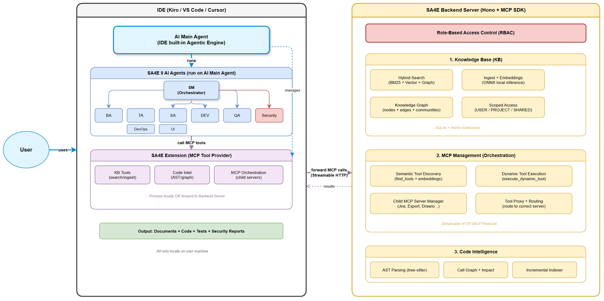

# SA4E — AI-Powered Software Delivery Platform
## Investor Pitch Deck (6 Slides)

---

## Slide 1: Vấn đề & Giải pháp

### ❌ Vấn đề: Phát triển phần mềm Enterprise quá chậm và rủi ro cao

| Vấn đề | Thực trạng | Nguồn |
|--------|-----------|-------|
| Thời gian delivery 1 feature | 2–4 tuần (team 5–9 người) | Industry average |
| Thời gian chờ giữa các phase | 40–60% tổng thời gian là chờ review/handoff | Accelerate (DORA metrics) |
| Tỷ lệ project thành công | Chỉ 35% | Standish Group CHAOS Report 2024 |
| Projects vượt timeline | 45% trễ deadline | CHAOS Report 2024 |
| Lỗi phát hiện muộn (ở QA/Production) | Tốn gấp 6–10x thời gian sửa so với phát hiện sớm | IBM Systems Sciences Institute |
| Tài liệu bị bỏ qua | >60% projects thiếu docs → mất kiến thức khi người rời team | PMI Pulse of the Profession |

### ✅ Giải pháp: SA4E — Đội ngũ AI 9 chuyên gia, chạy tự động từ A→Z

> **Nhập 1 Jira ticket → Nhận: tài liệu + code + tests + deploy — trong vài giờ thay vì vài tuần.**

```
📋 Jira Ticket → 🤖 SA4E Pipeline → 📦 Sản phẩm hoàn chỉnh
```

---

## Slide 2: Sản phẩm — 9 AI Agents, 7 Phases, Tự động hoàn toàn

### Đội ngũ AI thay thế cả team:

| AI Agent | Vai trò | Output |
|----------|---------|--------|
| 🎯 Scrum Master | Điều phối toàn bộ pipeline | Quản lý tiến độ, quality gates |
| 📝 Business Analyst | Phân tích yêu cầu | BRD + FSD (tài liệu nghiệp vụ) |
| 📐 Technical Analyst | Chi tiết hóa kỹ thuật | API contracts, pseudocode |
| 🏗️ Solution Architect | Thiết kế kiến trúc | TDD + diagrams chuyên nghiệp |
| 🧪 QA Engineer | Lập kế hoạch & chạy test | STP + 50+ test cases + test report |
| 💻 Developer | Viết code + user guide | Source code + UG (clean, SOLID) |
| 🚀 DevOps | CI/CD + deploy + release | Dockerfile + pipeline + DPG + RLN |
| 🔒 Security Engineer | 4 checkpoints bảo mật | Security Review + Pentest Report |
| 🎨 UI Designer | Wireframe & mockup | Draw.io wireframes |

### Features nổi bật:

| Feature | Mô tả |
|---------|--------|
| **Full SDLC Automation** | 7 phases từ Requirements → Deployment, tự động chuyển tiếp |
| **Quality Gates** | Kiểm tra tự động sau mỗi phase — không bỏ sót lỗi |
| **Feedback Loop** | BA ↔ SA tự phát hiện và sửa mâu thuẫn (max 5 vòng) |
| **4 Security Checkpoints** | Design review → Code audit → Pentest → Deploy review |
| **Knowledge Base (tự học)** | Vector search — hệ thống nhớ mọi quyết định, càng dùng càng giỏi |
| **Code Intelligence** | Phân tích AST, call graph, impact analysis — hiểu code như senior dev |
| **Jira Integration** | Tự động transition status, attach DOCX, đọc comments |
| **Auto Documentation** | 8+ tài liệu chuyên nghiệp + diagrams (draw.io → PNG) |
| **Traceability (RTM)** | Requirement → Design → Code → Test — full audit trail |
| **Local-first & Secure** | Data chạy local, không gửi ra cloud bên thứ 3 |
| **Multi-agent Coordination** | 9 agents phối hợp, mỗi agent chuyên 1 lĩnh vực |
| **Circuit Breaker** | Tự dừng khi lỗi lặp lại — không lãng phí tài nguyên |
| **Self-learning** | Ingest kinh nghiệm vào KB → apply cho projects sau |
| **Semantic Tool Discovery** | AI tìm đúng tool cần dùng từ hàng trăm tools available |
| **Resume Capability** | Tắt giữa chừng → bật lại chạy tiếp từ đúng nơi dừng |

---

## Slide 3: Kiến trúc Hệ thống



### Luồng hoạt động:

| Bước | Mô tả |
|------|--------|
| 1️⃣ | User sử dụng **AI Main Agent** trong IDE (Kiro / VS Code / Cursor) |
| 2️⃣ | **9 AI Agents của SA4E chạy trên AI Main Agent** — SM điều phối 8 agents còn lại |
| 3️⃣ | **SA4E Extension** chạy trong IDE, cung cấp MCP Tools cho AI Main Agent quản lý |
| 4️⃣ | 9 Agents truy cập MCP Tools thông qua Extension |
| 5️⃣ | Extension xử lý locally hoặc **forward về Backend Server** |

### Backend Server — 2 chức năng chính:

| Module | Chức năng |
|--------|-----------|
| **Knowledge Base** | Hybrid search (BM25 + Vector + Graph), ingest, scoped access (USER/PROJECT/SHARED) |
| **MCP Management** | Semantic tool discovery, dynamic execution, child server proxy (Jira, Export, Draw.io...) |

### Bảo mật:
- **Role-Based Access Control (RBAC)** — phân quyền đầy đủ trên Backend Server
- **Local-first** — Extension + Agents chạy trên máy user
- **Scoped data** — dữ liệu phân tầng USER / PROJECT / SHARED

---

## Slide 4: Điểm khác biệt — Tại sao SA4E, không phải Copilot?

### So sánh trực tiếp:

| | GitHub Copilot / ChatGPT / Cursor | **SA4E** |
|--|-----------------------------------|----------|
| **Phạm vi** | Viết code đơn lẻ | Toàn bộ SDLC (7 phases) |
| **Tài liệu** | ❌ Không tạo | ✅ 8+ docs tự động (BRD→RLN) |
| **Quality control** | ❌ Không | ✅ Quality Gates mỗi phase |
| **Bảo mật** | ❌ Không review | ✅ 4 security checkpoints |
| **Phối hợp** | 1 agent đơn lẻ | 9 agents chuyên biệt |
| **PM integration** | ❌ Không | ✅ Jira full integration |
| **Tri thức tổ chức** | ❌ Mất sau session | ✅ KB tích lũy vĩnh viễn |
| **Compliance** | ❌ Không audit trail | ✅ Full traceability + reports |
| **Testing** | ❌ Không | ✅ 6 test levels tự động |

### Competitive Moat:
- **Multi-agent orchestration** — pipeline phức tạp, không phải chatbot đơn giản
- **Enterprise-grade** — security-first, compliance-ready, documentation-complete
- **Knowledge accumulation** — mỗi project làm hệ thống thông minh hơn
- **LangGraph state machine** — resume, checkpoint, rollback

---

## Slide 5: Thị trường & Business Model

### Market Opportunity:

| Metric | Giá trị | Nguồn |
|--------|---------|-------|
| **TAM** — Tổng thị trường SDLC Automation toàn cầu | $20B (2025) → $47B (2032) | Global Info Research 2026 |
| **SAM** — Thị trường AI Code Tools (phân khúc SA4E nhắm tới) | $7.3B (2025), CAGR 26% | Mordor Intelligence 2025 |
| **SOM** — Mục tiêu doanh thu năm 1 | $2–5M ARR (doanh thu định kỳ/năm) | Nội bộ (5–50 enterprise clients × $40K–100K/năm) |

### Động lực: 76% tổ chức IT thiếu tech talent (ManpowerGroup 2025) • Demand AI roles tăng 597% trong 5 năm • Compliance tăng mạnh

### Business Model:

| Stream | Mô tả |
|--------|--------|
| Subscription (SaaS) | Starter / Professional / Enterprise tiers |
| Usage-based | Token consumption cho AI processing |
| Enterprise Support | Tùy biến + priority support |

### Unit Economics (quy đổi theo thời gian):
- **Truyền thống:** 1 feature = 2–4 tuần (team 5–9 người)
- **SA4E:** 1 feature = **2–4 giờ** (1 người + AI pipeline)
- **Tăng tốc:** **40–80x** nhanh hơn về thời gian delivery
- **Bonus:** Không mất thời gian chờ review, handoff, hay sync giữa team members

### Target: Enterprise software teams • Consulting firms • Government IT • ISVs

---

## Slide 6: Traction, Roadmap & The Ask

### ✅ Đã có (Working Beta):
- 9 agents hoạt động đầy đủ | Full 7-phase pipeline | Jira integration
- Knowledge Base + vector search | 4 security checkpoints | Auto DOCX export
- Code Intelligence (AST, call graph) | Self-learning | Resume capability

### 🗺️ Roadmap:

| Thời gian | Milestone |
|-----------|-----------|
| 2026 Q3 | Beta + 5 pilot customers |
| 2026 Q4 | GA release |
| 2027 Q1-Q2 | Multi-language (Java, Python) + Cloud SaaS |
| 2027 Q3-Q4 | Agent Marketplace + 50 customers + $2M ARR |

### 💰 The Ask: Seed Round

| Phân bổ | Mục đích |
|---------|----------|
| 50% Engineering | Cloud platform, multi-language, scale |
| 20% AI/LLM | Inference costs, fine-tuning |
| 20% Sales | Enterprise sales team |
| 10% Ops | SOC2 certification, legal |

### Tầm nhìn:

> **"Mọi tổ chức xứng đáng có đội ngũ phát triển đẳng cấp thế giới — SA4E biến điều đó thành hiện thực."**

---

*SA4E — SDLC Agents for Enterprise | Transforming how enterprises build software.*
